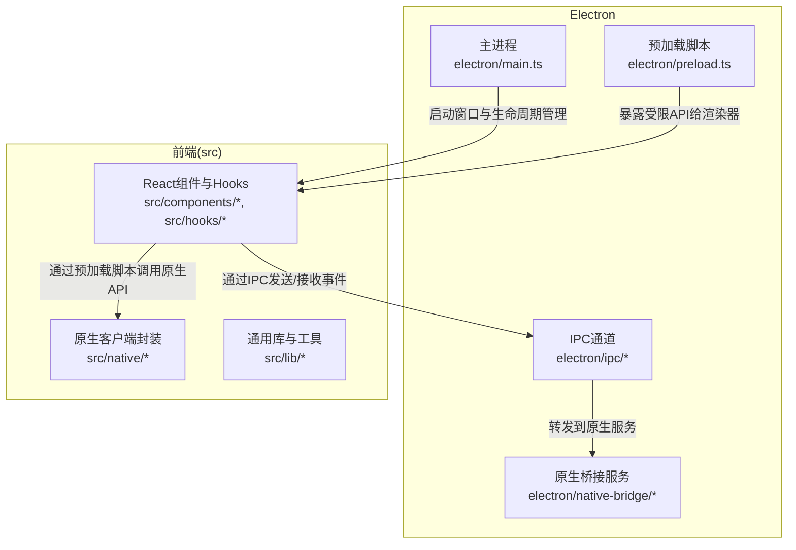
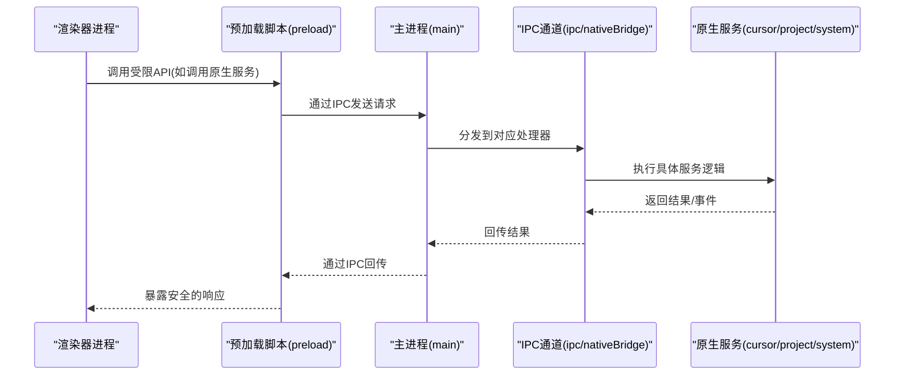
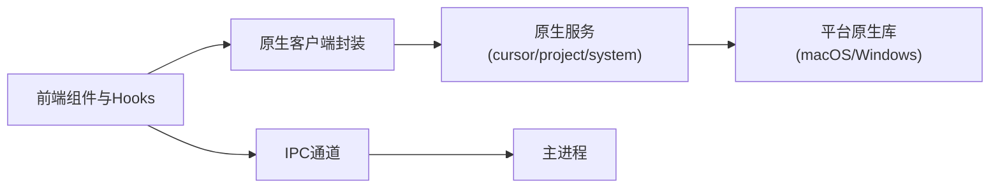

# API参考

<cite>
**本文引用的文件**
- [electron/main.ts](file://electron/main.ts)
- [electron/preload.ts](file://electron/preload.ts)
- [electron/ipc/nativeBridge.ts](file://electron/ipc/nativeBridge.ts)
- [electron/ipc/handlers.ts](file://electron/ipc/handlers.ts)
- [electron/ipc/recordingStream.ts](file://electron/ipc/recordingStream.ts)
- [electron/native-bridge/services/cursorService.ts](file://electron/native-bridge/services/cursorService.ts)
- [electron/native-bridge/services/projectService.ts](file://electron/native-bridge/services/projectService.ts)
- [electron/native-bridge/services/systemService.ts](file://electron/native-bridge/services/systemService.ts)
- [electron/native-bridge/store.ts](file://electron/native-bridge/store.ts)
- [electron/native-bridge/cursor/recording/session.ts](file://electron/native-bridge/cursor/recording/session.ts)
- [electron/native-bridge/cursor/recording/factory.ts](file://electron/native-bridge/cursor/recording/factory.ts)
- [electron/native-bridge/cursor/recording/macNativeCursorRecordingSession.ts](file://electron/native-bridge/cursor/recording/macNativeCursorRecordingSession.ts)
- [electron/native-bridge/cursor/recording/windowsNativeRecordingSession.ts](file://electron/native-bridge/cursor/recording/windowsNativeRecordingSession.ts)
- [electron/native-bridge/cursor/recording/windowsNativeRecordingSession.types.ts](file://electron/native-bridge/cursor/recording/windowsNativeRecordingSession.types.ts)
- [electron/native-bridge/cursor/adapter.ts](file://electron/native-bridge/cursor/adapter.ts)
- [electron/native-bridge/cursor/telemetryCursorAdapter.ts](file://electron/native-bridge/cursor/telemetryCursorAdapter.ts)
- [src/native/client.ts](file://src/native/client.ts)
- [src/native/contracts.ts](file://src/native/contracts.ts)
- [src/native/index.ts](file://src/native/index.ts)
- [src/components/video-editor/types.ts](file://src/components/video-editor/types.ts)
- [src/lib/recordingSession.ts](file://src/lib/recordingSession.ts)
- [src/lib/cursor/cursorTelemetryBuffer.ts](file://src/lib/cursor/cursorTelemetryBuffer.ts)
- [src/lib/cursor/nativeMacRecording.ts](file://src/lib/cursor/nativeMacRecording.ts)
- [src/lib/cursor/nativeWindowsRecording.ts](file://src/lib/cursor/nativeWindowsRecording.ts)
- [src/hooks/useScreenRecorder.ts](file://src/hooks/useScreenRecorder.ts)
- [src/hooks/recorderHandle.ts](file://src/hooks/recorderHandle.ts)
- [src/hooks/audioPeaksWorker.ts](file://src/hooks/audioPeaksWorker.ts)
- [src/utils/timeUtils.ts](file://src/utils/timeUtils.ts)
- [src/utils/platformUtils.ts](file://src/utils/platformUtils.ts)
- [electron/electron-env.d.ts](file://electron/electron-env.d.ts)
- [src/vite-env.d.ts](file://src/vite-env.d.ts)
- [package.json](file://package.json)
- [docs/02-architecture/01-ipc-communication-system.md](file://docs/02-architecture/01-ipc-communication-system.md)
- [docs/06-build/build.md](file://docs/06-build/build.md)
</cite>

## 目录
1. [简介](#简介)
2. [项目结构](#项目结构)
3. [核心组件](#核心组件)
4. [架构总览](#架构总览)
5. [详细组件分析](#详细组件分析)
6. [依赖分析](#依赖分析)
7. [性能考量](#性能考量)
8. [故障排查指南](#故障排查指南)
9. [结论](#结论)
10. [附录](#附录)

## 简介
本API参考面向OpenScreen项目的开发者与集成者，系统化梳理以下内容：
- Electron IPC API：主进程与渲染器进程的消息传递协议、事件类型与数据格式
- React组件API：组件属性、事件处理器与回调函数规范
- 原生客户端接口：cursorService、projectService、systemService等服务的公开方法与参数
- 类型定义与接口规范：数据模型、枚举类型与泛型约束
- 版本兼容性与迁移策略：废弃功能、向后兼容性与升级建议
- 使用示例、错误处理模式与性能优化要点
- API变更日志与未来规划

## 项目结构
OpenScreen采用Electron主进程+渲染器前端的双层架构，结合原生桥接模块实现跨平台屏幕录制与光标追踪能力。核心目录与职责概览如下：
- electron：主进程入口、预加载脚本、IPC通道与原生桥接服务
- src：React前端组件、Hooks、工具库与原生客户端封装
- docs：架构与开发文档（含IPC通信系统说明）

图表来源
- [electron/main.ts](file://electron/main.ts)
- [electron/preload.ts](file://electron/preload.ts)
- [electron/ipc/nativeBridge.ts](file://electron/ipc/nativeBridge.ts)
- [electron/native-bridge/services/systemService.ts](file://electron/native-bridge/services/systemService.ts)

章节来源
- [electron/main.ts](file://electron/main.ts)
- [electron/preload.ts](file://electron/preload.ts)
- [docs/02-architecture/01-ipc-communication-system.md](file://docs/02-architecture/01-ipc-communication-system.md)

## 核心组件
本节从API视角对关键模块进行分层说明，覆盖IPC、原生服务、React组件与类型定义。

- Electron IPC与预加载
  - 预加载脚本在受控环境中向渲染器暴露有限API，避免直接访问Node/Electron全局对象
  - IPC通道负责主进程与渲染器之间的消息编解码与事件分发
  - 录制流通道用于高频数据传输（如光标轨迹、音频采样）

- 原生桥接服务
  - cursorService：光标相关操作（开始/停止录制、采集策略）
  - projectService：项目状态与持久化（序列化/反序列化、导出配置）
  - systemService：系统级能力查询（权限、显示器信息、平台特性）

- React组件与Hooks
  - 视频编辑器组件：时间轴、播放控制、标注与导出面板
  - 录制相关Hooks：屏幕录制控制、麦克风/摄像头设备选择、音频峰值计算

- 原生客户端封装
  - 封装cursorService、projectService等调用，统一错误处理与返回值结构
  - 提供类型契约以确保前后端一致的数据模型

章节来源
- [electron/preload.ts](file://electron/preload.ts)
- [electron/ipc/nativeBridge.ts](file://electron/ipc/nativeBridge.ts)
- [electron/native-bridge/services/cursorService.ts](file://electron/native-bridge/services/cursorService.ts)
- [electron/native-bridge/services/projectService.ts](file://electron/native-bridge/services/projectService.ts)
- [electron/native-bridge/services/systemService.ts](file://electron/native-bridge/services/systemService.ts)
- [src/native/client.ts](file://src/native/client.ts)
- [src/native/contracts.ts](file://src/native/contracts.ts)
- [src/native/index.ts](file://src/native/index.ts)

## 架构总览
下图展示主进程、预加载脚本、渲染器、IPC通道与原生桥接服务之间的交互关系。

图表来源
- [electron/preload.ts](file://electron/preload.ts)
- [electron/ipc/nativeBridge.ts](file://electron/ipc/nativeBridge.ts)
- [electron/native-bridge/services/cursorService.ts](file://electron/native-bridge/services/cursorService.ts)
- [electron/native-bridge/services/projectService.ts](file://electron/native-bridge/services/projectService.ts)
- [electron/native-bridge/services/systemService.ts](file://electron/native-bridge/services/systemService.ts)

## 详细组件分析

### Electron IPC API
- 主进程与渲染器的消息传递
  - 渲染器通过预加载脚本发起请求，主进程在IPC通道中分发处理
  - 常见事件类型：启动/停止录制、查询系统能力、项目持久化、导出任务
  - 数据格式：JSON可序列化对象；高频数据通过二进制或流式通道传输（如录制流）

- IPC处理器与事件分发
  - handlers.ts：集中注册与实现各类IPC处理函数
  - nativeBridge.ts：封装原生服务调用，统一错误与返回结构
  - recordingStream.ts：处理录制过程中的高频事件（光标、音频、帧数据）

- 预加载脚本的安全边界
  - preload.ts：仅暴露必要API，禁止直接访问Node/Electron全局对象
  - electron-env.d.ts：声明预加载可用的全局类型

章节来源
- [electron/ipc/handlers.ts](file://electron/ipc/handlers.ts)
- [electron/ipc/nativeBridge.ts](file://electron/ipc/nativeBridge.ts)
- [electron/ipc/recordingStream.ts](file://electron/ipc/recordingStream.ts)
- [electron/preload.ts](file://electron/preload.ts)
- [electron/electron-env.d.ts](file://electron/electron-env.d.ts)
- [docs/02-architecture/01-ipc-communication-system.md](file://docs/02-architecture/01-ipc-communication-system.md)

### React组件API
- 视频编辑器组件
  - 组件属性：项目状态、播放速度、标注集合、导出配置等
  - 事件处理器：播放/暂停、跳转、添加/删除标注、应用滤镜
  - 回调函数：保存项目、触发导出、更新用户偏好

- 时间轴组件
  - 行/子行布局、关键帧标记、缩放与滚动控制
  - 交互行为：拖拽、选择、键盘快捷键支持

- UI基础组件
  - 按钮、输入框、开关、下拉菜单、音量表等，遵循设计系统与无障碍规范

- Hooks
  - useScreenRecorder：封装屏幕录制生命周期与状态
  - recorderHandle：录制会话句柄，提供开始/停止/状态查询
  - useAudioPeaks：音频峰值计算与可视化
  - useCameraDevices/useMicrophoneDevices：设备枚举与切换

章节来源
- [src/components/video-editor/TimelineEditor.tsx](file://src/components/video-editor/TimelineEditor.tsx)
- [src/components/video-editor/VideoPlayback.tsx](file://src/components/video-editor/VideoPlayback.tsx)
- [src/components/ui/button.tsx](file://src/components/ui/button.tsx)
- [src/hooks/useScreenRecorder.ts](file://src/hooks/useScreenRecorder.ts)
- [src/hooks/recorderHandle.ts](file://src/hooks/recorderHandle.ts)
- [src/hooks/audioPeaksWorker.ts](file://src/hooks/audioPeaksWorker.ts)

### 原生客户端接口
- cursorService
  - 方法：开始录制、停止录制、设置采集策略（分辨率、帧率、光标样式）
  - 参数：录制配置对象（包含源、编码参数、输出路径）
  - 返回：Promise结果与事件流（光标轨迹、点击事件）

- projectService
  - 方法：加载项目、保存项目、重置状态、生成导出清单
  - 参数：项目数据结构、导出参数
  - 返回：序列化后的项目数据或错误信息

- systemService
  - 方法：查询系统权限、显示器列表、平台特性开关
  - 参数：能力标识符
  - 返回：布尔值或能力详情对象

- 光标录制会话
  - 工厂模式：根据平台创建不同实现（macOS/Windows）
  - 适配器：将原生数据转换为前端可用的光标轨迹与事件

章节来源
- [electron/native-bridge/services/cursorService.ts](file://electron/native-bridge/services/cursorService.ts)
- [electron/native-bridge/services/projectService.ts](file://electron/native-bridge/services/projectService.ts)
- [electron/native-bridge/services/systemService.ts](file://electron/native-bridge/services/systemService.ts)
- [electron/native-bridge/cursor/recording/factory.ts](file://electron/native-bridge/cursor/recording/factory.ts)
- [electron/native-bridge/cursor/recording/session.ts](file://electron/native-bridge/cursor/recording/session.ts)
- [electron/native-bridge/cursor/adapter.ts](file://electron/native-bridge/cursor/adapter.ts)
- [electron/native-bridge/cursor/telemetryCursorAdapter.ts](file://electron/native-bridge/cursor/telemetryCursorAdapter.ts)

### 类型定义与接口规范
- 数据模型
  - 录制配置：包含源类型、编码参数、输出路径、时间范围
  - 项目数据：包含媒体片段、标注、滤镜、导出设置
  - 光标轨迹：包含时间戳、坐标、按键状态、事件类型

- 枚举类型
  - 录制状态：空闲、准备、录制中、暂停、完成、错误
  - 导出状态：待处理、进行中、完成、失败
  - 平台类型：Windows、macOS、Linux

- 泛型约束
  - 事件处理器泛型：确保回调签名与事件负载一致
  - 结果封装：统一成功/失败结构，便于前端消费

章节来源
- [src/native/contracts.ts](file://src/native/contracts.ts)
- [src/components/video-editor/types.ts](file://src/components/video-editor/types.ts)
- [src/lib/recordingSession.ts](file://src/lib/recordingSession.ts)
- [src/lib/cursor/cursorTelemetryBuffer.ts](file://src/lib/cursor/cursorTelemetryBuffer.ts)

### API版本兼容性与迁移
- 向后兼容性
  - 新增字段以默认值存在，避免破坏既有序列化
  - 保留旧事件名与数据结构一段时间，提供迁移提示

- 废弃功能迁移
  - 通过警告日志提示旧API使用，指引迁移到新接口
  - 提供自动转换器或迁移脚本辅助升级

- 版本策略
  - 主版本号变更时严格评估破坏性改动
  - 语义化版本控制，变更记录在变更日志中维护

章节来源
- [package.json](file://package.json)

## 依赖分析
- 组件耦合
  - 预加载脚本与主进程通过IPC强耦合，渲染器通过预加载间接访问原生能力
  - 原生桥接服务被多处调用，需保持稳定的接口契约

- 外部依赖
  - Electron运行时、React生态、Radix UI组件库、第三方视频/音频处理库
  - 平台原生库：ScreenCaptureKit（macOS）、Windows Game Capture（WGC）

图表来源
- [electron/ipc/nativeBridge.ts](file://electron/ipc/nativeBridge.ts)
- [electron/native-bridge/services/cursorService.ts](file://electron/native-bridge/services/cursorService.ts)
- [src/native/client.ts](file://src/native/client.ts)

章节来源
- [electron/ipc/nativeBridge.ts](file://electron/ipc/nativeBridge.ts)
- [electron/native-bridge/services/cursorService.ts](file://electron/native-bridge/services/cursorService.ts)
- [src/native/client.ts](file://src/native/client.ts)

## 性能考量
- IPC频率控制
  - 高频事件（如光标轨迹）应批量发送或降采样，避免阻塞主线程
  - 使用流式通道传输大块数据，减少序列化开销

- 渲染器优化
  - 合理拆分组件，启用懒加载与虚拟化（如时间轴）
  - 音频峰值计算在Web Worker中执行，避免UI卡顿

- 原生录制
  - macOS使用ScreenCaptureKit，Windows使用WGC，确保硬件加速与低延迟
  - 控制编码参数（分辨率、帧率、比特率）以平衡质量与性能

- 内存管理
  - 及时释放录制缓冲区与事件监听器
  - 对大型项目数据采用增量保存策略

章节来源
- [electron/ipc/recordingStream.ts](file://electron/ipc/recordingStream.ts)
- [src/hooks/audioPeaksWorker.ts](file://src/hooks/audioPeaksWorker.ts)
- [src/lib/cursor/nativeMacRecording.ts](file://src/lib/cursor/nativeMacRecording.ts)
- [src/lib/cursor/nativeWindowsRecording.ts](file://src/lib/cursor/nativeWindowsRecording.ts)

## 故障排查指南
- 常见问题
  - 权限不足：系统权限未授予导致录制失败，检查systemService返回的能力状态
  - IPC超时：高频事件未及时消费，调整批处理大小或降低采样率
  - 渲染器崩溃：预加载脚本暴露过多API或类型不匹配，精简API并完善类型校验

- 错误处理模式
  - 统一的错误包装：将原生异常转换为可读的错误对象，包含上下文信息
  - 事件驱动的错误上报：通过IPC事件向渲染器推送错误摘要

- 调试建议
  - 开启Electron调试端口，使用Chrome DevTools定位问题
  - 在录制流通道中加入采样点与时间戳，便于复现与分析

章节来源
- [electron/native-bridge/services/systemService.ts](file://electron/native-bridge/services/systemService.ts)
- [electron/ipc/nativeBridge.ts](file://electron/ipc/nativeBridge.ts)
- [src/utils/timeUtils.ts](file://src/utils/timeUtils.ts)

## 结论
OpenScreen的API体系以Electron IPC为核心，结合原生桥接服务与React组件生态，实现了跨平台的屏幕录制与视频编辑能力。通过清晰的类型定义、稳定的事件协议与完善的错误处理机制，开发者可以高效集成并扩展功能。建议在升级过程中遵循版本兼容性策略，并持续关注性能优化与平台差异。

## 附录
- API使用示例
  - 启动录制：渲染器通过预加载脚本调用cursorService.start，传入录制配置对象
  - 查询系统能力：systemService.queryCapabilities返回当前平台支持的功能列表
  - 保存项目：projectService.saveProject序列化当前编辑状态并写入存储

- API变更日志与未来规划
  - 变更日志：在仓库根目录维护CHANGELOG，记录破坏性变更与新增功能
  - 未来规划：计划引入更多平台原生能力（如Linux Wayland支持）、增强导出管线与AI辅助编辑功能

章节来源
- [docs/06-build/build.md](file://docs/06-build/build.md)