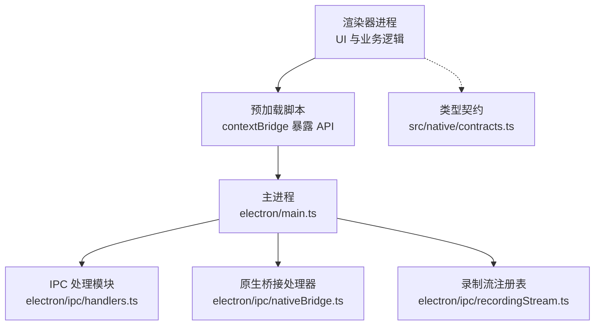
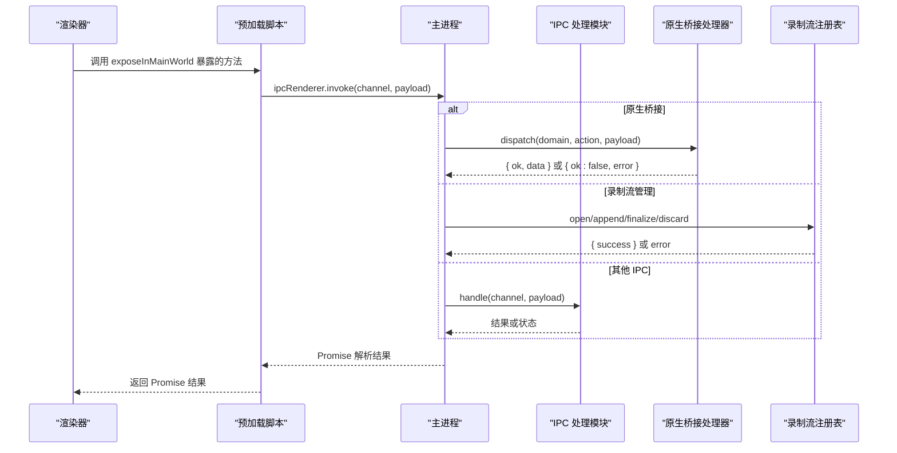
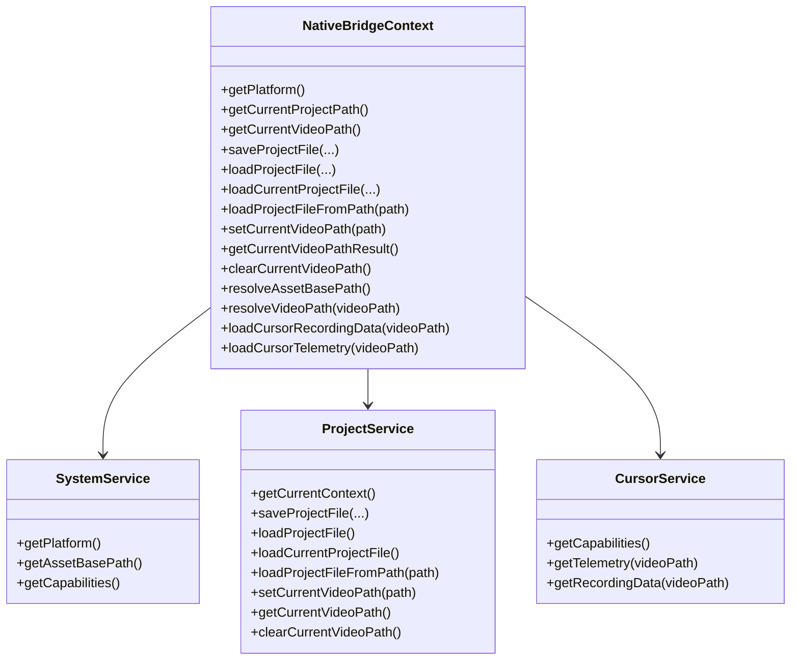
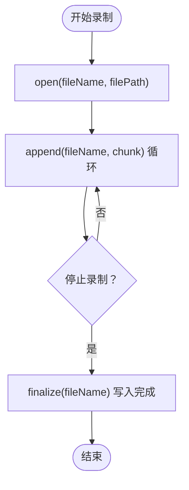
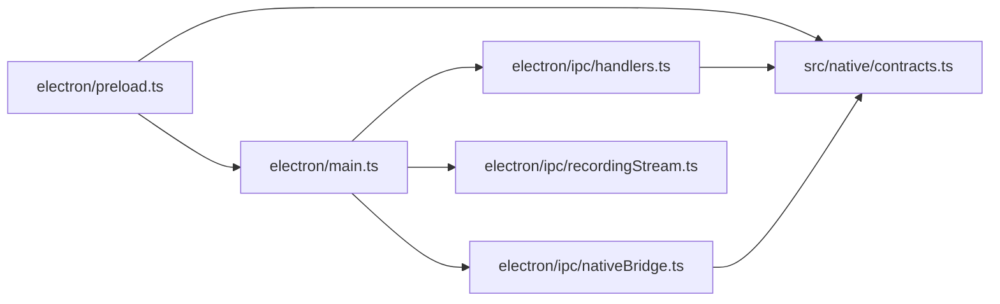

# Electron IPC API

<cite>
**本文引用的文件**
- [electron/main.ts](file://electron/main.ts)
- [electron/preload.ts](file://electron/preload.ts)
- [electron/ipc/handlers.ts](file://electron/ipc/handlers.ts)
- [electron/ipc/nativeBridge.ts](file://electron/ipc/nativeBridge.ts)
- [electron/ipc/recordingStream.ts](file://electron/ipc/recordingStream.ts)
- [src/native/contracts.ts](file://src/native/contracts.ts)
</cite>

## 目录
1. [简介](#简介)
2. [项目结构](#项目结构)
3. [核心组件](#核心组件)
4. [架构总览](#架构总览)
5. [详细组件分析](#详细组件分析)
6. [依赖关系分析](#依赖关系分析)
7. [性能考量](#性能考量)
8. [故障排查指南](#故障排查指南)
9. [结论](#结论)
10. [附录：API 参考与示例路径](#附录api-参考与示例路径)

## 简介
本文件为 OpenScreen 的 Electron IPC API 参考文档，系统性说明主进程与渲染器进程之间的消息传递协议，覆盖以下主题：
- 所有 IPC 通道名称、消息格式与数据类型
- IPCHandlers 中定义的处理程序接口（录制流管理、项目文件操作、原生桥接调用）
- 请求/响应模式、错误处理机制与异步 Promise 返回值
- 渲染器侧调用示例与主进程处理流程
- Preload 脚本的安全限制与 API 暴露机制
- 最佳实践与性能优化建议

## 项目结构
OpenScreen 的 IPC 架构由三部分组成：
- 主进程入口负责窗口生命周期、权限策略与全局事件分发
- IPC 处理模块集中注册各类“请求-响应”与“事件”通道
- 预加载脚本通过 contextBridge 将受控 API 暴露给渲染器

图表来源
- [electron/main.ts:460-574](file://electron/main.ts#L460-L574)
- [electron/preload.ts:15-281](file://electron/preload.ts#L15-L281)
- [electron/ipc/handlers.ts:1272-1599](file://electron/ipc/handlers.ts#L1272-L1599)
- [electron/ipc/nativeBridge.ts:92-237](file://electron/ipc/nativeBridge.ts#L92-L237)
- [electron/ipc/recordingStream.ts:15-148](file://electron/ipc/recordingStream.ts#L15-L148)
- [src/native/contracts.ts:1-236](file://src/native/contracts.ts#L1-L236)

章节来源
- [electron/main.ts:460-574](file://electron/main.ts#L460-L574)
- [electron/preload.ts:15-281](file://electron/preload.ts#L15-L281)

## 核心组件
- 预加载脚本（Preload）：通过 contextBridge.exposeInMainWorld 暴露有限且受控的 API 到渲染器，避免直接访问 Node/Electron API。
- IPC 处理模块（Handlers）：注册大量“handle/send/on”通道，覆盖源选择、录制控制、录制流管理、项目文件操作、系统能力查询等。
- 原生桥接处理器（Native Bridge）：统一 domain/action 协议，封装系统、项目、光标服务，返回标准化响应或错误。
- 录制流注册表（RecordingStreamRegistry）：管理磁盘写入流，支持打开、追加、关闭与丢弃，保障长录制不占用内存。
- 类型契约（Contracts）：定义原生桥接请求/响应、错误码、能力模型与数据结构。

章节来源
- [electron/preload.ts:15-281](file://electron/preload.ts#L15-L281)
- [electron/ipc/handlers.ts:1272-1599](file://electron/ipc/handlers.ts#L1272-L1599)
- [electron/ipc/nativeBridge.ts:92-237](file://electron/ipc/nativeBridge.ts#L92-L237)
- [electron/ipc/recordingStream.ts:15-148](file://electron/ipc/recordingStream.ts#L15-L148)
- [src/native/contracts.ts:1-236](file://src/native/contracts.ts#L1-L236)

## 架构总览
下图展示了从渲染器发起调用到主进程处理与回传的关键路径，以及原生桥接的域-动作协议。

图表来源
- [electron/preload.ts:15-281](file://electron/preload.ts#L15-L281)
- [electron/ipc/nativeBridge.ts:124-237](file://electron/ipc/nativeBridge.ts#L124-L237)
- [electron/ipc/recordingStream.ts:103-148](file://electron/ipc/recordingStream.ts#L103-L148)
- [electron/ipc/handlers.ts:1272-1599](file://electron/ipc/handlers.ts#L1272-L1599)

## 详细组件分析

### 预加载脚本与安全暴露机制
- 仅通过 contextBridge.exposeInMainWorld 暴露有限 API，避免渲染器直接使用 Node/Electron 能力。
- 通过 additionalArguments 注入资源基地址（如资产 URL），供渲染器使用。
- 对文件系统访问进行白名单与路径校验（见后续“项目文件操作”章节）。

章节来源
- [electron/preload.ts:15-281](file://electron/preload.ts#L15-L281)

### 原生桥接处理器（Native Bridge）
- 统一通道名与版本号，采用 domain/action 模式组织能力域：
  - system：平台信息、资源路径、系统能力
  - project：当前上下文、保存/加载项目、设置/获取视频路径
  - cursor：光标能力、遥测与录制数据
- 请求/响应格式标准化，包含 meta 与错误对象，便于追踪与重试。

图表来源
- [electron/ipc/nativeBridge.ts:19-40](file://electron/ipc/nativeBridge.ts#L19-L40)
- [electron/ipc/nativeBridge.ts:92-237](file://electron/ipc/nativeBridge.ts#L92-L237)

章节来源
- [electron/ipc/nativeBridge.ts:92-237](file://electron/ipc/nativeBridge.ts#L92-L237)
- [src/native/contracts.ts:130-224](file://src/native/contracts.ts#L130-L224)

### 录制流管理（Streaming IPC）
- 通过 RecordingStreamRegistry 在主进程维护每个录制文件名对应的写入流，实现“边录边写”，避免内存压力。
- 提供 open/append/finalize/discard 四类操作，均以 Promise 返回 { success, error? } 结构。

图表来源
- [electron/ipc/recordingStream.ts:15-96](file://electron/ipc/recordingStream.ts#L15-L96)

章节来源
- [electron/ipc/recordingStream.ts:103-148](file://electron/ipc/recordingStream.ts#L103-L148)

### 项目文件操作与路径安全
- 文件路径审批机制：仅允许 RECORDINGS_DIR 与用户显式批准的路径；导入视频扩展名白名单；路径规范化与遍历段检查。
- 项目文件加载时对媒体路径进行可信目录限定，防止恶意项目文件滥用。

章节来源
- [electron/ipc/handlers.ts:75-102](file://electron/ipc/handlers.ts#L75-L102)
- [electron/ipc/handlers.ts:219-258](file://electron/ipc/handlers.ts#L219-L258)
- [electron/ipc/handlers.ts:304-347](file://electron/ipc/handlers.ts#L304-L347)

### 录制与光标遥测
- 渲染器可调用 start/stop/pause/resume 原生录制（Windows/macOS），并支持附加摄像头与光标捕获模式。
- 光标遥测采样与资产归一化，支持写入/读取 .cursor.json 文件。

章节来源
- [electron/ipc/handlers.ts:796-834](file://electron/ipc/handlers.ts#L796-L834)
- [electron/ipc/handlers.ts:504-570](file://electron/ipc/handlers.ts#L504-L570)

## 依赖关系分析
- 预加载脚本依赖 Electron 的 ipcRenderer 与 contextBridge，向渲染器暴露方法签名。
- 主进程通过 ipcMain.handle/handleSync/on 注册通道，委托给 IPC 处理模块与原生桥接处理器。
- 录制流注册表被 IPC 处理模块与录制流通道共同使用。
- 类型契约在渲染器与主进程之间共享，确保请求/响应一致性。

图表来源
- [electron/preload.ts:15-281](file://electron/preload.ts#L15-L281)
- [electron/main.ts:460-574](file://electron/main.ts#L460-L574)
- [electron/ipc/handlers.ts:1272-1599](file://electron/ipc/handlers.ts#L1272-L1599)
- [electron/ipc/nativeBridge.ts:92-237](file://electron/ipc/nativeBridge.ts#L92-L237)
- [electron/ipc/recordingStream.ts:103-148](file://electron/ipc/recordingStream.ts#L103-L148)
- [src/native/contracts.ts:1-236](file://src/native/contracts.ts#L1-L236)

## 性能考量
- 录制流直写磁盘：通过 RecordingStreamRegistry 避免大录制占用内存，降低 OOM 风险。
- 异步 Promise 模式：所有 IPC 调用返回 Promise，避免阻塞渲染线程。
- 权限与提示最小化：主进程在合适时机触发系统权限请求，减少 UI 干扰。
- 资源路径解析：通过额外参数注入资源基地址，避免在渲染器侧进行复杂路径计算。

章节来源
- [electron/ipc/recordingStream.ts:15-96](file://electron/ipc/recordingStream.ts#L15-L96)
- [electron/main.ts:495-509](file://electron/main.ts#L495-L509)
- [electron/preload.ts:8-14](file://electron/preload.ts#L8-L14)

## 故障排查指南
- 原生桥接错误码
  - INVALID_REQUEST：请求格式不合法
  - UNSUPPORTED_ACTION：不支持的 domain/action
  - NOT_FOUND：资源不存在
  - UNAVAILABLE：资源不可用
  - INTERNAL_ERROR：内部错误（可重试）
- 录制流错误
  - 打开失败：路径无写权限或磁盘空间不足
  - 追加失败：流未打开或底层写入异常
  - 关闭/丢弃：清理临时文件或流句柄
- 光标遥测
  - 读取失败：文件缺失或解析异常
  - 样本/资产归一化：过滤非法字段，保证稳定性

章节来源
- [src/native/contracts.ts:93-127](file://src/native/contracts.ts#L93-L127)
- [electron/ipc/nativeBridge.ts:124-237](file://electron/ipc/nativeBridge.ts#L124-L237)
- [electron/ipc/recordingStream.ts:24-96](file://electron/ipc/recordingStream.ts#L24-L96)
- [electron/ipc/handlers.ts:504-570](file://electron/ipc/handlers.ts#L504-L570)

## 结论
OpenScreen 的 IPC 设计以“受控暴露 + 统一协议 + 流式处理”为核心，既保证了渲染器侧的易用性，又在主进程侧实现了安全与性能的平衡。原生桥接的域-动作协议为未来扩展提供了清晰边界；录制流管理有效支撑长时录制场景；预加载脚本的安全隔离降低了攻击面。

## 附录：API 参考与示例路径

### 预加载脚本暴露的常用 API（渲染器侧调用）
- 原生桥接
  - 调用路径：[electron/preload.ts:17-19](file://electron/preload.ts#L17-L19)
  - 请求格式：见“原生桥接请求/响应”小节
- 录制流管理
  - 打开流：[electron/preload.ts:68-76](file://electron/preload.ts#L68-L76)
  - 追加块：[electron/preload.ts:71-73](file://electron/preload.ts#L71-L73)
  - 关闭流：[electron/preload.ts:74-76](file://electron/preload.ts#L74-L76)
- 项目文件操作
  - 保存项目：[electron/preload.ts:170-172](file://electron/preload.ts#L170-L172)
  - 加载项目：[electron/preload.ts:173-175](file://electron/preload.ts#L173-L175)
  - 设置当前视频路径：[electron/preload.ts:149-151](file://electron/preload.ts#L149-L151)
- 系统与录制控制
  - 获取屏幕/摄像头权限状态：[electron/preload.ts:53-58](file://electron/preload.ts#L53-L58)
  - 原生录制控制（Windows/macOS）：[electron/preload.ts:94-117](file://electron/preload.ts#L94-L117)

章节来源
- [electron/preload.ts:15-281](file://electron/preload.ts#L15-L281)

### 主进程 IPC 处理器（通道与行为）
- 源枚举与选择
  - get-sources/select-source/get-selected-source：[electron/ipc/handlers.ts:1319-1360](file://electron/ipc/handlers.ts#L1319-L1360)
- 权限请求
  - request-camera-access/request-screen-access/request-native-mac-cursor-access：[electron/ipc/handlers.ts:1362-1400](file://electron/ipc/handlers.ts#L1362-L1400)
- 界面切换
  - switch-to-editor/switch-to-hud/start-new-recording：[electron/ipc/handlers.ts:1442-1458](file://electron/ipc/handlers.ts#L1442-L1458)
- 倒计时覆盖层
  - countdown-overlay-show/set-value/hide：[electron/ipc/handlers.ts:1460-1499](file://electron/ipc/handlers.ts#L1460-L1499)
- 原生录制可用性检测
  - is-native-windows-capture-available/is-native-mac-capture-available：[electron/ipc/handlers.ts:1501-1521](file://electron/ipc/handlers.ts#L1501-L1521)
- 原生录制启动/暂停/恢复/停止（Windows/macOS）
  - start-native-*-recording/pause/resume/stop：[electron/ipc/handlers.ts:1523-1599](file://electron/ipc/handlers.ts#L1523-L1599)
- 附加摄像头录制（macOS）
  - attach-native-mac-webcam-recording：[electron/ipc/handlers.ts:118-125](file://electron/ipc/handlers.ts#L118-L125)
- 录制流通道（主进程侧）
  - open-recording-stream/append-recording-chunk/close-recording-stream：[electron/ipc/recordingStream.ts:108-146](file://electron/ipc/recordingStream.ts#L108-L146)
- 项目文件与路径
  - save-project-file/load-project-file/load-current-project-file/load-project-file-from-path/set-current-video-path/get-current-video-path/clear-current-video-path：[electron/ipc/handlers.ts:155-187](file://electron/ipc/handlers.ts#L155-L187)

章节来源
- [electron/ipc/handlers.ts:1272-1599](file://electron/ipc/handlers.ts#L1272-L1599)
- [electron/ipc/recordingStream.ts:103-148](file://electron/ipc/recordingStream.ts#L103-L148)

### 原生桥接请求/响应与错误码
- 通道与版本
  - 通道名：NATIVE_BRIDGE_CHANNEL
  - 版本：NATIVE_BRIDGE_VERSION
- 请求结构
  - domain: "system" | "project" | "cursor"
  - action: 具体动作
  - payload: 动作所需参数
  - requestId: 请求标识（可选）
- 成功/失败响应
  - 成功：{ ok: true, data, meta }
  - 失败：{ ok: false, error: { code, message, retryable }, meta }
- 错误码
  - INVALID_REQUEST, UNSUPPORTED_ACTION, NOT_FOUND, UNAVAILABLE, INTERNAL_ERROR

章节来源
- [src/native/contracts.ts:1-236](file://src/native/contracts.ts#L1-L236)
- [electron/ipc/nativeBridge.ts:50-81](file://electron/ipc/nativeBridge.ts#L50-L81)

### 光标遥测与资产
- 数据结构
  - CursorRecordingSample/CursorRecordingData/NativeCursorAsset
- 读取与转换
  - readCursorRecordingFile/readCursorTelemetryFile
  - TelemetryCursorAdapter

章节来源
- [src/native/contracts.ts:24-54](file://src/native/contracts.ts#L24-L54)
- [electron/ipc/handlers.ts:504-570](file://electron/ipc/handlers.ts#L504-L570)
- [electron/ipc/nativeBridge.ts:12-17](file://electron/ipc/nativeBridge.ts#L12-L17)

### 安全限制与最佳实践
- 预加载脚本
  - 仅暴露必要 API，避免直接访问 Node/Electron 能力
  - 使用额外参数传递资源基地址，避免在渲染器侧进行路径计算
- 路径与文件访问
  - 严格白名单与路径校验，防止越权访问
  - 导入视频扩展名限制，确保安全性
- 录制流
  - 长录制使用流式写入，避免内存峰值
  - 明确错误返回，便于上层降级处理
- 原生桥接
  - 统一 domain/action 协议，便于扩展与测试
  - 错误码与 meta 字段便于诊断与重试

章节来源
- [electron/preload.ts:8-14](file://electron/preload.ts#L8-L14)
- [electron/ipc/handlers.ts:75-102](file://electron/ipc/handlers.ts#L75-L102)
- [electron/ipc/recordingStream.ts:15-96](file://electron/ipc/recordingStream.ts#L15-L96)
- [electron/ipc/nativeBridge.ts:92-237](file://electron/ipc/nativeBridge.ts#L92-L237)