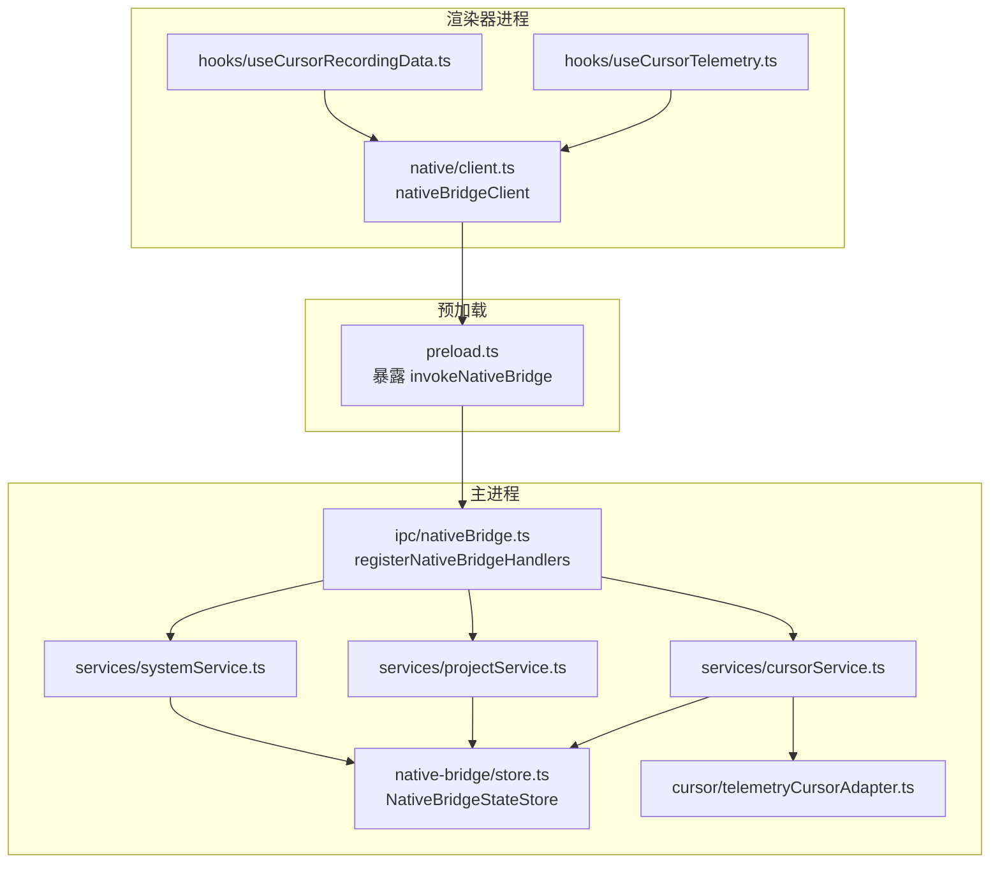
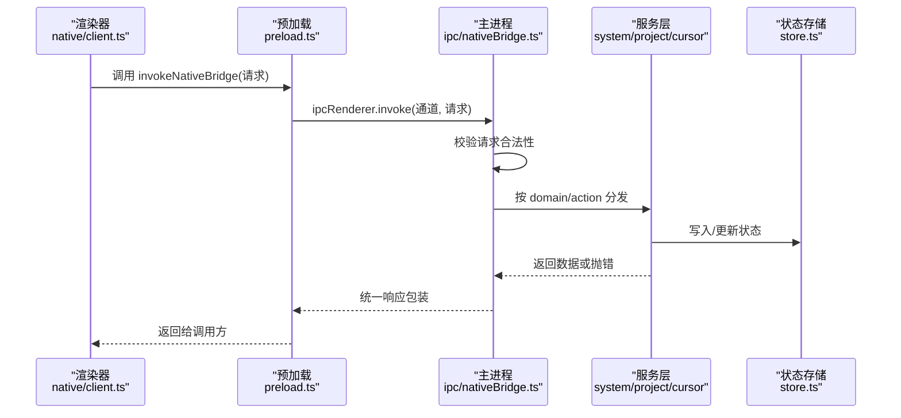
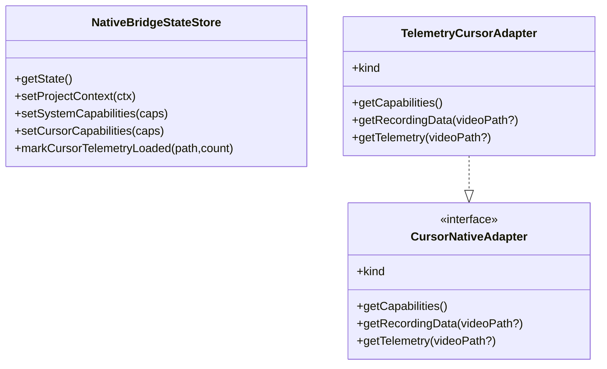
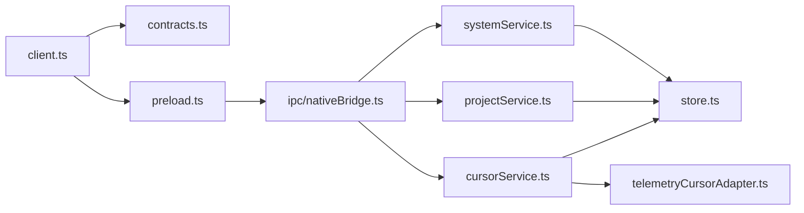
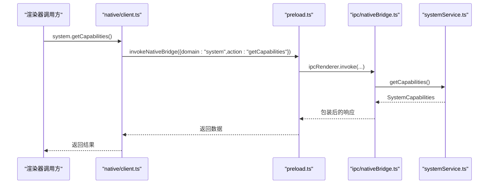
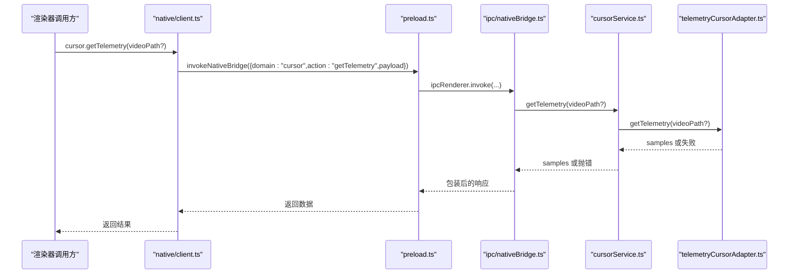
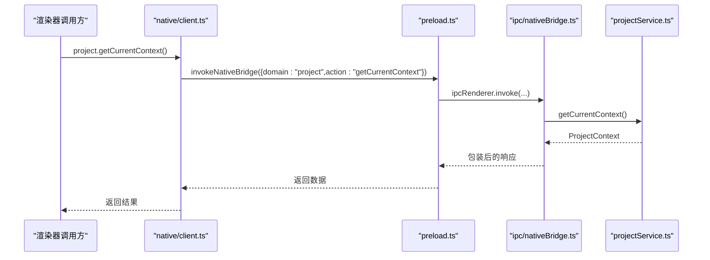

# 原生桥接处理器

<cite>
**本文引用的文件**
- [electron\native-bridge\services\cursorService.ts](file://electron\native-bridge\services\cursorService.ts)
- [electron\native-bridge\services\projectService.ts](file://electron\native-bridge\services\projectService.ts)
- [electron\native-bridge\services\systemService.ts](file://electron\native-bridge\services\systemService.ts)
- [electron\native-bridge\store.ts](file://electron\native-bridge\store.ts)
- [electron\native-bridge\cursor\adapter.ts](file://electron\native-bridge\cursor\adapter.ts)
- [electron\native-bridge\cursor\telemetryCursorAdapter.ts](file://electron\native-bridge\cursor\telemetryCursorAdapter.ts)
- [electron\native-bridge\cursor\recording\factory.ts](file://electron\native-bridge\cursor\recording\factory.ts)
- [electron\native-bridge\cursor\recording\session.ts](file://electron\native-bridge\cursor\recording\session.ts)
- [src\native\contracts.ts](file://src\native\contracts.ts)
- [src\native\client.ts](file://src\native\client.ts)
- [electron\ipc\nativeBridge.ts](file://electron\ipc\nativeBridge.ts)
- [electron\preload.ts](file://electron\preload.ts)
- [src\native\hooks\useCursorRecordingData.ts](file://src\native\hooks\useCursorRecordingData.ts)
- [src\native\hooks\useCursorTelemetry.ts](file://src\native\hooks\useCursorTelemetry.ts)
</cite>

## 目录
1. [简介](#简介)
2. [项目结构](#项目结构)
3. [核心组件](#核心组件)
4. [架构总览](#架构总览)
5. [详细组件分析](#详细组件分析)
6. [依赖关系分析](#依赖关系分析)
7. [性能考虑](#性能考虑)
8. [故障排除指南](#故障排除指南)
9. [结论](#结论)
10. [附录](#附录)

## 简介
本文件面向OpenScreen的原生桥接处理器，系统化梳理渲染器进程与主进程之间的通信接口，覆盖以下服务域的完整API规范与使用方法：
- systemService：系统能力查询、平台信息与资源路径解析
- projectService：项目上下文管理、项目文件读写与当前视频路径维护
- cursorService：游标能力探测、游标遥测数据与录制数据加载

文档同时解释原生桥接的初始化流程、服务注册机制、错误处理策略、参数校验与返回值格式，并提供安全限制、权限检查与跨平台兼容性的说明。最后给出性能优化建议与故障排除实践。

## 项目结构
原生桥接相关代码主要分布在以下位置：
- 渲染器侧客户端与Hook：src/native/*
- 主进程IPC与服务层：electron/ipc/nativeBridge.ts 与 electron/native-bridge/*
- 预加载脚本暴露桥接通道：electron/preload.ts
- 类型契约与请求/响应模型：src/native/contracts.ts

图表来源
- [src\native\client.ts:1-140](file://src\native\client.ts#L1-L140)
- [electron\preload.ts:15-31](file://electron\preload.ts#L15-L31)
- [electron\ipc\nativeBridge.ts:92-236](file://electron\ipc\nativeBridge.ts#L92-L236)
- [electron\native-bridge\store.ts:24-88](file://electron\native-bridge\store.ts#L24-L88)
- [electron\native-bridge\services\systemService.ts:16-43](file://electron\native-bridge\services\systemService.ts#L16-L43)
- [electron\native-bridge\services\projectService.ts:25-87](file://electron\native-bridge\services\projectService.ts#L25-L87)
- [electron\native-bridge\services\cursorService.ts:14-46](file://electron\native-bridge\services\cursorService.ts#L14-L46)
- [electron\native-bridge\cursor\telemetryCursorAdapter.ts:10-49](file://electron\native-bridge\cursor\telemetryCursorAdapter.ts#L10-L49)

章节来源
- [src\native\client.ts:1-140](file://src\native\client.ts#L1-L140)
- [electron\preload.ts:15-31](file://electron\preload.ts#L15-L31)
- [electron\ipc\nativeBridge.ts:92-236](file://electron\ipc\nativeBridge.ts#L92-L236)
- [electron\native-bridge\store.ts:24-88](file://electron\native-bridge\store.ts#L24-L88)

## 核心组件
- systemService：提供平台识别、资源基路径与系统能力（含游标能力）查询；能力结果会写入全局状态存储。
- projectService：封装项目上下文（当前工程路径、当前视频路径），以及保存/加载项目文件、设置/清空当前视频路径等操作；每次变更后同步更新全局状态。
- cursorService：封装游标能力查询、遥测数据与录制数据加载；对失败场景抛出错误；成功时可标记最近一次遥测加载信息到状态存储。
- NativeBridgeStateStore：集中维护系统、项目、游标三类状态，支持只更新指定子域，避免全量替换。
- CursorNativeAdapter与TelemetryCursorAdapter：抽象游标数据源适配器，默认实现仅提供遥测能力，不带系统游标资产。

章节来源
- [electron\native-bridge\services\systemService.ts:16-43](file://electron\native-bridge\services\systemService.ts#L16-L43)
- [electron\native-bridge\services\projectService.ts:25-87](file://electron\native-bridge\services\projectService.ts#L25-L87)
- [electron\native-bridge\services\cursorService.ts:14-46](file://electron\native-bridge\services\cursorService.ts#L14-L46)
- [electron\native-bridge\store.ts:24-88](file://electron\native-bridge\store.ts#L24-L88)
- [electron\native-bridge\cursor\adapter.ts:15-20](file://electron\native-bridge\cursor\adapter.ts#L15-L20)
- [electron\native-bridge\cursor\telemetryCursorAdapter.ts:10-49](file://electron\native-bridge\cursor\telemetryCursorAdapter.ts#L10-L49)

## 架构总览
原生桥接采用“请求-响应”模式，通过Electron的IPC通道进行通信。渲染器侧通过预加载脚本暴露的invokeNativeBridge发起请求，主进程在registerNativeBridgeHandlers中注册处理器，按domain/action分发到对应服务，服务执行后返回统一格式的响应。

图表来源
- [src\native\client.ts:33-50](file://src\native\client.ts#L33-L50)
- [electron\preload.ts:17-19](file://electron\preload.ts#L17-L19)
- [electron\ipc\nativeBridge.ts:124-235](file://electron\ipc\nativeBridge.ts#L124-L235)
- [electron\native-bridge\store.ts:48-87](file://electron\native-bridge\store.ts#L48-L87)

## 详细组件分析

### systemService API规范
- 功能
  - getPlatform(): 返回当前平台标识（darwin/win32/linux）
  - getAssetBasePath(): 返回资源基础路径（可能为空）
  - getCapabilities(): 计算系统能力对象，包含桥接版本、平台、游标能力与项目能力开关，并写入状态存储
- 参数与返回
  - 无显式输入参数
  - 返回 SystemCapabilities 结构体，包含 bridgeVersion、platform、cursor、project 字段
- 错误处理
  - 由上层统一捕获并包装为 NativeBridgeResponse
- 使用示例（路径）
  - 渲染器侧调用：[src\native\client.ts:54-70](file://src\native\client.ts#L54-L70)

章节来源
- [electron\native-bridge\services\systemService.ts:19-42](file://electron\native-bridge\services\systemService.ts#L19-L42)
- [src\native\contracts.ts:62-69](file://src\native\contracts.ts#L62-L69)
- [electron\ipc\nativeBridge.ts:134-149](file://electron\ipc\nativeBridge.ts#L134-L149)

### projectService API规范
- 功能
  - getCurrentContext(): 获取当前项目与视频路径上下文，并写入状态存储
  - saveProjectFile(projectData, suggestedName?, existingProjectPath?): 保存项目文件，返回 ProjectFileResult
  - loadProjectFile()/loadCurrentProjectFile()/loadProjectFileFromPath(path): 加载项目文件，返回 ProjectFileResult
  - setCurrentVideoPath(path)/getCurrentVideoPath()/clearCurrentVideoPath(): 管理当前视频路径，返回 ProjectPathResult
- 参数与返回
  - 所有方法均返回统一的 ProjectFileResult 或 ProjectPathResult 结构体
- 错误处理
  - 失败时返回包含错误码与消息的对象；成功时包含路径或项目数据
- 使用示例（路径）
  - 渲染器侧调用：[src\native\client.ts:71-119](file://src\native\client.ts#L71-L119)

章节来源
- [electron\native-bridge\services\projectService.ts:28-86](file://electron\native-bridge\services\projectService.ts#L28-L86)
- [src\native\contracts.ts:76-91](file://src\native\contracts.ts#L76-L91)
- [electron\ipc\nativeBridge.ts:152-194](file://electron\ipc\nativeBridge.ts#L152-L194)

### cursorService API规范
- 功能
  - getCapabilities(): 查询游标能力（是否支持遥测、系统游标资产、提供者类型），并写入状态存储
  - getTelemetry(videoPath?): 加载游标遥测点序列；若失败则抛出错误；成功时可标记最近一次遥测加载信息
  - getRecordingData(videoPath?): 加载游标录制数据（样本+资产）；成功时同样标记遥测加载信息
- 参数与返回
  - getTelemetry/getRecordingData 可选 videoPath；若未传入则使用状态存储中的当前视频路径
  - 返回 CursorCapabilities、CursorTelemetryPoint[]、CursorRecordingData
- 错误处理
  - getTelemetry 对失败场景抛出错误；getRecordingData 成功返回数据
- 使用示例（路径）
  - 渲染器侧调用：[src\native\client.ts:120-139](file://src\native\client.ts#L120-L139)
  - Hook封装：[src\native\hooks\useCursorTelemetry.ts:11-61](file://src\native\hooks\useCursorTelemetry.ts#L11-L61)，[src\native\hooks\useCursorRecordingData.ts:11-61](file://src\native\hooks\useCursorRecordingData.ts#L11-L61)

章节来源
- [electron\native-bridge\services\cursorService.ts:17-45](file://electron\native-bridge\services\cursorService.ts#L17-L45)
- [src\native\contracts.ts:24-54](file://src\native\contracts.ts#L24-L54)
- [electron\ipc\nativeBridge.ts:196-218](file://electron\ipc\nativeBridge.ts#L196-L218)

### 状态存储与适配器
- NativeBridgeStateStore
  - 维护 system、project、cursor 三类状态
  - 提供 setProjectContext、setSystemCapabilities、setCursorCapabilities、markCursorTelemetryLoaded 等更新方法
- CursorNativeAdapter 与 TelemetryCursorAdapter
  - CursorNativeAdapter 抽象游标数据源，TelemetryCursorAdapter 默认实现仅提供遥测能力，不带系统游标资产

图表来源
- [electron\native-bridge\store.ts:24-88](file://electron\native-bridge\store.ts#L24-L88)
- [electron\native-bridge\cursor\adapter.ts:15-20](file://electron\native-bridge\cursor\adapter.ts#L15-L20)
- [electron\native-bridge\cursor\telemetryCursorAdapter.ts:10-49](file://electron\native-bridge\cursor\telemetryCursorAdapter.ts#L10-L49)

章节来源
- [electron\native-bridge\store.ts:8-88](file://electron\native-bridge\store.ts#L8-L88)
- [electron\native-bridge\cursor\adapter.ts:1-21](file://electron\native-bridge\cursor\adapter.ts#L1-L21)
- [electron\native-bridge\cursor\telemetryCursorAdapter.ts:1-50](file://electron\native-bridge\cursor\telemetryCursorAdapter.ts#L1-L50)

### 游标录制会话工厂
- createCursorRecordingSession(options)
  - 根据平台选择具体会话实现：Windows/Mac 使用原生录制会话，Linux 使用遥测会话
  - 会话接口定义了 start/stop 生命周期，stop返回CursorRecordingData

章节来源
- [electron\native-bridge\cursor\recording\factory.ts:16-46](file://electron\native-bridge\cursor\recording\factory.ts#L16-L46)
- [electron\native-bridge\cursor\recording\session.ts:3-6](file://electron\native-bridge\cursor\recording\session.ts#L3-L6)

## 依赖关系分析
- 渲染器侧
  - native/client.ts 依赖 src/native/contracts.ts 的请求/响应契约
  - preload.ts 暴露 invokeNativeBridge 到窗口全局，供渲染器调用
- 主进程侧
  - ipc/nativeBridge.ts 注册通道处理器，注入 NativeBridgeStateStore 与各服务实例
  - 各服务依赖 CursorNativeAdapter 接口以解耦不同平台实现
- 数据流
  - 服务层执行业务逻辑后更新 NativeBridgeStateStore
  - 统一响应包装返回渲染器

图表来源
- [src\native\contracts.ts:1-236](file://src\native\contracts.ts#L1-L236)
- [src\native\client.ts:1-140](file://src\native\client.ts#L1-L140)
- [electron\preload.ts:15-31](file://electron\preload.ts#L15-L31)
- [electron\ipc\nativeBridge.ts:92-236](file://electron\ipc\nativeBridge.ts#L92-L236)
- [electron\native-bridge\store.ts:24-88](file://electron\native-bridge\store.ts#L24-L88)
- [electron\native-bridge\services\systemService.ts:16-43](file://electron\native-bridge\services\systemService.ts#L16-L43)
- [electron\native-bridge\services\projectService.ts:25-87](file://electron\native-bridge\services\projectService.ts#L25-L87)
- [electron\native-bridge\services\cursorService.ts:14-46](file://electron\native-bridge\services\cursorService.ts#L14-L46)
- [electron\native-bridge\cursor\telemetryCursorAdapter.ts:10-49](file://electron\native-bridge\cursor\telemetryCursorAdapter.ts#L10-L49)

章节来源
- [electron\ipc\nativeBridge.ts:92-236](file://electron\ipc\nativeBridge.ts#L92-L236)
- [electron\native-bridge\services\systemService.ts:16-43](file://electron\native-bridge\services\systemService.ts#L16-L43)
- [electron\native-bridge\services\projectService.ts:25-87](file://electron\native-bridge\services\projectService.ts#L25-L87)
- [electron\native-bridge\services\cursorService.ts:14-46](file://electron\native-bridge\services\cursorService.ts#L14-L46)

## 性能考虑
- 请求去抖与缓存
  - cursorService 在成功加载遥测后会记录最近一次加载的视频路径与样本数，可用于避免重复加载
- 采样与批处理
  - 游标录制会话工厂根据平台选择实现，Linux遥测会话仅采集位置，减少资源消耗
- 异步与并发
  - 渲染器侧 Hook 使用异步加载，避免阻塞UI；建议在上层做取消控制（已内置取消标志）
- 资源路径
  - systemService.getAssetBasePath 可用于定位资源，避免硬编码路径导致的IO开销

章节来源
- [electron\native-bridge\services\cursorService.ts:29-42](file://electron\native-bridge\services\cursorService.ts#L29-L42)
- [electron\native-bridge\cursor\recording\factory.ts:16-46](file://electron\native-bridge\cursor\recording\factory.ts#L16-L46)
- [src\native\hooks\useCursorTelemetry.ts:16-47](file://src\native\hooks\useCursorTelemetry.ts#L16-L47)
- [src\native\hooks\useCursorRecordingData.ts:16-47](file://src\native\hooks\useCursorRecordingData.ts#L16-L47)

## 故障排除指南
- 常见错误码
  - INVALID_REQUEST：请求格式不合法
  - UNSUPPORTED_ACTION：不支持的 domain/action
  - INTERNAL_ERROR：内部异常（通常包含可重试标记）
- 定位步骤
  - 检查渲染器侧是否正确通过 preload.ts 暴露的 invokeNativeBridge 发起请求
  - 确认主进程已调用 registerNativeBridgeHandlers 注册处理器
  - 查看服务层返回的 NativeBridgeResponse.ok 字段，失败时读取 error.code 与 message
- 典型问题
  - 无可用游标数据：cursorService.getTelemetry 在无视频路径时返回失败；请先设置当前视频路径
  - 能力查询为空：systemService.getCapabilities 依赖游标能力，确保 CursorNativeAdapter 正确实现

章节来源
- [src\native\contracts.ts:93-127](file://src\native\contracts.ts#L93-L127)
- [electron\ipc\nativeBridge.ts:124-235](file://electron\ipc\nativeBridge.ts#L124-L235)
- [electron\native-bridge\services\cursorService.ts:23-35](file://electron\native-bridge\services\cursorService.ts#L23-L35)

## 结论
原生桥接处理器通过清晰的服务分层与统一的请求/响应契约，实现了渲染器与主进程间稳定可靠的通信。systemService、projectService、cursorService分别覆盖系统能力、项目上下文与游标数据三大领域；结合状态存储与适配器模式，既保证了跨平台一致性，又便于扩展新的平台实现。建议在实际集成中严格遵循参数校验与错误处理规范，并利用状态缓存与异步加载提升性能与用户体验。

## 附录

### API调用流程（序列图：系统能力查询）

图表来源
- [src\native\client.ts:65-69](file://src\native\client.ts#L65-L69)
- [electron\preload.ts:17-19](file://electron\preload.ts#L17-L19)
- [electron\ipc\nativeBridge.ts:141-142](file://electron\ipc\nativeBridge.ts#L141-L142)
- [electron\native-bridge\services\systemService.ts:27-42](file://electron\native-bridge\services\systemService.ts#L27-L42)

### API调用流程（序列图：游标遥测加载）

图表来源
- [src\native\client.ts:132-137](file://src\native\client.ts#L132-L137)
- [electron\ipc\nativeBridge.ts:201-205](file://electron\ipc\nativeBridge.ts#L201-L205)
- [electron\native-bridge\services\cursorService.ts:23-35](file://electron\native-bridge\services\cursorService.ts#L23-L35)
- [electron\native-bridge\cursor\telemetryCursorAdapter.ts:37-48](file://electron\native-bridge\cursor\telemetryCursorAdapter.ts#L37-L48)

### API调用流程（序列图：项目上下文获取）

图表来源
- [src\native\client.ts:72-76](file://src\native\client.ts#L72-L76)
- [electron\ipc\nativeBridge.ts:155-156](file://electron\ipc\nativeBridge.ts#L155-L156)
- [electron\native-bridge\services\projectService.ts:28-36](file://electron\native-bridge\services\projectService.ts#L28-L36)

### 初始化与服务注册流程
- 主进程在启动时调用 registerNativeBridgeHandlers(context)
  - 创建 NativeBridgeStateStore 并注入各服务
  - 注册 IPC 处理器，按 domain/action 分发请求
- 渲染器通过 preload.ts 暴露的 window.electronAPI.invokeNativeBridge 调用

章节来源
- [electron\ipc\nativeBridge.ts:92-123](file://electron\ipc\nativeBridge.ts#L92-L123)
- [electron\preload.ts:15-31](file://electron\preload.ts#L15-L31)

### 跨平台与安全限制
- 平台映射
  - NodeJS.Platform 经 normalizePlatform 映射为 "darwin"|"win32"| "linux"
- 权限与访问
  - 渲染器侧存在专用权限请求接口（如 requestNativeMacCursorAccess），需在调用原生游标能力前完成授权
- 资源路径
  - 通过 systemService.getAssetBasePath 获取资源根路径，避免硬编码

章节来源
- [electron\ipc\nativeBridge.ts:42-48](file://electron\ipc\nativeBridge.ts#L42-L48)
- [electron\preload.ts:59-61](file://electron\preload.ts#L59-L61)
- [electron\native-bridge\services\systemService.ts:23-25](file://electron\native-bridge\services\systemService.ts#L23-L25)