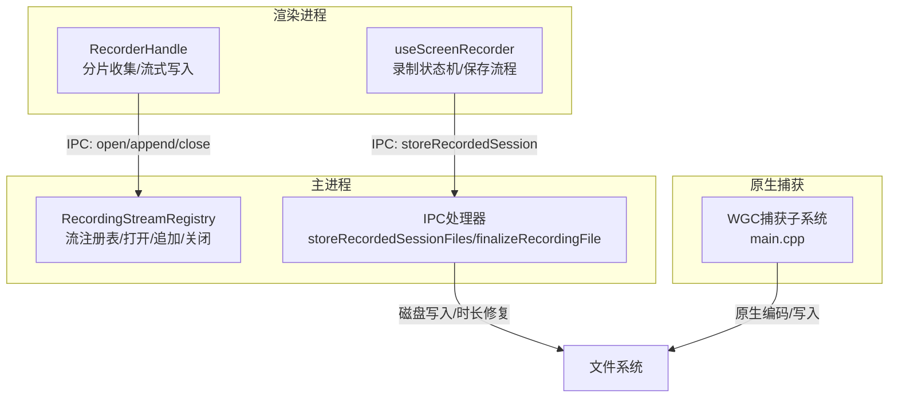
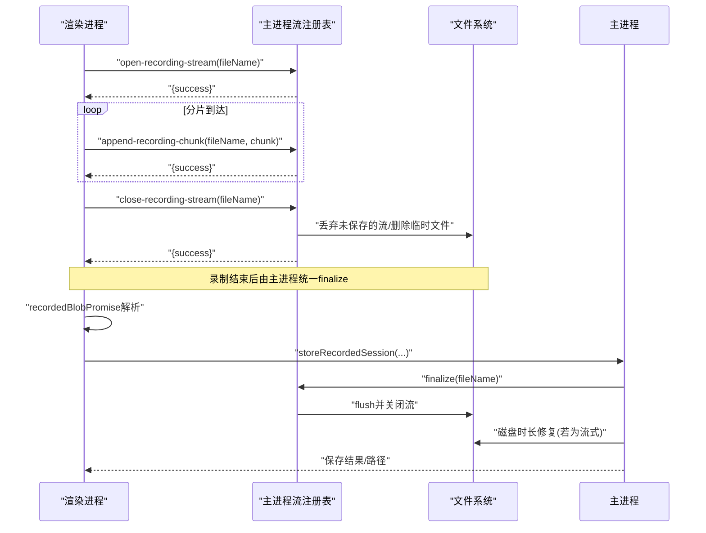
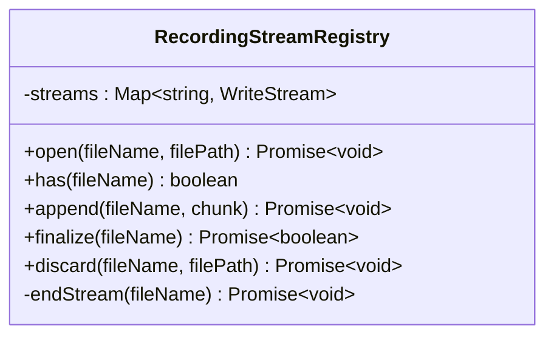
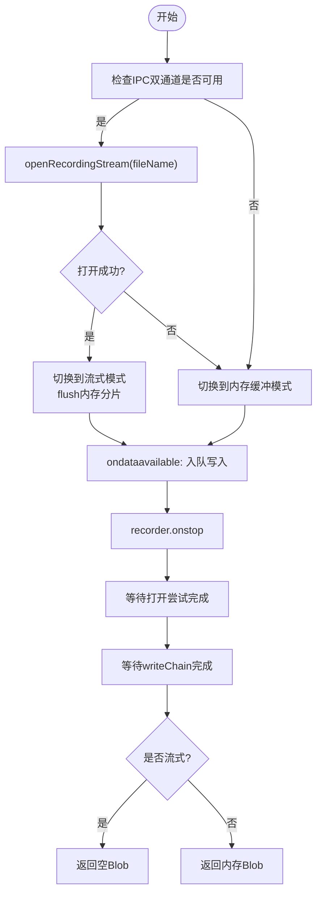
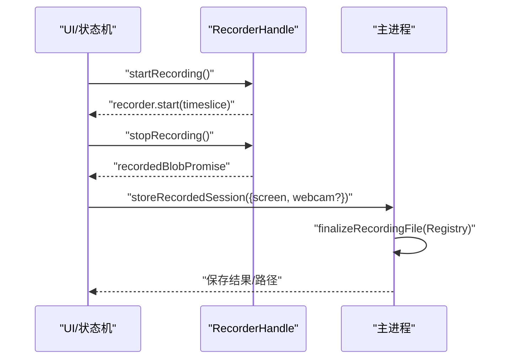
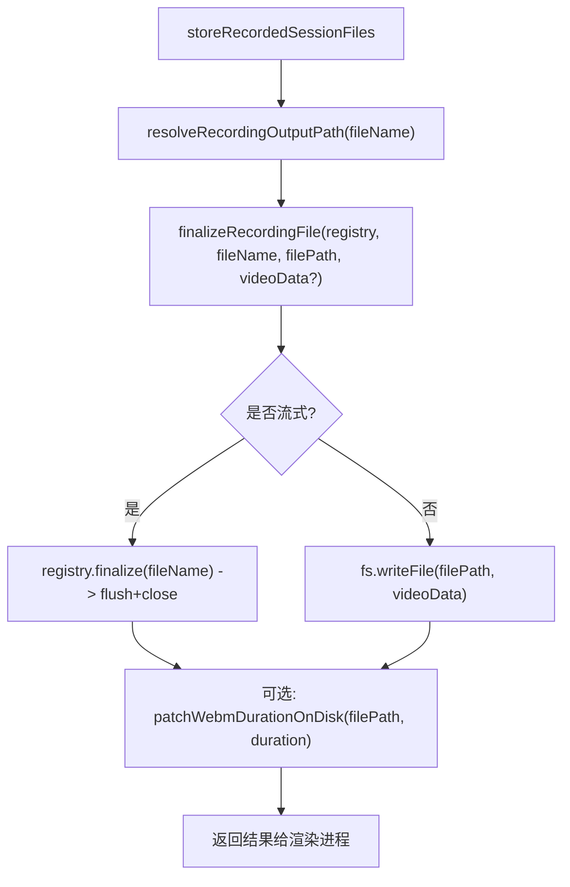
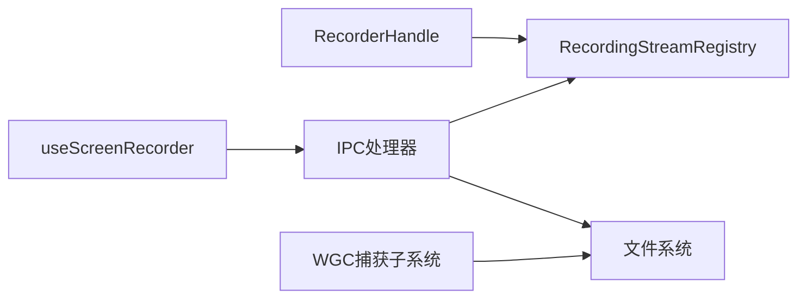

# 录制流处理器

<cite>
**本文引用的文件**
- [recordingStream.ts](file://electron/ipc/recordingStream.ts)
- [recorderHandle.ts](file://src/hooks/recorderHandle.ts)
- [useScreenRecorder.ts](file://src/hooks/useScreenRecorder.ts)
- [handlers.ts](file://electron/ipc/handlers.ts)
- [recordingStream.test.ts](file://electron/ipc/recordingStream.test.ts)
- [01-screen-recording-system.md](file://docs/03-recording/01-screen-recording-system.md)
- [cursorTelemetryBuffer.ts](file://src/lib/cursorTelemetryBuffer.ts)
- [main.cpp](file://electron/native/wgc-capture/src/main.cpp)
</cite>

## 目录
1. [简介](#简介)
2. [项目结构](#项目结构)
3. [核心组件](#核心组件)
4. [架构总览](#架构总览)
5. [详细组件分析](#详细组件分析)
6. [依赖关系分析](#依赖关系分析)
7. [性能考量](#性能考量)
8. [故障排查指南](#故障排查指南)
9. [结论](#结论)
10. [附录](#附录)

## 简介
本文件面向OpenScreen的录制流处理器，系统化梳理录制流的生命周期管理（创建、启动、暂停、恢复、停止）、会话注册表的并发协调、初始化参数、缓冲与内存优化、错误处理、临时存储与流式写入、最终文件处理流程，以及性能监控与调试最佳实践。目标读者既包括需要快速上手的开发者，也包括希望深入理解实现细节的技术人员。

## 项目结构
OpenScreen的录制流涉及三个主要层面：
- 渲染进程：负责MediaRecorder的创建、分片收集、流式写入调度与回退策略。
- 主进程：负责磁盘流的打开、追加、关闭与丢弃，以及录制文件的最终落盘与时长修复。
- 原生捕获（可选）：通过原生捕获子系统（如Windows WGC）直接生成视频帧，绕过浏览器编码路径。

**图表来源**
- [recordingStream.ts:15-96](file://electron/ipc/recordingStream.ts#L15-L96)
- [recorderHandle.ts:38-161](file://src/hooks/recorderHandle.ts#L38-L161)
- [handlers.ts:2202-2240](file://electron/ipc/handlers.ts#L2202-L2240)
- [main.cpp:397-436](file://electron/native/wgc-capture/src/main.cpp#L397-L436)

**章节来源**
- [recordingStream.ts:1-148](file://electron/ipc/recordingStream.ts#L1-L148)
- [recorderHandle.ts:1-161](file://src/hooks/recorderHandle.ts#L1-L161)
- [handlers.ts:260-302](file://electron/ipc/handlers.ts#L260-L302)
- [main.cpp:397-436](file://electron/native/wgc-capture/src/main.cpp#L397-L436)

## 核心组件
- RecordingStreamRegistry：主进程侧的录制流注册表，负责按“文件名”键值管理磁盘写入流，提供打开、追加、关闭与丢弃能力，并保证并发安全与错误兜底。
- RecorderHandle：渲染进程侧的录制句柄包装，封装MediaRecorder与流式写入链路，支持内存回退、写入序列化与错误传播。
- useScreenRecorder：顶层录制状态机与保存流程编排，协调屏幕/摄像头录制、WebM时长修复、最终落盘与UI反馈。
- IPC处理器：注册流式写入相关IPC接口，实现storeRecordedSessionFiles与finalizeRecordingFile等关键逻辑。
- 原生捕获：Windows WGC捕获子系统，负责高帧率、硬件加速的屏幕/窗口捕获与编码输出。

**章节来源**
- [recordingStream.ts:15-96](file://electron/ipc/recordingStream.ts#L15-L96)
- [recorderHandle.ts:3-25](file://src/hooks/recorderHandle.ts#L3-L25)
- [useScreenRecorder.ts:90-130](file://src/hooks/useScreenRecorder.ts#L90-L130)
- [handlers.ts:2202-2240](file://electron/ipc/handlers.ts#L2202-L2240)

## 架构总览
录制流从渲染进程开始，通过IPC将分片写入主进程的流注册表；主进程以“文件名”为键维护写入流，确保长录制不占用过多内存。录制结束时，主进程根据是否已流式写入决定是否进行磁盘时长修复；同时，渲染进程在未流式写入的情况下，负责对内存中的WebM进行时长修复后再落盘。

**图表来源**
- [recordingStream.ts:103-147](file://electron/ipc/recordingStream.ts#L103-L147)
- [recorderHandle.ts:83-108](file://src/hooks/recorderHandle.ts#L83-L108)
- [handlers.ts:2202-2240](file://electron/ipc/handlers.ts#L2202-L2240)

## 详细组件分析

### RecordingStreamRegistry 类
- 职责
  - 按“文件名”键值管理WriteStream，避免跨会话冲突。
  - 打开流时等待“open”事件，确保路径与权限错误即时暴露，避免静默失败。
  - 追加分片时抛出明确异常，便于渲染进程感知失败并回退。
  - 提供finalize/discard，分别用于正常结束与取消/失败后的清理。
- 并发与一致性
  - 使用Map按文件名索引流，避免竞态。
  - 写入采用串行化（见RecorderHandle的writeChain），确保到达顺序与停止前的收尾。
- 错误处理
  - 流级错误监听，避免未处理异常导致主进程崩溃。
  - 追加失败与打开失败均以异常形式返回，渲染端据此切换到内存回退。

**图表来源**
- [recordingStream.ts:15-96](file://electron/ipc/recordingStream.ts#L15-L96)

**章节来源**
- [recordingStream.ts:15-96](file://electron/ipc/recordingStream.ts#L15-L96)

### RecorderHandle：渲染进程录制句柄
- 生命周期
  - 创建：构造MediaRecorder，设置timeslice为1秒，避免长时间累积内存。
  - 启动：调用start(TIMESLICE)后进入分片收集阶段。
  - 追加：当IPC双通道可用时，优先走流式写入；否则进入内存缓冲。
  - 结束：等待打开尝试与所有排队写入完成，再根据模式返回空Blob或内存Blob。
- 流式写入保障
  - 使用writeChain串行化append，确保到达顺序与停止前的收尾。
  - 若IPC任一环节失败，appendError被设置，finalize阶段抛出错误，避免静默截断。
- 内存回退
  - 当流式打开失败或仅部分打开时，所有分片暂存在memoryChunks中，最终合并为Blob。
- 错误传播
  - recorder.onerror触发reject，recordedBlobPromise在finalize阶段抛出appendError。

**图表来源**
- [recorderHandle.ts:55-130](file://src/hooks/recorderHandle.ts#L55-L130)

**章节来源**
- [recorderHandle.ts:38-161](file://src/hooks/recorderHandle.ts#L38-L161)

### useScreenRecorder：录制状态机与保存流程
- 状态机
  - idle → starting → recording → stopping → idle/error
  - 支持暂停/恢复（取决于平台与录制类型）
- 保存流程
  - 录制结束：等待各RecorderHandle的recordedBlobPromise，必要时对WebM进行时长修复。
  - 调用storeRecordedSession，传入屏幕与摄像头（如有）的文件名与数据。
  - 主进程finalize对应流并进行磁盘时长修复（若为流式）。
  - 成功后更新当前会话或视频路径，并切换到编辑器。
- 异常与清理
  - 任何未保存的流都会在finally中被discard，避免资源泄漏。

**图表来源**
- [useScreenRecorder.ts:303-421](file://src/hooks/useScreenRecorder.ts#L303-L421)
- [handlers.ts:2202-2240](file://electron/ipc/handlers.ts#L2202-L2240)

**章节来源**
- [useScreenRecorder.ts:90-130](file://src/hooks/useScreenRecorder.ts#L90-L130)
- [useScreenRecorder.ts:303-421](file://src/hooks/useScreenRecorder.ts#L303-L421)

### IPC处理器：流式写入与最终落盘
- 注册流式写入IPC
  - open-recording-stream：打开流并等待open事件，失败则返回错误。
  - append-recording-chunk：追加分片，失败返回错误。
  - close-recording-stream：丢弃未保存的流与临时文件。
- 最终落盘与修复
  - storeRecordedSessionFiles：根据是否流式，决定是否写入内存数据，并调用finalizeRecordingFile。
  - finalizeRecordingFile：关闭流；若非流式且有内存数据，则写入文件。
  - 时长修复：对流式文件执行磁盘级WebM时长修复，确保播放器正确显示时长。

**图表来源**
- [handlers.ts:2202-2240](file://electron/ipc/handlers.ts#L2202-L2240)
- [handlers.ts:291-302](file://electron/ipc/handlers.ts#L291-L302)

**章节来源**
- [handlers.ts:260-302](file://electron/ipc/handlers.ts#L260-L302)
- [handlers.ts:2202-2240](file://electron/ipc/handlers.ts#L2202-L2240)

### 原生捕获（Windows WGC）
- 初始化与约束
  - 解析显示器/窗口源，校验尺寸与帧率，按分辨率选择码率。
  - 首帧超时保护：等待首帧写入，超时则停止所有捕获并返回错误。
- 编码与输出
  - 启动视频写入器，输出录制开始事件，随后持续写入帧数据至文件。

**章节来源**
- [main.cpp:397-436](file://electron/native/wgc-capture/src/main.cpp#L397-L436)
- [main.cpp:771-817](file://electron/native/wgc-capture/src/main.cpp#L771-L817)

## 依赖关系分析
- 渲染进程依赖主进程提供的IPC接口，以实现流式写入。
- 主进程依赖RecordingStreamRegistry管理流，依赖文件系统进行写入与删除。
- useScreenRecorder作为编排者，串联渲染与主进程逻辑，并负责WebM时长修复。
- 原生捕获子系统独立于上述流程，但其产物同样通过主进程的存储与修复流程整合。

**图表来源**
- [recorderHandle.ts:38-161](file://src/hooks/recorderHandle.ts#L38-L161)
- [recordingStream.ts:15-96](file://electron/ipc/recordingStream.ts#L15-L96)
- [handlers.ts:2202-2240](file://electron/ipc/handlers.ts#L2202-L2240)
- [main.cpp:397-436](file://electron/native/wgc-capture/src/main.cpp#L397-L436)

**章节来源**
- [recordingStream.test.ts:1-84](file://electron/ipc/recordingStream.test.ts#L1-L84)

## 性能考量
- 分片大小与时序
  - 使用1秒timeslice限制单次内存占用，降低长录制峰值内存。
- 编码参数自适应
  - 根据分辨率与目标帧率动态调整码率，兼顾质量与体积。
- 无音频轨道
  - 默认不采集音频，减少CPU与文件体积。
- 原生捕获
  - Windows WGC路径下采用硬件加速编码，提升高分辨率/高帧率场景下的稳定性。

**章节来源**
- [recorderHandle.ts:1-2](file://src/hooks/recorderHandle.ts#L1-L2)
- [useScreenRecorder.ts:18-31](file://src/hooks/useScreenRecorder.ts#L18-L31)
- [main.cpp:435-436](file://electron/native/wgc-capture/src/main.cpp#L435-L436)

## 故障排查指南
- 流式写入失败
  - 现象：打开成功但追加失败，或IPC调用被拒绝。
  - 处理：渲染端自动切换到内存缓冲；最终保存时对内存Blob进行时长修复。
  - 参考：RecorderHandle的openPromise与appendError处理。
- 首帧超时（原生捕获）
  - 现象：启动后长时间无输出，最终停止并报错。
  - 处理：检查显示器/窗口句柄有效性、权限与驱动状态。
  - 参考：WGC捕获子系统的超时逻辑。
- 时长缺失
  - 现象：播放器无法正确显示时长。
  - 处理：主进程对流式文件执行磁盘时长修复；内存文件在渲染端修复。
  - 参考：storeRecordedSessionFiles与finalizeRecordingFile。
- 资源泄漏
  - 现象：未保存的流或临时文件未清理。
  - 处理：主进程在失败/取消时调用discard；渲染端在finally中调用RecorderHandle.discard。
  - 参考：useScreenRecorder的finally块与RecorderHandle.discard。

**章节来源**
- [recorderHandle.ts:55-108](file://src/hooks/recorderHandle.ts#L55-L108)
- [handlers.ts:2202-2240](file://electron/ipc/handlers.ts#L2202-L2240)
- [main.cpp:771-817](file://electron/native/wgc-capture/src/main.cpp#L771-L817)

## 结论
OpenScreen的录制流处理器通过“渲染进程流式写入 + 主进程统一落盘与修复”的架构，在保证低内存占用的同时，提供了稳健的录制体验。RecordingStreamRegistry承担了并发与可靠性关键职责，RecorderHandle与useScreenRecorder分别在两端实现了优雅的回退与编排。配合原生捕获与性能优化策略，系统可在高负载场景下保持稳定与高效。

## 附录

### 录制会话生命周期API清单
- 渲染进程
  - createRecorderHandle(stream, options, fileName?)
  - RecorderHandle接口：recordedBlobPromise、isStreaming()、discard()
- 主进程
  - registerRecordingStreamHandlers(ipcMain, registry, resolveRecordingOutputPath)
  - RecordingStreamRegistry：open/append/finalize/discard/has
- 存储与修复
  - storeRecordedSessionFiles(payload)
  - finalizeRecordingFile(registry, fileName, filePath, videoData?)

**章节来源**
- [recorderHandle.ts:3-25](file://src/hooks/recorderHandle.ts#L3-L25)
- [recordingStream.ts:103-147](file://electron/ipc/recordingStream.ts#L103-L147)
- [handlers.ts:2202-2240](file://electron/ipc/handlers.ts#L2202-L2240)

### 录制流初始化参数与缓冲策略
- 初始化参数
  - mimeType：默认video/webm，优先选择h264以获得硬件加速与更佳实时性。
  - timeslice：1000ms，控制分片大小与内存峰值。
  - 分辨率/帧率/码率：按分辨率与目标帧率自适应计算。
- 缓冲与内存优化
  - 流式写入：分片到达即写入磁盘，避免累积。
  - 内存回退：打开失败或仅部分打开时，分片暂存于内存，最终合并Blob。
  - WebM时长修复：内存路径在渲染端修复；流式路径在主进程磁盘修复。

**章节来源**
- [useScreenRecorder.ts:137-167](file://src/hooks/useScreenRecorder.ts#L137-L167)
- [recorderHandle.ts:1-2](file://src/hooks/recorderHandle.ts#L1-L2)
- [01-screen-recording-system.md:187-203](file://docs/03-recording/01-screen-recording-system.md#L187-L203)

### 录制文件临时存储与最终处理流程
- 临时存储
  - 流式：主进程按文件名打开WriteStream，分片追加至磁盘。
  - 内存：渲染进程聚合Blob，待最终落盘。
- 流式写入
  - 录制结束：主进程finalize，flush并关闭流；若为流式，后续磁盘修复时长。
- 内存回退
  - 录制结束：渲染进程对Blob进行时长修复，主进程写入文件。
- 最终处理
  - 主进程：storeRecordedSessionFiles统一调用finalizeRecordingFile，修复时长并返回结果。

**章节来源**
- [handlers.ts:2202-2240](file://electron/ipc/handlers.ts#L2202-L2240)
- [handlers.ts:291-302](file://electron/ipc/handlers.ts#L291-L302)

### 性能监控与调试最佳实践
- 监控指标
  - 录制时长、内存峰值、分片延迟、写入失败率、首帧耗时。
- 调试建议
  - 开启详细日志：主进程流错误监听、渲染端appendError记录。
  - 逐步降级：优先启用硬件编码、降低分辨率/帧率/码率验证稳定性。
  - 快速复现：利用单元测试覆盖流替换与错误路径（参考测试用例）。

**章节来源**
- [recordingStream.ts:36-41](file://electron/ipc/recordingStream.ts#L36-L41)
- [recordingStream.test.ts:74-84](file://electron/ipc/recordingStream.test.ts#L74-L84)