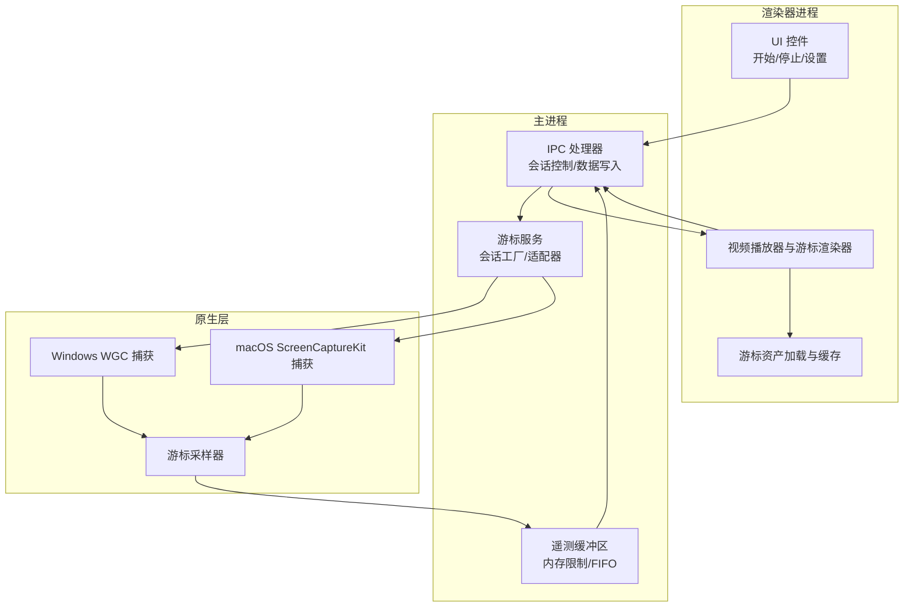
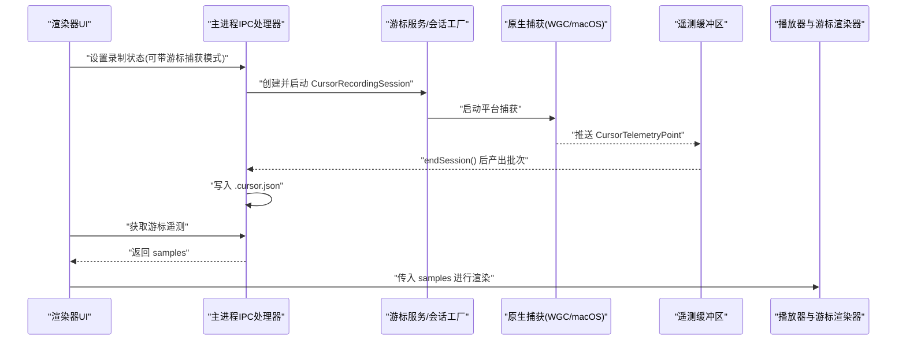
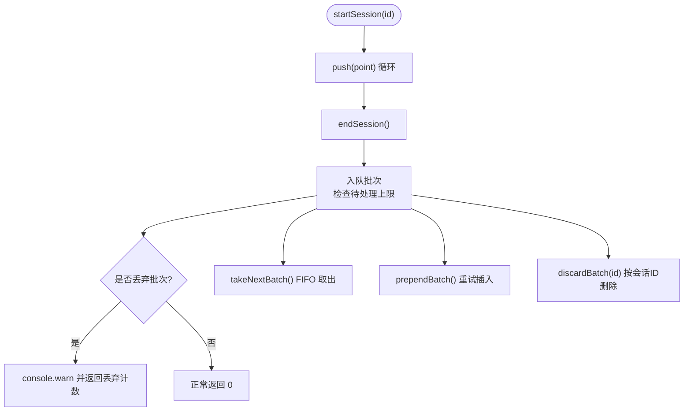
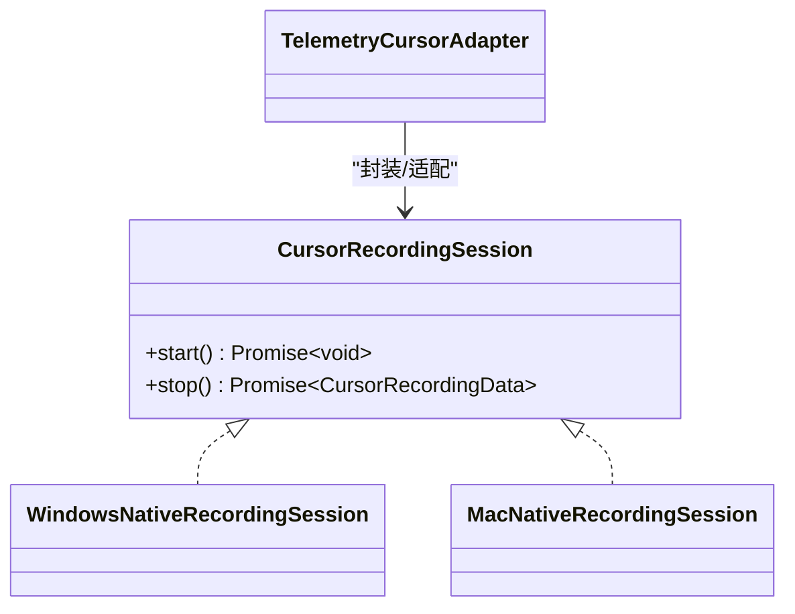
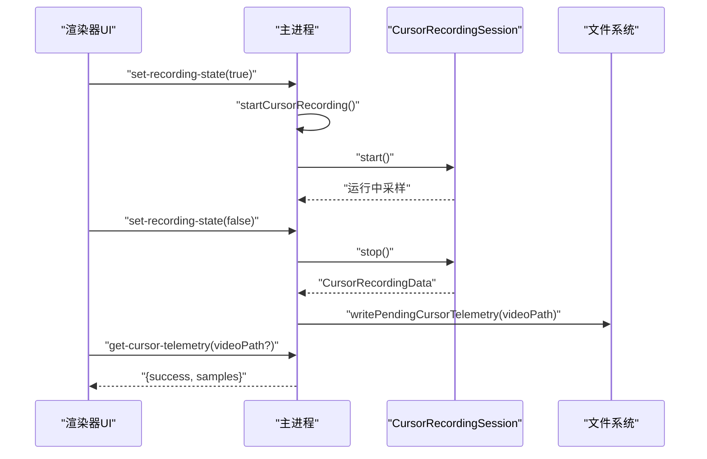
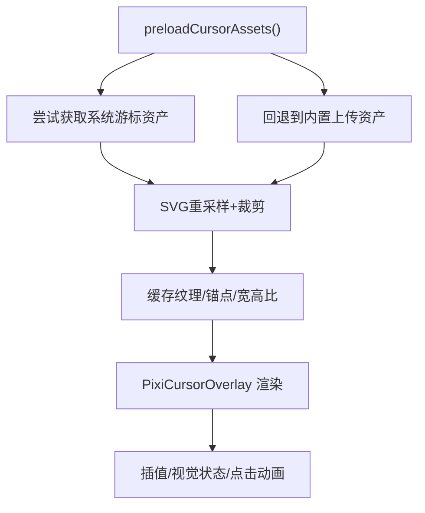
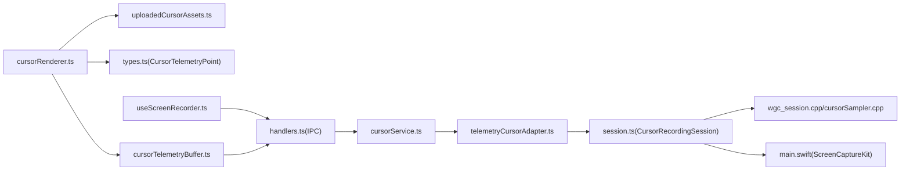

# 游标录制API

<cite>
**本文引用的文件**
- [cursorTelemetryBuffer.ts](file://src/lib/cursorTelemetryBuffer.ts)
- [cursorTelemetryBuffer.test.ts](file://src/lib/cursorTelemetryBuffer.test.ts)
- [handlers.ts](file://electron/ipc/handlers.ts)
- [session.ts](file://electron/native-bridge/cursor/recording/session.ts)
- [cursorRenderer.ts](file://src/components/video-editor/videoPlayback/cursorRenderer.ts)
- [uploadedCursorAssets.ts](file://src/components/video-editor/videoPlayback/uploadedCursorAssets.ts)
- [useScreenRecorder.ts](file://src/hooks/useScreenRecorder.ts)
- [cursorService.ts](file://electron/native-bridge/services/cursorService.ts)
- [telemetryCursorAdapter.ts](file://electron/native-bridge/cursor/telemetryCursorAdapter.ts)
- [cursorSampler.cpp](file://electron/native/wgc-capture/src/cursor-sampler.cpp)
- [wgc_session.cpp](file://electron/native/wgc-capture/src/wgc_session.cpp)
- [main.swift](file://electron/native/screencapturekit/Sources/OpenScreenMacOSCursorHelper/main.swift)
</cite>

## 目录
1. [简介](#简介)
2. [项目结构](#项目结构)
3. [核心组件](#核心组件)
4. [架构总览](#架构总览)
5. [详细组件分析](#详细组件分析)
6. [依赖关系分析](#依赖关系分析)
7. [性能考虑](#性能考虑)
8. [故障排查指南](#故障排查指南)
9. [结论](#结论)
10. [附录](#附录)

## 简介
本文件为 OpenScreen 的游标录制 API 提供系统化技术文档，覆盖以下主题：
- 游标录制的启动、停止与数据获取接口
- 游标遥测数据格式规范、采样频率控制与数据压缩策略
- 游标录制会话管理（状态跟踪、暂停/恢复、错误处理）
- 游标资产的上传、下载与缓存机制
- 渲染器进程中的控制方式与主进程的数据流处理
- 实时处理、历史记录查询与数据导出
- 性能优化与数据质量保障实践

## 项目结构
OpenScreen 的游标录制涉及三层协作：
- 渲染器进程：负责 UI 控制、资产加载与播放渲染
- 主进程：负责 IPC 协调、会话生命周期管理与数据持久化
- 原生层：负责平台级捕获（Windows WGC、macOS ScreenCaptureKit）与采样

图表来源
- [handlers.ts:800-999](file://electron/ipc/handlers.ts#L800-L999)
- [cursorTelemetryBuffer.ts:25-213](file://src/lib/cursorTelemetryBuffer.ts#L25-L213)
- [session.ts:1-7](file://electron/native-bridge/cursor/recording/session.ts#L1-L7)
- [cursorRenderer.ts:175-271](file://src/components/video-editor/videoPlayback/cursorRenderer.ts#L175-L271)
- [cursorSampler.cpp](file://electron/native/wgc-capture/src/cursor-sampler.cpp)
- [wgc_session.cpp](file://electron/native/wgc-capture/src/wgc_session.cpp)
- [main.swift](file://electron/native/screencapturekit/Sources/OpenScreenMacOSCursorHelper/main.swift)

章节来源
- [handlers.ts:800-999](file://electron/ipc/handlers.ts#L800-L999)
- [cursorTelemetryBuffer.ts:25-213](file://src/lib/cursorTelemetryBuffer.ts#L25-L213)
- [cursorRenderer.ts:175-271](file://src/components/video-editor/videoPlayback/cursorRenderer.ts#L175-L271)

## 核心组件
- 遥测缓冲区：在渲染器进程中按会话收集游标样本，支持环形缓冲与待处理批次队列，具备内存上限与丢弃警告
- IPC 处理器：在主进程中协调游标录制会话的启动/停止、数据写入与时间偏移/暂停区间压缩
- 会话接口：统一的 CursorRecordingSession 接口，抽象不同平台的原生实现
- 渲染器：在播放阶段根据遥测样本插值渲染游标，支持点击动画、运动模糊与多类型游标资产
- 资产系统：支持系统游标与用户上传游标的加载、裁剪与缓存

章节来源
- [cursorTelemetryBuffer.ts:25-213](file://src/lib/cursorTelemetryBuffer.ts#L25-L213)
- [handlers.ts:800-999](file://electron/ipc/handlers.ts#L800-L999)
- [session.ts:1-7](file://electron/native-bridge/cursor/recording/session.ts#L1-L7)
- [cursorRenderer.ts:175-271](file://src/components/video-editor/videoPlayback/cursorRenderer.ts#L175-L271)
- [uploadedCursorAssets.ts:1-70](file://src/components/video-editor/videoPlayback/uploadedCursorAssets.ts#L1-L70)

## 架构总览
下图展示了从 UI 触发到数据落盘与播放渲染的关键流程。

图表来源
- [handlers.ts:800-999](file://electron/ipc/handlers.ts#L800-L999)
- [cursorTelemetryBuffer.ts:25-213](file://src/lib/cursorTelemetryBuffer.ts#L25-L213)
- [cursorRenderer.ts:277-312](file://src/components/video-editor/videoPlayback/cursorRenderer.ts#L277-L312)

## 详细组件分析

### 数据模型与格式规范
- 单个遥测点 CursorTelemetryPoint
  - 字段：timeMs（毫秒，相对录制开始的时间）、cx、cy（归一化的坐标，范围[0,1]）
  - 归一化由主进程采样函数完成，确保跨分辨率一致性
- 批次 CursorTelemetryBatch
  - 字段：recordingId（录制会话标识）、samples（该会话的样本数组）

章节来源
- [cursorTelemetryBuffer.ts:1-23](file://src/lib/cursorTelemetryBuffer.ts#L1-L23)

### 遥测缓冲区（内存与顺序保障）
- 生命周期
  - startSession(recordingId)：开启新会话，清空当前活动样本
  - push(point)：追加样本；当超过最大活动样本数时，丢弃最旧样本（环形行为）
  - endSession()：将活动样本打包为批次并入队，若待处理批次超限则丢弃最旧批次并发出警告
  - takeNextBatch()/prependBatch(batch)：FIFO 取出与重试插入，保持顺序一致
  - discardBatch(recordingId)：基于 recordingId 删除对应批次，避免“先结束后落盘”的竞态问题
  - reset()/activeCount/pendingCount：用于测试与完整回收路径
- 内存与性能
  - 活动样本上限 maxActiveSamples（默认 10,000）
  - 待处理批次上限 maxPendingBatches（默认 8），超出时自动收缩并告警
  - 通过环形缓冲与队列收缩，保证内存占用可控

图表来源
- [cursorTelemetryBuffer.ts:25-213](file://src/lib/cursorTelemetryBuffer.ts#L25-L213)

章节来源
- [cursorTelemetryBuffer.ts:25-213](file://src/lib/cursorTelemetryBuffer.ts#L25-L213)
- [cursorTelemetryBuffer.test.ts:1-78](file://src/lib/cursorTelemetryBuffer.test.ts#L1-L78)

### 会话接口与平台实现
- 统一接口 CursorRecordingSession
  - start(): 启动平台捕获
  - stop(): 停止捕获并返回 CursorRecordingData（包含 samples）
- 平台差异
  - Windows：通过 WGC 会话与游标采样器实现
  - macOS：通过 ScreenCaptureKit 辅助模块实现
- 采样参数
  - 采样间隔 sampleIntervalMs、最大样本数 maxSamples、显示区域 bounds、源 ID 等在主进程配置

图表来源
- [session.ts:1-7](file://electron/native-bridge/cursor/recording/session.ts#L1-L7)
- [cursorService.ts](file://electron/native-bridge/services/cursorService.ts)
- [telemetryCursorAdapter.ts](file://electron/native-bridge/cursor/telemetryCursorAdapter.ts)
- [wgc_session.cpp](file://electron/native/wgc-capture/src/wgc_session.cpp)
- [cursorSampler.cpp](file://electron/native/wgc-capture/src/cursor-sampler.cpp)
- [main.swift](file://electron/native/screencapturekit/Sources/OpenScreenMacOSCursorHelper/main.swift)

章节来源
- [session.ts:1-7](file://electron/native-bridge/cursor/recording/session.ts#L1-L7)
- [cursorService.ts](file://electron/native-bridge/services/cursorService.ts)
- [telemetryCursorAdapter.ts](file://electron/native-bridge/cursor/telemetryCursorAdapter.ts)

### 主进程控制与数据流
- 启动/停止
  - set-recording-state：根据模式切换 startCursorRecording 或 stopCursorRecording
  - startCursorRecording：创建 CursorRecordingSession 并调用 start
  - stopCursorRecording：调用 stop 并清理会话引用
- 数据写入与修正
  - writePendingCursorTelemetry：将 samples 写入 videoPath.cursor.json
  - shiftPendingCursorTelemetry：对齐时间戳（减去偏移并重排）
  - compactPendingCursorTelemetryPauseRanges：剔除/平移暂停区间内的样本
- 历史查询
  - get-cursor-telemetry：按视频路径或当前会话获取 samples

图表来源
- [handlers.ts:800-999](file://electron/ipc/handlers.ts#L800-L999)
- [handlers.ts:2310-2334](file://electron/ipc/handlers.ts#L2310-L2334)

章节来源
- [handlers.ts:800-999](file://electron/ipc/handlers.ts#L800-L999)
- [handlers.ts:2310-2334](file://electron/ipc/handlers.ts#L2310-L2334)

### 渲染器中的游标渲染与交互
- 资产加载
  - preloadCursorAssets：尝试从系统 API 获取系统游标资产；若无则回退到内置上传资产
  - 支持 SVG 重采样与裁剪，生成 PNG 以适配 1024×1024 坐标空间
- 插值与渲染
  - interpolateCursorPosition：线性插值定位
  - getCursorVisualState：识别最近稳定光标类型与点击事件状态
  - PixiCursorOverlay：基于纹理与滤镜渲染，支持点击弹跳、阴影与运动模糊
- 回退与容错
  - 若缺失箭头资产则抛错，确保至少有可用回退

图表来源
- [cursorRenderer.ts:175-271](file://src/components/video-editor/videoPlayback/cursorRenderer.ts#L175-L271)
- [cursorRenderer.ts:277-312](file://src/components/video-editor/videoPlayback/cursorRenderer.ts#L277-L312)
- [uploadedCursorAssets.ts:1-70](file://src/components/video-editor/videoPlayback/uploadedCursorAssets.ts#L1-L70)

章节来源
- [cursorRenderer.ts:175-271](file://src/components/video-editor/videoPlayback/cursorRenderer.ts#L175-L271)
- [cursorRenderer.ts:277-312](file://src/components/video-editor/videoPlayback/cursorRenderer.ts#L277-L312)
- [uploadedCursorAssets.ts:1-70](file://src/components/video-editor/videoPlayback/uploadedCursorAssets.ts#L1-L70)

### 游标资产的上传、下载与缓存
- 上传与裁剪
  - 上传资产以 SVG 为主，通过 rasterizeAndCropSvg 在 1024×1024 空间内裁剪并生成 PNG
  - 记录 trim 区域与 fallbackAnchor，用于归一化锚点
- 下载与缓存
  - 预加载完成后缓存至 Pixi Assets 与内部字典，后续直接复用
  - 若系统游标不可用，则回退到上传资产
- 支持类型
  - arrow、text、pointer、crosshair、open-hand、closed-hand、resize-ew、resize-ns、not-allowed

章节来源
- [cursorRenderer.ts:175-271](file://src/components/video-editor/videoPlayback/cursorRenderer.ts#L175-L271)
- [uploadedCursorAssets.ts:1-70](file://src/components/video-editor/videoPlayback/uploadedCursorAssets.ts#L1-L70)

### 采样频率控制与数据压缩策略
- 采样频率
  - 通过 sampleIntervalMs 控制采样周期；通过 maxSamples 控制单次会话最大样本数
- 数据压缩
  - 采用环形缓冲丢弃最旧样本，避免内存膨胀
  - 待处理批次上限限制队列长度，超出时丢弃最旧批次并告警
  - 暂停区间压缩：将暂停时间段内的样本剔除或整体前移，减少无效数据
- 时间对齐
  - 通过 shiftPendingCursorTelemetry 将样本时间戳整体平移，消除抖动

章节来源
- [handlers.ts:800-999](file://electron/ipc/handlers.ts#L800-L999)
- [cursorTelemetryBuffer.ts:25-213](file://src/lib/cursorTelemetryBuffer.ts#L25-L213)

### 会话状态跟踪、暂停/恢复与错误处理
- 状态跟踪
  - set-recording-state 事件携带 recording、recordingId 与 cursorCaptureMode，主进程据此启动/停止
- 暂停/恢复
  - Windows/macOS 分别维护 pause ranges，结束时合并为时间区间并应用压缩
- 错误处理
  - 启动/停止异常时记录日志并清理会话引用
  - 缓冲区丢弃批次时发出警告，便于观测极端快速重启场景

章节来源
- [handlers.ts:2310-2334](file://electron/ipc/handlers.ts#L2310-L2334)
- [handlers.ts:800-999](file://electron/ipc/handlers.ts#L800-L999)

### 实时处理、历史记录查询与数据导出
- 实时处理
  - 渲染器在播放时对 samples 进行插值与渲染，支持点击动画与运动模糊
- 历史记录查询
  - get-cursor-telemetry 支持按视频路径或当前会话返回 samples
- 导出
  - writePendingCursorTelemetry 将 samples 写入与视频同名的 .cursor.json 文件

章节来源
- [cursorRenderer.ts:277-312](file://src/components/video-editor/videoPlayback/cursorRenderer.ts#L277-L312)
- [handlers.ts:2328-2334](file://electron/ipc/handlers.ts#L2328-L2334)
- [handlers.ts:836-842](file://electron/ipc/handlers.ts#L836-L842)

### 在渲染器进程中的控制示例（路径指引）
- 开始/停止录制（主进程）
  - [handlers.ts:800-834](file://electron/ipc/handlers.ts#L800-L834)
- 设置录制状态（主进程）
  - [handlers.ts:2310-2326](file://electron/ipc/handlers.ts#L2310-L2326)
- 获取游标遥测（主进程）
  - [handlers.ts:2328-2334](file://electron/ipc/handlers.ts#L2328-L2334)
- 录制完成后的收尾与丢弃逻辑（渲染器）
  - [useScreenRecorder.ts:303-345](file://src/hooks/useScreenRecorder.ts#L303-L345)

## 依赖关系分析
- 渲染器依赖
  - cursorRenderer.ts 依赖 uploadedCursorAssets.ts 与 types 中的 CursorTelemetryPoint
  - useScreenRecorder.ts 通过 window.electronAPI 与主进程通信
- 主进程依赖
  - handlers.ts 依赖 cursorService.ts 与 telemetryCursorAdapter.ts 创建会话
  - 会话依赖原生捕获（WGC/macOS）与 cursorSampler.cpp/wgc_session.cpp/main.swift
- 缓冲区依赖
  - cursorTelemetryBuffer.ts 为纯函数式内存缓冲，无外部耦合

图表来源
- [cursorRenderer.ts:175-271](file://src/components/video-editor/videoPlayback/cursorRenderer.ts#L175-L271)
- [uploadedCursorAssets.ts:1-70](file://src/components/video-editor/videoPlayback/uploadedCursorAssets.ts#L1-L70)
- [useScreenRecorder.ts:303-345](file://src/hooks/useScreenRecorder.ts#L303-L345)
- [handlers.ts:800-999](file://electron/ipc/handlers.ts#L800-L999)
- [cursorService.ts](file://electron/native-bridge/services/cursorService.ts)
- [telemetryCursorAdapter.ts](file://electron/native-bridge/cursor/telemetryCursorAdapter.ts)
- [session.ts:1-7](file://electron/native-bridge/cursor/recording/session.ts#L1-L7)
- [cursorSampler.cpp](file://electron/native/wgc-capture/src/cursor-sampler.cpp)
- [wgc_session.cpp](file://electron/native/wgc-capture/src/wgc_session.cpp)
- [main.swift](file://electron/native/screencapturekit/Sources/OpenScreenMacOSCursorHelper/main.swift)
- [cursorTelemetryBuffer.ts:25-213](file://src/lib/cursorTelemetryBuffer.ts#L25-L213)

## 性能考虑
- 采样与内存
  - 合理设置 sampleIntervalMs 与 maxSamples，避免过密采样导致内存压力
  - 利用环形缓冲与待处理批次上限，防止内存无限增长
- 渲染优化
  - 使用 Pixi 的纹理缓存与滤镜复用，减少重复加载与计算
  - 运动模糊与点击动画按需启用，避免过度开销
- I/O 与顺序
  - 通过 FIFO 队列与 prependBatch 重试，确保落盘顺序正确
  - 暂停区间压缩减少无效数据，提升后续处理效率

## 故障排查指南
- 启动失败
  - 检查主进程日志中“Failed to start cursor recording session”相关输出
  - 确认平台权限与捕获组件可用性
- 停止异常
  - 关注“Failed to stop cursor recording session”日志
  - 确保会话引用被正确清理
- 数据缺失或错位
  - 检查 shiftPendingCursorTelemetry 是否被调用且偏移量合理
  - 确认 compactPendingCursorTelemetryPauseRanges 的暂停区间是否正确
- 资产加载失败
  - 预加载阶段若缺少箭头资产会抛错，检查系统游标与上传资产路径
  - 确认 SVG 重采样与裁剪参数（UPLOADED_CURSOR_SAMPLE_SIZE、trim）

章节来源
- [handlers.ts:800-999](file://electron/ipc/handlers.ts#L800-L999)
- [cursorRenderer.ts:175-271](file://src/components/video-editor/videoPlayback/cursorRenderer.ts#L175-L271)

## 结论
OpenScreen 的游标录制 API 通过“渲染器采集 + 主进程会话 + 原生捕获”的分层设计，实现了跨平台、可扩展的游标轨迹采集与播放。其关键优势在于：
- 明确的数据模型与严格的内存约束
- 可靠的会话生命周期与错误恢复
- 灵活的资产体系与高质量渲染
- 完整的历史查询与导出能力

建议在实际集成中重点关注采样频率与内存上限的平衡、暂停区间的准确处理以及资产加载的容错策略。

## 附录

### API 一览（主进程 IPC）
- set-recording-state
  - 入参：recording（布尔）、recordingId（可选）、cursorCaptureMode（可选）
  - 行为：根据模式启动/停止游标录制
- get-cursor-telemetry
  - 入参：videoPath（可选）
  - 返回：{ success, samples }
- write-pending-cursor-telemetry
  - 入参：videoPath
  - 行为：将 pendingCursorRecordingData 写入 .cursor.json
- shift-pending-cursor-telemetry
  - 入参：offsetMs（毫秒）
  - 行为：对齐时间戳并重排
- compact-pending-cursor-telemetry-pause-ranges
  - 入参：pauseRanges（数组）
  - 行为：剔除/平移暂停区间内的样本

章节来源
- [handlers.ts:2310-2334](file://electron/ipc/handlers.ts#L2310-L2334)
- [handlers.ts:836-902](file://electron/ipc/handlers.ts#L836-L902)