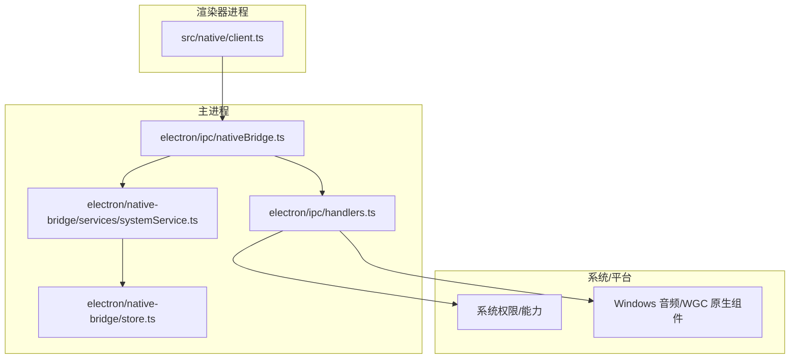
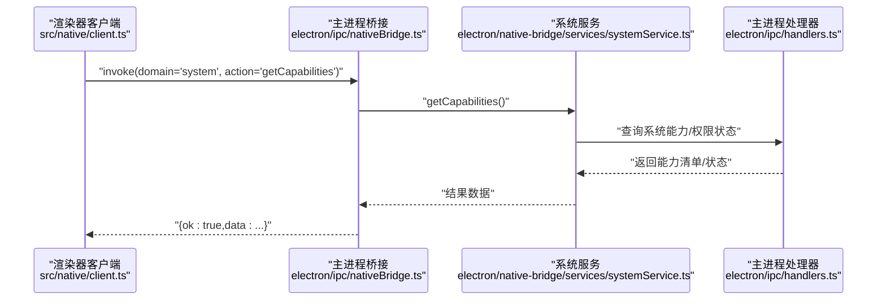
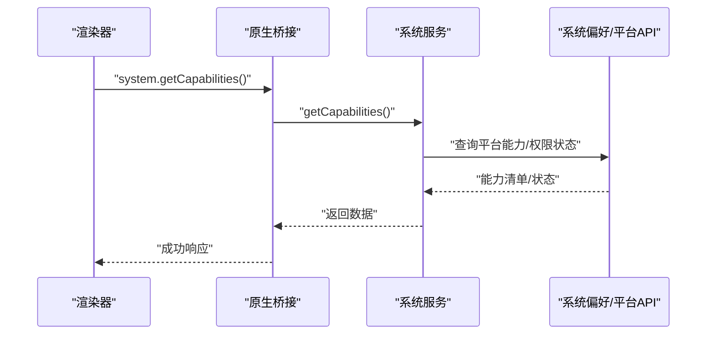
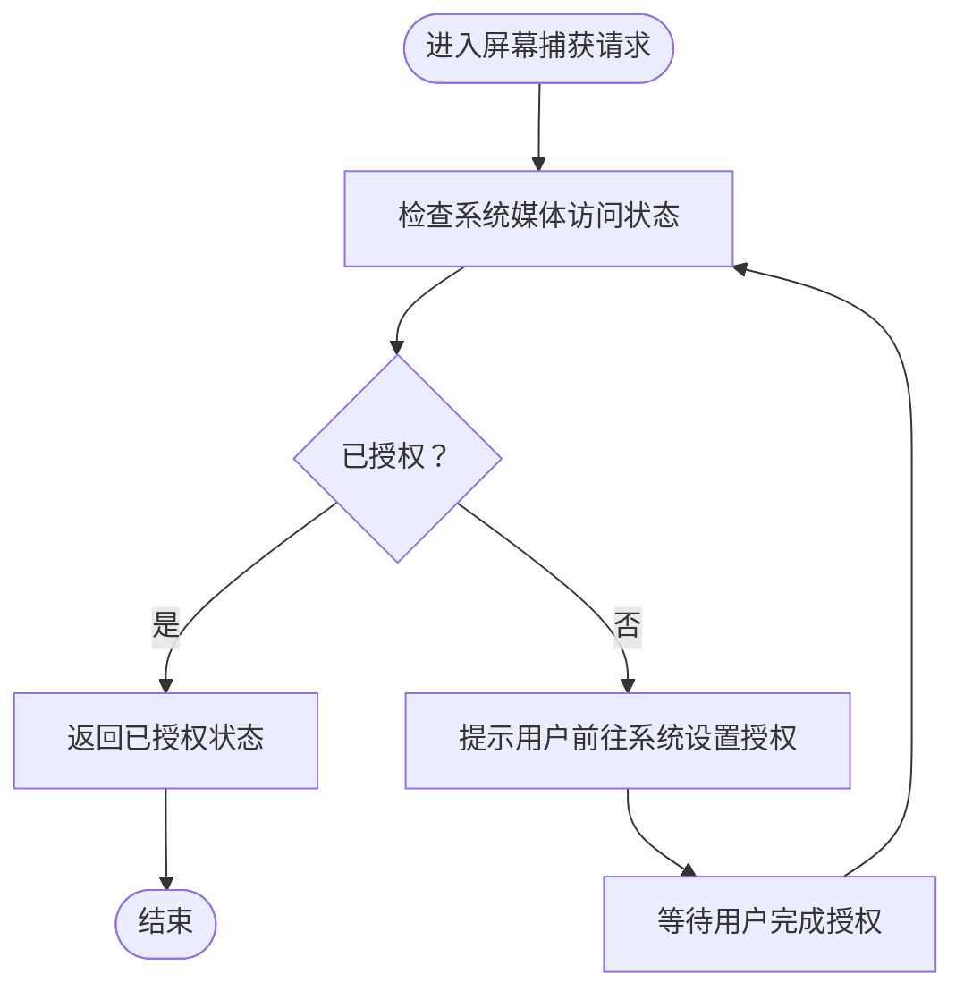
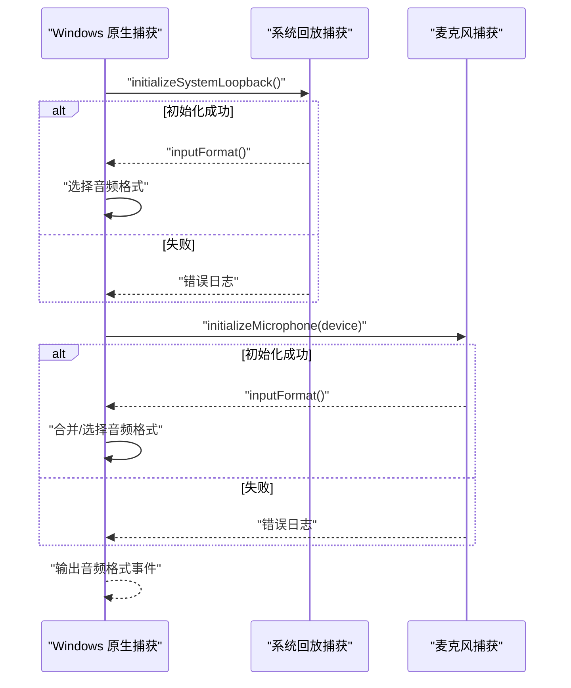
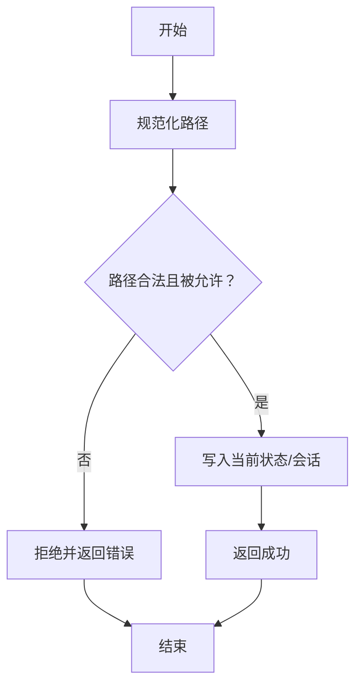
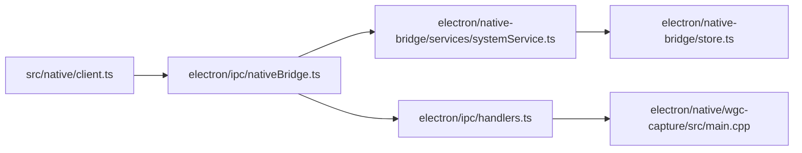

# 系统集成API

<cite>
**本文引用的文件**
- [electron/ipc/handlers.ts](file://electron/ipc/handlers.ts)
- [electron/ipc/nativeBridge.ts](file://electron/ipc/nativeBridge.ts)
- [electron/native-bridge/services/systemService.ts](file://electron/native-bridge/services/systemService.ts)
- [electron/native-bridge/store.ts](file://electron/native-bridge/store.ts)
- [src/native/client.ts](file://src/native/client.ts)
- [src/native/contracts.ts](file://src/native/contracts.ts)
- [docs/architecture/native-bridge.md](file://docs/architecture/native-bridge.md)
- [docs/02-architecture/01-ipc-communication-system.md](file://docs/02-architecture/01-ipc-communication-system.md)
- [electron/native/wgc-capture/src/main.cpp](file://electron/native/wgc-capture/src/main.cpp)
</cite>

## 目录
1. [简介](#简介)
2. [项目结构](#项目结构)
3. [核心组件](#核心组件)
4. [架构总览](#架构总览)
5. [详细组件分析](#详细组件分析)
6. [依赖关系分析](#依赖关系分析)
7. [性能考虑](#性能考虑)
8. [故障排查指南](#故障排查指南)
9. [结论](#结论)
10. [附录](#附录)

## 简介
本文件面向OpenScreen的系统集成API，聚焦于与操作系统功能的集成接口，包括：
- 屏幕捕获权限管理（macOS平台）
- 音频设备访问（Windows平台）
- 文件系统操作与路径审批
- 系统信息查询（平台、能力、资源等）
- 权限申请流程、授权状态检查与变更通知
- 兼容性检查、版本适配与降级策略
- 调试工具与故障诊断方法

目标是帮助开发者在渲染器进程中以统一方式请求系统权限，在主进程中进行验证与处理，并确保跨平台行为一致。

## 项目结构
OpenScreen采用“统一原生桥接层 + 主进程服务 + 渲染器客户端”的分层架构：
- 统一桥接层：通过IPC通道暴露domain/action接口，屏蔽平台差异
- 主进程服务：封装系统能力、状态与资源，负责权限校验与执行
- 渲染器客户端：提供类型安全的调用入口，隐藏底层Electron细节

图表来源
- [docs/architecture/native-bridge.md:1-39](file://docs/architecture/native-bridge.md#L1-L39)
- [electron/ipc/nativeBridge.ts:92-127](file://electron/ipc/nativeBridge.ts#L92-L127)
- [electron/native-bridge/services/systemService.ts](file://electron/native-bridge/services/systemService.ts)
- [electron/native-bridge/store.ts](file://electron/native-bridge/store.ts)
- [electron/ipc/handlers.ts:1282-1291](file://electron/ipc/handlers.ts#L1282-L1291)
- [electron/native/wgc-capture/src/main.cpp:460-489](file://electron/native/wgc-capture/src/main.cpp#L460-L489)

章节来源
- [docs/architecture/native-bridge.md:1-39](file://docs/architecture/native-bridge.md#L1-L39)
- [docs/02-architecture/01-ipc-communication-system.md:1-26](file://docs/02-architecture/01-ipc-communication-system.md#L1-L26)

## 核心组件
- 统一原生桥接通道：定义domain/action契约，返回带元数据的成功/失败响应
- 系统服务：提供平台信息、资源能力查询、资产路径解析等
- 主进程处理器：实现权限检查、路径审批、系统能力查询等
- 渲染器客户端：封装调用，暴露类型化API给React组件使用

章节来源
- [electron/ipc/nativeBridge.ts:58-127](file://electron/ipc/nativeBridge.ts#L58-L127)
- [electron/native-bridge/services/systemService.ts](file://electron/native-bridge/services/systemService.ts)
- [src/native/client.ts](file://src/native/client.ts)
- [src/native/contracts.ts](file://src/native/contracts.ts)

## 架构总览
统一桥接层通过单通道接收请求，按domain路由到对应服务；服务再结合主进程上下文执行具体逻辑，最终以统一响应体返回。

图表来源
- [electron/ipc/nativeBridge.ts:124-150](file://electron/ipc/nativeBridge.ts#L124-L150)
- [electron/native-bridge/services/systemService.ts](file://electron/native-bridge/services/systemService.ts)
- [electron/ipc/handlers.ts:1282-1291](file://electron/ipc/handlers.ts#L1282-L1291)

## 详细组件分析

### 1) 权限与系统能力查询
- 系统域接口：提供平台、资产路径、能力查询等
- macOS屏幕捕获权限：通过系统偏好检查媒体访问状态，必要时触发授权流程
- Windows音频捕获：初始化系统回放与麦克风设备，输出音频格式信息

图表来源
- [electron/ipc/nativeBridge.ts:134-142](file://electron/ipc/nativeBridge.ts#L134-L142)
- [electron/native-bridge/services/systemService.ts](file://electron/native-bridge/services/systemService.ts)

章节来源
- [electron/ipc/nativeBridge.ts:129-150](file://electron/ipc/nativeBridge.ts#L129-L150)
- [electron/ipc/handlers.ts:1282-1291](file://electron/ipc/handlers.ts#L1282-L1291)
- [electron/native/wgc-capture/src/main.cpp:460-489](file://electron/native/wgc-capture/src/main.cpp#L460-L489)

### 2) 屏幕捕获权限管理（macOS）
- 授权状态检查：通过系统偏好查询当前媒体访问状态
- 授权流程：若未授权，引导用户在系统设置中开启
- 授权后处理：返回成功状态，供上层逻辑继续录制或预览

图表来源
- [electron/ipc/handlers.ts:1282-1291](file://electron/ipc/handlers.ts#L1282-L1291)

章节来源
- [electron/ipc/handlers.ts:1282-1291](file://electron/ipc/handlers.ts#L1282-L1291)

### 3) 音频设备访问（Windows）
- 系统回放捕获：初始化WASAPI系统回放设备，获取输入格式
- 麦克风捕获：初始化指定麦克风设备，获取输入格式
- 能力合并：若两者均启用，则以首个可用格式作为最终音频格式
- 输出事件：向渲染器发送音频格式事件，用于UI反馈与编码参数选择

图表来源
- [electron/native/wgc-capture/src/main.cpp:460-489](file://electron/native/wgc-capture/src/main.cpp#L460-L489)

章节来源
- [electron/native/wgc-capture/src/main.cpp:460-489](file://electron/native/wgc-capture/src/main.cpp#L460-L489)

### 4) 文件系统操作与路径审批
- 录制会话恢复：对屏幕/摄像头视频路径进行可读性与白名单审批
- 当前视频路径设置：规范化路径并校验是否被允许
- 项目文件加载：从磁盘读取项目并应用审批后的会话

图表来源
- [electron/ipc/handlers.ts:1246-1262](file://electron/ipc/handlers.ts#L1246-L1262)
- [electron/ipc/handlers.ts:2765-2772](file://electron/ipc/handlers.ts#L2765-L2772)

章节来源
- [electron/ipc/handlers.ts:1246-1262](file://electron/ipc/handlers.ts#L1246-L1262)
- [electron/ipc/handlers.ts:2765-2772](file://electron/ipc/handlers.ts#L2765-L2772)

### 5) 渲染器侧调用示例（路径指引）
以下为在渲染器中请求系统权限与能力的调用路径指引（不直接展示代码内容）：
- 请求屏幕捕获权限：参考 [electron/ipc/handlers.ts:1282-1291](file://electron/ipc/handlers.ts#L1282-L1291)
- 查询系统能力：参考 [electron/ipc/nativeBridge.ts:134-142](file://electron/ipc/nativeBridge.ts#L134-L142)
- 设置/获取当前录制会话：参考 [electron/ipc/handlers.ts:2751-2763](file://electron/ipc/handlers.ts#L2751-L2763)

章节来源
- [electron/ipc/handlers.ts:1282-1291](file://electron/ipc/handlers.ts#L1282-L1291)
- [electron/ipc/nativeBridge.ts:134-142](file://electron/ipc/nativeBridge.ts#L134-L142)
- [electron/ipc/handlers.ts:2751-2763](file://electron/ipc/handlers.ts#L2751-L2763)

### 6) 主进程侧处理与验证（路径指引）
- 统一桥接注册与路由：参考 [electron/ipc/nativeBridge.ts:92-127](file://electron/ipc/nativeBridge.ts#L92-L127)
- 系统服务实现：参考 [electron/native-bridge/services/systemService.ts](file://electron/native-bridge/services/systemService.ts)
- 状态存储与能力缓存：参考 [electron/native-bridge/store.ts](file://electron/native-bridge/store.ts)
- 文件路径审批与会话恢复：参考 [electron/ipc/handlers.ts:1246-1262](file://electron/ipc/handlers.ts#L1246-L1262)

章节来源
- [electron/ipc/nativeBridge.ts:92-127](file://electron/ipc/nativeBridge.ts#L92-L127)
- [electron/native-bridge/services/systemService.ts](file://electron/native-bridge/services/systemService.ts)
- [electron/native-bridge/store.ts](file://electron/native-bridge/store.ts)
- [electron/ipc/handlers.ts:1246-1262](file://electron/ipc/handlers.ts#L1246-L1262)

## 依赖关系分析
- 渲染器客户端依赖统一桥接通道，桥接通道依赖主进程服务与状态存储
- 主进程处理器依赖系统偏好与平台API，同时与原生组件（如Windows音频捕获）交互
- 合同定义贯穿渲染器与主进程，保证请求/响应的类型一致性

图表来源
- [src/native/client.ts](file://src/native/client.ts)
- [src/native/contracts.ts](file://src/native/contracts.ts)
- [electron/ipc/nativeBridge.ts:92-127](file://electron/ipc/nativeBridge.ts#L92-L127)
- [electron/native-bridge/services/systemService.ts](file://electron/native-bridge/services/systemService.ts)
- [electron/native-bridge/store.ts](file://electron/native-bridge/store.ts)
- [electron/ipc/handlers.ts:1246-1262](file://electron/ipc/handlers.ts#L1246-L1262)
- [electron/native/wgc-capture/src/main.cpp:460-489](file://electron/native/wgc-capture/src/main.cpp#L460-L489)

章节来源
- [src/native/contracts.ts](file://src/native/contracts.ts)
- [docs/architecture/native-bridge.md:1-39](file://docs/architecture/native-bridge.md#L1-L39)

## 性能考虑
- 统一桥接层避免重复传输与类型转换，减少IPC开销
- 能力查询与状态缓存降低频繁系统调用次数
- Windows音频捕获仅在启用时初始化对应设备，避免无效资源占用
- 文件路径审批前置，减少后续IO失败重试成本

## 故障排查指南
- 权限相关
  - macOS屏幕捕获未授权：检查系统偏好中的媒体访问状态，确认用户已完成授权
  - Windows音频设备初始化失败：查看原生组件输出的错误日志，确认设备ID与名称匹配
- IPC与桥接
  - 请求无效：确认domain/action正确，遵循统一契约
  - 响应失败：根据错误码与消息定位问题，必要时重试
- 文件系统
  - 路径未被批准：检查路径是否在白名单范围内，或是否已被规范化
  - 会话恢复失败：确认项目文件存在且可读，查看控制台错误日志

章节来源
- [electron/ipc/nativeBridge.ts:58-90](file://electron/ipc/nativeBridge.ts#L58-L90)
- [electron/native/wgc-capture/src/main.cpp:460-489](file://electron/native/wgc-capture/src/main.cpp#L460-L489)
- [electron/ipc/handlers.ts:1246-1262](file://electron/ipc/handlers.ts#L1246-L1262)

## 结论
OpenScreen通过统一原生桥接层实现了跨平台系统集成API，将权限管理、能力查询与文件系统操作抽象为稳定契约，既保障了安全性，又提升了可维护性与扩展性。建议在新功能开发中优先使用统一桥接客户端，逐步替代遗留的直接Electron调用方式。

## 附录
- 开发与测试
  - 参考架构文档了解桥接设计原则与当前演进阶段
  - 使用IPC通信系统文档掌握上下文隔离与类型安全实践
- 版本与兼容性
  - 通过统一契约与错误码实现向后兼容与渐进式升级
  - 平台差异通过服务层封装，保持渲染器API一致

章节来源
- [docs/architecture/native-bridge.md:1-39](file://docs/architecture/native-bridge.md#L1-L39)
- [docs/02-architecture/01-ipc-communication-system.md:1-26](file://docs/02-architecture/01-ipc-communication-system.md#L1-L26)