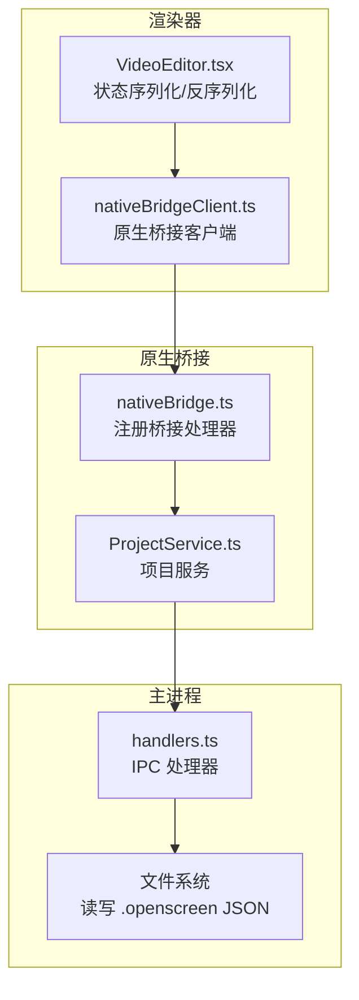
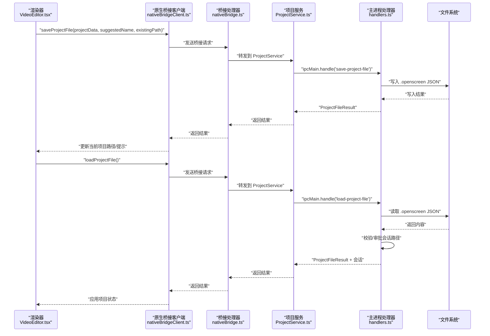
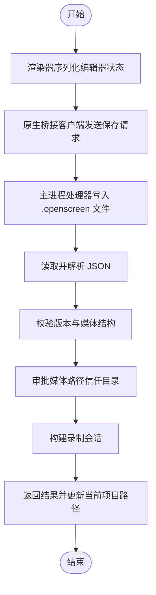

# 项目文件操作

<cite>
**本文引用的文件**
- [electron/ipc/handlers.ts](file://electron/ipc/handlers.ts)
- [electron/ipc/nativeBridge.ts](file://electron/ipc/nativeBridge.ts)
- [electron/native-bridge/services/projectService.ts](file://electron/native-bridge/services/projectService.ts)
- [src/native/client.ts](file://src/native/client.ts)
- [src/native/contracts.ts](file://src/native/contracts.ts)
- [src/components/video-editor/VideoEditor.tsx](file://src/components/video-editor/VideoEditor.tsx)
- [src/components/video-editor/projectPersistence.ts](file://src/components/video-editor/projectPersistence.ts)
- [src/components/video-editor/projectPersistence.test.ts](file://src/components/video-editor/projectPersistence.test.ts)
- [src/lib/assetPath.ts](file://src/lib/assetPath.ts)
- [src/lib/wallpaper.ts](file://src/lib/wallpaper.ts)
- [docs/04-video-editor/01-video-editor-component-and-state-management.md](file://docs/04-video-editor/01-video-editor-component-and-state-management.md)
</cite>

## 目录
1. [简介](#简介)
2. [项目结构](#项目结构)
3. [核心组件](#核心组件)
4. [架构总览](#架构总览)
5. [详细组件分析](#详细组件分析)
6. [依赖关系分析](#依赖关系分析)
7. [性能考量](#性能考量)
8. [故障排查指南](#故障排查指南)
9. [结论](#结论)
10. [附录](#附录)

## 简介
本章节面向 OpenScreen 的“项目文件操作”能力，系统性说明项目文件的创建、加载、保存与管理流程；覆盖项目文件格式规范、数据结构定义、版本兼容性处理；解释序列化与反序列化过程中的媒体资源路径解析、相对路径转换与文件权限校验；并给出导入导出流程、批量操作支持与错误恢复机制的实现要点。同时提供渲染器进程与主进程协作的最佳实践，以及加密保护、备份策略与迁移方案的建议。

## 项目结构
OpenScreen 的项目文件操作由三层协同完成：
- 渲染器层：负责用户交互、状态序列化与调用原生桥接客户端。
- 原生桥接层：封装 IPC 请求，协调主进程服务与状态存储。
- 主进程层：执行实际的文件 I/O、路径校验与会话审批。

图表来源
- [src/components/video-editor/VideoEditor.tsx](file://src/components/video-editor/VideoEditor.tsx)
- [src/native/client.ts](file://src/native/client.ts)
- [electron/ipc/nativeBridge.ts](file://electron/ipc/nativeBridge.ts)
- [electron/native-bridge/services/projectService.ts](file://electron/native-bridge/services/projectService.ts)
- [electron/ipc/handlers.ts](file://electron/ipc/handlers.ts)

章节来源
- [src/components/video-editor/VideoEditor.tsx](file://src/components/video-editor/VideoEditor.tsx)
- [src/native/client.ts](file://src/native/client.ts)
- [electron/ipc/nativeBridge.ts](file://electron/ipc/nativeBridge.ts)
- [electron/native-bridge/services/projectService.ts](file://electron/native-bridge/services/projectService.ts)
- [electron/ipc/handlers.ts](file://electron/ipc/handlers.ts)

## 核心组件
- 项目文件扩展名与对话框过滤：统一使用 .openscreen 扩展名，并在打开/保存对话框中提供 JSON 兼容选项。
- 项目数据结构：包含版本号、媒体信息（屏幕视频、摄像头视频）与编辑器配置等字段。
- 路径解析与安全校验：对媒体路径进行规范化、信任目录审批与跨平台路径转换。
- 序列化/反序列化：将编辑器完整状态序列化为 JSON 并持久化；加载时进行格式校验与兼容性处理。
- 错误处理：对无效路径、不支持的扩展名、读写失败等情况返回明确结果与错误信息。

章节来源
- [electron/ipc/handlers.ts](file://electron/ipc/handlers.ts)
- [src/components/video-editor/projectPersistence.ts](file://src/components/video-editor/projectPersistence.ts)
- [src/components/video-editor/projectPersistence.test.ts](file://src/components/video-editor/projectPersistence.test.ts)
- [src/lib/assetPath.ts](file://src/lib/assetPath.ts)
- [src/lib/wallpaper.ts](file://src/lib/wallpaper.ts)

## 架构总览
项目文件操作通过“原生桥接通道”在渲染器与主进程之间传递请求，主进程负责文件 I/O 与安全校验，渲染器负责状态管理与 UI 反馈。

图表来源
- [src/native/client.ts](file://src/native/client.ts)
- [electron/ipc/nativeBridge.ts](file://electron/ipc/nativeBridge.ts)
- [electron/native-bridge/services/projectService.ts](file://electron/native-bridge/services/projectService.ts)
- [electron/ipc/handlers.ts](file://electron/ipc/handlers.ts)

## 详细组件分析

### 1) 项目文件格式与数据结构
- 文件扩展名：统一为 .openscreen；主进程在对话框中提供 openscreen 与 JSON 两类过滤。
- 数据结构要点：
  - 版本字段：用于兼容性判断与迁移。
  - 媒体信息：支持 screenVideoPath 与可选的 webcamVideoPath；兼容旧版单路径 videoPath。
  - 编辑器配置：包含裁剪、缩放、变速、标注、导出参数等完整状态。
- 路径解析与归一化：
  - 支持 file:// URL、绝对路径与相对路径；Windows 驱动器盘符与 UNC 路径有专门转换逻辑。
  - 对于打包/开发布局，项目文件中的壁纸等资源路径会被规范化为 /wallpapers/... 形式，便于运行时解析。

章节来源
- [electron/ipc/handlers.ts](file://electron/ipc/handlers.ts)
- [src/components/video-editor/projectPersistence.ts](file://src/components/video-editor/projectPersistence.ts)
- [src/components/video-editor/projectPersistence.test.ts](file://src/components/video-editor/projectPersistence.test.ts)
- [src/lib/assetPath.ts](file://src/lib/assetPath.ts)
- [src/lib/wallpaper.ts](file://src/lib/wallpaper.ts)

### 2) 序列化与反序列化流程
- 序列化：渲染器将当前编辑器状态（含区域、效果、导出设置等）序列化为 JSON，调用原生桥接客户端发起保存。
- 反序列化：主进程读取 .openscreen 文件，解析为对象；随后审批媒体路径（仅允许受信任目录或项目所在目录），构建录制会话；最后返回给渲染器以恢复编辑器状态。
- 兼容性处理：对旧版项目（仅 videoPath）自动升级为新版媒体结构；对壁纸等资源路径进行跨平台归一化。

图表来源
- [src/native/client.ts](file://src/native/client.ts)
- [electron/ipc/nativeBridge.ts](file://electron/ipc/nativeBridge.ts)
- [electron/native-bridge/services/projectService.ts](file://electron/native-bridge/services/projectService.ts)
- [electron/ipc/handlers.ts](file://electron/ipc/handlers.ts)

章节来源
- [src/native/client.ts](file://src/native/client.ts)
- [electron/ipc/nativeBridge.ts](file://electron/ipc/nativeBridge.ts)
- [electron/native-bridge/services/projectService.ts](file://electron/native-bridge/services/projectService.ts)
- [electron/ipc/handlers.ts](file://electron/ipc/handlers.ts)

### 3) 路径解析、相对路径转换与权限验证
- 绝对/相对路径与 URL 解析：
  - 支持 file://、UNC 与 Windows 盘符路径；统一转换为本地路径或网络路径形式。
  - 对 /wallpapers/ 等受限前缀进行白名单校验，防止越权访问。
- 权限与信任目录：
  - 加载项目时，仅批准位于“录制目录”或“项目文件所在目录”的媒体路径，避免任意路径读取。
  - 若路径不在信任范围内，仍允许加载项目，但将路径标记为不可用，交由渲染器提示用户定位文件。
- 资源路径归一化：
  - 开发/打包两种布局下，项目文件内的资源路径会被重写为统一的 /wallpapers/... 形式，运行时通过资产基址解析。

章节来源
- [electron/ipc/handlers.ts](file://electron/ipc/handlers.ts)
- [src/components/video-editor/projectPersistence.ts](file://src/components/video-editor/projectPersistence.ts)
- [src/lib/assetPath.ts](file://src/lib/assetPath.ts)
- [src/lib/wallpaper.ts](file://src/lib/wallpaper.ts)

### 4) 导入导出流程与批量操作支持
- 导入（打开项目）：
  - 渲染器触发原生桥接客户端调用 loadProjectFile。
  - 主进程弹出文件选择对话框，读取 .openscreen 文件，审批媒体路径，返回项目与会话。
- 导出（保存项目）：
  - 渲染器触发原生桥接客户端调用 saveProjectFile。
  - 主进程弹出保存对话框，写入 .openscreen 文件；若提供现有路径则直接覆盖。
- 批量操作建议：
  - 批量打开：逐个调用 loadProjectFileFromPath，记录失败项并汇总提示。
  - 批量保存：按需生成建议名称，循环调用 saveProjectFile，统一处理权限与覆盖确认。
  - 批量导入媒体：先集中审批路径，再一次性写入项目文件，减少磁盘抖动。

章节来源
- [src/native/client.ts](file://src/native/client.ts)
- [electron/ipc/handlers.ts](file://electron/ipc/handlers.ts)
- [src/components/video-editor/VideoEditor.tsx](file://src/components/video-editor/VideoEditor.tsx)

### 5) 错误恢复机制
- 读取失败：捕获异常并返回带错误码的结果；渲染器显示友好提示。
- 路径不可用：当媒体路径不在信任目录时，项目仍可加载，但标记为“未找到”，引导用户重新定位。
- 写入失败：记录日志并提示用户检查磁盘空间与权限。
- 会话审批失败：忽略该媒体，保留其他有效媒体，保证项目完整性。

章节来源
- [electron/ipc/handlers.ts](file://electron/ipc/handlers.ts)
- [src/components/video-editor/VideoEditor.tsx](file://src/components/video-editor/VideoEditor.tsx)

### 6) 渲染器进程中的项目文件操作示例
- 触发保存：调用原生桥接客户端的 saveProjectFile，传入项目数据与可选建议名称或现有路径。
- 触发打开：调用原生桥接客户端的 loadProjectFile，解析结果后应用到编辑器状态。
- 状态同步：保存成功后更新当前项目路径；打开成功后恢复录制会话与编辑器状态。

章节来源
- [src/native/client.ts](file://src/native/client.ts)
- [src/components/video-editor/VideoEditor.tsx](file://src/components/video-editor/VideoEditor.tsx)

### 7) 主进程中的安全文件 I/O
- 保存项目：弹出保存对话框，写入 UTF-8 JSON；支持覆盖确认与目录创建。
- 打开项目：弹出打开对话框，校验扩展名与可读性；读取后解析 JSON 并审批媒体路径。
- 路径审批：仅允许项目所在目录与录制目录内的媒体路径；对异常路径抛出错误或降级处理。
- 会话构建：根据审批后的媒体路径构建录制会话，供渲染器播放与编辑。

章节来源
- [electron/ipc/handlers.ts](file://electron/ipc/handlers.ts)

### 8) 版本兼容性与迁移方案
- 版本字段：项目文件包含 version 字段，用于识别旧版结构。
- 迁移策略：
  - 旧版单路径 videoPath 自动升级为新版媒体结构。
  - 资源路径从开发/打包布局迁移到统一的 /wallpapers/... 形式。
  - 新增字段缺失时采用默认值，确保向后兼容。
- 测试保障：通过单元测试覆盖旧版项目解析、路径归一化与迁移行为。

章节来源
- [src/components/video-editor/projectPersistence.ts](file://src/components/video-editor/projectPersistence.ts)
- [src/components/video-editor/projectPersistence.test.ts](file://src/components/video-editor/projectPersistence.test.ts)

### 9) 加密保护、备份策略与迁移建议
- 加密保护（建议）：
  - 在主进程侧对 .openscreen 文件进行加密存储（如 AES-GCM），密钥由系统凭据或硬件令牌管理。
  - 仅在解密后写入渲染器内存，避免明文落盘。
- 备份策略（建议）：
  - 每次成功保存后生成时间戳备份副本，保留最近 N 份。
  - 对于重要项目，提供增量备份与版本对比工具。
- 迁移方案（建议）：
  - 升级版本时，先扫描所有 .openscreen 文件，执行结构迁移与路径重写。
  - 提供“迁移报告”，列出失败项与修复建议。

## 依赖关系分析
- 渲染器依赖原生桥接客户端，后者通过桥接通道与主进程交互。
- 原生桥接层封装 IPC 请求，内部组合项目服务与系统服务。
- 主进程处理器负责具体文件 I/O 与安全审批，依赖路径解析与会话构建逻辑。

图表来源
- [src/components/video-editor/VideoEditor.tsx](file://src/components/video-editor/VideoEditor.tsx)
- [src/native/client.ts](file://src/native/client.ts)
- [electron/ipc/nativeBridge.ts](file://electron/ipc/nativeBridge.ts)
- [electron/native-bridge/services/projectService.ts](file://electron/native-bridge/services/projectService.ts)
- [electron/ipc/handlers.ts](file://electron/ipc/handlers.ts)

章节来源
- [src/native/contracts.ts](file://src/native/contracts.ts)
- [src/native/client.ts](file://src/native/client.ts)
- [electron/ipc/nativeBridge.ts](file://electron/ipc/nativeBridge.ts)
- [electron/native-bridge/services/projectService.ts](file://electron/native-bridge/services/projectService.ts)
- [electron/ipc/handlers.ts](file://electron/ipc/handlers.ts)

## 性能考量
- 序列化体积控制：仅保存必要字段，避免冗余数据；对大数组分页或延迟加载。
- I/O 合并：批量保存时合并写入，减少磁盘寻道；异步写入避免阻塞 UI。
- 路径审批缓存：对已审批路径建立缓存表，降低重复校验成本。
- 资源预加载：在项目打开后，按需预读媒体片段，提升首帧播放速度。
- 错误快速反馈：对无效路径与权限问题尽早检测并提示，避免无谓的后续处理。

## 故障排查指南
- 无法打开项目：
  - 检查文件扩展名是否为 .openscreen 或 JSON。
  - 确认文件存在且可读；查看主进程日志中的错误信息。
- 媒体路径不可用：
  - 若路径不在信任目录（录制目录或项目所在目录），将被拒绝；请重新定位媒体文件。
- 保存失败：
  - 检查目标目录权限与磁盘空间；确认覆盖确认对话框已正确响应。
- 资源加载异常：
  - 确认资源路径符合 /wallpapers/... 规范；检查打包/开发布局下的路径映射。

章节来源
- [electron/ipc/handlers.ts](file://electron/ipc/handlers.ts)
- [src/components/video-editor/VideoEditor.tsx](file://src/components/video-editor/VideoEditor.tsx)

## 结论
OpenScreen 的项目文件操作以“原生桥接通道”为核心，结合主进程的安全审批与渲染器的状态管理，实现了可靠的项目创建、加载、保存与管理。通过严格的路径审批、版本兼容与路径归一化，系统在易用性与安全性之间取得平衡。建议在生产环境中进一步引入加密与备份机制，并完善批量操作与错误恢复能力，以满足更复杂的使用场景。

## 附录
- 项目文件格式说明（来自文档）：项目文件为 .openscreen 扩展名的 JSON，包含版本、媒体与编辑器配置；参考文档中的“保存/加载流程”与“数据流模式”。

章节来源
- [docs/04-video-editor/01-video-editor-component-and-state-management.md](file://docs/04-video-editor/01-video-editor-component-and-state-management.md)