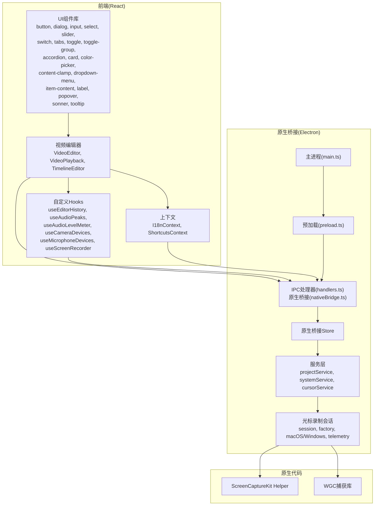
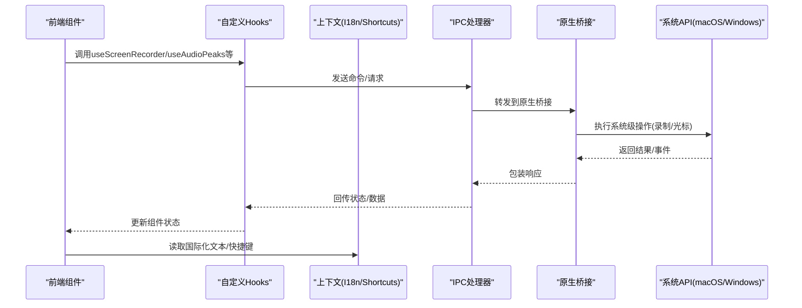
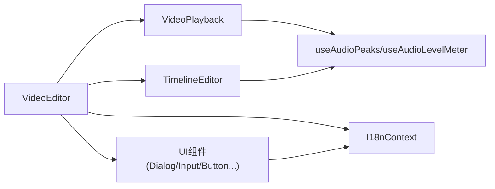
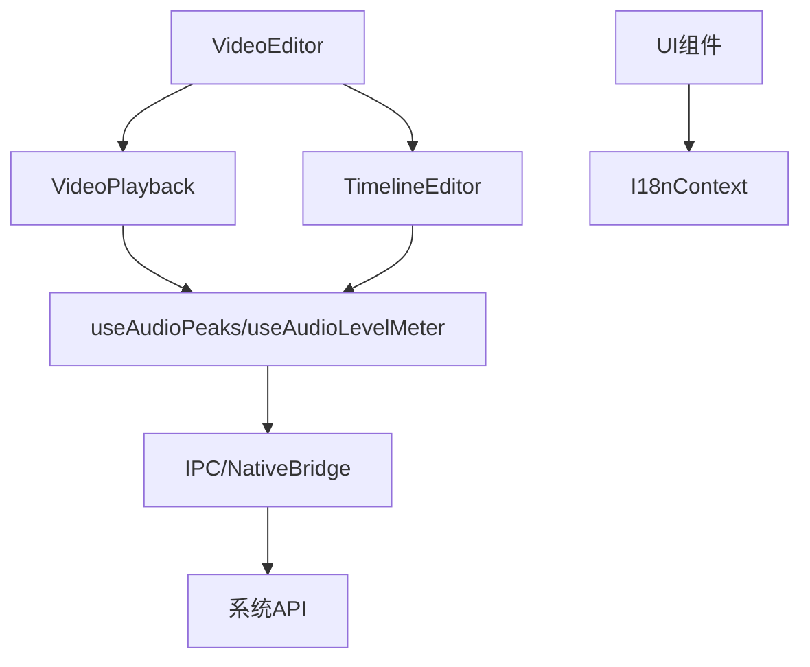

# React组件API

<cite>
**本文引用的文件**
- [src/components/ui/button.tsx](file://src/components/ui/button.tsx)
- [src/components/ui/dialog.tsx](file://src/components/ui/dialog.tsx)
- [src/components/ui/input.tsx](file://src/components/ui/input.tsx)
- [src/components/ui/select.tsx](file://src/components/ui/select.tsx)
- [src/components/ui/slider.tsx](file://src/components/ui/slider.tsx)
- [src/components/ui/switch.tsx](file://src/components/ui/switch.tsx)
- [src/components/ui/tabs.tsx](file://src/components/ui/tabs.tsx)
- [src/components/ui/toggle.tsx](file://src/components/ui/toggle.tsx)
- [src/components/ui/toggle-group.tsx](file://src/components/ui/toggle-group.tsx)
- [src/components/ui/accordion.tsx](file://src/components/ui/accordion.tsx)
- [src/components/ui/card.tsx](file://src/components/ui/card.tsx)
- [src/components/ui/color-picker.tsx](file://src/components/ui/color-picker.tsx)
- [src/components/ui/content-clamp.tsx](file://src/components/ui/content-clamp.tsx)
- [src/components/ui/dropdown-menu.tsx](file://src/components/ui/dropdown-menu.tsx)
- [src/components/ui/item-content.tsx](file://src/components/ui/item-content.tsx)
- [src/components/ui/label.tsx](file://src/components/ui/label.tsx)
- [src/components/ui/popover.tsx](file://src/components/ui/popover.tsx)
- [src/components/ui/sonner.tsx](file://src/components/ui/sonner.tsx)
- [src/components/ui/tooltip.tsx](file://src/components/ui/tooltip.tsx)
- [src/components/video-editor/VideoEditor.tsx](file://src/components/video-editor/VideoEditor.tsx)
- [src/components/video-editor/VideoPlayback.tsx](file://src/components/video-editor/VideoPlayback.tsx)
- [src/components/video-editor/timeline/TimelineEditor.tsx](file://src/components/video-editor/timeline/TimelineEditor.tsx)
- [src/components/video-editor/types.ts](file://src/components/video-editor/types.ts)
- [src/components/video-editor/editorDefaults.ts](file://src/components/video-editor/editorDefaults.ts)
- [src/components/video-editor/projectPersistence.ts](file://src/components/video-editor/projectPersistence.ts)
- [src/hooks/useEditorHistory.ts](file://src/hooks/useEditorHistory.ts)
- [src/hooks/useAudioPeaks.ts](file://src/hooks/useAudioPeaks.ts)
- [src/hooks/useAudioLevelMeter.ts](file://src/hooks/useAudioLevelMeter.ts)
- [src/hooks/useCameraDevices.ts](file://src/hooks/useCameraDevices.ts)
- [src/hooks/useMicrophoneDevices.ts](file://src/hooks/useMicrophoneDevices.ts)
- [src/hooks/useScreenRecorder.ts](file://src/hooks/useScreenRecorder.ts)
- [src/contexts/I18nContext.tsx](file://src/contexts/I18nContext.tsx)
- [src/i18n/config.ts](file://src/i18n/config.ts)
- [src/i18n/loader.ts](file://src/i18n/loader.ts)
- [src/native/hooks/useCursorRecordingData.ts](file://src/native/hooks/useCursorRecordingData.ts)
- [src/native/hooks/useCursorTelemetry.ts](file://src/native/hooks/useCursorTelemetry.ts)
- [src/native/client.ts](file://src/native/client.ts)
- [src/native/index.ts](file://src/native/index.ts)
- [src/native/contracts.ts](file://src/native/contracts.ts)
- [src/utils/timeUtils.ts](file://src/utils/timeUtils.ts)
- [src/utils/platformUtils.ts](file://src/utils/platformUtils.ts)
- [src/utils/getTestId.ts](file://src/utils/getTestId.ts)
- [src/lib/recordingSession.ts](file://src/lib/recordingSession.ts)
- [src/lib/customFonts.ts](file://src/lib/customFonts.ts)
- [src/lib/compositeLayout.ts](file://src/lib/compositeLayout.ts)
- [src/lib/captioning/index.ts](file://src/lib/captioning/index.ts)
- [src/lib/exporter/index.ts](file://src/lib/exporter/index.ts)
- [src/lib/tts/index.ts](file://src/lib/tts/index.ts)
- [src/lib/userPreferences.ts](file://src/lib/userPreferences.ts)
- [src/lib/wallpaper.ts](file://src/lib/wallpaper.ts)
- [src/lib/webcamMaskShapes.ts](file://src/lib/webcamMaskShapes.ts)
- [src/App.tsx](file://src/App.tsx)
- [src/main.tsx](file://src/main.tsx)
- [electron/main.ts](file://electron/main.ts)
- [electron/preload.ts](file://electron/preload.ts)
- [electron/windows.ts](file://electron/windows.ts)
- [electron/ipc/handlers.ts](file://electron/ipc/handlers.ts)
- [electron/ipc/nativeBridge.ts](file://electron/ipc/nativeBridge.ts)
- [electron/native-bridge/store.ts](file://electron/native-bridge/store.ts)
- [electron/native-bridge/services/projectService.ts](file://electron/native-bridge/services/projectService.ts)
- [electron/native-bridge/services/systemService.ts](file://electron/native-bridge/services/systemService.ts)
- [electron/native-bridge/services/cursorService.ts](file://electron/native-bridge/services/cursorService.ts)
- [electron/native-bridge/cursor/session.ts](file://electron/native-bridge/cursor/session.ts)
- [electron/native-bridge/cursor/factory.ts](file://electron/native-bridge/cursor/factory.ts)
- [electron/native-bridge/cursor/macNativeRecordingSession.ts](file://electron/native-bridge/cursor/macNativeRecordingSession.ts)
- [electron/native-bridge/cursor/windowsNativeRecordingSession.ts](file://electron/native-bridge/cursor/windowsNativeRecordingSession.ts)
- [electron/native-bridge/cursor/windowsNativeRecordingSession.types.ts](file://electron/native-bridge/cursor/windowsNativeRecordingSession.types.ts)
- [electron/native-bridge/cursor/telemetryRecordingSession.ts](file://electron/native-bridge/cursor/telemetryRecordingSession.ts)
- [electron/native-bridge/cursor/adapter.ts](file://electron/native-bridge/cursor/adapter.ts)
- [electron/native-bridge/cursor/telemetryCursorAdapter.ts](file://electron/native-bridge/cursor/telemetryCursorAdapter.ts)
- [electron/native/screencapturekit/Sources/OpenScreenMacOSCursorHelper/main.swift](file://electron/native/screencapturekit/Sources/OpenScreenMacOSCursorHelper/main.swift)
- [electron/native/wgc-capture/src/main.cpp](file://electron/native/wgc-capture/src/main.cpp)
- [electron/native/wgc-capture/src/wgc_session.h](file://electron/native/wgc-capture/src/wgc_session.h)
- [electron/native/wgc-capture/src/wgc_session.cpp](file://electron/native/wgc-capture/src/wgc_session.cpp)
- [electron/native/wgc-capture/CMakeLists.txt](file://electron/native/wgc-capture/CMakeLists.txt)
</cite>

## 目录
1. [简介](#简介)
2. [项目结构](#项目结构)
3. [核心组件](#核心组件)
4. [架构总览](#架构总览)
5. [详细组件分析](#详细组件分析)
6. [依赖关系分析](#依赖关系分析)
7. [性能考量](#性能考量)
8. [故障排查指南](#故障排查指南)
9. [结论](#结论)
10. [附录](#附录)

## 简介
本文件为 OpenScreen 的 React 组件 API 参考文档，覆盖 UI 基础组件与视频编辑器核心组件（VideoEditor、VideoPlayback、TimelineEditor）的属性接口、事件与回调定义，并说明组件间组合模式、数据流、可访问性与国际化支持、生命周期与自定义 Hook 使用方法。文档同时提供使用示例与最佳实践建议，帮助开发者在 Electron + React 环境下高效集成与扩展。

## 项目结构
OpenScreen 采用前端与原生层分离的架构：React 层负责 UI 与交互；Electron 主进程负责系统级能力（录制、窗口管理、IPC）；原生桥接模块连接系统 API（macOS ScreenCaptureKit、Windows Game Capture）。视频编辑器位于 React 层，通过 hooks 与上下文实现状态管理与国际化；原生层通过 IPC 与服务层协作完成底层功能。

图表来源
- [src/App.tsx](file://src/App.tsx)
- [src/main.tsx](file://src/main.tsx)
- [electron/main.ts](file://electron/main.ts)
- [electron/preload.ts](file://electron/preload.ts)
- [electron/ipc/handlers.ts](file://electron/ipc/handlers.ts)
- [electron/ipc/nativeBridge.ts](file://electron/ipc/nativeBridge.ts)
- [electron/native-bridge/store.ts](file://electron/native-bridge/store.ts)
- [electron/native-bridge/services/projectService.ts](file://electron/native-bridge/services/projectService.ts)
- [electron/native-bridge/services/systemService.ts](file://electron/native-bridge/services/systemService.ts)
- [electron/native-bridge/services/cursorService.ts](file://electron/native-bridge/services/cursorService.ts)
- [electron/native-bridge/cursor/session.ts](file://electron/native-bridge/cursor/session.ts)
- [electron/native/screencapturekit/Sources/OpenScreenMacOSCursorHelper/main.swift](file://electron/native/screencapturekit/Sources/OpenScreenMacOSCursorHelper/main.swift)
- [electron/native/wgc-capture/src/main.cpp](file://electron/native/wgc-capture/src/main.cpp)

章节来源
- [src/App.tsx](file://src/App.tsx)
- [src/main.tsx](file://src/main.tsx)
- [electron/main.ts](file://electron/main.ts)
- [electron/preload.ts](file://electron/preload.ts)

## 核心组件
本节概述视频编辑器与 UI 组件库的关键公共接口与职责边界，便于快速查阅与集成。

- 视频编辑器
  - VideoEditor：视频编辑主容器，负责项目状态、播放控制、导出流程与设置面板的协调。
  - VideoPlayback：视频播放器，封装播放、暂停、跳转、缩放、光标跟随与叠加渲染。
  - TimelineEditor：时间轴编辑器，支持轨道、片段、关键帧标记与拖拽操作。

- UI 组件库
  - 基础输入：button、input、select、slider、switch、toggle、toggle-group、color-picker、dropdown-menu、popover、tooltip、label、item-content、content-clamp、accordion、tabs、card、sonner。
  - 交互与反馈：dialog、sonner（通知）。

- 自定义 Hooks
  - useEditorHistory：编辑历史记录与撤销/重做。
  - useAudioPeaks：音频波形数据计算。
  - useAudioLevelMeter：音频电平表。
  - useCameraDevices / useMicrophoneDevices：媒体设备枚举。
  - useScreenRecorder：屏幕录制控制。

- 国际化与上下文
  - I18nContext：提供多语言文本与格式化工具。
  - I18n 配置与加载器：locales、config、loader。

章节来源
- [src/components/video-editor/VideoEditor.tsx](file://src/components/video-editor/VideoEditor.tsx)
- [src/components/video-editor/VideoPlayback.tsx](file://src/components/video-editor/VideoPlayback.tsx)
- [src/components/video-editor/timeline/TimelineEditor.tsx](file://src/components/video-editor/timeline/TimelineEditor.tsx)
- [src/components/ui/button.tsx](file://src/components/ui/button.tsx)
- [src/components/ui/dialog.tsx](file://src/components/ui/dialog.tsx)
- [src/components/ui/input.tsx](file://src/components/ui/input.tsx)
- [src/components/ui/select.tsx](file://src/components/ui/select.tsx)
- [src/components/ui/slider.tsx](file://src/components/ui/slider.tsx)
- [src/components/ui/switch.tsx](file://src/components/ui/switch.tsx)
- [src/components/ui/tabs.tsx](file://src/components/ui/tabs.tsx)
- [src/components/ui/toggle.tsx](file://src/components/ui/toggle.tsx)
- [src/components/ui/toggle-group.tsx](file://src/components/ui/toggle-group.tsx)
- [src/components/ui/accordion.tsx](file://src/components/ui/accordion.tsx)
- [src/components/ui/card.tsx](file://src/components/ui/card.tsx)
- [src/components/ui/color-picker.tsx](file://src/components/ui/color-picker.tsx)
- [src/components/ui/content-clamp.tsx](file://src/components/ui/content-clamp.tsx)
- [src/components/ui/dropdown-menu.tsx](file://src/components/ui/dropdown-menu.tsx)
- [src/components/ui/item-content.tsx](file://src/components/ui/item-content.tsx)
- [src/components/ui/label.tsx](file://src/components/ui/label.tsx)
- [src/components/ui/popover.tsx](file://src/components/ui/popover.tsx)
- [src/components/ui/sonner.tsx](file://src/components/ui/sonner.tsx)
- [src/components/ui/tooltip.tsx](file://src/components/ui/tooltip.tsx)
- [src/hooks/useEditorHistory.ts](file://src/hooks/useEditorHistory.ts)
- [src/hooks/useAudioPeaks.ts](file://src/hooks/useAudioPeaks.ts)
- [src/hooks/useAudioLevelMeter.ts](file://src/hooks/useAudioLevelMeter.ts)
- [src/hooks/useCameraDevices.ts](file://src/hooks/useCameraDevices.ts)
- [src/hooks/useMicrophoneDevices.ts](file://src/hooks/useMicrophoneDevices.ts)
- [src/hooks/useScreenRecorder.ts](file://src/hooks/useScreenRecorder.ts)
- [src/contexts/I18nContext.tsx](file://src/contexts/I18nContext.tsx)
- [src/i18n/config.ts](file://src/i18n/config.ts)
- [src/i18n/loader.ts](file://src/i18n/loader.ts)

## 架构总览
OpenScreen 的组件 API 以“前端组件 + 原生桥接 + Electron 主进程”协同工作。前端组件通过 hooks 与上下文进行状态与国际化管理；编辑器组件通过 IPC 与原生桥接通信，调用系统录制与光标采集能力；导出与字幕、TTS 等功能由 lib 层提供。

图表来源
- [src/hooks/useScreenRecorder.ts](file://src/hooks/useScreenRecorder.ts)
- [src/hooks/useAudioPeaks.ts](file://src/hooks/useAudioPeaks.ts)
- [src/contexts/I18nContext.tsx](file://src/contexts/I18nContext.tsx)
- [electron/ipc/handlers.ts](file://electron/ipc/handlers.ts)
- [electron/ipc/nativeBridge.ts](file://electron/ipc/nativeBridge.ts)
- [electron/native-bridge/services/cursorService.ts](file://electron/native-bridge/services/cursorService.ts)

## 详细组件分析

### UI 基础组件 API 概览
以下为基础 UI 组件的通用属性接口与行为约定（字段名、类型、是否必填、默认值与事件回调）。具体实现请参见对应源码路径。

- Button（按钮）
  - 属性
    - children: ReactNode（必填）
    - variant?: "default" | "outline" | "ghost" | "link"（可选，默认 default）
    - size?: "sm" | "md" | "lg"（可选，默认 md）
    - disabled?: boolean（可选，默认 false）
    - onClick?: (event: MouseEvent) => void（可选）
    - className?: string（可选）
  - 行为
    - 支持禁用态与多种视觉风格
    - onClick 在用户点击时触发
  - 章节来源
    - [src/components/ui/button.tsx](file://src/components/ui/button.tsx)

- Dialog（对话框）
  - 属性
    - open: boolean（必填）
    - onOpenChange: (open: boolean) => void（必填）
    - children: ReactNode（必填）
    - title?: string（可选）
    - description?: string（可选）
    - footer?: ReactNode（可选）
  - 行为
    - 受控打开/关闭
    - onOpenChange 在用户取消或确认时回调
  - 章节来源
    - [src/components/ui/dialog.tsx](file://src/components/ui/dialog.tsx)

- Input（输入框）
  - 属性
    - value: string（必填）
    - onChange: (value: string) => void（必填）
    - placeholder?: string（可选）
    - type?: "text" | "password" | "email" | "number"（可选，默认 text）
    - error?: string（可选）
    - disabled?: boolean（可选，默认 false）
    - className?: string（可选）
  - 行为
    - 受控输入，onChange 回调传入新值
  - 章节来源
    - [src/components/ui/input.tsx](file://src/components/ui/input.tsx)

- Select（选择器）
  - 属性
    - value: string（必填）
    - onValueChange: (value: string) => void（必填）
    - children: ReactNode（必填）
    - placeholder?: string（可选）
    - disabled?: boolean（可选，默认 false）
  - 行为
    - 受控选择，onValueChange 回调传入新值
  - 章节来源
    - [src/components/ui/select.tsx](file://src/components/ui/select.tsx)

- Slider（滑块）
  - 属性
    - value: number[]（必填，单值传入长度为1的数组）
    - onValueChange: (value: number[]) => void（必填）
    - min?: number（可选，默认 0）
    - max?: number（可选，默认 100）
    - step?: number（可选，默认 1）
    - disabled?: boolean（可选，默认 false）
  - 行为
    - 受控滑动，返回当前值数组
  - 章节来源
    - [src/components/ui/slider.tsx](file://src/components/ui/slider.tsx)

- Switch（开关）
  - 属性
    - checked: boolean（必填）
    - onCheckedChange: (checked: boolean) => void（必填）
    - disabled?: boolean（可选，默认 false）
  - 行为
    - 受控切换，回调传入新状态
  - 章节来源
    - [src/components/ui/switch.tsx](file://src/components/ui/switch.tsx)

- Tabs（标签页）
  - 属性
    - value: string（必填）
    - onValueChange: (value: string) => void（必填）
    - children: ReactNode（必填）
  - 行为
    - 受控切换，回调传入新标签值
  - 章节来源
    - [src/components/ui/tabs.tsx](file://src/components/ui/tabs.tsx)

- Toggle / ToggleGroup（切换按钮/组）
  - 属性
    - pressed: boolean（Toggle 必填）
    - onPressedChange: (pressed: boolean) => void（Toggle 必填）
    - value: string（ToggleGroup 必填）
    - onValueChange: (value: string) => void（ToggleGroup 必填）
    - disabled?: boolean（可选）
  - 行为
    - 受控按压/选择
  - 章节来源
    - [src/components/ui/toggle.tsx](file://src/components/ui/toggle.tsx)
    - [src/components/ui/toggle-group.tsx](file://src/components/ui/toggle-group.tsx)

- Accordion（手风琴）
  - 属性
    - value: string | string[]（必填）
    - onValueChange: (value: string | string[]) => void（必填）
    - type?: "single" | "multiple"（可选，默认 single）
    - collapsible?: boolean（可选，默认 false）
  - 行为
    - 受控展开/折叠
  - 章节来源
    - [src/components/ui/accordion.tsx](file://src/components/ui/accordion.tsx)

- Card（卡片）
  - 属性
    - children: ReactNode（必填）
    - className?: string（可选）
  - 行为
    - 容器组件，用于分组内容
  - 章节来源
    - [src/components/ui/card.tsx](file://src/components/ui/card.tsx)

- ColorPicker（颜色选择器）
  - 属性
    - value: string（必填，HEX/RGB等）
    - onValueChange: (value: string) => void（必填）
    - disabled?: boolean（可选）
  - 行为
    - 受控颜色选择
  - 章节来源
    - [src/components/ui/color-picker.tsx](file://src/components/ui/color-picker.tsx)

- ContentClamp（内容折叠）
  - 属性
    - lines?: number（可选，默认 2）
    - children: ReactNode（必填）
  - 行为
    - 多行文本折叠/展开
  - 章节来源
    - [src/components/ui/content-clamp.tsx](file://src/components/ui/content-clamp.tsx)

- DropdownMenu（下拉菜单）
  - 属性
    - children: ReactNode（必填）
    - trigger?: ReactNode（可选）
  - 行为
    - 触发器点击后显示菜单项
  - 章节来源
    - [src/components/ui/dropdown-menu.tsx](file://src/components/ui/dropdown-menu.tsx)

- ItemContent（列表项内容）
  - 属性
    - children: ReactNode（必填）
  - 行为
    - 列表项布局容器
  - 章节来源
    - [src/components/ui/item-content.tsx](file://src/components/ui/item-content.tsx)

- Label（标签）
  - 属性
    - children: ReactNode（必填）
    - htmlFor?: string（可选）
  - 行为
    - 与表单控件关联
  - 章节来源
    - [src/components/ui/label.tsx](file://src/components/ui/label.tsx)

- Popover（弹出框）
  - 属性
    - children: ReactNode（必填）
    - trigger?: ReactNode（可选）
    - align?: "center" | "start" | "end"（可选，默认 center）
    - side?: "top" | "bottom" | "left" | "right"（可选，默认 bottom）
  - 行为
    - 触发器显示/隐藏弹出内容
  - 章节来源
    - [src/components/ui/popover.tsx](file://src/components/ui/popover.tsx)

- Sonner（通知）
  - 属性
    - toast: { id?, title, description?, action?, dismissible? }（必填）
  - 行为
    - 显示系统通知
  - 章节来源
    - [src/components/ui/sonner.tsx](file://src/components/ui/sonner.tsx)

- Tooltip（提示）
  - 属性
    - children: ReactNode（必填）
    - content: ReactNode（必填）
  - 行为
    - 悬停显示提示内容
  - 章节来源
    - [src/components/ui/tooltip.tsx](file://src/components/ui/tooltip.tsx)

### 视频编辑器组件 API

- VideoEditor（视频编辑器）
  - 属性
    - project: Project（必填，编辑项目对象）
    - setProject: (project: Project) => void（必填）
    - playbackSpeed: number（可选，默认来自编辑器默认配置）
    - onExport: () => void（可选）
    - onError: (err: Error) => void（可选）
    - className?: string（可选）
  - 事件与回调
    - onExport：导出开始/完成时触发
    - onError：编辑过程中的错误回调
  - 数据流
    - 通过 project 与 setProject 进行受控状态更新
    - 内部维护播放、剪辑、标注、导出等子状态
  - 章节来源
    - [src/components/video-editor/VideoEditor.tsx](file://src/components/video-editor/VideoEditor.tsx)
    - [src/components/video-editor/types.ts](file://src/components/video-editor/types.ts)
    - [src/components/video-editor/editorDefaults.ts](file://src/components/video-editor/editorDefaults.ts)

- VideoPlayback（视频播放器）
  - 属性
    - src: string（必填，视频资源地址）
    - currentTime: number（必填，当前时间）
    - setCurrentTime: (time: number) => void（必填）
    - playing: boolean（必填，播放状态）
    - setPlaying: (playing: boolean) => void（必填）
    - volume?: number（可选，默认 1）
    - loop?: boolean（可选，默认 false）
    - onSeek?: (time: number) => void（可选）
    - onPlayPause?: () => void（可选）
    - onLoadedMetadata?: () => void（可选）
    - className?: string（可选）
  - 事件与回调
    - seek：用户拖动进度条时回调
    - play/pause：播放/暂停状态变化回调
    - loadedmetadata：元数据加载完成回调
  - 章节来源
    - [src/components/video-editor/VideoPlayback.tsx](file://src/components/video-editor/VideoPlayback.tsx)

- TimelineEditor（时间轴编辑器）
  - 属性
    - items: TimelineItem[]（必填，片段/轨道项）
    - onItemsChange: (items: TimelineItem[]) => void（必填）
    - viewport: Viewport（可选，视口范围）
    - onViewportChange?: (viewport: Viewport) => void（可选）
    - selectedItemId?: string（可选）
    - onSelectionChange?: (id?: string) => void（可选）
    - className?: string（可选）
  - 事件与回调
    - onItemsChange：片段增删改时回调
    - onViewportChange：缩放/滚动时回调
    - onSelectionChange：选中项变化回调
  - 章节来源
    - [src/components/video-editor/timeline/TimelineEditor.tsx](file://src/components/video-editor/timeline/TimelineEditor.tsx)
    - [src/components/video-editor/types.ts](file://src/components/video-editor/types.ts)

### 组件间组合与数据流
- VideoEditor 作为根容器，聚合 VideoPlayback 与 TimelineEditor，并通过 project 状态驱动两者同步。
- UI 组件用于构建设置面板、对话框与交互控件，与编辑器状态通过受控 props 传递。
- 国际化通过 I18nContext 提供文本与格式化，确保多语言一致体验。

图表来源
- [src/components/video-editor/VideoEditor.tsx](file://src/components/video-editor/VideoEditor.tsx)
- [src/components/video-editor/VideoPlayback.tsx](file://src/components/video-editor/VideoPlayback.tsx)
- [src/components/video-editor/timeline/TimelineEditor.tsx](file://src/components/video-editor/timeline/TimelineEditor.tsx)
- [src/contexts/I18nContext.tsx](file://src/contexts/I18nContext.tsx)

## 依赖关系分析
- 组件耦合
  - VideoEditor 与 VideoPlayback/TimelineEditor 存在强耦合（共享项目状态），需通过受控 props 降低耦合度。
  - UI 组件与业务逻辑解耦，仅依赖受控属性与回调。
- 外部依赖
  - 原生桥接依赖 Electron IPC 与系统 API（macOS ScreenCaptureKit、Windows Game Capture）。
  - 导出与字幕、TTS 功能依赖 lib 层模块。
- 循环依赖
  - 当前结构未发现循环依赖；若新增自定义 Hook 或上下文，需避免相互依赖。

图表来源
- [src/components/video-editor/VideoEditor.tsx](file://src/components/video-editor/VideoEditor.tsx)
- [src/hooks/useAudioPeaks.ts](file://src/hooks/useAudioPeaks.ts)
- [src/hooks/useAudioLevelMeter.ts](file://src/hooks/useAudioLevelMeter.ts)
- [src/contexts/I18nContext.tsx](file://src/contexts/I18nContext.tsx)
- [electron/ipc/handlers.ts](file://electron/ipc/handlers.ts)
- [electron/ipc/nativeBridge.ts](file://electron/ipc/nativeBridge.ts)

## 性能考量
- 渲染优化
  - 将大型 UI 组件（如 TimelineEditor）拆分为独立模块，按需渲染。
  - 使用 React.memo 与 useMemo 缓存昂贵计算（如音频波形）。
- 状态管理
  - useEditorHistory 限制历史栈大小，避免内存膨胀。
  - 将大对象（如项目数据）拆分为小粒度状态，减少不必要的重渲染。
- 原生交互
  - 通过 IPC 异步处理系统级任务，避免阻塞主线程。
- 资源释放
  - 录制/播放结束后及时释放媒体资源与监听器。

## 故障排查指南
- 常见问题
  - 录制无输出：检查 useScreenRecorder 状态与权限；确认原生桥接服务正常。
  - 时间轴不响应：检查 TimelineEditor 的 onItemsChange 是否正确回写父状态。
  - 国际化文本缺失：核对 I18nContext 提供的语言包与键值。
- 错误边界
  - 在 VideoEditor 外层包裹错误边界组件，统一捕获并上报错误。
- 日志与诊断
  - 使用 getTestId 工具辅助测试定位问题；结合 Electron 日志与原生桥接日志排查。

章节来源
- [src/hooks/useScreenRecorder.ts](file://src/hooks/useScreenRecorder.ts)
- [src/components/video-editor/timeline/TimelineEditor.tsx](file://src/components/video-editor/timeline/TimelineEditor.tsx)
- [src/contexts/I18nContext.tsx](file://src/contexts/I18nContext.tsx)
- [src/utils/getTestId.ts](file://src/utils/getTestId.ts)

## 结论
OpenScreen 的组件 API 以清晰的受控属性与回调为核心设计原则，结合自定义 Hook 与上下文实现状态与国际化管理。通过 Electron 原生桥接与系统 API 协同，实现高性能的录制与编辑体验。建议在实际开发中遵循受控组件模式、合理拆分状态、使用错误边界与性能优化策略，确保应用稳定与可维护性。

## 附录

### 使用示例与最佳实践
- 状态提升
  - 将项目状态提升至 VideoEditor，通过 setProject 实现跨子组件同步。
- 错误边界
  - 在应用根部添加错误边界组件，捕获 VideoEditor 子树异常。
- 性能优化
  - 对音频波形与时间轴渲染使用 memo 化；对 IPC 请求进行节流/防抖。
- 可访问性
  - 为按钮与输入框提供 aria-label；为对话框设置 role="dialog"；为标签页提供 aria-selected。
- 国际化
  - 通过 I18nContext 注入多语言文本；确保键值与 locales 文件一致。

### 生命周期与自定义 Hook
- 生命周期
  - 组件挂载时初始化项目状态与媒体资源；卸载时清理监听器与定时器。
- 自定义 Hook
  - useEditorHistory：维护编辑历史，提供撤销/重做能力。
  - useAudioPeaks / useAudioLevelMeter：后台计算音频特征，避免主线程阻塞。
  - useCameraDevices / useMicrophoneDevices：枚举设备并监听变更。
  - useScreenRecorder：封装录制控制与状态管理。

章节来源
- [src/hooks/useEditorHistory.ts](file://src/hooks/useEditorHistory.ts)
- [src/hooks/useAudioPeaks.ts](file://src/hooks/useAudioPeaks.ts)
- [src/hooks/useAudioLevelMeter.ts](file://src/hooks/useAudioLevelMeter.ts)
- [src/hooks/useCameraDevices.ts](file://src/hooks/useCameraDevices.ts)
- [src/hooks/useMicrophoneDevices.ts](file://src/hooks/useMicrophoneDevices.ts)
- [src/hooks/useScreenRecorder.ts](file://src/hooks/useScreenRecorder.ts)