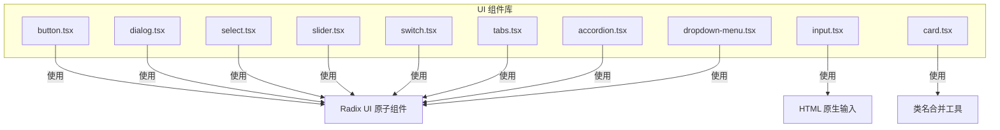
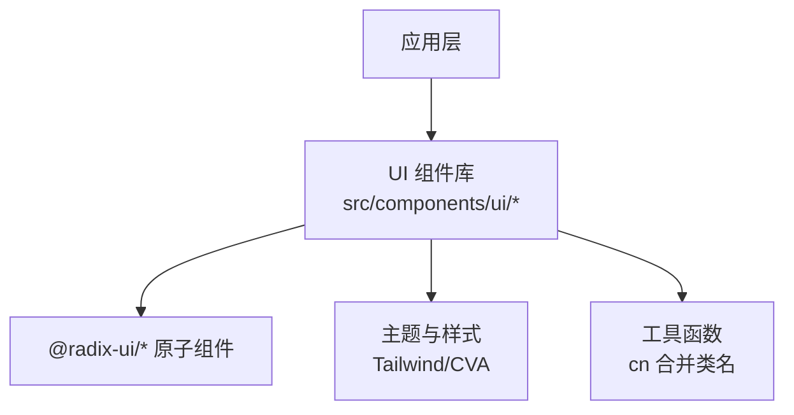
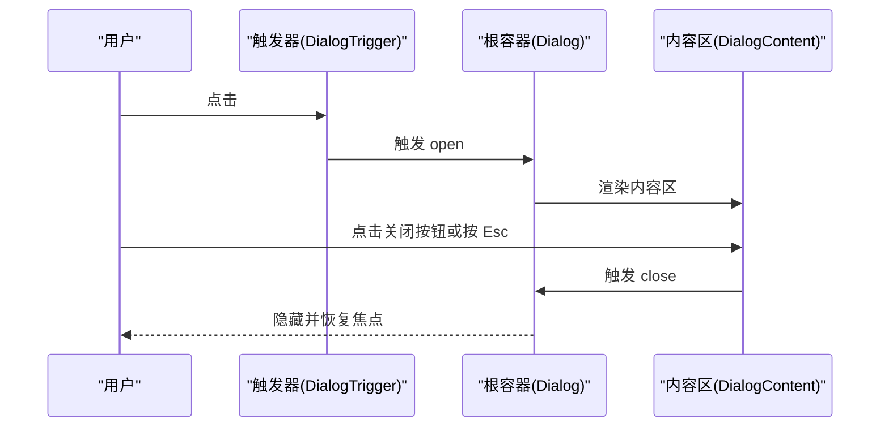
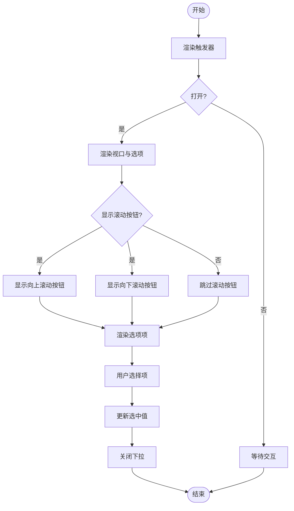
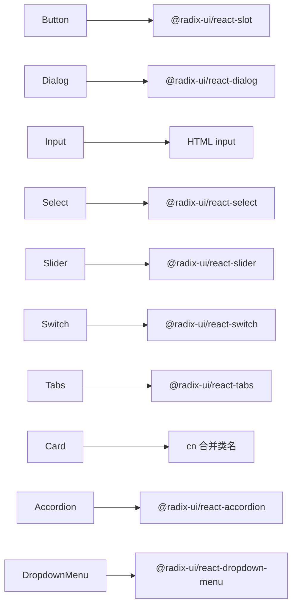

# UI组件库API

<cite>
**本文引用的文件**
- [button.tsx](file://src/components/ui/button.tsx)
- [dialog.tsx](file://src/components/ui/dialog.tsx)
- [input.tsx](file://src/components/ui/input.tsx)
- [select.tsx](file://src/components/ui/select.tsx)
- [slider.tsx](file://src/components/ui/slider.tsx)
- [switch.tsx](file://src/components/ui/switch.tsx)
- [tabs.tsx](file://src/components/ui/tabs.tsx)
- [card.tsx](file://src/components/ui/card.tsx)
- [accordion.tsx](file://src/components/ui/accordion.tsx)
- [dropdown-menu.tsx](file://src/components/ui/dropdown-menu.tsx)
</cite>

## 目录
1. [简介](#简介)
2. [项目结构](#项目结构)
3. [核心组件](#核心组件)
4. [架构总览](#架构总览)
5. [详细组件分析](#详细组件分析)
6. [依赖关系分析](#依赖关系分析)
7. [性能考量](#性能考量)
8. [故障排查指南](#故障排查指南)
9. [结论](#结论)
10. [附录](#附录)

## 简介
本文件为 OpenScreen 的 UI 组件库 API 参考文档，覆盖基础交互与布局组件的 props 接口、数据绑定、状态控制、样式定制、主题支持与响应式行为，并提供组合使用与无障碍访问的最佳实践建议。目标是帮助开发者快速理解并正确使用各组件。

## 项目结构
UI 组件集中位于 src/components/ui 目录，采用按功能分层的组织方式：基础按钮、输入、选择、滑块、开关、对话框、标签页、卡片、手风琴、下拉菜单等。组件均基于 Radix UI 原子能力进行封装，结合 Tailwind CSS 类名工具实现一致的视觉与交互体验。

图表来源
- [button.tsx:1-51](file://src/components/ui/button.tsx#L1-L51)
- [dialog.tsx:1-103](file://src/components/ui/dialog.tsx#L1-L103)
- [input.tsx:1-24](file://src/components/ui/input.tsx#L1-L24)
- [select.tsx:1-171](file://src/components/ui/select.tsx#L1-L171)
- [slider.tsx:1-24](file://src/components/ui/slider.tsx#L1-L24)
- [switch.tsx:1-31](file://src/components/ui/switch.tsx#L1-L31)
- [tabs.tsx:1-54](file://src/components/ui/tabs.tsx#L1-L54)
- [card.tsx:1-56](file://src/components/ui/card.tsx#L1-L56)
- [accordion.tsx:1-56](file://src/components/ui/accordion.tsx#L1-L56)
- [dropdown-menu.tsx:1-195](file://src/components/ui/dropdown-menu.tsx#L1-L195)

章节来源
- [button.tsx:1-51](file://src/components/ui/button.tsx#L1-L51)
- [dialog.tsx:1-103](file://src/components/ui/dialog.tsx#L1-L103)
- [input.tsx:1-24](file://src/components/ui/input.tsx#L1-L24)
- [select.tsx:1-171](file://src/components/ui/select.tsx#L1-L171)
- [slider.tsx:1-24](file://src/components/ui/slider.tsx#L1-L24)
- [switch.tsx:1-31](file://src/components/ui/switch.tsx#L1-L31)
- [tabs.tsx:1-54](file://src/components/ui/tabs.tsx#L1-L54)
- [card.tsx:1-56](file://src/components/ui/card.tsx#L1-L56)
- [accordion.tsx:1-56](file://src/components/ui/accordion.tsx#L1-L56)
- [dropdown-menu.tsx:1-195](file://src/components/ui/dropdown-menu.tsx#L1-L195)

## 核心组件
本节概述各组件的关键职责与通用能力：
- 按钮 Button：提供多种尺寸与外观变体，支持作为容器元素渲染，具备禁用态与图标支持。
- 对话框 Dialog：提供根容器、触发器、内容区、标题、描述、页脚等子组件，支持门户渲染与动画。
- 输入框 Input：原生输入封装，支持类型与禁用态，继承标准 HTML 属性。
- 选择器 Select：支持分组、滚动按钮、视口自定义、弹出定位与多选项渲染。
- 滑块 Slider：单值/多值滑块，支持轨道、范围与拇指交互。
- 开关 Switch：受控/非受控均可，提供状态切换与无障碍支持。
- 标签页 Tabs：列表、触发器、内容区，支持路由集成（通过外部状态管理）。
- 卡片 Card：卡片容器与头部/标题/描述/内容/底部等子区域。
- 手风琴 Accordion：可折叠项、触发器与内容区，支持动画展开/收起。
- 下拉菜单 DropdownMenu：主菜单、子菜单、复选/单选项、分隔符与快捷键提示。

章节来源
- [button.tsx:34-51](file://src/components/ui/button.tsx#L34-L51)
- [dialog.tsx:7-103](file://src/components/ui/dialog.tsx#L7-L103)
- [input.tsx:4-24](file://src/components/ui/input.tsx#L4-L24)
- [select.tsx:9-171](file://src/components/ui/select.tsx#L9-L171)
- [slider.tsx:6-24](file://src/components/ui/slider.tsx#L6-L24)
- [switch.tsx:6-31](file://src/components/ui/switch.tsx#L6-L31)
- [tabs.tsx:6-54](file://src/components/ui/tabs.tsx#L6-L54)
- [card.tsx:5-56](file://src/components/ui/card.tsx#L5-L56)
- [accordion.tsx:7-56](file://src/components/ui/accordion.tsx#L7-L56)
- [dropdown-menu.tsx:7-195](file://src/components/ui/dropdown-menu.tsx#L7-L195)

## 架构总览
组件统一通过 Radix UI 提供可访问性与跨浏览器一致性，使用 class-variance-authority 实现变体系统，借助 cn 工具函数合并类名，确保主题与响应式行为的一致性。

图表来源
- [button.tsx:1-6](file://src/components/ui/button.tsx#L1-L6)
- [dialog.tsx:1-6](file://src/components/ui/dialog.tsx#L1-L6)
- [select.tsx:1-8](file://src/components/ui/select.tsx#L1-L8)
- [tabs.tsx:1-5](file://src/components/ui/tabs.tsx#L1-L5)

## 详细组件分析

### 按钮 Button
- 能力概览
  - 尺寸：默认、小、大、图标尺寸
  - 变体：默认、破坏性、描边、次级、幽灵、链接
  - 行为：禁用态、图标内嵌、作为容器元素渲染（asChild）
  - 样式：基于 class-variance-authority 的变体系统，支持传入额外类名
- 关键 props
  - 继承自 HTMLButtonElement 的标准属性
  - variant: "default" | "destructive" | "outline" | "secondary" | "ghost" | "link"
  - size: "default" | "sm" | "lg" | "icon"
  - asChild?: boolean
- 最佳实践
  - 图标按钮使用 icon 尺寸与 asChild 渲染容器以保持语义正确
  - 禁用态需配合 aria-disabled 或视觉反馈
- 无障碍
  - 默认原生按钮语义，支持键盘激活与焦点环

章节来源
- [button.tsx:34-51](file://src/components/ui/button.tsx#L34-L51)
- [button.tsx:7-32](file://src/components/ui/button.tsx#L7-L32)

### 对话框 Dialog
- 能力概览
  - 根容器、触发器、内容区、覆盖层、标题、描述、页脚
  - 支持 Portal 渲染，避免层级与溢出问题
  - 内置开合动画与键盘交互（Esc 关闭）
- 关键 props
  - Root/Portal/Overlay/Content/Close/Trigger 等子组件均继承 Radix UI 对应原生组件的属性
  - Content 支持 position、侧向动画等 Radix 行为
- 使用流程（序列图）

图表来源
- [dialog.tsx:7-103](file://src/components/ui/dialog.tsx#L7-L103)

章节来源
- [dialog.tsx:7-103](file://src/components/ui/dialog.tsx#L7-L103)

### 输入框 Input
- 能力概览
  - 原生输入封装，支持类型、占位符、禁用态
  - 继承标准 HTML 输入属性，便于表单集成
- 关键 props
  - 继承自 HTMLInputElement 的标准属性（如 type、placeholder、disabled 等）
- 最佳实践
  - 与 Form/Field 组件配合，提供错误状态与辅助文本
  - 密码输入使用 type="password"

章节来源
- [input.tsx:4-24](file://src/components/ui/input.tsx#L4-L24)

### 选择器 Select
- 能力概览
  - 支持分组、标签、分隔符、滚动按钮、视口自定义
  - 弹出定位可选“popper”或其它位置策略
  - 多选/单选可通过外部状态管理实现（组件提供基础项与指示器）
- 关键 props
  - Content 支持 position、showScrollButtons、viewportClassName
  - Item 支持禁用态与选中指示器
  - Trigger 支持禁用态与图标
- 数据绑定与渲染
  - 使用 Root/Group/Label/Item/Value 等原子组件组合
  - 通过外部状态控制 value 与 open 状态
- 流程图（选项渲染与滚动）

图表来源
- [select.tsx:63-111](file://src/components/ui/select.tsx#L63-L111)
- [select.tsx:124-145](file://src/components/ui/select.tsx#L124-L145)

章节来源
- [select.tsx:9-171](file://src/components/ui/select.tsx#L9-L171)

### 滑块 Slider
- 能力概览
  - 单值/多值滑块，支持轨道、范围与拇指
  - 自定义轨道颜色、拇指样式与禁用态
- 关键 props
  - 继承 Radix Slider 原生属性（如 value、onValueChange、min、max、step 等）
- 最佳实践
  - 多值场景建议使用受控模式，保证 UI 与状态同步
  - 结合数值格式化与标签显示提升可读性

章节来源
- [slider.tsx:6-24](file://src/components/ui/slider.tsx#L6-L24)

### 开关 Switch
- 能力概览
  - 支持受控/非受控两种模式
  - 状态切换时提供视觉反馈与过渡动画
- 关键 props
  - 继承 Radix Switch 原生属性（如 checked、onCheckedChange、disabled 等）
- 最佳实践
  - 与表单联动时使用受控模式，确保状态一致
  - 提供明确的标签与说明文本

章节来源
- [switch.tsx:6-31](file://src/components/ui/switch.tsx#L6-L31)

### 标签页 Tabs
- 能力概览
  - 列表、触发器、内容区三部分组成
  - 支持路由集成（通过外部状态管理当前激活标签）
- 关键 props
  - Root/Trigger/Content 继承 Radix Tabs 原生属性（如 value、onValueChange、orientation 等）
- 最佳实践
  - 使用受控模式管理当前激活标签，避免意外状态变化
  - 内容区懒加载以优化性能

章节来源
- [tabs.tsx:6-54](file://src/components/ui/tabs.tsx#L6-L54)

### 卡片 Card
- 能力概览
  - 卡片容器与头部/标题/描述/内容/底部等子区域
  - 适合承载复杂信息与操作入口
- 关键 props
  - 继承 HTMLDivElement 的标准属性
- 最佳实践
  - 合理划分头部与内容区域，避免信息过载
  - 与按钮、列表等组件组合使用

章节来源
- [card.tsx:5-56](file://src/components/ui/card.tsx#L5-L56)

### 手风琴 Accordion
- 能力概览
  - 可折叠项、触发器与内容区，支持动画展开/收起
  - 触发器支持旋转图标与状态指示
- 关键 props
  - Item/Trigger/Content 继承 Radix Accordion 原生属性（如 type、value、onValueChange 等）
- 最佳实践
  - 控制单开或多开模式，避免过多内容同时展开
  - 为每个面板提供清晰的标题与简要描述

章节来源
- [accordion.tsx:7-56](file://src/components/ui/accordion.tsx#L7-L56)

### 下拉菜单 DropdownMenu
- 能力概览
  - 主菜单、子菜单、复选/单选项、分隔符与快捷键提示
  - 支持 Portal 渲染与可选的 portalled 行为
- 关键 props
  - Content 支持 sideOffset、portalled 等
  - SubTrigger/SubContent 支持 inset 嵌套缩进
  - CheckboxItem/RadioItem 支持选中指示器
- 最佳实践
  - 使用 RadioGroup 实现互斥选项
  - 使用 CheckboxItem 实现多选项
  - 为快捷键提供可见提示

章节来源
- [dropdown-menu.tsx:55-80](file://src/components/ui/dropdown-menu.tsx#L55-L80)
- [dropdown-menu.tsx:100-143](file://src/components/ui/dropdown-menu.tsx#L100-L143)
- [dropdown-menu.tsx:145-177](file://src/components/ui/dropdown-menu.tsx#L145-L177)

## 依赖关系分析
- 组件间耦合
  - 大多数组件仅依赖 Radix UI 原子组件与工具函数，耦合度低
  - 通过 Portal 渲染避免层级与溢出问题，降低对父级布局的侵入
- 外部依赖
  - @radix-ui/react-*：提供可访问性与状态管理
  - lucide-react：提供图标
  - class-variance-authority：提供变体系统
  - Tailwind CSS：提供样式与主题能力

图表来源
- [button.tsx:1-6](file://src/components/ui/button.tsx#L1-L6)
- [dialog.tsx:1-6](file://src/components/ui/dialog.tsx#L1-L6)
- [select.tsx:1-8](file://src/components/ui/select.tsx#L1-L8)
- [tabs.tsx:1-5](file://src/components/ui/tabs.tsx#L1-L5)
- [accordion.tsx:1-6](file://src/components/ui/accordion.tsx#L1-L6)
- [dropdown-menu.tsx:1-6](file://src/components/ui/dropdown-menu.tsx#L1-L6)

## 性能考量
- 动画与渲染
  - Dialog/Select/DropdownMenu 使用 Portal 渲染，减少重排与溢出问题
  - Tabs/Accordion 内容区懒加载，避免一次性渲染大量 DOM
- 事件与状态
  - Slider/Switch/Select 等组件建议使用受控模式，避免不必要的重渲染
- 主题与样式
  - 使用 Tailwind 类名与 CVA 变体，减少运行时样式计算

## 故障排查指南
- 对话框无法关闭
  - 检查是否正确使用 DialogTrigger 与 DialogClose
  - 确认内容区未阻止默认关闭行为
- 选择器选项不显示
  - 确认已正确使用 Group/Label/Item 组合
  - 检查 viewportClassName 是否导致溢出
- 滑块无响应
  - 确认使用受控模式并正确处理 onValueChange
  - 检查 min/max/step 设置是否合理
- 开关状态不同步
  - 确认 checked 与 onCheckedChange 成对出现
  - 检查外部状态是否被意外覆盖
- 标签页路由不同步
  - 确认使用受控模式并通过外部状态管理当前激活标签
- 下拉菜单层级异常
  - 检查 portalled 与 Portal 的使用，避免层级冲突

章节来源
- [dialog.tsx:91-103](file://src/components/ui/dialog.tsx#L91-L103)
- [select.tsx:159-171](file://src/components/ui/select.tsx#L159-L171)
- [slider.tsx:6-24](file://src/components/ui/slider.tsx#L6-L24)
- [switch.tsx:6-31](file://src/components/ui/switch.tsx#L6-L31)
- [tabs.tsx:6-54](file://src/components/ui/tabs.tsx#L6-L54)
- [dropdown-menu.tsx:55-80](file://src/components/ui/dropdown-menu.tsx#L55-L80)

## 结论
OpenScreen 的 UI 组件库在可访问性、一致性与扩展性方面表现良好。通过 Radix UI 原子能力与 CVA 变体系统，组件具备良好的主题适配与响应式行为。建议在实际项目中遵循受控模式、合理的数据绑定与组合使用原则，以获得更稳定与可维护的用户体验。

## 附录
- 样式定制与主题
  - 使用 Tailwind 类名覆盖默认样式
  - 通过 CVA 变体系统扩展更多尺寸与外观
- 响应式行为
  - 组件普遍支持移动端手势与触摸交互
  - 建议在窄屏设备上调整尺寸与间距
- 无障碍支持
  - 组件均基于 Radix UI，具备键盘导航与屏幕阅读器支持
  - 建议为关键交互提供 ARIA 标签与提示文本