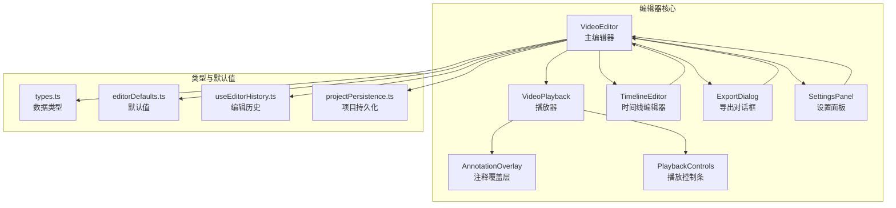
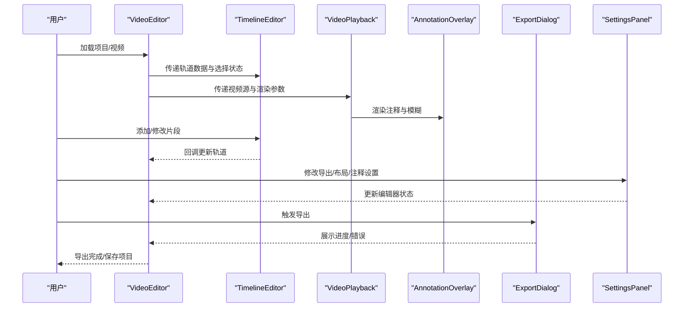
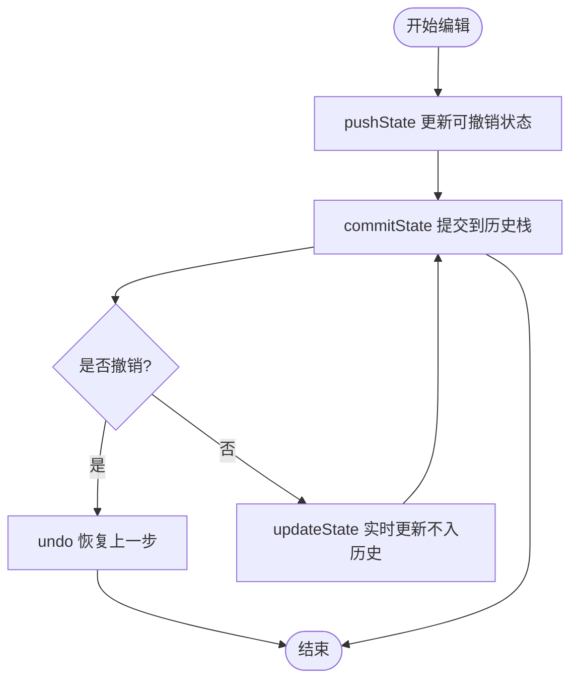
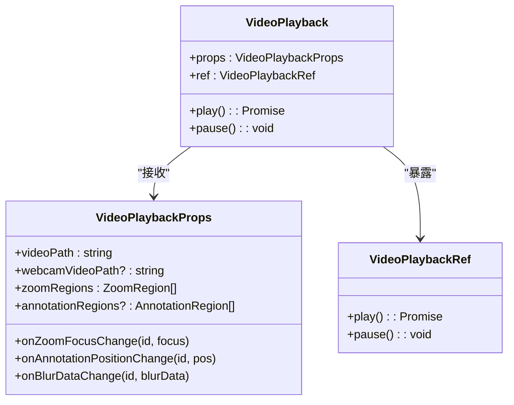
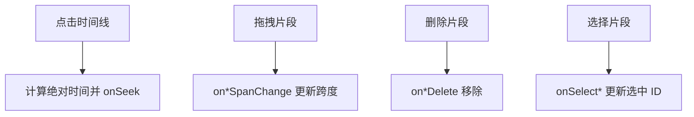
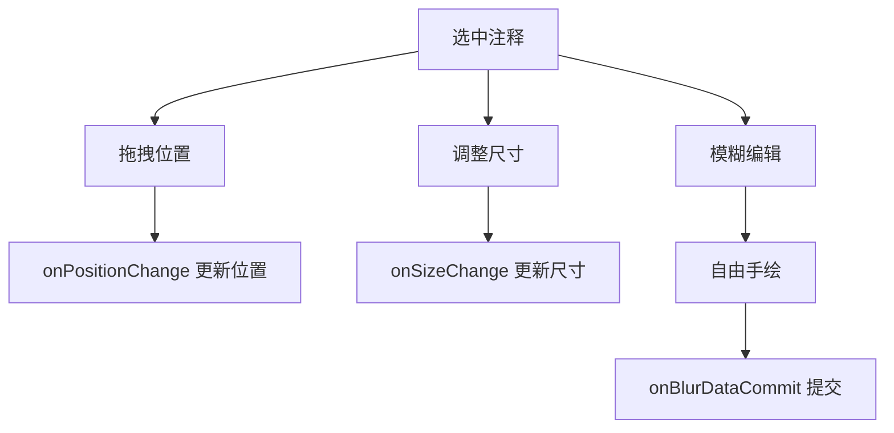
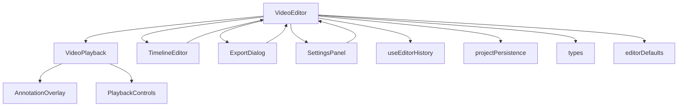

# 核心编辑器组件

<cite>
**本文档引用的文件**
- [VideoEditor.tsx](file://src/components/video-editor/VideoEditor.tsx)
- [VideoPlayback.tsx](file://src/components/video-editor/VideoPlayback.tsx)
- [TimelineEditor.tsx](file://src/components/video-editor/timeline/TimelineEditor.tsx)
- [AnnotationOverlay.tsx](file://src/components/video-editor/AnnotationOverlay.tsx)
- [ExportDialog.tsx](file://src/components/video-editor/ExportDialog.tsx)
- [SettingsPanel.tsx](file://src/components/video-editor/SettingsPanel.tsx)
- [types.ts](file://src/components/video-editor/types.ts)
- [editorDefaults.ts](file://src/components/video-editor/editorDefaults.ts)
- [useEditorHistory.ts](file://src/hooks/useEditorHistory.ts)
- [projectPersistence.ts](file://src/components/video-editor/projectPersistence.ts)
- [PlaybackControls.tsx](file://src/components/video-editor/PlaybackControls.tsx)
- [AnnotationSettingsPanel.tsx](file://src/components/video-editor/AnnotationSettingsPanel.tsx)
- [BlurSettingsPanel.tsx](file://src/components/video-editor/BlurSettingsPanel.tsx)
- [index.ts](file://src/lib/exporter/index.ts)
</cite>

## 目录
1. [简介](#简介)
2. [项目结构](#项目结构)
3. [核心组件](#核心组件)
4. [架构总览](#架构总览)
5. [详细组件分析](#详细组件分析)
6. [依赖关系分析](#依赖关系分析)
7. [性能考虑](#性能考虑)
8. [故障排除指南](#故障排除指南)
9. [结论](#结论)
10. [附录](#附录)

## 简介
本文件为 OpenScreen 核心编辑器组件的详细 API 参考文档，涵盖以下组件：
- VideoEditor 主编辑器：负责项目状态管理、编辑历史、导出配置与工作流协调
- VideoPlayback 播放器：负责视频渲染、缩放区域、注释叠加、光标可视化与播放控制
- TimelineEditor 时间线编辑器：负责轨道管理、片段操作、关键帧标记与播放头同步
- AnnotationOverlay 注释覆盖层：负责注释绘制、交互事件与自由手绘模糊
- ExportDialog 导出对话框：负责导出进度展示、取消与完成反馈
- SettingsPanel 设置面板：负责布局、特效、导出、注释与模糊设置
- PlaybackControls 播放控制条：负责播放/暂停、进度条与全屏切换

文档同时提供使用示例、状态管理模式与错误处理方案，帮助开发者快速集成与扩展。

## 项目结构
OpenScreen 的编辑器组件位于 `src/components/video-editor` 目录下，采用按功能分层的组织方式：
- 视频播放与渲染：VideoPlayback、PlaybackControls
- 时间线编辑：TimelineEditor 及其子组件（Row、Item、KeyframeMarkers 等）
- 注释系统：AnnotationOverlay、AnnotationSettingsPanel、BlurSettingsPanel
- 导出与设置：ExportDialog、SettingsPanel、editorDefaults、projectPersistence
- 类型与默认值：types.ts、editorDefaults.ts
- 历史与持久化：useEditorHistory.ts、projectPersistence.ts

**图表来源**
- [VideoEditor.tsx:179-800](file://src/components/video-editor/VideoEditor.tsx#L179-L800)
- [VideoPlayback.tsx:224-660](file://src/components/video-editor/VideoPlayback.tsx#L224-L660)
- [TimelineEditor.tsx:59-112](file://src/components/video-editor/timeline/TimelineEditor.tsx#L59-L112)
- [AnnotationOverlay.tsx:40-56](file://src/components/video-editor/AnnotationOverlay.tsx#L40-L56)
- [ExportDialog.tsx:7-29](file://src/components/video-editor/ExportDialog.tsx#L7-L29)
- [SettingsPanel.tsx:238-346](file://src/components/video-editor/SettingsPanel.tsx#L238-L346)
- [PlaybackControls.tsx:6-24](file://src/components/video-editor/PlaybackControls.tsx#L6-L24)
- [types.ts:1-439](file://src/components/video-editor/types.ts#L1-L439)
- [editorDefaults.ts:1-98](file://src/components/video-editor/editorDefaults.ts#L1-L98)
- [useEditorHistory.ts:22-66](file://src/hooks/useEditorHistory.ts#L22-L66)
- [projectPersistence.ts:67-98](file://src/components/video-editor/projectPersistence.ts#L67-L98)

**章节来源**
- [VideoEditor.tsx:179-800](file://src/components/video-editor/VideoEditor.tsx#L179-L800)
- [VideoPlayback.tsx:224-660](file://src/components/video-editor/VideoPlayback.tsx#L224-L660)
- [TimelineEditor.tsx:59-112](file://src/components/video-editor/timeline/TimelineEditor.tsx#L59-L112)
- [AnnotationOverlay.tsx:40-56](file://src/components/video-editor/AnnotationOverlay.tsx#L40-L56)
- [ExportDialog.tsx:7-29](file://src/components/video-editor/ExportDialog.tsx#L7-L29)
- [SettingsPanel.tsx:238-346](file://src/components/video-editor/SettingsPanel.tsx#L238-L346)
- [PlaybackControls.tsx:6-24](file://src/components/video-editor/PlaybackControls.tsx#L6-L24)
- [types.ts:1-439](file://src/components/video-editor/types.ts#L1-L439)
- [editorDefaults.ts:1-98](file://src/components/video-editor/editorDefaults.ts#L1-L98)
- [useEditorHistory.ts:22-66](file://src/hooks/useEditorHistory.ts#L22-L66)
- [projectPersistence.ts:67-98](file://src/components/video-editor/projectPersistence.ts#L67-L98)

## 核心组件

### VideoEditor 主编辑器
VideoEditor 是编辑器的中枢，负责：
- 维护编辑器状态（zoomRegions、trimRegions、speedRegions、annotationRegions、ttsRegions、裁剪、壁纸、阴影强度、模糊、运动模糊、圆角、内边距、纵横比、网络摄像头布局等）
- 编辑历史（撤销/重做/提交/重置）
- 项目加载/保存/快照比较
- 导出流程（格式、质量、GIF 参数）
- 光标数据与 Telemetry 集成
- 未保存变更提示与窗口关闭确认

主要 props 接口（节选）：
- 视频源与摄像头路径：videoPath、videoSourcePath、webcamVideoPath、webcamVideoSourcePath
- 当前项目路径：currentProjectPath
- 播放控制：isPlaying、currentTime、duration
- 选择状态：selectedZoomId、selectedTrimId、selectedSpeedId、selectedAnnotationId、selectedBlurId、selectedTTSId
- 导出配置：exportFormat、exportQuality、gifFrameRate、gifLoop、gifSizePreset、exportedFilePath
- 未保存导出：unsavedExport
- 全屏：isFullscreen
- 对话框状态：showExportDialog、showNewRecordingDialog、showCloseConfirmDialog
- 渲染器引用：playerContainerRef
- 光标数据：cursorTelemetry、cursorRecordingData、cursorClickTimestamps
- 布尔偏好：showCursor、showBlur、showTrimWaveform
- 历史钩子：useEditorHistory 返回的状态与方法

状态管理模式：
- 使用 useEditorHistory 提供的 pushState/updateState/commitState/undo/redo/resetState
- 通过 createProjectSnapshot 生成快照，结合 hasProjectUnsavedChanges 判断未保存变更
- 通过 applyLoadedProject 与 normalizeProjectEditor 解析与校验项目数据

错误处理：
- 加载失败时设置 error 并通过 toast 提示
- 导出失败时构建诊断消息并显示在 ExportDialog 中

使用示例（概念性）：
- 初始化编辑器：传入 videoPath 或项目数据，调用 applyLoadedProject
- 修改编辑器状态：通过 pushState/updateState 更新 zoomRegions/annotationRegions 等
- 导出视频：设置 exportFormat/exportQuality，打开 ExportDialog，监听进度与错误

**章节来源**
- [VideoEditor.tsx:179-800](file://src/components/video-editor/VideoEditor.tsx#L179-L800)
- [useEditorHistory.ts:91-155](file://src/hooks/useEditorHistory.ts#L91-L155)
- [projectPersistence.ts:545-571](file://src/components/video-editor/projectPersistence.ts#L545-L571)

### VideoPlayback 播放器
VideoPlayback 负责：
- PixiJS 渲染管线与 HTMLVideoElement 播放
- 缩放区域渲染与焦点拖拽
- 注释叠加（文本/图像/箭头/模糊）
- 光标可视化（Telemetry/Native）
- 摄像头画中画拖拽
- 播放状态、时间更新、时长解析

主要 props 接口（节选）：
- 视频源：videoPath、webcamVideoPath
- 布局与外观：padding、borderRadius、aspectRatio、wallpaper
- 缩放区域：zoomRegions、selectedZoomId、onSelectZoom、onZoomFocusChange、onZoomFocusDragEnd、isPreviewingZoom
- 注释与模糊：annotationRegions、blurRegions、selectedAnnotationId、selectedBlurId
- 回调：onDurationChange、onTimeUpdate、onPlayStateChange、onError
- 播放控制：isPlaying、currentTime
- 光标：cursorRecordingData、cursorTelemetry、cursorClickTimestamps、showCursor、cursorSize、cursorSmoothing、cursorMotionBlur、cursorClickBounce、cursorClipToBounds
- 摄像头：webcamLayoutPreset、webcamMaskShape、webcamMirrored、webcamSizePreset、webcamPosition、onWebcamPositionChange、onWebcamPositionDragEnd

交互事件：
- 缩放焦点拖拽：handleOverlayPointerDown/Move/Up/Leave
- 摄像头拖拽：handleWebcamPointerDown/Move/Up
- 播放控制：forwardRef 暴露 play/pause

使用示例（概念性）：
- 在 VideoEditor 中通过 ref 调用 play/pause
- 通过 onZoomFocusChange 更新选中缩放区域的焦点
- 通过 annotationRegions/blurRegions 驱动 AnnotationOverlay 渲染

**章节来源**
- [VideoPlayback.tsx:101-157](file://src/components/video-editor/VideoPlayback.tsx#L101-L157)
- [VideoPlayback.tsx:224-660](file://src/components/video-editor/VideoPlayback.tsx#L224-L660)

### TimelineEditor 时间线编辑器
TimelineEditor 负责：
- 时间轴缩放与滚动
- 播放头与关键帧对齐
- 各轨道（zoom、trim、annotation、speed、blur、tts）的增删改查
- 自动字幕建议与波形显示

主要 props 接口（节选）：
- 视频时长与当前时间：videoDuration、currentTime、onSeek
- 数据源：zoomRegions、trimRegions、annotationRegions、blurRegions、speedRegions、ttsRegions
- 选择状态：selectedZoomId、selectedTrimId、selectedAnnotationId、selectedBlurId、selectedSpeedId、selectedTTSId
- 回调：onZoomAdded/onZoomSpanChange/onZoomDelete、onTrimAdded/onTrimSpanChange/onTrimDelete、onAnnotationAdded/onAnnotationSpanChange/onAnnotationDelete、onBlurAdded/onBlurSpanChange/onBlurDelete、onSpeedAdded/onSpeedSpanChange/onSpeedDelete、onTTSAdded/onTTSSpanChange/onTTSDelete
- 布局：aspectRatio、onAspectRatioChange
- 波形：showTrimWaveform
- 自动字幕：onGenerateCaptions、isGeneratingCaptions、captionsLabel

使用示例（概念性）：
- 新增缩放片段：onZoomAdded(span)
- 更新片段跨度：onZoomSpanChange(id, span)
- 删除片段：onZoomDelete(id)
- 选择片段：onSelectZoom(id)

**章节来源**
- [TimelineEditor.tsx:59-112](file://src/components/video-editor/timeline/TimelineEditor.tsx#L59-L112)
- [TimelineEditor.tsx:573-800](file://src/components/video-editor/timeline/TimelineEditor.tsx#L573-L800)

### AnnotationOverlay 注释覆盖层
AnnotationOverlay 负责：
- 文本、图像、箭头、模糊注释的渲染
- 注释位置与尺寸拖拽
- 模糊自由手绘绘制与提交
- 选中态高亮与交互

主要 props 接口（节选）：
- 注释数据：annotation、containerWidth、containerHeight
- 选择状态：isSelected、isSelectedBoost、zIndex
- 回调：onPositionChange、onSizeChange、onClick
- 模糊回调：onBlurDataChange、onBlurDataCommit
- 预览：previewSourceCanvas、previewFrameVersion、currentTimeMs

交互事件：
- Rnd 拖拽与调整尺寸
- 模糊自由手绘：handleFreehandPointerDown/Move/Up/Cancel
- 提交：finishFreehandPointer 调用 onBlurDataCommit

使用示例（概念性）：
- 选中注释后允许拖拽与调整尺寸
- 模糊注释支持自由手绘并提交

**章节来源**
- [AnnotationOverlay.tsx:40-56](file://src/components/video-editor/AnnotationOverlay.tsx#L40-L56)
- [AnnotationOverlay.tsx:223-286](file://src/components/video-editor/AnnotationOverlay.tsx#L223-L286)

### ExportDialog 导出对话框
ExportDialog 负责：
- 导出进度展示（渲染帧数、百分比、编译阶段）
- 错误提示与取消导出
- 完成后的成功提示与打开文件夹按钮

主要 props 接口（节选）：
- 状态：isOpen、isExporting、progress、error、exportFormat、exportedFilePath
- 回调：onClose、onCancel、onShowInFolder

使用示例（概念性）：
- 打开对话框：setShowExportDialog(true)
- 监听进度：progress.percentage/renderProgress
- 处理错误：error 存在时显示错误卡片

**章节来源**
- [ExportDialog.tsx:7-29](file://src/components/video-editor/ExportDialog.tsx#L7-L29)
- [ExportDialog.tsx:19-57](file://src/components/video-editor/ExportDialog.tsx#L19-L57)

### SettingsPanel 设置面板
SettingsPanel 负责：
- 背景与效果（阴影强度、模糊、运动模糊、圆角、内边距、裁剪）
- 导出设置（格式、质量、GIF 帧率、循环、尺寸预设）
- 注释与模糊设置（类型、样式、颜色、形状、方块大小）
- 光标设置（显示、大小、平滑、运动模糊、点击弹跳、边界裁剪）
- 时间线与 TTS 设置

主要 props 接口（节选）：
- 选择状态：selected、selectedZoomId、selectedTrimId、selectedAnnotationId、selectedBlurId、selectedSpeedId、selectedTTSId
- 回调：onWallpaperChange、onZoomDepthChange、onZoomFocusModeChange、onZoomFocusCoordinateChange、onZoomDelete、onTrimDelete、onExport、onExportPanelOpen、onSaveUnsavedExport、onAnnotationContentChange、onAnnotationTypeChange、onAnnotationStyleChange、onAnnotationFigureDataChange、onAnnotationDuplicate、onAnnotationDelete、onBlurDataChange、onBlurDataCommit、onBlurDelete、onSpeedChange、onSpeedDelete、onWebcamLayoutPresetChange、onWebcamMaskShapeChange、onWebcamMirroredChange、onWebcamSizePresetChange、onTTSAudioGenerated、onTTSSegmentsAdded
- 视频与源：videoElement、videoDurationMs、hasWebcam、hasCursorTelemetry、hasCursorData、showCursorSettings

使用示例（概念性）：
- 修改导出质量：onExportQualityChange('good')
- 更换背景壁纸：onWallpaperChange('/wallpapers/wallpaper1.jpg')
- 删除选中注释：onAnnotationDelete(id)

**章节来源**
- [SettingsPanel.tsx:238-346](file://src/components/video-editor/SettingsPanel.tsx#L238-L346)
- [SettingsPanel.tsx:377-480](file://src/components/video-editor/SettingsPanel.tsx#L377-L480)

### PlaybackControls 播放控制条
PlaybackControls 负责：
- 播放/暂停切换
- 进度条拖拽
- 全屏切换

主要 props 接口（节选）：
- 状态：isPlaying、currentTime、duration、isFullscreen
- 回调：onTogglePlayPause、onSeek、onToggleFullscreen

使用示例（概念性）：
- onTogglePlayPause 切换播放状态
- onSeek 跳转到指定时间

**章节来源**
- [PlaybackControls.tsx:6-24](file://src/components/video-editor/PlaybackControls.tsx#L6-L24)

## 架构总览

**图表来源**
- [VideoEditor.tsx:366-480](file://src/components/video-editor/VideoEditor.tsx#L366-L480)
- [TimelineEditor.tsx:59-112](file://src/components/video-editor/timeline/TimelineEditor.tsx#L59-L112)
- [VideoPlayback.tsx:224-660](file://src/components/video-editor/VideoPlayback.tsx#L224-L660)
- [AnnotationOverlay.tsx:40-56](file://src/components/video-editor/AnnotationOverlay.tsx#L40-L56)
- [ExportDialog.tsx:19-57](file://src/components/video-editor/ExportDialog.tsx#L19-L57)
- [SettingsPanel.tsx:238-346](file://src/components/video-editor/SettingsPanel.tsx#L238-L346)

## 详细组件分析

### VideoEditor 状态管理与历史
VideoEditor 通过 useEditorHistory 管理可撤销状态，并提供快照机制用于未保存变更检测：
- 可撤销状态字段：zoomRegions、trimRegions、speedRegions、annotationRegions、ttsRegions、cropRegion、wallpaper、shadowIntensity、showBlur、showTrimWaveform、motionBlurAmount、borderRadius、padding、aspectRatio、webcamLayoutPreset、webcamMaskShape、webcamMirrored、webcamSizePreset、webcamPosition
- 不可撤销状态：视频路径、播放状态、导出状态、对话框状态等
- 快照：createProjectSnapshot 与 hasProjectUnsavedChanges

**图表来源**
- [useEditorHistory.ts:91-155](file://src/hooks/useEditorHistory.ts#L91-L155)
- [projectPersistence.ts:556-571](file://src/components/video-editor/projectPersistence.ts#L556-L571)

**章节来源**
- [useEditorHistory.ts:22-66](file://src/hooks/useEditorHistory.ts#L22-L66)
- [projectPersistence.ts:545-571](file://src/components/video-editor/projectPersistence.ts#L545-L571)

### VideoPlayback 渲染与交互
VideoPlayback 将 PixiJS 与 HTMLVideoElement 结合，实现高质量渲染与交互：
- 缩放区域：根据 selectedZoomId 计算焦点与缩放，支持拖拽更新
- 注释叠加：基于 annotationRegions/blurRegions 渲染文本/图像/箭头/模糊
- 光标可视化：支持 Telemetry 与 Native 光标数据
- 摄像头：PiP 模式下的拖拽定位

**图表来源**
- [VideoPlayback.tsx:101-157](file://src/components/video-editor/VideoPlayback.tsx#L101-L157)
- [VideoPlayback.tsx:224-660](file://src/components/video-editor/VideoPlayback.tsx#L224-L660)

**章节来源**
- [VideoPlayback.tsx:101-157](file://src/components/video-editor/VideoPlayback.tsx#L101-L157)
- [VideoPlayback.tsx:694-732](file://src/components/video-editor/VideoPlayback.tsx#L694-L732)

### TimelineEditor 轨道与片段操作
TimelineEditor 通过 dnd-timeline 提供拖拽与缩放能力：
- 轨道：zoom、trim、annotation、speed、blur、tts
- 片段：Span 结构，支持增删改查
- 关键帧：自动字幕建议与播放头对齐

**图表来源**
- [TimelineEditor.tsx:59-112](file://src/components/video-editor/timeline/TimelineEditor.tsx#L59-L112)
- [TimelineEditor.tsx:573-800](file://src/components/video-editor/timeline/TimelineEditor.tsx#L573-L800)

**章节来源**
- [TimelineEditor.tsx:59-112](file://src/components/video-editor/timeline/TimelineEditor.tsx#L59-L112)
- [TimelineEditor.tsx:573-800](file://src/components/video-editor/timeline/TimelineEditor.tsx#L573-L800)

### AnnotationOverlay 绘制与交互
AnnotationOverlay 支持多种注释类型与交互：
- 文本：样式、字体、动画、对齐
- 图像：上传与预览
- 箭头：方向、颜色、粗细
- 模糊：矩形/椭圆/自由手绘，马赛克块大小与颜色

**图表来源**
- [AnnotationOverlay.tsx:40-56](file://src/components/video-editor/AnnotationOverlay.tsx#L40-L56)
- [AnnotationOverlay.tsx:223-286](file://src/components/video-editor/AnnotationOverlay.tsx#L223-L286)

**章节来源**
- [AnnotationOverlay.tsx:40-56](file://src/components/video-editor/AnnotationOverlay.tsx#L40-L56)
- [AnnotationOverlay.tsx:223-286](file://src/components/video-editor/AnnotationOverlay.tsx#L223-L286)

### SettingsPanel 配置与验证
SettingsPanel 提供丰富的配置项与验证规则：
- 导出：格式、质量、GIF 帧率、循环、尺寸预设
- 布局：内边距、圆角、裁剪、纵横比
- 效果：阴影强度、模糊开关、运动模糊
- 注释：类型、样式、颜色、字体、动画
- 模糊：形状、颜色、方块大小
- 光标：显示、大小、平滑、运动模糊、点击弹跳、边界裁剪

验证规则（示例）：
- 播放速度范围：最小 0.1，最大 16
- 模糊强度：最小 2，最大 40
- 模糊方块大小：最小 4，最大 48
- GIF 帧率：15/20/25/30
- 导出质量：medium/source

**章节来源**
- [SettingsPanel.tsx:238-346](file://src/components/video-editor/SettingsPanel.tsx#L238-L346)
- [types.ts:364-391](file://src/components/video-editor/types.ts#L364-L391)
- [types.ts:233-248](file://src/components/video-editor/types.ts#L233-L248)
- [index.ts:10-21](file://src/lib/exporter/index.ts#L10-L21)

## 依赖关系分析

**图表来源**
- [VideoEditor.tsx:179-800](file://src/components/video-editor/VideoEditor.tsx#L179-L800)
- [VideoPlayback.tsx:224-660](file://src/components/video-editor/VideoPlayback.tsx#L224-L660)
- [TimelineEditor.tsx:59-112](file://src/components/video-editor/timeline/TimelineEditor.tsx#L59-L112)
- [AnnotationOverlay.tsx:40-56](file://src/components/video-editor/AnnotationOverlay.tsx#L40-L56)
- [ExportDialog.tsx:7-29](file://src/components/video-editor/ExportDialog.tsx#L7-L29)
- [SettingsPanel.tsx:238-346](file://src/components/video-editor/SettingsPanel.tsx#L238-L346)
- [PlaybackControls.tsx:6-24](file://src/components/video-editor/PlaybackControls.tsx#L6-L24)
- [useEditorHistory.ts:91-155](file://src/hooks/useEditorHistory.ts#L91-L155)
- [projectPersistence.ts:545-571](file://src/components/video-editor/projectPersistence.ts#L545-L571)
- [types.ts:1-439](file://src/components/video-editor/types.ts#L1-L439)
- [editorDefaults.ts:1-98](file://src/components/video-editor/editorDefaults.ts#L1-L98)

**章节来源**
- [VideoEditor.tsx:179-800](file://src/components/video-editor/VideoEditor.tsx#L179-L800)
- [VideoPlayback.tsx:224-660](file://src/components/video-editor/VideoPlayback.tsx#L224-L660)
- [TimelineEditor.tsx:59-112](file://src/components/video-editor/timeline/TimelineEditor.tsx#L59-L112)
- [AnnotationOverlay.tsx:40-56](file://src/components/video-editor/AnnotationOverlay.tsx#L40-L56)
- [ExportDialog.tsx:7-29](file://src/components/video-editor/ExportDialog.tsx#L7-L29)
- [SettingsPanel.tsx:238-346](file://src/components/video-editor/SettingsPanel.tsx#L238-L346)
- [PlaybackControls.tsx:6-24](file://src/components/video-editor/PlaybackControls.tsx#L6-L24)
- [useEditorHistory.ts:91-155](file://src/hooks/useEditorHistory.ts#L91-L155)
- [projectPersistence.ts:545-571](file://src/components/video-editor/projectPersistence.ts#L545-L571)
- [types.ts:1-439](file://src/components/video-editor/types.ts#L1-L439)
- [editorDefaults.ts:1-98](file://src/components/video-editor/editorDefaults.ts#L1-L98)

## 性能考虑
- 渲染优化：VideoPlayback 使用 PixiJS 与运动模糊滤镜，注意在高分辨率与复杂注释场景下的 GPU 负载
- 缩放与焦点：缩放区域拖拽应限制更新频率，避免频繁重绘
- 导出性能：ExportDialog 显示编译阶段（GIF）与最终化阶段（MP4），合理设置导出质量与帧率以平衡质量与速度
- 项目持久化：快照生成与未保存变更检测应避免在高频更新时重复计算

## 故障排除指南
常见问题与处理：
- 导出失败：检查 ExportDialog 中的错误消息，确认源路径、输出尺寸、编解码器可用性
- 播放异常：VideoPlayback 内部会尝试解析时长与静音播放以获取时长，若失败请检查视频元数据
- 注释绘制异常：确保注释数据结构正确（position/size/style/blurData），模糊自由手绘需提交后生效
- 未保存变更：通过 hasProjectUnsavedChanges 与快照对比判断，必要时提示用户保存或丢弃

**章节来源**
- [VideoPlayback.tsx:378-480](file://src/components/video-editor/VideoPlayback.tsx#L378-L480)
- [ExportDialog.tsx:19-57](file://src/components/video-editor/ExportDialog.tsx#L19-L57)
- [projectPersistence.ts:563-571](file://src/components/video-editor/projectPersistence.ts#L563-L571)

## 结论
OpenScreen 的核心编辑器组件通过清晰的职责划分与完善的类型系统，提供了强大的视频编辑、注释与导出能力。VideoEditor 作为中枢协调各子组件，VideoPlayback 负责高质量渲染，TimelineEditor 提供直观的时间线操作，AnnotationOverlay 与 SettingsPanel 则分别满足注释绘制与配置管理需求。借助 useEditorHistory 与 projectPersistence，系统实现了可靠的编辑历史与项目持久化。

## 附录

### 类型与默认值概览
- 数据类型：ZoomRegion、TrimRegion、SpeedRegion、AnnotationRegion、TTSRegion、ZoomFocus、BlurData、FigureData 等
- 默认值：DEFAULT_* 常量集中于 editorDefaults.ts，统一初始化与回退逻辑

**章节来源**
- [types.ts:62-439](file://src/components/video-editor/types.ts#L62-L439)
- [editorDefaults.ts:22-98](file://src/components/video-editor/editorDefaults.ts#L22-L98)