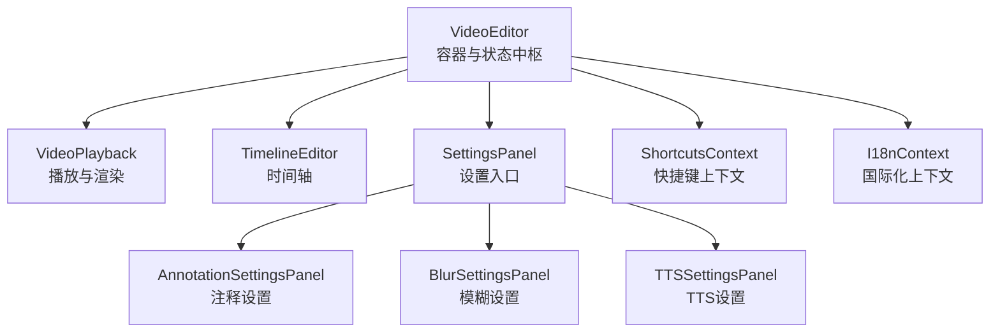
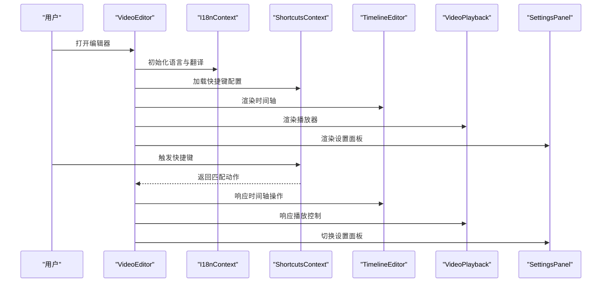
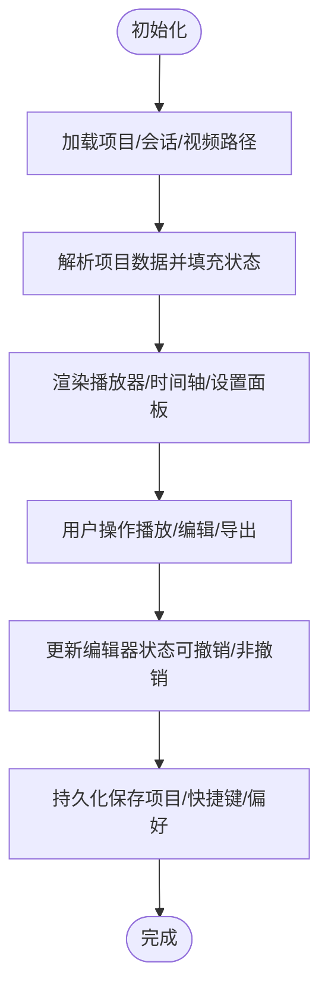
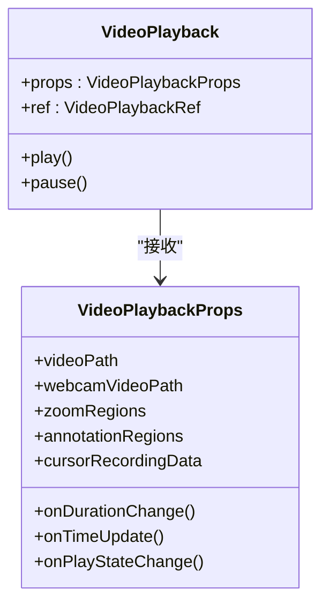
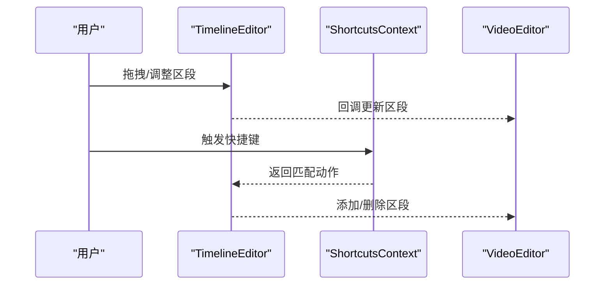
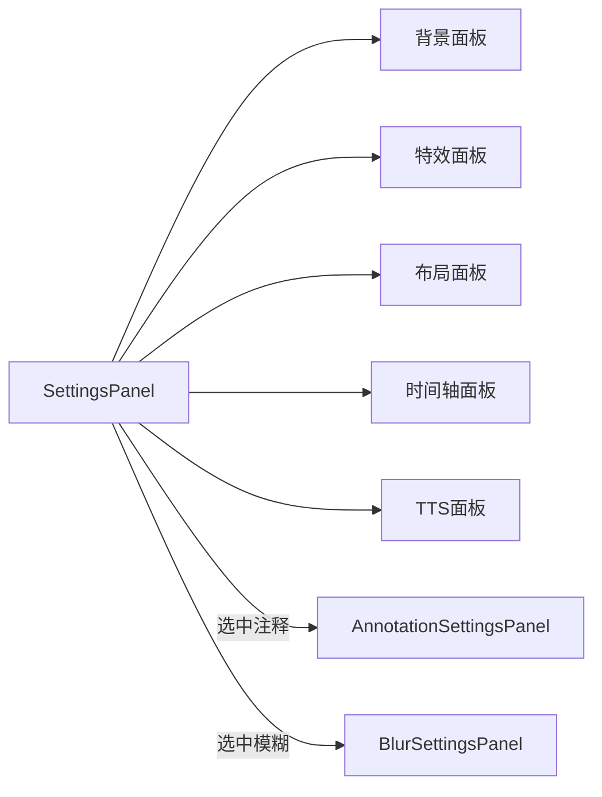
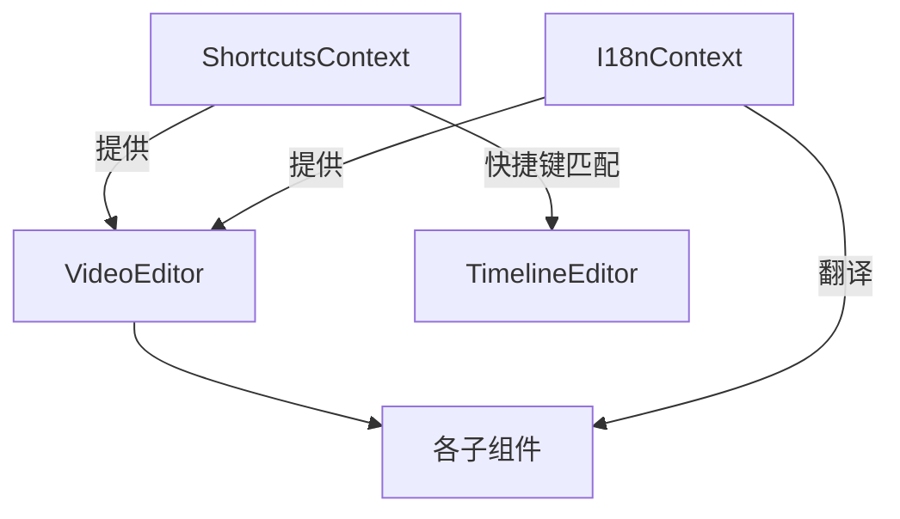
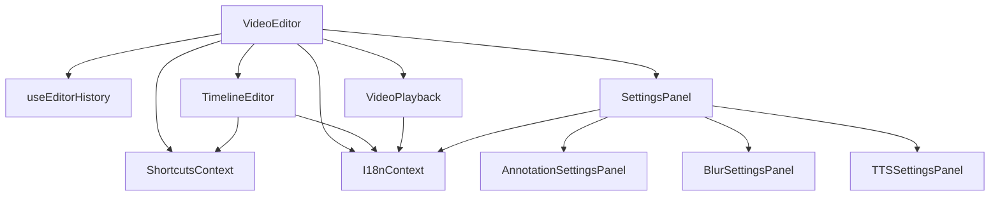

# 组件组合模式

<cite>
**本文引用的文件**
- [VideoEditor.tsx](file://src/components/video-editor/VideoEditor.tsx)
- [ShortcutsContext.tsx](file://src/contexts/ShortcutsContext.tsx)
- [I18nContext.tsx](file://src/contexts/I18nContext.tsx)
- [PlaybackControls.tsx](file://src/components/video-editor/PlaybackControls.tsx)
- [SettingsPanel.tsx](file://src/components/video-editor/SettingsPanel.tsx)
- [VideoPlayback.tsx](file://src/components/video-editor/VideoPlayback.tsx)
- [TimelineEditor.tsx](file://src/components/video-editor/timeline/TimelineEditor.tsx)
- [AnnotationSettingsPanel.tsx](file://src/components/video-editor/AnnotationSettingsPanel.tsx)
- [BlurSettingsPanel.tsx](file://src/components/video-editor/BlurSettingsPanel.tsx)
- [TTSSettingsPanel.tsx](file://src/components/video-editor/TTSSettingsPanel.tsx)
- [useEditorHistory.ts](file://src/hooks/useEditorHistory.ts)
- [shortcuts.ts](file://src/lib/shortcuts.ts)
- [types.ts](file://src/components/video-editor/types.ts)
- [index.ts](file://src/components/video-editor/index.ts)
</cite>

## 目录
1. [简介](#简介)
2. [项目结构](#项目结构)
3. [核心组件](#核心组件)
4. [架构总览](#架构总览)
5. [详细组件分析](#详细组件分析)
6. [依赖关系分析](#依赖关系分析)
7. [性能考量](#性能考量)
8. [故障排查指南](#故障排查指南)
9. [结论](#结论)
10. [附录](#附录)

## 简介
本文件系统性阐述 OpenScreen 的组件组合模式，聚焦视频编辑器 VideoEditor 如何通过“上下文系统 + 子组件协作”的方式，构建完整的编辑工作流。文档覆盖以下主题：
- 上下文系统：快捷键管理（ShortcutsContext）与国际化（I18nContext）的集成方式
- 数据传递：props 提升、状态共享与事件冒泡机制
- 条件渲染与动态加载策略
- 错误边界与异常处理
- 性能优化：懒加载、memo 化与虚拟化
- 最佳实践：高阶组件、render props、自定义 Hook
- 可测试性设计与单元测试策略

## 项目结构
OpenScreen 的视频编辑器采用“容器组件 + 多子面板 + 上下文注入”的分层组织方式：
- 容器层：VideoEditor 负责全局状态、生命周期与跨模块协调
- 视频播放层：VideoPlayback 使用 PixiJS 渲染视频与叠加层，承载播放控制与光标渲染
- 时间线层：TimelineEditor 基于 dnd-timeline 实现多轨道时间轴编辑
- 设置面板层：SettingsPanel 作为主设置入口，按需切换到 Annotation/Blur/TTS 等子面板
- 上下文层：ShortcutsContext 与 I18nContext 为全应用提供快捷键与本地化能力

图表来源
- [VideoEditor.tsx:179-800](file://src/components/video-editor/VideoEditor.tsx#L179-L800)
- [VideoPlayback.tsx:224-800](file://src/components/video-editor/VideoPlayback.tsx#L224-L800)
- [TimelineEditor.tsx:1-800](file://src/components/video-editor/timeline/TimelineEditor.tsx#L1-L800)
- [SettingsPanel.tsx:377-800](file://src/components/video-editor/SettingsPanel.tsx#L377-L800)
- [AnnotationSettingsPanel.tsx:86-674](file://src/components/video-editor/AnnotationSettingsPanel.tsx#L86-L674)
- [BlurSettingsPanel.tsx:25-194](file://src/components/video-editor/BlurSettingsPanel.tsx#L25-L194)
- [TTSSettingsPanel.tsx:27-618](file://src/components/video-editor/TTSSettingsPanel.tsx#L27-L618)
- [ShortcutsContext.tsx:31-83](file://src/contexts/ShortcutsContext.tsx#L31-L83)
- [I18nContext.tsx:88-193](file://src/contexts/I18nContext.tsx#L88-L193)

章节来源
- [VideoEditor.tsx:179-800](file://src/components/video-editor/VideoEditor.tsx#L179-L800)
- [index.ts:1-6](file://src/components/video-editor/index.ts#L1-L6)

## 核心组件
- VideoEditor：统一状态中心，负责项目加载、播放控制、导出流程、历史撤销/重做、国际化与快捷键集成
- VideoPlayback：基于 PixiJS 的视频渲染与叠加层，支持缩放、裁剪、遮罩、光标叠加、注释与模糊区域渲染
- TimelineEditor：拖拽式时间轴，支持缩放/修剪/速度/注释/模糊/TTS 区段管理
- SettingsPanel：主设置面板，按需切换到注释/模糊/TTS 子面板
- AnnotationSettingsPanel/BlurSettingsPanel/TTSSettingsPanel：针对特定类型的注释或效果的专用设置面板
- ShortcutsContext/I18nContext：全局上下文，提供快捷键配置与国际化翻译

章节来源
- [VideoEditor.tsx:179-800](file://src/components/video-editor/VideoEditor.tsx#L179-L800)
- [VideoPlayback.tsx:224-800](file://src/components/video-editor/VideoPlayback.tsx#L224-L800)
- [TimelineEditor.tsx:1-800](file://src/components/video-editor/timeline/TimelineEditor.tsx#L1-L800)
- [SettingsPanel.tsx:377-800](file://src/components/video-editor/SettingsPanel.tsx#L377-L800)
- [AnnotationSettingsPanel.tsx:86-674](file://src/components/video-editor/AnnotationSettingsPanel.tsx#L86-L674)
- [BlurSettingsPanel.tsx:25-194](file://src/components/video-editor/BlurSettingsPanel.tsx#L25-L194)
- [TTSSettingsPanel.tsx:27-618](file://src/components/video-editor/TTSSettingsPanel.tsx#L27-L618)
- [ShortcutsContext.tsx:31-83](file://src/contexts/ShortcutsContext.tsx#L31-L83)
- [I18nContext.tsx:88-193](file://src/contexts/I18nContext.tsx#L88-L193)

## 架构总览
VideoEditor 作为顶层容器，聚合多个子组件并通过上下文系统注入能力。其内部通过 useEditorHistory 管理可撤销的历史状态，通过 I18nContext 与 ShortcutsContext 提供本地化与快捷键支持。

图表来源
- [VideoEditor.tsx:312-325](file://src/components/video-editor/VideoEditor.tsx#L312-L325)
- [ShortcutsContext.tsx:36-64](file://src/contexts/ShortcutsContext.tsx#L36-L64)
- [I18nContext.tsx:101-116](file://src/contexts/I18nContext.tsx#L101-L116)
- [TimelineEditor.tsx:1-800](file://src/components/video-editor/timeline/TimelineEditor.tsx#L1-L800)
- [VideoPlayback.tsx:224-800](file://src/components/video-editor/VideoPlayback.tsx#L224-L800)
- [SettingsPanel.tsx:377-800](file://src/components/video-editor/SettingsPanel.tsx#L377-L800)

## 详细组件分析

### VideoEditor：编辑器工作流中枢
- 状态管理：使用 useEditorHistory 管理可撤销的历史状态；非撤销状态（如当前时间、播放状态等）通过 useState 管理
- 生命周期：初始化加载项目/会话/视频路径，解析项目数据并填充编辑器状态
- 导出与保存：封装保存项目、导出 GIF/视频、进度反馈与错误提示
- 国际化与快捷键：通过 I18nContext 与 ShortcutsContext 注入翻译与快捷键行为
- 播放控制：与 VideoPlayback 交互，同步播放状态、时间轴与 UI 控件
- 事件冒泡：通过回调函数向上游传播变更，如区域增删改、导出进度等

图表来源
- [VideoEditor.tsx:542-626](file://src/components/video-editor/VideoEditor.tsx#L542-L626)
- [useEditorHistory.ts:91-154](file://src/hooks/useEditorHistory.ts#L91-L154)

章节来源
- [VideoEditor.tsx:179-800](file://src/components/video-editor/VideoEditor.tsx#L179-L800)
- [useEditorHistory.ts:1-155](file://src/hooks/useEditorHistory.ts#L1-L155)

### VideoPlayback：播放与渲染
- 渲染引擎：基于 PixiJS，支持视频精灵、滤镜（运动模糊）、遮罩、叠加层（注释/模糊）
- 光标渲染：支持原生录制数据与遥测数据的光标叠加、平滑与点击弹跳
- 缩放与焦点：根据时间轴缩放区段计算缩放比例与焦点，支持自动跟随与手动拖拽
- 事件处理：封装视频事件处理器，支持音频轨道启用、时长解析与播放状态同步
- 交互：支持缩放焦点拖拽、画中画摄像头位置拖拽、注释/模糊区域选择与编辑

图表来源
- [VideoPlayback.tsx:101-157](file://src/components/video-editor/VideoPlayback.tsx#L101-L157)
- [VideoPlayback.tsx:224-800](file://src/components/video-editor/VideoPlayback.tsx#L224-L800)

章节来源
- [VideoPlayback.tsx:224-800](file://src/components/video-editor/VideoPlayback.tsx#L224-L800)

### TimelineEditor：时间轴编辑
- 编辑模型：基于 dnd-timeline，支持缩放/修剪/速度/注释/模糊/TTS 区段的增删改
- 拖拽与缩放：支持区间拖拽、手柄调整、滚轮缩放、播放头拖动
- 快捷键：结合 ShortcutsContext，支持添加区段、删除选中项等快捷键
- 自动建议：基于光标遥测数据，提供缩放停留候选
- 波形显示：可选的修剪波形背景

图表来源
- [TimelineEditor.tsx:1-800](file://src/components/video-editor/timeline/TimelineEditor.tsx#L1-L800)
- [ShortcutsContext.tsx:31-83](file://src/contexts/ShortcutsContext.tsx#L31-L83)

章节来源
- [TimelineEditor.tsx:1-800](file://src/components/video-editor/timeline/TimelineEditor.tsx#L1-L800)

### SettingsPanel：设置面板与子面板
- 主入口：提供背景、特效、布局、时间轴、TTS 等面板切换
- 子面板：当选中注释/模糊区域时，切换到对应专用设置面板
- 动态加载：根据选中类型与可用功能动态显示/隐藏面板
- 事件冒泡：将设置变更回传给 VideoEditor，触发状态更新

图表来源
- [SettingsPanel.tsx:377-800](file://src/components/video-editor/SettingsPanel.tsx#L377-L800)
- [AnnotationSettingsPanel.tsx:86-674](file://src/components/video-editor/AnnotationSettingsPanel.tsx#L86-L674)
- [BlurSettingsPanel.tsx:25-194](file://src/components/video-editor/BlurSettingsPanel.tsx#L25-L194)
- [TTSSettingsPanel.tsx:27-618](file://src/components/video-editor/TTSSettingsPanel.tsx#L27-L618)

章节来源
- [SettingsPanel.tsx:377-800](file://src/components/video-editor/SettingsPanel.tsx#L377-L800)

### 上下文系统：ShortcutsContext 与 I18nContext
- ShortcutsContext：提供快捷键配置、持久化、平台检测（macOS/windows）与全局快捷键更新
- I18nContext：提供语言切换、命名空间翻译、系统语言建议与本地存储

图表来源
- [ShortcutsContext.tsx:31-83](file://src/contexts/ShortcutsContext.tsx#L31-L83)
- [I18nContext.tsx:88-193](file://src/contexts/I18nContext.tsx#L88-L193)
- [VideoEditor.tsx:312-325](file://src/components/video-editor/VideoEditor.tsx#L312-L325)

章节来源
- [ShortcutsContext.tsx:31-83](file://src/contexts/ShortcutsContext.tsx#L31-L83)
- [I18nContext.tsx:88-193](file://src/contexts/I18nContext.tsx#L88-L193)
- [shortcuts.ts:1-177](file://src/lib/shortcuts.ts#L1-L177)

## 依赖关系分析
- 组件耦合：VideoEditor 与子组件之间通过 props 与回调进行松耦合通信；上下文提供横切能力
- 状态集中：useEditorHistory 将可撤销状态集中在容器组件，避免状态分散
- 类型一致性：types.ts 定义了缩放/修剪/注释/模糊/TTS 等核心类型，确保跨组件一致

图表来源
- [VideoEditor.tsx:179-800](file://src/components/video-editor/VideoEditor.tsx#L179-L800)
- [useEditorHistory.ts:1-155](file://src/hooks/useEditorHistory.ts#L1-L155)
- [TimelineEditor.tsx:1-800](file://src/components/video-editor/timeline/TimelineEditor.tsx#L1-L800)
- [VideoPlayback.tsx:224-800](file://src/components/video-editor/VideoPlayback.tsx#L224-L800)
- [SettingsPanel.tsx:377-800](file://src/components/video-editor/SettingsPanel.tsx#L377-L800)
- [AnnotationSettingsPanel.tsx:86-674](file://src/components/video-editor/AnnotationSettingsPanel.tsx#L86-L674)
- [BlurSettingsPanel.tsx:25-194](file://src/components/video-editor/BlurSettingsPanel.tsx#L25-L194)
- [TTSSettingsPanel.tsx:27-618](file://src/components/video-editor/TTSSettingsPanel.tsx#L27-L618)
- [ShortcutsContext.tsx:31-83](file://src/contexts/ShortcutsContext.tsx#L31-L83)
- [I18nContext.tsx:88-193](file://src/contexts/I18nContext.tsx#L88-L193)

章节来源
- [types.ts:1-439](file://src/components/video-editor/types.ts#L1-L439)

## 性能考量
- 播放性能：VideoPlayback 使用 PixiJS 与滤镜，注意在大分辨率与复杂叠加场景下的帧率控制
- 状态更新：useEditorHistory 支持批量更新与检查点，减少不必要的重渲染
- 图像与资源：背景图与自定义字体按需加载，避免阻塞首屏
- 事件节流：时间轴滚动与拖拽事件需合理节流/防抖，保证交互流畅
- 虚拟化：时间轴已具备良好的滚动与缩放体验，可进一步考虑对超长视频的时间轴进行虚拟化渲染

## 故障排查指南
- 导出失败诊断：VideoEditor 内部提供导出诊断信息构建函数，用于输出格式、尺寸、帧率、编解码器等关键信息，便于定位问题
- 保存失败：保存项目/导出时的错误提示通过 toast 组件展示，同时记录错误消息
- 播放异常：VideoPlayback 对时长解析与播放状态有容错逻辑，若解析失败会尝试静默恢复或降级处理
- 快捷键冲突：ShortcutsContext 提供冲突检测与修复建议，避免与固定快捷键冲突

章节来源
- [VideoEditor.tsx:156-176](file://src/components/video-editor/VideoEditor.tsx#L156-L176)
- [VideoEditor.tsx:628-729](file://src/components/video-editor/VideoEditor.tsx#L628-L729)
- [VideoPlayback.tsx:378-480](file://src/components/video-editor/VideoPlayback.tsx#L378-L480)
- [shortcuts.ts:90-106](file://src/lib/shortcuts.ts#L90-L106)

## 结论
OpenScreen 的组件组合模式以 VideoEditor 为核心，通过上下文系统与多子组件协同，实现了从播放、时间轴编辑到设置与导出的完整工作流。该模式强调：
- 容器组件集中状态与业务逻辑
- 子组件职责单一、通过 props 与回调通信
- 上下文提供横切能力（国际化、快捷键）
- 通过自定义 Hook（如 useEditorHistory）抽象复杂状态与副作用
- 在性能与可维护性之间取得平衡

## 附录
- 组件导出入口：video-editor/index.ts 汇总导出主要组件，便于上层统一引入
- 类型定义：types.ts 提供缩放/修剪/注释/模糊/TTS 等核心类型，确保跨组件一致性

章节来源
- [index.ts:1-6](file://src/components/video-editor/index.ts#L1-L6)
- [types.ts:1-439](file://src/components/video-editor/types.ts#L1-L439)