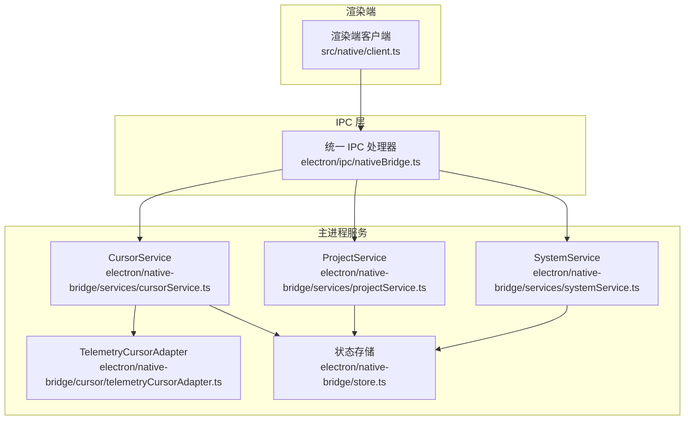
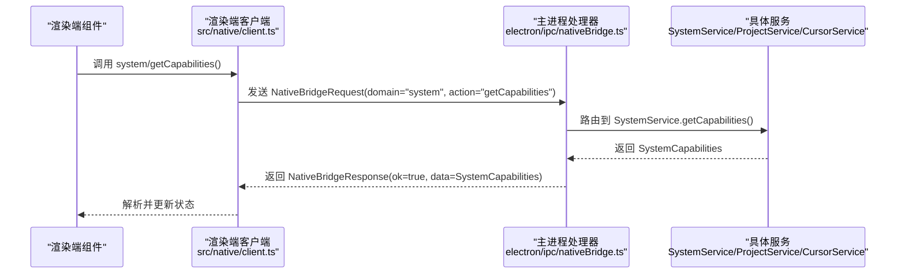
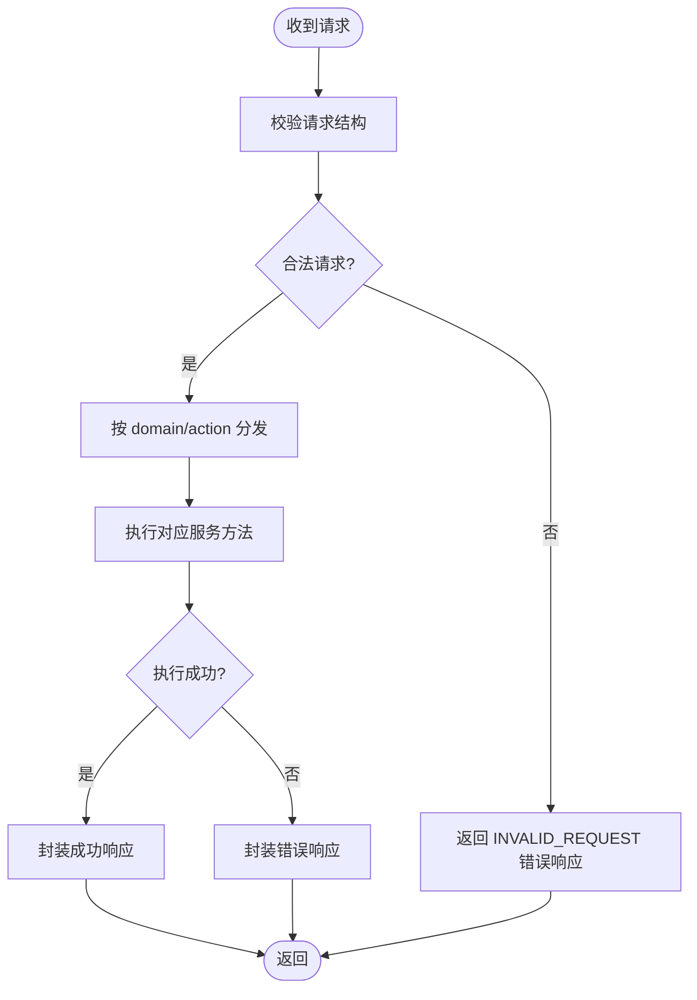
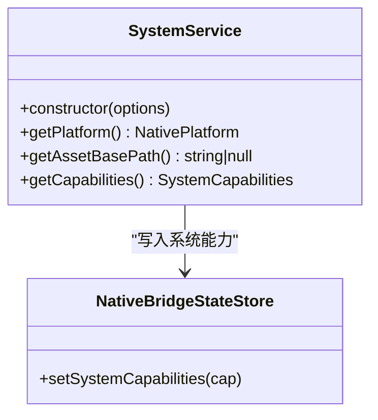
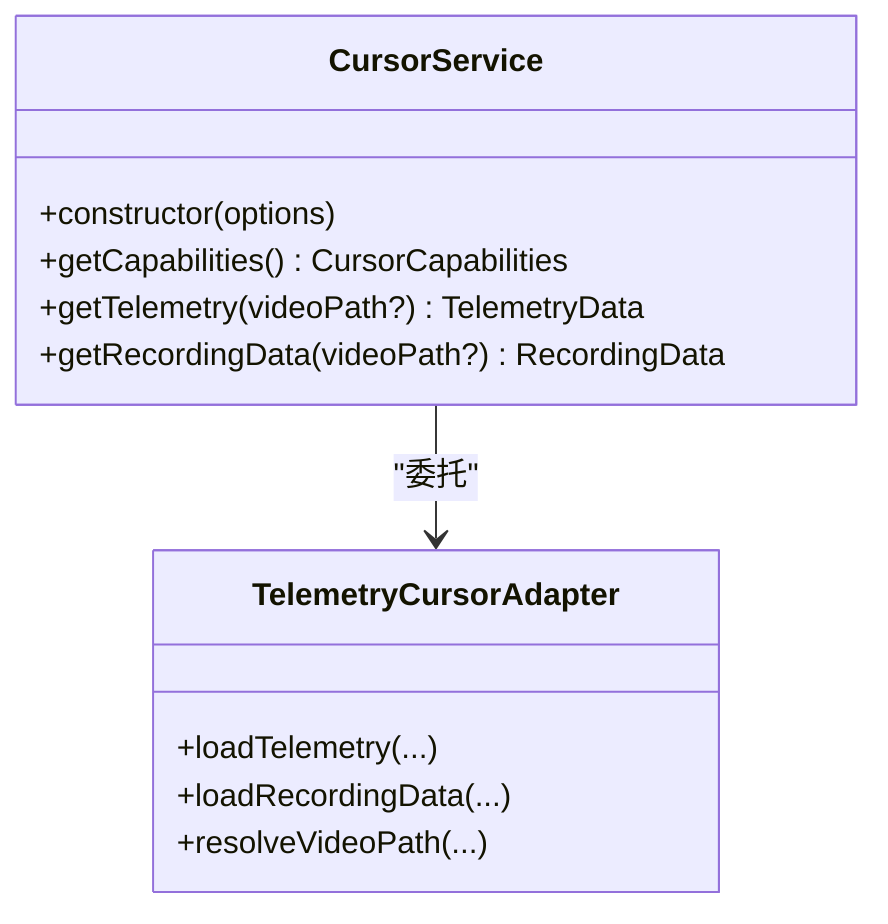
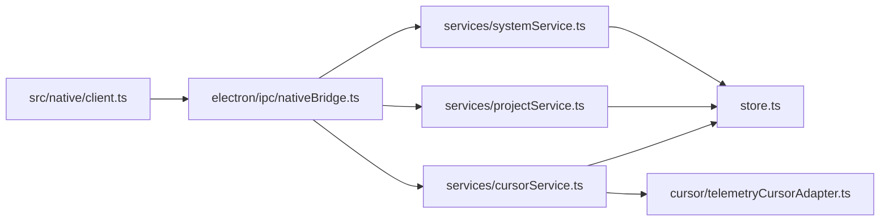

# 原生服务API

<cite>
**本文引用的文件**
- [native-bridge.md](file://docs/architecture/native-bridge.md)
- [client.ts](file://src/native/client.ts)
- [contracts.ts](file://src/native/contracts.ts)
- [nativeBridge.ts](file://electron/ipc/nativeBridge.ts)
- [systemService.ts](file://electron/native-bridge/services/systemService.ts)
- [projectService.ts](file://electron/native-bridge/services/projectService.ts)
- [cursorService.ts](file://electron/native-bridge/services/cursorService.ts)
- [telemetryCursorAdapter.ts](file://electron/native-bridge/cursor/telemetryCursorAdapter.ts)
- [store.ts](file://electron/native-bridge/store.ts)
</cite>

## 目录
1. [简介](#简介)
2. [项目结构](#项目结构)
3. [核心组件](#核心组件)
4. [架构总览](#架构总览)
5. [详细组件分析](#详细组件分析)
6. [依赖关系分析](#依赖关系分析)
7. [性能考量](#性能考量)
8. [故障排查指南](#故障排查指南)
9. [结论](#结论)
10. [附录](#附录)

## 简介
本文件为 OpenScreen 的原生服务 API 参考文档，聚焦于通过统一的原生桥接通道暴露的系统（system）、项目（project）与游标（cursor）三大域的服务接口。文档覆盖以下要点：
- 完整的 API 规范：system、project、cursor 三域的公开方法、参数与返回值类型
- 数据契约：NativeBridgeRequest/NativeBridgeResponse 的结构与序列化约定
- 错误处理与异常：统一响应体、错误码与可重试性
- 平台能力检测：系统能力查询与游标能力探测
- 项目文件操作：上下文获取、保存与加载
- 游标数据获取：能力查询、遥测与录制数据
- 安全与权限：调用前置条件与权限要求
- 使用示例与集成指南：在 React 组件中正确调用原生服务

## 项目结构
原生桥接由四层组成：
- 原生适配器：平台特定实现，提供稳定领域接口（如游标遥测）
- 主进程服务：编排适配器、维护运行时状态，暴露领域级操作
- 统一 IPC 传输：渲染端通过单一通道调用，请求/响应采用版本化契约
- 渲染端客户端：React 代码通过统一客户端封装调用，避免直接绑定 Electron API

图表来源
- [native-bridge.md:1-39](file://docs/architecture/native-bridge.md#L1-L39)
- [client.ts:52-102](file://src/native/client.ts#L52-L102)
- [nativeBridge.ts:92-236](file://electron/ipc/nativeBridge.ts#L92-L236)
- [systemService.ts:1-43](file://electron/native-bridge/services/systemService.ts#L1-L43)
- [projectService.ts](file://electron/native-bridge/services/projectService.ts)
- [cursorService.ts](file://electron/native-bridge/services/cursorService.ts)
- [telemetryCursorAdapter.ts](file://electron/native-bridge/cursor/telemetryCursorAdapter.ts)
- [store.ts](file://electron/native-bridge/store.ts)

章节来源
- [native-bridge.md:1-39](file://docs/architecture/native-bridge.md#L1-L39)

## 核心组件
- 渲染端客户端：提供 system、project、cursor 三域的调用入口，内部以 requireNativeBridgeData 封装统一 IPC 调用与结果解析
- 主进程处理器：注册统一通道，校验请求、分发到对应服务，构造统一响应
- 服务层：SystemService、ProjectService、CursorService 分别负责系统能力、项目文件与游标数据
- 适配器层：TelemetryCursorAdapter 提供游标遥测与录制数据的平台适配
- 状态存储：NativeBridgeStateStore 维护系统能力等运行时状态

章节来源
- [client.ts:52-102](file://src/native/client.ts#L52-L102)
- [nativeBridge.ts:92-236](file://electron/ipc/nativeBridge.ts#L92-L236)
- [systemService.ts:1-43](file://electron/native-bridge/services/systemService.ts#L1-L43)
- [projectService.ts](file://electron/native-bridge/services/projectService.ts)
- [cursorService.ts](file://electron/native-bridge/services/cursorService.ts)
- [telemetryCursorAdapter.ts](file://electron/native-bridge/cursor/telemetryCursorAdapter.ts)
- [store.ts](file://electron/native-bridge/store.ts)

## 架构总览
统一 IPC 流程如下：
- 渲染端调用 nativeBridgeClient.system/project/cursor 的方法
- 客户端将 domain/action/payload 序列化为 NativeBridgeRequest
- 主进程处理器校验请求后，路由到对应服务执行
- 服务返回数据或抛出异常；处理器统一包装为 NativeBridgeResponse
- 渲染端收到响应后进行 UI 更新或错误处理

图表来源
- [client.ts:52-102](file://src/native/client.ts#L52-L102)
- [nativeBridge.ts:124-236](file://electron/ipc/nativeBridge.ts#L124-L236)
- [systemService.ts:27-42](file://electron/native-bridge/services/systemService.ts#L27-L42)

## 详细组件分析

### 渲染端客户端 API 规范
- system 域
  - getPlatform(): 查询当前原生平台标识
  - getAssetBasePath(): 获取资源基础路径（可能为空）
  - getCapabilities(): 查询系统能力（含桥接版本、平台、游标能力、项目能力）
- project 域
  - getCurrentContext(): 获取当前项目上下文
  - saveProjectFile(projectData, suggestedName?, existingProjectPath?): 保存项目文件
  - loadProjectFile(): 打开文件选择器并加载项目
  - loadCurrentProjectFile(): 加载当前项目
  - loadProjectFileFromPath(path): 指定路径加载项目
  - setCurrentVideoPath(path): 设置当前视频路径
  - getCurrentVideoPath(): 获取当前视频路径
  - clearCurrentVideoPath(): 清除当前视频路径
- cursor 域
  - getCapabilities(): 查询游标能力
  - getTelemetry(videoPath?): 获取游标遥测数据
  - getRecordingData(videoPath?): 获取游标录制数据

章节来源
- [client.ts:52-102](file://src/native/client.ts#L52-L102)

### 主进程处理器与统一响应
- 请求校验：确保 domain 与 action 为字符串
- 动作分发：按 domain 分支，再按 action 分支执行
- 成功响应：createSuccessResponse 包裹 data 与 meta
- 错误响应：createErrorResponse 包含 code、message、retryable，并设置 meta
- 异常兜底：捕获异常并返回 INTERNAL_ERROR，retryable=true

图表来源
- [nativeBridge.ts:83-90](file://electron/ipc/nativeBridge.ts#L83-L90)
- [nativeBridge.ts:58-81](file://electron/ipc/nativeBridge.ts#L58-L81)
- [nativeBridge.ts:124-236](file://electron/ipc/nativeBridge.ts#L124-L236)

章节来源
- [nativeBridge.ts:58-90](file://electron/ipc/nativeBridge.ts#L58-L90)
- [nativeBridge.ts:92-236](file://electron/ipc/nativeBridge.ts#L92-L236)

### SystemService（系统服务）
职责
- 提供平台信息、资源路径与系统能力查询
- 聚合游标能力，写入状态存储

关键方法
- getPlatform(): 返回 NativePlatform
- getAssetBasePath(): 返回字符串或空
- getCapabilities(): 返回 SystemCapabilities，包含桥接版本、平台、游标能力、项目能力，并写入 store

图表来源
- [systemService.ts:16-42](file://electron/native-bridge/services/systemService.ts#L16-L42)
- [store.ts](file://electron/native-bridge/store.ts)

章节来源
- [systemService.ts:1-43](file://electron/native-bridge/services/systemService.ts#L1-L43)

### ProjectService（项目服务）
职责
- 管理项目上下文与文件操作
- 维护当前视频路径状态

关键方法（基于处理器分发）
- getCurrentContext(): 返回 ProjectContext
- saveProjectFile(payload): 保存项目文件
- loadProjectFile(): 打开文件选择器并加载
- loadCurrentProjectFile(): 加载当前项目
- loadProjectFileFromPath(payload): 指定路径加载
- setCurrentVideoPath(payload): 设置当前视频路径
- getCurrentVideoPath(): 获取当前视频路径
- clearCurrentVideoPath(): 清除当前视频路径

章节来源
- [nativeBridge.ts:124-236](file://electron/ipc/nativeBridge.ts#L124-L236)

### CursorService（游标服务）
职责
- 查询游标能力
- 通过适配器获取游标遥测与录制数据

关键方法
- getCapabilities(): 返回 CursorCapabilities
- getTelemetry(videoPath?): 返回游标遥测数据
- getRecordingData(videoPath?): 返回游标录制数据

图表来源
- [cursorService.ts](file://electron/native-bridge/services/cursorService.ts)
- [telemetryCursorAdapter.ts](file://electron/native-bridge/cursor/telemetryCursorAdapter.ts)

章节来源
- [nativeBridge.ts:109-116](file://electron/ipc/nativeBridge.ts#L109-L116)
- [cursorService.ts](file://electron/native-bridge/services/cursorService.ts)
- [telemetryCursorAdapter.ts](file://electron/native-bridge/cursor/telemetryCursorAdapter.ts)

### 数据契约与序列化

- NativeBridgeRequest
  - 字段
    - domain: 字符串，域名称（如 "system"、"project"、"cursor"）
    - action: 字符串，动作名称（如 "getCapabilities"）
    - payload: 可选对象，携带参数
    - meta.requestId: 可选字符串，请求 ID
  - 校验：isBridgeRequest 校验 domain 与 action 类型
- NativeBridgeResponse
  - 成功分支 ok=true
    - data: 任意有效负载
    - meta: 包含 requestId 的元信息
  - 失败分支 ok=false
    - error.code: 错误码枚举
    - error.message: 错误描述
    - error.retryable: 是否可重试
    - meta: 包含 requestId 的元信息
- 版本化：SystemCapabilities 中包含 bridgeVersion

章节来源
- [nativeBridge.ts:83-90](file://electron/ipc/nativeBridge.ts#L83-L90)
- [nativeBridge.ts:58-81](file://electron/ipc/nativeBridge.ts#L58-L81)
- [systemService.ts:31-38](file://electron/native-bridge/services/systemService.ts#L31-L38)
- [contracts.ts](file://src/native/contracts.ts)

## 依赖关系分析
- 渲染端仅依赖 src/native/client.ts 的统一入口
- 主进程处理器依赖各服务类与适配器
- 服务类依赖状态存储以持久化系统能力
- 适配器依赖平台能力与上下文回调

图表来源
- [client.ts:52-102](file://src/native/client.ts#L52-L102)
- [nativeBridge.ts:92-236](file://electron/ipc/nativeBridge.ts#L92-L236)
- [systemService.ts:1-43](file://electron/native-bridge/services/systemService.ts#L1-L43)
- [projectService.ts](file://electron/native-bridge/services/projectService.ts)
- [cursorService.ts](file://electron/native-bridge/services/cursorService.ts)
- [telemetryCursorAdapter.ts](file://electron/native-bridge/cursor/telemetryCursorAdapter.ts)
- [store.ts](file://electron/native-bridge/store.ts)

## 性能考量
- 避免频繁调用：系统能力与项目上下文可在应用启动时一次性查询并缓存
- 合理分页/节流：游标遥测数据量较大时，建议按需分段请求
- 重试策略：错误响应包含 retryable 标记，可根据业务策略决定是否重试
- 资源路径：优先使用 getAssetBasePath 获取资源基路径，减少硬编码

## 故障排查指南
常见错误与处理
- INVALID_REQUEST：请求结构不合法，检查 domain/action 是否存在且类型正确
- UNSUPPORTED_ACTION：不支持的域或动作，确认调用的方法名与域名称
- INTERNAL_ERROR：服务内部异常，通常可重试；记录错误码与消息便于定位
- 可重试性：错误响应的 retryable 字段指示是否应自动重试

排查步骤
- 在渲染端捕获响应的 error 字段，打印 code 与 message
- 若 retryable=true，可延迟重试；否则提示用户或回退到安全路径
- 对于系统能力查询失败，降级显示通用能力或禁用相关功能

章节来源
- [nativeBridge.ts:124-236](file://electron/ipc/nativeBridge.ts#L124-L236)
- [nativeBridge.ts:66-81](file://electron/ipc/nativeBridge.ts#L66-L81)

## 结论
OpenScreen 的原生桥接通过统一的请求/响应契约与清晰的分层设计，将平台能力、项目文件与游标数据访问抽象为一致的 API。开发者只需通过渲染端客户端即可完成跨域调用，同时获得稳定的错误处理与可扩展的版本演进。

## 附录

### API 一览表（按域）

- system 域
  - getPlatform(): 返回 NativePlatform
  - getAssetBasePath(): 返回 string | null
  - getCapabilities(): 返回 SystemCapabilities
- project 域
  - getCurrentContext(): 返回 ProjectContext
  - saveProjectFile(projectData, suggestedName?, existingProjectPath?): 返回 ProjectFileResult
  - loadProjectFile(): 返回 ProjectFileResult
  - loadCurrentProjectFile(): 返回 ProjectFileResult
  - loadProjectFileFromPath(path): 返回 ProjectFileResult
  - setCurrentVideoPath(path): 返回 void
  - getCurrentVideoPath(): 返回 string | null
  - clearCurrentVideoPath(): 返回 void
- cursor 域
  - getCapabilities(): 返回 CursorCapabilities
  - getTelemetry(videoPath?): 返回 TelemetryData
  - getRecordingData(videoPath?): 返回 RecordingData

章节来源
- [client.ts:52-102](file://src/native/client.ts#L52-L102)
- [nativeBridge.ts:124-236](file://electron/ipc/nativeBridge.ts#L124-L236)

### 错误码与含义（示例）
- INVALID_REQUEST：请求结构非法
- UNSUPPORTED_ACTION：不支持的域或动作
- INTERNAL_ERROR：内部异常（可重试）

章节来源
- [nativeBridge.ts:212-233](file://electron/ipc/nativeBridge.ts#L212-L233)

### 安全与权限
- 权限前置：在调用前先通过 system/getCapabilities 判断平台与能力
- 文件操作：save/load 操作涉及文件系统访问，需确保具备相应权限
- 游标数据：遥测与录制数据可能涉及隐私，应遵循最小化原则与用户授权

章节来源
- [systemService.ts:27-42](file://electron/native-bridge/services/systemService.ts#L27-L42)
- [nativeBridge.ts:124-236](file://electron/ipc/nativeBridge.ts#L124-L236)

### 使用示例与集成指南（React 组件）
- 步骤
  - 在组件初始化时调用 system/getCapabilities 获取能力
  - 根据能力决定是否启用相关功能
  - 项目操作：调用 project/saveProjectFile 或 project/loadProjectFile
  - 游标数据：调用 cursor/getCapabilities 与 cursor/getTelemetry
- 注意
  - 统一通过 nativeBridgeClient.* 调用，避免直接绑定 Electron API
  - 对错误响应进行处理，必要时提示用户或回退

章节来源
- [client.ts:52-102](file://src/native/client.ts#L52-L102)
- [native-bridge.md:18-26](file://docs/architecture/native-bridge.md#L18-L26)