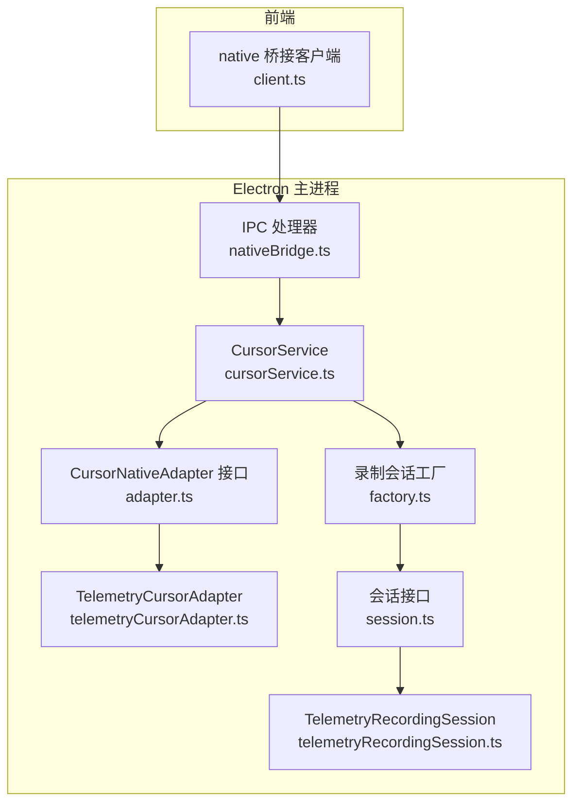
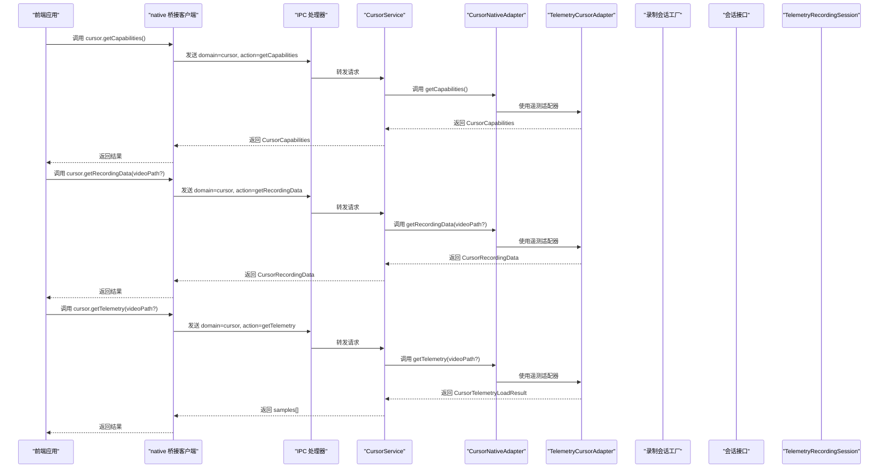
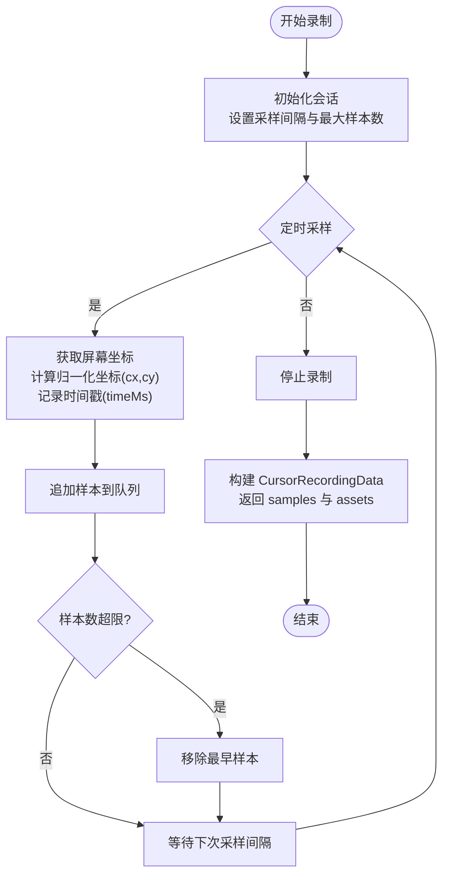
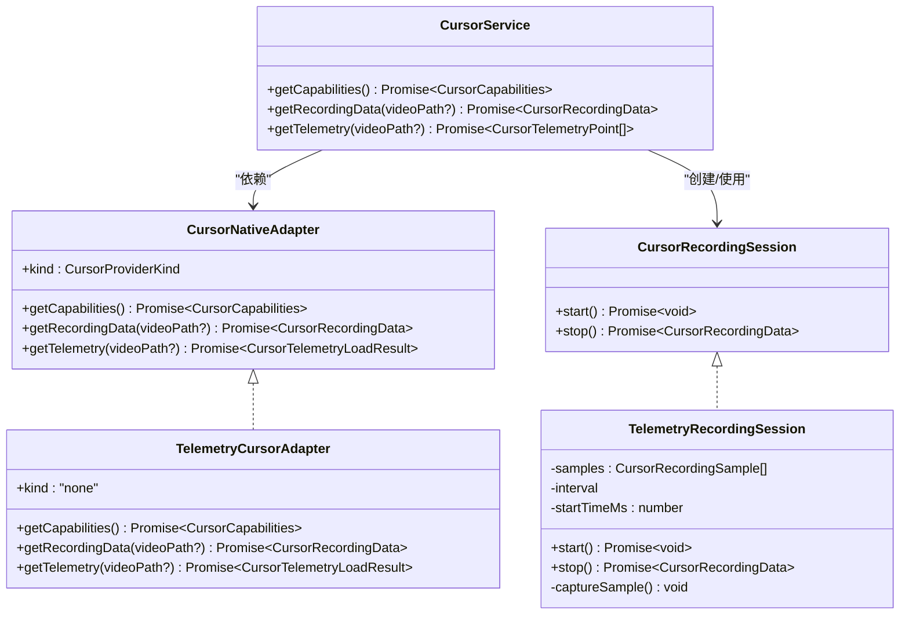
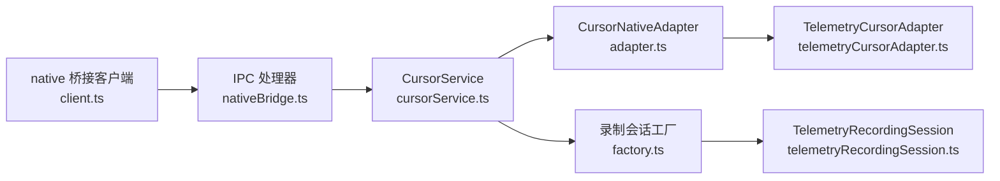

# 游标服务API

<cite>
**本文引用的文件**
- [contracts.ts](file://src/native/contracts.ts)
- [client.ts](file://src/native/client.ts)
- [cursorService.ts](file://electron/native-bridge/services/cursorService.ts)
- [adapter.ts](file://electron/native-bridge/cursor/adapter.ts)
- [telemetryCursorAdapter.ts](file://electron/native-bridge/cursor/telemetryCursorAdapter.ts)
- [factory.ts](file://electron/native-bridge/cursor/recording/factory.ts)
- [session.ts](file://electron/native-bridge/cursor/recording/session.ts)
- [telemetryRecordingSession.ts](file://electron/native-bridge/cursor/recording/telemetryRecordingSession.ts)
- [nativeBridge.ts](file://electron/ipc/nativeBridge.ts)
- [index.ts](file://src/native/index.ts)
</cite>

## 目录
1. [简介](#简介)
2. [项目结构](#项目结构)
3. [核心组件](#核心组件)
4. [架构总览](#架构总览)
5. [详细组件分析](#详细组件分析)
6. [依赖关系分析](#依赖关系分析)
7. [性能考量](#性能考量)
8. [故障排查指南](#故障排查指南)
9. [结论](#结论)
10. [附录](#附录)

## 简介
本文件为 OpenScreen 的游标服务 API 参考文档，聚焦 cursor 域的完整接口与数据模型，覆盖以下内容：
- cursor 域接口：getCapabilities、getRecordingData、getTelemetry 的完整 API 规范
- 核心数据类型：CursorCapabilities、CursorRecordingData、CursorTelemetryPoint、CursorRecordingSample、NativeCursorAsset 的定义与结构
- 完整数据流：从能力检测（getCapabilities）到录制数据获取（getRecordingData），再到遥测分析（getTelemetry）
- 平台支持与适配：不同平台（Windows/macOS/Linux）的游标采样策略与差异
- 实际应用场景：智能缩放、轨迹分析、用户体验优化
- 可视化与实时处理：技术实现要点与最佳实践

## 项目结构
游标服务位于前端 native 桥接层与 Electron 原生桥接层之间，采用“客户端封装 + 服务层 + 适配器 + 录制会话”的分层设计：
- 前端调用层：通过 native 桥接客户端发起请求
- 服务层：CursorService 统一对外暴露 cursor 域 API，并负责错误处理与状态标记
- 适配器层：CursorNativeAdapter 抽象不同平台的实现；TelemetryCursorAdapter 提供基于遥测的通用实现
- 录制会话层：按平台创建具体会话，采集游标位置并生成 CursorRecordingData

图表来源
- [client.ts:120-138](file://src/native/client.ts#L120-L138)
- [nativeBridge.ts:198-208](file://electron/ipc/nativeBridge.ts#L198-L208)
- [cursorService.ts:14-46](file://electron/native-bridge/services/cursorService.ts#L14-L46)
- [adapter.ts:15-20](file://electron/native-bridge/cursor/adapter.ts#L15-L20)
- [telemetryCursorAdapter.ts:10-49](file://electron/native-bridge/cursor/telemetryCursorAdapter.ts#L10-L49)
- [factory.ts:16-46](file://electron/native-bridge/cursor/recording/factory.ts#L16-L46)
- [session.ts:3-6](file://electron/native-bridge/cursor/recording/session.ts#L3-L6)
- [telemetryRecordingSession.ts:16-63](file://electron/native-bridge/cursor/recording/telemetryRecordingSession.ts#L16-L63)

章节来源
- [client.ts:120-138](file://src/native/client.ts#L120-L138)
- [nativeBridge.ts:198-208](file://electron/ipc/nativeBridge.ts#L198-L208)
- [cursorService.ts:14-46](file://electron/native-bridge/services/cursorService.ts#L14-L46)
- [adapter.ts:15-20](file://electron/native-bridge/cursor/adapter.ts#L15-L20)
- [telemetryCursorAdapter.ts:10-49](file://electron/native-bridge/cursor/telemetryCursorAdapter.ts#L10-L49)
- [factory.ts:16-46](file://electron/native-bridge/cursor/recording/factory.ts#L16-L46)
- [session.ts:3-6](file://electron/native-bridge/cursor/recording/session.ts#L3-L6)
- [telemetryRecordingSession.ts:16-63](file://electron/native-bridge/cursor/recording/telemetryRecordingSession.ts#L16-L63)

## 核心组件
- 前端桥接客户端：提供 cursor 域的 getCapabilities、getRecordingData、getTelemetry 方法，统一请求与响应格式
- CursorService：服务层封装，负责调用适配器、错误处理、以及将样本数量写入状态存储
- CursorNativeAdapter：适配器接口，抽象不同平台实现
- TelemetryCursorAdapter：通用遥测适配器，提供基础能力与空数据回退
- 录制会话：按平台创建具体会话，采集游标位置并生成 CursorRecordingData

章节来源
- [client.ts:120-138](file://src/native/client.ts#L120-L138)
- [cursorService.ts:14-46](file://electron/native-bridge/services/cursorService.ts#L14-L46)
- [adapter.ts:15-20](file://electron/native-bridge/cursor/adapter.ts#L15-L20)
- [telemetryCursorAdapter.ts:10-49](file://electron/native-bridge/cursor/telemetryCursorAdapter.ts#L10-L49)
- [session.ts:3-6](file://electron/native-bridge/cursor/recording/session.ts#L3-L6)

## 架构总览
下图展示从前端调用到原生适配器与录制会话的数据流：

图表来源
- [client.ts:120-138](file://src/native/client.ts#L120-L138)
- [nativeBridge.ts:198-208](file://electron/ipc/nativeBridge.ts#L198-L208)
- [cursorService.ts:17-45](file://electron/native-bridge/services/cursorService.ts#L17-L45)
- [adapter.ts:15-20](file://electron/native-bridge/cursor/adapter.ts#L15-L20)
- [telemetryCursorAdapter.ts:15-48](file://electron/native-bridge/cursor/telemetryCursorAdapter.ts#L15-L48)

## 详细组件分析

### API 规范：cursor 域
- 域名：cursor
- 支持动作：
  - getCapabilities：查询游标能力
  - getRecordingData：获取录制数据（含游标样本与系统资源）
  - getTelemetry：获取游标遥测样本数组

请求与响应结构由前端桥接客户端统一构造与解析，错误通过统一的 NativeBridgeError 结构返回。

章节来源
- [client.ts:120-138](file://src/native/client.ts#L120-L138)
- [contracts.ts:204-224](file://src/native/contracts.ts#L204-L224)

### 数据模型定义
- CursorCapabilities：能力开关与提供者标识
  - 字段：telemetry: boolean、systemAssets: boolean、provider: CursorProviderKind
- CursorTelemetryPoint：单个时间点的游标位置
  - 字段：timeMs: number、cx: number、cy: number
- CursorRecordingSample：录制样本（在 TelemetryPoint 基础上扩展）
  - 字段：timeMs、cx、cy、assetId?: string | null、visible?: boolean、cursorType?: NativeCursorType | null、interactionType?: "move" | "click" | "mouseup"
- CursorRecordingData：录制数据集合
  - 字段：version: number、provider: CursorProviderKind、samples: CursorRecordingSample[]、assets: NativeCursorAsset[]
- NativeCursorAsset：系统游标资源（图片、热区、尺寸等）
  - 字段：id、platform、imageDataUrl、width、height、hotspotX、hotspotY、scaleFactor?、cursorType?
- NativeCursorType：系统游标类型枚举（如 arrow、text、pointer 等）

章节来源
- [contracts.ts:56-60](file://src/native/contracts.ts#L56-L60)
- [contracts.ts:24-35](file://src/native/contracts.ts#L24-L35)
- [contracts.ts:49-54](file://src/native/contracts.ts#L49-L54)
- [contracts.ts:37-47](file://src/native/contracts.ts#L37-L47)
- [contracts.ts:6-22](file://src/native/contracts.ts#L6-L22)

### getCapabilities：能力检测
- 功能：检测平台对游标录制的支持程度与可用选项
- 返回：CursorCapabilities
- 典型行为：
  - telemetry: true 表示支持遥测采集
  - systemAssets: false 表示当前未提供系统游标资源（以遥测为主）
  - provider: "none" 或 "native" 表示提供者类型

章节来源
- [telemetryCursorAdapter.ts:15-21](file://electron/native-bridge/cursor/telemetryCursorAdapter.ts#L15-L21)
- [cursorService.ts:17-21](file://electron/native-bridge/services/cursorService.ts#L17-L21)

### getRecordingData：录制数据获取
- 输入：videoPath?（可选）
- 输出：CursorRecordingData
- 数据结构要点：
  - version：版本号（用于兼容性）
  - provider：提供者类型
  - samples：CursorRecordingSample 数组，包含时间戳、归一化坐标、可见性、游标类型、交互类型等
  - assets：NativeCursorAsset 数组，系统游标资源（在遥测适配器中通常为空）
- 空路径处理：当未提供视频路径时，返回空 samples 与空 assets，version 为 2，provider 为 "none"

章节来源
- [telemetryCursorAdapter.ts:23-35](file://electron/native-bridge/cursor/telemetryCursorAdapter.ts#L23-L35)
- [contracts.ts:49-54](file://src/native/contracts.ts#L49-L54)

### getTelemetry：遥测样本获取
- 输入：videoPath?（可选）
- 输出：CursorTelemetryPoint[]（数组）
- 返回结构：CursorTelemetryLoadResult
  - success: boolean
  - samples: CursorTelemetryPoint[]
  - message?: string
  - error?: string
- 错误处理：当 success 为 false 时，服务层抛出错误
- 成功后：服务层会根据当前视频路径或传入路径标记已加载样本数量

章节来源
- [adapter.ts:8-13](file://electron/native-bridge/cursor/adapter.ts#L8-L13)
- [cursorService.ts:23-35](file://electron/native-bridge/services/cursorService.ts#L23-L35)

### 录制流程与平台差异
- 工厂创建会话：根据平台选择 Windows、macOS 或 Telemetry 会话
- TelemetryRecordingSession：Linux/无原生资源场景下的默认实现
  - 通过 Electron screen API 获取光标绝对坐标
  - 将坐标转换为显示区域内的归一化坐标（cx/cy）
  - 以固定间隔采样，限制最大样本数，避免内存膨胀
  - stop() 返回 CursorRecordingData，samples 为 CursorRecordingSample 数组，assets 为空

图表来源
- [factory.ts:16-46](file://electron/native-bridge/cursor/recording/factory.ts#L16-L46)
- [telemetryRecordingSession.ts:23-63](file://electron/native-bridge/cursor/recording/telemetryRecordingSession.ts#L23-L63)

章节来源
- [factory.ts:16-46](file://electron/native-bridge/cursor/recording/factory.ts#L16-L46)
- [telemetryRecordingSession.ts:16-63](file://electron/native-bridge/cursor/recording/telemetryRecordingSession.ts#L16-L63)

### 类关系图

图表来源
- [adapter.ts:15-20](file://electron/native-bridge/cursor/adapter.ts#L15-L20)
- [telemetryCursorAdapter.ts:10-49](file://electron/native-bridge/cursor/telemetryCursorAdapter.ts#L10-L49)
- [cursorService.ts:14-46](file://electron/native-bridge/services/cursorService.ts#L14-L46)
- [session.ts:3-6](file://electron/native-bridge/cursor/recording/session.ts#L3-L6)
- [telemetryRecordingSession.ts:16-63](file://electron/native-bridge/cursor/recording/telemetryRecordingSession.ts#L16-L63)

## 依赖关系分析
- 前端依赖：native 桥接客户端导出 cursor 域 API，供应用层直接调用
- IPC 依赖：Electron IPC 处理器将 cursor 域请求路由到 CursorService
- 服务依赖：CursorService 依赖 CursorNativeAdapter；在遥测适配器模式下，适配器内部可能依赖录制会话
- 录制会话依赖：工厂根据平台创建不同会话；TelemetryRecordingSession 依赖 Electron screen API

图表来源
- [client.ts:120-138](file://src/native/client.ts#L120-L138)
- [nativeBridge.ts:198-208](file://electron/ipc/nativeBridge.ts#L198-L208)
- [cursorService.ts:14-46](file://electron/native-bridge/services/cursorService.ts#L14-L46)
- [adapter.ts:15-20](file://electron/native-bridge/cursor/adapter.ts#L15-L20)
- [telemetryCursorAdapter.ts:10-49](file://electron/native-bridge/cursor/telemetryCursorAdapter.ts#L10-L49)
- [factory.ts:16-46](file://electron/native-bridge/cursor/recording/factory.ts#L16-L46)
- [telemetryRecordingSession.ts:16-63](file://electron/native-bridge/cursor/recording/telemetryRecordingSession.ts#L16-L63)

章节来源
- [index.ts:1-4](file://src/native/index.ts#L1-L4)
- [nativeBridge.ts:198-208](file://electron/ipc/nativeBridge.ts#L198-L208)
- [cursorService.ts:14-46](file://electron/native-bridge/services/cursorService.ts#L14-L46)
- [adapter.ts:15-20](file://electron/native-bridge/cursor/adapter.ts#L15-L20)
- [telemetryCursorAdapter.ts:10-49](file://electron/native-bridge/cursor/telemetryCursorAdapter.ts#L10-L49)
- [factory.ts:16-46](file://electron/native-bridge/cursor/recording/factory.ts#L16-L46)
- [telemetryRecordingSession.ts:16-63](file://electron/native-bridge/cursor/recording/telemetryRecordingSession.ts#L16-L63)

## 性能考量
- 采样频率与样本上限：通过 sampleIntervalMs 与 maxSamples 控制 CPU/内存占用
- 归一化坐标：减少跨分辨率差异带来的额外计算成本
- 空间回收：超过上限时移除最早样本，保持队列稳定
- 事件标记：成功加载遥测后更新状态存储中的样本计数，便于 UI 与后续处理

章节来源
- [telemetryRecordingSession.ts:23-63](file://electron/native-bridge/cursor/recording/telemetryRecordingSession.ts#L23-L63)
- [cursorService.ts:29-32](file://electron/native-bridge/services/cursorService.ts#L29-L32)

## 故障排查指南
- 无视频路径：遥测适配器在未提供 videoPath 时返回空 samples，并给出明确消息
- 适配器不可用：检查 CursorNativeAdapter 的 kind 与实现是否匹配平台
- IPC 通道缺失：确认 preload 中存在 invokeNativeBridge 注入
- 错误传播：服务层在 getTelemetry 失败时抛出错误，需在前端捕获并提示用户

章节来源
- [telemetryCursorAdapter.ts:23-48](file://electron/native-bridge/cursor/telemetryCursorAdapter.ts#L23-L48)
- [cursorService.ts:23-27](file://electron/native-bridge/services/cursorService.ts#L23-L27)
- [client.ts:23-31](file://src/native/client.ts#L23-L31)

## 结论
OpenScreen 的游标服务通过清晰的分层设计与统一的数据模型，实现了跨平台的游标能力检测、录制数据获取与遥测分析。遥测适配器提供了稳定的默认实现，结合录制会话的采样机制，满足了智能缩放、轨迹分析与用户体验优化等实际场景需求。建议在生产环境中合理配置采样参数，并利用事件标记与状态存储提升数据一致性与可追踪性。

## 附录
- 常见用法路径
  - 能力检测：[client.ts:121-125](file://src/native/client.ts#L121-L125)
  - 录制数据：[client.ts:126-131](file://src/native/client.ts#L126-L131)
  - 遥测数据：[client.ts:132-137](file://src/native/client.ts#L132-L137)
- IPC 映射
  - getCapabilities：[nativeBridge.ts:198-200](file://electron/ipc/nativeBridge.ts#L198-L200)
  - getTelemetry：[nativeBridge.ts:200-205](file://electron/ipc/nativeBridge.ts#L200-L205)
  - getRecordingData：[nativeBridge.ts:205-208](file://electron/ipc/nativeBridge.ts#L205-L208)