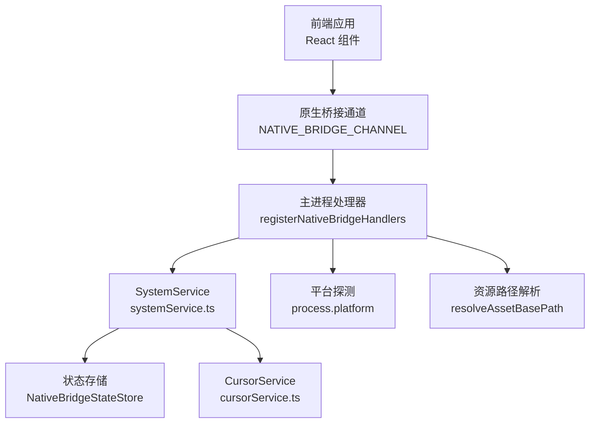
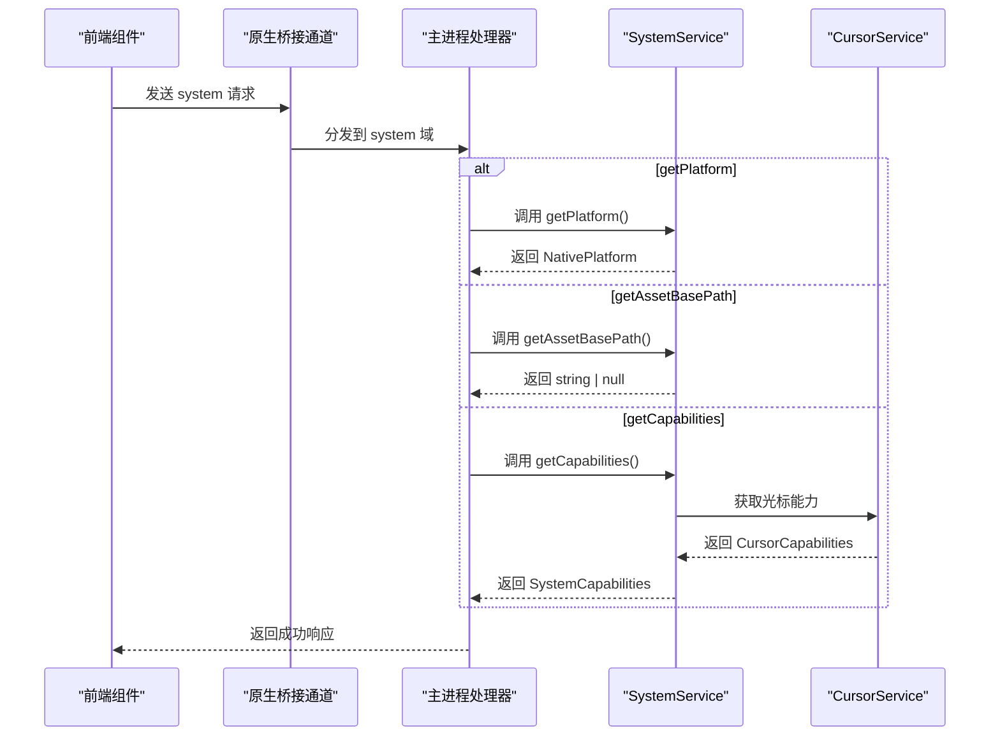
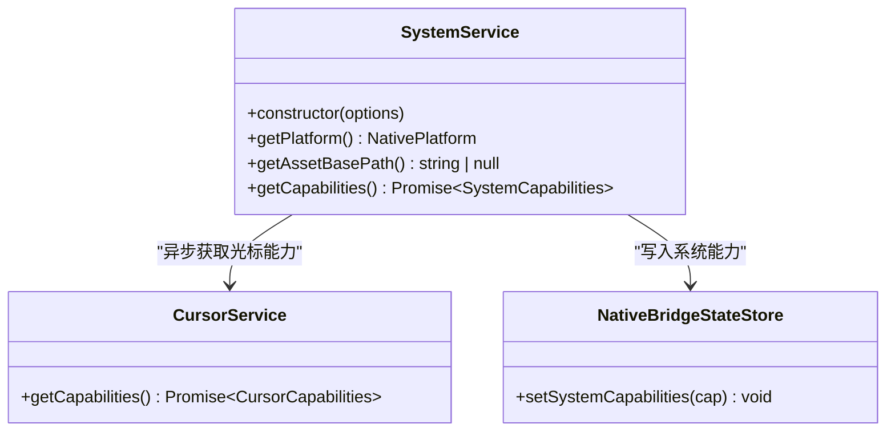
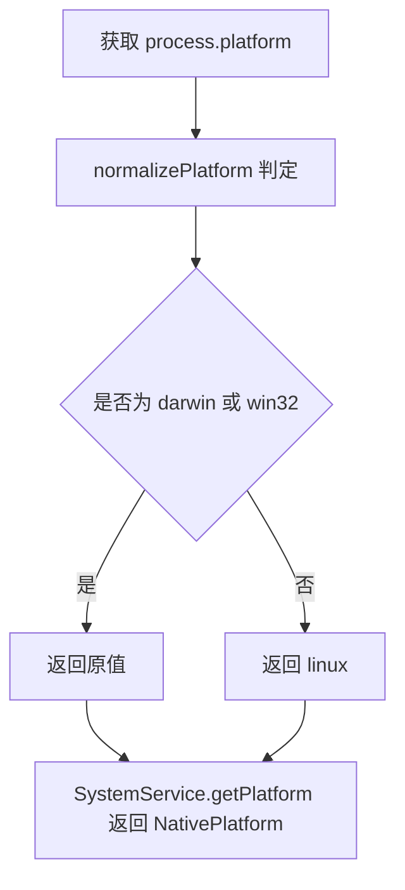
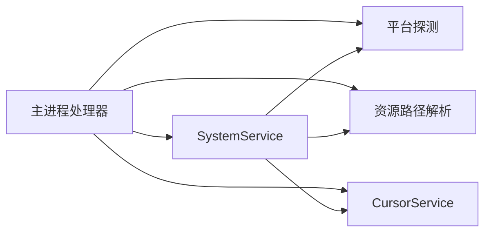

# 系统服务API

<cite>
**本文引用的文件**
- [electron/ipc/nativeBridge.ts](file://electron/ipc/nativeBridge.ts)
- [electron/ipc/handlers.ts](file://electron/ipc/handlers.ts)
- [electron/native-bridge/services/systemService.ts](file://electron/native-bridge/services/systemService.ts)
- [src/native/contracts.ts](file://src/native/contracts.ts)
</cite>

## 目录
1. [简介](#简介)
2. [项目结构](#项目结构)
3. [核心组件](#核心组件)
4. [架构总览](#架构总览)
5. [详细组件分析](#详细组件分析)
6. [依赖关系分析](#依赖关系分析)
7. [性能考量](#性能考量)
8. [故障排查指南](#故障排查指南)
9. [结论](#结论)
10. [附录：API规范与使用示例](#附录api规范与使用示例)

## 简介
本文件为 OpenScreen 的系统服务 API 参考文档，聚焦 system 域的三类接口：getPlatform、getAssetBasePath 和 getCapabilities。文档从数据模型、处理流程、错误处理与性能特征等维度，系统阐述平台检测、资源路径解析与系统能力查询的实现细节，并给出在 React 组件中调用的实践建议。

## 项目结构
系统服务 API 由前端桥接层与 Electron 主进程服务层协作完成：
- 前端通过统一的原生桥接通道发送请求，请求被主进程路由到对应的服务域。
- system 域的请求由 SystemService 执行，SystemService 依赖平台探测、资源路径解析与光标能力查询等能力。
- 能力信息最终写入全局状态存储，供后续流程复用。

图表来源
- [electron/ipc/nativeBridge.ts:92-122](file://electron/ipc/nativeBridge.ts#L92-L122)
- [electron/native-bridge/services/systemService.ts:16-42](file://electron/native-bridge/services/systemService.ts#L16-L42)

章节来源
- [electron/ipc/nativeBridge.ts:92-122](file://electron/ipc/nativeBridge.ts#L92-L122)
- [electron/ipc/handlers.ts:2870-2886](file://electron/ipc/handlers.ts#L2870-L2886)

## 核心组件
- SystemService：封装 system 域的业务逻辑，提供平台、资源路径与系统能力查询。
- SystemCapabilities：系统能力聚合对象，包含桥接版本、平台标识、光标能力与项目上下文能力。
- NativePlatform：平台枚举，限定为 darwin、win32、linux。
- CursorCapabilities：光标能力描述，包含遥测支持、系统光标资源可用性与提供者类型。

章节来源
- [electron/native-bridge/services/systemService.ts:16-42](file://electron/native-bridge/services/systemService.ts#L16-L42)
- [src/native/contracts.ts:4-69](file://src/native/contracts.ts#L4-L69)

## 架构总览
下图展示了 system 域请求从发起到响应的端到端流程，包括主进程路由、服务执行与结果返回。

图表来源
- [electron/ipc/nativeBridge.ts:124-150](file://electron/ipc/nativeBridge.ts#L124-L150)
- [electron/native-bridge/services/systemService.ts:19-42](file://electron/native-bridge/services/systemService.ts#L19-L42)

## 详细组件分析

### SystemService 类
SystemService 提供三个核心方法：
- getPlatform：返回当前平台标识符（NativePlatform）。
- getAssetBasePath：返回应用资源基础路径或 null。
- getCapabilities：聚合系统能力并写入状态存储。

图表来源
- [electron/native-bridge/services/systemService.ts:9-42](file://electron/native-bridge/services/systemService.ts#L9-L42)

章节来源
- [electron/native-bridge/services/systemService.ts:16-42](file://electron/native-bridge/services/systemService.ts#L16-L42)

### 数据模型与类型定义
- NativePlatform：平台枚举，取值为 "darwin"、"win32"、"linux"。
- SystemCapabilities：系统能力对象，包含桥接版本、平台、光标能力与项目上下文能力。
- CursorCapabilities：光标能力对象，包含遥测支持、系统光标资源可用性与提供者类型。

章节来源
- [src/native/contracts.ts:4-69](file://src/native/contracts.ts#L4-L69)

### 平台检测机制
- 主进程通过 process.platform 获取底层平台字符串。
- 注册处理器时，使用 normalizePlatform 将 NodeJS.Platform 归一化为 NativePlatform。
- getPlatform 方法直接返回归一化后的平台标识符。

图表来源
- [electron/ipc/nativeBridge.ts:42-48](file://electron/ipc/nativeBridge.ts#L42-L48)
- [electron/ipc/nativeBridge.ts:117-122](file://electron/ipc/nativeBridge.ts#L117-L122)

章节来源
- [electron/ipc/nativeBridge.ts:42-48](file://electron/ipc/nativeBridge.ts#L42-L48)
- [electron/ipc/nativeBridge.ts:117-122](file://electron/ipc/nativeBridge.ts#L117-L122)

### 资源路径获取
- getAssetBasePath 返回 string | null。
- 当返回 null 时，表示无法解析到有效的资源基础路径，组件应降级处理或提示用户配置。

章节来源
- [electron/native-bridge/services/systemService.ts:23-25](file://electron/native-bridge/services/systemService.ts#L23-L25)
- [electron/ipc/nativeBridge.ts:119-121](file://electron/ipc/nativeBridge.ts#L119-L121)

### 系统能力查询
- getCapabilities 汇聚以下信息：
  - bridgeVersion：桥接版本号。
  - platform：平台标识符。
  - cursor：光标能力（来自 CursorService）。
  - project.currentContext：当前固定为 true，表示具备项目上下文能力。
- 结果会写入状态存储，便于后续流程复用。

章节来源
- [electron/native-bridge/services/systemService.ts:27-42](file://electron/native-bridge/services/systemService.ts#L27-L42)
- [src/native/contracts.ts:62-69](file://src/native/contracts.ts#L62-L69)

## 依赖关系分析
- SystemService 依赖：
  - 平台探测函数（返回 NativePlatform）
  - 资源路径解析函数（返回 string | null）
  - 光标能力查询（返回 CursorCapabilities）
- 主进程注册时，将上述依赖注入 SystemService。
- 错误处理：
  - 非法请求：返回 INVALID_REQUEST。
  - 不支持的动作：返回 UNSUPPORTED_ACTION。
  - 其他异常：返回 INTERNAL_ERROR（可重试）。

图表来源
- [electron/ipc/nativeBridge.ts:92-122](file://electron/ipc/nativeBridge.ts#L92-L122)
- [electron/native-bridge/services/systemService.ts:9-14](file://electron/native-bridge/services/systemService.ts#L9-L14)

章节来源
- [electron/ipc/nativeBridge.ts:124-150](file://electron/ipc/nativeBridge.ts#L124-L150)
- [electron/ipc/nativeBridge.ts:227-234](file://electron/ipc/nativeBridge.ts#L227-L234)

## 性能考量
- getPlatform 与 getAssetBasePath 为同步/轻量操作，调用开销极低。
- getCapabilities 包含一次异步的光标能力查询，建议在应用启动阶段一次性调用并缓存结果。
- 能力信息写入状态存储后可跨组件共享，避免重复查询。

## 故障排查指南
- 若 getPlatform 返回 "linux"，但实际运行环境为其他平台，请检查平台归一化逻辑与 process.platform 的来源。
- 若 getAssetBasePath 返回 null，确认资源目录是否存在且可访问。
- 若 getCapabilities 抛错，检查光标能力查询链路与网络/文件系统状态。
- 对于桥接错误，优先关注错误码与可重试标记，必要时进行指数退避重试。

章节来源
- [electron/ipc/nativeBridge.ts:227-234](file://electron/ipc/nativeBridge.ts#L227-L234)

## 结论
system 域 API 以简洁的数据模型与清晰的职责边界，提供了稳定的平台检测、资源路径解析与系统能力查询能力。通过主进程服务层与前端桥接层的配合，开发者可以可靠地在 React 组件中进行平台感知与能力判断，从而实现差异化功能与体验优化。

## 附录：API规范与使用示例

### 接口清单与语义
- getPlatform
  - 功能：返回当前平台标识符（NativePlatform）。
  - 返回：darwin | win32 | linux。
  - 用途：根据平台启用/禁用特定功能或加载对应资源。
- getAssetBasePath
  - 功能：返回应用资源的基础路径。
  - 返回：string | null；当为 null 时表示无法解析有效路径。
  - 用途：拼接资源 URL 或定位本地资源。
- getCapabilities
  - 功能：返回系统能力聚合信息。
  - 返回：SystemCapabilities。
  - 字段说明：
    - bridgeVersion：桥接版本号。
    - platform：平台标识符。
    - cursor：光标能力（遥测支持、系统资源可用性、提供者类型）。
    - project.currentContext：当前固定为 true，表示具备项目上下文能力。

章节来源
- [src/native/contracts.ts:4-69](file://src/native/contracts.ts#L4-L69)
- [electron/native-bridge/services/systemService.ts:19-42](file://electron/native-bridge/services/systemService.ts#L19-L42)

### 在 React 组件中的调用示例
以下为在 React 组件中调用系统服务 API 的步骤式示例（不包含具体代码内容，仅提供调用路径与要点）：
- 步骤 1：通过原生桥接通道向主进程发送 system/getPlatform 请求。
  - 参考路径：[electron/ipc/nativeBridge.ts:137-138](file://electron/ipc/nativeBridge.ts#L137-L138)
- 步骤 2：根据返回的平台标识符决定 UI 行为或加载对应资源。
- 步骤 3：调用 system/getAssetBasePath 获取资源基础路径，若为 null 则提示用户配置。
  - 参考路径：[electron/ipc/nativeBridge.ts:139-140](file://electron/ipc/nativeBridge.ts#L139-L140)
- 步骤 4：调用 system/getCapabilities 获取系统能力，缓存结果并在多处复用。
  - 参考路径：[electron/ipc/nativeBridge.ts:141-142](file://electron/ipc/nativeBridge.ts#L141-L142)

章节来源
- [electron/ipc/nativeBridge.ts:137-142](file://electron/ipc/nativeBridge.ts#L137-L142)