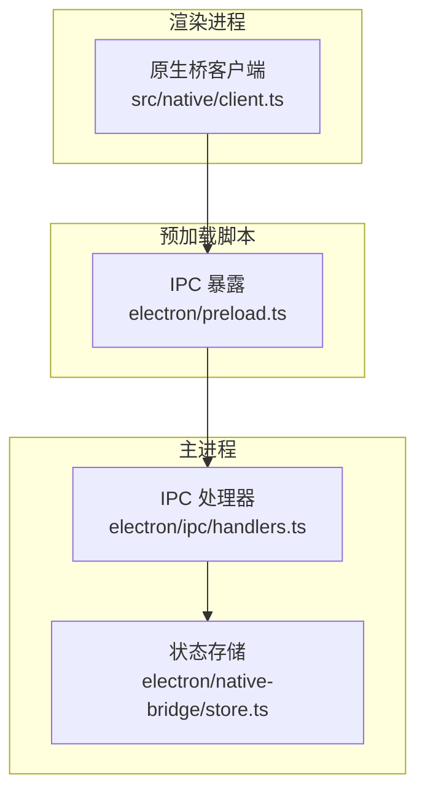
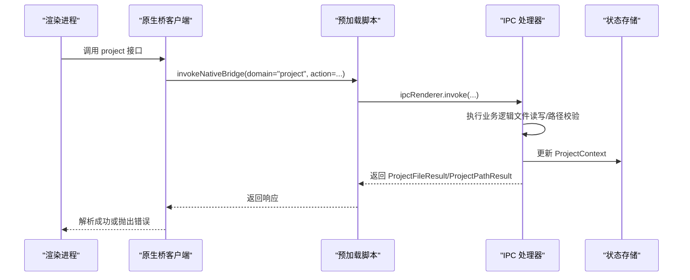
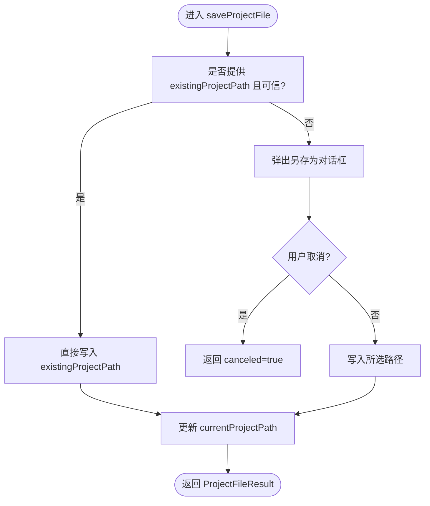
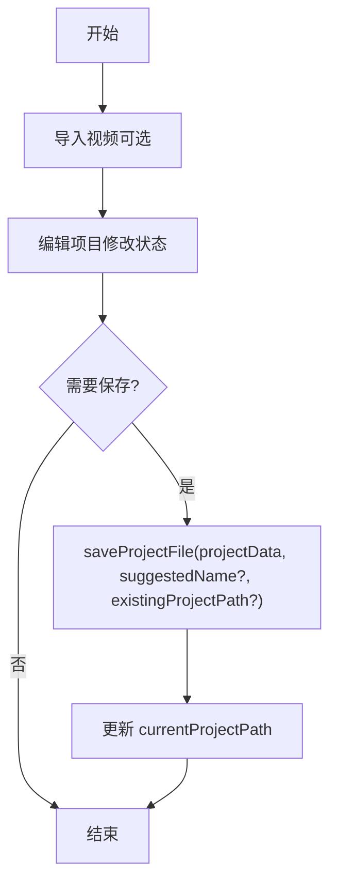
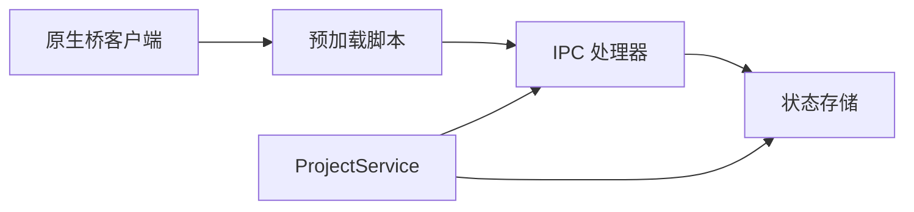

# 项目服务API

<cite>
**本文引用的文件**
- [projectService.ts](file://electron/native-bridge/services/projectService.ts)
- [contracts.ts](file://src/native/contracts.ts)
- [client.ts](file://src/native/client.ts)
- [handlers.ts](file://electron/ipc/handlers.ts)
- [preload.ts](file://electron/preload.ts)
- [store.ts](file://electron/native-bridge/store.ts)
- [projectPersistence.ts](file://src/components/video-editor/projectPersistence.ts)
</cite>

## 目录
1. [简介](#简介)
2. [项目结构](#项目结构)
3. [核心组件](#核心组件)
4. [架构总览](#架构总览)
5. [详细组件分析](#详细组件分析)
6. [依赖关系分析](#依赖关系分析)
7. [性能考量](#性能考量)
8. [故障排查指南](#故障排查指南)
9. [结论](#结论)
10. [附录](#附录)

## 简介
本文件为 OpenScreen 项目服务（project 域）的完整参考文档，覆盖以下接口与数据模型：
- 接口：getCurrentContext、saveProjectFile、loadProjectFile、loadCurrentProjectFile、loadProjectFileFromPath、setCurrentVideoPath、getCurrentVideoPath、clearCurrentVideoPath
- 数据结构：ProjectContext、ProjectFileResult、ProjectPathResult
- 工作流：项目文件的创建、保存、加载与管理；视频路径的设置、获取与清理
- 最佳实践与错误处理策略：如何在编辑器中正确管理项目状态

## 项目结构
项目服务位于原生桥接层，通过 Electron 的 IPC 在渲染进程与主进程之间传递请求与响应。整体分层如下：
- 渲染进程侧：通过原生桥客户端发起调用
- 预加载脚本：将 IPC 方法暴露给渲染进程
- 主进程侧：注册 IPC 处理器并执行具体逻辑
- 原生桥服务：封装 project 域的业务逻辑，并维护项目上下文状态

图表来源
- [client.ts:71-119](file://src/native/client.ts#L71-L119)
- [preload.ts:149-188](file://electron/preload.ts#L149-L188)
- [handlers.ts:2870-2888](file://electron/ipc/handlers.ts#L2870-L2888)
- [store.ts:24-53](file://electron/native-bridge/store.ts#L24-L53)

章节来源
- [client.ts:1-140](file://src/native/client.ts#L1-L140)
- [preload.ts:15-200](file://electron/preload.ts#L15-L200)
- [handlers.ts:2546-2888](file://electron/ipc/handlers.ts#L2546-L2888)
- [store.ts:1-89](file://electron/native-bridge/store.ts#L1-L89)

## 核心组件
- ProjectService：对 project 域的统一封装，负责调用底层 IPC 并刷新当前上下文
- 原生桥客户端：提供类型安全的 API 调用入口
- IPC 处理器：实现具体的文件读写、对话框交互与路径校验
- 状态存储：维护 ProjectContext（当前项目路径与当前视频路径）

章节来源
- [projectService.ts:25-87](file://electron/native-bridge/services/projectService.ts#L25-L87)
- [contracts.ts:71-91](file://src/native/contracts.ts#L71-L91)
- [store.ts:24-53](file://electron/native-bridge/store.ts#L24-L53)

## 架构总览
下图展示了项目服务的端到端调用链路，从渲染进程发起请求到主进程处理并返回结果。

图表来源
- [client.ts:33-50](file://src/native/client.ts#L33-L50)
- [preload.ts:149-188](file://electron/preload.ts#L149-L188)
- [handlers.ts:2870-2888](file://electron/ipc/handlers.ts#L2870-L2888)
- [store.ts:48-53](file://electron/native-bridge/store.ts#L48-L53)

## 详细组件分析

### 接口与数据模型总览
- ProjectContext：包含 currentProjectPath 与 currentVideoPath
- ProjectFileResult：保存/加载项目时返回，包含 success、path、project、message、canceled、error
- ProjectPathResult：视频路径相关操作返回，包含 success、path、message、canceled、error

章节来源
- [contracts.ts:71-91](file://src/native/contracts.ts#L71-L91)

### getCurrentContext
- 功能：获取当前项目上下文（当前项目路径与当前视频路径），并写入状态存储
- 返回：ProjectContext
- 触发：每次 save/load/setCurrentVideoPath 后自动刷新上下文

章节来源
- [projectService.ts:28-36](file://electron/native-bridge/services/projectService.ts#L28-L36)
- [handlers.ts:2872-2873](file://electron/ipc/handlers.ts#L2872-L2873)
- [store.ts:48-53](file://electron/native-bridge/store.ts#L48-L53)

### saveProjectFile
- 参数
  - projectData：要保存的项目数据（任意结构，最终以 JSON 字符串形式写入）
  - suggestedName：建议的文件名（将被规范化）
  - existingProjectPath：现有项目路径（若可信则直接覆盖写入）
- 行为
  - 若提供 existingProjectPath 且可信：直接写入该路径
  - 否则：弹出“另存为”对话框，选择目标路径后写入
  - 写入完成后更新 currentProjectPath
- 返回：ProjectFileResult
- 错误：取消保存、IO 异常、序列化失败等

图表来源
- [handlers.ts:2553-2623](file://electron/ipc/handlers.ts#L2553-L2623)

章节来源
- [projectService.ts:38-50](file://electron/native-bridge/services/projectService.ts#L38-L50)
- [client.ts:77-86](file://src/native/client.ts#L77-L86)
- [handlers.ts:2546-2551](file://electron/ipc/handlers.ts#L2546-L2551)

### loadProjectFile
- 行为：弹出“打开项目”对话框，选择 openscreen 项目文件后读取并解析 JSON
- 返回：ProjectFileResult（包含 path 与 project）
- 注意：会尝试批准项目关联的录制会话路径，即使部分路径不可达也尽量加载

章节来源
- [projectService.ts:52-56](file://electron/native-bridge/services/projectService.ts#L52-L56)
- [client.ts:87-91](file://src/native/client.ts#L87-L91)
- [handlers.ts:2629-2672](file://electron/ipc/handlers.ts#L2629-L2672)

### loadCurrentProjectFile
- 行为：若存在 currentProjectPath，则直接读取该路径对应的项目文件
- 返回：ProjectFileResult
- 场景：用于重新加载当前已激活的项目

章节来源
- [projectService.ts:58-62](file://electron/native-bridge/services/projectService.ts#L58-L62)
- [client.ts:92-96](file://src/native/client.ts#L92-L96)
- [handlers.ts:2723-2745](file://electron/ipc/handlers.ts#L2723-L2745)

### loadProjectFileFromPath
- 参数：path（字符串）
- 行为：对指定路径进行扩展名校验与可读性检查，读取并解析 JSON
- 返回：ProjectFileResult
- 适用场景：从外部来源（如拖拽、外部链接）直接加载项目文件

章节来源
- [projectService.ts:64-68](file://electron/native-bridge/services/projectService.ts#L64-L68)
- [client.ts:97-102](file://src/native/client.ts#L97-L102)
- [handlers.ts:2678-2717](file://electron/ipc/handlers.ts#L2678-L2717)

### setCurrentVideoPath
- 参数：path（字符串）
- 行为：校验路径合法性与访问权限，尝试恢复对应的录制会话；若无匹配会话则新建空会话
- 返回：ProjectPathResult
- 影响：清空 currentProjectPath，仅保留 currentVideoPath

章节来源
- [projectService.ts:70-74](file://electron/native-bridge/services/projectService.ts#L70-L74)
- [client.ts:103-108](file://src/native/client.ts#L103-L108)
- [handlers.ts:2765-2785](file://electron/ipc/handlers.ts#L2765-L2785)

### getCurrentVideoPath
- 行为：返回当前视频路径的状态（若有则 success=true）
- 返回：ProjectPathResult

章节来源
- [projectService.ts:76-80](file://electron/native-bridge/services/projectService.ts#L76-L80)
- [client.ts:109-113](file://src/native/client.ts#L109-L113)
- [handlers.ts:2791-2793](file://electron/ipc/handlers.ts#L2791-L2793)

### clearCurrentVideoPath
- 行为：清空 currentVideoPath 与 currentProjectPath，并清除录制会话
- 返回：ProjectPathResult

章节来源
- [projectService.ts:82-86](file://electron/native-bridge/services/projectService.ts#L82-L86)
- [client.ts:114-118](file://src/native/client.ts#L114-L118)
- [handlers.ts:2799-2804](file://electron/ipc/handlers.ts#L2799-L2804)

### 数据结构定义与用途
- ProjectContext
  - 字段：currentProjectPath（当前项目文件路径，可能为空）、currentVideoPath（当前视频路径，可能为空）
  - 用途：作为项目域的全局上下文，供渲染层查询与事件订阅
- ProjectFileResult
  - 字段：success、path、project、message、canceled、error
  - 用途：统一保存/加载项目文件的结果载体
- ProjectPathResult
  - 字段：success、path、message、canceled、error
  - 用途：统一视频路径相关操作的结果载体

章节来源
- [contracts.ts:71-91](file://src/native/contracts.ts#L71-L91)

### 项目文件工作流程
- 创建新项目：通常先导入视频（setCurrentVideoPath），再通过 saveProjectFile 保存为项目文件
- 加载项目：使用 loadProjectFile 或 loadProjectFileFromPath；若已有 currentProjectPath 则可用 loadCurrentProjectFile
- 管理项目：保存、打开、覆盖、取消等行为由返回的 ProjectFileResult 统一表达

图表来源
- [handlers.ts:2553-2623](file://electron/ipc/handlers.ts#L2553-L2623)
- [handlers.ts:2629-2672](file://electron/ipc/handlers.ts#L2629-L2672)
- [handlers.ts:2678-2717](file://electron/ipc/handlers.ts#L2678-L2717)

## 依赖关系分析
- 渲染进程通过原生桥客户端调用预加载脚本暴露的 IPC 方法
- 预加载脚本将请求转发至主进程 IPC 处理器
- IPC 处理器执行业务逻辑并更新状态存储
- ProjectService 封装了对底层 IPC 的调用，并在每次操作后刷新 ProjectContext

图表来源
- [client.ts:71-119](file://src/native/client.ts#L71-L119)
- [preload.ts:149-188](file://electron/preload.ts#L149-L188)
- [handlers.ts:2870-2888](file://electron/ipc/handlers.ts#L2870-L2888)
- [projectService.ts:25-87](file://electron/native-bridge/services/projectService.ts#L25-L87)
- [store.ts:24-53](file://electron/native-bridge/store.ts#L24-L53)

章节来源
- [client.ts:1-140](file://src/native/client.ts#L1-L140)
- [preload.ts:15-200](file://electron/preload.ts#L15-L200)
- [handlers.ts:2546-2888](file://electron/ipc/handlers.ts#L2546-L2888)
- [projectService.ts:1-88](file://electron/native-bridge/services/projectService.ts#L1-L88)
- [store.ts:1-89](file://electron/native-bridge/store.ts#L1-L89)

## 性能考量
- 文件读写：保存/加载项目文件涉及磁盘 IO，建议在后台线程或异步任务中执行，避免阻塞 UI
- 对话框交互：弹窗会阻塞当前线程，应在渲染进程中使用异步调用，确保主线程不被占用
- 路径校验：路径合法性与可访问性检查应尽量轻量，避免重复 IO
- 状态更新：每次操作后刷新 ProjectContext，建议合并状态变更，减少不必要的重渲染

## 故障排查指南
- 保存失败
  - 可能原因：无写权限、磁盘空间不足、路径非法
  - 建议：检查返回的 error/message，确认 suggestedName 是否合法，existingProjectPath 是否可信
- 打开失败
  - 可能原因：非 openscreen 项目文件、文件损坏、扩展名不匹配
  - 建议：确认文件扩展名为项目文件格式，检查文件内容是否为有效 JSON
- 视频路径无效
  - 可能原因：路径不在允许范围内、文件不存在或不可访问
  - 建议：使用 setCurrentVideoPath 前先验证路径合法性，必要时引导用户重新选择
- 上下文未更新
  - 可能原因：未调用对应接口导致上下文未刷新
  - 建议：确保每次保存/加载/设置视频路径后，上下文都会自动刷新；如需手动刷新，可调用 getCurrentContext

章节来源
- [handlers.ts:2553-2623](file://electron/ipc/handlers.ts#L2553-L2623)
- [handlers.ts:2629-2672](file://electron/ipc/handlers.ts#L2629-L2672)
- [handlers.ts:2678-2717](file://electron/ipc/handlers.ts#L2678-L2717)
- [handlers.ts:2765-2785](file://electron/ipc/handlers.ts#L2765-L2785)
- [projectService.ts:28-36](file://electron/native-bridge/services/projectService.ts#L28-L36)

## 结论
OpenScreen 的项目服务通过原生桥与 IPC 实现了跨进程的安全通信，提供了完整的项目文件生命周期管理能力。借助 ProjectContext、ProjectFileResult 与 ProjectPathResult，渲染层可以一致地处理保存、加载与视频路径管理等操作。遵循本文档的最佳实践与错误处理策略，可在编辑器中稳定地管理项目状态并提升用户体验。

## 附录

### API 规范速查
- getCurrentContext
  - 输入：无
  - 输出：ProjectContext
- saveProjectFile(projectData, suggestedName?, existingProjectPath?)
  - 输入：项目数据、建议文件名、现有项目路径
  - 输出：ProjectFileResult
- loadProjectFile()
  - 输入：无
  - 输出：ProjectFileResult
- loadCurrentProjectFile()
  - 输入：无
  - 输出：ProjectFileResult
- loadProjectFileFromPath(path)
  - 输入：项目文件路径
  - 输出：ProjectFileResult
- setCurrentVideoPath(path)
  - 输入：视频路径
  - 输出：ProjectPathResult
- getCurrentVideoPath()
  - 输入：无
  - 输出：ProjectPathResult
- clearCurrentVideoPath()
  - 输入：无
  - 输出：ProjectPathResult

章节来源
- [client.ts:71-119](file://src/native/client.ts#L71-L119)
- [handlers.ts:2546-2888](file://electron/ipc/handlers.ts#L2546-L2888)