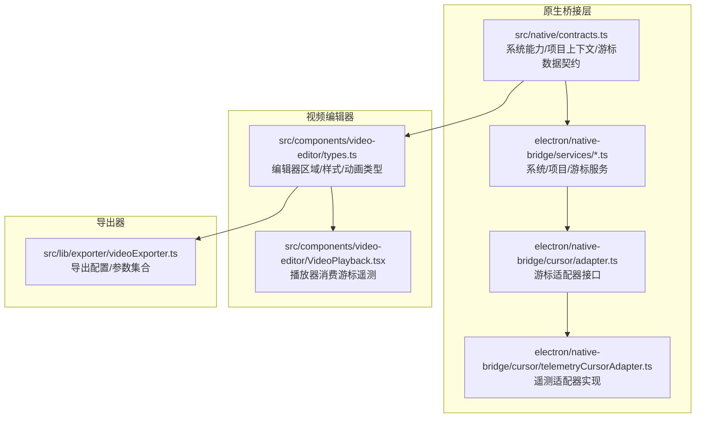
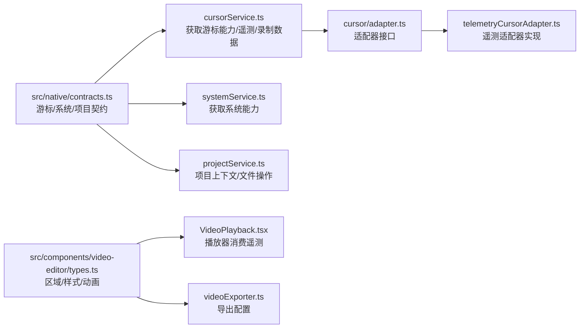
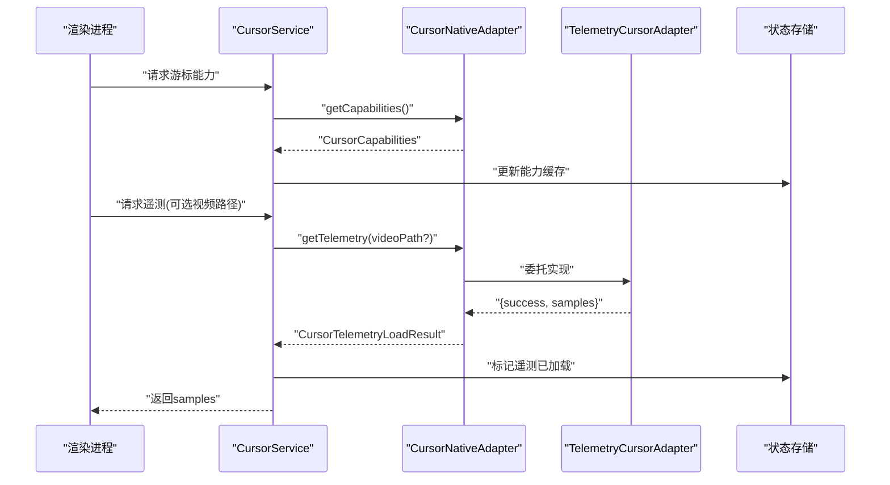
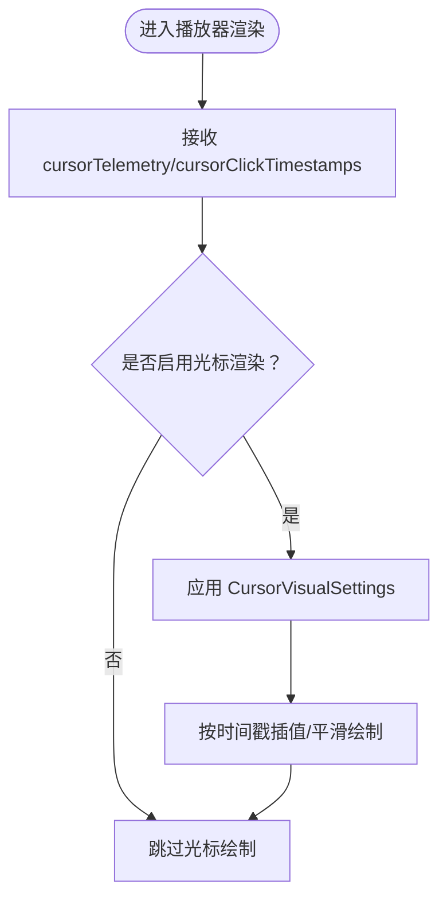
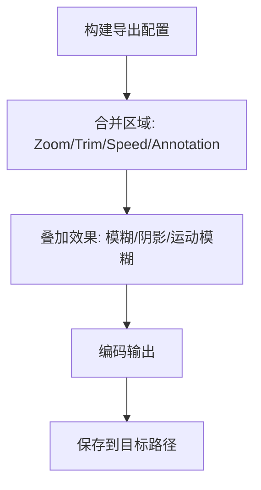
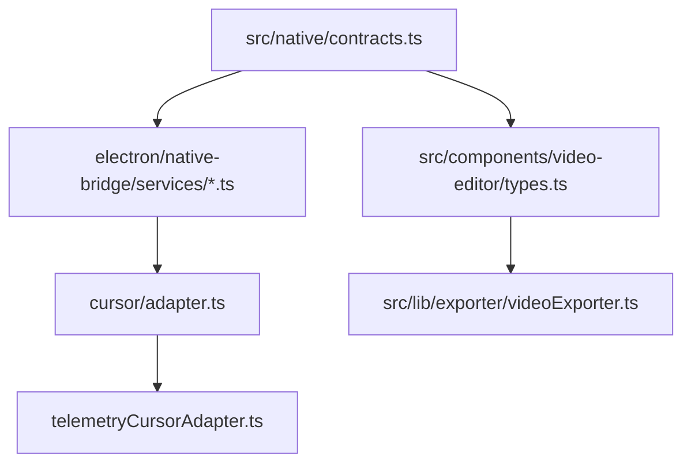

# 数据类型与接口

<cite>
**本文引用的文件**
- [src/native/contracts.ts](file://src/native/contracts.ts)
- [src/components/video-editor/types.ts](file://src/components/video-editor/types.ts)
- [electron/native-bridge/services/systemService.ts](file://electron/native-bridge/services/systemService.ts)
- [electron/native-bridge/services/projectService.ts](file://electron/native-bridge/services/projectService.ts)
- [electron/native-bridge/services/cursorService.ts](file://electron/native-bridge/services/cursorService.ts)
- [electron/native-bridge/cursor/adapter.ts](file://electron/native-bridge/cursor/adapter.ts)
- [electron/native-bridge/cursor/telemetryCursorAdapter.ts](file://electron/native-bridge/cursor/telemetryCursorAdapter.ts)
- [src/lib/exporter/videoExporter.ts](file://src/lib/exporter/videoExporter.ts)
- [src/components/video-editor/VideoPlayback.tsx](file://src/components/video-editor/VideoPlayback.tsx)
</cite>

## 目录
1. [简介](#简介)
2. [项目结构](#项目结构)
3. [核心组件](#核心组件)
4. [架构总览](#架构总览)
5. [详细组件分析](#详细组件分析)
6. [依赖关系分析](#依赖关系分析)
7. [性能考量](#性能考量)
8. [故障排查指南](#故障排查指南)
9. [结论](#结论)
10. [附录](#附录)

## 简介
本文件为 OpenScreen 的数据类型与接口参考文档，聚焦于以下方面：
- 核心数据模型：字段定义、数据类型与约束
- 关键结构体：CursorTelemetryPoint、ZoomRegion、TrimRegion、AnnotationRegion 等
- 复杂对象：ExportConfig（视频导出）、ProjectContext、SystemCapabilities
- 枚举类型、联合类型与泛型接口的使用方式
- 数据验证规则与业务约束
- 类型使用示例与最佳实践
- 可选/必填属性与默认值处理
- 类型兼容性与版本演进策略

## 项目结构
OpenScreen 的类型体系主要分布在三处：
- 原生桥接层类型：位于 src/native/contracts.ts，定义了跨主进程与渲染进程通信的统一数据契约
- 视频编辑器内部类型：位于 src/components/video-editor/types.ts，定义编辑器内的区域、样式、动画等类型
- 导出器配置类型：位于 src/lib/exporter/videoExporter.ts，定义导出阶段所需的参数集合

**图表来源**
- [src/native/contracts.ts:1-236](file://src/native/contracts.ts#L1-L236)
- [electron/native-bridge/services/systemService.ts:1-44](file://electron/native-bridge/services/systemService.ts#L1-L44)
- [electron/native-bridge/services/projectService.ts:1-88](file://electron/native-bridge/services/projectService.ts#L1-L88)
- [electron/native-bridge/cursor/adapter.ts:1-20](file://electron/native-bridge/cursor/adapter.ts#L1-L20)
- [electron/native-bridge/cursor/telemetryCursorAdapter.ts:1-49](file://electron/native-bridge/cursor/telemetryCursorAdapter.ts#L1-L49)
- [src/components/video-editor/types.ts:1-439](file://src/components/video-editor/types.ts#L1-L439)
- [src/components/video-editor/VideoPlayback.tsx:136-157](file://src/components/video-editor/VideoPlayback.tsx#L136-L157)
- [src/lib/exporter/videoExporter.ts:23-55](file://src/lib/exporter/videoExporter.ts#L23-L55)

**章节来源**
- [src/native/contracts.ts:1-236](file://src/native/contracts.ts#L1-L236)
- [src/components/video-editor/types.ts:1-439](file://src/components/video-editor/types.ts#L1-L439)
- [src/lib/exporter/videoExporter.ts:23-55](file://src/lib/exporter/videoExporter.ts#L23-L55)

## 核心组件
本节对关键数据结构进行逐项说明，并标注字段含义、类型、是否可选及默认值。

- 游标遥测点（CursorTelemetryPoint）
  - 字段
    - timeMs: number（毫秒；自录制开始的时间戳）
    - cx: number（屏幕空间 x 坐标）
    - cy: number（屏幕空间 y 坐标）
  - 约束
    - timeMs 单调递增
    - 坐标为绝对屏幕坐标
  - 使用场景
    - 遥测加载结果、播放器渲染、自动缩放建议
  - 参考路径
    - [src/native/contracts.ts:24-28](file://src/native/contracts.ts#L24-L28)
    - [src/components/video-editor/types.ts:171-186](file://src/components/video-editor/types.ts#L171-L186)

- 游标录制样本（CursorRecordingSample）
  - 继承自 CursorTelemetryPoint
  - 扩展字段
    - assetId?: string | null（资源标识）
    - visible?: boolean（可见性）
    - cursorType?: NativeCursorType | null（系统光标类型）
    - interactionType?: "move" | "click" | "mouseup"（交互事件）
  - 约束
    - interactionType 为有限集合
  - 参考路径
    - [src/native/contracts.ts:30-35](file://src/native/contracts.ts#L30-L35)

- 原生游标资产（NativeCursorAsset）
  - 字段
    - id: string
    - platform: NativePlatform
    - imageDataUrl: string（图像数据）
    - width/height: number（像素）
    - hotspotX/hotspotY: number（热点坐标）
    - scaleFactor?: number（缩放因子）
    - cursorType?: NativeCursorType | null
  - 约束
    - 宽高与热点需在图像范围内
  - 参考路径
    - [src/native/contracts.ts:37-47](file://src/native/contracts.ts#L37-L47)

- 游标录制数据（CursorRecordingData）
  - 字段
    - version: number（版本号）
    - provider: CursorProviderKind
    - samples: CursorRecordingSample[]
    - assets: NativeCursorAsset[]
  - 约束
    - samples/ assets 为空数组时仍需满足结构
  - 参考路径
    - [src/native/contracts.ts:49-54](file://src/native/contracts.ts#L49-L54)

- 系统能力（SystemCapabilities）
  - 字段
    - bridgeVersion: typeof NATIVE_BRIDGE_VERSION（桥接版本）
    - platform: NativePlatform
    - cursor: CursorCapabilities
    - project: { currentContext: boolean }
  - 约束
    - 版本号由常量统一管理
  - 参考路径
    - [src/native/contracts.ts:62-69](file://src/native/contracts.ts#L62-L69)

- 项目上下文（ProjectContext）
  - 字段
    - currentProjectPath: string | null
    - currentVideoPath: string | null
  - 约束
    - 两者可独立为 null
  - 参考路径
    - [src/native/contracts.ts:71-74](file://src/native/contracts.ts#L71-L74)

- 缩放区域（ZoomRegion）
  - 字段
    - id: string
    - startMs/endMs: number（毫秒）
    - depth: ZoomDepth（1..6）
    - focus: ZoomFocus（cx/cy 归一化）
    - focusMode?: ZoomFocusMode
    - rotationPreset?: Rotation3DPreset
    - customScale?: number（1.0–5.0，两位小数）
  - 约束
    - customScale 覆盖预设深度
    - focus 在 [0,1] 区间内
  - 参考路径
    - [src/components/video-editor/types.ts:62-72](file://src/components/video-editor/types.ts#L62-L72)

- 裁剪区域（CropRegion）
  - 字段
    - x/y/width/height: number
  - 约束
    - 默认值为单位矩形
  - 参考路径
    - [src/components/video-editor/types.ts:348-360](file://src/components/video-editor/types.ts#L348-L360)

- 裁剪片段（TrimRegion）
  - 字段
    - id: string
    - startMs/endMs: number
  - 约束
    - endMs > startMs
  - 参考路径
    - [src/components/video-editor/types.ts:205-209](file://src/components/video-editor/types.ts#L205-L209)

- 注释区域（AnnotationRegion）
  - 字段
    - id/startMs/endMs/type/content/textContent/imageContent/position/size/style/zIndex
    - figureData?: FigureData
    - blurData?: BlurData
  - 约束
    - position/size 为归一化坐标与尺寸
    - style 支持多种文本样式与动画
  - 参考路径
    - [src/components/video-editor/types.ts:281-297](file://src/components/video-editor/types.ts#L281-L297)

- 模糊数据（BlurData）
  - 字段
    - type: BlurType
    - shape: BlurShape
    - color: BlurColor
    - intensity: number
    - blockSize: number
    - freehandPoints?: { x: number; y: number }[]
  - 约束
    - intensity/blockSize 有上下限
  - 参考路径
    - [src/components/video-editor/types.ts:240-248](file://src/components/video-editor/types.ts#L240-L248)

- 导出配置（VideoExporterConfig）
  - 继承自 ExportConfig（来自导出器模块）
  - 字段
    - videoUrl/webcamVideoUrl/wallpaper
    - zoomRegions/trimRegions/speedRegions
    - showShadow/shadowIntensity/showBlur/motionBlurAmount
    - borderRadius/padding/videoPadding/cropRegion
    - webcamLayoutPreset/webcamMaskShape/webcamMirrored/webcamSizePreset/webcamPosition
    - cursorRecordingData/cursorScale/cursorSmoothing/cursorMotionBlur/cursorClickBounce/cursorClipToBounds
    - annotationRegions
    - previewWidth/previewHeight
    - cursorTelemetry/cursorClickTimestamps
    - onProgress
  - 约束
    - 可选字段用于控制可选功能开关
  - 参考路径
    - [src/lib/exporter/videoExporter.ts:23-55](file://src/lib/exporter/videoExporter.ts#L23-L55)

- 游标可视化设置（CursorVisualSettings）
  - 字段
    - size/smoothing/motionBlur/clickBounce/clipToBounds
  - 默认值
    - 见各常量定义
  - 参考路径
    - [src/components/video-editor/types.ts:188-194](file://src/components/video-editor/types.ts#L188-L194)

**章节来源**
- [src/native/contracts.ts:24-69](file://src/native/contracts.ts#L24-L69)
- [src/native/contracts.ts:71-91](file://src/native/contracts.ts#L71-L91)
- [src/components/video-editor/types.ts:62-72](file://src/components/video-editor/types.ts#L62-L72)
- [src/components/video-editor/types.ts:171-186](file://src/components/video-editor/types.ts#L171-L186)
- [src/components/video-editor/types.ts:188-194](file://src/components/video-editor/types.ts#L188-L194)
- [src/components/video-editor/types.ts:205-209](file://src/components/video-editor/types.ts#L205-L209)
- [src/components/video-editor/types.ts:240-248](file://src/components/video-editor/types.ts#L240-L248)
- [src/components/video-editor/types.ts:281-297](file://src/components/video-editor/types.ts#L281-L297)
- [src/components/video-editor/types.ts:348-360](file://src/components/video-editor/types.ts#L348-L360)
- [src/lib/exporter/videoExporter.ts:23-55](file://src/lib/exporter/videoExporter.ts#L23-L55)

## 架构总览
下图展示类型在系统中的分布与流向：原生桥接层提供统一契约，编辑器消费类型进行渲染与交互，导出器基于配置生成最终产物。

**图表来源**
- [src/native/contracts.ts:1-236](file://src/native/contracts.ts#L1-L236)
- [electron/native-bridge/services/systemService.ts:1-44](file://electron/native-bridge/services/systemService.ts#L1-L44)
- [electron/native-bridge/services/projectService.ts:1-88](file://electron/native-bridge/services/projectService.ts#L1-L88)
- [electron/native-bridge/services/cursorService.ts:1-46](file://electron/native-bridge/services/cursorService.ts#L1-L46)
- [electron/native-bridge/cursor/adapter.ts:1-20](file://electron/native-bridge/cursor/adapter.ts#L1-L20)
- [electron/native-bridge/cursor/telemetryCursorAdapter.ts:1-49](file://electron/native-bridge/cursor/telemetryCursorAdapter.ts#L1-L49)
- [src/components/video-editor/types.ts:1-439](file://src/components/video-editor/types.ts#L1-L439)
- [src/components/video-editor/VideoPlayback.tsx:136-157](file://src/components/video-editor/VideoPlayback.tsx#L136-L157)
- [src/lib/exporter/videoExporter.ts:23-55](file://src/lib/exporter/videoExporter.ts#L23-L55)

## 详细组件分析

### 游标遥测与录制数据流
该流程从原生层采集游标位置，经适配器封装后供编辑器与导出器使用。

**图表来源**
- [electron/native-bridge/services/cursorService.ts:17-35](file://electron/native-bridge/services/cursorService.ts#L17-L35)
- [electron/native-bridge/cursor/adapter.ts:15-19](file://electron/native-bridge/cursor/adapter.ts#L15-L19)
- [electron/native-bridge/cursor/telemetryCursorAdapter.ts:15-48](file://electron/native-bridge/cursor/telemetryCursorAdapter.ts#L15-L48)

**章节来源**
- [electron/native-bridge/services/cursorService.ts:1-46](file://electron/native-bridge/services/cursorService.ts#L1-L46)
- [electron/native-bridge/cursor/adapter.ts:1-20](file://electron/native-bridge/cursor/adapter.ts#L1-L20)
- [electron/native-bridge/cursor/telemetryCursorAdapter.ts:1-49](file://electron/native-bridge/cursor/telemetryCursorAdapter.ts#L1-L49)

### 编辑器消费游标遥测
播放器组件接收游标遥测与点击时间戳，决定是否渲染光标、平滑度、模糊强度等。

**图表来源**
- [src/components/video-editor/VideoPlayback.tsx:136-157](file://src/components/video-editor/VideoPlayback.tsx#L136-L157)
- [src/components/video-editor/types.ts:188-194](file://src/components/video-editor/types.ts#L188-L194)

**章节来源**
- [src/components/video-editor/VideoPlayback.tsx:136-157](file://src/components/video-editor/VideoPlayback.tsx#L136-L157)
- [src/components/video-editor/types.ts:188-194](file://src/components/video-editor/types.ts#L188-L194)

### 导出配置与区域组合
导出器通过组合 ZoomRegion/TrimRegion/AnnotationRegion 等区域，结合游标与模糊等效果生成最终视频。

**图表来源**
- [src/lib/exporter/videoExporter.ts:23-55](file://src/lib/exporter/videoExporter.ts#L23-L55)
- [src/components/video-editor/types.ts:62-72](file://src/components/video-editor/types.ts#L62-L72)
- [src/components/video-editor/types.ts:205-209](file://src/components/video-editor/types.ts#L205-L209)
- [src/components/video-editor/types.ts:281-297](file://src/components/video-editor/types.ts#L281-L297)

**章节来源**
- [src/lib/exporter/videoExporter.ts:23-55](file://src/lib/exporter/videoExporter.ts#L23-L55)
- [src/components/video-editor/types.ts:62-72](file://src/components/video-editor/types.ts#L62-L72)
- [src/components/video-editor/types.ts:205-209](file://src/components/video-editor/types.ts#L205-L209)
- [src/components/video-editor/types.ts:281-297](file://src/components/video-editor/types.ts#L281-L297)

## 依赖关系分析
- 类型分层
  - 原生桥接层（src/native/contracts.ts）为上层提供统一契约
  - 编辑器类型（src/components/video-editor/types.ts）扩展业务语义
  - 导出器（src/lib/exporter/videoExporter.ts）消费编辑器类型并组合导出参数
- 服务层
  - SystemService/ProjectService/CursorService 将业务动作映射为原生桥接请求
  - CursorNativeAdapter/TelemetryCursorAdapter 实现具体平台能力

**图表来源**
- [src/native/contracts.ts:1-236](file://src/native/contracts.ts#L1-L236)
- [electron/native-bridge/services/systemService.ts:1-44](file://electron/native-bridge/services/systemService.ts#L1-L44)
- [electron/native-bridge/services/projectService.ts:1-88](file://electron/native-bridge/services/projectService.ts#L1-L88)
- [electron/native-bridge/cursor/adapter.ts:1-20](file://electron/native-bridge/cursor/adapter.ts#L1-L20)
- [electron/native-bridge/cursor/telemetryCursorAdapter.ts:1-49](file://electron/native-bridge/cursor/telemetryCursorAdapter.ts#L1-L49)
- [src/components/video-editor/types.ts:1-439](file://src/components/video-editor/types.ts#L1-L439)
- [src/lib/exporter/videoExporter.ts:23-55](file://src/lib/exporter/videoExporter.ts#L23-L55)

**章节来源**
- [src/native/contracts.ts:1-236](file://src/native/contracts.ts#L1-L236)
- [electron/native-bridge/services/systemService.ts:1-44](file://electron/native-bridge/services/systemService.ts#L1-L44)
- [electron/native-bridge/services/projectService.ts:1-88](file://electron/native-bridge/services/projectService.ts#L1-L88)
- [electron/native-bridge/cursor/adapter.ts:1-20](file://electron/native-bridge/cursor/adapter.ts#L1-L20)
- [electron/native-bridge/cursor/telemetryCursorAdapter.ts:1-49](file://electron/native-bridge/cursor/telemetryCursorAdapter.ts#L1-L49)
- [src/components/video-editor/types.ts:1-439](file://src/components/video-editor/types.ts#L1-L439)
- [src/lib/exporter/videoExporter.ts:23-55](file://src/lib/exporter/videoExporter.ts#L23-L55)

## 性能考量
- 游标采样
  - 遥测采样频率影响数据体积与播放器渲染开销，建议在保证体验的前提下降低采样率或压缩时间序列
- 区域计算
  - ZoomRegion 的 customScale 与旋转会增加合成成本，优先使用预设深度与轻量旋转
- 导出阶段
  - MotionBlur/Shadow/Blur 等效果叠加会显著提升编码压力，建议按需开启并限制强度
- 内存占用
  - 大型注释/模糊区域与高分辨率导出会增加内存峰值，建议在导出前进行区域裁剪与降采样

## 故障排查指南
- 游标遥测加载失败
  - 现象：CursorTelemetryLoadResult 中 success=false 或抛出错误
  - 排查：检查视频路径是否有效、平台支持情况、适配器实现
  - 参考路径
    - [electron/native-bridge/services/cursorService.ts:23-35](file://electron/native-bridge/services/cursorService.ts#L23-L35)
    - [electron/native-bridge/cursor/adapter.ts:8-13](file://electron/native-bridge/cursor/adapter.ts#L8-L13)
    - [electron/native-bridge/cursor/telemetryCursorAdapter.ts:37-48](file://electron/native-bridge/cursor/telemetryCursorAdapter.ts#L37-L48)
- 项目上下文异常
  - 现象：ProjectContext 中路径为 null 导致导出/播放失败
  - 排查：确认 ProjectService 是否正确更新当前上下文
  - 参考路径
    - [electron/native-bridge/services/projectService.ts:28-36](file://electron/native-bridge/services/projectService.ts#L28-L36)
    - [src/native/contracts.ts:71-74](file://src/native/contracts.ts#L71-L74)
- 系统能力不匹配
  - 现象：SystemCapabilities 与预期不符
  - 排查：核对平台与桥接版本，确保 CursorCapabilities 返回正确
  - 参考路径
    - [electron/native-bridge/services/systemService.ts:27-42](file://electron/native-bridge/services/systemService.ts#L27-L42)
    - [src/native/contracts.ts:62-69](file://src/native/contracts.ts#L62-L69)

**章节来源**
- [electron/native-bridge/services/cursorService.ts:23-35](file://electron/native-bridge/services/cursorService.ts#L23-L35)
- [electron/native-bridge/cursor/adapter.ts:8-13](file://electron/native-bridge/cursor/adapter.ts#L8-L13)
- [electron/native-bridge/cursor/telemetryCursorAdapter.ts:37-48](file://electron/native-bridge/cursor/telemetryCursorAdapter.ts#L37-L48)
- [electron/native-bridge/services/projectService.ts:28-36](file://electron/native-bridge/services/projectService.ts#L28-L36)
- [src/native/contracts.ts:71-74](file://src/native/contracts.ts#L71-L74)
- [electron/native-bridge/services/systemService.ts:27-42](file://electron/native-bridge/services/systemService.ts#L27-L42)
- [src/native/contracts.ts:62-69](file://src/native/contracts.ts#L62-L69)

## 结论
OpenScreen 的类型体系以原生桥接层为核心，向上提供统一契约，向下支撑编辑器与导出器的复杂业务。通过明确的字段定义、约束与默认值策略，系统在功能丰富与性能之间取得平衡。建议在新增类型时遵循现有命名与约束风格，保持向后兼容与清晰的演进路径。

## 附录

### 类型兼容性与版本演进策略
- 原生桥接版本（NATIVE_BRIDGE_VERSION）
  - 作用：统一系统能力与请求/响应元信息版本
  - 兼容性：仅在破坏性变更时升级，客户端需兼容旧版本响应
  - 参考路径
    - [src/native/contracts.ts:2, 62-69](file://src/native/contracts.ts#L2,L62-L69)
- 游标录制数据版本（CursorRecordingData.version）
  - 作用：记录录制数据格式版本，便于解析与迁移
  - 兼容性：新增字段应保持可选，避免强制迁移
  - 参考路径
    - [src/native/contracts.ts:49-54](file://src/native/contracts.ts#L49-L54)
- 编辑器类型默认值
  - 作用：为可选视觉参数提供稳定默认，减少配置负担
  - 参考路径
    - [src/components/video-editor/types.ts:196-203](file://src/components/video-editor/types.ts#L196-L203)

### 数据验证与业务约束清单
- 时间戳与区间
  - startMs < endMs（TrimRegion/ZoomRegion）
  - timeMs 单调递增（CursorTelemetryPoint）
- 坐标与范围
  - focus/cx/cy ∈ [0,1]（ZoomFocus）
  - position/size 为归一化（AnnotationRegion）
- 数值边界
  - customScale ∈ [1.0, 5.0]（ZoomRegion）
  - intensity/blockSize ∈ [MIN, MAX]（BlurData）
- 可选与必填
  - 多数编辑器效果参数为可选，导出器中对应字段亦为可选
  - 参考路径
    - [src/components/video-editor/types.ts:62-72](file://src/components/video-editor/types.ts#L62-L72)
    - [src/components/video-editor/types.ts:240-248](file://src/components/video-editor/types.ts#L240-L248)
    - [src/lib/exporter/videoExporter.ts:23-55](file://src/lib/exporter/videoExporter.ts#L23-L55)

### 使用示例与最佳实践
- 加载游标遥测
  - 步骤：调用 CursorService.getTelemetry(videoPath?) → 成功后更新状态
  - 参考路径
    - [electron/native-bridge/services/cursorService.ts:23-35](file://electron/native-bridge/services/cursorService.ts#L23-L35)
- 应用注释区域
  - 步骤：定义 AnnotationRegion → 设置 position/size/style → 在播放器中渲染
  - 参考路径
    - [src/components/video-editor/types.ts:281-297](file://src/components/video-editor/types.ts#L281-L297)
- 构建导出配置
  - 步骤：组合 Zoom/Trim/Annotation 区域 → 开启所需效果 → 调用导出器
  - 参考路径
    - [src/lib/exporter/videoExporter.ts:23-55](file://src/lib/exporter/videoExporter.ts#L23-L55)