# UI组件库

<cite>
**本文档引用的文件**
- [button.tsx](file://src/components/ui/button.tsx)
- [input.tsx](file://src/components/ui/input.tsx)
- [select.tsx](file://src/components/ui/select.tsx)
- [slider.tsx](file://src/components/ui/slider.tsx)
- [card.tsx](file://src/components/ui/card.tsx)
- [accordion.tsx](file://src/components/ui/accordion.tsx)
- [dialog.tsx](file://src/components/ui/dialog.tsx)
- [tooltip.tsx](file://src/components/ui/tooltip.tsx)
- [dropdown-menu.tsx](file://src/components/ui/dropdown-menu.tsx)
- [popover.tsx](file://src/components/ui/popover.tsx)
- [switch.tsx](file://src/components/ui/switch.tsx)
- [toggle.tsx](file://src/components/ui/toggle.tsx)
- [toggle-group.tsx](file://src/components/ui/toggle-group.tsx)
- [tabs.tsx](file://src/components/ui/tabs.tsx)
- [label.tsx](file://src/components/ui/label.tsx)
- [item-content.tsx](file://src/components/ui/item-content.tsx)
- [content-clamp.tsx](file://src/components/ui/content-clamp.tsx)
- [audio-level-meter.tsx](file://src/components/ui/audio-level-meter.tsx)
- [color-picker.tsx](file://src/components/ui/color-picker.tsx)
- [sonner.tsx](file://src/components/ui/sonner.tsx)
- [CanvasArea.tsx](file://src/components/demo-builder/CanvasArea.tsx)
- [DemoEditor.tsx](file://src/components/demo-builder/DemoEditor.tsx)
- [PropertiesPanel.tsx](file://src/components/demo-builder/PropertiesPanel.tsx)
- [DemoDashboard.tsx](file://src/components/demo-builder/DemoDashboard.tsx)
- [DemoPlayer.tsx](file://src/components/demo-builder/DemoPlayer.tsx)
- [DemoSidebar.tsx](file://src/components/demo-builder/DemoSidebar.tsx)
- [TimelineStrip.tsx](file://src/components/demo-builder/TimelineStrip.tsx)
- [ExportDialog.tsx](file://src/components/demo-builder/ExportDialog.tsx)
- [StepPanel.tsx](file://src/components/demo-builder/StepPanel.tsx)
- [EditorBottomBar.tsx](file://src/components/demo-builder/EditorBottomBar.tsx)
- [DemoPlaybackControls.tsx](file://src/components/demo-builder/DemoPlaybackControls.tsx)
- [types.ts](file://src/lib/demobuilder/types.ts)
- [App.tsx](file://src/App.tsx)
- [index.css](file://src/index.css)
- [tailwind.config.cjs](file://tailwind.config.cjs)
- [postcss.config.cjs](file://postcss.config.cjs)
- [components.json](file://components.json)
- [package.json](file://package.json)
</cite>

## 目录
1. [简介](#简介)
2. [项目结构](#项目结构)
3. [核心组件](#核心组件)
4. [架构总览](#架构总览)
5. [详细组件分析](#详细组件分析)
6. [DemoBuilder专业组件系统](#demobuilder专业组件系统)
7. [依赖关系分析](#依赖关系分析)
8. [性能考虑](#性能考虑)
9. [故障排除指南](#故障排除指南)
10. [结论](#结论)
11. [附录](#附录)

## 简介
本文件为 OpenScreen 的 UI 组件库文档，聚焦于基于 Radix UI 和 Tailwind CSS 的组件体系设计与实现。内容覆盖基础表单组件（button、input、select、slider）、布局组件（card、accordion）、反馈组件（dialog、tooltip）以及交互组件（dropdown-menu、popover、switch、toggle、toggle-group、tabs、label、item-content、content-clamp、audio-level-meter、color-picker、sonner）的设计原则、使用方法、可访问性支持、主题系统与样式定制机制，并提供最佳实践与自定义扩展指南。

**更新** 新增完整的 DemoBuilder 专业组件系统，包括 CanvasArea、DemoEditor、PropertiesPanel、DemoDashboard、DemoPlayer、DemoSidebar、TimelineStrip、ExportDialog、StepPanel、EditorBottomBar、DemoPlaybackControls 等组件，形成完整的图文演示制作工作流。

## 项目结构
OpenScreen 的 UI 组件集中位于 src/components/ui 目录下，采用按功能分层的组织方式：基础组件（表单与布局）、反馈组件（对话框与提示）、交互组件（菜单与开关）以及工具型组件（标签、内容截断、音频表盘、颜色选择器、通知等）。新增的 DemoBuilder 专业组件系统位于 src/components/demo-builder 目录，提供完整的图文演示制作工具链。

```mermaid
graph TB
subgraph "UI 组件层"
base["基础组件<br/>button, input, select, slider"]
layout["布局组件<br/>card, accordion"]
feedback["反馈组件<br/>dialog, tooltip"]
interactive["交互组件<br/>dropdown-menu, popover, switch, toggle, toggle-group, tabs"]
utils["工具组件<br/>label, item-content, content-clamp, audio-level-meter, color-picker, sonner"]
end
subgraph "DemoBuilder 专业组件系统"
canvas["CanvasArea<br/>画布区域"]
editor["DemoEditor<br/>主编辑器"]
props["PropertiesPanel<br/>属性面板"]
dashboard["DemoDashboard<br/>项目仪表板"]
player["DemoPlayer<br/>播放器"]
sidebar["DemoSidebar<br/>侧边栏"]
timeline["TimelineStrip<br/>时间轴"]
export["ExportDialog<br/>导出对话框"]
steppanel["StepPanel<br/>步骤面板"]
bottombar["EditorBottomBar<br/>底部工具栏"]
playback["DemoPlaybackControls<br/>播放控件"]
end
subgraph "样式与主题"
tw["Tailwind CSS 配置"]
cssvars["CSS 变量与主题"]
end
subgraph "可访问性"
radix["Radix UI 无障碍能力"]
end
base --> radix
layout --> radix
feedback --> radix
interactive --> radix
utils --> radix
canvas --> radix
editor --> radix
props --> radix
dashboard --> radix
player --> radix
sidebar --> radix
timeline --> radix
export --> radix
steppanel --> radix
bottombar --> radix
playback --> radix
base --> tw
layout --> tw
feedback --> tw
interactive --> tw
utils --> tw
canvas --> tw
editor --> tw
props --> tw
dashboard --> tw
player --> tw
sidebar --> tw
timeline --> tw
export --> tw
steppanel --> tw
bottombar --> tw
playback --> tw
radix --> cssvars
tw --> cssvars
```

**图表来源**
- [CanvasArea.tsx](file://src/components/demo-builder/CanvasArea.tsx)
- [DemoEditor.tsx](file://src/components/demo-builder/DemoEditor.tsx)
- [PropertiesPanel.tsx](file://src/components/demo-builder/PropertiesPanel.tsx)
- [DemoDashboard.tsx](file://src/components/demo-builder/DemoDashboard.tsx)
- [DemoPlayer.tsx](file://src/components/demo-builder/DemoPlayer.tsx)
- [DemoSidebar.tsx](file://src/components/demo-builder/DemoSidebar.tsx)
- [TimelineStrip.tsx](file://src/components/demo-builder/TimelineStrip.tsx)
- [ExportDialog.tsx](file://src/components/demo-builder/ExportDialog.tsx)
- [StepPanel.tsx](file://src/components/demo-builder/StepPanel.tsx)
- [EditorBottomBar.tsx](file://src/components/demo-builder/EditorBottomBar.tsx)
- [DemoPlaybackControls.tsx](file://src/components/demo-builder/DemoPlaybackControls.tsx)

**章节来源**
- [CanvasArea.tsx](file://src/components/demo-builder/CanvasArea.tsx)
- [DemoEditor.tsx](file://src/components/demo-builder/DemoEditor.tsx)
- [PropertiesPanel.tsx](file://src/components/demo-builder/PropertiesPanel.tsx)
- [DemoDashboard.tsx](file://src/components/demo-builder/DemoDashboard.tsx)
- [DemoPlayer.tsx](file://src/components/demo-builder/DemoPlayer.tsx)
- [DemoSidebar.tsx](file://src/components/demo-builder/DemoSidebar.tsx)
- [TimelineStrip.tsx](file://src/components/demo-builder/TimelineStrip.tsx)
- [ExportDialog.tsx](file://src/components/demo-builder/ExportDialog.tsx)
- [StepPanel.tsx](file://src/components/demo-builder/StepPanel.tsx)
- [EditorBottomBar.tsx](file://src/components/demo-builder/EditorBottomBar.tsx)
- [DemoPlaybackControls.tsx](file://src/components/demo-builder/DemoPlaybackControls.tsx)

## 核心组件
本节概述基础表单组件与布局组件的设计原则与使用要点：
- button：提供多种尺寸、变体与状态（禁用、加载），结合 Tailwind 类名与 Radix 触发器实现一致的交互与视觉反馈。
- input：封装输入行为与样式，支持受控/非受控模式、错误状态与辅助文本展示。
- select：基于 Radix Select 实现，提供选项渲染、搜索过滤、多选/单选与无障碍属性。
- slider：支持连续值调节与离散步进，提供刻度、数值显示与无障碍支持。
- card：容器型组件，用于信息分组与内容区块的视觉组织。
- accordion：折叠面板组件，支持单开/多开模式与动画展开收起。

使用建议：
- 优先使用语义化标签与 aria-* 属性，确保键盘可达与屏幕阅读器友好。
- 通过 Tailwind 类名组合实现风格一致性，避免内联样式的滥用。
- 在复杂场景中，结合 Radix 提供的上下文与状态钩子进行状态管理。

**章节来源**
- [button.tsx](file://src/components/ui/button.tsx)
- [input.tsx](file://src/components/ui/input.tsx)
- [select.tsx](file://src/components/ui/select.tsx)
- [slider.tsx](file://src/components/ui/slider.tsx)
- [card.tsx](file://src/components/ui/card.tsx)
- [accordion.tsx](file://src/components/ui/accordion.tsx)

## 架构总览
OpenScreen 的 UI 架构以 Radix UI 为核心，提供可组合、可访问的交互基元；Tailwind CSS 负责样式实现与主题定制；组件通过统一的 props 接口与 CSS 变量实现一致的外观与行为。新增的 DemoBuilder 专业组件系统基于相同的架构理念，提供完整的图文演示制作工具链。

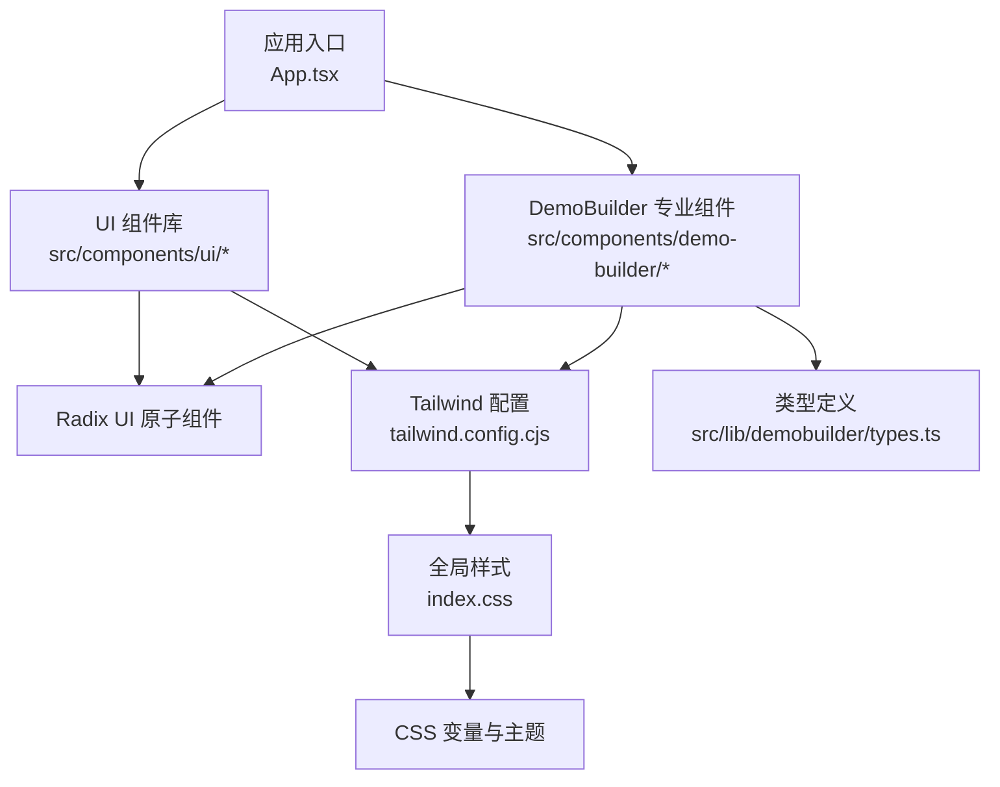

**图表来源**
- [App.tsx](file://src/App.tsx)
- [tailwind.config.cjs](file://tailwind.config.cjs)
- [index.css](file://src/index.css)
- [types.ts](file://src/lib/demobuilder/types.ts)

## 详细组件分析

### 表单组件

#### Button（按钮）
- 设计原则：提供明确的视觉层级与交互反馈；支持禁用、加载、强调/次要等变体；保持一致的尺寸与间距。
- 关键点：使用 Radix 触发器作为底层交互基元；通过 Tailwind 类名组合实现不同变体；支持图标与文本组合。
- 可访问性：自动继承按钮语义，支持键盘激活与焦点管理。

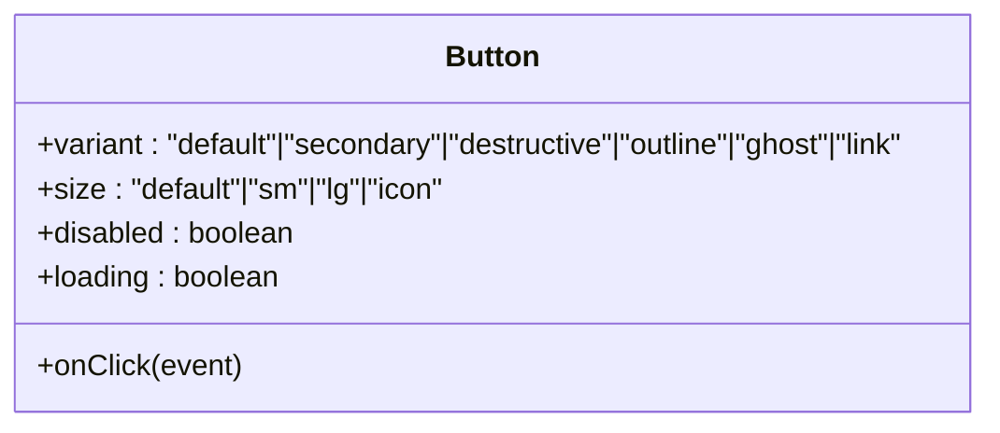

**图表来源**
- [button.tsx](file://src/components/ui/button.tsx)

**章节来源**
- [button.tsx](file://src/components/ui/button.tsx)

#### Input（输入框）
- 设计原则：清晰的边框与背景状态；错误态高对比度；辅助文本与图标位置合理。
- 关键点：支持受控/非受控；可选前缀/后缀图标；错误状态与帮助文本。
- 可访问性：自动设置 type 与 role；aria-invalid 与 aria-describedby。

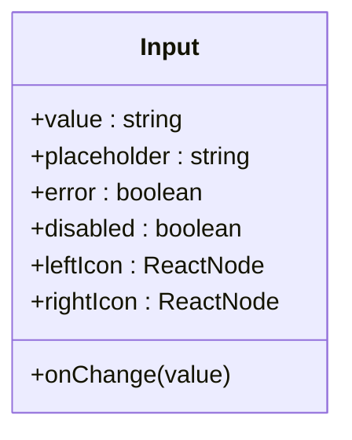

**图表来源**
- [input.tsx](file://src/components/ui/input.tsx)

**章节来源**
- [input.tsx](file://src/components/ui/input.tsx)

#### Select（选择器）
- 设计原则：下拉选项清晰、可搜索；支持多选与单选；默认值与空状态处理。
- 关键点：使用 Radix Select；提供选项渲染插槽；支持过滤与无结果提示。
- 可访问性：自动设置 role="combobox"；键盘导航与屏幕阅读器支持。

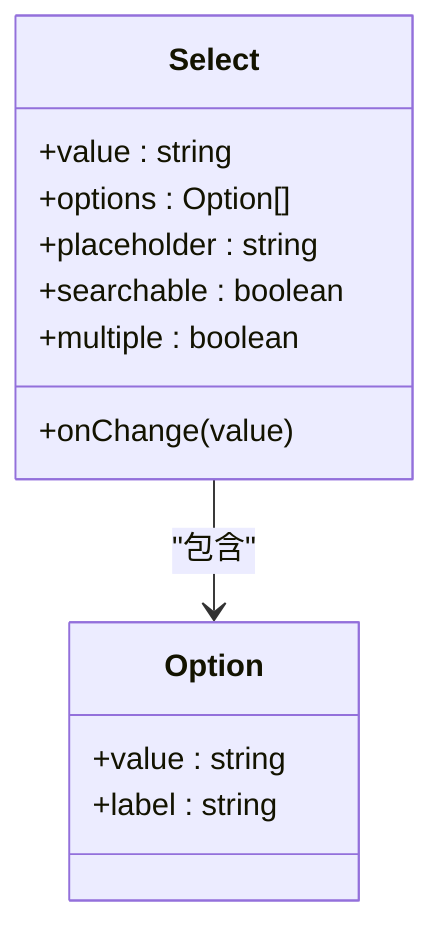

**图表来源**
- [select.tsx](file://src/components/ui/select.tsx)

**章节来源**
- [select.tsx](file://src/components/ui/select.tsx)

#### Slider（滑块）
- 设计原则：连续/离散两种模式；刻度与数值显示；禁用与只读状态。
- 关键点：支持 min/max/steps；数值格式化；拖拽与键盘微调。
- 可访问性：aria-valuemin/aria-valuemax/aria-valuenow；键盘方向键支持。

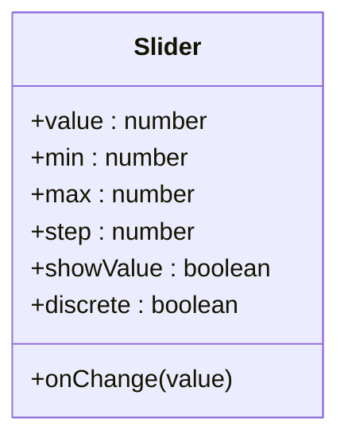

**图表来源**
- [slider.tsx](file://src/components/ui/slider.tsx)

**章节来源**
- [slider.tsx](file://src/components/ui/slider.tsx)

### 布局组件

#### Card（卡片）
- 设计原则：内容分组与视觉层次；阴影与圆角；标题/描述/操作区布局。
- 关键点：header/body/footer 结构化；支持媒体区域与操作按钮。
- 可访问性：语义化结构；焦点顺序合理。

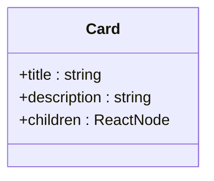

**图表来源**
- [card.tsx](file://src/components/ui/card.tsx)

**章节来源**
- [card.tsx](file://src/components/ui/card.tsx)

#### Accordion（手风琴）
- 设计原则：逐项展开/收起；图标与过渡动画；可单开/多开。
- 关键点：使用 Radix Accordion；支持嵌套与受控/非受控。
- 可访问性：aria-expanded 与 aria-controls；键盘切换。

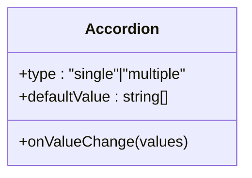

**图表来源**
- [accordion.tsx](file://src/components/ui/accordion.tsx)

**章节来源**
- [accordion.tsx](file://src/components/ui/accordion.tsx)

### 反馈组件

#### Dialog（对话框）
- 设计原则：模态遮罩与焦点陷阱；关闭与取消流程；键盘 ESC 关闭。
- 关键点：触发器与内容分离；支持全屏/自适应尺寸；动画入场/出场。
- 可访问性：自动聚焦到可交互元素；aria-modal；关闭时返回触发元素焦点。

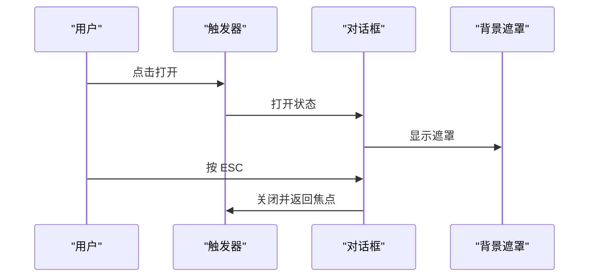

**图表来源**
- [dialog.tsx](file://src/components/ui/dialog.tsx)

**章节来源**
- [dialog.tsx](file://src/components/ui/dialog.tsx)

#### Tooltip（工具提示）
- 设计原则：轻量信息提示；悬停/焦点触发；定位与边界检测。
- 关键点：延迟与持续时间控制；支持固定/跟随鼠标；无障碍标签。
- 可访问性：aria-label 或 aria-describedby；键盘触发与关闭。

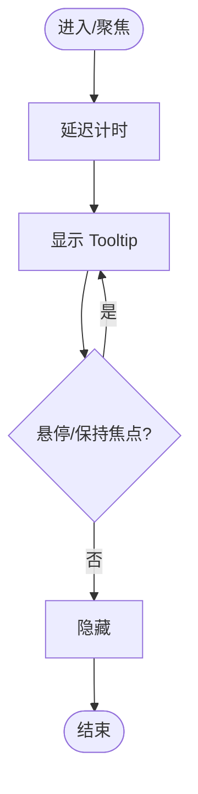

**图表来源**
- [tooltip.tsx](file://src/components/ui/tooltip.tsx)

**章节来源**
- [tooltip.tsx](file://src/components/ui/tooltip.tsx)

### 交互组件

#### Dropdown Menu（下拉菜单）
- 设计原则：点击/悬停触发；选项分组与快捷键；键盘导航。
- 关键点：子菜单与分割线；图标与文本对齐；禁用项处理。
- 可访问性：role="menu"/"menuitem"；Tab 导航；Enter/Space 激活。

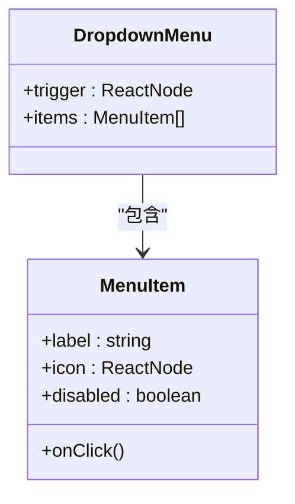

**图表来源**
- [dropdown-menu.tsx](file://src/components/ui/dropdown-menu.tsx)

**章节来源**
- [dropdown-menu.tsx](file://src/components/ui/dropdown-menu.tsx)

#### Popover（弹出层）
- 设计原则：相对定位与边界适配；点击/焦点触发；可放置多方位。
- 关键点：内容区滚动与尺寸自适应；边缘吸附与偏移。
- 可访问性：aria-expanded 与 aria-haspopup；Esc 关闭。

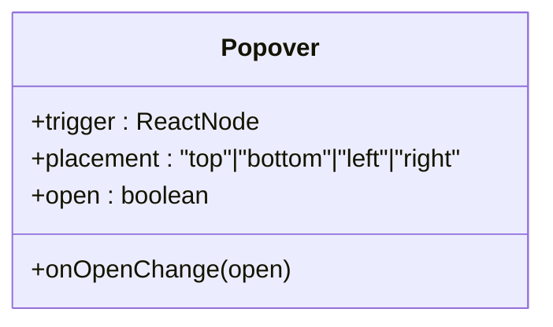

**图表来源**
- [popover.tsx](file://src/components/ui/popover.tsx)

**章节来源**
- [popover.tsx](file://src/components/ui/popover.tsx)

#### Switch（开关）
- 设计原则：二态切换；视觉反馈与动画；禁用态不可操作。
- 关键点：受控/非受控；图标与文字标签；尺寸可选。
- 可访问性：role="switch"；Enter/Space 切换。

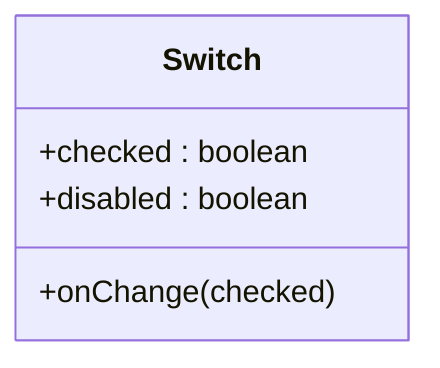

**图表来源**
- [switch.tsx](file://src/components/ui/switch.tsx)

**章节来源**
- [switch.tsx](file://src/components/ui/switch.tsx)

#### Toggle/ToggleGroup（切换按钮与组）
- 设计原则：互斥/非互斥切换；图标与文本组合；视觉选中态。
- 关键点：ToggleGroup 支持单选/多选；值变更回调；禁用项。
- 可访问性：role="button"；aria-pressed；键盘左右切换。

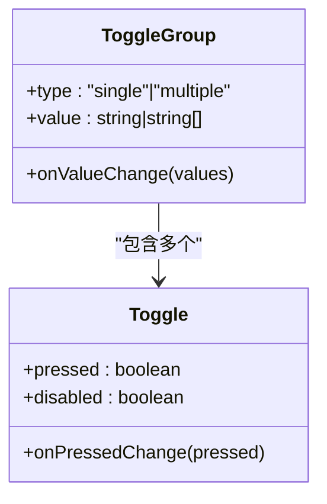

**图表来源**
- [toggle.tsx](file://src/components/ui/toggle.tsx)
- [toggle-group.tsx](file://src/components/ui/toggle-group.tsx)

**章节来源**
- [toggle.tsx](file://src/components/ui/toggle.tsx)
- [toggle-group.tsx](file://src/components/ui/toggle-group.tsx)

#### Tabs（标签页）
- 设计原则：内容分区与切换；标签对齐与溢出处理；动画过渡。
- 关键点：受控/非受控；禁用标签；可添加新标签。
- 可访问性：role="tablist"/"tab"/"tabpanel"；左右键切换。

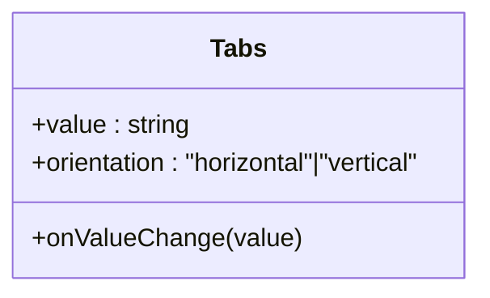

**图表来源**
- [tabs.tsx](file://src/components/ui/tabs.tsx)

**章节来源**
- [tabs.tsx](file://src/components/ui/tabs.tsx)

### 工具型组件

#### Label（标签）
- 设计原则：与表单控件关联；可点击激活目标控件；辅助文本。
- 关键点：for 属性与控件 id 对应；错误态高亮。
- 可访问性：labelHTMLFor 与 aria-labelledby。

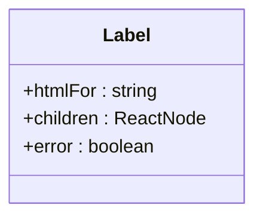

**图表来源**
- [label.tsx](file://src/components/ui/label.tsx)

**章节来源**
- [label.tsx](file://src/components/ui/label.tsx)

#### ItemContent（列表项内容）
- 设计原则：主副标题与描述；图标与操作区；对齐与留白。
- 关键点：支持多行文本与省略；操作按钮对齐右侧。
- 可访问性：语义化结构；焦点顺序。

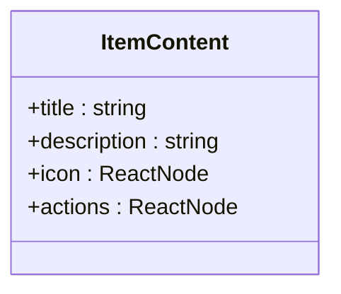

**图表来源**
- [item-content.tsx](file://src/components/ui/item-content.tsx)

**章节来源**
- [item-content.tsx](file://src/components/ui/item-content.tsx)

#### ContentClamp（内容截断）
- 设计原则：动态截断与展开；省略号与"展开"链接；过渡动画。
- 关键点：基于行数或高度阈值；支持手动展开/收起。
- 可访问性：aria-expanded；键盘激活。

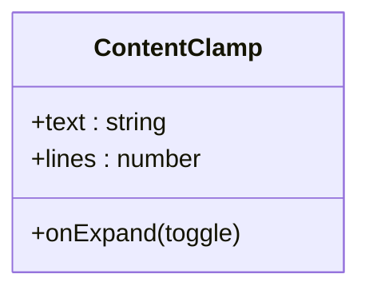

**图表来源**
- [content-clamp.tsx](file://src/components/ui/content-clamp.tsx)

**章节来源**
- [content-clamp.tsx](file://src/components/ui/content-clamp.tsx)

#### AudioLevelMeter（音频电平表盘）
- 设计原则：实时电平可视化；渐变色彩与刻度；静音态处理。
- 关键点：采样频率与平滑算法；可配置范围与单位。
- 可访问性：仅作视觉提示，不替代文本描述。

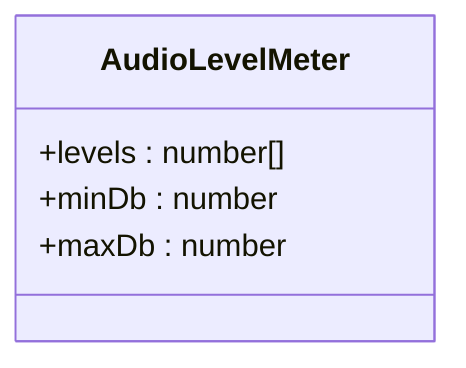

**图表来源**
- [audio-level-meter.tsx](file://src/components/ui/audio-level-meter.tsx)

**章节来源**
- [audio-level-meter.tsx](file://src/components/ui/audio-level-meter.tsx)

#### ColorPicker（颜色选择器）
- 设计原则：色相/饱和度/明度选择；预设色板；HEX/RGB 输入。
- 关键点：拖拽与键盘微调；对比度检查；无障碍标签。
- 可访问性：role="application"；键盘方向键；Enter/Space 激活。

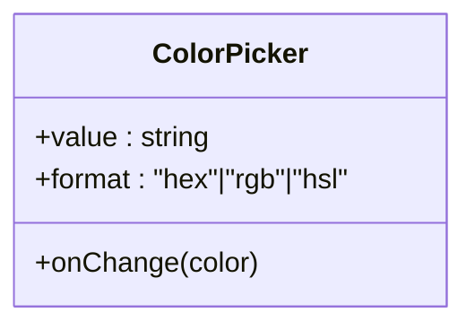

**图表来源**
- [color-picker.tsx](file://src/components/ui/color-picker.tsx)

**章节来源**
- [color-picker.tsx](file://src/components/ui/color-picker.tsx)

#### Sonner（全局通知）
- 设计原则：非阻塞通知；自动消失与手动关闭；分类与图标。
- 关键点：位置配置（左/右上/下）；堆叠与去重；主题适配。
- 可访问性：自动朗读重要通知；键盘关闭。

```mermaid
classDiagram
class Sonner {
+toast(options)
+dismiss(toastId)
}
```

**图表来源**
- [sonner.tsx](file://src/components/ui/sonner.tsx)

**章节来源**
- [sonner.tsx](file://src/components/ui/sonner.tsx)

## DemoBuilder专业组件系统

### DemoEditor（主编辑器）
DemoEditor 是整个 DemoBuilder 系统的核心组件，负责协调各个子组件并管理项目状态。它集成了项目加载、保存、编辑器状态管理等功能。

```mermaid
graph TB
editor["DemoEditor<br/>主编辑器"]
dashboard["DemoDashboard<br/>项目仪表板"]
sidebar["DemoSidebar<br/>侧边栏"]
canvas["CanvasArea<br/>画布区域"]
properties["PropertiesPanel<br/>属性面板"]
timeline["TimelineStrip<br/>时间轴"]
export["ExportDialog<br/>导出对话框"]
player["DemoPlayer<br/>播放器"]
controls["DemoPlaybackControls<br/>播放控件"]
bottombar["EditorBottomBar<br/>底部工具栏"]
editor --> dashboard
editor --> sidebar
editor --> canvas
editor --> properties
editor --> timeline
editor --> export
editor --> player
editor --> controls
editor --> bottombar
```

**图表来源**
- [DemoEditor.tsx](file://src/components/demo-builder/DemoEditor.tsx)
- [DemoDashboard.tsx](file://src/components/demo-builder/DemoDashboard.tsx)
- [DemoSidebar.tsx](file://src/components/demo-builder/DemoSidebar.tsx)
- [CanvasArea.tsx](file://src/components/demo-builder/CanvasArea.tsx)
- [PropertiesPanel.tsx](file://src/components/demo-builder/PropertiesPanel.tsx)
- [TimelineStrip.tsx](file://src/components/demo-builder/TimelineStrip.tsx)
- [ExportDialog.tsx](file://src/components/demo-builder/ExportDialog.tsx)
- [DemoPlayer.tsx](file://src/components/demo-builder/DemoPlayer.tsx)
- [DemoPlaybackControls.tsx](file://src/components/demo-builder/DemoPlaybackControls.tsx)
- [EditorBottomBar.tsx](file://src/components/demo-builder/EditorBottomBar.tsx)

### CanvasArea（画布区域）
CanvasArea 是 DemoBuilder 的核心画布组件，提供截图显示、热点标注、播放控制等功能。支持多种注释模式（光标标记、高亮区域）和播放回放。

**主要特性**：
- 截图缩放与居中显示
- 热点标注编辑（矩形、圆形、椭圆形）
- 播放回放引擎（光标移动、点击效果、高亮显示）
- 注释模式切换（光标标记、高亮绘制、无模式）
- 背景模糊、阴影、圆角等视觉效果

**章节来源**
- [CanvasArea.tsx](file://src/components/demo-builder/CanvasArea.tsx)

### PropertiesPanel（属性面板）
PropertiesPanel 根据选中元素类型显示不同的属性配置界面，支持步骤属性、光标标记属性、高亮区域属性等。

**功能特点**：
- 无选中元素时显示步骤基本信息
- 光标标记属性配置（标签、浮动说明、点击动画）
- 高亮区域属性配置（形状、颜色、时长、位置）
- 实时属性更新与验证

**章节来源**
- [PropertiesPanel.tsx](file://src/components/demo-builder/PropertiesPanel.tsx)

### DemoSidebar（侧边栏）
DemoSidebar 提供项目设置面板，支持背景设置、外观调整、声音配置和导出功能。

**模块划分**：
- 背景设置：壁纸、纯色、渐变三种模式
- 外观设置：模糊强度、圆角、内边距、阴影
- 声音设置：点击音效、背景音乐
- 导出设置：视频导出选项

**章节来源**
- [DemoSidebar.tsx](file://src/components/demo-builder/DemoSidebar.tsx)

### TimelineStrip（时间轴）
TimelineStrip 提供步骤缩略图浏览和管理功能，支持拖拽排序、右键菜单、导入截图等操作。

**交互功能**：
- 步骤缩略图显示
- 拖拽重新排序
- 右键上下文菜单
- 导入截图按钮
- 播放控件集成

**章节来源**
- [TimelineStrip.tsx](file://src/components/demo-builder/TimelineStrip.tsx)

### DemoPlayer（播放器）
DemoPlayer 提供独立的演示播放界面，支持全屏播放、键盘导航、步骤切换等功能。

**播放特性**：
- 自动播放序列（光标移动、点击效果、高亮显示）
- 键盘导航（左右箭头、空格、ESC）
- 步骤进度指示
- 字幕显示
- 转场效果

**章节来源**
- [DemoPlayer.tsx](file://src/components/demo-builder/DemoPlayer.tsx)

### DemoDashboard（项目仪表板）
DemoDashboard 提供项目列表界面，支持新建项目、打开现有项目、项目统计信息显示等功能。

**界面功能**：
- 项目列表网格显示
- 项目统计信息（步骤数、截图数、更新时间）
- 新建项目按钮
- 加载状态处理

**章节来源**
- [DemoDashboard.tsx](file://src/components/demo-builder/DemoDashboard.tsx)

### ExportDialog（导出对话框）
ExportDialog 提供项目导出功能，支持多种输出格式和导出状态管理。

**导出选项**：
- 视频格式（MP4、GIF、PDF）
- 导出状态反馈
- 成功/失败消息提示
- 异步导出处理

**章节来源**
- [ExportDialog.tsx](file://src/components/demo-builder/ExportDialog.tsx)

### StepPanel（步骤面板）
StepPanel 提供步骤列表管理界面，支持步骤排序、预览、删除等操作。

**面板功能**：
- 步骤列表显示
- 上移/下移排序
- 预览步骤
- 删除步骤
- 未使用截图管理

**章节来源**
- [StepPanel.tsx](file://src/components/demo-builder/StepPanel.tsx)

### EditorBottomBar（底部工具栏）
EditorBottomBar 提供编辑器底部工具栏，包含撤销/重做、播放控制、统计信息等。

**工具栏元素**：
- 撤销/重做按钮
- 播放控制按钮
- 步骤数量统计
- 总时长显示

**章节来源**
- [EditorBottomBar.tsx](file://src/components/demo-builder/EditorBottomBar.tsx)

### DemoPlaybackControls（播放控件）
DemoPlaybackControls 是嵌入式播放控件，显示在时间轴标题行中，提供胶囊形播放界面。

**控件特性**：
- 播放/停止按钮
- 步骤进度显示
- 当前步骤标题
- 播放状态指示

**章节来源**
- [DemoPlaybackControls.tsx](file://src/components/demo-builder/DemoPlaybackControls.tsx)

### 类型系统
DemoBuilder 系统基于完善的 TypeScript 类型定义，确保数据结构的一致性和安全性。

**核心类型**：
- DemoProject：项目根类型，包含截图、步骤、设置等
- Step：步骤类型，包含截图引用、热点、光标动画、字幕等
- Hotspot：热点类型，支持多种形状和动画效果
- CursorAnimation：光标动画配置
- ProjectSettings：项目设置类型

**章节来源**
- [types.ts](file://src/lib/demobuilder/types.ts)

## 依赖关系分析
- 组件依赖 Radix UI 原子组件与组合器，确保一致的可访问性与交互语义。
- 样式依赖 Tailwind CSS 配置与 CSS 变量，实现主题化与响应式设计。
- 组件通过统一的 props 接口与 className 组合，降低耦合并提升可维护性。
- DemoBuilder 专业组件系统共享相同的基础组件库，确保视觉和交互一致性。

```mermaid
graph LR
pkg["package.json 依赖声明"]
radix["Radix UI"]
tw["Tailwind CSS"]
ui["UI 组件基础库"]
demo["DemoBuilder 专业组件"]
types["类型定义"]
pkg --> radix
pkg --> tw
ui --> radix
ui --> tw
demo --> radix
demo --> tw
demo --> ui
demo --> types
```

**图表来源**
- [package.json](file://package.json)
- [types.ts](file://src/lib/demobuilder/types.ts)

**章节来源**
- [package.json](file://package.json)

## 性能考虑
- 使用 React.memo 与 useMemo 缓存昂贵计算与渲染结果。
- 控制动画帧率与过渡时长，避免在低端设备上造成卡顿。
- 图标与图片资源按需加载，减少首屏体积。
- 合理拆分组件，避免不必要的重渲染。
- 使用虚拟化列表处理大量选项或项目内容。
- DemoBuilder 中的播放回放使用定时器管理，及时清理避免内存泄漏。

## 故障排除指南
- 可访问性问题
  - 症状：键盘无法激活或焦点丢失。
  - 处理：检查 aria-* 属性是否正确设置；确认事件处理器绑定在正确元素上；确保关闭时返回触发元素焦点。
- 样式冲突
  - 症状：组件外观异常或主题不生效。
  - 处理：检查 Tailwind 配置与 CSS 变量；确认组件类名拼写与优先级；避免内联样式覆盖。
- 动画与过渡
  - 症状：动画卡顿或不触发。
  - 处理：减少动画时长与复杂度；使用 transform 替代会触发布局的属性；在低性能设备上降级动画。
- 响应式布局
  - 症状：移动端显示错位。
  - 处理：检查断点与媒体查询；确保触摸目标尺寸足够大；验证点击区域与间距。
- DemoBuilder 特有问题
  - 播放回放异常：检查定时器清理逻辑；验证播放状态同步。
  - 热点标注失效：确认坐标转换函数正确性；检查百分比坐标系统。
  - 导出失败：验证文件路径权限；检查导出格式支持。

## 结论
OpenScreen 的 UI 组件库以 Radix UI 为基础，结合 Tailwind CSS 实现了高可访问性、可定制与一致性的组件体系。新增的 DemoBuilder 专业组件系统进一步扩展了组件库的能力，提供了完整的图文演示制作工具链。通过统一的接口与主题机制，开发者可以快速构建高质量的界面，并在复杂场景中保持良好的用户体验与可维护性。

## 附录

### 主题系统与样式定制
- CSS 变量：通过根节点定义主题变量，组件内部读取并应用。
- Tailwind 类名：通过组合工具类实现风格变化，支持暗色/明亮主题切换。
- 组件属性：提供 variant/size/disabled/loading 等属性以满足不同场景。
- DemoBuilder 专用样式：使用 editor-inspector-shell、editor-control-surface 等类名实现专业编辑器外观。

**章节来源**
- [index.css](file://src/index.css)
- [tailwind.config.cjs](file://tailwind.config.cjs)
- [components.json](file://components.json)

### 使用示例与最佳实践
- 示例路径参考：
  - [button.tsx](file://src/components/ui/button.tsx)
  - [input.tsx](file://src/components/ui/input.tsx)
  - [select.tsx](file://src/components/ui/select.tsx)
  - [slider.tsx](file://src/components/ui/slider.tsx)
  - [card.tsx](file://src/components/ui/card.tsx)
  - [accordion.tsx](file://src/components/ui/accordion.tsx)
  - [dialog.tsx](file://src/components/ui/dialog.tsx)
  - [tooltip.tsx](file://src/components/ui/tooltip.tsx)
  - [dropdown-menu.tsx](file://src/components/ui/dropdown-menu.tsx)
  - [popover.tsx](file://src/components/ui/popover.tsx)
  - [switch.tsx](file://src/components/ui/switch.tsx)
  - [toggle.tsx](file://src/components/ui/toggle.tsx)
  - [toggle-group.tsx](file://src/components/ui/toggle-group.tsx)
  - [tabs.tsx](file://src/components/ui/tabs.tsx)
  - [label.tsx](file://src/components/ui/label.tsx)
  - [item-content.tsx](file://src/components/ui/item-content.tsx)
  - [content-clamp.tsx](file://src/components/ui/content-clamp.tsx)
  - [audio-level-meter.tsx](file://src/components/ui/audio-level-meter.tsx)
  - [color-picker.tsx](file://src/components/ui/color-picker.tsx)
  - [sonner.tsx](file://src/components/ui/sonner.tsx)
  - [CanvasArea.tsx](file://src/components/demo-builder/CanvasArea.tsx)
  - [DemoEditor.tsx](file://src/components/demo-builder/DemoEditor.tsx)
  - [PropertiesPanel.tsx](file://src/components/demo-builder/PropertiesPanel.tsx)
  - [DemoSidebar.tsx](file://src/components/demo-builder/DemoSidebar.tsx)
  - [TimelineStrip.tsx](file://src/components/demo-builder/TimelineStrip.tsx)
  - [DemoPlayer.tsx](file://src/components/demo-builder/DemoPlayer.tsx)
  - [DemoDashboard.tsx](file://src/components/demo-builder/DemoDashboard.tsx)
  - [ExportDialog.tsx](file://src/components/demo-builder/ExportDialog.tsx)
  - [StepPanel.tsx](file://src/components/demo-builder/StepPanel.tsx)
  - [EditorBottomBar.tsx](file://src/components/demo-builder/EditorBottomBar.tsx)
  - [DemoPlaybackControls.tsx](file://src/components/demo-builder/DemoPlaybackControls.tsx)

### 自定义扩展指南
- 新增组件：遵循现有命名与导出规范；复用 Radix 原子组件；统一使用 Tailwind 类名。
- 主题扩展：在 CSS 变量中新增或调整值；在 Tailwind 配置中添加新的变体或尺寸。
- 可访问性增强：为每个交互元素提供合适的 ARIA 属性与键盘支持；测试键盘导航与屏幕阅读器兼容性。
- DemoBuilder 扩展：基于现有类型定义扩展数据结构；遵循状态管理模式；保持与现有组件的接口兼容性。