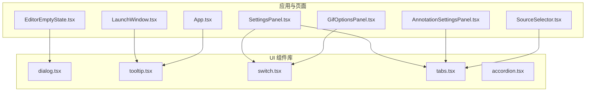
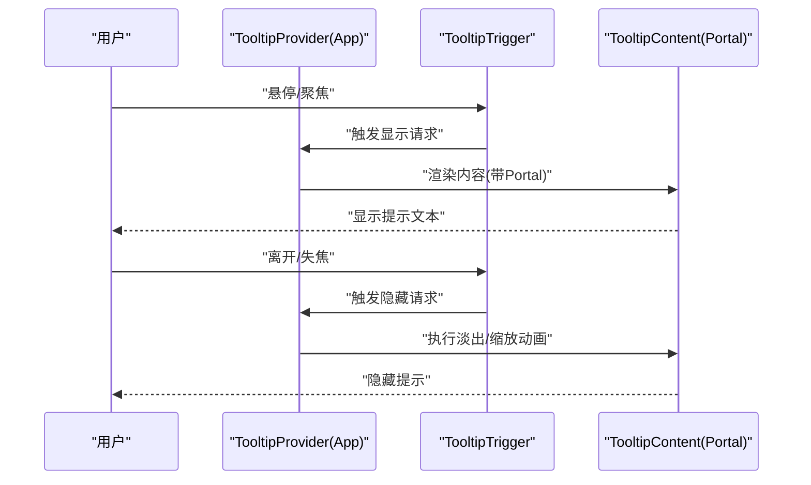
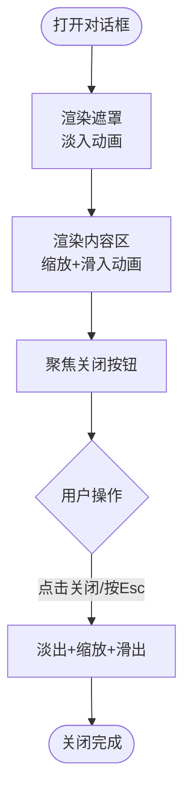
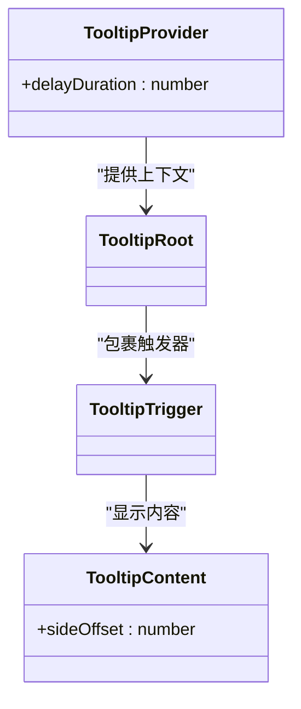
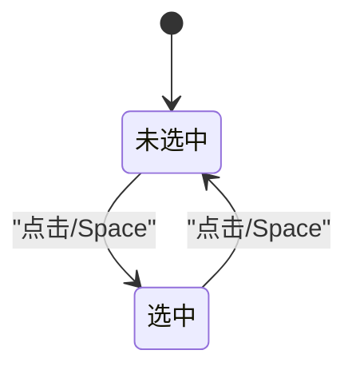
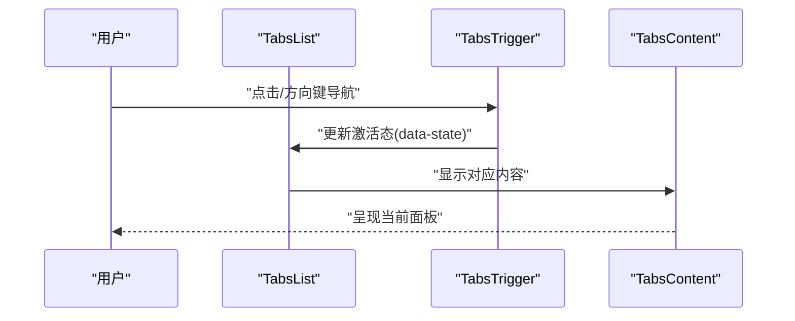
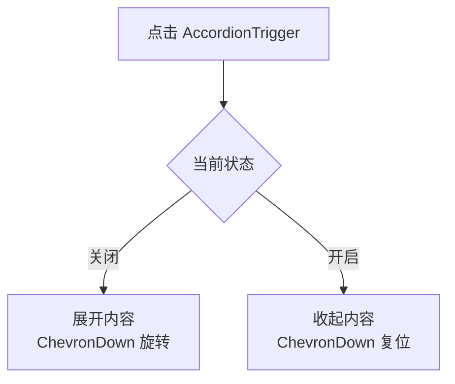
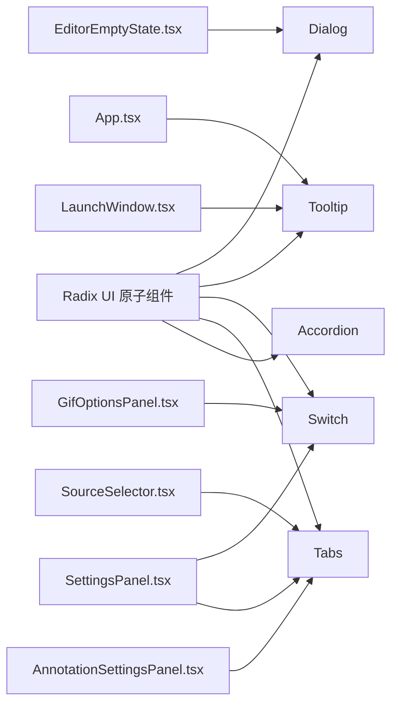

# 反馈组件

<cite>
**本文引用的文件**
- [dialog.tsx](file://src/components/ui/dialog.tsx)
- [tooltip.tsx](file://src/components/ui/tooltip.tsx)
- [switch.tsx](file://src/components/ui/switch.tsx)
- [tabs.tsx](file://src/components/ui/tabs.tsx)
- [accordion.tsx](file://src/components/ui/accordion.tsx)
- [App.tsx](file://src/App.tsx)
- [LaunchWindow.tsx](file://src/components/launch/LaunchWindow.tsx)
- [SourceSelector.tsx](file://src/components/launch/SourceSelector.tsx)
- [AnnotationSettingsPanel.tsx](file://src/components/video-editor/AnnotationSettingsPanel.tsx)
- [EditorEmptyState.tsx](file://src/components/video-editor/EditorEmptyState.tsx)
- [GifOptionsPanel.tsx](file://src/components/video-editor/GifOptionsPanel.tsx)
- [SettingsPanel.tsx](file://src/components/video-editor/SettingsPanel.tsx)
</cite>

## 目录
1. [简介](#简介)
2. [项目结构](#项目结构)
3. [核心组件](#核心组件)
4. [架构总览](#架构总览)
5. [详细组件分析](#详细组件分析)
6. [依赖关系分析](#依赖关系分析)
7. [性能考量](#性能考量)
8. [故障排查指南](#故障排查指南)
9. [结论](#结论)
10. [附录：使用场景与最佳实践](#附录使用场景与最佳实践)

## 简介
本文件系统化梳理 OpenScreen 的反馈类 UI 组件，重点覆盖 Dialog（对话框）、Tooltip（工具提示）、Switch（开关）、Tabs（标签页）与 Accordion（手风琴）。文档从交互设计、实现细节、动画与过渡、可访问性（无障碍）以及常见使用场景出发，帮助开发者在不同业务场景中正确选择与组合这些组件，以提升用户反馈与引导体验。

## 项目结构
这些反馈组件位于统一的 UI 组件库目录下，采用 Radix UI 原子能力进行封装，并结合 Tailwind CSS 实现一致的视觉与交互风格。组件通过 Portal 将内容挂载到文档流之外，确保层级与遮罩逻辑正确；同时提供 Provider、Trigger、Content 等分层结构，便于组合与扩展。

图表来源
- [dialog.tsx:1-103](file://src/components/ui/dialog.tsx#L1-L103)
- [tooltip.tsx:1-71](file://src/components/ui/tooltip.tsx#L1-L71)
- [switch.tsx:1-31](file://src/components/ui/switch.tsx#L1-L31)
- [tabs.tsx:1-54](file://src/components/ui/tabs.tsx#L1-L54)
- [accordion.tsx:1-56](file://src/components/ui/accordion.tsx#L1-L56)
- [App.tsx:1-20](file://src/App.tsx#L1-L20)
- [LaunchWindow.tsx:1-60](file://src/components/launch/LaunchWindow.tsx#L1-L60)
- [SourceSelector.tsx:1-60](file://src/components/launch/SourceSelector.tsx#L1-L60)
- [AnnotationSettingsPanel.tsx:1-60](file://src/components/video-editor/AnnotationSettingsPanel.tsx#L1-L60)
- [EditorEmptyState.tsx:1-40](file://src/components/video-editor/EditorEmptyState.tsx#L1-L40)
- [GifOptionsPanel.tsx:1-40](file://src/components/video-editor/GifOptionsPanel.tsx#L1-L40)
- [SettingsPanel.tsx:1-80](file://src/components/video-editor/SettingsPanel.tsx#L1-L80)

章节来源
- [dialog.tsx:1-103](file://src/components/ui/dialog.tsx#L1-L103)
- [tooltip.tsx:1-71](file://src/components/ui/tooltip.tsx#L1-L71)
- [switch.tsx:1-31](file://src/components/ui/switch.tsx#L1-L31)
- [tabs.tsx:1-54](file://src/components/ui/tabs.tsx#L1-L54)
- [accordion.tsx:1-56](file://src/components/ui/accordion.tsx#L1-L56)

## 核心组件
- 对话框 Dialog：基于 Radix Dialog，提供遮罩层、居中内容区、标题与描述、底部按钮区等结构化布局，并内置淡入/缩放/滑入等入场动画与对应的出场动画。
- 工具提示 Tooltip：基于 Radix Tooltip，提供延迟显示、定位偏移、Portal 挂载、开启动画等能力；封装了 Provider、Root、Trigger、Content 与便捷的 Tooltip 组合组件。
- 开关 Switch：基于 Radix Switch，提供可聚焦、可禁用、状态切换时的拇指位移动画与背景色变化。
- 标签页 Tabs：基于 Radix Tabs，提供列表容器、触发器与内容区，强调激活态样式与键盘可达性。
- 手风琴 Accordion：基于 Radix Accordion，提供项、触发器与内容区，配合 ChevronDown 图标与折叠/展开动画。

章节来源
- [dialog.tsx:15-52](file://src/components/ui/dialog.tsx#L15-L52)
- [tooltip.tsx:6-47](file://src/components/ui/tooltip.tsx#L6-L47)
- [switch.tsx:6-27](file://src/components/ui/switch.tsx#L6-L27)
- [tabs.tsx:8-51](file://src/components/ui/tabs.tsx#L8-L51)
- [accordion.tsx:9-53](file://src/components/ui/accordion.tsx#L9-L53)

## 架构总览
这些组件均以“根组件 + 触发器 + 内容区 + 门户挂载”的模式组织，确保：
- 层级控制：Portal 将内容渲染到文档根部，避免被父级样式或 overflow 遮挡。
- 动画一致性：通过 data-state 属性驱动进入/退出动画，保证与状态同步。
- 可访问性：遵循 Radix 的无障碍约定，如 aria-* 属性、键盘行为与焦点管理。

图表来源
- [tooltip.tsx:6-47](file://src/components/ui/tooltip.tsx#L6-L47)
- [App.tsx:1-20](file://src/App.tsx#L1-L20)

## 详细组件分析

### 对话框 Dialog
- 结构组成
  - Overlay：全屏遮罩，支持打开/关闭动画。
  - Content：居中网格布局，包含标题、描述、正文与关闭按钮。
  - Header/Footer：用于对齐与分组。
- 动画与过渡
  - 使用 data-state 控制入场/出场：fade-in/out、zoom-in/out、slide-in/from、slide-out/to。
  - 过渡时间约 200ms，保证即时反馈与顺滑体验。
- 可访问性
  - 关闭按钮具备聚焦环、键盘可操作与 sr-only 文本，确保屏幕阅读器可读。
- 使用建议
  - 在关键确认、设置面板、错误提示等场景使用；避免阻塞主流程。
  - 合理设置宽度与内容区，避免长列表导致滚动困难。

图表来源
- [dialog.tsx:15-52](file://src/components/ui/dialog.tsx#L15-L52)

章节来源
- [dialog.tsx:1-103](file://src/components/ui/dialog.tsx#L1-L103)
- [EditorEmptyState.tsx:1-40](file://src/components/video-editor/EditorEmptyState.tsx#L1-L40)

### 工具提示 Tooltip
- 结构组成
  - Provider：统一配置延迟时长与全局行为。
  - Root/Trigger/Content：分别负责状态根、触发器与内容渲染。
  - Portal：将内容挂载到文档根部，避免定位受限。
- 动画与过渡
  - 默认延迟约 200ms，入场/出场使用 fade-in/zoom-in 与对应的反向动画。
  - 支持 sideOffset 调整偏移，适配不同布局。
- 可访问性
  - 作为 child 组件使用时，保持原语义标签与事件冒泡；内容区无额外 ARIA 角色，由 Radix 提供默认可访问性。
- 使用建议
  - 适合图标、按钮、快捷键提示等轻量信息；避免过长文本。
  - 在复杂布局中注意 side 与 sideOffset，防止溢出视窗。

图表来源
- [tooltip.tsx:6-47](file://src/components/ui/tooltip.tsx#L6-L47)
- [App.tsx:1-20](file://src/App.tsx#L1-L20)

章节来源
- [tooltip.tsx:1-71](file://src/components/ui/tooltip.tsx#L1-L71)
- [LaunchWindow.tsx:1-60](file://src/components/launch/LaunchWindow.tsx#L1-L60)

### 开关 Switch
- 行为特性
  - 基于 Radix Switch，支持受控/非受控、禁用、聚焦环与键盘切换。
  - 状态变化时，拇指元素平移与背景色切换，提供明确的状态反馈。
- 可访问性
  - 自动处理 aria-checked、键盘 Space/Toggle 与焦点可见轮廓。
- 使用建议
  - 适合二值选项（如启用/禁用某功能），搭配 Tooltip 提供简短说明。

图表来源
- [switch.tsx:6-27](file://src/components/ui/switch.tsx#L6-L27)

章节来源
- [switch.tsx:1-31](file://src/components/ui/switch.tsx#L1-L31)
- [GifOptionsPanel.tsx:1-40](file://src/components/video-editor/GifOptionsPanel.tsx#L1-L40)
- [SettingsPanel.tsx:1-80](file://src/components/video-editor/SettingsPanel.tsx#L1-L80)

### 标签页 Tabs
- 行为特性
  - 列表容器 + 触发器 + 内容区，激活态具有背景、文字颜色与阴影差异。
  - 支持禁用态与聚焦环，键盘可导航至激活项。
- 使用建议
  - 适合设置面板、编辑器侧栏等多区域切换；避免过多标签导致拥挤。

图表来源
- [tabs.tsx:8-51](file://src/components/ui/tabs.tsx#L8-L51)

章节来源
- [tabs.tsx:1-54](file://src/components/ui/tabs.tsx#L1-L54)
- [SourceSelector.tsx:1-60](file://src/components/launch/SourceSelector.tsx#L1-L60)
- [AnnotationSettingsPanel.tsx:1-60](file://src/components/video-editor/AnnotationSettingsPanel.tsx#L1-L60)
- [SettingsPanel.tsx:1-80](file://src/components/video-editor/SettingsPanel.tsx#L1-L80)

### 手风琴 Accordion
- 行为特性
  - 项、触发器与内容区组合；触发器内含 ChevronDown，开启时旋转 180°。
  - 内容区使用 data-state 控制折叠/展开动画，提供上/下方向的显隐过渡。
- 使用建议
  - 适合设置面板、FAQ、分组信息等需要逐步展开的场景。

图表来源
- [accordion.tsx:21-53](file://src/components/ui/accordion.tsx#L21-L53)

章节来源
- [accordion.tsx:1-56](file://src/components/ui/accordion.tsx#L1-L56)

## 依赖关系分析
- 组件间耦合度低，均基于 Radix UI 原子组件，通过 forwardRef 与 Portal 解耦 DOM 层级。
- 应用层仅在根部提供 TooltipProvider，其余页面按需使用 Tooltip 组合组件。
- Dialog 与 Tooltip 通过 Portal 渲染，避免被父级容器裁剪或层级不足。

图表来源
- [dialog.tsx:1-103](file://src/components/ui/dialog.tsx#L1-L103)
- [tooltip.tsx:1-71](file://src/components/ui/tooltip.tsx#L1-L71)
- [switch.tsx:1-31](file://src/components/ui/switch.tsx#L1-L31)
- [tabs.tsx:1-54](file://src/components/ui/tabs.tsx#L1-L54)
- [accordion.tsx:1-56](file://src/components/ui/accordion.tsx#L1-L56)
- [App.tsx:1-20](file://src/App.tsx#L1-L20)
- [LaunchWindow.tsx:1-60](file://src/components/launch/LaunchWindow.tsx#L1-L60)
- [SourceSelector.tsx:1-60](file://src/components/launch/SourceSelector.tsx#L1-L60)
- [AnnotationSettingsPanel.tsx:1-60](file://src/components/video-editor/AnnotationSettingsPanel.tsx#L1-L60)
- [EditorEmptyState.tsx:1-40](file://src/components/video-editor/EditorEmptyState.tsx#L1-L40)
- [GifOptionsPanel.tsx:1-40](file://src/components/video-editor/GifOptionsPanel.tsx#L1-L40)
- [SettingsPanel.tsx:1-80](file://src/components/video-editor/SettingsPanel.tsx#L1-L80)

## 性能考量
- 动画与过渡
  - Dialog 与 Tooltip 使用较短的入场/出场动画（约 200ms），减少感知延迟。
  - Accordion 使用 data-state 驱动的 CSS 动画，避免 JS 计算开销。
- 渲染策略
  - Portal 将内容挂载至文档根部，降低层级与 z-index 管理成本。
  - Switch 与 Tabs 的状态切换为纯 CSS，避免重排抖动。
- 建议
  - 避免在大量 Tooltip 中同时出现；必要时合并为分组提示。
  - 对频繁切换的 Tabs/Dialog，尽量复用内容区，减少重新挂载。

## 故障排查指南
- Tooltip 不显示
  - 确认已在应用根部包裹 TooltipProvider，并检查 delayDuration 是否过大。
  - 确认 TooltipTrigger 为子节点且未被禁用。
- 对话框无法关闭
  - 检查是否正确使用 DialogTrigger/DialogClose；确认键盘 Esc 事件未被上层拦截。
  - 确保 Overlay 与 Content 的 Portal 挂载正常，z-index 充足。
- 开关状态不生效
  - 确认受控模式下传入 checked 与 onChange；检查禁用态样式。
- 标签页切换无效
  - 确认 TabsTrigger 的 value 与 TabsContent 的 value 匹配；检查禁用态。
- 手风琴图标不旋转
  - 检查触发器内的 ChevronDown 是否被外部样式覆盖；确认 data-state 正常更新。

章节来源
- [tooltip.tsx:6-47](file://src/components/ui/tooltip.tsx#L6-L47)
- [dialog.tsx:15-52](file://src/components/ui/dialog.tsx#L15-L52)
- [switch.tsx:6-27](file://src/components/ui/switch.tsx#L6-L27)
- [tabs.tsx:8-51](file://src/components/ui/tabs.tsx#L8-L51)
- [accordion.tsx:21-53](file://src/components/ui/accordion.tsx#L21-L53)

## 结论
上述反馈组件以 Radix UI 为基础，结合 Portal 与数据属性驱动的动画，提供了高可访问性与一致性的交互体验。Dialog 适用于重要信息与确认流程；Tooltip 用于轻量提示；Switch 用于二值状态切换；Tabs 与 Accordion 用于信息分组与层级展开。合理组合这些组件，可在不同场景中实现清晰的状态反馈与顺畅的用户引导。

## 附录：使用场景与最佳实践
- 场景一：导出前确认
  - 使用 Dialog 弹出确认窗口，包含标题、描述与确认/取消按钮，确保用户明确操作后果。
  - 参考路径：[EditorEmptyState.tsx:1-40](file://src/components/video-editor/EditorEmptyState.tsx#L1-L40)
- 场景二：功能开关引导
  - 在设置面板中使用 Switch，并搭配 Tooltip 提供简短说明，避免冗长文案。
  - 参考路径：[GifOptionsPanel.tsx:1-40](file://src/components/video-editor/GifOptionsPanel.tsx#L1-L40)、[SettingsPanel.tsx:1-80](file://src/components/video-editor/SettingsPanel.tsx#L1-L80)
- 场景三：多面板设置
  - 使用 Tabs 分类管理设置项，激活态突出当前面板，减少认知负担。
  - 参考路径：[SourceSelector.tsx:1-60](file://src/components/launch/SourceSelector.tsx#L1-L60)、[AnnotationSettingsPanel.tsx:1-60](file://src/components/video-editor/AnnotationSettingsPanel.tsx#L1-L60)、[SettingsPanel.tsx:1-80](file://src/components/video-editor/SettingsPanel.tsx#L1-L80)
- 场景四：分组信息展开
  - 使用 Accordion 展示分组详情，图标旋转提供明确状态反馈。
  - 参考路径：[accordion.tsx:1-56](file://src/components/ui/accordion.tsx#L1-L56)