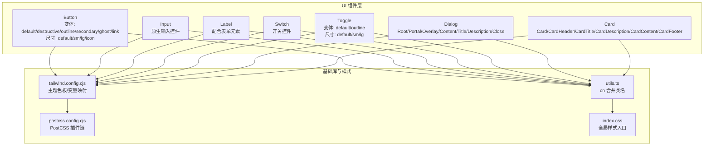
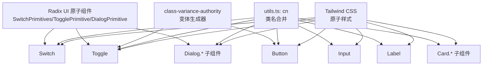
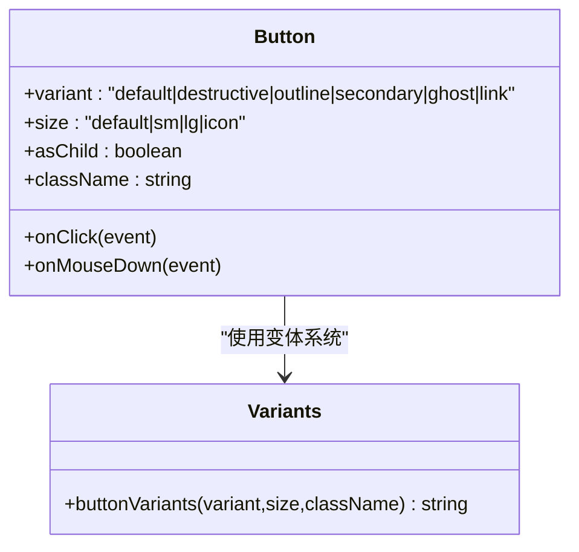
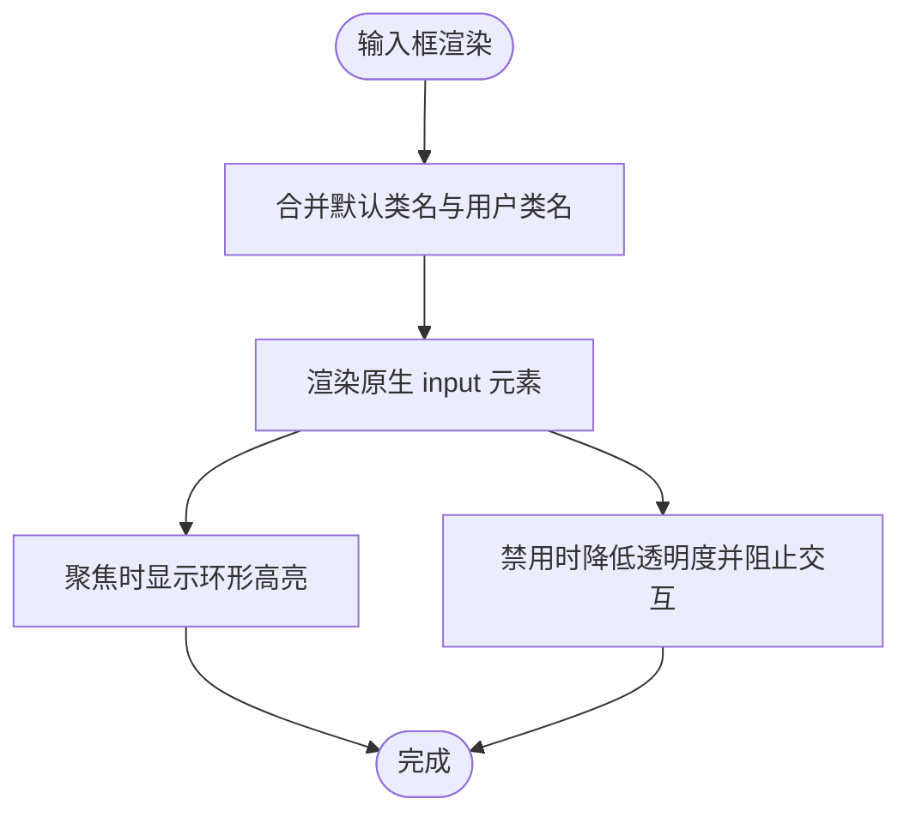
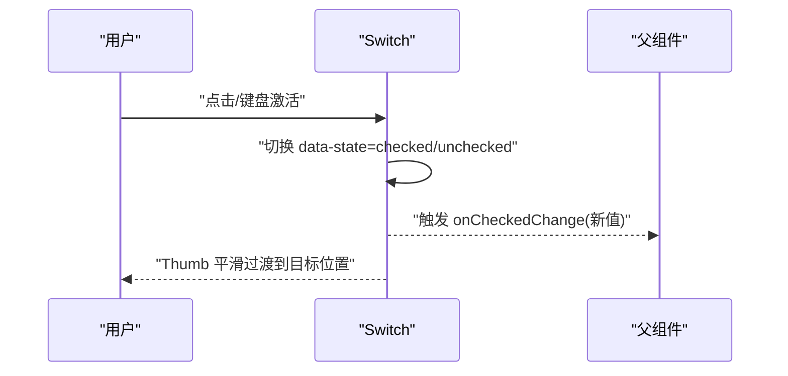
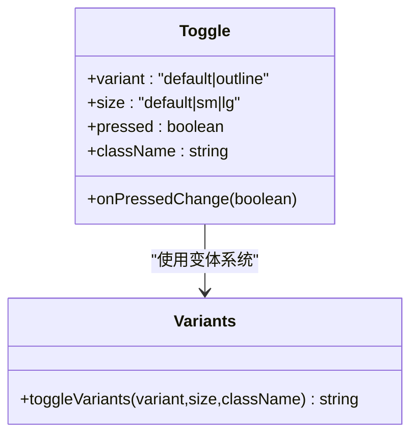
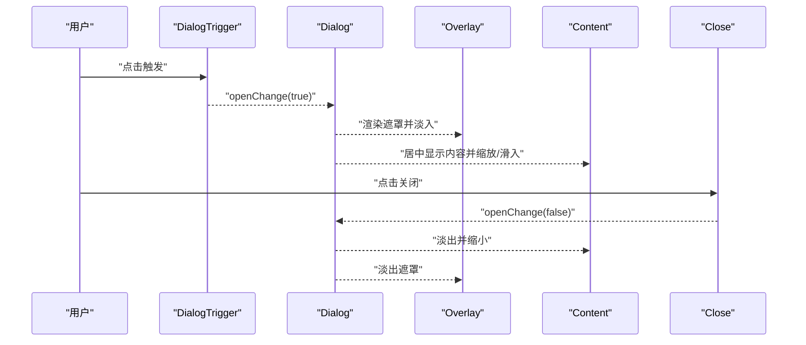
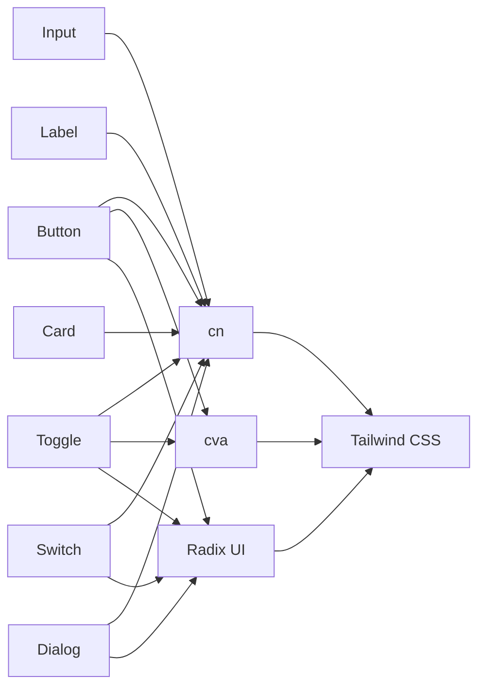

# 基础组件

<cite>
**本文引用的文件**
- [button.tsx](file://src/components/ui/button.tsx)
- [input.tsx](file://src/components/ui/input.tsx)
- [label.tsx](file://src/components/ui/label.tsx)
- [switch.tsx](file://src/components/ui/switch.tsx)
- [toggle.tsx](file://src/components/ui/toggle.tsx)
- [dialog.tsx](file://src/components/ui/dialog.tsx)
- [card.tsx](file://src/components/ui/card.tsx)
- [utils.ts](file://src/lib/utils.ts)
- [tailwind.config.cjs](file://tailwind.config.cjs)
- [postcss.config.cjs](file://postcss.config.cjs)
- [index.css](file://src/index.css)
</cite>

## 目录
1. [简介](#简介)
2. [项目结构](#项目结构)
3. [核心组件](#核心组件)
4. [架构总览](#架构总览)
5. [组件详解](#组件详解)
6. [依赖关系分析](#依赖关系分析)
7. [性能与可访问性](#性能与可访问性)
8. [样式与主题定制](#样式与主题定制)
9. [故障排查](#故障排查)
10. [结论](#结论)
11. [附录：常用用法与示例路径](#附录常用用法与示例路径)

## 简介
本文件聚焦于 OpenScreen 的基础 UI 组件，系统梳理 Button、Input、Label、Switch、Toggle 等核心组件的实现原理、接口设计、事件与状态管理、可访问性（ARIA、键盘导航、屏幕阅读器）、样式与 Tailwind 集成、响应式与动画、以及性能优化建议。文档同时给出与组件配套的 Dialog、Card 等常用容器组件的参考，帮助读者在实际工程中正确、安全地组合使用。

## 项目结构
OpenScreen 的基础 UI 组件位于 src/components/ui 下，采用“按需导出 + 变体系统”的组织方式，结合 Radix UI 原子能力与 class-variance-authority 提供的变体能力，形成一致的外观与交互风格。工具函数 cn 负责类名合并，Tailwind CSS 提供原子化样式，PostCSS 与 Tailwind 配置确保构建期样式生成。

图表来源
- [button.tsx:1-51](file://src/components/ui/button.tsx#L1-L51)
- [input.tsx:1-24](file://src/components/ui/input.tsx#L1-L24)
- [label.tsx:1-21](file://src/components/ui/label.tsx#L1-L21)
- [switch.tsx:1-31](file://src/components/ui/switch.tsx#L1-L31)
- [toggle.tsx:1-44](file://src/components/ui/toggle.tsx#L1-L44)
- [dialog.tsx:1-103](file://src/components/ui/dialog.tsx#L1-L103)
- [card.tsx:1-56](file://src/components/ui/card.tsx#L1-L56)
- [utils.ts](file://src/lib/utils.ts)
- [tailwind.config.cjs](file://tailwind.config.cjs)
- [postcss.config.cjs](file://postcss.config.cjs)
- [index.css](file://src/index.css)

章节来源
- [button.tsx:1-51](file://src/components/ui/button.tsx#L1-L51)
- [input.tsx:1-24](file://src/components/ui/input.tsx#L1-L24)
- [label.tsx:1-21](file://src/components/ui/label.tsx#L1-L21)
- [switch.tsx:1-31](file://src/components/ui/switch.tsx#L1-L31)
- [toggle.tsx:1-44](file://src/components/ui/toggle.tsx#L1-L44)
- [dialog.tsx:1-103](file://src/components/ui/dialog.tsx#L1-L103)
- [card.tsx:1-56](file://src/components/ui/card.tsx#L1-L56)
- [utils.ts](file://src/lib/utils.ts)
- [tailwind.config.cjs](file://tailwind.config.cjs)
- [postcss.config.cjs](file://postcss.config.cjs)
- [index.css](file://src/index.css)

## 核心组件
- Button：支持多种变体与尺寸，可通过 asChild 渲染为任意元素；具备焦点可见环、禁用态、图标嵌套等通用行为。
- Input：原生输入控件封装，统一边框、背景、占位符、聚焦环、禁用态等视觉与交互。
- Label：用于表单标签，与表单控件配合时可利用 peer 选择器实现联动样式。
- Switch：基于 Radix UI Switch 的开关控件，内置状态类名与过渡动画，支持数据属性驱动的样式切换。
- Toggle：基于 Radix UI Toggle 的可选中按钮，支持变体与尺寸，具备焦点环与禁用态。
- Dialog：模态对话框容器，包含 Overlay、Content、Portal、Close 等子组件，提供开合动画与无障碍关闭按钮。
- Card：卡片容器系列，包含 Header、Title、Description、Content、Footer 等语义化子组件。

章节来源
- [button.tsx:34-50](file://src/components/ui/button.tsx#L34-L50)
- [input.tsx:4-23](file://src/components/ui/input.tsx#L4-L23)
- [label.tsx:4-20](file://src/components/ui/label.tsx#L4-L20)
- [switch.tsx:6-30](file://src/components/ui/switch.tsx#L6-L30)
- [toggle.tsx:30-43](file://src/components/ui/toggle.tsx#L30-L43)
- [dialog.tsx:7-102](file://src/components/ui/dialog.tsx#L7-L102)
- [card.tsx:5-55](file://src/components/ui/card.tsx#L5-L55)

## 架构总览
组件层通过 Radix UI 提供可访问性与状态管理，class-variance-authority 提供变体系统，utils.ts 的 cn 负责类名合并，Tailwind 提供原子化样式。Dialog 与 Card 属于复合组件，由多个子组件协作完成复杂 UI 场景。

图表来源
- [button.tsx:7-32](file://src/components/ui/button.tsx#L7-L32)
- [toggle.tsx:9-28](file://src/components/ui/toggle.tsx#L9-L28)
- [switch.tsx:1-31](file://src/components/ui/switch.tsx#L1-L31)
- [dialog.tsx:1-103](file://src/components/ui/dialog.tsx#L1-L103)
- [card.tsx:1-56](file://src/components/ui/card.tsx#L1-L56)
- [utils.ts](file://src/lib/utils.ts)
- [tailwind.config.cjs](file://tailwind.config.cjs)

## 组件详解

### Button（按钮）
- 接口与特性
  - 支持变体：default、destructive、outline、secondary、ghost、link
  - 支持尺寸：default、sm、lg、icon
  - 支持 asChild：将渲染节点替换为任意元素（如链接）
  - 焦点可见环：focus-visible:ring-1
  - 禁用态：disabled:pointer-events-none 与 disabled:opacity-50
  - 图标嵌套：_svg 指向内部 svg，自动禁用指针事件、限定尺寸与收缩
- 状态与事件
  - 使用原生 button 行为，支持 onClick、onMouseDown 等原生事件
  - 焦点管理与键盘激活由浏览器默认行为处理
- 可访问性
  - 默认 button 元素具备 ARIA 角色与键盘激活语义
  - 建议在图标按钮场景提供文本替代（aria-label 或 sr-only 文本）
- 样式与主题
  - 通过变体系统与 Tailwind 类组合，颜色与阴影由主题变量控制
  - 可通过 className 扩展或覆盖默认样式
- 复杂度与性能
  - 渲染为原生 button，无额外状态，性能开销极低
  - 变体计算在运行时进行，通常可忽略不计

图表来源
- [button.tsx:34-50](file://src/components/ui/button.tsx#L34-L50)
- [button.tsx:7-32](file://src/components/ui/button.tsx#L7-L32)

章节来源
- [button.tsx:34-50](file://src/components/ui/button.tsx#L34-L50)
- [button.tsx:7-32](file://src/components/ui/button.tsx#L7-L32)

### Input（输入框）
- 接口与特性
  - 继承原生 input 的所有 HTML 属性
  - 统一边框、背景、内边距、占位符、聚焦环、禁用态
  - 支持文件上传、多行文本等原生类型
- 状态与事件
  - onChange、onBlur、onFocus 等原生事件
  - 焦点可见环与禁用态由样式控制
- 可访问性
  - 原生 input 元素具备可访问语义
  - 建议与 Label 配合使用，通过 for/label 关联
- 样式与主题
  - 通过 Tailwind 类统一风格，颜色与边框由主题变量控制
- 复杂度与性能
  - 无状态组件，纯渲染，性能优异

图表来源
- [input.tsx:6-23](file://src/components/ui/input.tsx#L6-L23)

章节来源
- [input.tsx:4-23](file://src/components/ui/input.tsx#L4-L23)

### Label（标签）
- 接口与特性
  - 继承原生 label 的所有 HTML 属性
  - 与表单控件配合时，可利用 peer 选择器实现联动样式（例如 peer-disabled）
- 状态与事件
  - 点击 label 可激活关联的控件
- 可访问性
  - 原生 label 元素具备可访问语义
  - 建议与 Input/Select 等控件建立 for/id 关联
- 样式与主题
  - 字体大小、字重、行高与禁用态由主题变量控制
- 复杂度与性能
  - 无状态组件，纯渲染，性能优异

章节来源
- [label.tsx:4-20](file://src/components/ui/label.tsx#L4-L20)

### Switch（开关）
- 接口与特性
  - 基于 Radix UI Switch Root 与 Thumb
  - 内置状态类名：data-state=checked / unchecked
  - 过渡动画：thumb 的 translate-x 切换
  - 自定义颜色：通过 data-state 与背景色变量控制
- 状态与事件
  - onCheckedChange：布尔值切换回调
  - 焦点可见环与禁用态由样式控制
- 可访问性
  - 原生可访问语义，支持键盘激活与屏幕阅读器识别
- 样式与主题
  - 使用 data-state 与 Tailwind 类组合，颜色与过渡由主题变量控制
- 复杂度与性能
  - 无额外状态，性能开销极低

图表来源
- [switch.tsx:6-30](file://src/components/ui/switch.tsx#L6-L30)

章节来源
- [switch.tsx:6-30](file://src/components/ui/switch.tsx#L6-L30)

### Toggle（可选中按钮）
- 接口与特性
  - 支持变体：default、outline
  - 支持尺寸：default、sm、lg
  - 内置状态类名：data-state=on
  - 焦点可见环与禁用态由样式控制
- 状态与事件
  - onPressedChange：布尔值切换回调
  - 焦点管理与键盘激活由 Radix UI 提供
- 可访问性
  - 原生可访问语义，支持键盘激活
- 样式与主题
  - 通过变体系统与 Tailwind 类组合
- 复杂度与性能
  - 无额外状态，性能开销极低

图表来源
- [toggle.tsx:30-43](file://src/components/ui/toggle.tsx#L30-L43)
- [toggle.tsx:9-28](file://src/components/ui/toggle.tsx#L9-L28)

章节来源
- [toggle.tsx:30-43](file://src/components/ui/toggle.tsx#L30-L43)
- [toggle.tsx:9-28](file://src/components/ui/toggle.tsx#L9-L28)

### Dialog（对话框）
- 组件族
  - Root、Trigger、Portal、Overlay、Content、Close、Header、Footer、Title、Description
- 特性
  - Portal 将内容挂载至 Portal 容器，避免层级问题
  - Overlay 提供遮罩与动画进入/退出
  - Content 居中布局，支持开合动画与缩放/滑入/淡入等动效
  - Close 内置关闭按钮与 sr-only 文本，提升可访问性
- 状态与事件
  - openChange：打开/关闭状态变化
  - 焦点陷阱与回退：首次聚焦到可聚焦元素，Esc 关闭
- 可访问性
  - 自动设置 aria-modal、aria-labelledby、aria-describedby
  - 关闭按钮具备可读名称
- 样式与主题
  - 动画类名与尺寸约束由 Tailwind 控制
- 复杂度与性能
  - 复合组件，但渲染树较浅，性能可控

图表来源
- [dialog.tsx:7-102](file://src/components/ui/dialog.tsx#L7-L102)

章节来源
- [dialog.tsx:7-102](file://src/components/ui/dialog.tsx#L7-L102)

### Card（卡片）
- 组件族
  - Card、CardHeader、CardTitle、CardDescription、CardContent、CardFooter
- 特性
  - 语义化分块，便于布局与样式复用
  - Footer 支持水平排列与对齐
- 样式与主题
  - 边框、背景、阴影、文字色由主题变量控制
- 复杂度与性能
  - 无状态组件，纯渲染，性能优异

章节来源
- [card.tsx:5-55](file://src/components/ui/card.tsx#L5-L55)

## 依赖关系分析
- 组件依赖
  - Button、Input、Label、Toggle 使用 utils.ts 的 cn 合并类名
  - Button、Toggle 使用 class-variance-authority 的变体系统
  - Switch、Toggle、Dialog 基于 Radix UI 原子组件
- 样式依赖
  - Tailwind CSS 提供原子类，tailwind.config.cjs 定义主题变量
  - PostCSS 通过 postcss.config.cjs 处理构建链
  - index.css 作为全局样式入口

图表来源
- [button.tsx:1-6](file://src/components/ui/button.tsx#L1-L6)
- [toggle.tsx:1-8](file://src/components/ui/toggle.tsx#L1-L8)
- [switch.tsx:1-5](file://src/components/ui/switch.tsx#L1-L5)
- [dialog.tsx:1-6](file://src/components/ui/dialog.tsx#L1-L6)
- [card.tsx:1-4](file://src/components/ui/card.tsx#L1-L4)
- [utils.ts](file://src/lib/utils.ts)
- [tailwind.config.cjs](file://tailwind.config.cjs)
- [postcss.config.cjs](file://postcss.config.cjs)

章节来源
- [button.tsx:1-6](file://src/components/ui/button.tsx#L1-L6)
- [toggle.tsx:1-8](file://src/components/ui/toggle.tsx#L1-L8)
- [switch.tsx:1-5](file://src/components/ui/switch.tsx#L1-L5)
- [dialog.tsx:1-6](file://src/components/ui/dialog.tsx#L1-L6)
- [card.tsx:1-4](file://src/components/ui/card.tsx#L1-L4)
- [utils.ts](file://src/lib/utils.ts)
- [tailwind.config.cjs](file://tailwind.config.cjs)
- [postcss.config.cjs](file://postcss.config.cjs)

## 性能与可访问性
- 性能
  - 以上组件均为轻量级无状态组件，渲染成本低
  - 变体系统在运行时计算，通常可忽略；如需极致性能，可在构建期固定类名
  - 动画通过 CSS 过渡与 Tailwind 动画类实现，避免 JavaScript 动画
- 可访问性
  - Switch、Toggle、Dialog、Button 等均基于原生语义或 Radix UI 提供的可访问性能力
  - 建议始终为图标按钮提供文本替代（aria-label 或 sr-only 文本）
  - 与 Label 配合使用，确保屏幕阅读器正确朗读

## 样式与主题定制
- Tailwind 主题
  - 通过 tailwind.config.cjs 定义颜色、字体、间距等主题变量
  - 组件类名中大量使用 bg-*、text-*、border-*、shadow-* 等原子类
- CSS 变量与主题映射
  - 组件内部使用 data-state 与颜色变量组合，实现状态驱动的主题切换
  - 可通过自定义 Tailwind 主题扩展更多变体或尺寸
- 动画与响应式
  - Dialog 使用 data-[state=open/closed] 与动画类实现进入/退出动效
  - 响应式断点通过 Tailwind 断点类控制（sm:、md: 等）

章节来源
- [tailwind.config.cjs](file://tailwind.config.cjs)
- [postcss.config.cjs](file://postcss.config.cjs)
- [index.css](file://src/index.css)
- [dialog.tsx:38-50](file://src/components/ui/dialog.tsx#L38-L50)
- [switch.tsx:11-25](file://src/components/ui/switch.tsx#L11-L25)

## 故障排查
- 焦点环与键盘导航
  - 若发现焦点环缺失，检查是否正确引入全局样式与 Tailwind 配置
  - 确保 Dialog 中首次聚焦元素可聚焦（如按钮或可编辑元素）
- 禁用态无效
  - 确认禁用类名是否被覆盖；必要时通过 className 显式传入禁用类
- 动画异常
  - 检查 data-[state=*] 是否正确传递；确认 Tailwind 动画类未被移除
- 可访问性问题
  - 为图标按钮添加 aria-label 或 sr-only 文本
  - 确保 Dialog 的标题与描述存在对应 ID 关联

## 结论
OpenScreen 的基础 UI 组件以 Radix UI 为基础，结合 class-variance-authority 与 Tailwind 原子类，实现了高一致性、可扩展、可访问的组件体系。Button、Input、Label、Switch、Toggle 等组件在保持简洁的同时，提供了足够的定制空间与良好的性能表现。Dialog 与 Card 等复合组件进一步完善了常见交互场景的实现。建议在实际项目中遵循组件约定的 props 与事件模型，并结合 Tailwind 主题进行样式扩展。

## 附录：常用用法与示例路径
- 基本按钮
  - [Button 示例路径:34-50](file://src/components/ui/button.tsx#L34-L50)
- 图标按钮与 asChild
  - [Button 变体与 asChild:7-32](file://src/components/ui/button.tsx#L7-L32)
- 输入框与禁用态
  - [Input 基本用法:6-23](file://src/components/ui/input.tsx#L6-L23)
- 标签与表单联动
  - [Label 基本用法:6-17](file://src/components/ui/label.tsx#L6-L17)
- 开关与受控状态
  - [Switch 受控切换:6-30](file://src/components/ui/switch.tsx#L6-L30)
- 可选中按钮
  - [Toggle 变体与尺寸:9-28](file://src/components/ui/toggle.tsx#L9-L28)
- 对话框与无障碍
  - [Dialog 容器与关闭按钮:30-52](file://src/components/ui/dialog.tsx#L30-L52)
- 卡片容器
  - [Card 组件族:5-55](file://src/components/ui/card.tsx#L5-L55)
- 类名合并工具
  - [cn 工具函数](file://src/lib/utils.ts)
- Tailwind 主题与构建
  - [Tailwind 配置](file://tailwind.config.cjs)
  - [PostCSS 配置](file://postcss.config.cjs)
  - [全局样式入口](file://src/index.css)