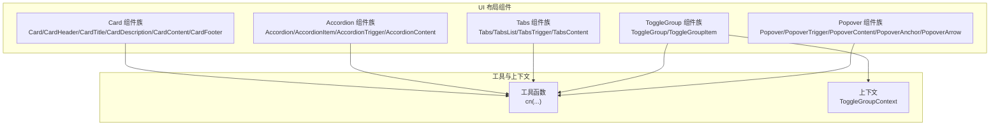
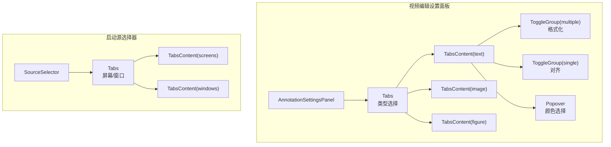
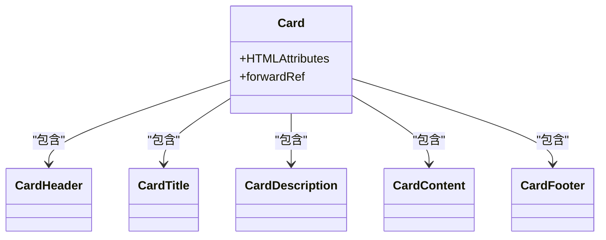
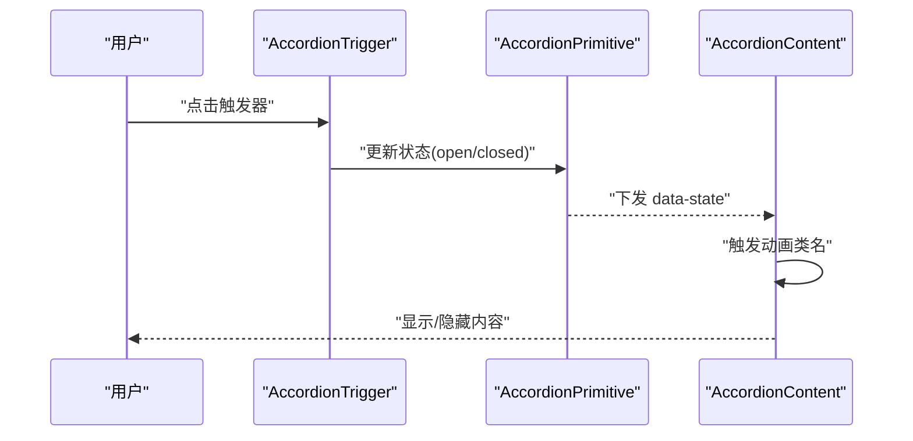
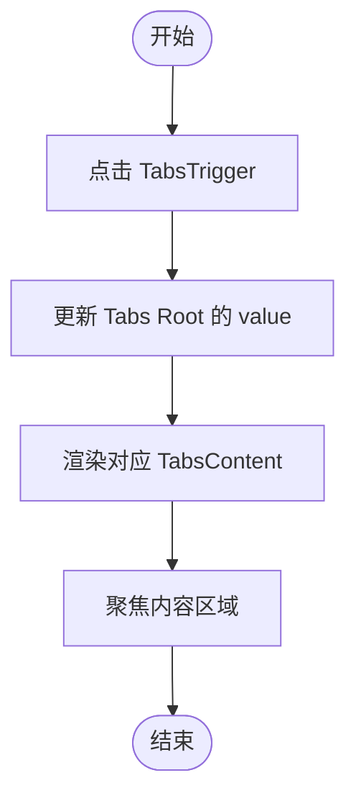
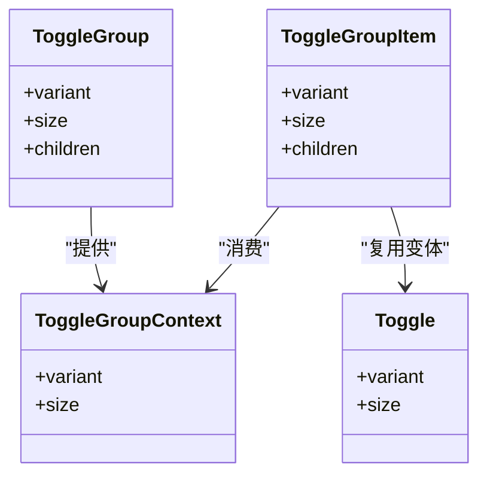
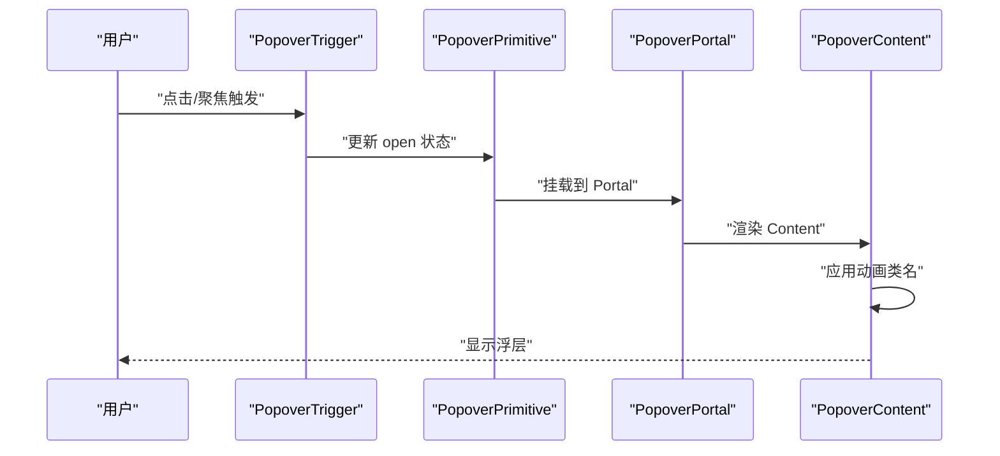
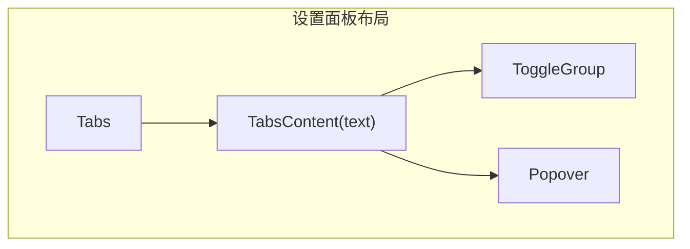
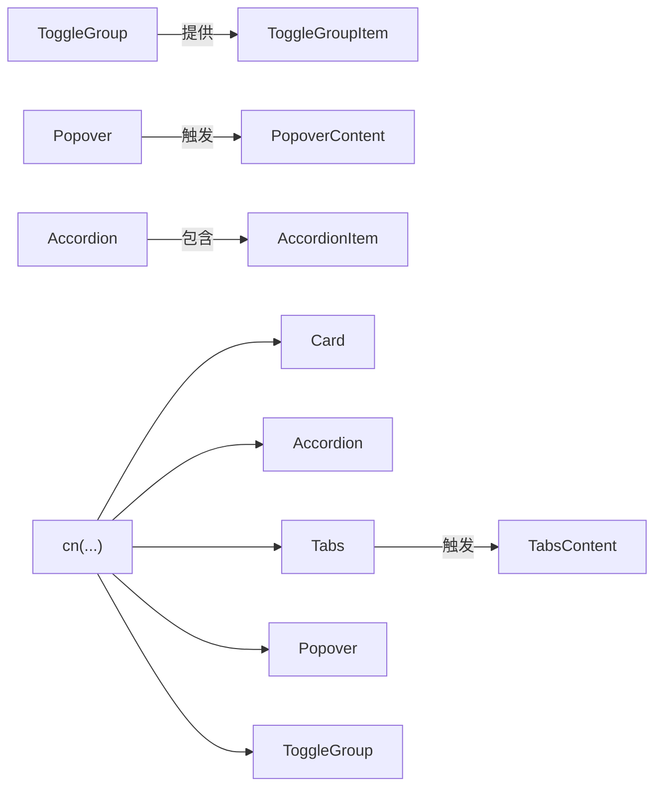

# 布局组件

<cite>
**本文引用的文件**
- [card.tsx](file://src/components/ui/card.tsx)
- [accordion.tsx](file://src/components/ui/accordion.tsx)
- [tabs.tsx](file://src/components/ui/tabs.tsx)
- [toggle-group.tsx](file://src/components/ui/toggle-group.tsx)
- [toggle.tsx](file://src/components/ui/toggle.tsx)
- [popover.tsx](file://src/components/ui/popover.tsx)
- [utils.ts](file://src/lib/utils.ts)
- [AnnotationSettingsPanel.tsx](file://src/components/video-editor/AnnotationSettingsPanel.tsx)
- [SourceSelector.tsx](file://src/components/launch/SourceSelector.tsx)
</cite>

## 目录
1. [简介](#简介)
2. [项目结构](#项目结构)
3. [核心组件](#核心组件)
4. [架构总览](#架构总览)
5. [详细组件分析](#详细组件分析)
6. [依赖关系分析](#依赖关系分析)
7. [性能考量](#性能考量)
8. [故障排查指南](#故障排查指南)
9. [结论](#结论)
10. [附录](#附录)

## 简介
本文件面向 OpenScreen 的布局组件，系统性梳理 Card、Accordion、Tabs、ToggleGroup、Popover 等 UI 组件的设计理念、实现细节与最佳实践。重点覆盖以下方面：
- 布局逻辑与状态管理：如何通过组合与上下文实现灵活的状态同步与切换。
- 交互行为与动画过渡：展开/收起、标签页切换、弹出层显示隐藏的视觉与动效。
- 嵌套使用与响应式布局：在复杂编辑器面板与启动选择器中如何协同工作。
- 内容管理机制：如何在组件内部与外部之间传递与更新数据。
- 可访问性与键盘操作：焦点管理、ARIA 属性与屏幕阅读器支持。
- 实际应用场景：结合视频编辑设置面板与启动源选择器，展示多组件组合的实战用法。

## 项目结构
OpenScreen 的 UI 布局组件位于 src/components/ui 下，采用“原子化组件 + 组合容器”的分层设计：
- 卡片体系：Card、CardHeader、CardTitle、CardDescription、CardContent、CardFooter 提供统一的卡片容器与内容分区。
- 折叠面板：AccordionRoot、AccordionItem、AccordionTrigger、AccordionContent 提供可折叠的内容区块。
- 标签页：TabsRoot、TabsList、TabsTrigger、TabsContent 提供标签页切换与内容区隔离。
- 切换组：ToggleGroup、ToggleGroupItem 提供互斥或非互斥的按钮组切换。
- 弹出层：Popover、PopoverTrigger、PopoverContent、PopoverAnchor、PopoverArrow 提供弹出式浮层与箭头定位。
- 工具函数：cn 聚合类名合并，确保 Tailwind 与条件类名的正确叠加。

图表来源
- [card.tsx:1-56](file://src/components/ui/card.tsx#L1-L56)
- [accordion.tsx:1-56](file://src/components/ui/accordion.tsx#L1-L56)
- [tabs.tsx:1-54](file://src/components/ui/tabs.tsx#L1-L54)
- [toggle-group.tsx:1-57](file://src/components/ui/toggle-group.tsx#L1-L57)
- [toggle.tsx:1-44](file://src/components/ui/toggle.tsx#L1-L44)
- [popover.tsx:1-61](file://src/components/ui/popover.tsx#L1-L61)
- [utils.ts:1-7](file://src/lib/utils.ts#L1-L7)

章节来源
- [card.tsx:1-56](file://src/components/ui/card.tsx#L1-L56)
- [accordion.tsx:1-56](file://src/components/ui/accordion.tsx#L1-L56)
- [tabs.tsx:1-54](file://src/components/ui/tabs.tsx#L1-L54)
- [toggle-group.tsx:1-57](file://src/components/ui/toggle-group.tsx#L1-L57)
- [toggle.tsx:1-44](file://src/components/ui/toggle.tsx#L1-L44)
- [popover.tsx:1-61](file://src/components/ui/popover.tsx#L1-L61)
- [utils.ts:1-7](file://src/lib/utils.ts#L1-L7)

## 核心组件
本节从设计理念、实现要点与使用建议三个维度，对五个布局组件进行概览式解析。

- Card（卡片）
  - 设计理念：以语义化分区承载标题、描述、正文与底部操作，强调层级与留白。
  - 实现要点：通过 forwardRef 暴露 DOM 引用；使用 cn 合并基础样式与传入类名；各子组件职责清晰，避免重复渲染。
  - 使用建议：配合 Grid 或 Flex 构建信息卡片网格；在设置面板中作为独立配置块使用。

- Accordion（折叠面板）
  - 设计理念：将长列表或复杂设置按主题拆分为可折叠区块，减少初始信息密度。
  - 实现要点：基于 Radix UI 的受控状态；触发器内置 ChevronDown 图标与旋转动画；内容区使用 data-[state=open/closed] 驱动收放动画。
  - 使用建议：适合“高级设置”“导出选项”等需要逐步展开的场景。

- Tabs（标签页）
  - 设计理念：在同一容器内切换不同视图，保持页面上下文不变。
  - 实现要点：TabsList 承载触发器集合；TabsTrigger 通过 data-[state=active] 控制激活态；TabsContent 仅渲染当前激活项。
  - 使用建议：在设置面板中区分“文本”“图片”“图形”三类注释配置；在启动器中区分“屏幕”“窗口”。

- ToggleGroup（切换组）
  - 设计理念：提供一组互斥或非互斥的开关按钮，常用于格式化、对齐、样式切换。
  - 实现要点：ToggleGroupContext 传递 variant/size；ToggleGroupItem 优先使用上下文值，允许局部覆盖；与 Toggle 组件共享变体体系。
  - 使用建议：在文本注释面板中提供加粗/斜体/下划线与对齐方式的组合切换。

- Popover（弹出层）
  - 设计理念：在不改变页面结构的前提下，提供临时性的浮层交互（颜色选择器、菜单等）。
  - 实现要点：Portal 将内容挂载到 Portal 中；Content 支持 align、sideOffset 与动画属性；Arrow 提供方向指示。
  - 使用建议：与 Trigger 组合实现“点击触发、悬停保持”的交互模式；注意避免与滚动容器冲突导致位置异常。

章节来源
- [card.tsx:1-56](file://src/components/ui/card.tsx#L1-L56)
- [accordion.tsx:1-56](file://src/components/ui/accordion.tsx#L1-L56)
- [tabs.tsx:1-54](file://src/components/ui/tabs.tsx#L1-L54)
- [toggle-group.tsx:1-57](file://src/components/ui/toggle-group.tsx#L1-L57)
- [toggle.tsx:1-44](file://src/components/ui/toggle.tsx#L1-L44)
- [popover.tsx:1-61](file://src/components/ui/popover.tsx#L1-L61)

## 架构总览
下图展示了布局组件在应用中的典型协作关系：设置面板与启动器分别以 Tabs 为核心组织内容，结合 Accordion、ToggleGroup、Popover 完成复杂交互。

图表来源
- [AnnotationSettingsPanel.tsx:182-646](file://src/components/video-editor/AnnotationSettingsPanel.tsx#L182-L646)
- [SourceSelector.tsx:147-181](file://src/components/launch/SourceSelector.tsx#L147-L181)

## 详细组件分析

### Card 组件族
- 设计与布局
  - CardHeader/CardFooter 用于分区留白与对齐；CardTitle/CardDescription 提供语义化标题与说明；CardContent 作为主内容区，支持上边距归零。
  - 适用于设置面板中的“分组卡片”，如“导出设置”“音频参数”等。
- 状态与交互
  - 本身无内部状态，通过 props 接收 className 与事件；适合与表单控件组合使用。
- 复杂度与性能
  - 渲染路径简单，开销极低；通过 cn 合并类名，避免多余 DOM 结构。

图表来源
- [card.tsx:5-56](file://src/components/ui/card.tsx#L5-L56)

章节来源
- [card.tsx:1-56](file://src/components/ui/card.tsx#L1-L56)

### Accordion 组件族
- 设计与布局
  - AccordionItem 作为容器，边界线提供视觉分隔；AccordionTrigger 内置 ChevronDown，并在打开时旋转 180°；AccordionContent 使用 data-[state] 触发动画。
- 状态与交互
  - 基于 Radix UI 的受控状态；支持多实例同时打开或互斥打开，取决于根节点配置。
  - 动画通过 data-[state=open/closed] 驱动，实现“向上/向下”滑动与透明度变化。
- 复杂度与性能
  - 动画由 CSS 过渡完成，无额外 JS 计算；内容区在关闭时 overflow 隐藏，减少重排。

图表来源
- [accordion.tsx:21-53](file://src/components/ui/accordion.tsx#L21-L53)

章节来源
- [accordion.tsx:1-56](file://src/components/ui/accordion.tsx#L1-L56)

### Tabs 组件族
- 设计与布局
  - TabsList 作为触发器容器，TabsTrigger 在激活态通过 data-[state=active] 应用背景与阴影；TabsContent 仅渲染当前激活项。
- 状态与交互
  - Tabs 根据 value/onValueChange 管理激活标签；TabsTrigger 通过 data-state 控制外观；Content 区域聚焦可见性与键盘可达性。
- 复杂度与性能
  - 激活态切换为 O(1)；Content 区域惰性渲染，避免不必要的计算。

图表来源
- [tabs.tsx:8-51](file://src/components/ui/tabs.tsx#L8-L51)

章节来源
- [tabs.tsx:1-54](file://src/components/ui/tabs.tsx#L1-L54)

### ToggleGroup 组件族
- 设计与布局
  - ToggleGroup 作为上下文提供者，聚合 variant/size；ToggleGroupItem 从上下文读取并应用变体；支持单选与多选两种模式。
- 状态与交互
  - 与 Toggle 组件共享变体体系；通过 data-state 控制激活态；适合格式化按钮、对齐方式等。
- 复杂度与性能
  - 上下文读写为 O(1)；变体计算在组件初始化时完成，运行时开销小。

图表来源
- [toggle-group.tsx:9-54](file://src/components/ui/toggle-group.tsx#L9-L54)
- [toggle.tsx:9-39](file://src/components/ui/toggle.tsx#L9-L39)

章节来源
- [toggle-group.tsx:1-57](file://src/components/ui/toggle-group.tsx#L1-L57)
- [toggle.tsx:1-44](file://src/components/ui/toggle.tsx#L1-L44)

### Popover 组件族
- 设计与布局
  - Popover 作为根容器；PopoverTrigger 作为触发元素；PopoverContent 支持 align、sideOffset 与 animated 开关；PopoverArrow 提供方向指示。
- 状态与交互
  - 基于 Radix UI 的受控状态；animated=true 时启用多侧向滑入与缩放/淡入淡出动画；Portal 确保浮层层级与定位稳定。
- 复杂度与性能
  - 动画由 CSS 过渡完成；Portal 避免层级问题，但需注意滚动容器与边界检测。

图表来源
- [popover.tsx:8-41](file://src/components/ui/popover.tsx#L8-L41)

章节来源
- [popover.tsx:1-61](file://src/components/ui/popover.tsx#L1-L61)

### 组件嵌套与响应式布局
- 在视频编辑设置面板中，Tabs 作为顶层容器，其三个内容区分别承载“文本”“图片”“图形”配置；其中“文本”区进一步使用 ToggleGroup 实现格式化与对齐切换，并通过 Popover 展示颜色选择器。
- 在启动源选择器中，Tabs 用于在“屏幕”和“窗口”之间切换，内容区以网格布局呈现源卡片，实现响应式与滚动控制。

图表来源
- [AnnotationSettingsPanel.tsx:182-646](file://src/components/video-editor/AnnotationSettingsPanel.tsx#L182-L646)

章节来源
- [AnnotationSettingsPanel.tsx:1-674](file://src/components/video-editor/AnnotationSettingsPanel.tsx#L1-L674)
- [SourceSelector.tsx:147-181](file://src/components/launch/SourceSelector.tsx#L147-L181)

## 依赖关系分析
- 组件间耦合
  - Tabs 与 ToggleGroup、Popover 在设置面板中形成松耦合组合：Tabs 负责视图切换，ToggleGroup 负责样式切换，Popover 负责临时浮层。
  - Accordion 与 Tabs 可并行使用：Accordion 用于折叠长列表，Tabs 用于视图切换。
- 外部依赖
  - 所有组件均依赖 Radix UI 对应原语，保证可访问性与跨浏览器一致性。
  - cn 工具函数统一处理类名合并，避免样式冲突。
- 潜在循环依赖
  - 组件均为纯 UI 组合，不存在循环导入风险。

图表来源
- [tabs.tsx:6-51](file://src/components/ui/tabs.tsx#L6-L51)
- [toggle-group.tsx:14-54](file://src/components/ui/toggle-group.tsx#L14-L54)
- [popover.tsx:8-41](file://src/components/ui/popover.tsx#L8-L41)
- [accordion.tsx:7-53](file://src/components/ui/accordion.tsx#L7-L53)
- [utils.ts:4-6](file://src/lib/utils.ts#L4-L6)

章节来源
- [tabs.tsx:1-54](file://src/components/ui/tabs.tsx#L1-L54)
- [toggle-group.tsx:1-57](file://src/components/ui/toggle-group.tsx#L1-L57)
- [popover.tsx:1-61](file://src/components/ui/popover.tsx#L1-L61)
- [accordion.tsx:1-56](file://src/components/ui/accordion.tsx#L1-L56)
- [utils.ts:1-7](file://src/lib/utils.ts#L1-L7)

## 性能考量
- 动画与过渡
  - Accordion 与 Popover 的动画由 CSS 过渡驱动，避免 JavaScript 动画带来的掉帧；建议在低端设备上谨慎使用复杂动画。
- 渲染与重排
  - TabsContent 仅渲染当前激活项，降低 DOM 体积；ToggleGroupItem 通过上下文共享变体，减少重复计算。
- 类名合并
  - 使用 cn 合并类名，避免重复与冲突，提升样式计算效率。
- 建议
  - 在大量卡片或网格场景中，优先使用虚拟滚动或分页加载；在复杂面板中，将不常用内容延迟渲染。

## 故障排查指南
- 动画不生效
  - 检查 data-state 是否正确传递；确认动画类名是否与 Tailwind 配置一致。
- 浮层定位异常
  - 确认 PopoverContent 的 Portal 是否正确挂载；检查父级容器的 overflow 与 transform 影响。
- 键盘不可达
  - 确保 TabsTrigger 与 AccordionTrigger 具备正确的 tabindex 与 aria-* 属性；在 Popover 中提供键盘关闭快捷键。
- 样式冲突
  - 使用 cn 合并类名，避免直接覆盖组件内部样式；必要时通过作用域样式隔离。

## 结论
OpenScreen 的布局组件以 Radix UI 为基础，结合 cn 工具与上下文机制，实现了高可组合性与强可访问性的 UI 基础设施。通过 Tabs、Accordion、ToggleGroup、Popover 与 Card 的协同，能够快速搭建复杂的设置面板与交互界面。建议在实际开发中遵循“单一职责、松耦合、可测试”的原则，充分利用组件的可扩展性与变体系统，构建一致且易维护的用户体验。

## 附录
- 实际应用场景示例
  - 视频编辑设置面板：以 Tabs 为主容器，结合 ToggleGroup 与 Popover 实现注释样式的动态切换与颜色选择。
  - 启动源选择器：以 Tabs 切换“屏幕”与“窗口”，内容区以网格布局展示源卡片，支持响应式与滚动控制。
- 可访问性与键盘操作
  - Tabs 与 Accordion 自动管理焦点与 ARIA 属性；建议在自定义触发器中补充 aria-label 与 role；Popover 提供键盘关闭（Esc）能力。
- 屏幕阅读器兼容性
  - 使用语义化标签与 data-state 属性；为图标提供可读文本；确保内容区具备可读性与上下文提示。