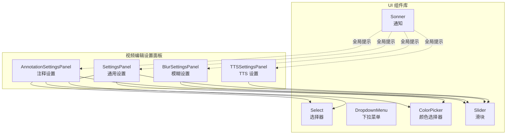
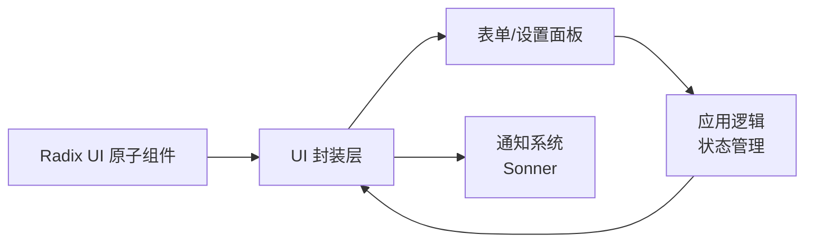
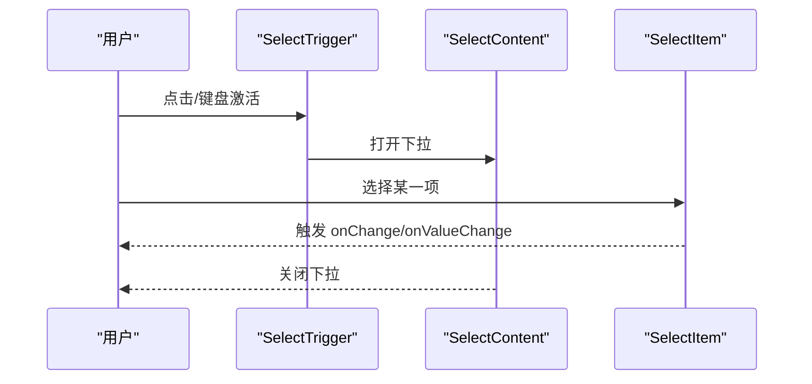
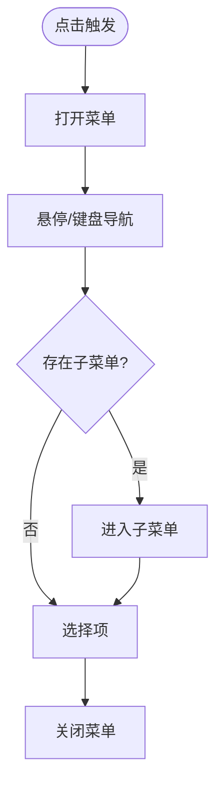
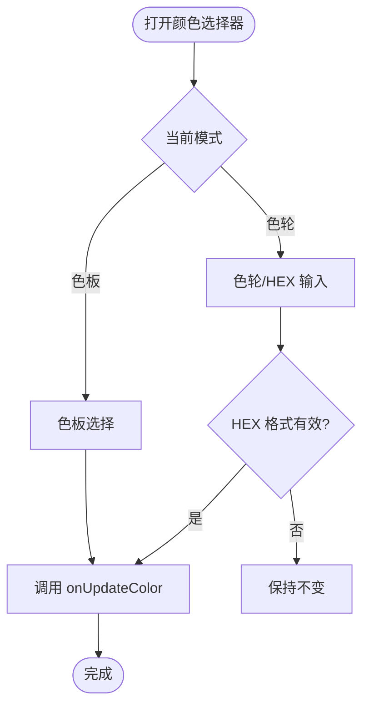
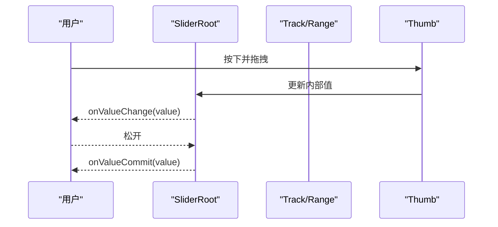
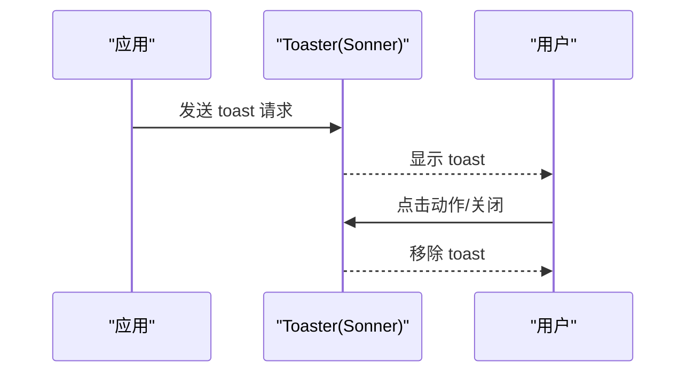
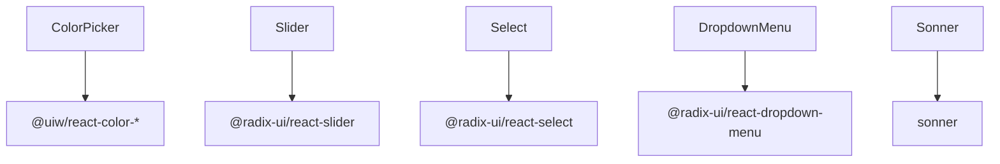
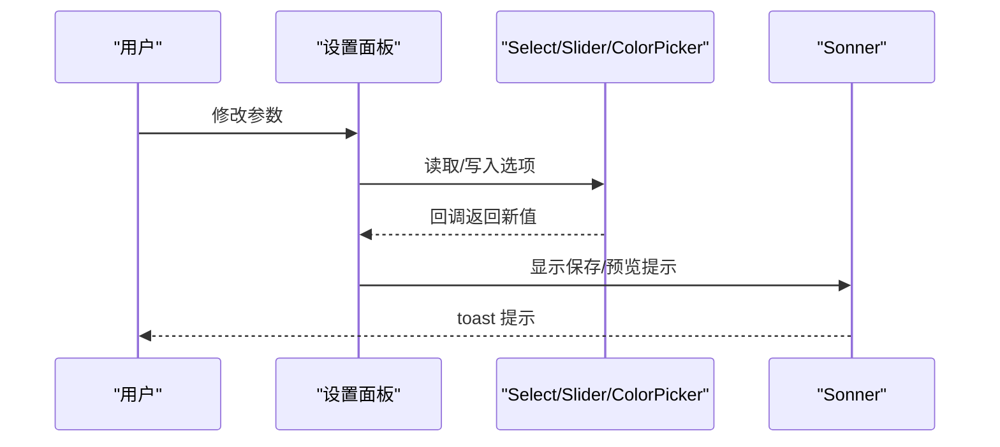

# 表单组件

<cite>
**本文引用的文件**
- [select.tsx](file://src/components/ui/select.tsx)
- [dropdown-menu.tsx](file://src/components/ui/dropdown-menu.tsx)
- [color-picker.tsx](file://src/components/ui/color-picker.tsx)
- [slider.tsx](file://src/components/ui/slider.tsx)
- [sonner.tsx](file://src/components/ui/sonner.tsx)
- [AnnotationSettingsPanel.tsx](file://src/components/video-editor/AnnotationSettingsPanel.tsx)
- [BlurSettingsPanel.tsx](file://src/components/video-editor/BlurSettingsPanel.tsx)
- [SettingsPanel.tsx](file://src/components/video-editor/SettingsPanel.tsx)
- [TTSSettingsPanel.tsx](file://src/components/video-editor/TTSSettingsPanel.tsx)
</cite>

## 目录
1. [简介](#简介)
2. [项目结构](#项目结构)
3. [核心组件](#核心组件)
4. [架构总览](#架构总览)
5. [组件详解](#组件详解)
6. [依赖关系分析](#依赖关系分析)
7. [性能与可用性](#性能与可用性)
8. [故障排查指南](#故障排查指南)
9. [结论](#结论)
10. [附录：完整表单集成示例](#附录完整表单集成示例)

## 简介
本文件聚焦于 OpenScreen 的表单相关组件：Select（选择器）、DropdownMenu（下拉菜单）、ColorPicker（颜色选择器）、Slider（滑块）与 Sonner（全局通知）。文档从架构、数据绑定、验证机制、异步加载与搜索过滤、状态同步与错误处理、可访问性与键盘支持等方面进行系统化说明，并结合视频编辑设置面板中的真实使用场景，给出端到端的集成示例与最佳实践。

## 项目结构
- 组件位于 src/components/ui 下，采用“原子化组件”风格，围绕 Radix UI 原子组件进行封装，统一主题与样式。
- 视频编辑设置面板（AnnotationSettingsPanel、BlurSettingsPanel、SettingsPanel、TTSSettingsPanel）展示了这些组件在复杂表单中的组合使用方式。

图表来源
- [select.tsx:1-171](file://src/components/ui/select.tsx#L1-L171)
- [dropdown-menu.tsx:1-195](file://src/components/ui/dropdown-menu.tsx#L1-L195)
- [color-picker.tsx:1-162](file://src/components/ui/color-picker.tsx#L1-L162)
- [slider.tsx:1-24](file://src/components/ui/slider.tsx#L1-L24)
- [sonner.tsx:1-30](file://src/components/ui/sonner.tsx#L1-L30)
- [AnnotationSettingsPanel.tsx](file://src/components/video-editor/AnnotationSettingsPanel.tsx)
- [BlurSettingsPanel.tsx](file://src/components/video-editor/BlurSettingsPanel.tsx)
- [SettingsPanel.tsx](file://src/components/video-editor/SettingsPanel.tsx)
- [TTSSettingsPanel.tsx](file://src/components/video-editor/TTSSettingsPanel.tsx)

章节来源
- [select.tsx:1-171](file://src/components/ui/select.tsx#L1-L171)
- [dropdown-menu.tsx:1-195](file://src/components/ui/dropdown-menu.tsx#L1-L195)
- [color-picker.tsx:1-162](file://src/components/ui/color-picker.tsx#L1-L162)
- [slider.tsx:1-24](file://src/components/ui/slider.tsx#L1-L24)
- [sonner.tsx:1-30](file://src/components/ui/sonner.tsx#L1-L30)

## 核心组件
- Select：基于 @radix-ui/react-select 的选择器，支持分组、标签、分隔线、滚动按钮与弹出层定位；提供受控/非受控两种用法。
- DropdownMenu：基于 @radix-ui/react-dropdown-menu 的菜单系统，支持子菜单、复选/单选项、快捷键显示与 Portal 渲染。
- ColorPicker：自研颜色选择器，支持色轮与色板双模式，支持透明度与 HEX 输入校验，提供清空背景能力。
- Slider：基于 @radix-ui/react-slider 的数值调节器，支持多值、禁用与键盘微调。
- Sonner：全局通知容器，统一暗色主题与样式，提供 toast 动画与交互。

章节来源
- [select.tsx:1-171](file://src/components/ui/select.tsx#L1-L171)
- [dropdown-menu.tsx:1-195](file://src/components/ui/dropdown-menu.tsx#L1-L195)
- [color-picker.tsx:1-162](file://src/components/ui/color-picker.tsx#L1-L162)
- [slider.tsx:1-24](file://src/components/ui/slider.tsx#L1-L24)
- [sonner.tsx:1-30](file://src/components/ui/sonner.tsx#L1-L30)

## 架构总览
- 组件层：以 Radix UI 为核心，通过 forwardRef 包装触发器、内容区、项等，确保可访问性与可控性。
- 主题层：统一使用 cn 合并类名，遵循 Tailwind 风格与暗色主题变量。
- 应用层：在视频编辑设置面板中，将上述组件组合为复杂表单，实现参数联动与状态同步。

图表来源
- [select.tsx:1-171](file://src/components/ui/select.tsx#L1-L171)
- [dropdown-menu.tsx:1-195](file://src/components/ui/dropdown-menu.tsx#L1-L195)
- [color-picker.tsx:1-162](file://src/components/ui/color-picker.tsx#L1-L162)
- [slider.tsx:1-24](file://src/components/ui/slider.tsx#L1-L24)
- [sonner.tsx:1-30](file://src/components/ui/sonner.tsx#L1-L30)

## 组件详解

### Select（选择器）
- 数据绑定与受控模式：通过 Root/Trigger/Content/Item 等组合，配合外部状态（如 useState）实现受控选择；支持多选/单选（需配合外部逻辑）。
- 交互与可访问性：内置焦点管理、键盘导航（上下移动、回车确认、Esc 关闭），支持滚动按钮与弹出层定位。
- 异步与搜索：原生 Select 不直接提供搜索过滤；可通过外部状态维护 filteredItems 并在 Content 中渲染动态列表，或在上层封装“带搜索的 Select”。

图表来源
- [select.tsx:15-33](file://src/components/ui/select.tsx#L15-L33)
- [select.tsx:63-110](file://src/components/ui/select.tsx#L63-L110)
- [select.tsx:124-145](file://src/components/ui/select.tsx#L124-L145)

章节来源
- [select.tsx:1-171](file://src/components/ui/select.tsx#L1-L171)

### DropdownMenu（下拉菜单）
- 多级菜单与快捷键：支持 Sub/SubContent/SubTrigger，以及 CheckboxItem/RadioItem；支持 inset 缩进与右侧 Chevron 右箭头指示。
- 渲染策略：默认通过 Portal 渲染至文档根部，避免被父级裁剪；也可关闭 portalled 模式按需使用。
- 交互：支持键盘打开/关闭、子菜单展开、快捷键文本展示。

图表来源
- [dropdown-menu.tsx:19-37](file://src/components/ui/dropdown-menu.tsx#L19-L37)
- [dropdown-menu.tsx:40-53](file://src/components/ui/dropdown-menu.tsx#L40-L53)
- [dropdown-menu.tsx:82-98](file://src/components/ui/dropdown-menu.tsx#L82-L98)
- [dropdown-menu.tsx:100-121](file://src/components/ui/dropdown-menu.tsx#L100-L121)
- [dropdown-menu.tsx:123-143](file://src/components/ui/dropdown-menu.tsx#L123-L143)

章节来源
- [dropdown-menu.tsx:1-195](file://src/components/ui/dropdown-menu.tsx#L1-L195)

### ColorPicker（颜色选择器）
- 模式切换：支持“色轮”与“色板”两种模式，通过内部状态 colorMode 切换。
- 数据绑定与校验：接收 selectedColor 与 onUpdateColor；HEX 输入时进行格式校验（#RGB 或 #RRGGBB），有效则回调更新。
- 透明度与清空：可选清空背景能力，转换为 HSVA 并将 alpha 设为 0。
- 文本对比：根据背景亮度动态计算文字颜色，保证可读性。

图表来源
- [color-picker.tsx:24-37](file://src/components/ui/color-picker.tsx#L24-L37)
- [color-picker.tsx:58-68](file://src/components/ui/color-picker.tsx#L58-L68)
- [color-picker.tsx:106-131](file://src/components/ui/color-picker.tsx#L106-L131)
- [color-picker.tsx:132-144](file://src/components/ui/color-picker.tsx#L132-L144)
- [color-picker.tsx:145-158](file://src/components/ui/color-picker.tsx#L145-L158)

章节来源
- [color-picker.tsx:1-162](file://src/components/ui/color-picker.tsx#L1-L162)

### Slider（滑块）
- 数据绑定：通过 Root/Track/Range/Thumb 组合，支持单值/多值；外部通过 defaultValue/value 与 onValueChange/onValueCommit 实现双向绑定。
- 交互：支持鼠标拖拽、键盘微调（方向键/PageUp/Down 等），禁用态与不可交互态有明确视觉反馈。
- 样式：轨道与拇指使用统一绿色系，强调选中范围与焦点环。

图表来源
- [slider.tsx:6-21](file://src/components/ui/slider.tsx#L6-L21)

章节来源
- [slider.tsx:1-24](file://src/components/ui/slider.tsx#L1-L24)

### Sonner（通知）
- 全局提示：统一暗色主题、圆角背景与模糊效果；toast 默认停留时间与动画过渡一致。
- 自定义样式：通过 classNames 覆盖 toast、描述、动作按钮与取消按钮的样式。
- 交互：支持点击动作按钮与关闭按钮，指针事件在 toast 内启用，便于用户操作。

图表来源
- [sonner.tsx:6-27](file://src/components/ui/sonner.tsx#L6-L27)

章节来源
- [sonner.tsx:1-30](file://src/components/ui/sonner.tsx#L1-L30)

## 依赖关系分析
- 组件间耦合：各组件相对独立，主要通过外部状态与回调进行通信；ColorPicker 依赖第三方颜色库，Slider/Select/DropdownMenu 依赖 Radix UI。
- 外部依赖：@radix-ui/react-select、@radix-ui/react-dropdown-menu、@radix-ui/react-slider、@uiw/react-color-*、sonner。
- 可能的循环依赖：未见直接循环导入；若在业务层将多个组件互相引用，需注意避免在渲染阶段引入副作用。

图表来源
- [color-picker.tsx:1-3](file://src/components/ui/color-picker.tsx#L1-L3)
- [slider.tsx](file://src/components/ui/slider.tsx#L1)
- [select.tsx](file://src/components/ui/select.tsx#L3)
- [dropdown-menu.tsx](file://src/components/ui/dropdown-menu.tsx#L1)
- [sonner.tsx](file://src/components/ui/sonner.tsx#L1)

章节来源
- [color-picker.tsx:1-162](file://src/components/ui/color-picker.tsx#L1-L162)
- [slider.tsx:1-24](file://src/components/ui/slider.tsx#L1-L24)
- [select.tsx:1-171](file://src/components/ui/select.tsx#L1-L171)
- [dropdown-menu.tsx:1-195](file://src/components/ui/dropdown-menu.tsx#L1-L195)
- [sonner.tsx:1-30](file://src/components/ui/sonner.tsx#L1-L30)

## 性能与可用性
- 性能
  - Select/DropdownMenu：内容区通过 Portal 渲染，减少层级嵌套带来的重绘；Viewport 使用最大高度与可用空间变量，避免溢出重排。
  - Slider：仅在拖拽过程中更新内部值，提交时机由 onValueCommit 控制，降低频繁重渲染。
  - ColorPicker：HEX 输入即时校验，无效输入不触发外部更新，减少无效回调。
- 可访问性
  - 所有组件均基于 Radix UI，具备键盘导航、焦点管理与 ARIA 支持。
  - Select/DropdownMenu 提供图标与指示器，清晰表达状态变化。
- 键盘与输入法
  - Slider 支持方向键微调；Select/DropdownMenu 支持键盘打开/关闭与项间导航。
  - ColorPicker 的 HEX 输入框支持输入法编辑（IME）场景，需确保在 onChange 中进行格式规范化。

[本节为通用指导，无需特定文件来源]

## 故障排查指南
- Select 无法显示滚动按钮
  - 检查 showScrollButtons 是否为 true；确认 viewport 高度与可用空间是否正确计算。
- DropdownMenu 子菜单位置异常
  - 若未使用 Portal，可能被父级容器裁剪；建议保持 portalled=true 或手动调整容器 overflow。
- ColorPicker HEX 输入无效
  - 确认输入格式为 #RGB 或 #RRGGBB；检查 normalizeHexDraft 逻辑与正则匹配。
- Slider 值未更新
  - 确认外部传入 value 与 onValueChange/onValueCommit 是否成对出现；避免同时使用 defaultValue 与 value 导致冲突。
- Sonner 不显示
  - 确认已挂载 Toaster 且主题与样式类名正确；检查 duration 与动画配置。

章节来源
- [select.tsx:74-78](file://src/components/ui/select.tsx#L74-L78)
- [dropdown-menu.tsx:60-79](file://src/components/ui/dropdown-menu.tsx#L60-L79)
- [color-picker.tsx:51-68](file://src/components/ui/color-picker.tsx#L51-L68)
- [slider.tsx:6-21](file://src/components/ui/slider.tsx#L6-L21)
- [sonner.tsx:6-27](file://src/components/ui/sonner.tsx#L6-L27)

## 结论
OpenScreen 的表单组件以 Radix UI 为基础，结合暗色主题与统一的交互语义，提供了高可访问性与良好扩展性的基础能力。通过 ColorPicker、Slider、Select、DropdownMenu 与 Sonner 的组合，可在视频编辑设置面板中快速搭建复杂表单，并借助外部状态与回调实现数据绑定、异步加载与搜索过滤等高级特性。

[本节为总结，无需特定文件来源]

## 附录：完整表单集成示例
以下示例展示如何在实际应用中使用这些组件构建复杂表单界面（路径引用，不包含代码内容）：

- 注释设置面板（AnnotationSettingsPanel）
  - 使用 Select 进行注释类型选择，使用 ColorPicker 进行颜色选择，使用 Slider 调整透明度与大小。
  - 示例路径：[AnnotationSettingsPanel.tsx](file://src/components/video-editor/AnnotationSettingsPanel.tsx)
- 模糊设置面板（BlurSettingsPanel）
  - 使用 Slider 调整模糊强度，结合 Sonner 展示实时预览结果。
  - 示例路径：[BlurSettingsPanel.tsx](file://src/components/video-editor/BlurSettingsPanel.tsx)
- 通用设置面板（SettingsPanel）
  - 使用 Select 进行输出质量选择，使用 ColorPicker 进行主题色选择，使用 Slider 调整帧率等参数。
  - 示例路径：[SettingsPanel.tsx](file://src/components/video-editor/SettingsPanel.tsx)
- TTS 设置面板（TTSSettingsPanel）
  - 使用 Slider 调整语速与音量，结合 Sonner 提示保存成功。
  - 示例路径：[TTSSettingsPanel.tsx](file://src/components/video-editor/TTSSettingsPanel.tsx)

图表来源
- [AnnotationSettingsPanel.tsx](file://src/components/video-editor/AnnotationSettingsPanel.tsx)
- [BlurSettingsPanel.tsx](file://src/components/video-editor/BlurSettingsPanel.tsx)
- [SettingsPanel.tsx](file://src/components/video-editor/SettingsPanel.tsx)
- [TTSSettingsPanel.tsx](file://src/components/video-editor/TTSSettingsPanel.tsx)
- [sonner.tsx:6-27](file://src/components/ui/sonner.tsx#L6-L27)