# 原生桥接架构设计

<cite>
**本文档引用的文件**
- [nativeBridge.ts](file://electron/ipc/nativeBridge.ts)
- [handlers.ts](file://electron/ipc/handlers.ts)
- [recordingStream.ts](file://electron/ipc/recordingStream.ts)
- [store.ts](file://electron/native-bridge/store.ts)
- [cursorService.ts](file://electron/native-bridge/services/cursorService.ts)
- [systemService.ts](file://electron/native-bridge/services/systemService.ts)
- [projectService.ts](file://electron/native-bridge/services/projectService.ts)
- [adapter.ts](file://electron/native-bridge/cursor/adapter.ts)
- [telemetryCursorAdapter.ts](file://electron/native-bridge/cursor/telemetryCursorAdapter.ts)
- [factory.ts](file://electron/native-bridge/cursor/recording/factory.ts)
- [macNativeCursorRecordingSession.ts](file://electron/native-bridge/cursor/recording/macNativeCursorRecordingSession.ts)
- [windowsNativeRecordingSession.ts](file://electron/native-bridge/cursor/recording/windowsNativeRecordingSession.ts)
- [session.ts](file://electron/native-bridge/cursor/recording/session.ts)
- [telemetryRecordingSession.ts](file://electron/native-bridge/cursor/recording/telemetryRecordingSession.ts)
- [client.ts](file://src/native/client.ts)
- [contracts.ts](file://src/native/contracts.ts)
- [index.ts](file://src/native/index.ts)
- [useCursorRecordingData.ts](file://src/native/hooks/useCursorRecordingData.ts)
- [useCursorTelemetry.ts](file://src/native/hooks/useCursorTelemetry.ts)
- [nativeMacRecording.ts](file://src/lib/nativeMacRecording.ts)
- [nativeWindowsRecording.ts](file://src/lib/nativeWindowsRecording.ts)
- [recordingSession.ts](file://src/lib/recordingSession.ts)
- [main.ts](file://electron/main.ts)
- [preload.ts](file://electron/preload.ts)
- [native-bridge.md](file://docs/architecture/native-bridge.md)
- [01-ipc-communication-system.md](file://docs/02-architecture/01-ipc-communication-system.md)
</cite>

## 目录
1. [引言](#引言)
2. [项目结构](#项目结构)
3. [核心组件](#核心组件)
4. [架构总览](#架构总览)
5. [详细组件分析](#详细组件分析)
6. [依赖关系分析](#依赖关系分析)
7. [性能考虑](#性能考虑)
8. [故障排除指南](#故障排除指南)
9. [结论](#结论)

## 引言

OpenScreen的原生桥接架构旨在为跨平台屏幕录制和光标追踪功能提供统一的原生能力访问接口。该架构通过服务层模式、适配器模式和状态管理模式的有机结合，实现了对不同操作系统（macOS和Windows）原生API的抽象和封装。

本架构的核心设计理念是：
- **分层解耦**：通过清晰的层次划分实现前端UI与原生功能的解耦
- **平台无关**：对外提供统一的接口，内部通过适配器处理平台差异
- **状态驱动**：采用集中式状态管理确保UI与原生功能的一致性
- **事件驱动**：基于IPC的消息传递机制实现进程间通信

## 项目结构

OpenScreen的原生桥接架构主要分布在以下目录中：

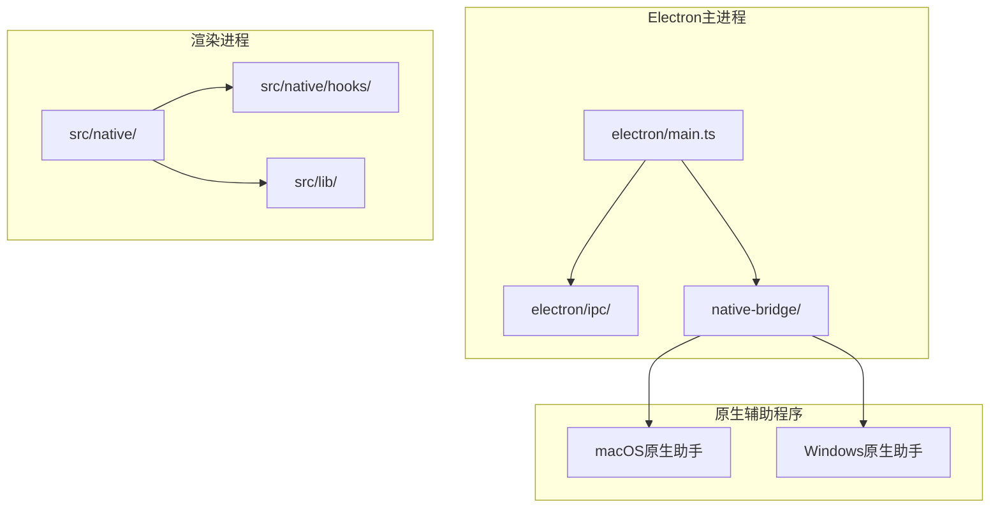

**图表来源**
- [main.ts](file://electron/main.ts)
- [nativeBridge.ts](file://electron/ipc/nativeBridge.ts)
- [client.ts](file://src/native/client.ts)

**章节来源**
- [main.ts](file://electron/main.ts)
- [nativeBridge.ts](file://electron/ipc/nativeBridge.ts)
- [client.ts](file://src/native/client.ts)

## 核心组件

### 1. IPC通信系统

IPC（进程间通信）系统是整个原生桥接架构的基础设施，负责主进程与渲染进程之间的消息传递。

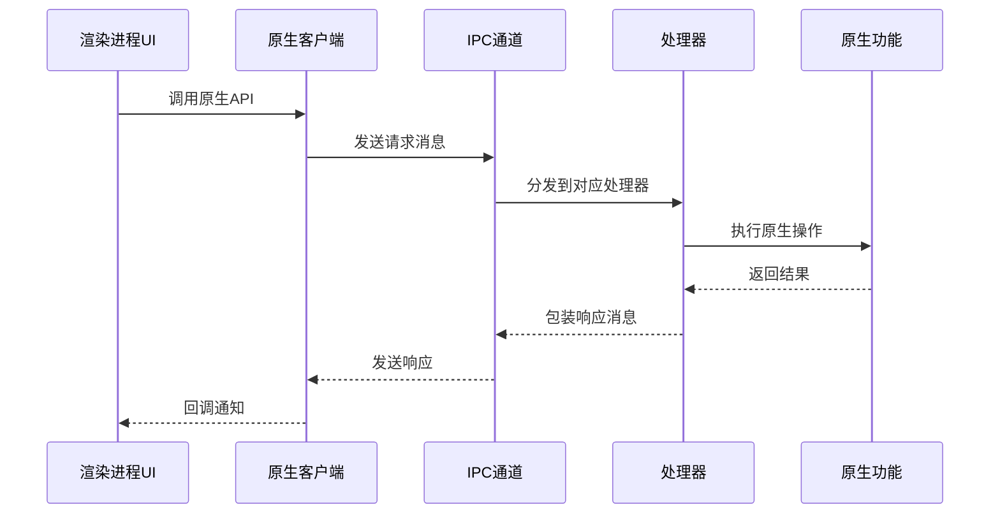

**图表来源**
- [nativeBridge.ts](file://electron/ipc/nativeBridge.ts)
- [handlers.ts](file://electron/ipc/handlers.ts)
- [recordingStream.ts](file://electron/ipc/recordingStream.ts)

### 2. 服务层架构

服务层提供了高层的业务逻辑抽象，封装了复杂的原生操作流程。

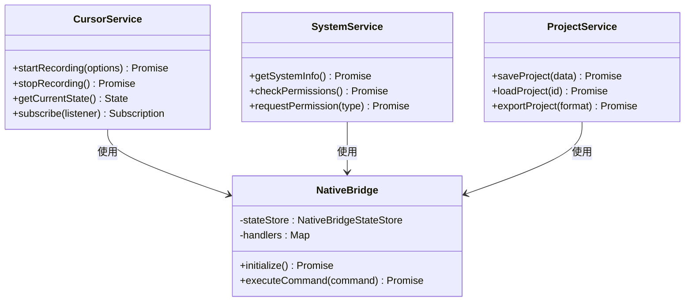

**图表来源**
- [cursorService.ts](file://electron/native-bridge/services/cursorService.ts)
- [systemService.ts](file://electron/native-bridge/services/systemService.ts)
- [projectService.ts](file://electron/native-bridge/services/projectService.ts)
- [nativeBridge.ts](file://electron/ipc/nativeBridge.ts)

### 3. 状态管理模式

状态管理是原生桥接架构的重要组成部分，通过集中式状态存储确保所有组件的状态一致性。

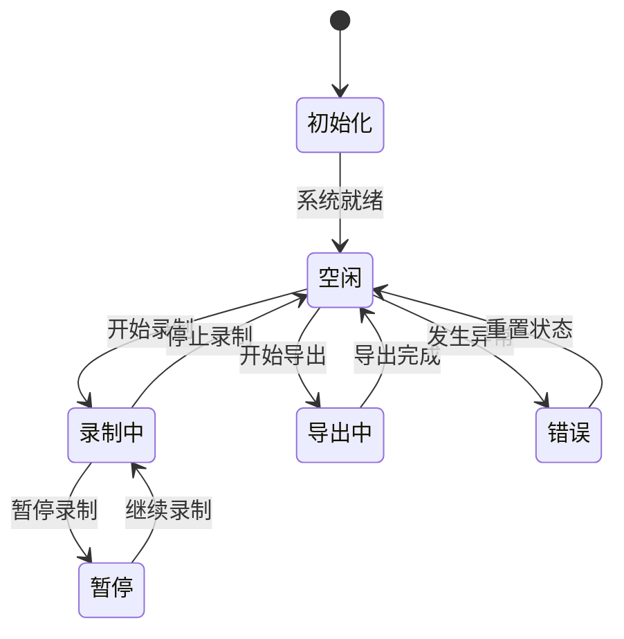

**图表来源**
- [store.ts](file://electron/native-bridge/store.ts)

**章节来源**
- [cursorService.ts](file://electron/native-bridge/services/cursorService.ts)
- [systemService.ts](file://electron/native-bridge/services/systemService.ts)
- [projectService.ts](file://electron/native-bridge/services/projectService.ts)
- [store.ts](file://electron/native-bridge/store.ts)

## 架构总览

OpenScreen原生桥接架构采用分层设计，从上到下分为应用层、服务层、适配器层和原生层：

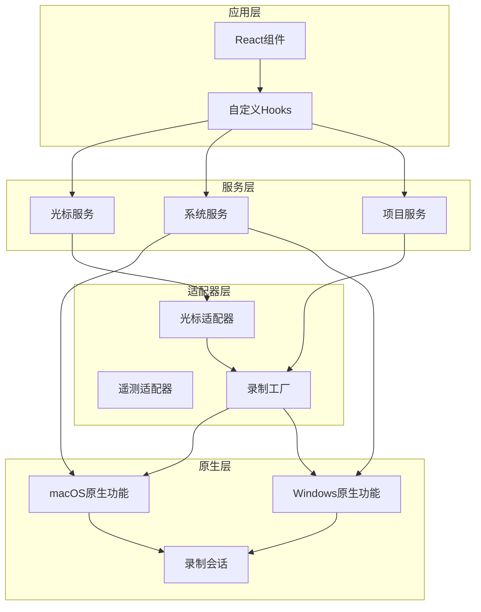

**图表来源**
- [adapter.ts](file://electron/native-bridge/cursor/adapter.ts)
- [telemetryCursorAdapter.ts](file://electron/native-bridge/cursor/telemetryCursorAdapter.ts)
- [factory.ts](file://electron/native-bridge/cursor/recording/factory.ts)
- [macNativeCursorRecordingSession.ts](file://electron/native-bridge/cursor/recording/macNativeCursorRecordingSession.ts)
- [windowsNativeRecordingSession.ts](file://electron/native-bridge/cursor/recording/windowsNativeRecordingSession.ts)

## 详细组件分析

### IPC通信机制

#### 消息传递协议

IPC系统采用基于JSON的消息格式，支持同步和异步两种调用模式：

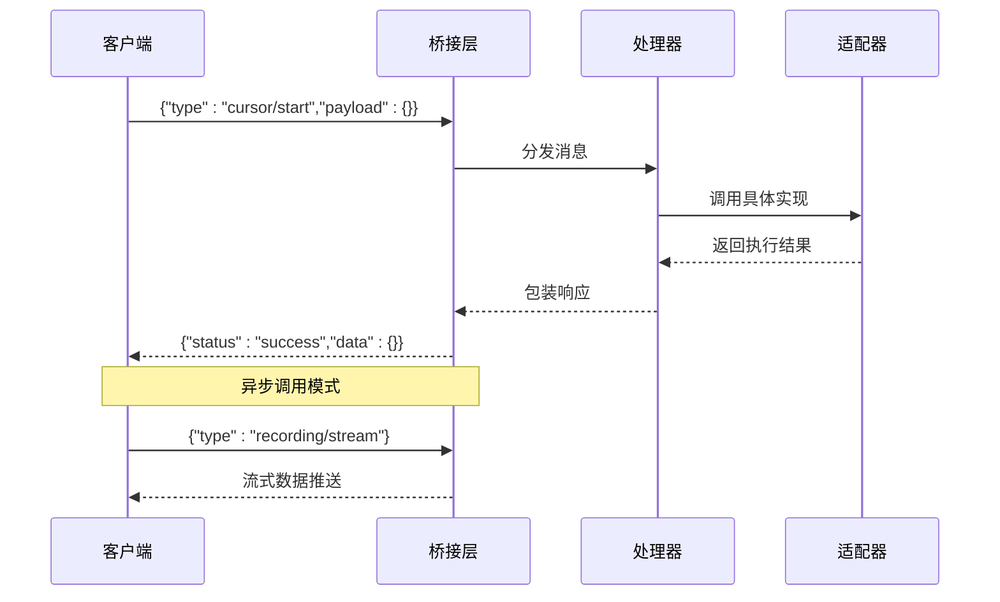

**图表来源**
- [nativeBridge.ts](file://electron/ipc/nativeBridge.ts)
- [handlers.ts](file://electron/ipc/handlers.ts)

#### 数据序列化策略

系统采用以下序列化策略确保数据传输的可靠性：

- **基础类型**：直接序列化为JSON字符串
- **二进制数据**：使用Base64编码进行传输
- **复杂对象**：通过结构化克隆算法处理
- **循环引用**：自动检测并转换为可序列化格式

**章节来源**
- [nativeBridge.ts](file://electron/ipc/nativeBridge.ts)
- [handlers.ts](file://electron/ipc/handlers.ts)
- [recordingStream.ts](file://electron/ipc/recordingStream.ts)

### 光标录制适配器

#### 适配器模式实现

光标录制适配器通过统一接口抽象不同平台的光标录制差异：

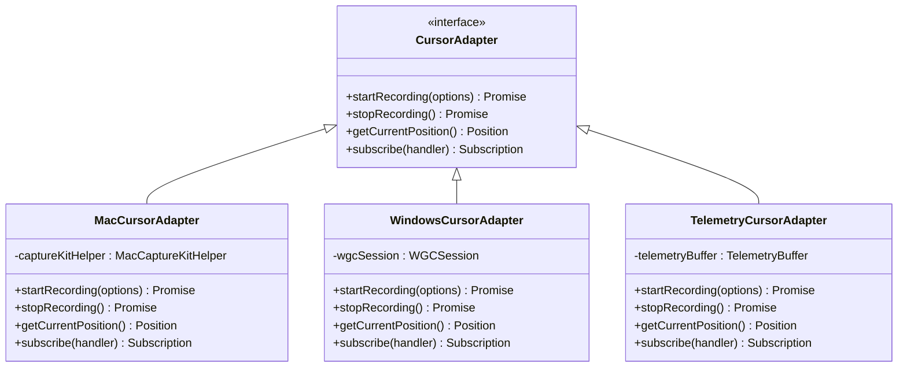

**图表来源**
- [adapter.ts](file://electron/native-bridge/cursor/adapter.ts)
- [telemetryCursorAdapter.ts](file://electron/native-bridge/cursor/telemetryCursorAdapter.ts)

#### 平台特定实现

每个平台的适配器都实现了特定的功能优化：

**macOS适配器特性**：
- 利用ScreenCaptureKit框架实现高效录制
- 支持硬件加速编码
- 提供精确的光标位置追踪
- 集成系统权限管理

**Windows适配器特性**：
- 基于Windows Graphics Capture API
- 支持多种编码格式
- 实现低延迟的数据流
- 集成音频捕获功能

**章节来源**
- [adapter.ts](file://electron/native-bridge/cursor/adapter.ts)
- [telemetryCursorAdapter.ts](file://electron/native-bridge/cursor/telemetryCursorAdapter.ts)

### 录制会话管理

#### 工厂模式设计

录制会话工厂根据目标平台创建相应的录制会话实例：

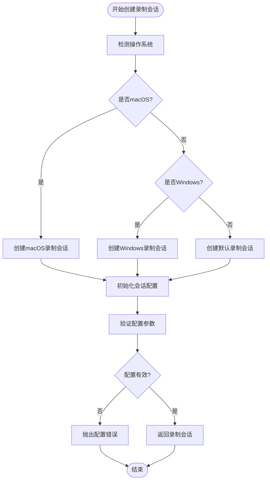

**图表来源**
- [factory.ts](file://electron/native-bridge/cursor/recording/factory.ts)
- [macNativeCursorRecordingSession.ts](file://electron/native-bridge/cursor/recording/macNativeCursorRecordingSession.ts)
- [windowsNativeRecordingSession.ts](file://electron/native-bridge/cursor/recording/windowsNativeRecordingSession.ts)

#### 会话生命周期管理

录制会话遵循严格的生命周期管理：

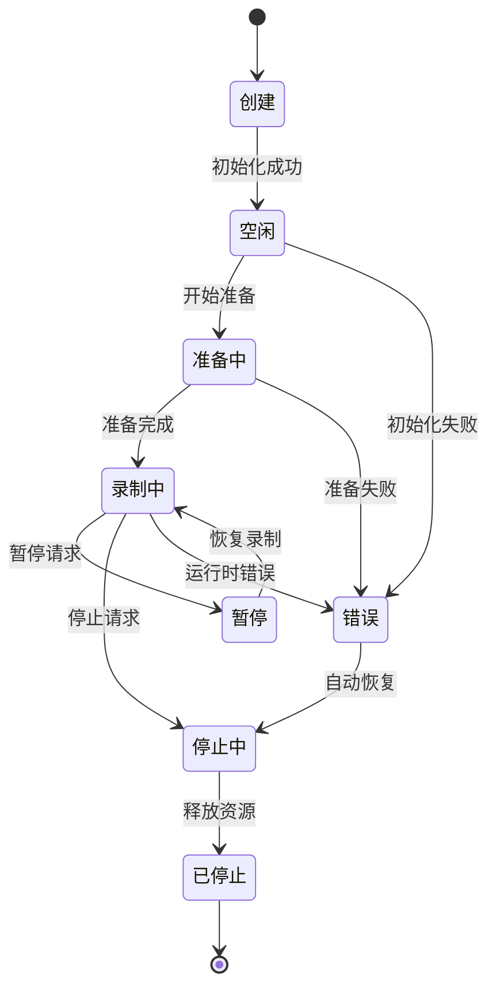

**图表来源**
- [session.ts](file://electron/native-bridge/cursor/recording/session.ts)
- [telemetryRecordingSession.ts](file://electron/native-bridge/cursor/recording/telemetryRecordingSession.ts)

**章节来源**
- [factory.ts](file://electron/native-bridge/cursor/recording/factory.ts)
- [session.ts](file://electron/native-bridge/cursor/recording/session.ts)
- [telemetryRecordingSession.ts](file://electron/native-bridge/cursor/recording/telemetryRecordingSession.ts)

### 状态管理架构

#### NativeBridgeStateStore设计

状态存储器采用单例模式实现全局状态管理：

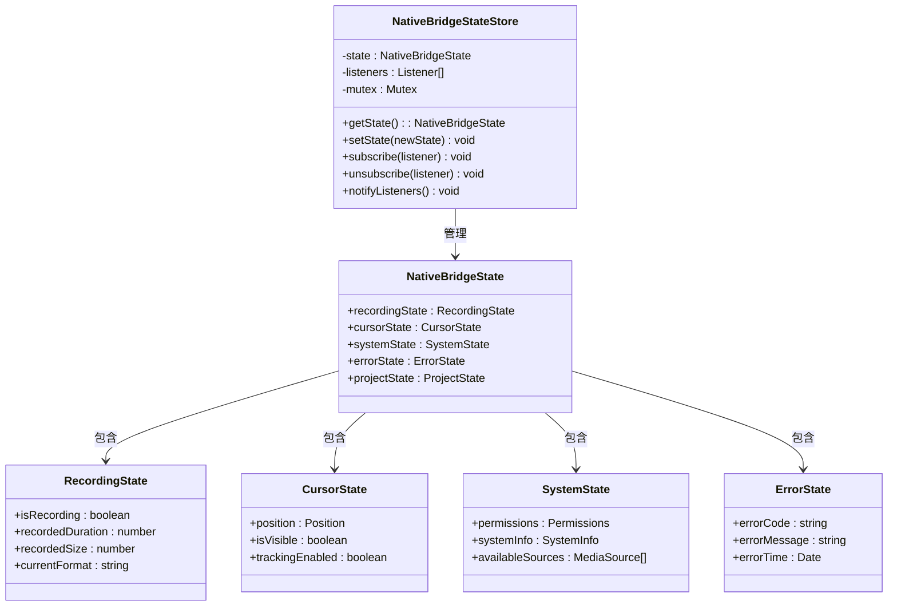

**图表来源**
- [store.ts](file://electron/native-bridge/store.ts)

#### 响应式更新机制

状态变更通过观察者模式实现响应式更新：

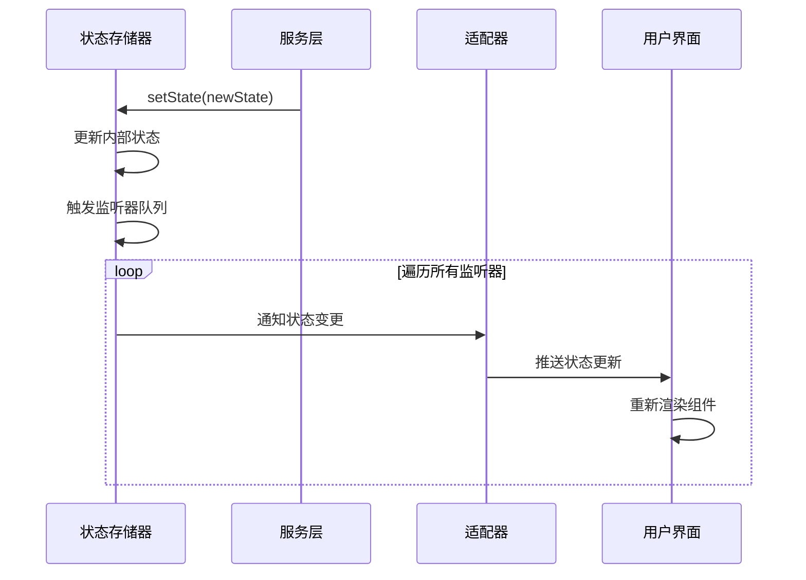

**图表来源**
- [store.ts](file://electron/native-bridge/store.ts)

**章节来源**
- [store.ts](file://electron/native-bridge/store.ts)

## 依赖关系分析

### 组件依赖图

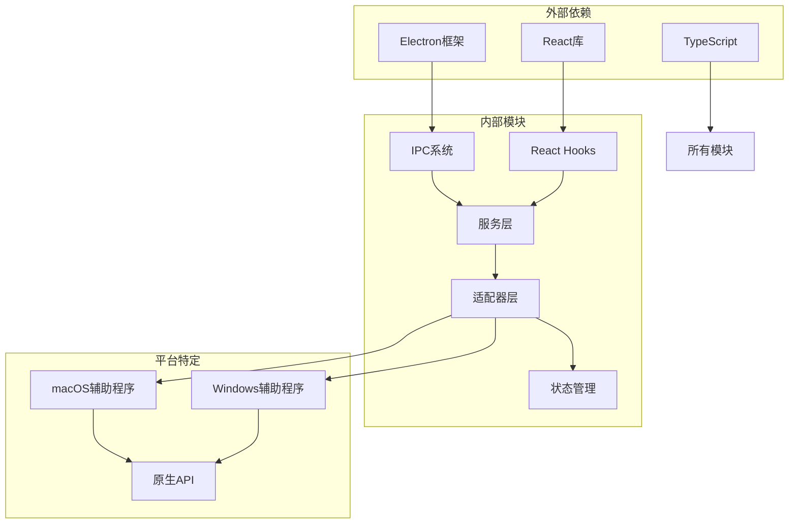

**图表来源**
- [main.ts](file://electron/main.ts)
- [client.ts](file://src/native/client.ts)
- [index.ts](file://src/native/index.ts)

### 循环依赖检测

系统通过以下策略避免循环依赖：
- **单向依赖**：所有依赖关系都是单向的
- **接口隔离**：使用接口而非具体实现类
- **事件驱动**：通过事件而非直接调用避免紧耦合
- **工厂模式**：延迟对象创建避免初始化循环

**章节来源**
- [main.ts](file://electron/main.ts)
- [client.ts](file://src/native/client.ts)
- [contracts.ts](file://src/native/contracts.ts)

## 性能考虑

### 内存管理策略

1. **对象池模式**：对频繁创建的对象使用对象池减少GC压力
2. **懒加载机制**：按需加载原生模块避免启动时内存峰值
3. **资源清理**：确保所有原生资源在使用后及时释放

### 网络和I/O优化

1. **批量处理**：将多个小消息合并为批量传输
2. **背压控制**：实现流控机制防止消息积压
3. **缓存策略**：对重复数据进行缓存避免重复计算

### 并发控制

1. **线程池管理**：合理分配工作线程数量
2. **锁粒度优化**：最小化锁的持有时间
3. **异步处理**：非阻塞操作使用Promise链

## 故障排除指南

### 常见问题诊断

#### 权限相关问题

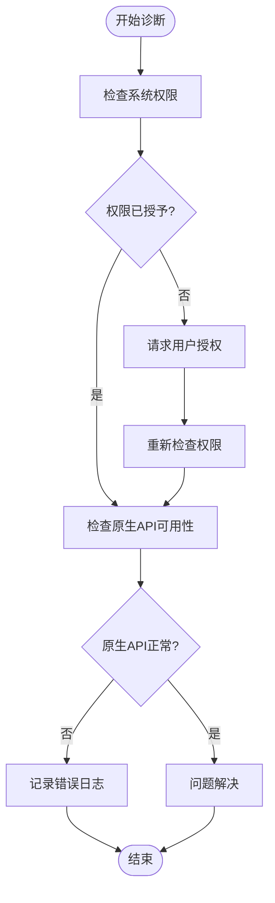

#### 性能问题排查

1. **CPU使用率过高**：检查是否有过多的轮询操作
2. **内存泄漏**：确认所有事件监听器都已正确移除
3. **帧率下降**：检查是否有不必要的重渲染

**章节来源**
- [nativeBridge.ts](file://electron/ipc/nativeBridge.ts)
- [handlers.ts](file://electron/ipc/handlers.ts)

### 日志和监控

系统提供了完善的日志记录机制：
- **错误级别**：记录所有异常情况
- **调试级别**：提供详细的执行跟踪
- **性能指标**：监控关键性能指标
- **用户行为**：记录重要的用户操作

## 结论

OpenScreen的原生桥接架构通过精心设计的分层结构和模式应用，成功实现了跨平台原生功能的统一抽象。该架构的主要优势包括：

1. **高度模块化**：清晰的层次划分使得代码易于维护和扩展
2. **平台无关性**：统一的接口设计隐藏了平台差异
3. **强健的错误处理**：完善的异常处理机制确保系统的稳定性
4. **高效的性能表现**：合理的并发控制和资源管理策略

未来可以进一步优化的方向包括：
- 增加更多的测试覆盖
- 实现更精细的性能监控
- 扩展对更多平台的支持
- 优化内存使用效率

该架构为类似跨平台原生功能集成项目提供了良好的参考模板。