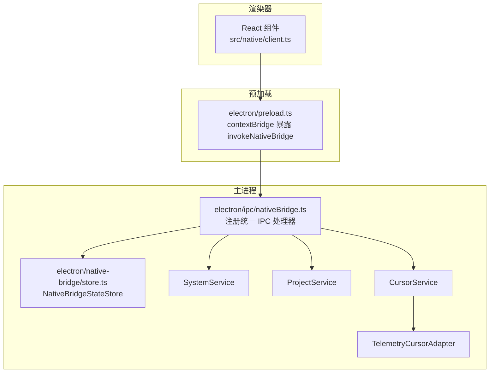
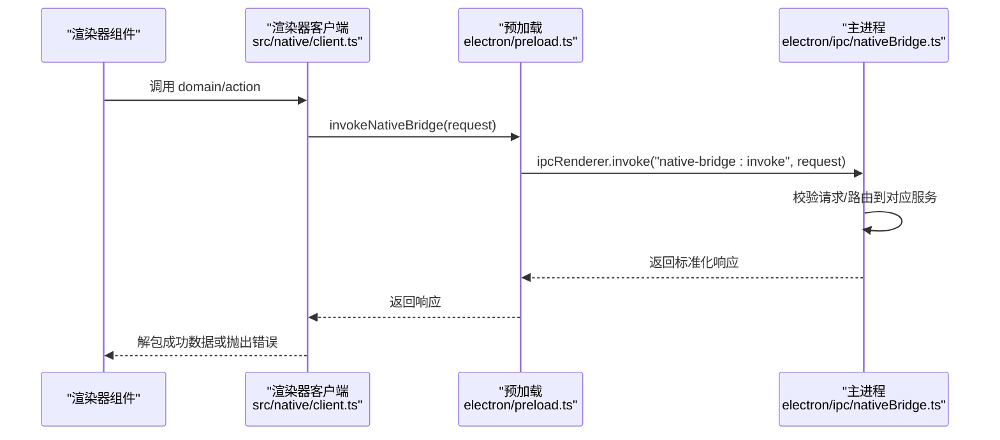
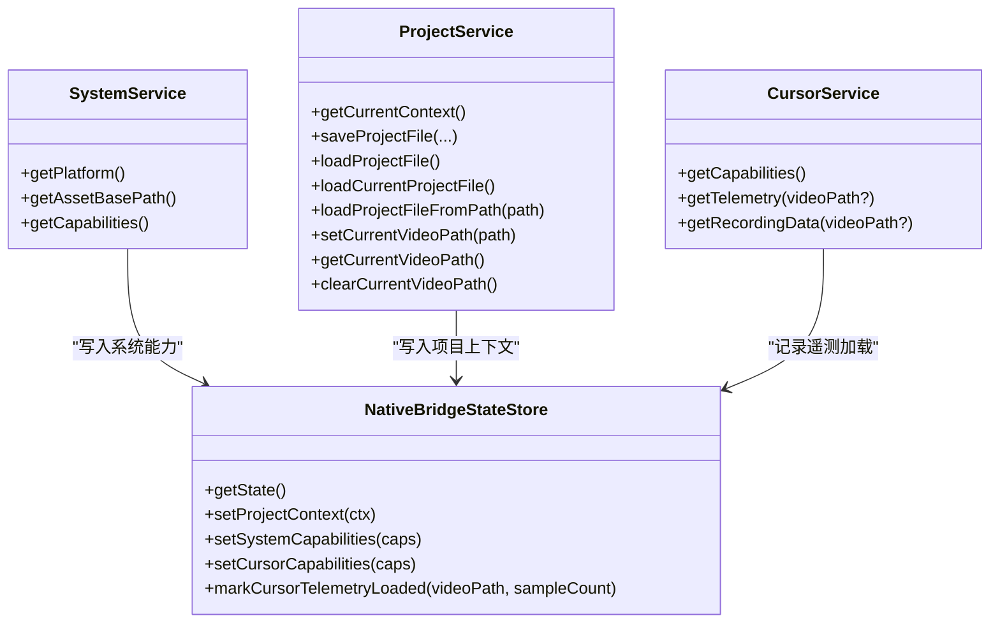
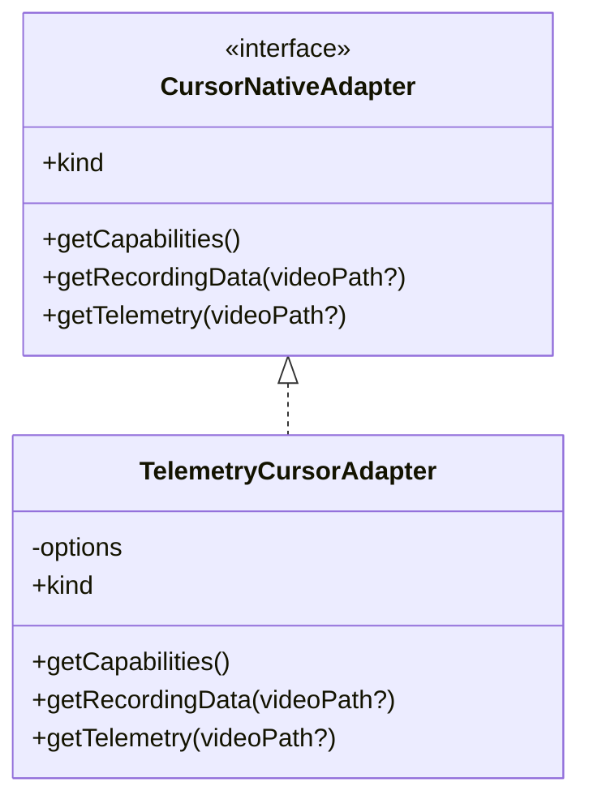
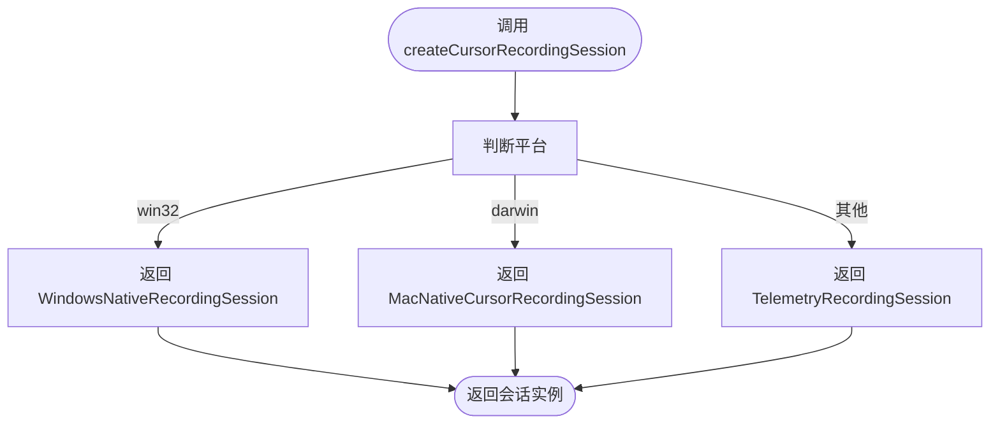
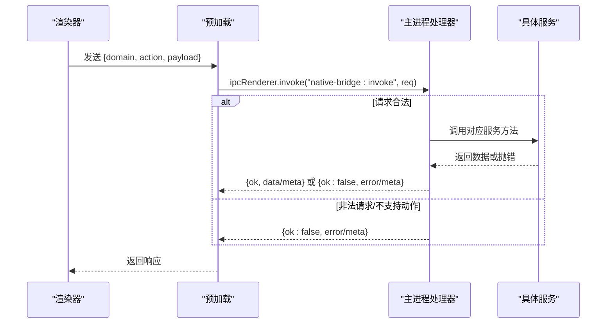
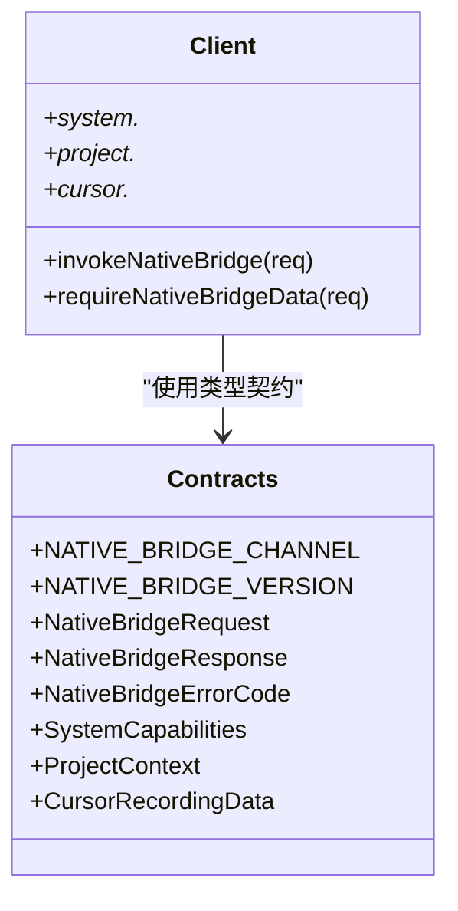
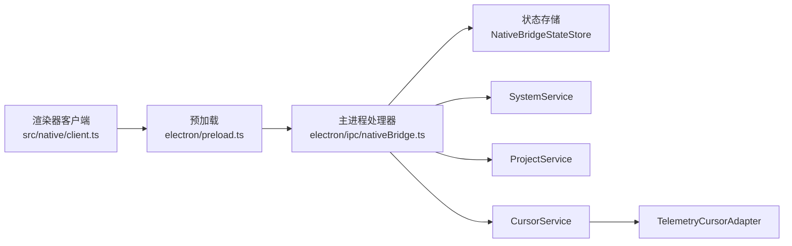

# 原生桥接系统

<cite>
**本文引用的文件**
- [electron/nativ-bridge/store.ts](file://electron/native-bridge/store.ts)
- [electron/nativ-bridge/services/projectService.ts](file://electron/native-bridge/services/projectService.ts)
- [electron/nativ-bridge/services/systemService.ts](file://electron/native-bridge/services/systemService.ts)
- [electron/nativ-bridge/services/cursorService.ts](file://electron/native-bridge/services/cursorService.ts)
- [electron/nativ-bridge/cursor/adapter.ts](file://electron/native-bridge/cursor/adapter.ts)
- [electron/nativ-bridge/cursor/telemetryCursorAdapter.ts](file://electron/native-bridge/cursor/telemetryCursorAdapter.ts)
- [electron/nativ-bridge/cursor/recording/factory.ts](file://electron/native-bridge/cursor/recording/factory.ts)
- [electron/nativ-bridge/cursor/recording/session.ts](file://electron/native-bridge/cursor/recording/session.ts)
- [electron/ipc/nativeBridge.ts](file://electron/ipc/nativeBridge.ts)
- [electron/main.ts](file://electron/main.ts)
- [electron/preload.ts](file://electron/preload.ts)
- [electron/windows.ts](file://electron/windows.ts)
- [src/native/index.ts](file://src/native/index.ts)
- [src/native/client.ts](file://src/native/client.ts)
- [src/native/contracts.ts](file://src/native/contracts.ts)
- [docs/architecture/native-bridge.md](file://docs/architecture/native-bridge.md)
</cite>

## 目录
1. [简介](#简介)
2. [项目结构](#项目结构)
3. [核心组件](#核心组件)
4. [架构总览](#架构总览)
5. [详细组件分析](#详细组件分析)
6. [依赖关系分析](#依赖关系分析)
7. [性能考量](#性能考量)
8. [故障排查指南](#故障排查指南)
9. [结论](#结论)
10. [附录：原生功能扩展与平台适配最佳实践](#附录原生功能扩展与平台适配最佳实践)

## 简介
本文件系统性阐述 OpenScreen 的原生桥接系统，聚焦 Electron 主进程与渲染器进程之间的原生能力桥接机制。文档覆盖服务层模式、适配器模式的应用，以及统一的跨进程通信策略；深入解析 ProjectService（项目服务）、SystemService（系统服务）与 CursorService（游标服务）的职责边界与协作方式；阐明 NativeBridgeStateStore（状态存储）在主进程中的单源真相角色；并提供原生功能扩展与平台适配的最佳实践。

## 项目结构
原生桥接相关代码主要分布在以下位置：
- Electron 主进程侧：IPC 统一入口、服务层与状态存储
- 渲染器侧：统一客户端封装与类型契约
- 预加载脚本：暴露安全的 IPC 调用通道
- 平台特定的游标录制会话工厂与适配器

图表来源
- [electron/ipc/nativeBridge.ts:92-236](file://electron/ipc/nativeBridge.ts#L92-L236)
- [electron/native-bridge/store.ts:24-88](file://electron/native-bridge/store.ts#L24-L88)
- [electron/native-bridge/services/systemService.ts:16-43](file://electron/native-bridge/services/systemService.ts#L16-L43)
- [electron/native-bridge/services/projectService.ts:25-87](file://electron/native-bridge/services/projectService.ts#L25-L87)
- [electron/native-bridge/services/cursorService.ts:14-46](file://electron/native-bridge/services/cursorService.ts#L14-L46)
- [electron/native-bridge/cursor/telemetryCursorAdapter.ts:10-49](file://electron/native-bridge/cursor/telemetryCursorAdapter.ts#L10-L49)
- [electron/preload.ts:15-31](file://electron/preload.ts#L15-L31)

章节来源
- [docs/architecture/native-bridge.md:1-39](file://docs/architecture/native-bridge.md#L1-L39)
- [electron/ipc/nativeBridge.ts:92-236](file://electron/ipc/nativeBridge.ts#L92-L236)

## 核心组件
- 统一 IPC 入口与路由：在主进程集中注册统一通道，按域分发请求，返回标准化响应与错误码。
- 服务层（SystemService/ProjectService/CursorService）：面向领域抽象的服务对象，负责编排适配器、维护运行时状态并暴露稳定接口。
- 适配器层（TelemetryCursorAdapter 等）：平台特定能力的封装，对外暴露一致的接口契约。
- 状态存储（NativeBridgeStateStore）：主进程内的单源真相，承载系统能力、项目上下文与游标遥测加载元数据。
- 渲染器客户端（src/native/client.ts）：对统一通道的高层封装，提供 domain/action 的易用 API。

章节来源
- [electron/ipc/nativeBridge.ts:92-236](file://electron/ipc/nativeBridge.ts#L92-L236)
- [electron/native-bridge/store.ts:24-88](file://electron/native-bridge/store.ts#L24-L88)
- [electron/native-bridge/services/systemService.ts:16-43](file://electron/native-bridge/services/systemService.ts#L16-L43)
- [electron/native-bridge/services/projectService.ts:25-87](file://electron/native-bridge/services/projectService.ts#L25-L87)
- [electron/native-bridge/services/cursorService.ts:14-46](file://electron/native-bridge/services/cursorService.ts#L14-L46)
- [src/native/client.ts:33-139](file://src/native/client.ts#L33-L139)

## 架构总览
原生桥接遵循“能力优先、版本化契约、稳健响应”的原则：
- 单源真相：主进程维护运行时状态与能力清单。
- 能力查询优先：渲染器先查询能力再发起可能失败的原生操作。
- 版本化契约：请求/响应携带版本号与请求 ID，便于演进与追踪。
- 稳健错误：统一的错误响应体，包含可重试标记，便于上层策略处理。

图表来源
- [src/native/client.ts:33-50](file://src/native/client.ts#L33-L50)
- [electron/preload.ts:17-19](file://electron/preload.ts#L17-L19)
- [electron/ipc/nativeBridge.ts:124-235](file://electron/ipc/nativeBridge.ts#L124-L235)

## 详细组件分析

### 服务层：System、Project、Cursor
- SystemService：负责平台识别、资源路径解析与系统能力聚合（含桥接版本、平台、游标能力、项目上下文支持等），并将结果写入状态存储。
- ProjectService：封装项目上下文读取与写入、视频路径设置与清理、项目文件保存/加载等，每次操作后刷新状态存储中的 ProjectContext。
- CursorService：通过适配器获取游标能力、遥测与录制数据，同时在成功加载后更新状态存储中的“最后遥测加载”元数据。

图表来源
- [electron/native-bridge/store.ts:24-88](file://electron/native-bridge/store.ts#L24-L88)
- [electron/native-bridge/services/systemService.ts:16-43](file://electron/native-bridge/services/systemService.ts#L16-L43)
- [electron/native-bridge/services/projectService.ts:25-87](file://electron/native-bridge/services/projectService.ts#L25-L87)
- [electron/native-bridge/services/cursorService.ts:14-46](file://electron/native-bridge/services/cursorService.ts#L14-L46)

章节来源
- [electron/native-bridge/services/systemService.ts:16-43](file://electron/native-bridge/services/systemService.ts#L16-L43)
- [electron/native-bridge/services/projectService.ts:25-87](file://electron/native-bridge/services/projectService.ts#L25-L87)
- [electron/native-bridge/services/cursorService.ts:14-46](file://electron/native-bridge/services/cursorService.ts#L14-L46)

### 适配器层：游标遥测适配器
- TelemetryCursorAdapter：以“遥测模式”提供游标能力（仅遥测，无系统资产），根据是否提供视频路径决定数据加载行为；未提供路径时返回空样本与空资产列表。
- 适配器接口（CursorNativeAdapter）：定义能力查询、遥测加载与录制数据加载三类方法，为不同平台提供统一契约。

图表来源
- [electron/nativ-bridge/cursor/adapter.ts:15-20](file://electron/native-bridge/cursor/adapter.ts#L15-L20)
- [electron/nativ-bridge/cursor/telemetryCursorAdapter.ts:10-49](file://electron/native-bridge/cursor/telemetryCursorAdapter.ts#L10-L49)

章节来源
- [electron/nativ-bridge/cursor/adapter.ts:15-20](file://electron/native-bridge/cursor/adapter.ts#L15-L20)
- [electron/nativ-bridge/cursor/telemetryCursorAdapter.ts:10-49](file://electron/native-bridge/cursor/telemetryCursorAdapter.ts#L10-L49)

### 游标录制会话工厂与会话接口
- 工厂函数 createCursorRecordingSession：依据平台（win32/darwin/linux）选择不同的录制会话实现，统一对外暴露启动/停止接口。
- 会话接口 CursorRecordingSession：定义 start/stop，stop 返回 CursorRecordingData，用于后续遥测与资产处理。

图表来源
- [electron/nativ-bridge/cursor/recording/factory.ts:16-46](file://electron/native-bridge/cursor/recording/factory.ts#L16-L46)
- [electron/nativ-bridge/cursor/recording/session.ts:3-6](file://electron/native-bridge/cursor/recording/session.ts#L3-L6)

章节来源
- [electron/nativ-bridge/cursor/recording/factory.ts:16-46](file://electron/native-bridge/cursor/recording/factory.ts#L16-L46)
- [electron/nativ-bridge/cursor/recording/session.ts:3-6](file://electron/native-bridge/cursor/recording/session.ts#L3-L6)

### IPC 统一处理器与错误响应
- 注册统一通道：移除旧处理器，创建状态存储与各服务实例，按 domain/action 分支处理。
- 错误响应：对非法请求、不支持的动作、内部异常进行统一包装，包含可重试标记，便于上层策略处理。

图表来源
- [electron/ipc/nativeBridge.ts:124-235](file://electron/ipc/nativeBridge.ts#L124-L235)

章节来源
- [electron/ipc/nativeBridge.ts:92-236](file://electron/ipc/nativeBridge.ts#L92-L236)

### 渲染器客户端与类型契约
- 渲染器客户端：封装统一通道调用，自动注入 requestId，提供 requireNativeBridgeData 抛错封装。
- 类型契约：定义统一的请求/响应、错误码、事件名与元数据结构，确保前后端一致性。

图表来源
- [src/native/contracts.ts:130-235](file://src/native/contracts.ts#L130-L235)
- [src/native/client.ts:33-139](file://src/native/client.ts#L33-L139)

章节来源
- [src/native/client.ts:33-139](file://src/native/client.ts#L33-L139)
- [src/native/contracts.ts:1-236](file://src/native/contracts.ts#L1-L236)

### 窗口与预加载桥接
- 预加载脚本：通过 contextBridge 暴露 electronAPI，其中包含 invokeNativeBridge，供渲染器调用统一通道。
- 窗口创建：主进程在 webPreferences 中注入额外参数（如资源基址），确保渲染器正确访问资源。

章节来源
- [electron/preload.ts:15-31](file://electron/preload.ts#L15-L31)
- [electron/windows.ts:78-84](file://electron/windows.ts#L78-L84)

## 依赖关系分析
- 渲染器依赖 src/native/client.ts 作为唯一原生调用入口，避免直接绑定 Electron API。
- 主进程统一由 ipc/nativeBridge.ts 路由，服务层依赖状态存储与适配器。
- 状态存储是单源真相，被多个服务写入，但渲染器只读。
- 适配器层隔离平台差异，服务层通过适配器解耦平台细节。

图表来源
- [src/native/client.ts:33-139](file://src/native/client.ts#L33-L139)
- [electron/preload.ts:17-19](file://electron/preload.ts#L17-L19)
- [electron/ipc/nativeBridge.ts:92-236](file://electron/ipc/nativeBridge.ts#L92-L236)
- [electron/native-bridge/store.ts:24-88](file://electron/native-bridge/store.ts#L24-L88)
- [electron/native-bridge/services/systemService.ts:16-43](file://electron/native-bridge/services/systemService.ts#L16-L43)
- [electron/native-bridge/services/projectService.ts:25-87](file://electron/native-bridge/services/projectService.ts#L25-L87)
- [electron/native-bridge/services/cursorService.ts:14-46](file://electron/native-bridge/services/cursorService.ts#L14-L46)
- [electron/native-bridge/cursor/telemetryCursorAdapter.ts:10-49](file://electron/native-bridge/cursor/telemetryCursorAdapter.ts#L10-L49)

## 性能考量
- 采样与缓冲：游标遥测采用固定采样间隔与最大样本数限制，避免长时间录制导致内存膨胀。
- 文件 I/O：遥测与资产读取采用异步文件系统，失败时返回空数据或错误，保证流程可控。
- 跨进程调用：统一通道减少重复 IPC 调用次数，结合 requestId 与 meta 可进行调用链追踪与去重。

章节来源
- [electron/ipc/nativeBridge.ts:50-81](file://electron/ipc/nativeBridge.ts#L50-L81)
- [electron/native-bridge/services/cursorService.ts:23-45](file://electron/native-bridge/services/cursorService.ts#L23-L45)

## 故障排查指南
- 请求无效：检查请求体是否满足 NativeBridgeRequest 结构，确认 domain/action 是否受支持。
- 不支持的动作：确认渲染器调用的 action 是否在主进程处理器中已实现分支。
- 内部错误：查看错误响应中的 retryable 标记，决定是否重试；同时关注日志输出定位具体异常。
- 权限与平台：系统服务返回的能力信息可用于判断当前平台与权限状态，避免在不支持的平台上发起原生调用。

章节来源
- [electron/ipc/nativeBridge.ts:227-234](file://electron/ipc/nativeBridge.ts#L227-L234)
- [src/native/contracts.ts:93-104](file://src/native/contracts.ts#L93-L104)

## 结论
OpenScreen 的原生桥接系统通过服务层与适配器层的清晰分层、统一的 IPC 通道与版本化契约，实现了跨进程能力的稳定暴露与渲染器的统一消费。NativeBridgeStateStore 作为单源真相，确保了系统能力、项目上下文与游标遥测元数据的一致性与可观测性。该架构既满足当前需求，也为未来扩展新的原生能力提供了清晰的演进路径。

## 附录：原生功能扩展与平台适配最佳实践
- 新增服务：遵循现有服务层模式，定义 Options 接口与方法，注入状态存储以保持单源真相。
- 新增适配器：实现 CursorNativeAdapter 接口，明确 provider kind 与能力声明，确保渲染器可查询能力后再调用。
- 平台适配：在工厂函数中按平台选择实现，保持对外接口一致；对不支持的平台返回“遥测模式”或降级能力。
- 错误与回退：所有原生调用均需捕获异常并返回标准化错误；对可恢复场景设置 retryable 标记。
- 类型契约：新增字段时，务必在 contracts.ts 中同步更新，并在渲染器客户端补充相应 API 封装。
- 安全与权限：通过系统服务返回的能力信息进行前置校验，避免在无权限或不支持的环境下发起昂贵的原生调用。

章节来源
- [docs/architecture/native-bridge.md:21-39](file://docs/architecture/native-bridge.md#L21-L39)
- [electron/nativ-bridge/cursor/recording/factory.ts:16-46](file://electron/native-bridge/cursor/recording/factory.ts#L16-L46)
- [src/native/contracts.ts:130-235](file://src/native/contracts.ts#L130-L235)