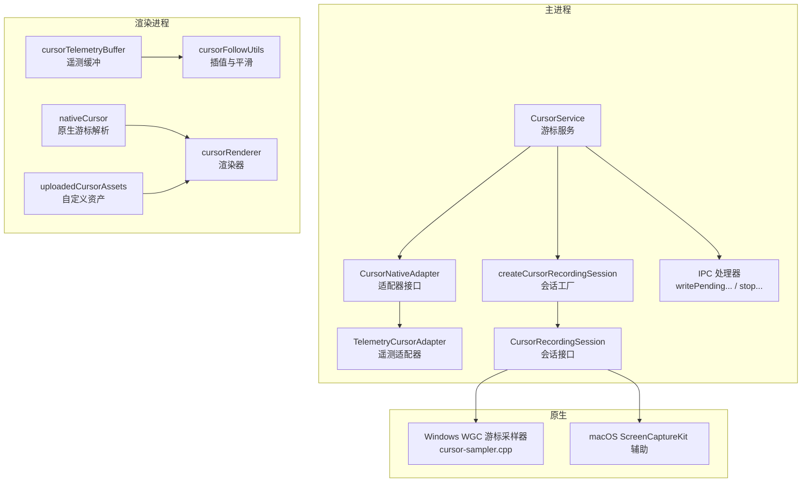
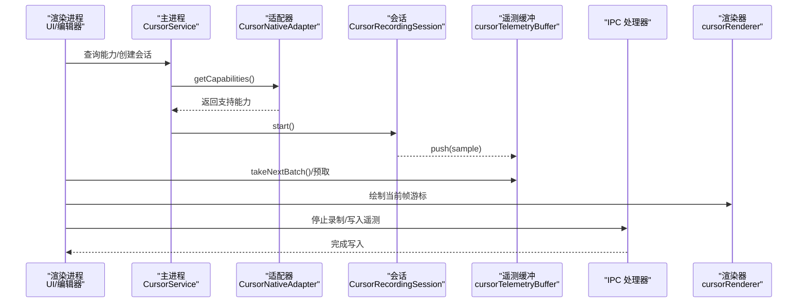
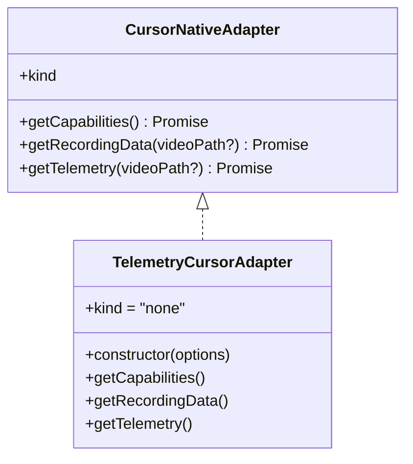
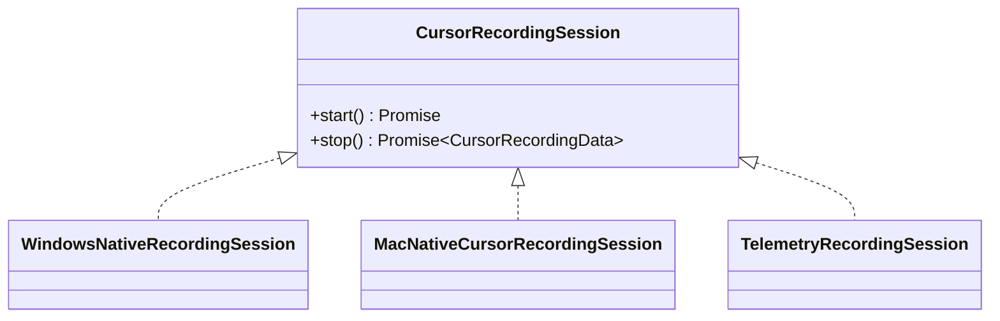
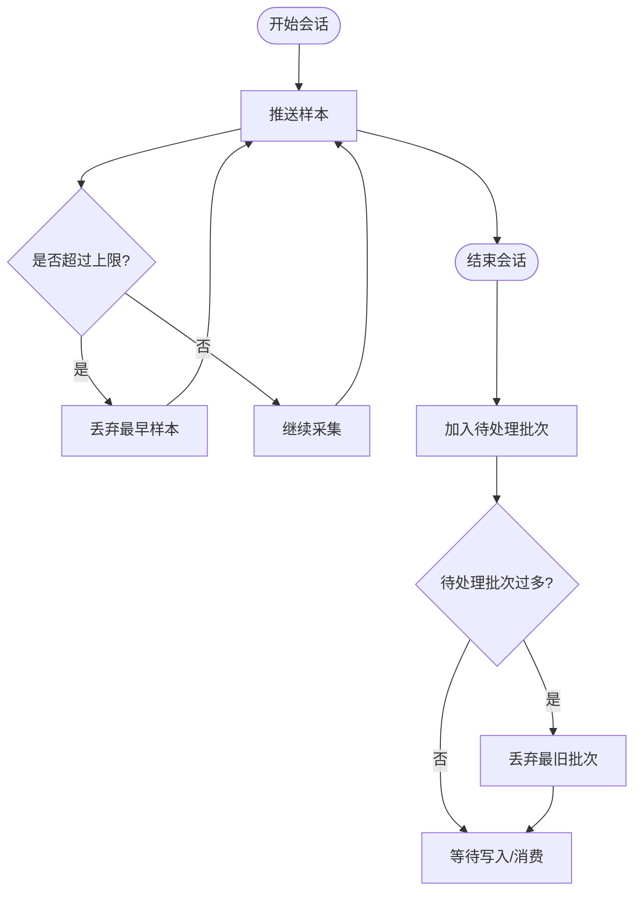
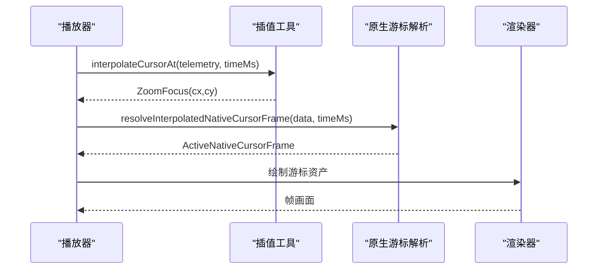
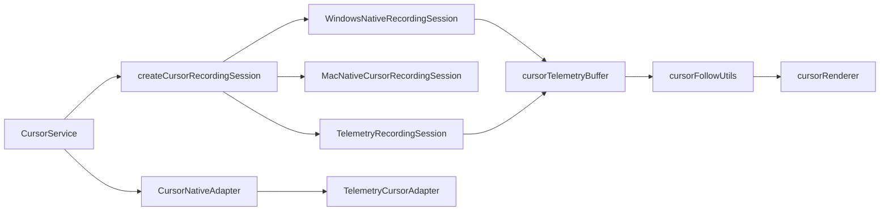

# 游标服务

<cite>
**本文引用的文件**
- [cursorService.ts](file://electron/native-bridge/services/cursorService.ts)
- [adapter.ts](file://electron/native-bridge/cursor/adapter.ts)
- [telemetryCursorAdapter.ts](file://electron/native-bridge/cursor/telemetryCursorAdapter.ts)
- [session.ts](file://electron/native-bridge/cursor/recording/session.ts)
- [factory.ts](file://electron/native-bridge/cursor/recording/factory.ts)
- [macNativeCursorRecordingSession.ts](file://electron/native-bridge/cursor/recording/macNativeCursorRecordingSession.ts)
- [windowsNativeRecordingSession.ts](file://electron/native-bridge/cursor/recording/windowsNativeRecordingSession.ts)
- [telemetryRecordingSession.ts](file://electron/native-bridge/cursor/recording/telemetryRecordingSession.ts)
- [cursorTelemetryBuffer.ts](file://src/lib/cursorTelemetryBuffer.ts)
- [cursorFollowUtils.ts](file://src/components/video-editor/videoPlayback/cursorFollowUtils.ts)
- [nativeCursor.ts](file://src/lib/cursor/nativeCursor.ts)
- [handlers.ts](file://electron/ipc/handlers.ts)
- [cursor-sampler.cpp](file://electron/native/wgc-capture/src/cursor-sampler.cpp)
- [cursorTelemetryBuffer.test.ts](file://src/lib/cursorTelemetryBuffer.test.ts)
- [cursor-renderer.ts](file://src/components/video-editor/videoPlayback/cursorRenderer.ts)
- [uploadedCursorAssets.ts](file://src/components/video-editor/videoPlayback/uploadedCursorAssets.ts)
- [cursor-telemetry-system.md](file://docs/03-recording/03-cursor-telemetry-system.md)
- [windows-native-cursor.md](file://docs/testing/windows-native-cursor.md)
- [macos-native-cursor.md](file://docs/testing/macos-native-cursor.md)
</cite>

## 目录
1. [简介](#简介)
2. [项目结构](#项目结构)
3. [核心组件](#核心组件)
4. [架构总览](#架构总览)
5. [详细组件分析](#详细组件分析)
6. [依赖关系分析](#依赖关系分析)
7. [性能考量](#性能考量)
8. [故障排查指南](#故障排查指南)
9. [结论](#结论)
10. [附录](#附录)

## 简介
本文件系统性阐述 OpenScreen 的游标服务（CursorService）：从游标数据采集与遥测分析，到资产（光标样式）管理与播放渲染，再到跨平台原生录制会话与 IPC 集成。文档覆盖以下主题：
- 游标能力检测与支持范围
- 实时数据接收、缓冲区管理与数据转换
- 资产系统：自定义游标资源上传、缓存与格式转换
- 遥测数据存储与查询：索引、检索优化与性能权衡
- 扩展接口与第三方集成指引

## 项目结构
游标服务横跨主进程（Electron 主进程桥接层）、渲染进程（前端视频编辑器与播放器）以及原生模块（Windows WGC 与 macOS ScreenCaptureKit）。核心目录与职责如下：
- electron/native-bridge/services：游标服务入口与能力适配
- electron/native-bridge/cursor：原生游标录制会话与遥测适配
- src/lib：通用库（遥测缓冲、原生游标解析）
- src/components/video-editor：视频播放与游标渲染、资产上传
- electron/native/wgc-capture：Windows 原生游标采样器
- docs：官方文档与测试指南

图表来源
- [cursorService.ts:1-200](file://electron/native-bridge/services/cursorService.ts#L1-L200)
- [adapter.ts:1-20](file://electron/native-bridge/cursor/adapter.ts#L1-L20)
- [telemetryCursorAdapter.ts:1-49](file://electron/native-bridge/cursor/telemetryCursorAdapter.ts#L1-L49)
- [factory.ts:1-50](file://electron/native-bridge/cursor/recording/factory.ts#L1-L50)
- [session.ts:1-6](file://electron/native-bridge/cursor/recording/session.ts#L1-L6)
- [cursor-sampler.cpp:405-430](file://electron/native/wgc-capture/src/cursor-sampler.cpp#L405-L430)
- [cursorTelemetryBuffer.ts:130-213](file://src/lib/cursorTelemetryBuffer.ts#L130-L213)
- [cursorFollowUtils.ts:1-54](file://src/components/video-editor/videoPlayback/cursorFollowUtils.ts#L1-L54)
- [nativeCursor.ts:484-542](file://src/lib/cursor/nativeCursor.ts#L484-L542)
- [cursorRenderer.ts](file://src/components/video-editor/videoPlayback/cursorRenderer.ts)
- [uploadedCursorAssets.ts](file://src/components/video-editor/videoPlayback/uploadedCursorAssets.ts)

章节来源
- [cursorService.ts:1-200](file://electron/native-bridge/services/cursorService.ts#L1-L200)
- [factory.ts:1-50](file://electron/native-bridge/cursor/recording/factory.ts#L1-L50)

## 核心组件
- 游标服务（CursorService）：对外暴露能力查询、录制会话创建、遥测加载等接口；在主进程中协调适配器与原生会话。
- 适配器（CursorNativeAdapter）：统一不同提供方（系统/遥测）的能力与数据格式。
- 录制会话（CursorRecordingSession）：抽象原生录制生命周期（start/stop），具体由平台实现。
- 遥测缓冲（cursorTelemetryBuffer）：在内存中维护“活动样本”与“待处理批次”，控制上限并提供批处理接口。
- 插值与平滑（cursorFollowUtils）：对时间轴上的游标位置进行二分查找与线性插值，并提供指数平滑以降低抖动。
- 原生游标解析（nativeCursor）：根据录制数据或遥测推导当前帧的可见游标与坐标。
- IPC 处理器：负责写入/偏移/压缩待处理遥测数据，以及停止录制。

章节来源
- [cursorService.ts:1-200](file://electron/native-bridge/services/cursorService.ts#L1-L200)
- [adapter.ts:1-20](file://electron/native-bridge/cursor/adapter.ts#L1-L20)
- [session.ts:1-6](file://electron/native-bridge/cursor/recording/session.ts#L1-L6)
- [cursorTelemetryBuffer.ts:130-213](file://src/lib/cursorTelemetryBuffer.ts#L130-L213)
- [cursorFollowUtils.ts:1-54](file://src/components/video-editor/videoPlayback/cursorFollowUtils.ts#L1-L54)
- [nativeCursor.ts:484-542](file://src/lib/cursor/nativeCursor.ts#L484-L542)
- [handlers.ts:821-865](file://electron/ipc/handlers.ts#L821-L865)

## 架构总览
下图展示从“能力检测”到“录制会话”、“遥测缓冲”、“播放渲染”的端到端流程。

图表来源
- [cursorService.ts:1-200](file://electron/native-bridge/services/cursorService.ts#L1-L200)
- [adapter.ts:15-20](file://electron/native-bridge/cursor/adapter.ts#L15-L20)
- [session.ts:3-6](file://electron/native-bridge/cursor/recording/session.ts#L3-L6)
- [cursorTelemetryBuffer.ts:139-213](file://src/lib/cursorTelemetryBuffer.ts#L139-L213)
- [handlers.ts:821-865](file://electron/ipc/handlers.ts#L821-L865)
- [cursorRenderer.ts](file://src/components/video-editor/videoPlayback/cursorRenderer.ts)

## 详细组件分析

### 能力检测与适配器
- CursorNativeAdapter 接口定义了能力查询、录制数据获取与遥测加载三类方法，确保不同提供方（如系统原生或仅遥测）以一致方式接入。
- TelemetryCursorAdapter 提供“仅遥测”模式的能力声明与数据加载逻辑，当未提供视频路径时返回空样本集或错误信息。
- CursorService 在初始化后通过适配器查询能力，决定后续会话策略（例如是否启用原生采样或回退到遥测）。

图表来源
- [adapter.ts:15-20](file://electron/native-bridge/cursor/adapter.ts#L15-L20)
- [telemetryCursorAdapter.ts:10-49](file://electron/native-bridge/cursor/telemetryCursorAdapter.ts#L10-L49)

章节来源
- [adapter.ts:1-20](file://electron/native-bridge/cursor/adapter.ts#L1-L20)
- [telemetryCursorAdapter.ts:1-49](file://electron/native-bridge/cursor/telemetryCursorAdapter.ts#L1-L49)

### 录制会话与平台实现
- 会话接口 CursorRecordingSession 规范了 start/stop 生命周期，返回 CursorRecordingData（含版本、提供方、样本与资产列表）。
- 工厂函数 createCursorRecordingSession 根据平台与能力选择具体实现：
  - WindowsNativeRecordingSession：基于 WGC 的原生采样器，支持窗口句柄与采样间隔配置。
  - MacNativeCursorRecordingSession：基于 ScreenCaptureKit 的 macOS 实现。
  - TelemetryRecordingSession：用于仅遥测场景的会话包装。
- Windows 侧原生采样器通过命令行参数接收采样间隔与目标窗口句柄，内部循环采样并输出结果。

图表来源
- [session.ts:3-6](file://electron/native-bridge/cursor/recording/session.ts#L3-L6)
- [windowsNativeRecordingSession.ts:45](file://electron/native-bridge/cursor/recording/windowsNativeRecordingSession.ts#L45)
- [macNativeCursorRecordingSession.ts:183](file://electron/native-bridge/cursor/recording/macNativeCursorRecordingSession.ts#L183)
- [telemetryRecordingSession.ts:15](file://electron/native-bridge/cursor/recording/telemetryRecordingSession.ts#L15)

章节来源
- [session.ts:1-6](file://electron/native-bridge/cursor/recording/session.ts#L1-L6)
- [factory.ts:1-50](file://electron/native-bridge/cursor/recording/factory.ts#L1-L50)
- [windowsNativeRecordingSession.ts:45](file://electron/native-bridge/cursor/recording/windowsNativeRecordingSession.ts#L45)
- [macNativeCursorRecordingSession.ts:183](file://electron/native-bridge/cursor/recording/macNativeCursorRecordingSession.ts#L183)
- [telemetryRecordingSession.ts:15](file://electron/native-bridge/cursor/recording/telemetryRecordingSession.ts#L15)
- [cursor-sampler.cpp:405-430](file://electron/native/wgc-capture/src/cursor-sampler.cpp#L405-L430)

### 遥测缓冲与数据流
- 遥测缓冲提供环形队列式的“活动样本”与“待处理批次”管理，支持设置最大活动样本数与最大待处理批次数，自动丢弃超出限制的数据以维持内存安全。
- 缓冲接口包含：开始会话、推送样本、结束会话（转入待处理）、取出下一个批次、前置批次、按录制 ID 弃用批次、重置等。
- IPC 层在停止录制时将待处理遥测写入磁盘（.cursor.json），并在需要时进行时间偏移与暂停区间合并等处理。

图表来源
- [cursorTelemetryBuffer.ts:139-213](file://src/lib/cursorTelemetryBuffer.ts#L139-L213)
- [handlers.ts:836-865](file://electron/ipc/handlers.ts#L836-L865)

章节来源
- [cursorTelemetryBuffer.ts:130-213](file://src/lib/cursorTelemetryBuffer.ts#L130-L213)
- [handlers.ts:821-865](file://electron/ipc/handlers.ts#L821-L865)
- [cursorTelemetryBuffer.test.ts:1-37](file://src/lib/cursorTelemetryBuffer.test.ts#L1-L37)

### 播放期游标渲染与插值
- 插值算法：对已排序的遥测数组进行二分查找定位前后样本，按时间比例线性插值得到当前帧的游标坐标。
- 平滑算法：使用指数平滑降低高频抖动，可调因子平衡响应速度与顺滑度。
- 原生游标解析：根据录制数据或遥测推断当前帧的可见游标与坐标，支持内插与资产选择。
- 渲染器：将解析后的游标资产与坐标绘制到视频画面上。

图表来源
- [cursorFollowUtils.ts:7-54](file://src/components/video-editor/videoPlayback/cursorFollowUtils.ts#L7-L54)
- [nativeCursor.ts:490-542](file://src/lib/cursor/nativeCursor.ts#L490-L542)
- [cursorRenderer.ts](file://src/components/video-editor/videoPlayback/cursorRenderer.ts)

章节来源
- [cursorFollowUtils.ts:1-54](file://src/components/video-editor/videoPlayback/cursorFollowUtils.ts#L1-L54)
- [nativeCursor.ts:484-542](file://src/lib/cursor/nativeCursor.ts#L484-L542)

### 资产管理与自定义资源
- 自定义游标资源上传：通过上传组件将 PNG/JPG 等格式资源提交至系统，生成唯一标识并缓存以便后续复用。
- 资产缓存策略：本地缓存与失效控制，避免重复上传与网络开销；在播放阶段按需加载。
- 格式转换：在导入时进行必要的尺寸与色彩空间规范化，保证渲染一致性。
- 渲染阶段：优先使用录制数据中的资产 ID，否则回退到基于遥测推导的临时资产。

章节来源
- [uploadedCursorAssets.ts](file://src/components/video-editor/videoPlayback/uploadedCursorAssets.ts)
- [nativeCursor.ts:484-542](file://src/lib/cursor/nativeCursor.ts#L484-L542)

### 能力检测与采样频率/精度
- 能力检测：通过适配器返回的 CursorCapabilities 判断是否支持遥测、系统资产与提供方类型。
- 采样频率：Windows 采样器通过命令行参数传入采样间隔（毫秒），最小值为 1ms；macOS 通过 ScreenCaptureKit 控制采样策略。
- 精度要求：遥测样本坐标为归一化[0,1]区间，渲染前按目标画面宽高换算像素坐标；插值与平滑算法保障播放体验。

章节来源
- [telemetryCursorAdapter.ts:15-21](file://electron/native-bridge/cursor/telemetryCursorAdapter.ts#L15-L21)
- [cursor-sampler.cpp:412-430](file://electron/native/wgc-capture/src/cursor-sampler.cpp#L412-L430)
- [cursorTelemetryBuffer.ts:9-13](file://src/lib/cursorTelemetryBuffer.ts#L9-L13)

### 遥测数据存储与查询
- 存储：停止录制后将待处理遥测写入 .cursor.json 文件，便于离线分析与回放。
- 查询：播放器通过二分查找定位样本区间并进行插值；支持时间偏移与暂停段落合并等预处理。
- 索引与优化：样本按时间戳有序存储，二分查找时间复杂度 O(log N)；平滑算法可在渲染前进行，减少每帧计算量。
- 性能考虑：缓冲上限与丢弃策略防止内存膨胀；批处理写入减少 IO 频率；插值与平滑参数可调以平衡性能与质量。

章节来源
- [handlers.ts:836-865](file://electron/ipc/handlers.ts#L836-L865)
- [cursorFollowUtils.ts:7-43](file://src/components/video-editor/videoPlayback/cursorFollowUtils.ts#L7-L43)
- [cursorTelemetryBuffer.ts:139-213](file://src/lib/cursorTelemetryBuffer.ts#L139-L213)

### 扩展接口与第三方集成
- 新增提供方：实现 CursorNativeAdapter 接口，提供 getCapabilities/getRecordingData/getTelemetry 方法，并在工厂中注册映射。
- 新增会话：实现 CursorRecordingSession 接口，完成 start/stop 生命周期与数据产出；在主进程 IPC 中对接写入与偏移逻辑。
- 第三方工具：可基于 cursor-sampler.cpp 的思路开发自定义采样器，遵循相同的输入参数与输出格式约定。

章节来源
- [adapter.ts:15-20](file://electron/native-bridge/cursor/adapter.ts#L15-L20)
- [session.ts:3-6](file://electron/native-bridge/cursor/recording/session.ts#L3-L6)
- [cursor-sampler.cpp:405-430](file://electron/native/wgc-capture/src/cursor-sampler.cpp#L405-L430)

## 依赖关系分析
- 组件耦合
  - CursorService 依赖适配器与会话工厂，解耦平台差异。
  - 渲染进程依赖遥测缓冲与解析工具，形成清晰的数据通道。
  - IPC 层仅负责数据落盘与状态同步，不参与业务逻辑。
- 外部依赖
  - Windows：WGC 采样器与系统权限。
  - macOS：ScreenCaptureKit 权限与沙盒限制。
- 可能的循环依赖
  - 无直接循环；各层职责清晰，通过接口与工厂解耦。

图表来源
- [cursorService.ts:1-200](file://electron/native-bridge/services/cursorService.ts#L1-L200)
- [adapter.ts:15-20](file://electron/native-bridge/cursor/adapter.ts#L15-L20)
- [telemetryCursorAdapter.ts:10-49](file://electron/native-bridge/cursor/telemetryCursorAdapter.ts#L10-L49)
- [factory.ts:1-50](file://electron/native-bridge/cursor/recording/factory.ts#L1-L50)
- [windowsNativeRecordingSession.ts:45](file://electron/native-bridge/cursor/recording/windowsNativeRecordingSession.ts#L45)
- [macNativeCursorRecordingSession.ts:183](file://electron/native-bridge/cursor/recording/macNativeCursorRecordingSession.ts#L183)
- [telemetryRecordingSession.ts:15](file://electron/native-bridge/cursor/recording/telemetryRecordingSession.ts#L15)
- [cursorTelemetryBuffer.ts:139-213](file://src/lib/cursorTelemetryBuffer.ts#L139-L213)
- [cursorFollowUtils.ts:7-54](file://src/components/video-editor/videoPlayback/cursorFollowUtils.ts#L7-L54)
- [cursorRenderer.ts](file://src/components/video-editor/videoPlayback/cursorRenderer.ts)

## 性能考量
- 内存边界：遥测缓冲通过上限参数保护，避免无限增长；必要时丢弃旧批次。
- IO 优化：批量写入 .cursor.json，减少频繁小文件写入。
- 计算优化：二分查找与线性插值成本低；指数平滑参数可调，兼顾流畅度与延迟。
- 平台差异：Windows 采样间隔最小为 1ms；macOS 采样策略受系统限制，需在权限与性能间权衡。

## 故障排查指南
- 无法写入遥测文件
  - 检查 IPC 处理器的写入逻辑与路径拼接，确认待处理数据非空且包含样本。
  - 参考：[handlers.ts:836-842](file://electron/ipc/handlers.ts#L836-L842)
- 时间偏移无效
  - 确认偏移参数为有限正数，且待处理数据存在；检查样本时间更新与排序逻辑。
  - 参考：[handlers.ts:844-858](file://electron/ipc/handlers.ts#L844-L858)
- 暂停区间合并异常
  - 确认传入的暂停范围数组非空且顺序正确；检查合并后数据完整性。
  - 参考：[handlers.ts:860-865](file://electron/ipc/handlers.ts#L860-L865)
- 插值结果异常
  - 检查遥测数组是否为空或单点；确认时间戳单调递增；核对二分查找边界条件。
  - 参考：[cursorFollowUtils.ts:7-43](file://src/components/video-editor/videoPlayback/cursorFollowUtils.ts#L7-L43)
- Windows 采样失败
  - 检查采样间隔参数与窗口句柄解析；确认权限与驱动状态。
  - 参考：[cursor-sampler.cpp:412-430](file://electron/native/wgc-capture/src/cursor-sampler.cpp#L412-L430)
- macOS 权限问题
  - 检查 ScreenCaptureKit 权限与沙盒配置；参考官方测试文档。
  - 参考：[macos-native-cursor.md](file://docs/testing/macos-native-cursor.md)

章节来源
- [handlers.ts:836-865](file://electron/ipc/handlers.ts#L836-L865)
- [cursorFollowUtils.ts:7-43](file://src/components/video-editor/videoPlayback/cursorFollowUtils.ts#L7-L43)
- [cursor-sampler.cpp:412-430](file://electron/native/wgc-capture/src/cursor-sampler.cpp#L412-L430)
- [macos-native-cursor.md](file://docs/testing/macos-native-cursor.md)

## 结论
OpenScreen 的游标服务通过“适配器 + 会话 + 缓冲 + 渲染”的分层设计，实现了跨平台、可扩展的游标数据采集与播放。其关键优势在于：
- 统一接口屏蔽平台差异
- 内存与 IO 双向优化
- 插值与平滑保障播放体验
- 易于扩展新的提供方与会话实现

## 附录
- 官方文档与测试参考
  - [cursor-telemetry-system.md](file://docs/03-recording/03-cursor-telemetry-system.md)
  - [windows-native-cursor.md](file://docs/testing/windows-native-cursor.md)
  - [macos-native-cursor.md](file://docs/testing/macos-native-cursor.md)