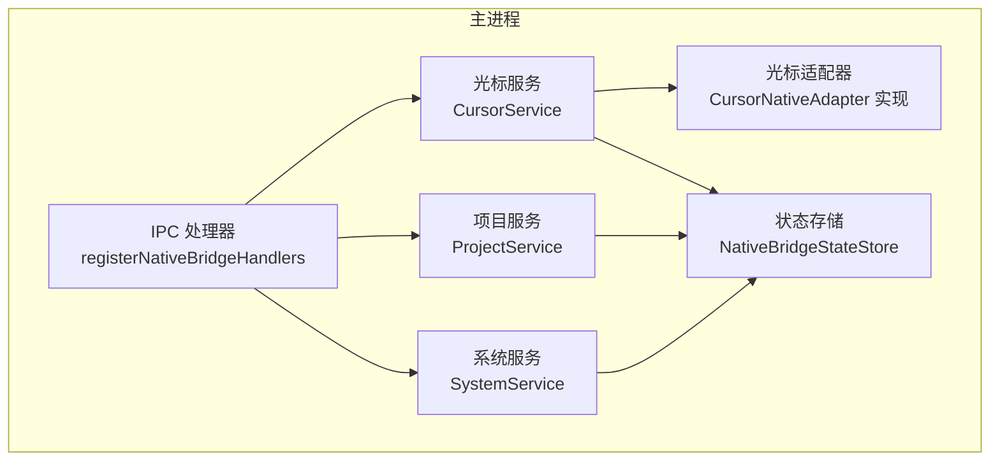
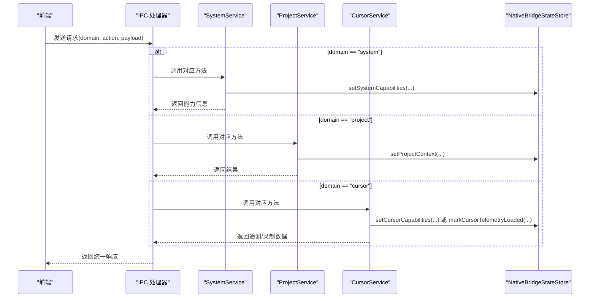
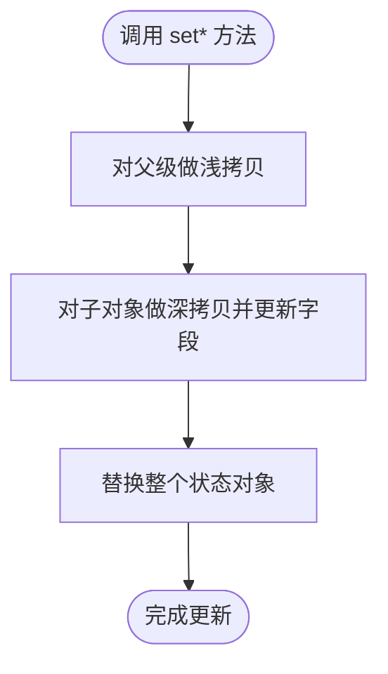
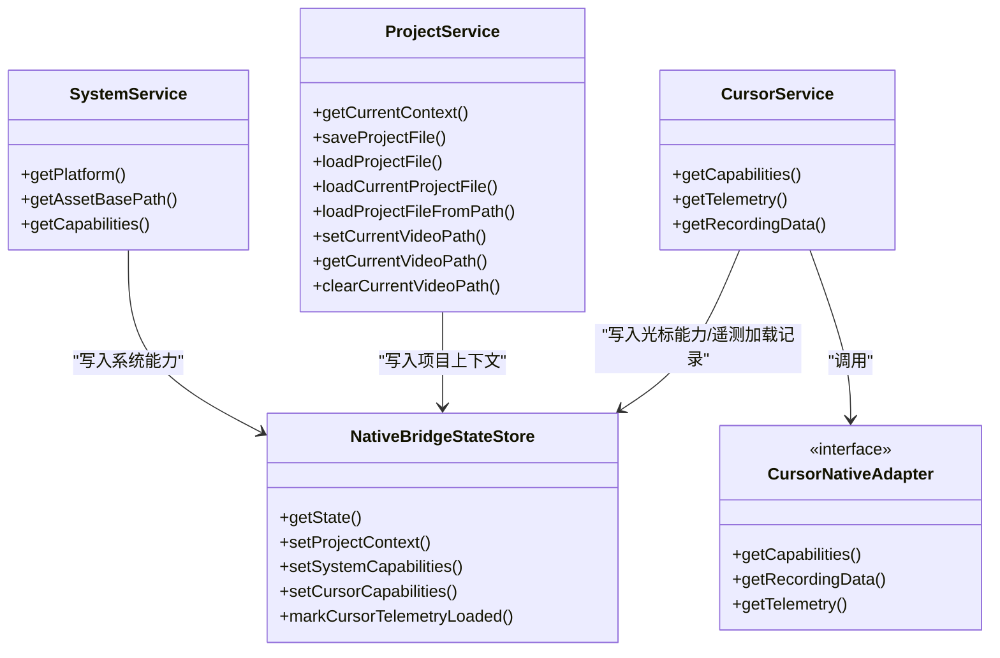

# 状态管理

<cite>
**本文引用的文件**
- [electron\native-bridge\store.ts](file://electron\native-bridge\store.ts)
- [electron\native-bridge\services\systemService.ts](file://electron\native-bridge\services\systemService.ts)
- [electron\native-bridge\services\projectService.ts](file://electron\native-bridge\services\projectService.ts)
- [electron\native-bridge\services\cursorService.ts](file://electron\native-bridge\services\cursorService.ts)
- [electron\native-bridge\cursor\adapter.ts](file://electron\native-bridge\cursor\adapter.ts)
- [electron\native-bridge\cursor\telemetryCursorAdapter.ts](file://electron\native-bridge\cursor\telemetryCursorAdapter.ts)
- [electron\ipc\nativeBridge.ts](file://electron\ipc\nativeBridge.ts)
- [src\native\contracts.ts](file://src\native\contracts.ts)
</cite>

## 目录
1. [引言](#引言)
2. [项目结构](#项目结构)
3. [核心组件](#核心组件)
4. [架构总览](#架构总览)
5. [详细组件分析](#详细组件分析)
6. [依赖关系分析](#依赖关系分析)
7. [性能考量](#性能考量)
8. [故障排除指南](#故障排除指南)
9. [结论](#结论)
10. [附录](#附录)

## 引言
本文件系统性阐述 OpenScreen 原生桥接（Native Bridge）的状态管理体系，重点围绕 NativeBridgeStateStore 的设计理念与实现机制展开，覆盖状态结构定义、接口约束与数据校验、状态更新流程（变更监听、事件传播与副作用）、持久化策略（本地存储、备份与恢复），并给出状态管理最佳实践与调试排障建议。目标是帮助开发者在 Electron 主进程与前端之间建立清晰、可维护且高性能的状态通道。

## 项目结构
Native Bridge 状态管理位于 Electron 主进程侧，采用“状态存储 + 服务层 + IPC 处理器”的分层组织方式：
- 状态存储：NativeBridgeStateStore 负责持有与更新全局状态
- 服务层：SystemService、ProjectService、CursorService 封装业务能力，并在必要时写回状态
- 适配器层：CursorNativeAdapter 及其实现（如 TelemetryCursorAdapter）负责与底层能力交互
- IPC 层：registerNativeBridgeHandlers 统一接收请求并路由到对应服务

图表来源
- [electron\ipc\nativeBridge.ts:92-122](file://electron\ipc\nativeBridge.ts#L92-L122)
- [electron\native-bridge\store.ts:24-87](file://electron\native-bridge\store.ts#L24-L87)
- [electron\native-bridge\services\systemService.ts:16-42](file://electron\native-bridge\services\systemService.ts#L16-L42)
- [electron\native-bridge\services\projectService.ts:25-87](file://electron\native-bridge\services\projectService.ts#L25-L87)
- [electron\native-bridge\services\cursorService.ts:14-46](file://electron\native-bridge\services\cursorService.ts#L14-L46)
- [electron\native-bridge\cursor\telemetryCursorAdapter.ts:10-48](file://electron\native-bridge\cursor\telemetryCursorAdapter.ts#L10-L48)

章节来源
- [electron\ipc\nativeBridge.ts:92-122](file://electron\ipc\nativeBridge.ts#L92-L122)

## 核心组件
- NativeBridgeStateStore：不可变式深拷贝更新的状态容器，提供只读访问与受控写入方法
- 服务层：
  - SystemService：聚合平台、桥版本、光标能力等系统能力信息，并写入状态
  - ProjectService：封装项目上下文（当前工程路径、当前视频路径）的读取与写入
  - CursorService：封装光标能力查询、遥测加载与录制数据获取，并记录最近一次遥测加载信息
- 适配器层：
  - CursorNativeAdapter：抽象光标能力与数据加载接口
  - TelemetryCursorAdapter：基于给定回调加载遥测与录制数据的适配器实现

章节来源
- [electron\native-bridge\store.ts:8-87](file://electron\native-bridge\store.ts#L8-L87)
- [electron\native-bridge\services\systemService.ts:16-42](file://electron\native-bridge\services\systemService.ts#L16-L42)
- [electron\native-bridge\services\projectService.ts:25-87](file://electron\native-bridge\services\projectService.ts#L25-L87)
- [electron\native-bridge\services\cursorService.ts:14-46](file://electron\native-bridge\services\cursorService.ts#L14-L46)
- [electron\native-bridge\cursor\adapter.ts:15-20](file://electron\native-bridge\cursor\adapter.ts#L15-L20)
- [electron\native-bridge\cursor\telemetryCursorAdapter.ts:10-48](file://electron\native-bridge\cursor\telemetryCursorAdapter.ts#L10-L48)

## 架构总览
下图展示 IPC 请求从主进程进入后，如何被路由到各服务并最终更新状态存储：

图表来源
- [electron\ipc\nativeBridge.ts:124-235](file://electron\ipc\nativeBridge.ts#L124-L235)
- [electron\native-bridge\services\systemService.ts:27-41](file://electron\native-bridge\services\systemService.ts#L27-L41)
- [electron\native-bridge\services\projectService.ts:28-35](file://electron\native-bridge\services\projectService.ts#L28-L35)
- [electron\native-bridge\services\cursorService.ts:17-35](file://electron\native-bridge\services\cursorService.ts#L17-L35)
- [electron\native-bridge\store.ts:48-87](file://electron\native-bridge\store.ts#L48-L87)

## 详细组件分析

### 状态结构与接口设计
- NativeBridgeState 类型定义
  - 字段分区：system、project、cursor
  - system.platform：平台标识；system.capabilities：系统能力聚合
  - project：当前工程路径与当前视频路径
  - cursor.capabilities：光标能力；cursor.lastTelemetryLoad：最近一次遥测加载记录（含视频路径、采样数、时间戳）
- 字段约束与数据验证
  - 所有字段为可空或可选，便于在能力未就绪或无数据时保持安全状态
  - lastTelemetryLoad 中的 loadedAt 使用时间戳，便于后续去重与缓存控制
- 接口契约
  - contracts.ts 定义了桥版本号、平台枚举、能力对象、遥测点与录制数据等核心类型，作为跨层一致的数据模型

章节来源
- [electron\native-bridge\store.ts:8-22](file://electron\native-bridge\store.ts#L8-L22)
- [src\native\contracts.ts:1-69](file://src\native\contracts.ts#L1-L69)

### 状态更新机制
- 更新入口
  - SystemService.getCapabilities：聚合系统能力后写入 system.capabilities
  - ProjectService.getCurrentContext：读取当前工程/视频路径并写入 project
  - CursorService.getCapabilities/getTelemetry/getRecordingData：分别写入 cursor.capabilities 与 cursor.lastTelemetryLoad
- 不可变更新策略
  - Store 通过浅拷贝父级与深拷贝子对象的方式进行状态替换，避免直接修改引用导致的副作用
- 副作用处理
  - 在 CursorService 中，当成功加载遥测或录制数据时，会根据当前视频路径标记最近一次加载，用于上层判断是否需要重新计算或渲染

图表来源
- [electron\native-bridge\store.ts:48-87](file://electron\native-bridge\store.ts#L48-L87)

章节来源
- [electron\native-bridge\services\systemService.ts:27-41](file://electron\native-bridge\services\systemService.ts#L27-L41)
- [electron\native-bridge\services\projectService.ts:28-35](file://electron\native-bridge\services\projectService.ts#L28-L35)
- [electron\native-bridge\services\cursorService.ts:23-35](file://electron\native-bridge\services\cursorService.ts#L23-L35)
- [electron\native-bridge\store.ts:48-87](file://electron\native-bridge\store.ts#L48-L87)

### 状态持久化方案
- 当前实现
  - 状态存储为内存态，仅在主进程生命周期内存在
- 持久化建议
  - 本地存储策略：将 NativeBridgeState 序列化后写入用户目录下的 JSON 文件，启动时读取并合并到初始状态
  - 数据备份与恢复：在关键节点（如切换项目、加载遥测）触发快照保存；若检测到异常退出，可在下次启动时尝试恢复
  - 版本迁移：随 contracts.ts 中桥版本号变化，提供状态迁移器以兼容旧格式
- 注意事项
  - 避免在状态中存放大体积数据（如遥测样本数组），建议仅保留轻量指针或路径
  - 对于敏感路径，确保在序列化时进行脱敏或相对化处理

章节来源
- [electron\native-bridge\store.ts:27-42](file://electron\native-bridge\store.ts#L27-L42)
- [src\native\contracts.ts:1-2](file://src\native\contracts.ts#L1-L2)

### 状态调试与故障排除
- 调试工具
  - 在开发模式下暴露 getState 访问器，便于在 IPC 处理器或服务内部打印当前状态快照
  - 在 CursorService 中记录 lastTelemetryLoad，可用于定位遥测加载是否成功及时间点
- 常见问题与排查
  - 系统能力为空：确认 SystemService 是否已执行 getCapabilities 并写入状态
  - 项目上下文不正确：检查 ProjectService.getCurrentContext 是否在关键操作后被调用
  - 遥测加载失败：检查 TelemetryCursorAdapter 的 resolveVideoPath 与 loadTelemetry 回调是否返回有效路径与数据
  - IPC 错误响应：关注 registerNativeBridgeHandlers 的错误分支，区分 INVALID_REQUEST、UNSUPPORTED_ACTION、INTERNAL_ERROR

章节来源
- [electron\native-bridge\services\systemService.ts:27-41](file://electron\native-bridge\services\systemService.ts#L27-L41)
- [electron\native-bridge\services\projectService.ts:28-35](file://electron\native-bridge\services\projectService.ts#L28-L35)
- [electron\native-bridge\services\cursorService.ts:23-35](file://electron\native-bridge\services\cursorService.ts#L23-L35)
- [electron\native-bridge\cursor\telemetryCursorAdapter.ts:37-48](file://electron\native-bridge\cursor\telemetryCursorAdapter.ts#L37-L48)
- [electron\ipc\nativeBridge.ts:124-235](file://electron\ipc\nativeBridge.ts#L124-L235)

## 依赖关系分析
- 组件耦合
  - 服务层依赖状态存储（写入能力），但不直接依赖 IPC，降低耦合度
  - 适配器层与服务层解耦，便于替换不同平台的实现
- 外部依赖
  - contracts.ts 提供跨层统一类型定义，保证前后端与主进程间契约稳定
- 循环依赖
  - 未发现循环依赖迹象；IPC 处理器仅单向依赖服务与存储

图表来源
- [electron\native-bridge\store.ts:24-87](file://electron\native-bridge\store.ts#L24-L87)
- [electron\native-bridge\services\systemService.ts:16-42](file://electron\native-bridge\services\systemService.ts#L16-L42)
- [electron\native-bridge\services\projectService.ts:25-87](file://electron\native-bridge\services\projectService.ts#L25-L87)
- [electron\native-bridge\services\cursorService.ts:14-46](file://electron\native-bridge\services\cursorService.ts#L14-L46)
- [electron\native-bridge\cursor\adapter.ts:15-20](file://electron\native-bridge\cursor\adapter.ts#L15-L20)

章节来源
- [electron\native-bridge\store.ts:24-87](file://electron\native-bridge\store.ts#L24-L87)
- [electron\native-bridge\services\systemService.ts:16-42](file://electron\native-bridge\services\systemService.ts#L16-L42)
- [electron\native-bridge\services\projectService.ts:25-87](file://electron\native-bridge\services\projectService.ts#L25-L87)
- [electron\native-bridge\services\cursorService.ts:14-46](file://electron\native-bridge\services\cursorService.ts#L14-L46)
- [electron\native-bridge\cursor\adapter.ts:15-20](file://electron\native-bridge\cursor\adapter.ts#L15-L20)

## 性能考量
- 状态更新
  - 使用不可变式深拷贝更新，避免共享引用引发的竞态；对于大型对象，建议拆分状态域，减少不必要的复制
- 数据体量
  - 遥测样本与录制数据体积较大，建议仅在需要时加载，或采用分页/抽样策略
- 缓存与去重
  - 利用 lastTelemetryLoad 的 loadedAt 与 videoPath 进行缓存键生成，避免重复加载
- 渲染与订阅
  - 若未来引入响应式订阅，建议采用细粒度订阅（按域/字段）以降低广播开销

## 故障排除指南
- IPC 请求无效
  - 现象：收到 INVALID_REQUEST
  - 排查：确认请求体包含 domain 与 action 字段，且类型正确
- 不支持的动作或域
  - 现象：UNSUPPORTED_ACTION
  - 排查：核对 domain 与 action 是否在处理器中注册
- 内部错误
  - 现象：INTERNAL_ERROR（可能带 retryable 标记）
  - 排查：查看服务层抛出的具体异常，优先检查适配器回调与路径解析逻辑
- 状态不一致
  - 现象：项目上下文或光标能力缺失
  - 排查：确认对应服务方法是否在关键流程中被调用并写入状态

章节来源
- [electron\ipc\nativeBridge.ts:83-90](file://electron\ipc\nativeBridge.ts#L83-L90)
- [electron\ipc\nativeBridge.ts:124-235](file://electron\ipc\nativeBridge.ts#L124-L235)

## 结论
NativeBridgeStateStore 以简洁的不可变更新策略实现了主进程侧状态集中管理，配合服务层与适配器层形成清晰的职责边界。当前实现为内存态，建议在不影响现有行为的前提下逐步引入持久化与版本迁移机制，并结合缓存与订阅策略提升性能与可观测性。

## 附录
- 关键类型与常量
  - 桥通道与版本：NATIVE_BRIDGE_CHANNEL、NATIVE_BRIDGE_VERSION
  - 平台枚举：NativePlatform
  - 光标能力与数据：CursorCapabilities、CursorRecordingData、CursorTelemetryPoint
- 最佳实践清单
  - 状态隔离：按域划分状态字段，避免跨域耦合
  - 性能优化：延迟加载大体量数据，使用缓存键去重
  - 内存管理：及时清理不再使用的样本与中间结果
  - 可观测性：在关键路径输出状态快照与时间戳，便于定位问题

章节来源
- [src\native\contracts.ts:1-69](file://src\native\contracts.ts#L1-L69)
- [electron\native-bridge\store.ts:27-42](file://electron\native-bridge\store.ts#L27-L42)