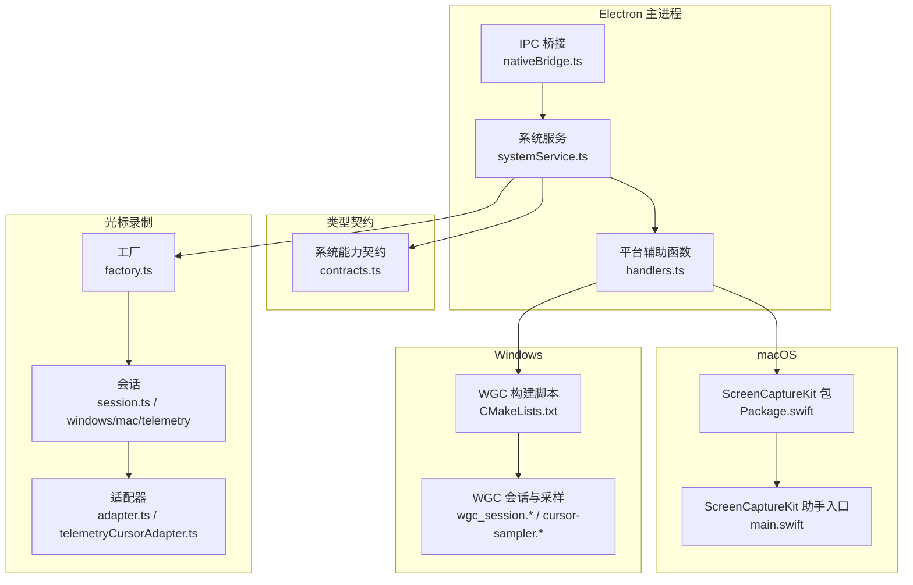
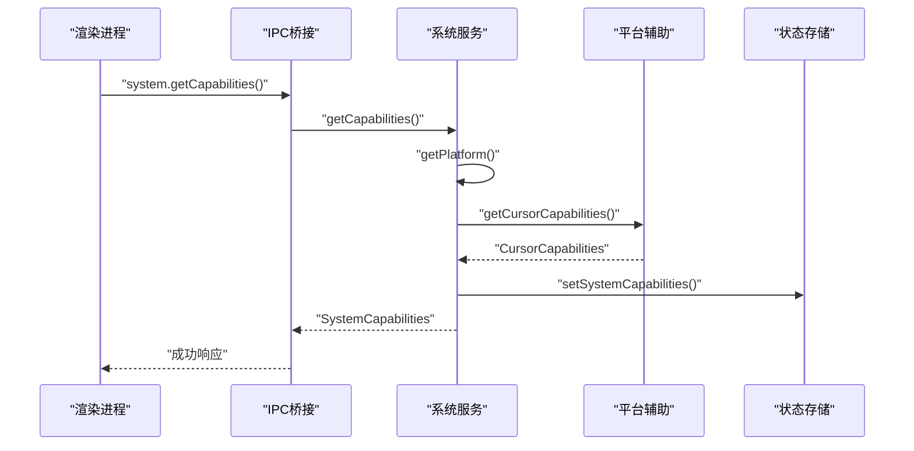
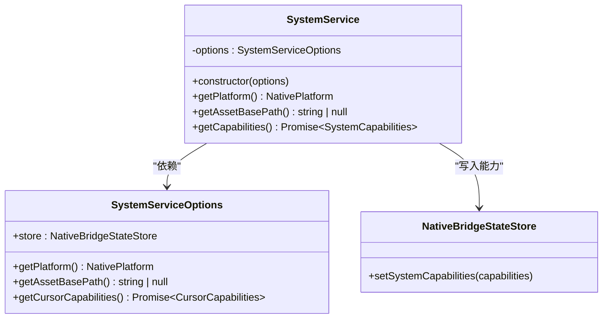
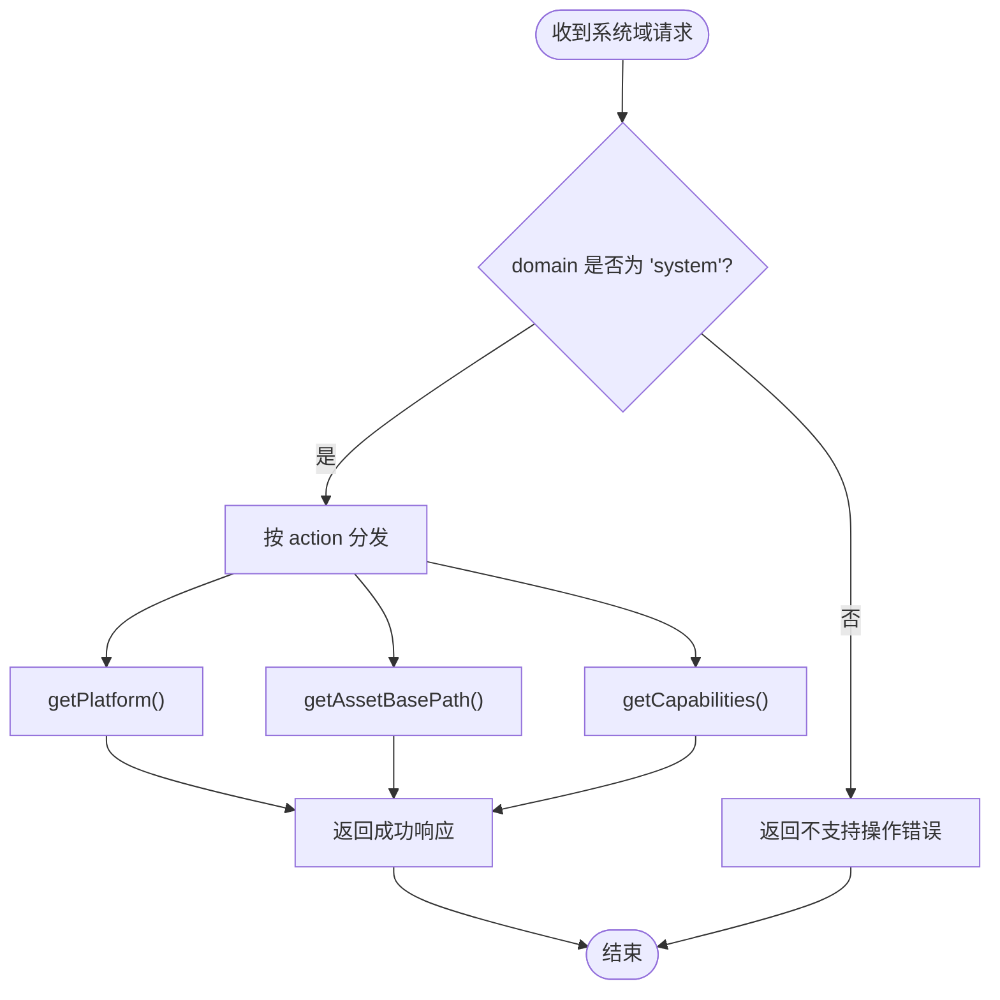
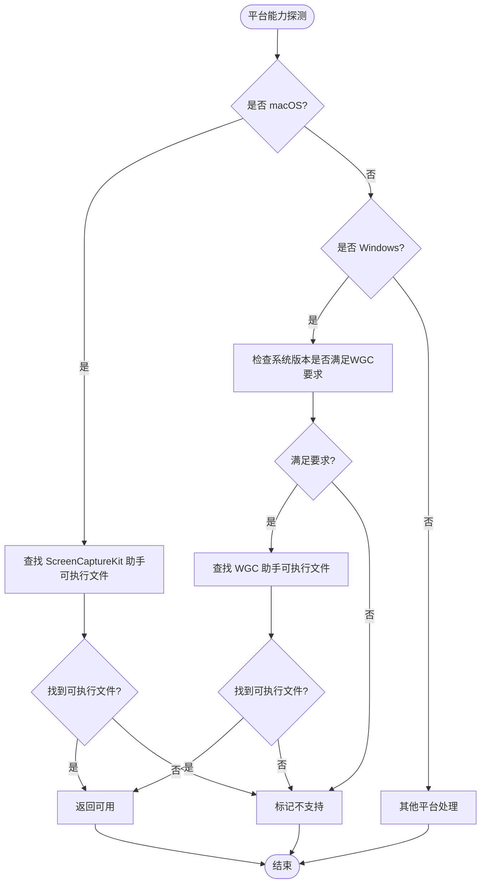
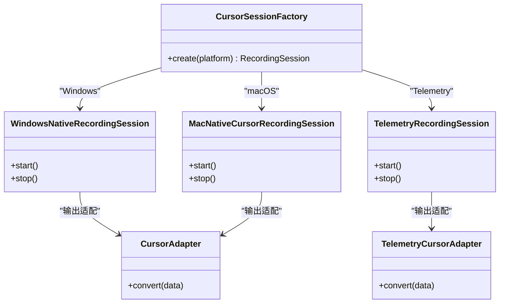
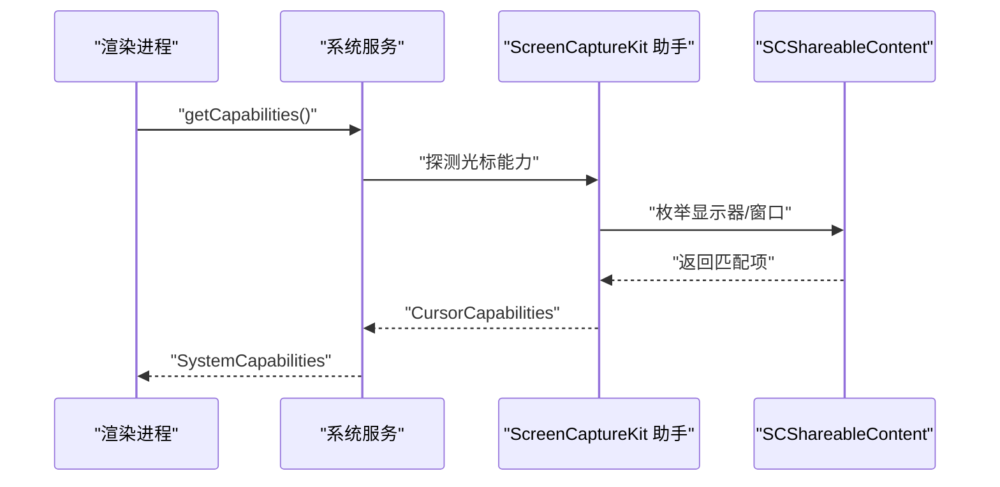
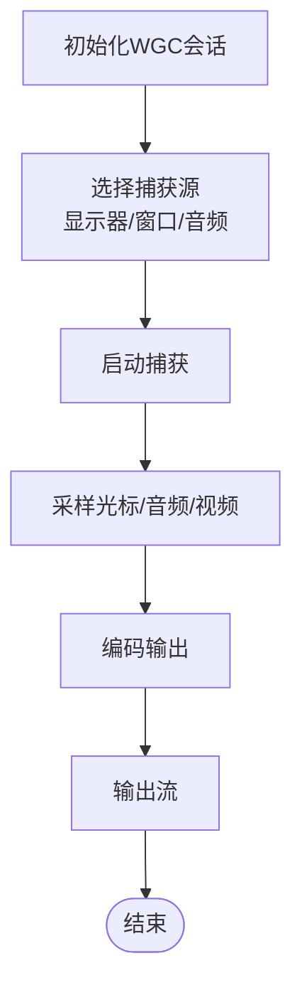
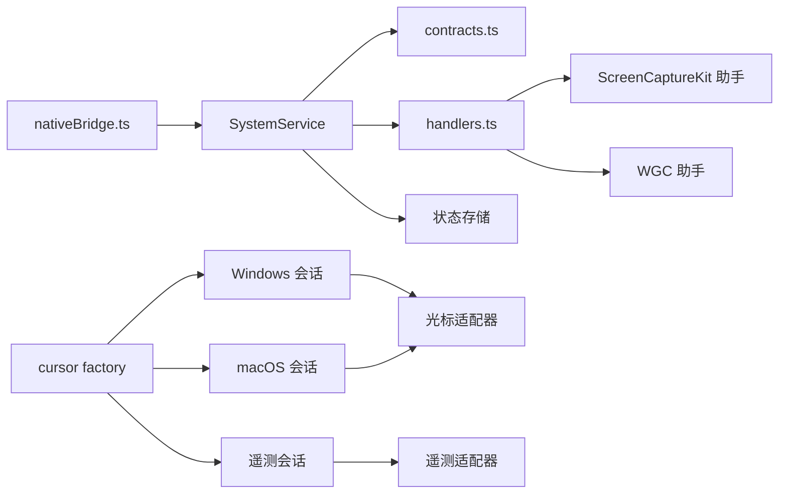

# 系统服务

<cite>
**本文引用的文件**
- [electron\native-bridge\services\systemService.ts](file://electron\native-bridge\services\systemService.ts)
- [electron\ipc\nativeBridge.ts](file://electron\ipc\nativeBridge.ts)
- [src\native\contracts.ts](file://src\native\contracts.ts)
- [electron\native\screencapturekit\Sources\OpenScreenScreenCaptureKitHelper\main.swift](file://electron\native\screencapturekit\Sources\OpenScreenScreenCaptureKitHelper\main.swift)
- [electron\ipc\handlers.ts](file://electron\ipc\handlers.ts)
- [electron\native-bridge\cursor\recording\factory.ts](file://electron\native-bridge\cursor\recording\factory.ts)
- [electron\native-bridge\cursor\adapter.ts](file://electron\native-bridge\cursor\adapter.ts)
- [electron\native-bridge\cursor\telemetryCursorAdapter.ts](file://electron\native-bridge\cursor\telemetryCursorAdapter.ts)
- [electron\native-bridge\cursor\recording\session.ts](file://electron\native-bridge\cursor\recording\session.ts)
- [electron\native-bridge\cursor\recording\windowsNativeRecordingSession.ts](file://electron\native-bridge\cursor\recording\windowsNativeRecordingSession.ts)
- [electron\native-bridge\cursor\recording\macNativeCursorRecordingSession.ts](file://electron\native-bridge\cursor\recording\macNativeCursorRecordingSession.ts)
- [electron\native-bridge\cursor\recording\telemetryRecordingSession.ts](file://electron\native-bridge\cursor\recording\telemetryRecordingSession.ts)
- [electron\native-bridge\cursor\recording\windowsNativeRecordingSession.types.ts](file://electron\native-bridge\cursor\recording\windowsNativeRecordingSession.types.ts)
- [electron\native\screencapturekit\Package.swift](file://electron\native\screencapturekit\Package.swift)
- [electron\native\wgc-capture\CMakeLists.txt](file://electron\native\wgc-capture\CMakeLists.txt)
- [electron\native\wgc-capture\src\wgc_session.h](file://electron\native\wgc-capture\src\wgc_session.h)
- [electron\native\wgc-capture\src\wgc_session.cpp](file://electron\native\wgc-capture\src\wgc_session.cpp)
- [electron\native\wgc-capture\src\cursor-sampler.cpp](file://electron\native\wgc-capture\src\cursor-sampler.cpp)
- [electron\native\wgc-capture\src\cursor-sampler.h](file://electron\native\wgc-capture\src\cursor-sampler.h)
- [electron\native\wgc-capture\src\audio_sample_utils.cpp](file://electron\native\wgc-capture\src\audio_sample_utils.cpp)
- [electron\native\wgc-capture\src\audio_sample_utils.h](file://electron\native\wgc-capture\src\audio_sample_utils.h)
- [electron\native\wgc-capture\src\monitor_utils.cpp](file://electron\native\wgc-capture\src\monitor_utils.cpp)
- [electron\native\wgc-capture\src\monitor_utils.h](file://electron\native\wgc-capture\src\monitor_utils.h)
- [electron\native\wgc-capture\src\webcam_capture.cpp](file://electron\native\wgc-capture\src\webcam_capture.cpp)
- [electron\native\wgc-capture\src\webcam_capture.h](file://electron\native\wgc-capture\src\webcam_capture.h)
- [electron\native\wgc-capture\src\wasapi_loopback_capture.cpp](file://electron\native\wgc-capture\src\wasapi_loopback_capture.cpp)
- [electron\native\wgc-capture\src\wasapi_loopback_capture.h](file://electron\native\wgc-capture\src\wasapi_loopback_capture.h)
- [electron\native\wgc-capture\src\dshow_webcam_capture.cpp](file://electron\native\wgc-capture\src\dshow_webcam_capture.cpp)
- [electron\native\wgc-capture\src\dshow_webcam_capture.h](file://electron\native\wgc-capture\src\dshow_webcam_capture.h)
- [electron\native\wgc-capture\src\mf_encoder.cpp](file://electron\native\wgc-capture\src\mf_encoder.cpp)
- [electron\native\wgc-capture\src\mf_encoder.h](file://electron\native\wgc-capture\src\mf_encoder.h)
- [electron\native\wgc-capture\src\main.cpp](file://electron\native\wgc-capture\src\main.cpp)
- [scripts\build-macos-screencapturekit-helper.mjs](file://scripts\build-macos-screencapturekit-helper.mjs)
- [scripts\build-windows-wgc-helper.mjs](file://scripts\build-windows-wgc-helper.mjs)
- [electron\native\README.md](file://electron\native\README.md)
</cite>

## 目录
1. [简介](#简介)
2. [项目结构](#项目结构)
3. [核心组件](#核心组件)
4. [架构总览](#架构总览)
5. [详细组件分析](#详细组件分析)
6. [依赖关系分析](#依赖关系分析)
7. [性能考量](#性能考量)
8. [故障排查指南](#故障排查指南)
9. [结论](#结论)
10. [附录](#附录)

## 简介
本文件聚焦OpenScreen系统中的系统服务（SystemService），系统服务负责向Electron渲染进程暴露系统能力与平台信息，并协调平台特定的捕获与光标录制能力。其核心职责包括：
- 平台识别与资产路径查询
- 能力检测与缓存（桥接版本、平台、光标能力、项目上下文）
- 与IPC层交互，响应系统域请求
- 协调平台特定的捕获助手与能力探测逻辑

系统服务通过统一接口屏蔽平台差异，向上提供一致的能力视图；同时在内部委托具体平台实现（如macOS ScreenCaptureKit、Windows Graphics Capture）以完成高保真屏幕与光标采集。

## 项目结构
围绕系统服务的关键目录与文件如下：
- Electron侧系统服务与IPC桥接：electron\native-bridge\services\systemService.ts、electron\ipc\nativeBridge.ts
- 类型契约：src\native\contracts.ts
- macOS ScreenCaptureKit辅助程序：electron\native\screencapturekit\Package.swift、Sources等
- Windows Graphics Capture辅助程序：electron\native\wgc-capture\CMakeLists.txt、src\*.cpp/.h
- 光标录制会话与适配器：electron\native-bridge\cursor\recording\*、electron\native-bridge\cursor\adapter.ts、telemetryCursorAdapter.ts
- 构建脚本：scripts\build-macos-screencapturekit-helper.mjs、scripts\build-windows-wgc-helper.mjs
- 辅助工具：electron\ipc\handlers.ts（平台能力探测、可执行文件定位）

**图表来源**
- [electron\ipc\nativeBridge.ts](file://electron\ipc\nativeBridge.ts)
- [electron\native-bridge\services\systemService.ts](file://electron\native-bridge\services\systemService.ts)
- [src\native\contracts.ts](file://src\native\contracts.ts)
- [electron\native\screencapturekit\Package.swift](file://electron\native\screencapturekit\Package.swift)
- [electron\native\wgc-capture\CMakeLists.txt](file://electron\native\wgc-capture\CMakeLists.txt)
- [electron\native-bridge\cursor\recording\factory.ts](file://electron\native-bridge\cursor\recording\factory.ts)
- [electron\native-bridge\cursor\adapter.ts](file://electron\native-bridge\cursor\adapter.ts)
- [electron\native-bridge\cursor\telemetryCursorAdapter.ts](file://electron\native-bridge\cursor\telemetryCursorAdapter.ts)
- [electron\native-bridge\cursor\recording\session.ts](file://electron\native-bridge\cursor\recording\session.ts)
- [electron\native-bridge\cursor\recording\windowsNativeRecordingSession.ts](file://electron\native-bridge\cursor\recording\windowsNativeRecordingSession.ts)
- [electron\native-bridge\cursor\recording\macNativeCursorRecordingSession.ts](file://electron\native-bridge\cursor\recording\macNativeCursorRecordingSession.ts)
- [electron\native-bridge\cursor\recording\telemetryRecordingSession.ts](file://electron\native-bridge\cursor\recording\telemetryRecordingSession.ts)

**章节来源**
- [electron\ipc\nativeBridge.ts](file://electron\ipc\nativeBridge.ts)
- [electron\native-bridge\services\systemService.ts](file://electron\native-bridge\services\systemService.ts)
- [src\native\contracts.ts](file://src\native\contracts.ts)
- [electron\native\screencapturekit\Package.swift](file://electron\native\screencapturekit\Package.swift)
- [electron\native\wgc-capture\CMakeLists.txt](file://electron\native\wgc-capture\CMakeLists.txt)
- [electron\native-bridge\cursor\recording\factory.ts](file://electron\native-bridge\cursor\recording\factory.ts)
- [electron\native-bridge\cursor\adapter.ts](file://electron\native-bridge\cursor\adapter.ts)
- [electron\native-bridge\cursor\telemetryCursorAdapter.ts](file://electron\native-bridge\cursor\telemetryCursorAdapter.ts)
- [electron\native-bridge\cursor\recording\session.ts](file://electron\native-bridge\cursor\recording\session.ts)
- [electron\native-bridge\cursor\recording\windowsNativeRecordingSession.ts](file://electron\native-bridge\cursor\recording\windowsNativeRecordingSession.ts)
- [electron\native-bridge\cursor\recording\macNativeCursorRecordingSession.ts](file://electron\native-bridge\cursor\recording\macNativeCursorRecordingSession.ts)
- [electron\native-bridge\cursor\recording\telemetryRecordingSession.ts](file://electron\native-bridge\cursor\recording\telemetryRecordingSession.ts)

## 核心组件
- 系统服务（SystemService）
  - 提供平台查询、资产路径查询、能力检测与缓存
  - 将能力视图写入本地状态存储，供后续会话复用
- IPC桥接（nativeBridge.ts）
  - 解析系统域请求，分发到SystemService
  - 统一成功/失败响应格式
- 类型契约（contracts.ts）
  - 定义SystemCapabilities、CursorCapabilities、NativePlatform等核心类型
- 平台辅助（handlers.ts）
  - macOS：定位ScreenCaptureKit辅助可执行文件、探测可用显示器/窗口
  - Windows：判断系统版本是否满足WGC要求、定位WGC辅助可执行文件
- 光标录制子系统
  - 工厂与会话：根据平台选择macOS或Windows原生光标录制
  - 适配器：将底层数据转换为上层可用格式

**章节来源**
- [electron\native-bridge\services\systemService.ts](file://electron\native-bridge\services\systemService.ts)
- [electron\ipc\nativeBridge.ts](file://electron\ipc\nativeBridge.ts)
- [src\native\contracts.ts](file://src\native\contracts.ts)
- [electron\ipc\handlers.ts](file://electron\ipc\handlers.ts)
- [electron\native-bridge\cursor\recording\factory.ts](file://electron\native-bridge\cursor\recording\factory.ts)
- [electron\native-bridge\cursor\recording\windowsNativeRecordingSession.ts](file://electron\native-bridge\cursor\recording\windowsNativeRecordingSession.ts)
- [electron\native-bridge\cursor\recording\macNativeCursorRecordingSession.ts](file://electron\native-bridge\cursor\recording\macNativeCursorRecordingSession.ts)

## 架构总览
系统服务位于Electron主进程，通过IPC接收来自渲染层的系统域请求，调用SystemService进行处理，并将结果返回。SystemService聚合平台信息与光标能力，形成统一的能力视图并持久化到状态存储中，供后续录制流程使用。

**图表来源**
- [electron\ipc\nativeBridge.ts](file://electron\ipc\nativeBridge.ts)
- [electron\native-bridge\services\systemService.ts](file://electron\native-bridge\services\systemService.ts)
- [electron\ipc\handlers.ts](file://electron\ipc\handlers.ts)

## 详细组件分析

### 系统服务（SystemService）
- 职责
  - 返回当前平台标识
  - 返回资源基础路径（用于加载辅助程序、图标等）
  - 聚合系统能力：桥接版本、平台、光标能力、项目上下文
  - 将能力写入状态存储，供后续会话复用
- 关键点
  - 能力检测异步执行，确保光标能力探测完成后再返回
  - 使用桥接版本常量保证前后端一致性
  - 将能力写入store，避免重复探测

**图表来源**
- [electron\native-bridge\services\systemService.ts](file://electron\native-bridge\services\systemService.ts)
- [src\native\contracts.ts](file://src\native\contracts.ts)

**章节来源**
- [electron\native-bridge\services\systemService.ts](file://electron\native-bridge\services\systemService.ts)
- [src\native\contracts.ts](file://src\native\contracts.ts)

### IPC桥接（nativeBridge.ts）
- 职责
  - 解析系统域请求（getPlatform、getAssetBasePath、getCapabilities）
  - 统一响应格式（成功/失败）
  - 对不支持的操作返回明确错误码
- 流程
  - 根据domain分发到对应服务
  - 调用SystemService对应方法
  - 包装响应并返回

**图表来源**
- [electron\ipc\nativeBridge.ts](file://electron\ipc\nativeBridge.ts)

**章节来源**
- [electron\ipc\nativeBridge.ts](file://electron\ipc\nativeBridge.ts)

### 平台辅助（handlers.ts）
- macOS ScreenCaptureKit
  - 候选路径解析：优先环境变量，其次解包应用路径，再其次打包资源路径
  - 可执行文件存在性校验（可执行权限）
  - 显示器/窗口源解析：从SCShareableContent中匹配目标
- Windows Graphics Capture
  - 系统版本判断：要求Windows 10 19041+（Build号）
  - 可执行文件定位：同macOS候选策略
- 辅助程序定位
  - 通过多次尝试不同候选路径，提升部署灵活性

**图表来源**
- [electron\ipc\handlers.ts](file://electron\ipc\handlers.ts)
- [electron\native\screencapturekit\Sources\OpenScreenScreenCaptureKitHelper\main.swift](file://electron\native\screencapturekit\Sources\OpenScreenScreenCaptureKitHelper\main.swift)

**章节来源**
- [electron\ipc\handlers.ts](file://electron\ipc\handlers.ts)
- [electron\native\screencapturekit\Sources\OpenScreenScreenCaptureKitHelper\main.swift](file://electron\native\screencapturekit\Sources\OpenScreenScreenCaptureKitHelper\main.swift)

### 光标录制子系统
- 工厂模式
  - 根据平台选择macOS或Windows原生光标录制会话
- 会话类型
  - Windows：基于WGC的原生录制会话
  - macOS：基于ScreenCaptureKit的原生录制会话
  - Telemetry：遥测模式下的光标数据采集
- 适配器
  - 将底层光标数据转换为上层可用格式
- 数据流
  - 会话采集 -> 适配器转换 -> 上层消费

**图表来源**
- [electron\native-bridge\cursor\recording\factory.ts](file://electron\native-bridge\cursor\recording\factory.ts)
- [electron\native-bridge\cursor\recording\windowsNativeRecordingSession.ts](file://electron\native-bridge\cursor\recording\windowsNativeRecordingSession.ts)
- [electron\native-bridge\cursor\recording\macNativeCursorRecordingSession.ts](file://electron\native-bridge\cursor\recording\macNativeCursorRecordingSession.ts)
- [electron\native-bridge\cursor\recording\telemetryRecordingSession.ts](file://electron\native-bridge\cursor\recording\telemetryRecordingSession.ts)
- [electron\native-bridge\cursor\adapter.ts](file://electron\native-bridge\cursor\adapter.ts)
- [electron\native-bridge\cursor\telemetryCursorAdapter.ts](file://electron\native-bridge\cursor\telemetryCursorAdapter.ts)

**章节来源**
- [electron\native-bridge\cursor\recording\factory.ts](file://electron\native-bridge\cursor\recording\factory.ts)
- [electron\native-bridge\cursor\recording\windowsNativeRecordingSession.ts](file://electron\native-bridge\cursor\recording\windowsNativeRecordingSession.ts)
- [electron\native-bridge\cursor\recording\macNativeCursorRecordingSession.ts](file://electron\native-bridge\cursor\recording\macNativeCursorRecordingSession.ts)
- [electron\native-bridge\cursor\recording\telemetryRecordingSession.ts](file://electron\native-bridge\cursor\recording\telemetryRecordingSession.ts)
- [electron\native-bridge\cursor\adapter.ts](file://electron\native-bridge\cursor\adapter.ts)
- [electron\native-bridge\cursor\telemetryCursorAdapter.ts](file://electron\native-bridge\cursor\telemetryCursorAdapter.ts)

### 平台特定功能封装

#### macOS ScreenCaptureKit集成
- 助手程序
  - Swift实现，负责与ScreenCaptureKit交互
  - 支持显示器与窗口两种捕获源
  - 源解析：根据displayId或windowId匹配SCShareableContent
- 捕获目标构建
  - 从SCShareableContent构造SCContentFilter
  - 计算捕获尺寸（考虑显示器像素与fallback参数）
- 错误处理
  - 源缺失、未找到目标等场景抛出异常并返回给调用方

**图表来源**
- [electron\native\screencapturekit\Sources\OpenScreenScreenCaptureKitHelper\main.swift](file://electron\native\screencapturekit\Sources\OpenScreenScreenCaptureKitHelper\main.swift)

**章节来源**
- [electron\native\screencapturekit\Sources\OpenScreenScreenCaptureKitHelper\main.swift](file://electron\native\screencapturekit\Sources\OpenScreenScreenCaptureKitHelper\main.swift)

#### Windows Graphics Capture集成
- 构建与依赖
  - CMake工程，编译为WGC辅助可执行文件
  - 依赖多媒体框架（Media Foundation、DirectShow等）
- 核心模块
  - 会话管理：wgc_session.*
  - 光标采样：cursor-sampler.*
  - 音频采样：audio_sample_utils.*
  - 监视器工具：monitor_utils.*
  - 摄像头捕获：webcam_capture.*、dshow_webcam_capture.*
  - 编码器：mf_encoder.*
- 运行时流程
  - 初始化会话 -> 选择捕获源 -> 启动捕获 -> 采样光标/音频/视频 -> 编码输出

**图表来源**
- [electron\native\wgc-capture\src\wgc_session.cpp](file://electron\native\wgc-capture\src\wgc_session.cpp)
- [electron\native\wgc-capture\src\cursor-sampler.cpp](file://electron\native\wgc-capture\src\cursor-sampler.cpp)
- [electron\native\wgc-capture\src\audio_sample_utils.cpp](file://electron\native\wgc-capture\src\audio_sample_utils.cpp)
- [electron\native\wgc-capture\src\monitor_utils.cpp](file://electron\native\wgc-capture\src\monitor_utils.cpp)
- [electron\native\wgc-capture\src\webcam_capture.cpp](file://electron\native\wgc-capture\src\webcam_capture.cpp)
- [electron\native\wgc-capture\src\mf_encoder.cpp](file://electron\native\wgc-capture\src\mf_encoder.cpp)

**章节来源**
- [electron\native\wgc-capture\CMakeLists.txt](file://electron\native\wgc-capture\CMakeLists.txt)
- [electron\native\wgc-capture\src\wgc_session.cpp](file://electron\native\wgc-capture\src\wgc_session.cpp)
- [electron\native\wgc-capture\src\cursor-sampler.cpp](file://electron\native\wgc-capture\src\cursor-sampler.cpp)
- [electron\native\wgc-capture\src\audio_sample_utils.cpp](file://electron\native\wgc-capture\src\audio_sample_utils.cpp)
- [electron\native\wgc-capture\src\monitor_utils.cpp](file://electron\native\wgc-capture\src\monitor_utils.cpp)
- [electron\native\wgc-capture\src\webcam_capture.cpp](file://electron\native\wgc-capture\src\webcam_capture.cpp)
- [electron\native\wgc-capture\src\mf_encoder.cpp](file://electron\native\wgc-capture\src\mf_encoder.cpp)

### 系统状态管理
- 能力缓存
  - SystemService在生成SystemCapabilities后写入状态存储
  - 后续会话可直接读取，避免重复探测
- 状态读取
  - 渲染层通过系统域请求获取能力视图
- 环境变量与路径
  - macOS：可通过环境变量指定ScreenCaptureKit助手路径
  - 多候选路径策略提升部署鲁棒性
- 运行时监控
  - 平台辅助函数对可执行文件存在性与权限进行实时校验

**章节来源**
- [electron\native-bridge\services\systemService.ts](file://electron\native-bridge\services\systemService.ts)
- [electron\ipc\nativeBridge.ts](file://electron\ipc\nativeBridge.ts)
- [electron\ipc\handlers.ts](file://electron\ipc\handlers.ts)

### 权限申请流程与安全策略
- macOS ScreenCaptureKit
  - 需要用户授权（屏幕录制、辅助功能等）
  - 助手程序作为受信进程执行捕获任务
- Windows Graphics Capture
  - 需要适当的UWP/桌面权限
  - 会话初始化前进行系统版本与权限校验
- 安全策略
  - 仅在具备权限且可执行文件存在时启用对应能力
  - 通过严格错误码与日志上报问题

**章节来源**
- [electron\ipc\handlers.ts](file://electron\ipc\handlers.ts)
- [electron\native\screencapturekit\Sources\OpenScreenScreenCaptureKitHelper\main.swift](file://electron\native\screencapturekit\Sources\OpenScreenScreenCaptureKitHelper\main.swift)
- [electron\native\wgc-capture\src\wgc_session.cpp](file://electron\native\wgc-capture\src\wgc_session.cpp)

### 错误处理机制
- IPC层
  - 不支持的操作返回明确错误码
  - 异常捕获并包装为错误响应
- 平台辅助
  - 文件存在性与权限检查失败时返回null或错误
- 系统服务
  - 能力探测失败时返回部分能力或降级能力
- 光标录制
  - 会话启动失败时回退到遥测模式或禁用光标

**章节来源**
- [electron\ipc\nativeBridge.ts](file://electron\ipc\nativeBridge.ts)
- [electron\ipc\handlers.ts](file://electron\ipc\handlers.ts)
- [electron\native-bridge\services\systemService.ts](file://electron\native-bridge\services\systemService.ts)

### 平台差异处理与功能降级策略
- 平台差异
  - macOS：ScreenCaptureKit；Windows：Graphics Capture
  - 资产路径与可执行文件定位策略不同
- 功能降级
  - 若WGC不可用则降级至遥测光标
  - 若ScreenCaptureKit不可用则禁用对应捕获源
- 兼容性验证
  - 版本检查（Windows Build号）、可执行文件存在性与权限检查

**章节来源**
- [electron\ipc\handlers.ts](file://electron\ipc\handlers.ts)
- [electron\native-bridge\cursor\recording\telemetryRecordingSession.ts](file://electron\native-bridge\cursor\recording\telemetryRecordingSession.ts)

## 依赖关系分析
- SystemService依赖
  - 平台信息提供者（getPlatform、getAssetBasePath）
  - 光标能力探测器（异步）
  - 状态存储（写入能力）
- IPC桥接依赖
  - SystemService实例
  - 统一响应构造器
- 平台辅助依赖
  - 文件系统访问（fs.access）
  - 系统版本信息（process.getSystemVersion）
- 光标录制依赖
  - 工厂根据平台选择具体会话
  - 适配器将底层数据转换为上层格式

**图表来源**
- [electron\native-bridge\services\systemService.ts](file://electron\native-bridge\services\systemService.ts)
- [src\native\contracts.ts](file://src\native\contracts.ts)
- [electron\ipc\nativeBridge.ts](file://electron\ipc\nativeBridge.ts)
- [electron\ipc\handlers.ts](file://electron\ipc\handlers.ts)
- [electron\native-bridge\cursor\recording\factory.ts](file://electron\native-bridge\cursor\recording\factory.ts)
- [electron\native-bridge\cursor\adapter.ts](file://electron\native-bridge\cursor\adapter.ts)
- [electron\native-bridge\cursor\telemetryCursorAdapter.ts](file://electron\native-bridge\cursor\telemetryCursorAdapter.ts)

**章节来源**
- [electron\native-bridge\services\systemService.ts](file://electron\native-bridge\services\systemService.ts)
- [electron\ipc\nativeBridge.ts](file://electron\ipc\nativeBridge.ts)
- [electron\ipc\handlers.ts](file://electron\ipc\handlers.ts)
- [electron\native-bridge\cursor\recording\factory.ts](file://electron\native-bridge\cursor\recording\factory.ts)
- [electron\native-bridge\cursor\adapter.ts](file://electron\native-bridge\cursor\adapter.ts)
- [electron\native-bridge\cursor\telemetryCursorAdapter.ts](file://electron\native-bridge\cursor\telemetryCursorAdapter.ts)

## 性能考量
- 能力缓存
  - SystemCapabilities写入状态存储，减少重复探测开销
- 异步能力探测
  - 光标能力异步获取，避免阻塞主线程
- 路径候选优化
  - 优先环境变量与解包路径，减少IO查找次数
- 会话生命周期
  - 仅在需要时启动捕获会话，及时释放资源

## 故障排查指南
- 无法获取系统能力
  - 检查IPC请求是否正确发送到系统域
  - 查看SystemCapabilities是否已写入状态存储
- macOS ScreenCaptureKit不可用
  - 确认ScreenCaptureKit助手可执行文件存在且有执行权限
  - 检查环境变量OPENSCREEN_SCK_CAPTURE_EXE是否正确设置
  - 验证用户授权状态（屏幕录制、辅助功能）
- Windows Graphics Capture不可用
  - 检查系统版本是否满足19041+
  - 确认WGC助手可执行文件存在且有执行权限
  - 验证UWP/桌面权限配置
- 光标录制异常
  - 切换到遥测模式确认问题是否与原生捕获相关
  - 检查会话初始化日志与错误码

**章节来源**
- [electron\ipc\nativeBridge.ts](file://electron\ipc\nativeBridge.ts)
- [electron\ipc\handlers.ts](file://electron\ipc\handlers.ts)
- [electron\native-bridge\services\systemService.ts](file://electron\native-bridge\services\systemService.ts)
- [electron\native-bridge\cursor\recording\telemetryRecordingSession.ts](file://electron\native-bridge\cursor\recording\telemetryRecordingSession.ts)

## 结论
SystemService通过统一接口屏蔽平台差异，向上提供一致的系统能力视图，并与平台特定的捕获助手协同工作。其设计强调：
- 能力缓存与异步探测，降低开销
- 严格的权限与兼容性校验，保障稳定性
- 工厂与适配器模式，便于扩展新平台与新能力
在实际部署中，建议结合环境变量与多候选路径策略，确保在不同环境下均能稳定启用对应平台能力。

## 附录
- 构建脚本
  - macOS ScreenCaptureKit助手：scripts\build-macos-screencapturekit-helper.mjs
  - Windows WGC助手：scripts\build-windows-wgc-helper.mjs
- 原生说明
  - electron\native\README.md

**章节来源**
- [scripts\build-macos-screencapturekit-helper.mjs](file://scripts\build-macos-screencapturekit-helper.mjs)
- [scripts\build-windows-wgc-helper.mjs](file://scripts\build-windows-wgc-helper.mjs)
- [electron\native\README.md](file://electron\native\README.md)