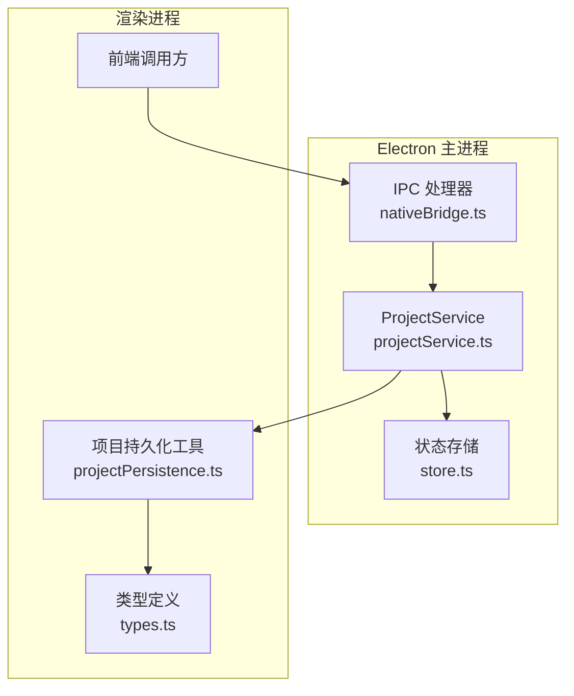
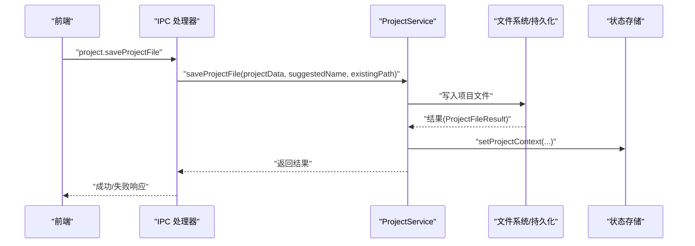
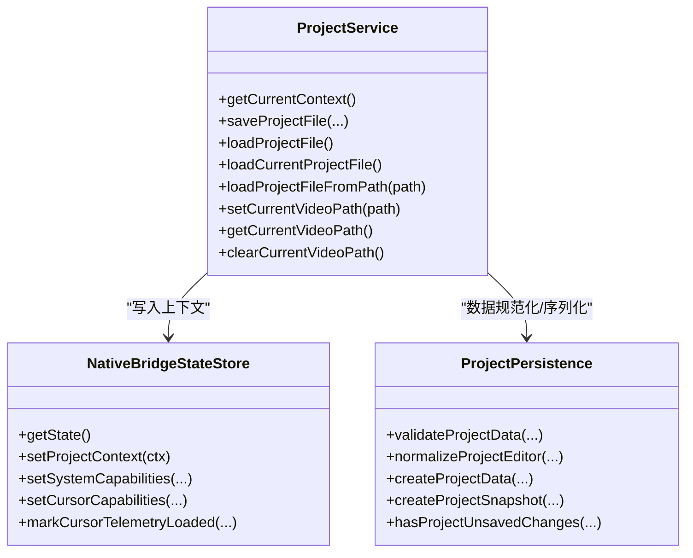

# 项目服务

<cite>
**本文引用的文件**
- [projectService.ts](file://electron/native-bridge/services/projectService.ts)
- [projectPersistence.ts](file://src/components/video-editor/projectPersistence.ts)
- [types.ts](file://src/components/video-editor/types.ts)
- [store.ts](file://electron/native-bridge/store.ts)
- [contracts.ts](file://src/native/contracts.ts)
- [nativeBridge.ts](file://electron/ipc/nativeBridge.ts)
- [projectPersistence.test.ts](file://src/components/video-editor/projectPersistence.test.ts)
</cite>

## 目录
1. [简介](#简介)
2. [项目结构](#项目结构)
3. [核心组件](#核心组件)
4. [架构总览](#架构总览)
5. [组件详解](#组件详解)
6. [依赖关系分析](#依赖关系分析)
7. [性能考量](#性能考量)
8. [故障排查指南](#故障排查指南)
9. [结论](#结论)
10. [附录](#附录)

## 简介
本文件面向OpenScreen项目的“项目服务”（ProjectService），系统性阐述其在应用中的职责与实现机制，覆盖以下主题：
- 项目文件管理：创建、保存、加载与清理流程
- 数据序列化与持久化策略：JSON快照、版本控制与兼容性处理
- 项目上下文管理：当前项目路径、视频文件路径与状态同步
- 数据结构设计：ProjectContext接口、数据校验与规范化
- 生命周期管理：从创建到清理的全链路行为
- 文件格式规范、迁移策略与错误恢复机制
- 实际使用示例与最佳实践

## 项目结构
ProjectService位于原生桥接层，通过IPC通道接收前端请求并协调底层文件系统与状态存储；项目数据由编辑器侧进行序列化与规范化，并通过统一的ProjectContext暴露给前端。

图表来源
- [nativeBridge.ts:92-236](file://electron/ipc/nativeBridge.ts#L92-L236)
- [projectService.ts:25-87](file://electron/native-bridge/services/projectService.ts#L25-L87)
- [store.ts:24-88](file://electron/native-bridge/store.ts#L24-L88)
- [projectPersistence.ts:67-99](file://src/components/video-editor/projectPersistence.ts#L67-L99)
- [types.ts:62-90](file://src/components/video-editor/types.ts#L62-L90)

章节来源
- [nativeBridge.ts:92-236](file://electron/ipc/nativeBridge.ts#L92-L236)
- [projectService.ts:25-87](file://electron/native-bridge/services/projectService.ts#L25-L87)
- [store.ts:24-88](file://electron/native-bridge/store.ts#L24-L88)
- [projectPersistence.ts:67-99](file://src/components/video-editor/projectPersistence.ts#L67-L99)
- [types.ts:62-90](file://src/components/video-editor/types.ts#L62-L90)

## 核心组件
- ProjectService：封装项目上下文获取与文件操作，负责将结果写入状态存储并返回统一响应。
- 项目持久化工具：负责项目数据的校验、规范化、快照生成与版本控制。
- 类型与常量：定义项目编辑器状态、区域类型、默认值与约束范围。
- 状态存储：维护系统、项目与光标能力等全局状态，确保上下文一致。
- IPC处理器：将前端请求路由到对应服务，统一响应格式。

章节来源
- [projectService.ts:25-87](file://electron/native-bridge/services/projectService.ts#L25-L87)
- [projectPersistence.ts:193-215](file://src/components/video-editor/projectPersistence.ts#L193-L215)
- [types.ts:62-90](file://src/components/video-editor/types.ts#L62-L90)
- [store.ts:24-88](file://electron/native-bridge/store.ts#L24-L88)
- [nativeBridge.ts:152-194](file://electron/ipc/nativeBridge.ts#L152-L194)

## 架构总览
ProjectService作为桥接层的核心，向上承接IPC请求，向下协调文件系统与状态存储。项目数据在渲染进程侧完成序列化与规范化，再交由ProjectService执行具体操作。

图表来源
- [nativeBridge.ts:158-165](file://electron/ipc/nativeBridge.ts#L158-L165)
- [projectService.ts:38-50](file://electron/native-bridge/services/projectService.ts#L38-L50)
- [contracts.ts:84-91](file://src/native/contracts.ts#L84-L91)

章节来源
- [nativeBridge.ts:152-194](file://electron/ipc/nativeBridge.ts#L152-L194)
- [projectService.ts:28-86](file://electron/native-bridge/services/projectService.ts#L28-L86)
- [contracts.ts:76-91](file://src/native/contracts.ts#L76-L91)

## 组件详解

### 1) ProjectService：项目上下文与文件操作
- 职责
  - 获取当前项目上下文（当前项目路径、当前视频路径）
  - 执行项目文件保存、加载与清理
  - 在每次操作后刷新状态存储中的ProjectContext
- 关键方法
  - getCurrentContext：聚合上下文并写入状态存储
  - saveProjectFile/loadProjectFile/loadCurrentProjectFile/loadProjectFileFromPath：委派底层实现并刷新上下文
  - setCurrentVideoPath/getCurrentVideoPath/clearCurrentVideoPath：管理视频路径并刷新上下文
- 返回类型
  - 项目路径/文件结果遵循统一接口，包含success、path、project、message、canceled、error等字段

章节来源
- [projectService.ts:25-87](file://electron/native-bridge/services/projectService.ts#L25-L87)
- [contracts.ts:76-91](file://src/native/contracts.ts#L76-L91)

### 2) 项目数据结构与序列化
- 数据模型
  - EditorProjectData：包含version、media、editor三部分
  - ProjectEditorState：编辑器状态，含壁纸、裁剪、缩放、变速、标注、TTS等区域与布局参数
- 序列化与快照
  - createProjectSnapshot：对编辑器状态进行规范化后生成JSON字符串
  - createProjectData：设置版本号并组合媒体与编辑器状态
- 版本控制
  - PROJECT_VERSION：当前版本号，用于迁移与兼容判断
- 校验与规范化
  - validateProjectData：基础结构校验
  - normalizeProjectEditor：对数值范围、枚举值、区域边界、布局预设等进行安全归一化
  - resolveProjectMedia：兼容旧版单视频路径与新版多视频媒体对象

章节来源
- [projectPersistence.ts:67-99](file://src/components/video-editor/projectPersistence.ts#L67-L99)
- [projectPersistence.ts:193-215](file://src/components/video-editor/projectPersistence.ts#L193-L215)
- [projectPersistence.ts:217-543](file://src/components/video-editor/projectPersistence.ts#L217-L543)
- [projectPersistence.ts:545-561](file://src/components/video-editor/projectPersistence.ts#L545-L561)
- [projectPersistence.ts:65](file://src/components/video-editor/projectPersistence.ts#L65)

### 3) 项目上下文管理
- ProjectContext接口
  - currentProjectPath：当前项目文件路径或空
  - currentVideoPath：当前视频文件路径或空
- 状态存储
  - NativeBridgeStateStore：维护系统、项目、光标能力等全局状态
  - setProjectContext：更新项目上下文并合并到全局状态
- IPC集成
  - registerNativeBridgeHandlers：注册项目域动作，将请求分发至ProjectService

章节来源
- [contracts.ts:71-74](file://src/native/contracts.ts#L71-L74)
- [store.ts:8-22](file://electron/native-bridge/store.ts#L8-L22)
- [store.ts:48-53](file://electron/native-bridge/store.ts#L48-L53)
- [nativeBridge.ts:92-108](file://electron/ipc/nativeBridge.ts#L92-L108)

### 4) 项目生命周期管理
- 创建
  - 通过createProjectData与createProjectSnapshot生成初始项目数据
- 加载
  - loadProjectFile/loadCurrentProjectFile/loadProjectFileFromPath：从系统读取并解析项目文件
  - normalizeProjectEditor：对加载的数据进行规范化与兼容性修复
- 保存
  - saveProjectFile：将规范化后的项目数据写回文件系统
- 清理
  - clearCurrentVideoPath：清空当前视频路径
  - setCurrentVideoPath：可选设置新的视频路径

章节来源
- [projectPersistence.ts:545-561](file://src/components/video-editor/projectPersistence.ts#L545-L561)
- [projectPersistence.ts:217-543](file://src/components/video-editor/projectPersistence.ts#L217-L543)
- [projectService.ts:38-86](file://electron/native-bridge/services/projectService.ts#L38-L86)

### 5) 文件格式规范与迁移策略
- 文件格式
  - JSON：顶层包含version、media、editor
  - media：支持screenVideoPath与webcamVideoPath
  - editor：包含布局、特效、区域等完整编辑状态
- 迁移策略
  - 旧版单视频路径兼容：resolveProjectMedia自动转换为media对象
  - 壁纸路径兼容：对打包资源路径进行重写，保证跨平台一致性
  - 版本号：PROJECT_VERSION用于标识当前数据格式版本
- 错误恢复
  - 规范化函数对越界值、非法枚举进行裁剪或回退默认值
  - 对用户自定义路径不作无差别替换，仅对已知安装布局进行安全重写

章节来源
- [projectPersistence.ts:202-215](file://src/components/video-editor/projectPersistence.ts#L202-L215)
- [projectPersistence.ts:58-63](file://src/components/video-editor/projectPersistence.ts#L58-L63)
- [projectPersistence.ts:65](file://src/components/video-editor/projectPersistence.ts#L65)
- [projectPersistence.ts:217-543](file://src/components/video-editor/projectPersistence.ts#L217-L543)

### 6) 使用示例与最佳实践
- 示例场景
  - 保存项目：调用saveProjectFile传入规范化后的项目数据与可选建议名
  - 加载项目：调用loadProjectFile或loadProjectFileFromPath，随后通过getCurrentContext获取最新上下文
  - 设置视频路径：setCurrentVideoPath并在完成后刷新上下文
- 最佳实践
  - 持久化前务必调用normalizeProjectEditor，确保数据合法且可迁移
  - 使用createProjectSnapshot比较快照，检测未保存更改
  - 避免直接修改旧版字段（如videoPath），优先使用media对象
  - 对外部路径进行fromFileUrl/toFileUrl转换，保持跨平台一致性

章节来源
- [projectPersistence.ts:545-561](file://src/components/video-editor/projectPersistence.ts#L545-L561)
- [projectPersistence.ts:193-215](file://src/components/video-editor/projectPersistence.ts#L193-L215)
- [projectPersistence.ts:159-181](file://src/components/video-editor/projectPersistence.ts#L159-L181)
- [projectService.ts:38-86](file://electron/native-bridge/services/projectService.ts#L38-L86)

## 依赖关系分析
- 组件耦合
  - ProjectService依赖NativeBridgeStateStore进行上下文写入
  - 项目持久化工具独立于服务层，便于单元测试与复用
  - IPC处理器集中路由项目域动作，降低上层复杂度
- 外部依赖
  - Electron IPC通道与请求/响应元数据
  - 文件系统读写与路径转换工具

图表来源
- [projectService.ts:25-87](file://electron/native-bridge/services/projectService.ts#L25-L87)
- [store.ts:24-88](file://electron/native-bridge/store.ts#L24-L88)
- [projectPersistence.ts:193-561](file://src/components/video-editor/projectPersistence.ts#L193-L561)

章节来源
- [projectService.ts:25-87](file://electron/native-bridge/services/projectService.ts#L25-L87)
- [store.ts:24-88](file://electron/native-bridge/store.ts#L24-L88)
- [projectPersistence.ts:193-561](file://src/components/video-editor/projectPersistence.ts#L193-L561)

## 性能考量
- 序列化成本
  - createProjectSnapshot基于JSON.stringify，建议在变更频繁时按需触发，避免高频重复序列化
- 规范化开销
  - normalizeProjectEditor对大量区域与参数进行裁剪与校验，建议批量处理或在后台线程执行
- 路径转换
  - toFileUrl/fromFileUrl涉及URL解析与编码，建议缓存常用转换结果
- 上下文刷新
  - 每次文件操作后刷新状态存储，注意避免不必要的重复写入

## 故障排查指南
- 常见问题
  - 无法加载旧版项目：确认resolveProjectMedia是否正确识别videoPath并转换为media对象
  - 壁纸路径异常：检查是否属于已知安装布局，非匹配路径不会被重写
  - 快照比较无效：确保createProjectSnapshot前后使用相同的规范化流程
- 定位手段
  - 使用validateProjectData快速判断数据结构是否合法
  - 通过单元测试用例定位规范化逻辑的边界条件
- 错误码参考
  - INVALID_REQUEST/UNSUPPORTED_ACTION/INTERNAL_ERROR：IPC层统一错误响应

章节来源
- [projectPersistence.ts:193-215](file://src/components/video-editor/projectPersistence.ts#L193-L215)
- [projectPersistence.test.ts:12-267](file://src/components/video-editor/projectPersistence.test.ts#L12-L267)
- [nativeBridge.ts:227-234](file://electron/ipc/nativeBridge.ts#L227-L234)

## 结论
ProjectService通过清晰的职责划分与统一的状态管理，实现了项目上下文与文件操作的解耦；配合渲染进程侧的规范化与序列化工具，形成了稳定、可迁移且易扩展的项目数据管线。遵循本文的最佳实践与迁移策略，可在保证兼容性的前提下持续演进项目格式与功能。

## 附录
- 关键接口与类型
  - ProjectContext：currentProjectPath/currentVideoPath
  - ProjectFileResult/ProjectPathResult：统一返回结构
  - EditorProjectData/ProjectEditorState：项目数据模型
- 测试要点
  - 兼容性：旧版videoPath与新版media对象
  - 规范化：边界值、非法枚举、布局预设
  - 路径重写：打包资源路径与开发布局

章节来源
- [contracts.ts:71-91](file://src/native/contracts.ts#L71-L91)
- [types.ts:62-90](file://src/components/video-editor/types.ts#L62-L90)
- [projectPersistence.test.ts:12-267](file://src/components/video-editor/projectPersistence.test.ts#L12-L267)