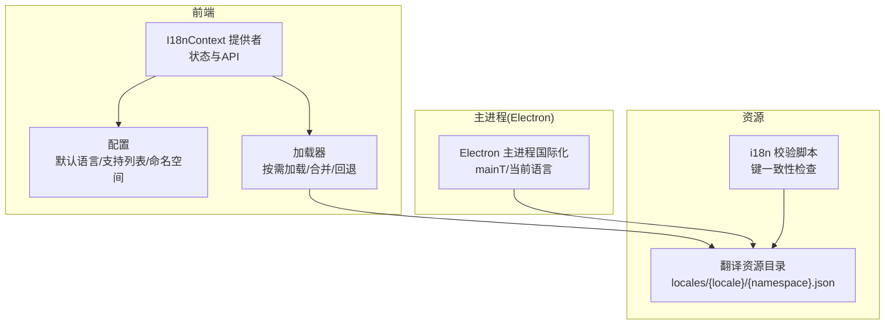
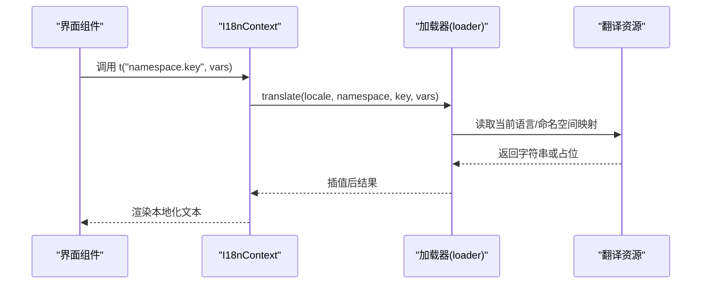
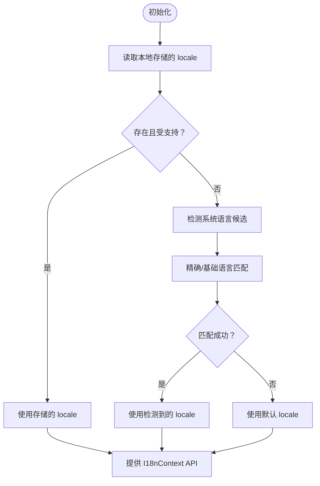
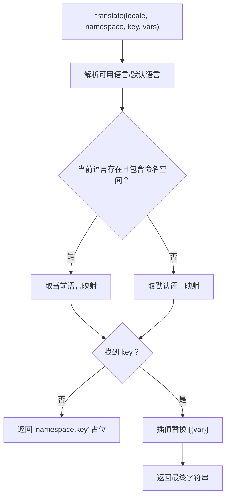
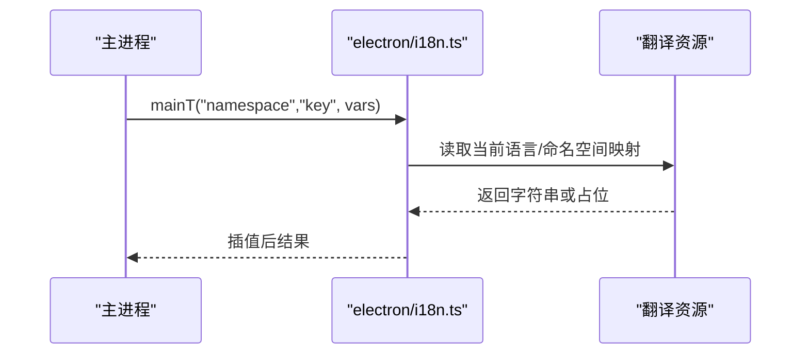
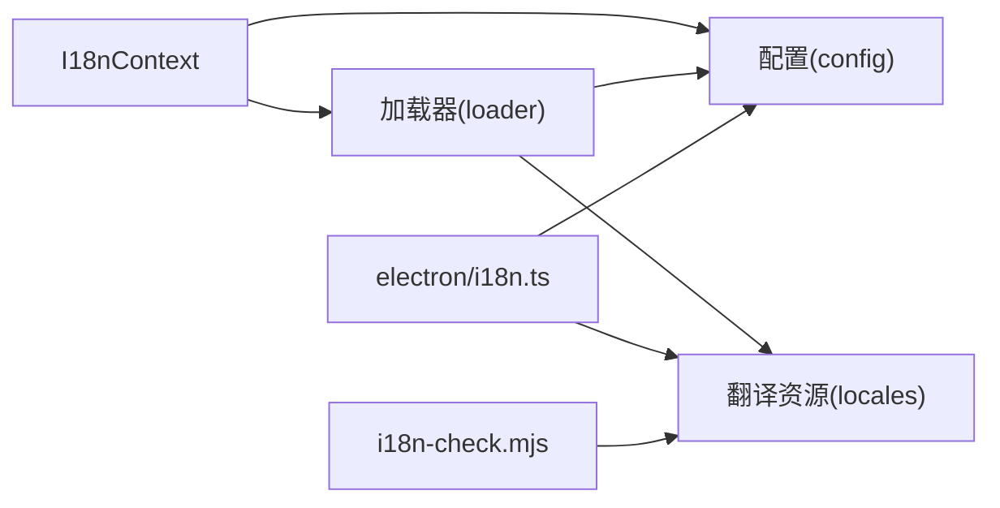

# 国际化系统

<cite>
**本文引用的文件**
- [src/contexts/I18nContext.tsx](file://src/contexts/I18nContext.tsx)
- [src/i18n/config.ts](file://src/i18n/config.ts)
- [src/i18n/loader.ts](file://src/i18n/loader.ts)
- [electron/i18n.ts](file://electron/i18n.ts)
- [scripts/i18n-check.mjs](file://scripts/i18n-check.mjs)
</cite>

## 目录
1. [简介](#简介)
2. [项目结构](#项目结构)
3. [核心组件](#核心组件)
4. [架构总览](#架构总览)
5. [组件详解](#组件详解)
6. [依赖关系分析](#依赖关系分析)
7. [性能考量](#性能考量)
8. [故障排查指南](#故障排查指南)
9. [结论](#结论)
10. [附录](#附录)

## 简介
本文件系统性阐述 OpenScreen 的国际化（I18n）体系，覆盖前端 React 上下文与 Electron 主进程的双端实现，解释语言切换机制、翻译资源组织、按需加载与缓存策略、错误处理与质量保障流程，并提供最佳实践与常见问题解决方案。

## 项目结构
国际化相关代码主要分布在以下位置：
- 前端上下文与加载器：src/contexts/I18nContext.tsx、src/i18n/config.ts、src/i18n/loader.ts
- 主进程国际化支持：electron/i18n.ts
- 翻译校验脚本：scripts/i18n-check.mjs
- 翻译资源目录：src/i18n/locales/{locale}/{namespace}.json（如 common.json、dialogs.json、editor.json 等）

图表来源
- [src/contexts/I18nContext.tsx:88-193](file://src/contexts/I18nContext.tsx#L88-L193)
- [src/i18n/config.ts:1-30](file://src/i18n/config.ts#L1-L30)
- [src/i18n/loader.ts:38-125](file://src/i18n/loader.ts#L38-L125)
- [electron/i18n.ts:81-111](file://electron/i18n.ts#L81-L111)
- [scripts/i18n-check.mjs:1-48](file://scripts/i18n-check.mjs#L1-L48)

章节来源
- [src/contexts/I18nContext.tsx:88-193](file://src/contexts/I18nContext.tsx#L88-L193)
- [src/i18n/config.ts:1-30](file://src/i18n/config.ts#L1-L30)
- [src/i18n/loader.ts:38-125](file://src/i18n/loader.ts#L38-L125)
- [electron/i18n.ts:81-111](file://electron/i18n.ts#L81-L111)
- [scripts/i18n-check.mjs:1-48](file://scripts/i18n-check.mjs#L1-L48)

## 核心组件
- I18nContext 提供者：负责语言状态、系统语言建议、翻译函数与设置语言的 API。
- 加载器（loader）：负责按需加载指定语言与命名空间的翻译，提供回退逻辑与插值替换。
- 配置（config）：定义默认语言、支持的语言列表、命名空间集合与存储键名。
- 主进程国际化（electron/i18n.ts）：提供主进程侧的翻译函数与当前语言查询。
- 校验脚本（scripts/i18n-check.mjs）：确保各语言的命名空间键结构一致。

章节来源
- [src/contexts/I18nContext.tsx:16-42](file://src/contexts/I18nContext.tsx#L16-L42)
- [src/i18n/loader.ts:96-125](file://src/i18n/loader.ts#L96-L125)
- [src/i18n/config.ts:17-29](file://src/i18n/config.ts#L17-L29)
- [electron/i18n.ts:100-111](file://electron/i18n.ts#L100-L111)
- [scripts/i18n-check.mjs:14-25](file://scripts/i18n-check.mjs#L14-L25)

## 架构总览
前端通过 I18nContext 暴露 t 函数与 setLocale；加载器根据命名空间与键查找翻译，并在缺失时回退到默认语言。主进程通过 electron/i18n.ts 提供 mainT 以本地化菜单、对话框与系统通知等。

图表来源
- [src/contexts/I18nContext.tsx:160-169](file://src/contexts/I18nContext.tsx#L160-L169)
- [src/i18n/loader.ts:111-125](file://src/i18n/loader.ts#L111-L125)

章节来源
- [src/contexts/I18nContext.tsx:160-169](file://src/contexts/I18nContext.tsx#L160-L169)
- [src/i18n/loader.ts:111-125](file://src/i18n/loader.ts#L111-L125)

## 组件详解

### I18nContext 上下文
- 角色与职责
  - 管理当前语言 locale 与系统语言建议 systemLocaleSuggestion
  - 提供 setLocale 切换语言与 t 翻译函数
  - 支持接受/忽略/解决系统语言建议
- 初始化与持久化
  - 从本地存储读取上次选择的语言；若不可用则回退到默认语言
  - 首次加载时检测浏览器系统语言，生成建议并避免重复提示
- 语言匹配策略
  - 精确匹配、基础语言匹配（如 zh-CN 优先于 zh），以及回退到默认语言
- 翻译函数
  - t 接受“命名空间.键”的点号分隔格式，内部解析命名空间与键后调用加载器
  - 使用插值替换 {{var}} 占位符

图表来源
- [src/contexts/I18nContext.tsx:78-86](file://src/contexts/I18nContext.tsx#L78-L86)
- [src/contexts/I18nContext.tsx:48-76](file://src/contexts/I18nContext.tsx#L48-L76)
- [src/contexts/I18nContext.tsx:171-190](file://src/contexts/I18nContext.tsx#L171-L190)

章节来源
- [src/contexts/I18nContext.tsx:16-42](file://src/contexts/I18nContext.tsx#L16-L42)
- [src/contexts/I18nContext.tsx:78-86](file://src/contexts/I18nContext.tsx#L78-L86)
- [src/contexts/I18nContext.tsx:48-76](file://src/contexts/I18nContext.tsx#L48-L76)
- [src/contexts/I18nContext.tsx:160-169](file://src/contexts/I18nContext.tsx#L160-L169)

### 加载器（loader）
- 按需加载与可用语言筛选
  - 仅保留同时包含必需命名空间的可用语言
  - 对缺失必需命名空间的语言进行排除并记录错误
- 查找与回退
  - 先查当前语言的命名空间映射，再回退到默认语言
  - 若仍找不到，返回“命名空间.键”作为占位
- 插值替换
  - 支持 {{var}} 形式的变量替换，未提供的变量保持原样
- 查询辅助
  - getMessages 获取某语言某命名空间的映射
  - getLocaleName/getLocaleShort 获取语言显示名称与简写

图表来源
- [src/i18n/loader.ts:96-125](file://src/i18n/loader.ts#L96-L125)
- [src/i18n/loader.ts:58-64](file://src/i18n/loader.ts#L58-L64)
- [src/i18n/loader.ts:91-94](file://src/i18n/loader.ts#L91-L94)

章节来源
- [src/i18n/loader.ts:38-79](file://src/i18n/loader.ts#L38-L79)
- [src/i18n/loader.ts:96-125](file://src/i18n/loader.ts#L96-L125)
- [src/i18n/loader.ts:81-89](file://src/i18n/loader.ts#L81-L89)

### 配置（config）
- 默认语言与支持列表
  - 默认语言为 en
  - 支持语言包括：ar、es、fr、it、ja-JP、ko-KR、ru、tr、vi、pt-BR、zh-CN、zh-TW
- 命名空间集合
  - 包括 common、dialogs、editor、launch、settings、shortcuts、timeline
- 存储键名
  - 本地存储键用于持久化用户选择的语言

章节来源
- [src/i18n/config.ts:1-30](file://src/i18n/config.ts#L1-L30)

### 主进程国际化（electron/i18n.ts）
- 当前语言查询
  - getMainLocale 返回当前主进程语言
- 翻译函数
  - mainT(namespace, key, vars?) 与前端 t 类似，先查当前语言，再回退到英语
  - 支持插值替换
- 应用场景
  - 本地化菜单、对话框标题与按钮文本、系统通知消息

图表来源
- [electron/i18n.ts:100-111](file://electron/i18n.ts#L100-L111)
- [electron/i18n.ts:81-83](file://electron/i18n.ts#L81-L83)

章节来源
- [electron/i18n.ts:81-111](file://electron/i18n.ts#L81-L111)

### 翻译资源组织与命名空间
- 目录结构
  - src/i18n/locales/{locale}/{namespace}.json
- 常见命名空间
  - common：通用文案（如语言显示名、短名）
  - dialogs：对话框相关文案
  - editor：视频编辑器界面文案
  - launch：启动/计数界面文案
  - settings：设置面板文案
  - shortcuts：快捷键说明文案
  - timeline：时间轴相关文案
- 资源加载策略
  - 加载器按需读取指定命名空间；未包含的命名空间不会被加载
  - 通过校验脚本确保各语言的命名空间键结构一致

章节来源
- [src/i18n/config.ts:17-25](file://src/i18n/config.ts#L17-L25)
- [scripts/i18n-check.mjs:29-40](file://scripts/i18n-check.mjs#L29-L40)

### 翻译加载器实现细节
- 可用语言过滤
  - 仅保留包含所有必需命名空间的语言
  - 记录缺失命名空间的语言及其缺失项
- 错误处理
  - 对无效语言与缺失命名空间进行日志输出
- 性能与缓存
  - 通过按需加载减少初始体积
  - 未发现显式缓存实现，建议在上层组件中对频繁使用的命名空间进行缓存

章节来源
- [src/i18n/loader.ts:38-79](file://src/i18n/loader.ts#L38-L79)

### 翻译质量与维护流程
- 键结构一致性
  - 使用 i18n-check.mjs 对比各语言的命名空间键，确保与基准语言（默认语言）一致
- 新语言添加流程
  - 在 locales 下新增语言目录并补齐所有命名空间的 .json 文件
  - 运行校验脚本，修复缺失键后再上线
- 版本兼容性
  - 保持 common.json 中语言元信息稳定，避免破坏语言显示名与短名
  - 新增命名空间时同步更新配置与加载器的必需命名空间集合

章节来源
- [scripts/i18n-check.mjs:14-25](file://scripts/i18n-check.mjs#L14-L25)
- [src/i18n/config.ts:17-25](file://src/i18n/config.ts#L17-L25)

## 依赖关系分析
- I18nContext 依赖配置与加载器
- 加载器依赖翻译资源与配置
- 主进程国际化依赖翻译资源与当前语言状态
- 校验脚本独立运行，不直接参与运行时依赖

图表来源
- [src/contexts/I18nContext.tsx:11-12](file://src/contexts/I18nContext.tsx#L11-L12)
- [src/i18n/loader.ts:96-125](file://src/i18n/loader.ts#L96-L125)
- [electron/i18n.ts:100-111](file://electron/i18n.ts#L100-L111)
- [scripts/i18n-check.mjs:11-12](file://scripts/i18n-check.mjs#L11-L12)

章节来源
- [src/contexts/I18nContext.tsx:11-12](file://src/contexts/I18nContext.tsx#L11-L12)
- [src/i18n/loader.ts:96-125](file://src/i18n/loader.ts#L96-L125)
- [electron/i18n.ts:100-111](file://electron/i18n.ts#L100-L111)
- [scripts/i18n-check.mjs:11-12](file://scripts/i18n-check.mjs#L11-L12)

## 性能考量
- 按需加载
  - 仅加载当前所需命名空间，降低首屏体积
- 缓存建议
  - 在上层组件中缓存常用命名空间的翻译结果，减少重复查找
- 字符串插值
  - 插值操作为 O(n)（n 为变量数量），建议避免在高频渲染路径中大量重复插值
- 语言切换
  - 语言切换会触发上下文重渲染，建议批量更新 UI 并避免不必要的重渲染

## 故障排查指南
- 现象：界面出现“命名空间.键”占位
  - 可能原因：目标语言缺少该键或命名空间未包含在必需集合中
  - 处理步骤：检查对应语言的命名空间文件是否齐全；运行校验脚本确认键结构
- 现象：语言切换无效或回到默认语言
  - 可能原因：所选语言不在支持列表或未包含必需命名空间
  - 处理步骤：确认语言是否在支持列表；检查加载器的可用语言过滤逻辑
- 现象：插值变量未生效
  - 可能原因：变量名与模板不一致或未传入变量
  - 处理步骤：核对模板中的 {{var}} 与传入的变量键名一致

章节来源
- [src/i18n/loader.ts:111-125](file://src/i18n/loader.ts#L111-L125)
- [src/i18n/loader.ts:38-79](file://src/i18n/loader.ts#L38-L79)

## 结论
OpenScreen 的国际化系统采用“前端上下文 + 加载器 + 主进程国际化”的双端架构，通过命名空间化的翻译资源与严格的校验流程，实现了可扩展、可维护的多语言支持。建议在实际工程中结合按需加载与上层缓存策略，持续完善翻译质量与用户体验。

## 附录
- 开发最佳实践
  - 所有文案统一放入命名空间，避免硬编码字符串
  - 使用 t 函数与命名空间.键 的形式，便于维护与检索
  - 新增语言时先补齐所有命名空间，再运行校验脚本
  - 在主进程使用 mainT 进行菜单、对话框与通知的本地化
- 常见问题
  - 语言切换后 UI 不刷新：确认使用了 I18nContext 的 t 或 setLocale
  - 文案错位：检查插值变量是否正确传入
  - 新语言无法显示：确认支持列表与必需命名空间均满足要求