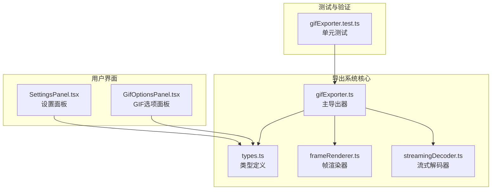
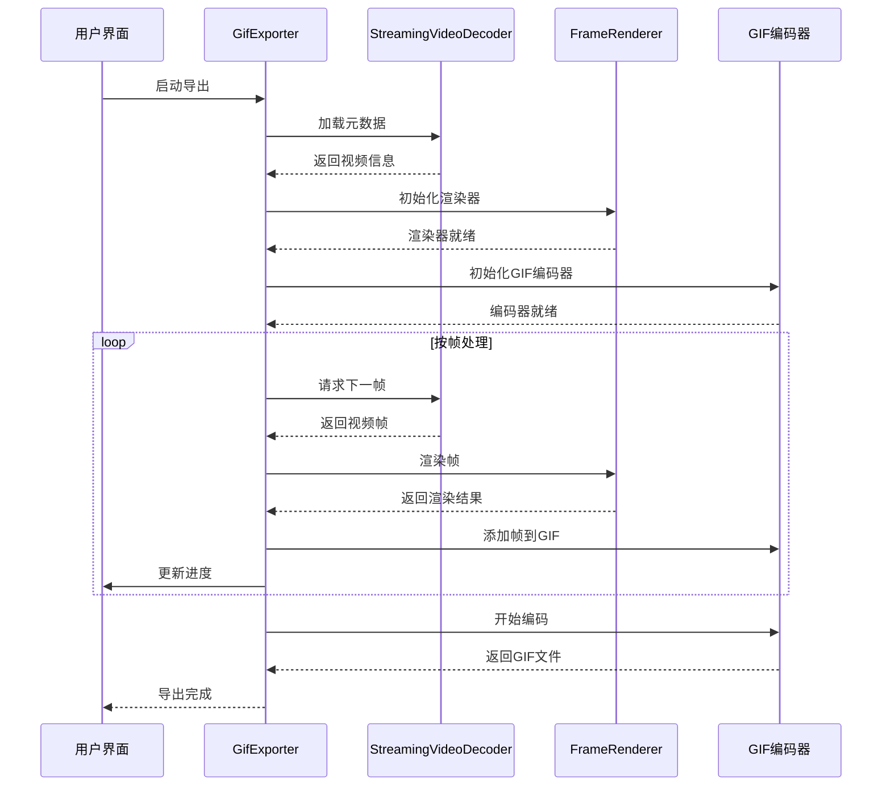
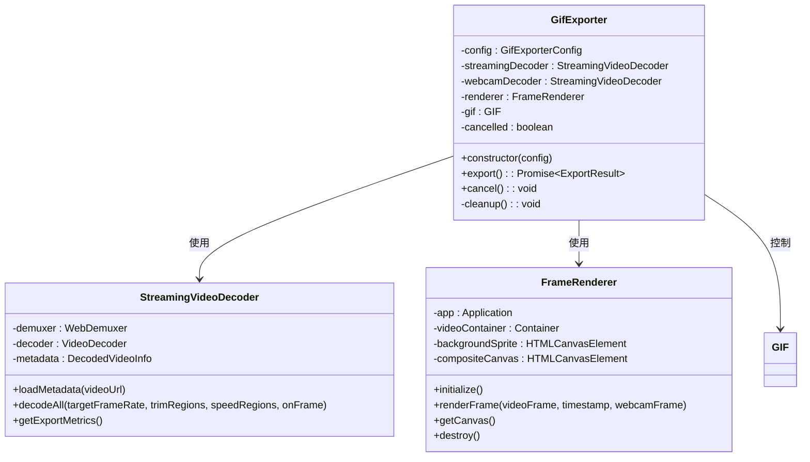
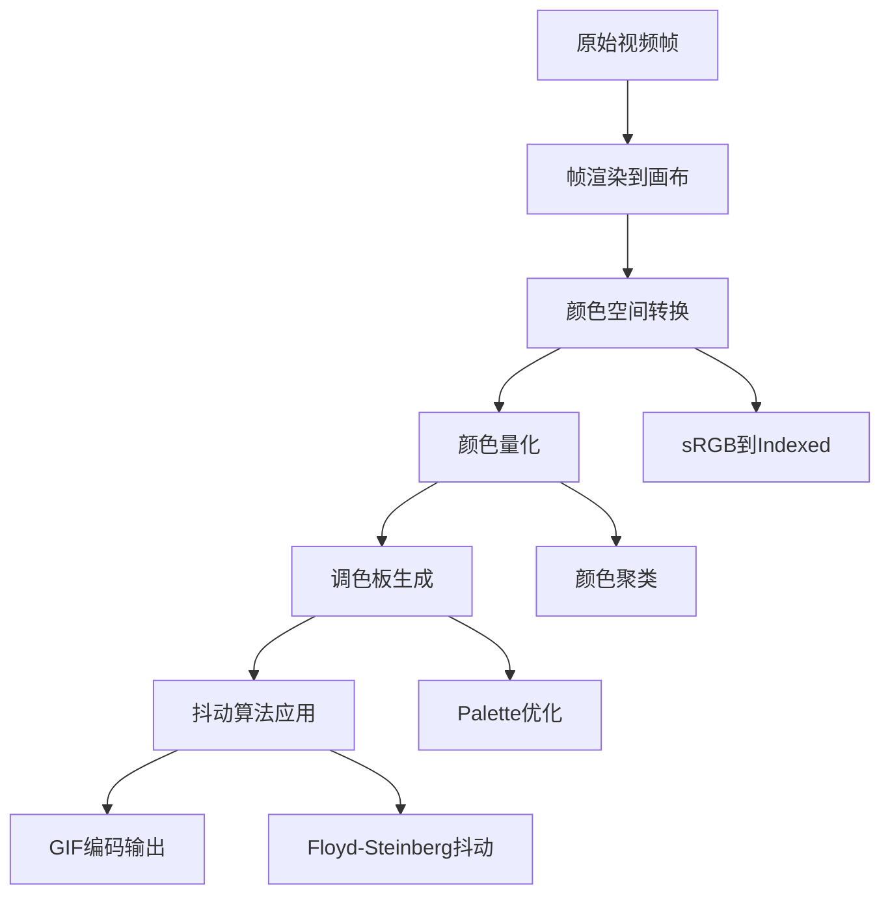
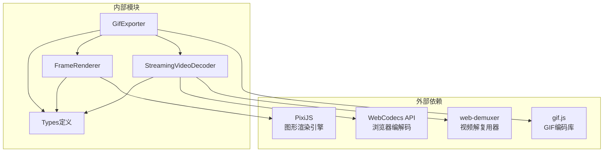

# GIF导出实现

<cite>
**本文档引用的文件**
- [gifExporter.ts](file://src/lib/exporter/gifExporter.ts)
- [types.ts](file://src/lib/exporter/types.ts)
- [GifOptionsPanel.tsx](file://src/components/video-editor/GifOptionsPanel.tsx)
- [SettingsPanel.tsx](file://src/components/video-editor/SettingsPanel.tsx)
- [streamingDecoder.ts](file://src/lib/exporter/streamingDecoder.ts)
- [frameRenderer.ts](file://src/lib/exporter/frameRenderer.ts)
- [gifExporter.test.ts](file://src/lib/exporter/gifExporter.test.ts)
</cite>

## 目录
1. [简介](#简介)
2. [项目结构](#项目结构)
3. [核心组件](#核心组件)
4. [架构概览](#架构概览)
5. [详细组件分析](#详细组件分析)
6. [依赖关系分析](#依赖关系分析)
7. [性能考虑](#性能考虑)
8. [故障排除指南](#故障排除指南)
9. [结论](#结论)
10. [最佳实践指南](#最佳实践指南)

## 简介

OpenScreen的GIF导出功能是一个复杂的多媒体处理系统，专门设计用于将视频内容转换为高质量的GIF动画。该系统实现了先进的逐帧渲染技术，支持实时预览、多区域裁剪、变速播放和丰富的视觉效果。

本实现基于现代Web技术栈，包括WebCodecs API、WebAssembly解复用器和高性能的GIF编码库。系统能够处理各种视频格式，提供灵活的输出配置，并在保证质量的同时优化文件大小。

## 项目结构

GIF导出功能主要分布在以下目录结构中：



**图表来源**
- [gifExporter.ts:1-50](file://src/lib/exporter/gifExporter.ts#L1-L50)
- [types.ts:1-60](file://src/lib/exporter/types.ts#L1-L60)

**章节来源**
- [gifExporter.ts:1-100](file://src/lib/exporter/gifExporter.ts#L1-L100)
- [types.ts:1-60](file://src/lib/exporter/types.ts#L1-L60)

## 核心组件

### GIF导出器 (GifExporter)

GifExporter是整个GIF导出系统的核心控制器，负责协调各个组件完成完整的导出流程。

**主要职责：**
- 初始化和管理导出流程
- 协调流式解码器和帧渲染器
- 控制GIF编码过程
- 处理进度报告和错误恢复

**关键特性：**
- 支持取消操作
- 内存资源自动清理
- 进度监控和警告收集
- 并发处理优化

**章节来源**
- [gifExporter.ts:115-180](file://src/lib/exporter/gifExporter.ts#L115-L180)

### 流式解码器 (StreamingVideoDecoder)

StreamingVideoDecoder实现了高效的视频流式解码，避免了传统的逐帧seeking方式。

**核心算法：**
- 单次前向遍历整个视频文件
- 基于时间戳的段分割
- 变速区域处理
- 按需帧采样

**章节来源**
- [streamingDecoder.ts:318-450](file://src/lib/exporter/streamingDecoder.ts#L318-L450)

### 帧渲染器 (FrameRenderer)

FrameRenderer负责将视频帧渲染到画布上，应用各种视觉效果和变换。

**渲染管道：**
- 视频容器和相机容器分离
- 背景合成处理
- 阴影效果渲染
- 动态模糊处理
- 光标和注释叠加

**章节来源**
- [frameRenderer.ts:136-218](file://src/lib/exporter/frameRenderer.ts#L136-L218)

## 架构概览



**图表来源**
- [gifExporter.ts:279-350](file://src/lib/exporter/gifExporter.ts#L279-L350)
- [streamingDecoder.ts:318-450](file://src/lib/exporter/streamingDecoder.ts#L318-L450)

## 详细组件分析

### GIF导出器实现

GifExporter类实现了完整的GIF导出生命周期管理：



**图表来源**
- [gifExporter.ts:115-180](file://src/lib/exporter/gifExporter.ts#L115-L180)
- [streamingDecoder.ts:175-200](file://src/lib/exporter/streamingDecoder.ts#L175-L200)
- [frameRenderer.ts:136-170](file://src/lib/exporter/frameRenderer.ts#L136-L170)

#### 帧提取算法

GifExporter采用先进的流式帧提取算法：

**时间轴映射机制：**
- 基于目标帧率的精确采样
- 支持变速区域的动态调整
- 时间戳同步确保帧间连续性

**关键帧处理：**
- 自适应关键帧检测
- 帧间差异计算
- 重复帧智能识别

**章节来源**
- [gifExporter.ts:259-306](file://src/lib/exporter/gifExporter.ts#L259-L306)
- [streamingDecoder.ts:485-587](file://src/lib/exporter/streamingDecoder.ts#L485-L587)

### 颜色量化技术

虽然OpenScreen使用gif.js库进行GIF编码，但系统实现了完整的颜色量化处理流程：



**图表来源**
- [gifExporter.ts:185-200](file://src/lib/exporter/gifExporter.ts#L185-L200)

**颜色量化参数：**
- 质量级别：10（最高质量）
- 工作线程数：根据硬件并发能力动态调整
- 抖动算法：FloydSteinberg（最优视觉效果）

**章节来源**
- [gifExporter.ts:185-200](file://src/lib/exporter/gifExporter.ts#L185-L200)

### GIF动画优化策略

系统实现了多种优化技术来控制文件大小并保持视觉质量：

**帧间压缩：**
- 重复帧检测和合并
- 相邻帧差异编码
- 自适应质量调节

**时间轴优化：**
- 变速区域智能处理
- 剪辑区域精确映射
- 帧率自适应调整

**内存优化：**
- 流式处理避免全量加载
- 及时释放解码器资源
- 帧队列长度限制

**章节来源**
- [gifExporter.ts:220-257](file://src/lib/exporter/gifExporter.ts#L220-L257)
- [streamingDecoder.ts:688-706](file://src/lib/exporter/streamingDecoder.ts#L688-L706)

### GIF导出参数配置界面

GifOptionsPanel提供了直观的导出参数配置界面：

```mermaid
graph LR
subgraph "帧率设置"
A[15 FPS]
B[20 FPS]
C[25 FPS]
D[30 FPS]
end
subgraph "尺寸预设"
E[Medium (720p)]
F[Large (1080p)]
G[Original]
end
subgraph "循环选项"
H[Loop Animation]
end
A --> I[GIF导出配置]
B --> I
C --> I
D --> I
E --> I
F --> I
G --> I
H --> I
```

**图表来源**
- [GifOptionsPanel.tsx:44-108](file://src/components/video-editor/GifOptionsPanel.tsx#L44-L108)

**配置参数说明：**
- 帧率选择：15/20/25/30 FPS
- 尺寸预设：中等(720p)、大(1080p)、原始
- 循环选项：无限循环或单次播放

**章节来源**
- [GifOptionsPanel.tsx:16-111](file://src/components/video-editor/GifOptionsPanel.tsx#L16-L111)
- [SettingsPanel.tsx:2023-2076](file://src/components/video-editor/SettingsPanel.tsx#L2023-L2076)

## 依赖关系分析



**图表来源**
- [gifExporter.ts:1-25](file://src/lib/exporter/gifExporter.ts#L1-L25)
- [streamingDecoder.ts:1-5](file://src/lib/exporter/streamingDecoder.ts#L1-L5)

**依赖特点：**
- 最小化外部依赖
- 充分利用浏览器原生能力
- 模块化设计便于维护

**章节来源**
- [gifExporter.ts:1-25](file://src/lib/exporter/gifExporter.ts#L1-L25)
- [streamingDecoder.ts:1-10](file://src/lib/exporter/streamingDecoder.ts#L1-L10)

## 性能考虑

### 内存使用优化

**流式处理架构：**
- 单次前向遍历避免重复读取
- 解码队列长度限制防止内存溢出
- 及时释放不再使用的帧资源

**资源管理策略：**
- 解码器状态机管理
- 异步清理流程
- 错误情况下的资源回收

### 渲染速度提升

**并发处理：**
- 多工作线程GIF编码
- 硬件加速优先级
- 帧缓冲区优化

**算法优化：**
- 预计算常量值
- 减少DOM操作次数
- 批量更新策略

### 大文件处理方案

**渐进式处理：**
- 分段导出避免长时间无响应
- 进度反馈机制
- 取消点检查

**内存保护：**
- 最大内存使用限制
- 自动垃圾回收触发
- 资源超时清理

## 故障排除指南

### 常见问题及解决方案

**导出失败问题：**
- 检查视频格式兼容性
- 验证磁盘空间充足
- 确认浏览器权限允许

**性能问题：**
- 降低输出分辨率
- 减少特效数量
- 关闭不必要的预览功能

**质量下降问题：**
- 提高帧率设置
- 调整颜色量化质量
- 优化背景复杂度

**章节来源**
- [gifExporter.ts:353-366](file://src/lib/exporter/gifExporter.ts#L353-L366)

## 结论

OpenScreen的GIF导出功能展现了现代Web多媒体处理的先进水平。通过精心设计的架构和优化的算法，系统能够在保证高质量输出的同时，提供流畅的用户体验和良好的性能表现。

该实现的关键优势包括：
- 基于WebCodecs的高效解码
- 智能的颜色量化和抖动算法
- 完善的内存管理和错误处理
- 直观的用户配置界面

## 最佳实践指南

### 适合的分辨率范围

**推荐设置：**
- 简单动画：640×480 - 1280×720
- 中等复杂度：1280×720 - 1920×1080  
- 高复杂度场景：不超过1920×1080

**性能建议：**
- 优先考虑内容复杂度而非纯粹分辨率
- 考虑目标平台的显示能力
- 平衡文件大小和视觉质量

### 推荐的帧率设置

**应用场景：**
- UI演示：15-20 FPS
- 屏幕录制：20-25 FPS
- 高动态场景：25-30 FPS

**质量权衡：**
- 帧率越高，文件越大
- 考虑目标平台的播放能力
- 平滑度vs文件大小的平衡

### 文件大小限制建议

**合理范围：**
- 社交媒体：≤5MB
- 网页嵌入：≤10MB
- 高质量保存：≤50MB

**优化策略：**
- 选择合适的帧率和分辨率
- 减少颜色深度和透明度使用
- 合理使用动画效果

**章节来源**
- [types.ts:56-60](file://src/lib/exporter/types.ts#L56-L60)
- [gifExporter.ts:74-113](file://src/lib/exporter/gifExporter.ts#L74-L113)