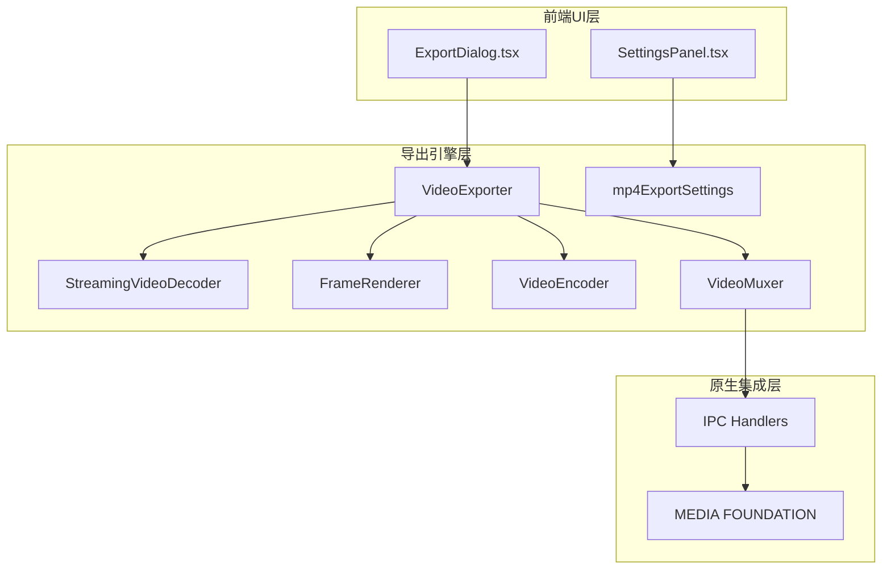
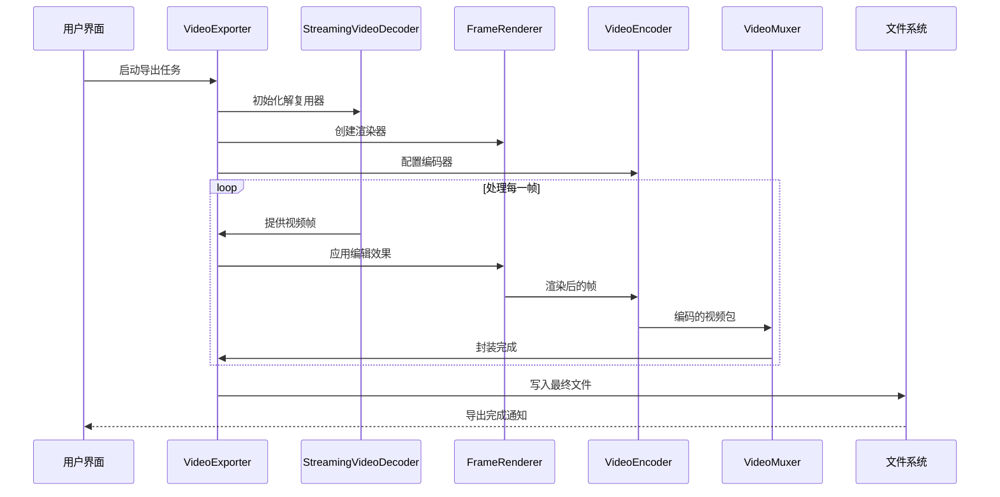
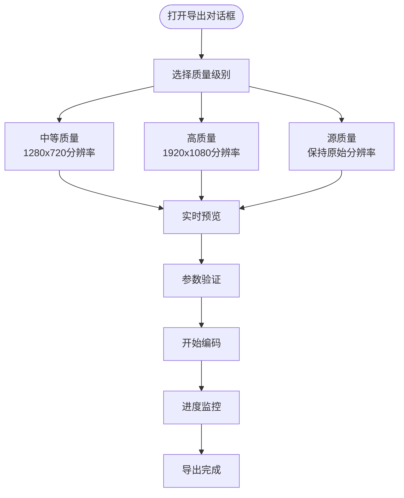
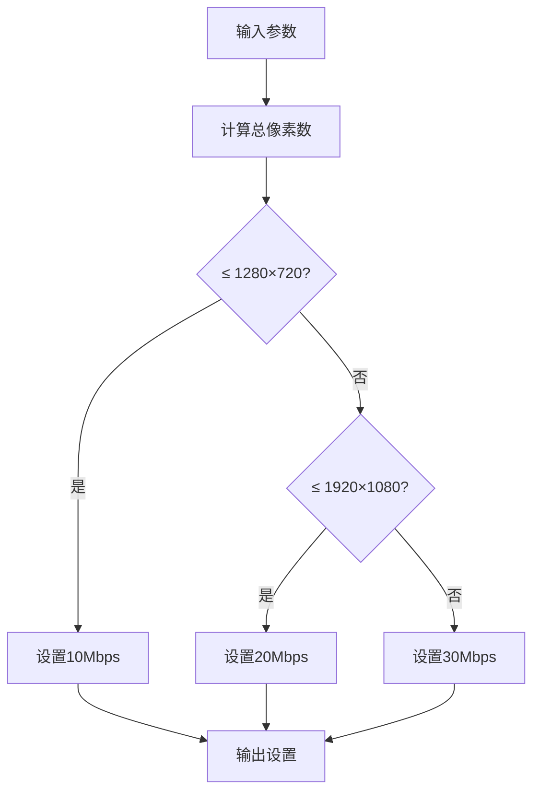
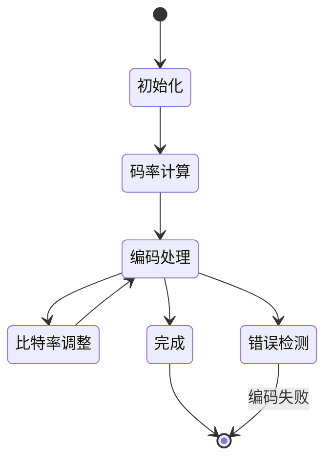
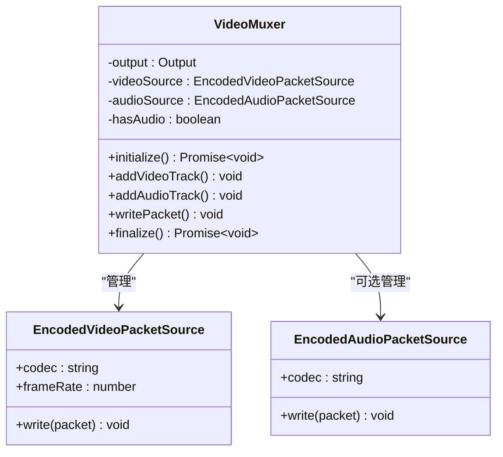
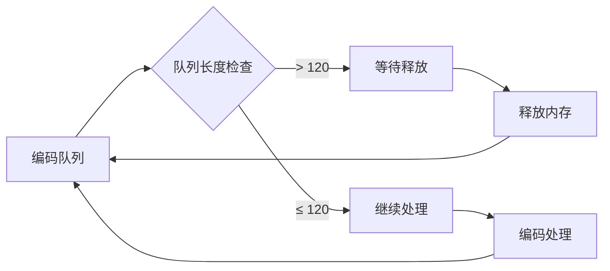
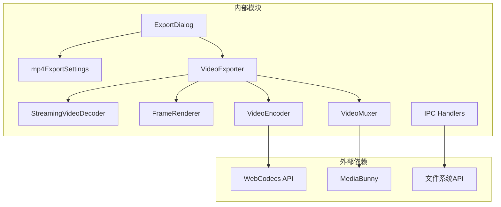

# MP4导出实现

<cite>
**本文档引用的文件**
- [ExportDialog.tsx](file://src/components/video-editor/ExportDialog.tsx)
- [SettingsPanel.tsx](file://src/components/video-editor/SettingsPanel.tsx)
- [mp4ExportSettings.ts](file://src/lib/exporter/mp4ExportSettings.ts)
- [mp4ExportSettings.test.ts](file://src/lib/exporter/mp4ExportSettings.test.ts)
- [videoExporter.ts](file://src/lib/exporter/videoExporter.ts)
- [muxer.ts](file://src/lib/exporter/muxer.ts)
- [streamingDecoder.ts](file://src/lib/exporter/streamingDecoder.ts)
- [05-export/01-export-pipeline-architecture.md](file://docs/05-export/01-export-pipeline-architecture.md)
- [handlers.ts](file://electron/ipc/handlers.ts)
- [mf_encoder.cpp](file://electron/native/wgc-capture/src/mf_encoder.cpp)
</cite>

## 目录
1. [简介](#简介)
2. [项目结构](#项目结构)
3. [核心组件](#核心组件)
4. [架构概览](#架构概览)
5. [详细组件分析](#详细组件分析)
6. [依赖关系分析](#依赖关系分析)
7. [性能考虑](#性能考虑)
8. [故障排除指南](#故障排除指南)
9. [结论](#结论)

## 简介

OpenScreen的MP4导出功能是一个复杂的多阶段处理系统，将编辑后的视频转换为高质量的MP4文件。该系统采用现代Web技术栈，结合原生平台能力，实现了高效的视频编码、封装和输出流程。

本系统的核心目标是提供用户友好的导出体验，同时确保编码质量和性能的平衡。通过智能的质量控制策略、灵活的参数配置和强大的错误处理机制，系统能够适应各种不同的使用场景和硬件环境。

## 项目结构

OpenScreen的MP4导出功能分布在多个关键模块中，形成了一个层次化的架构设计：

**图表来源**
- [ExportDialog.tsx:1-2021](file://src/components/video-editor/ExportDialog.tsx#L1-L2021)
- [SettingsPanel.tsx:1943-2021](file://src/components/video-editor/SettingsPanel.tsx#L1943-L2021)
- [videoExporter.ts:137-162](file://src/lib/exporter/videoExporter.ts#L137-L162)
- [mp4ExportSettings.ts:111-143](file://src/lib/exporter/mp4ExportSettings.ts#L111-L143)

**章节来源**
- [ExportDialog.tsx:1-2021](file://src/components/video-editor/ExportDialog.tsx#L1-L2021)
- [SettingsPanel.tsx:1943-2021](file://src/components/video-editor/SettingsPanel.tsx#L1943-L2021)
- [mp4ExportSettings.ts:111-143](file://src/lib/exporter/mp4ExportSettings.ts#L111-L143)

## 核心组件

### 导出对话框组件

ExportDialog.tsx提供了用户交互界面，包含了完整的MP4导出参数配置功能：

- **质量选择界面**：提供低、中、高三个预设选项
- **实时预览功能**：显示导出前的预览效果
- **参数验证**：确保用户输入的有效性
- **进度反馈**：实时显示导出进度状态

### 质量控制系统

mp4ExportSettings.ts实现了智能的质量控制算法：

- **自适应分辨率**：根据源素材尺寸自动选择合适的输出分辨率
- **智能比特率计算**：基于像素密度和质量级别动态调整编码参数
- **纵横比保持**：确保输出视频保持原始的纵横比
- **裁剪区域适配**：支持对裁剪区域的精确适配

### 导出引擎

videoExporter.ts负责协调整个导出流程：

- **非阻塞处理**：使用异步生成器避免界面冻结
- **内存管理**：智能的编码队列控制防止内存溢出
- **错误恢复**：完善的错误处理和恢复机制
- **进度报告**：详细的进度跟踪和状态反馈

**章节来源**
- [ExportDialog.tsx:1-2021](file://src/components/video-editor/ExportDialog.tsx#L1-L2021)
- [mp4ExportSettings.ts:111-143](file://src/lib/exporter/mp4ExportSettings.ts#L111-L143)
- [videoExporter.ts:137-162](file://src/lib/exporter/videoExporter.ts#L137-L162)

## 架构概览

OpenScreen的MP4导出系统采用分层架构设计，每个层级都有明确的职责分工：

**图表来源**
- [05-export/01-export-pipeline-architecture.md:1-58](file://docs/05-export/01-export-pipeline-architecture.md#L1-L58)
- [videoExporter.ts:160-162](file://src/lib/exporter/videoExporter.ts#L160-L162)

系统的核心优势在于其模块化设计，使得每个组件都可以独立优化和测试，同时保持良好的协作效率。

## 详细组件分析

### 导出对话框中的MP4参数配置

ExportDialog.tsx实现了直观的用户界面，支持以下配置选项：

**图表来源**
- [ExportDialog.tsx:1943-2021](file://src/components/video-editor/ExportDialog.tsx#L1943-L2021)

### 质量控制策略详解

mp4ExportSettings.ts提供了智能的质量控制算法：

#### 分辨率适配策略

系统根据源素材的短边长度自动选择输出分辨率：

| 质量级别 | 短边长度 | 输出分辨率 | 比特率建议 |
|---------|---------|-----------|-----------|
| medium | ≤ 720p | 1280x720 | 10,000,000 bps |
| good | ≤ 1080p | 1920x1080 | 20,000,000 bps |
| source | ≥ 1080p | 原始分辨率 | 自适应 |

#### 智能比特率计算

比特率根据像素密度动态调整：

**图表来源**
- [mp4ExportSettings.ts:106-109](file://src/lib/exporter/mp4ExportSettings.ts#L106-L109)

### H.264编码器配置与使用

系统的H.264编码实现基于WebCodecs API，提供了高性能的软件编码能力：

#### 编码参数设置

编码器配置包括以下关键参数：

- **编码格式**：H.264/AVC Baseline Profile
- **帧率控制**：保持原始帧率或指定目标帧率
- **GOP大小**：I帧间隔设置为关键帧
- **参考帧**：单参考帧模式
- **B帧**：禁用B帧以提高兼容性

#### 比特率控制机制

系统实现了自适应比特率控制：

**图表来源**
- [videoExporter.ts:146-148](file://src/lib/exporter/videoExporter.ts#L146-L148)

### MP4容器封装过程

VideoMuxer类负责将编码后的视频流封装到MP4容器中：

#### 媒体轨道管理

封装过程包括两个主要轨道的管理：

**图表来源**
- [muxer.ts:13-53](file://src/lib/exporter/muxer.ts#L13-L53)

#### 元数据处理

封装过程中处理的关键元数据：

- **视频轨道**：H.264编码信息、帧率、分辨率
- **音频轨道**：AAC编码信息、采样率、声道配置
- **容器头**：MP4文件头、时间戳信息
- **索引信息**：快速定位和播放支持

#### 时间戳同步机制

系统实现了精确的时间戳同步：

- **PTS/DTS分离**：正确处理显示时间和解码时间
- **时钟基准**：统一的纳秒级时间基准
- **边界校正**：处理时间戳边界情况

### 导出性能优化技术

#### 硬件加速利用

系统支持多种硬件加速方式：

- **GPU加速**：利用GPU进行视频解码和编码
- **SIMD指令**：优化图像处理算法
- **并行处理**：多线程并行处理不同阶段

#### 内存缓冲区管理

智能的内存管理策略：

**图表来源**
- [videoExporter.ts:146-148](file://src/lib/exporter/videoExporter.ts#L146-L148)

#### 进度计算算法

精确的进度跟踪算法：

- **帧级进度**：基于已处理帧数的进度计算
- **字节级精度**：考虑文件大小的精细进度
- **剩余时间估算**：基于当前速度的剩余时间预测

### 导出质量控制策略

#### 分辨率适配

系统实现了智能的分辨率适配算法：

- **短边优先**：始终以短边作为基准进行缩放
- **纵横比保持**：自动计算正确的长边尺寸
- **边界处理**：处理极端纵横比的情况

#### 帧率调整

灵活的帧率控制机制：

- **原生帧率**：保持源素材的原始帧率
- **目标帧率**：可配置的目标帧率设置
- **帧率转换**：必要时进行帧率转换

#### 压缩算法选择

多算法支持的压缩策略：

- **H.264**：广泛兼容的主流编码
- **H.265**：高压缩比的现代编码
- **可扩展性**：未来支持更多编码格式

**章节来源**
- [mp4ExportSettings.ts:111-143](file://src/lib/exporter/mp4ExportSettings.ts#L111-L143)
- [videoExporter.ts:137-162](file://src/lib/exporter/videoExporter.ts#L137-L162)
- [muxer.ts:13-53](file://src/lib/exporter/muxer.ts#L13-L53)

## 依赖关系分析

OpenScreen的MP4导出系统具有清晰的依赖关系结构：

**图表来源**
- [videoExporter.ts:137-162](file://src/lib/exporter/videoExporter.ts#L137-L162)
- [muxer.ts:1-53](file://src/lib/exporter/muxer.ts#L1-L53)

系统采用了松耦合的设计原则，各个模块之间的依赖关系清晰明确，便于维护和扩展。

**章节来源**
- [05-export/01-export-pipeline-architecture.md:1-58](file://docs/05-export/01-export-pipeline-architecture.md#L1-L58)
- [videoExporter.ts:137-162](file://src/lib/exporter/videoExporter.ts#L137-L162)

## 性能考虑

### 编码性能优化

系统在编码性能方面采用了多项优化策略：

- **智能队列管理**：限制最大编码队列深度（120帧）防止内存膨胀
- **渐进式处理**：分批处理减少峰值内存使用
- **资源回收**：及时释放不再使用的编码资源

### I/O性能优化

文件写入和读取的性能优化：

- **异步写入**：使用异步文件操作避免界面冻结
- **缓冲策略**：合理的缓冲区大小配置
- **错误重试**：网络不稳定时的自动重试机制

### 内存使用优化

内存使用监控和优化：

- **实时监控**：持续监控内存使用情况
- **垃圾回收**：及时触发JavaScript垃圾回收
- **资源池**：复用常用的编码和解码资源

## 故障排除指南

### 常见编码问题

#### 编码失败

**症状**：导出过程中断，出现编码错误

**可能原因**：
- 硬件不支持特定编码参数
- 内存不足导致编码中断
- 输入视频格式不受支持

**解决方案**：
- 降低质量设置重新尝试
- 关闭其他占用内存的应用
- 检查输入视频的兼容性

#### 文件损坏

**症状**：导出的MP4文件无法播放或损坏

**可能原因**：
- 编码过程中断电
- 存储空间不足
- 文件系统权限问题

**解决方案**：
- 确保稳定的电源供应
- 检查磁盘空间充足
- 验证文件写入权限

### 性能瓶颈诊断

#### 导出速度慢

**症状**：导出过程异常缓慢

**诊断步骤**：
1. 检查CPU使用率是否达到100%
2. 监控内存使用情况
3. 确认没有其他大型应用运行

**优化建议**：
- 降低输出质量设置
- 关闭不必要的后台应用
- 考虑升级硬件配置

#### 内存泄漏

**症状**：长时间运行后内存使用持续增长

**解决方法**：
- 更新到最新版本
- 重启应用程序
- 减少同时运行的导出任务

**章节来源**
- [handlers.ts:2406-2435](file://electron/ipc/handlers.ts#L2406-L2435)
- [videoExporter.ts:146-148](file://src/lib/exporter/videoExporter.ts#L146-L148)

## 结论

OpenScreen的MP4导出功能展现了现代视频处理系统的最佳实践。通过精心设计的架构、智能的质量控制算法和完善的性能优化策略，系统能够在保证高质量输出的同时提供流畅的用户体验。

系统的主要优势包括：

- **模块化设计**：清晰的职责分离便于维护和扩展
- **智能优化**：自适应的质量控制和性能调优
- **错误处理**：完善的错误检测和恢复机制
- **用户友好**：直观的界面和实时反馈

未来的发展方向可能包括支持更多的编码格式、进一步提升性能表现以及增强与其他视频处理工具的集成能力。