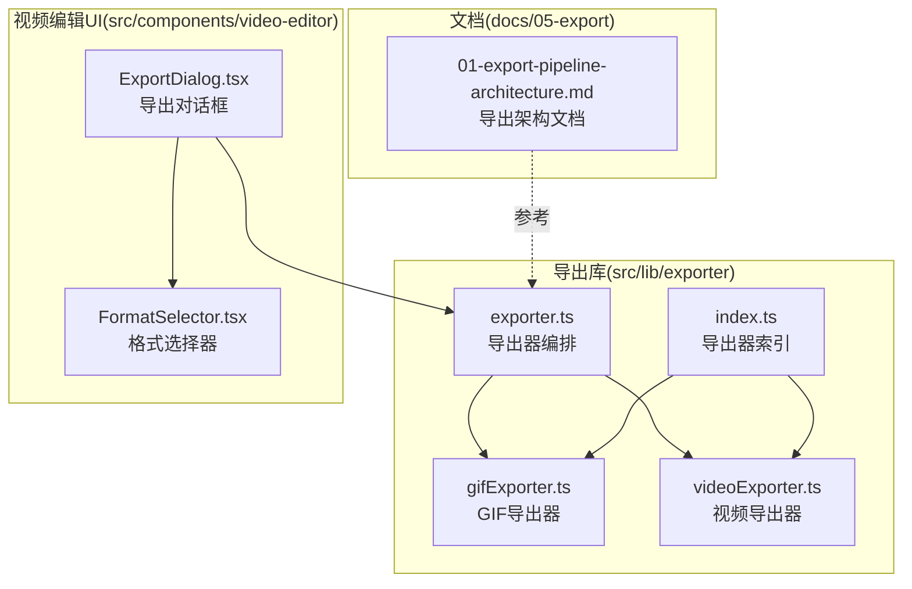
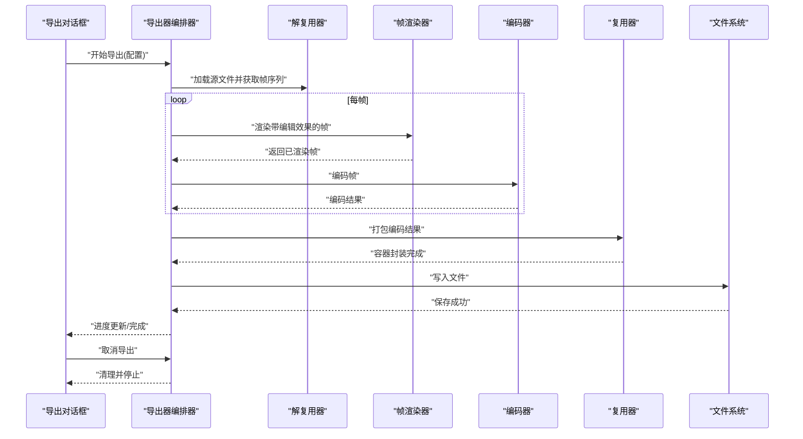
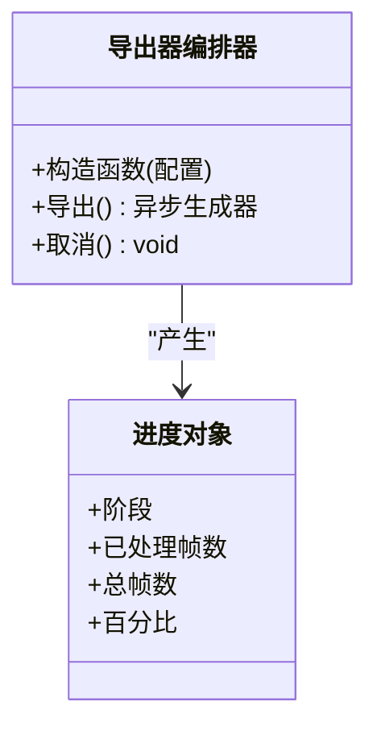
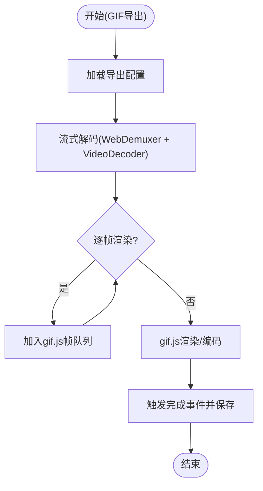
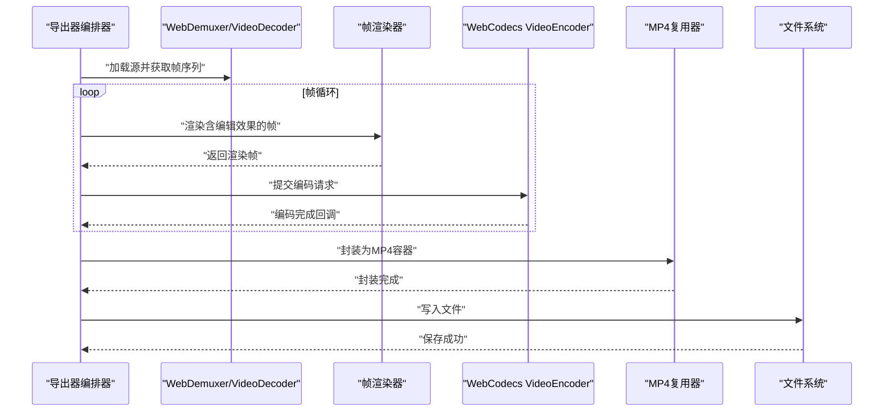
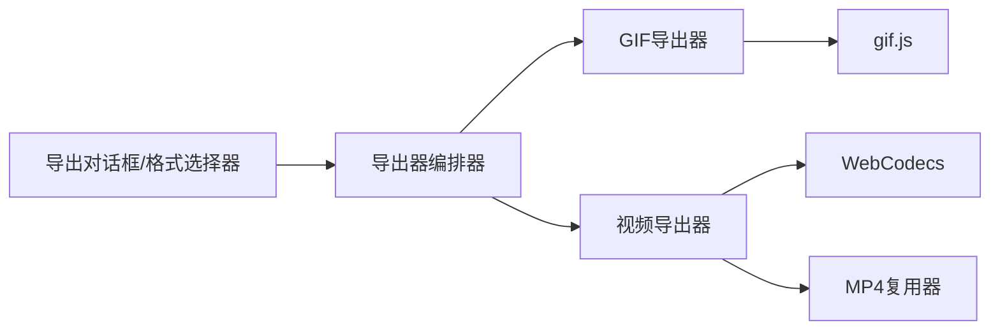

# 导出管道架构

<cite>
**本文档引用的文件**
- [01-export-pipeline-architecture.md](file://docs/05-export/01-export-pipeline-architecture.md)
- [exporter.ts](file://src/lib/exporter.ts)
- [gifExporter.ts](file://src/lib/exporter/gifExporter.ts)
- [videoExporter.ts](file://src/lib/exporter/videoExporter.ts)
- [index.ts](file://src/lib/exporter/index.ts)
- [ExportDialog.tsx](file://src/components/video-editor/ExportDialog.tsx)
- [FormatSelector.tsx](file://src/components/video-editor/FormatSelector.tsx)
- [webm-duration.ts](file://electron/electron-env.d.ts)
</cite>

## 目录
1. [简介](#简介)
2. [项目结构](#项目结构)
3. [核心组件](#核心组件)
4. [架构总览](#架构总览)
5. [详细组件分析](#详细组件分析)
6. [依赖关系分析](#依赖关系分析)
7. [性能考量](#性能考量)
8. [故障排除指南](#故障排除指南)
9. [结论](#结论)
10. [附录](#附录)

## 简介
本文件面向OpenScreen的导出管道架构，系统性阐述从编辑完成到最终文件生成的完整流程，包括任务调度机制、并发处理策略、进度监控与取消支持、错误处理以及可扩展的模块化设计（编码器抽象、格式处理器、质量控制器）。文档同时提供可视化图示，帮助开发者与产品人员理解导出系统的整体设计。

## 项目结构
导出相关的核心代码位于src/lib/exporter目录，配套UI组件位于src/components/video-editor中，文档位于docs/05-export。导出功能在渲染进程中非阻塞执行，并通过异步生成器提供进度反馈，支持取消操作。

**图表来源**
- [exporter.ts:1-200](file://src/lib/exporter.ts#L1-L200)
- [gifExporter.ts:1-250](file://src/lib/exporter/gifExporter.ts#L1-L250)
- [videoExporter.ts:1-250](file://src/lib/exporter/videoExporter.ts#L1-L250)
- [index.ts:1-50](file://src/lib/exporter/index.ts#L1-L50)
- [ExportDialog.tsx:1-200](file://src/components/video-editor/ExportDialog.tsx#L1-L200)
- [FormatSelector.tsx:1-200](file://src/components/video-editor/FormatSelector.tsx#L1-L200)
- [01-export-pipeline-architecture.md:1-188](file://docs/05-export/01-export-pipeline-architecture.md#L1-L188)

**章节来源**
- [exporter.ts:1-200](file://src/lib/exporter.ts#L1-L200)
- [gifExporter.ts:1-250](file://src/lib/exporter/gifExporter.ts#L1-L250)
- [videoExporter.ts:1-250](file://src/lib/exporter/videoExporter.ts#L1-L250)
- [index.ts:1-50](file://src/lib/exporter/index.ts#L1-L50)
- [ExportDialog.tsx:1-200](file://src/components/video-editor/ExportDialog.tsx#L1-L200)
- [FormatSelector.tsx:1-200](file://src/components/video-editor/FormatSelector.tsx#L1-L200)
- [01-export-pipeline-architecture.md:1-188](file://docs/05-export/01-export-pipeline-architecture.md#L1-L188)

## 核心组件
- 导出器编排器：负责组织导出流程，协调解复用、渲染、编码、复用与保存阶段，提供异步进度与取消能力。
- GIF导出器：封装gif.js，支持多工作线程、质量映射与循环控制。
- 视频导出器：封装WebCodecs VideoEncoder，支持硬件加速与GPU利用。
- 导出器索引：统一导出器入口，便于按需加载与扩展。
- UI组件：导出对话框与格式选择器，驱动用户交互与配置输入。

**章节来源**
- [exporter.ts:1-200](file://src/lib/exporter.ts#L1-L200)
- [gifExporter.ts:1-250](file://src/lib/exporter/gifExporter.ts#L1-L250)
- [videoExporter.ts:1-250](file://src/lib/exporter/videoExporter.ts#L1-L250)
- [index.ts:1-50](file://src/lib/exporter/index.ts#L1-L50)
- [ExportDialog.tsx:1-200](file://src/components/video-editor/ExportDialog.tsx#L1-L200)
- [FormatSelector.tsx:1-200](file://src/components/video-editor/FormatSelector.tsx#L1-L200)

## 架构总览
导出管道采用“阶段化流水线”设计，主要分为解复用、帧渲染、编码、复用与保存五个阶段。导出器以非阻塞方式运行，通过异步生成器持续上报进度；支持取消以清理资源并中断流程。

**图表来源**
- [01-export-pipeline-architecture.md:7-17](file://docs/05-export/01-export-pipeline-architecture.md#L7-L17)
- [exporter.ts:1-200](file://src/lib/exporter.ts#L1-L200)

## 详细组件分析

### 导出器编排器（Exporter）
- 职责：组织导出流程，协调各阶段执行顺序，提供异步进度与取消能力。
- 进度模型：返回异步生成器，逐阶段产出进度对象，包含阶段名称、已处理帧数、总帧数与总体百分比。
- 取消机制：支持立即停止并清理资源，避免残留任务占用系统资源。
- 错误处理：每个阶段包裹异常捕获，将错误上抛至UI层，便于提示与重试。

**图表来源**
- [exporter.ts:1-200](file://src/lib/exporter.ts#L1-L200)
- [01-export-pipeline-architecture.md:142-162](file://docs/05-export/01-export-pipeline-architecture.md#L142-L162)

**章节来源**
- [exporter.ts:1-200](file://src/lib/exporter.ts#L1-L200)
- [01-export-pipeline-architecture.md:142-162](file://docs/05-export/01-export-pipeline-architecture.md#L142-L162)

### GIF导出器（GifExporter）
- 编码器：基于gif.js，支持多工作线程与质量参数映射。
- 配置：输出尺寸、帧率、循环次数、质量等级等。
- 流水线：使用流式解复用与VideoDecoder进行解码，逐帧加入gif.js队列，完成后触发保存事件。
- 性能优化：多工作线程并行、Canvas复用、早期分辨率缩放。

**图表来源**
- [gifExporter.ts:1-250](file://src/lib/exporter/gifExporter.ts#L1-L250)
- [01-export-pipeline-architecture.md:122-140](file://docs/05-export/01-export-pipeline-architecture.md#L122-L140)

**章节来源**
- [gifExporter.ts:1-250](file://src/lib/exporter/gifExporter.ts#L1-L250)
- [01-export-pipeline-architecture.md:122-140](file://docs/05-export/01-export-pipeline-architecture.md#L122-L140)

### 视频导出器（VideoExporter）
- 编码器：封装WebCodecs VideoEncoder，充分利用浏览器GPU加速。
- 阶段：解复用、渲染、编码、复用（MP4）、保存。
- 并发策略：gif.js使用Web Workers；WebCodecs由浏览器优化，减少CPU压力。
- 性能优化：Canvas复用、早期分辨率缩放、硬件加速。

**图表来源**
- [videoExporter.ts:1-250](file://src/lib/exporter/videoExporter.ts#L1-L250)
- [01-export-pipeline-architecture.md:48-68](file://docs/05-export/01-export-pipeline-architecture.md#L48-L68)

**章节来源**
- [videoExporter.ts:1-250](file://src/lib/exporter/videoExporter.ts#L1-L250)
- [01-export-pipeline-architecture.md:48-68](file://docs/05-export/01-export-pipeline-architecture.md#L48-L68)

### 导出器索引（Index）
- 统一导出器入口，便于按需加载与扩展新的导出器类型（如新增格式）。
- 提供calculateOutputDimensions等工具方法，供不同导出器共享。

**章节来源**
- [index.ts:1-50](file://src/lib/exporter/index.ts#L1-L50)

### UI集成（导出对话框与格式选择器）
- 导出对话框：收集导出配置（格式、质量、尺寸、帧率等），触发导出流程并展示进度。
- 格式选择器：根据用户选择切换GIF或视频导出器，传递对应配置。

**章节来源**
- [ExportDialog.tsx:1-200](file://src/components/video-editor/ExportDialog.tsx#L1-L200)
- [FormatSelector.tsx:1-200](file://src/components/video-editor/FormatSelector.tsx#L1-L200)

## 依赖关系分析
- 导出器编排器依赖具体导出器实现（GIF/视频），并通过索引统一暴露接口。
- GIF导出器依赖gif.js与流式解复用器；视频导出器依赖WebCodecs与MP4复用器。
- UI组件通过导出对话框与格式选择器驱动导出流程，形成清晰的控制流。

**图表来源**
- [exporter.ts:1-200](file://src/lib/exporter.ts#L1-L200)
- [gifExporter.ts:1-250](file://src/lib/exporter/gifExporter.ts#L1-L250)
- [videoExporter.ts:1-250](file://src/lib/exporter/videoExporter.ts#L1-L250)
- [index.ts:1-50](file://src/lib/exporter/index.ts#L1-L50)

**章节来源**
- [exporter.ts:1-200](file://src/lib/exporter.ts#L1-L200)
- [gifExporter.ts:1-250](file://src/lib/exporter/gifExporter.ts#L1-L250)
- [videoExporter.ts:1-250](file://src/lib/exporter/videoExporter.ts#L1-L250)
- [index.ts:1-50](file://src/lib/exporter/index.ts#L1-L50)

## 性能考量
- 并行化：gif.js使用Web Workers；WebCodecs由浏览器优化，充分利用GPU。
- 资源复用：同一Canvas重复渲染每帧，避免频繁分配与释放。
- 分辨率优化：在导出分辨率低于源分辨率时提前降采样，降低后续渲染与编码成本。
- 硬件加速：优先使用WebCodecs以获得更好的硬件加速表现。
- 内存管理：通过及时释放中间帧与清理解码器状态，避免内存泄漏。

**章节来源**
- [01-export-pipeline-architecture.md:164-172](file://docs/05-export/01-export-pipeline-architecture.md#L164-L172)

## 故障排除指南
- 解复用失败：检查源文件是否损坏或不被支持的编解码器。
- WebCodecs不可用：确认浏览器/Electron版本；若不可用则回退到替代路径（如gif.js）。
- 内存不足：高分辨率导出在内存有限设备上易出现OOM；建议降低导出分辨率或分段导出。
- 进度卡顿：检查是否有过多同步阻塞操作；确保导出在渲染进程非阻塞执行。
- 取消无效：确认调用取消接口后，导出器正确清理资源并停止后续阶段。

**章节来源**
- [01-export-pipeline-architecture.md:173-182](file://docs/05-export/01-export-pipeline-architecture.md#L173-L182)

## 结论
OpenScreen的导出管道采用模块化、可扩展的设计，通过导出器编排器统一流程控制，结合GIF与WebCodecs两种编码路径，满足不同格式与性能需求。其非阻塞的异步生成器进度模型与取消机制提升了用户体验，配合多工作线程与硬件加速策略显著提升导出效率。未来可通过扩展新的导出器类型与编码器实现，进一步增强对新格式的支持与性能优化空间。

## 附录
- 相关文件参考：导出架构文档、导出器实现与UI组件。
- 扩展建议：新增格式时，遵循现有导出器接口规范，提供配置解析、进度上报与错误处理，确保与编排器无缝集成。

**章节来源**
- [01-export-pipeline-architecture.md:183-188](file://docs/05-export/01-export-pipeline-architecture.md#L183-L188)
- [exporter.ts:1-200](file://src/lib/exporter.ts#L1-L200)
- [gifExporter.ts:1-250](file://src/lib/exporter/gifExporter.ts#L1-L250)
- [videoExporter.ts:1-250](file://src/lib/exporter/videoExporter.ts#L1-L250)
- [index.ts:1-50](file://src/lib/exporter/index.ts#L1-L50)
- [ExportDialog.tsx:1-200](file://src/components/video-editor/ExportDialog.tsx#L1-L200)
- [FormatSelector.tsx:1-200](file://src/components/video-editor/FormatSelector.tsx#L1-L200)