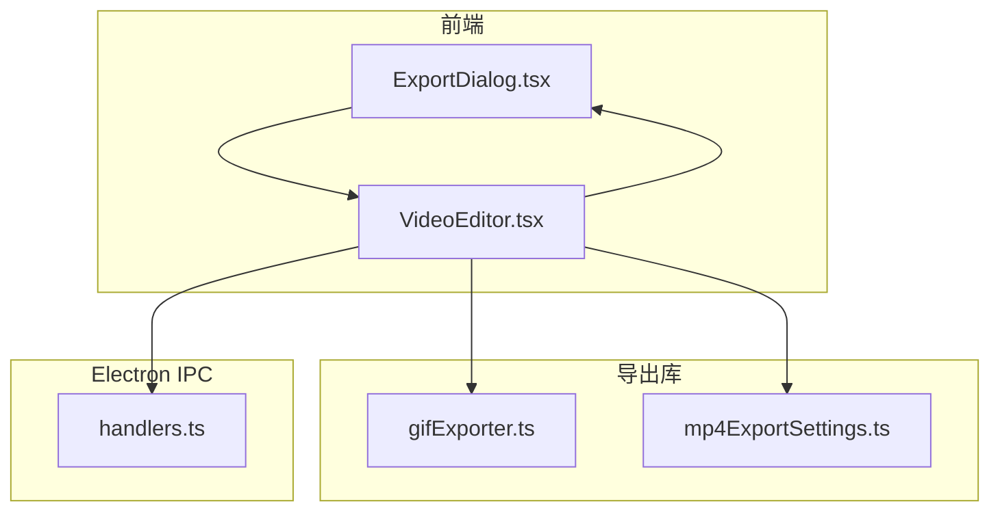
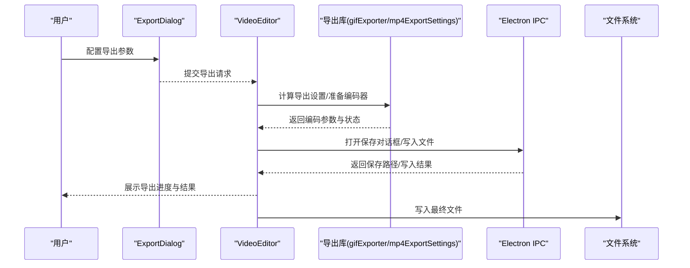
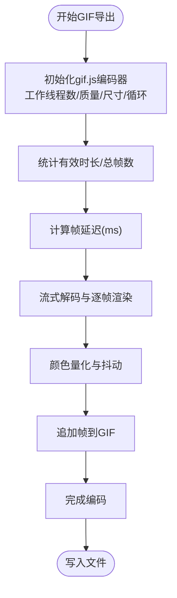
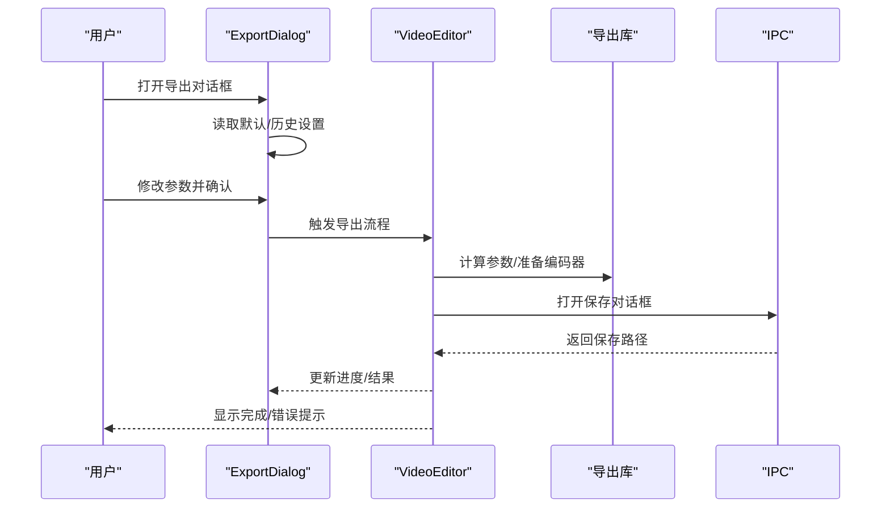
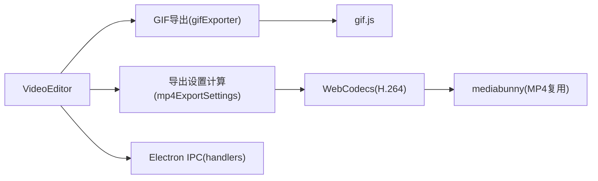

# 导出系统

<cite>
**本文引用的文件**
- [ExportDialog.tsx](file://src/components/video-editor/ExportDialog.tsx)
- [VideoEditor.tsx](file://src/components/video-editor/VideoEditor.tsx)
- [gifExporter.ts](file://src/lib/exporter/gifExporter.ts)
- [mp4ExportSettings.ts](file://src/lib/exporter/mp4ExportSettings.ts)
- [01-export-pipeline-architecture.md](file://docs/05-export/01-export-pipeline-architecture.md)
- [handlers.ts](file://electron/ipc/handlers.ts)
- [projectPersistence.ts](file://src/components/video-editor/projectPersistence.ts)
- [userPreferences.ts](file://src/lib/userPreferences.ts)
- [gifExporter.test.ts](file://src/lib/exporter/gifExporter.test.ts)
- [mp4ExportSettings.test.ts](file://src/lib/exporter/mp4ExportSettings.test.ts)
</cite>

## 目录
1. [简介](#简介)
2. [项目结构](#项目结构)
3. [核心组件](#核心组件)
4. [架构总览](#架构总览)
5. [详细组件分析](#详细组件分析)
6. [依赖关系分析](#依赖关系分析)
7. [性能考量](#性能考量)
8. [故障排查指南](#故障排查指南)
9. [结论](#结论)
10. [附录](#附录)

## 简介
本文件面向OpenScreen的导出系统，系统性阐述从视频编辑完成到最终文件生成的完整导出流程与架构设计。重点覆盖以下方面：
- 导出管道：任务调度、并发处理、进度监控
- MP4导出：H.264编码配置、比特率控制、质量设置与优化策略
- GIF导出：逐帧渲染、颜色量化、动画优化与体积控制
- ExportDialog导出对话框：参数配置、预览与进度展示
- 质量控制：分辨率适配、帧率调整、压缩算法选择
- 性能优化：内存管理、大文件处理方案

## 项目结构
导出系统由“前端UI（对话框与编辑器）+ 导出逻辑库 + Electron IPC”三层构成：
- 前端层：ExportDialog负责参数收集与进度反馈；VideoEditor协调导出流程与状态管理
- 导出库层：提供MP4导出设置计算、GIF导出实现与测试用例
- IPC层：Electron主进程提供保存路径选择、写入等能力

图表来源
- [ExportDialog.tsx](file://src/components/video-editor/ExportDialog.tsx)
- [VideoEditor.tsx](file://src/components/video-editor/VideoEditor.tsx)
- [gifExporter.ts](file://src/lib/exporter/gifExporter.ts)
- [mp4ExportSettings.ts](file://src/lib/exporter/mp4ExportSettings.ts)
- [handlers.ts](file://electron/ipc/handlers.ts)

章节来源
- [ExportDialog.tsx](file://src/components/video-editor/ExportDialog.tsx)
- [VideoEditor.tsx](file://src/components/video-editor/VideoEditor.tsx)
- [gifExporter.ts](file://src/lib/exporter/gifExporter.ts)
- [mp4ExportSettings.ts](file://src/lib/exporter/mp4ExportSettings.ts)
- [handlers.ts](file://electron/ipc/handlers.ts)

## 核心组件
- ExportDialog：导出参数配置入口，支持格式选择、尺寸/帧率/循环等选项，并提供导出进度与结果反馈
- VideoEditor：导出流程编排者，负责调用导出逻辑、处理错误、触发保存对话框与写入
- gifExporter：GIF导出实现，基于gif.js进行逐帧编码、颜色量化与并发工作线程
- mp4ExportSettings：MP4导出参数计算，依据质量档位与源分辨率推导输出尺寸与比特率
- Electron IPC handlers：提供保存路径选择、写入文件等原生能力

章节来源
- [ExportDialog.tsx](file://src/components/video-editor/ExportDialog.tsx)
- [VideoEditor.tsx](file://src/components/video-editor/VideoEditor.tsx)
- [gifExporter.ts](file://src/lib/exporter/gifExporter.ts)
- [mp4ExportSettings.ts](file://src/lib/exporter/mp4ExportSettings.ts)
- [handlers.ts](file://electron/ipc/handlers.ts)

## 架构总览
导出系统采用“解复用 → 渲染 → 编码 → 复用/写入”的流水线式架构。WebCodecs用于MP4编码，gif.js用于GIF编码；导出参数由用户在对话框中配置并通过VideoEditor驱动。

图表来源
- [ExportDialog.tsx](file://src/components/video-editor/ExportDialog.tsx)
- [VideoEditor.tsx](file://src/components/video-editor/VideoEditor.tsx)
- [gifExporter.ts](file://src/lib/exporter/gifExporter.ts)
- [mp4ExportSettings.ts](file://src/lib/exporter/mp4ExportSettings.ts)
- [handlers.ts](file://electron/ipc/handlers.ts)

## 详细组件分析

### MP4导出实现
- 编码器与配置
  - 使用WebCodecs VideoEncoder进行H.264编码，配置包括目标宽高、比特率、帧率等
  - 输出回调将编码块传递给MP4复用器以生成最终文件
- 比特率与质量
  - 质量档位通过导出设置计算模块转换为具体比特率与分辨率
  - 支持按源分辨率与纵横比自动适配输出尺寸
- 并发与性能
  - 导出过程涉及多帧渲染与编码，需注意主线程与WebCodecs的调度平衡
  - 可结合硬件加速与合理的帧率/分辨率降低CPU/GPU压力

图表来源
- [mp4ExportSettings.ts](file://src/lib/exporter/mp4ExportSettings.ts)
- [01-export-pipeline-architecture.md](file://docs/05-export/01-export-pipeline-architecture.md)

章节来源
- [mp4ExportSettings.ts](file://src/lib/exporter/mp4ExportSettings.ts)
- [01-export-pipeline-architecture.md](file://docs/05-export/01-export-pipeline-architecture.md)

### GIF导出实现
- 逐帧渲染与颜色量化
  - 基于流式解码与渲染，逐帧生成图像数据
  - 使用gif.js进行颜色量化与抖动，支持多工作线程提升编码效率
- 动画优化与体积控制
  - 帧率下采样（如15–20fps）以降低文件体积
  - 用户可调节质量参数影响调色板大小与抖动强度
- 并发与资源管理
  - 工作线程数量根据硬件并发能力动态调整，避免过度占用
  - 合理的帧延迟与循环次数控制内存峰值与I/O压力

图表来源
- [gifExporter.ts](file://src/lib/exporter/gifExporter.ts)

章节来源
- [gifExporter.ts](file://src/lib/exporter/gifExporter.ts)

### ExportDialog导出对话框
- 参数配置
  - 格式选择（MP4/GIF）、尺寸预设（原尺寸/缩放）、帧率、循环等
  - 与项目持久化/用户偏好联动，提供默认值与历史设置
- 预览与进度
  - 在导出前展示估算体积与时长，导出过程中显示实时进度
  - 成功后提供打开文件位置与重新导出入口
- 交互与状态
  - 对话框状态与编辑器共享，确保二次导出可见性与一致性

图表来源
- [ExportDialog.tsx](file://src/components/video-editor/ExportDialog.tsx)
- [VideoEditor.tsx](file://src/components/video-editor/VideoEditor.tsx)
- [handlers.ts](file://electron/ipc/handlers.ts)

章节来源
- [ExportDialog.tsx](file://src/components/video-editor/ExportDialog.tsx)
- [VideoEditor.tsx](file://src/components/video-editor/VideoEditor.tsx)
- [handlers.ts](file://electron/ipc/handlers.ts)

### 导出质量控制机制
- 分辨率适配
  - MP4：按质量档位与纵横比计算输出尺寸，保证目标文件大小与清晰度平衡
  - GIF：支持原尺寸与缩放两种模式，按选定纵横比进行适配
- 帧率调整
  - MP4：按源帧率与目标质量设定编码帧率
  - GIF：对高帧率源进行下采样，降低体积
- 压缩算法选择
  - MP4：H.264（Baseline Profile），由WebCodecs编码器配置
  - GIF：gif.js量化与抖动，质量参数控制调色板大小与抖动强度

章节来源
- [mp4ExportSettings.ts](file://src/lib/exporter/mp4ExportSettings.ts)
- [gifExporter.ts](file://src/lib/exporter/gifExporter.ts)
- [01-export-pipeline-architecture.md](file://docs/05-export/01-export-pipeline-architecture.md)

## 依赖关系分析
- 组件耦合
  - VideoEditor依赖导出库与IPC；导出库内部封装编码细节；对话框提供参数输入
- 外部依赖
  - WebCodecs（MP4编码）、gif.js（GIF编码）、mediabunny（MP4复用）
- 数据流
  - 用户参数 → 对话框 → 编辑器 → 导出库 → 编码器 → 复用器/写入 → 文件系统

图表来源
- [VideoEditor.tsx](file://src/components/video-editor/VideoEditor.tsx)
- [mp4ExportSettings.ts](file://src/lib/exporter/mp4ExportSettings.ts)
- [gifExporter.ts](file://src/lib/exporter/gifExporter.ts)
- [handlers.ts](file://electron/ipc/handlers.ts)
- [01-export-pipeline-architecture.md](file://docs/05-export/01-export-pipeline-architecture.md)

章节来源
- [VideoEditor.tsx](file://src/components/video-editor/VideoEditor.tsx)
- [mp4ExportSettings.ts](file://src/lib/exporter/mp4ExportSettings.ts)
- [gifExporter.ts](file://src/lib/exporter/gifExporter.ts)
- [handlers.ts](file://electron/ipc/handlers.ts)
- [01-export-pipeline-architecture.md](file://docs/05-export/01-export-pipeline-architecture.md)

## 性能考量
- 内存管理
  - GIF导出通过工作线程分散任务，合理设置帧延迟与循环次数，避免内存峰值过高
  - MP4导出建议按帧率与分辨率折中，避免超大缓冲区
- 大文件处理
  - 对高分辨率/长时长素材，优先选择较低帧率或缩放尺寸
  - 使用分段导出策略（若业务允许）以降低单次峰值
- 并发与调度
  - 根据硬件并发能力动态调整工作线程数
  - 将渲染与编码分离至不同阶段，减少主线程阻塞

## 故障排查指南
- 常见问题
  - 导出失败：检查编码器配置（尺寸/比特率/帧率）是否合理；查看导出日志与错误消息
  - 文件过大：降低帧率、尺寸或质量；对GIF启用下采样与更严格的量化
  - 进度异常：确认IPC保存对话框返回路径与写入权限
- 定位方法
  - 使用导出诊断消息与toast提示定位失败原因
  - 查看导出库测试用例中的边界条件与期望行为
- 相关参考
  - MP4导出设置计算测试用例
  - GIF导出尺寸计算测试用例

章节来源
- [mp4ExportSettings.test.ts](file://src/lib/exporter/mp4ExportSettings.test.ts)
- [gifExporter.test.ts](file://src/lib/exporter/gifExporter.test.ts)

## 结论
OpenScreen导出系统以清晰的分层架构与模块化设计实现了高质量、可扩展的视频导出能力。通过WebCodecs与gif.js分别满足MP4与GIF场景的编码需求，配合对话框参数配置与进度反馈，为用户提供了易用且可控的导出体验。建议在实际部署中结合硬件能力与目标文件大小，合理选择质量档位与导出策略，以获得最佳性能与体积平衡。

## 附录
- 术语
  - WebCodecs：浏览器内置编码/解码API
  - mediabunny：MP4复用器
  - gif.js：浏览器端GIF编码库
- 参考文档
  - 导出管线架构说明

章节来源
- [01-export-pipeline-architecture.md](file://docs/05-export/01-export-pipeline-architecture.md)