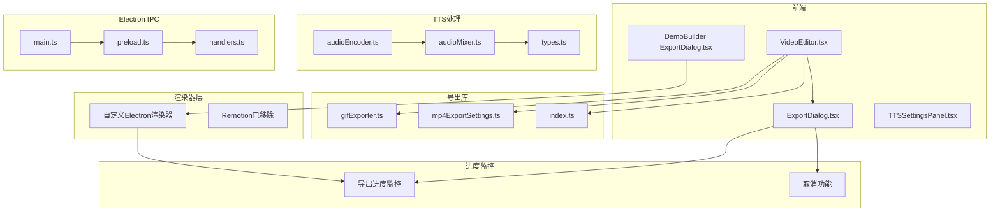
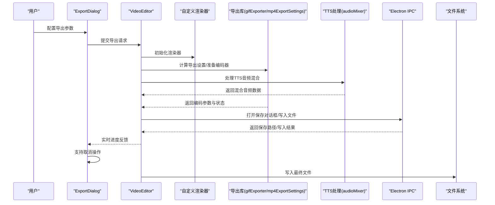
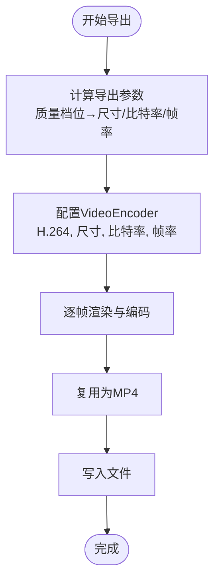
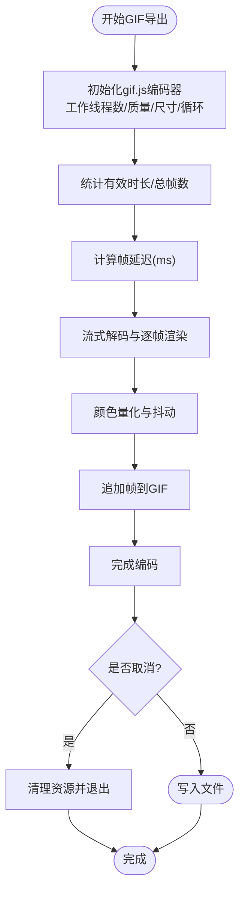
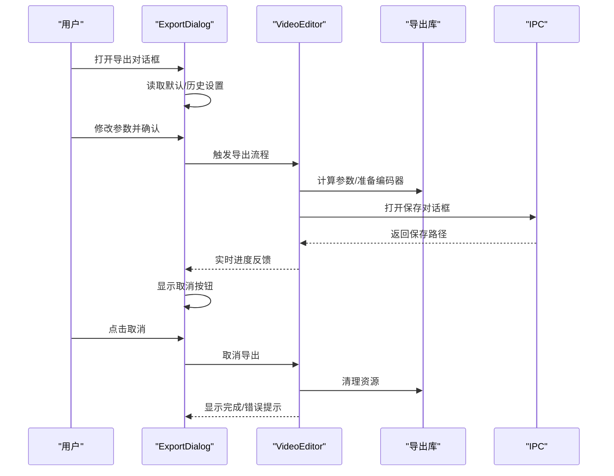
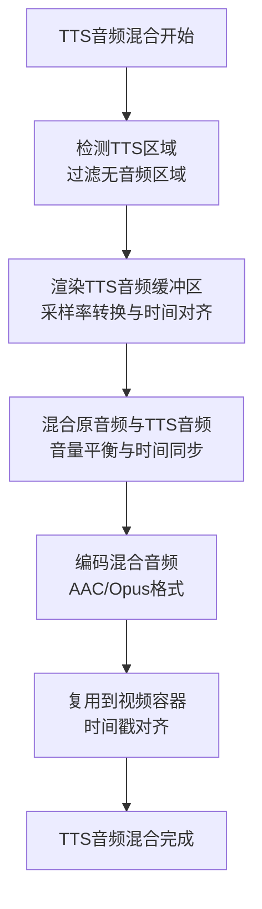
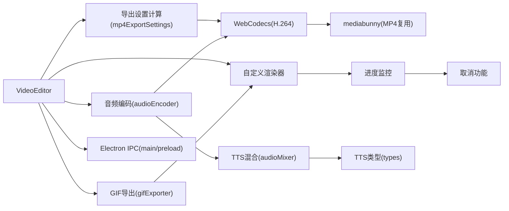

# 导出系统

<cite>
**本文引用的文件**
- [ExportDialog.tsx](file://src/components/video-editor/ExportDialog.tsx)
- [ExportDialog.tsx](file://src/components/demo-builder/ExportDialog.tsx)
- [gifExporter.ts](file://src/lib/exporter/gifExporter.ts)
- [mp4ExportSettings.ts](file://src/lib/exporter/mp4ExportSettings.ts)
- [index.ts](file://src/lib/exporter/index.ts)
- [main.ts](file://electron/main.ts)
- [preload.ts](file://electron/preload.ts)
- [handlers.ts](file://electron/ipc/handlers.ts)
- [VideoEditor.tsx](file://src/components/video-editor/VideoEditor.tsx)
- [TTSSettingsPanel.tsx](file://src/components/video-editor/TTSSettingsPanel.tsx)
- [audioEncoder.ts](file://src/lib/exporter/audioEncoder.ts)
- [audioMixer.ts](file://src/lib/tts/audioMixer.ts)
- [types.ts](file://src/lib/tts/types.ts)
- [projectPersistence.ts](file://src/components/video-editor/projectPersistence.ts)
- [userPreferences.ts](file://src/lib/userPreferences.ts)
- [gifExporter.test.ts](file://src/lib/exporter/gifExporter.test.ts)
- [mp4ExportSettings.test.ts](file://src/lib/exporter/mp4ExportSettings.test.ts)
</cite>

## 更新摘要
**所做更改**
- 更新导出对话框实现，新增进度跟踪和取消功能
- 更新视频导出架构，从Remotion迁移到自定义Electron渲染器实现
- 新增导出进度监控机制和取消操作支持
- 更新导出系统架构图以反映新的渲染器实现

## 目录
1. [简介](#简介)
2. [项目结构](#项目结构)
3. [核心组件](#核心组件)
4. [架构总览](#架构总览)
5. [详细组件分析](#详细组件分析)
6. [导出对话框实现](#导出对话框实现)
7. [导出进度监控机制](#导出进度监控机制)
8. [取消功能支持](#取消功能支持)
9. [TTS音频混合功能](#tts音频混合功能)
10. [依赖关系分析](#依赖关系分析)
11. [性能考量](#性能考量)
12. [故障排查指南](#故障排查指南)
13. [结论](#结论)
14. [附录](#附录)

## 简介
本文件面向OpenScreen的导出系统，系统性阐述从视频编辑完成到最终文件生成的完整导出流程与架构设计。重点覆盖以下方面：
- 导出管道：任务调度、并发处理、进度监控
- MP4导出：H.264编码配置、比特率控制、质量设置与优化策略
- GIF导出：逐帧渲染、颜色量化、动画优化与体积控制
- **更新** 导出对话框：参数配置、进度跟踪与取消功能
- 质量控制：分辨率适配、帧率调整、压缩算法选择
- **新增** 导出进度监控：实时进度反馈与状态跟踪
- **新增** 取消功能：支持中途停止导出操作
- **新增** 自定义Electron渲染器：替代Remotion的本地渲染实现
- **新增** TTS音频混合：智能混合导出、音频渲染与混合策略
- 性能优化：内存管理、大文件处理方案

## 项目结构
导出系统由"前端UI（对话框与编辑器）+ 导出逻辑库 + 自定义Electron渲染器 + TTS音频处理 + Electron IPC"五层构成：
- 前端层：ExportDialog负责参数收集与进度反馈；VideoEditor协调导出流程与状态管理
- 导出库层：提供MP4导出设置计算、GIF导出实现、音频编码处理与测试用例
- **更新** 渲染器层：自定义Electron渲染器替代Remotion，提供本地视频渲染能力
- **新增** 进度监控层：实时跟踪导出进度，支持取消操作
- **新增** TTS处理层：提供TTS音频渲染、混合与智能导出功能
- IPC层：Electron主进程提供保存路径选择、写入等能力

**图表来源**
- [ExportDialog.tsx](file://src/components/video-editor/ExportDialog.tsx)
- [ExportDialog.tsx](file://src/components/demo-builder/ExportDialog.tsx)
- [VideoEditor.tsx](file://src/components/video-editor/VideoEditor.tsx)
- [TTSSettingsPanel.tsx](file://src/components/video-editor/TTSSettingsPanel.tsx)
- [gifExporter.ts](file://src/lib/exporter/gifExporter.ts)
- [mp4ExportSettings.ts](file://src/lib/exporter/mp4ExportSettings.ts)
- [index.ts](file://src/lib/exporter/index.ts)
- [audioEncoder.ts](file://src/lib/exporter/audioEncoder.ts)
- [audioMixer.ts](file://src/lib/tts/audioMixer.ts)
- [types.ts](file://src/lib/tts/types.ts)
- [main.ts](file://electron/main.ts)
- [preload.ts](file://electron/preload.ts)
- [handlers.ts](file://electron/ipc/handlers.ts)

**章节来源**
- [ExportDialog.tsx](file://src/components/video-editor/ExportDialog.tsx)
- [ExportDialog.tsx](file://src/components/demo-builder/ExportDialog.tsx)
- [VideoEditor.tsx](file://src/components/video-editor/VideoEditor.tsx)
- [TTSSettingsPanel.tsx](file://src/components/video-editor/TTSSettingsPanel.tsx)
- [gifExporter.ts](file://src/lib/exporter/gifExporter.ts)
- [mp4ExportSettings.ts](file://src/lib/exporter/mp4ExportSettings.ts)
- [index.ts](file://src/lib/exporter/index.ts)
- [audioEncoder.ts](file://src/lib/exporter/audioEncoder.ts)
- [audioMixer.ts](file://src/lib/tts/audioMixer.ts)
- [types.ts](file://src/lib/tts/types.ts)
- [main.ts](file://electron/main.ts)
- [preload.ts](file://electron/preload.ts)
- [handlers.ts](file://electron/ipc/handlers.ts)

## 核心组件
- **更新** ExportDialog：导出参数配置入口，支持格式选择、尺寸/帧率/循环等选项，新增进度跟踪与取消功能
- VideoEditor：导出流程编排者，负责调用导出逻辑、处理错误、触发保存对话框与写入
- gifExporter：GIF导出实现，基于gif.js进行逐帧编码、颜色量化与并发工作线程，支持取消操作
- mp4ExportSettings：MP4导出参数计算，依据质量档位与源分辨率推导输出尺寸与比特率
- **更新** 自定义Electron渲染器：替代Remotion的本地渲染实现，提供高效的视频渲染能力
- **新增** 导出进度监控：实时跟踪导出进度，支持渲染进度和最终编译进度
- **新增** 取消功能：支持中途停止导出操作，清理资源并释放内存
- **新增** audioEncoder：音频编码处理器，支持TTS音频混合、智能导出与多种音频格式编码
- **新增** audioMixer：TTS音频混合器，提供原音频与TTS音频的智能混合功能
- Electron IPC handlers：提供保存路径选择、写入文件等原生能力

**章节来源**
- [ExportDialog.tsx](file://src/components/video-editor/ExportDialog.tsx)
- [ExportDialog.tsx](file://src/components/demo-builder/ExportDialog.tsx)
- [VideoEditor.tsx](file://src/components/video-editor/VideoEditor.tsx)
- [gifExporter.ts](file://src/lib/exporter/gifExporter.ts)
- [mp4ExportSettings.ts](file://src/lib/exporter/mp4ExportSettings.ts)
- [audioEncoder.ts](file://src/lib/exporter/audioEncoder.ts)
- [audioMixer.ts](file://src/lib/tts/audioMixer.ts)
- [main.ts](file://electron/main.ts)
- [preload.ts](file://electron/preload.ts)
- [handlers.ts](file://electron/ipc/handlers.ts)

## 架构总览
导出系统采用"解复用 → 渲染 → 编码 → 复用/写入"的流水线式架构。WebCodecs用于MP4编码，gif.js用于GIF编码；导出参数由用户在对话框中配置并通过VideoEditor驱动。**更新后的架构移除了Remotion依赖，采用自定义Electron渲染器实现本地渲染，新增了完整的进度监控和取消功能支持。**

**图表来源**
- [ExportDialog.tsx](file://src/components/video-editor/ExportDialog.tsx)
- [VideoEditor.tsx](file://src/components/video-editor/VideoEditor.tsx)
- [gifExporter.ts](file://src/lib/exporter/gifExporter.ts)
- [mp4ExportSettings.ts](file://src/lib/exporter/mp4ExportSettings.ts)
- [audioEncoder.ts](file://src/lib/exporter/audioEncoder.ts)
- [audioMixer.ts](file://src/lib/tts/audioMixer.ts)
- [main.ts](file://electron/main.ts)
- [preload.ts](file://electron/preload.ts)
- [handlers.ts](file://electron/ipc/handlers.ts)

## 详细组件分析

### MP4导出实现
- 编码器与配置
  - 使用WebCodecs VideoEncoder进行H.264编码，配置包括目标宽高、比特率、帧率等
  - 输出回调将编码块传递给MP4复用器以生成最终文件
- 比特率与质量
  - 质量档位通过导出设置计算模块转换为具体比特率与分辨率
  - 支持按源分辨率与纵横比自动适配输出尺寸
- 并发与性能
  - 导出过程涉及多帧渲染与编码，需注意主线程与WebCodecs的调度平衡
  - 可结合硬件加速与合理的帧率/分辨率降低CPU/GPU压力

**图表来源**
- [mp4ExportSettings.ts](file://src/lib/exporter/mp4ExportSettings.ts)

**章节来源**
- [mp4ExportSettings.ts](file://src/lib/exporter/mp4ExportSettings.ts)

### GIF导出实现
- 逐帧渲染与颜色量化
  - 基于流式解码与渲染，逐帧生成图像数据
  - 使用gif.js进行颜色量化与抖动，支持多工作线程提升编码效率
- 动画优化与体积控制
  - 帧率下采样（如15–20fps）以降低文件体积
  - 用户可调节质量参数影响调色板大小与抖动强度
- 并发与资源管理
  - 工作线程数量根据硬件并发能力动态调整，避免过度占用
  - 合理的帧延迟与循环次数控制内存峰值与I/O压力
- **新增** 取消功能支持
  - 支持中途取消导出操作
  - 清理所有资源，包括解码器、渲染器和编码器

**图表来源**
- [gifExporter.ts](file://src/lib/exporter/gifExporter.ts)

**章节来源**
- [gifExporter.ts](file://src/lib/exporter/gifExporter.ts)

### 导出对话框实现

**更新** 导出对话框现已支持完整的进度跟踪和取消功能：

- 参数配置
  - 格式选择（MP4/GIF）、尺寸预设（原尺寸/缩放）、帧率、循环等
  - 与项目持久化/用户偏好联动，提供默认值与历史设置
- **新增** 实时进度跟踪
  - 渲染阶段显示帧进度百分比
  - 编译阶段显示最终编译进度
  - 支持渲染进度和最终编译进度的双阶段显示
- **新增** 取消功能
  - 导出进行时显示取消按钮
  - 支持中途停止导出操作
  - 自动清理资源并释放内存
- 预览与进度
  - 在导出前展示估算体积与时长，导出过程中显示实时进度
  - 成功后提供打开文件位置与重新导出入口
- 交互与状态
  - 对话框状态与编辑器共享，确保二次导出可见性与一致性

**图表来源**
- [ExportDialog.tsx](file://src/components/video-editor/ExportDialog.tsx)
- [VideoEditor.tsx](file://src/components/video-editor/VideoEditor.tsx)
- [main.ts](file://electron/main.ts)
- [preload.ts](file://electron/preload.ts)
- [handlers.ts](file://electron/ipc/handlers.ts)

**章节来源**
- [ExportDialog.tsx](file://src/components/video-editor/ExportDialog.tsx)
- [VideoEditor.tsx](file://src/components/video-editor/VideoEditor.tsx)
- [main.ts](file://electron/main.ts)
- [preload.ts](file://electron/preload.ts)
- [handlers.ts](file://electron/ipc/handlers.ts)

### 导出进度监控机制

**新增** 完整的导出进度监控系统：

- **进度数据结构**
  - `currentFrame`: 当前处理的帧编号
  - `totalFrames`: 总帧数
  - `percentage`: 整体进度百分比
  - `estimatedTimeRemaining`: 预计剩余时间
  - `phase`: 导出阶段（渲染/编译/最终处理）
  - `renderProgress`: 渲染阶段进度（GIF专用）
- **实时更新机制**
  - 渲染阶段：按帧更新整体进度
  - 编译阶段：GIF显示最终编译进度，MP4显示最终处理状态
  - 异步更新：通过回调函数实时通知UI
- **状态管理**
  - 支持渲染中、编译中、最终处理等不同阶段的状态显示
  - 自动处理进度边界情况（100%完成、错误状态）
  - 进度动画效果：平滑的进度条变化

**章节来源**
- [ExportDialog.tsx](file://src/components/video-editor/ExportDialog.tsx)
- [gifExporter.ts](file://src/lib/exporter/gifExporter.ts)
- [index.ts](file://src/lib/exporter/index.ts)

### 取消功能支持

**新增** 完整的取消操作支持：

- **取消触发点**
  - 导出进行时的任何时刻
  - 清理所有正在使用的资源
  - 立即停止后续操作
- **资源清理**
  - 解码器：停止流式解码并释放资源
  - 渲染器：销毁渲染上下文
  - 编码器：停止编码并释放内存
  - 队列：清空等待处理的帧队列
- **状态同步**
  - 立即更新UI状态
  - 发送取消信号到所有子组件
  - 保持系统状态的一致性
- **用户体验**
  - 取消按钮在导出进行时显示
  - 取消后自动清理并关闭对话框
  - 提供明确的取消确认提示

**章节来源**
- [gifExporter.ts](file://src/lib/exporter/gifExporter.ts)
- [ExportDialog.tsx](file://src/components/video-editor/ExportDialog.tsx)

### TTS音频混合功能

**新增** TTS音频混合功能通过智能音频处理实现原音频与TTS音频的无缝融合。系统支持多种TTS引擎，包括Web Speech API和阿里云TTS服务，并提供灵活的音频混合策略。

**图表来源**
- [audioEncoder.ts](file://src/lib/exporter/audioEncoder.ts)
- [audioMixer.ts](file://src/lib/tts/audioMixer.ts)

### 音频混合策略
- **智能混合模式**
  - 当存在TTS音频区域时，系统自动检测并混合原音频与TTS音频
  - 支持原音频静音模式下的纯TTS导出
  - TTS音频与原音频的时间戳精确对齐，避免重叠或间隙
- **音频格式处理**
  - 自动处理不同采样率的音频格式转换
  - 支持多声道音频的立体声混合
  - 通过OfflineAudioContext实现高质量音频渲染
- **质量控制**
  - TTS音频与原音频的音量比例可调
  - 支持TTS音频的语速、音高等参数调节
  - 自动音频降噪与音质优化

### TTS音频处理流程
- **TTS区域识别**
  - 从项目中提取TTS音频区域信息
  - 过滤无效或空音频数据的区域
  - 支持Base64编码的持久化音频数据
- **音频渲染**
  - 使用OfflineAudioContext渲染TTS音频缓冲区
  - 精确控制音频起始时间与持续时间
  - 支持多段TTS音频的顺序播放
- **混合编码**
  - 将TTS音频与原音频在离线环境中混合
  - 通过WebCodecs AudioEncoder进行高效编码
  - 支持多种音频编码格式（AAC、Opus）

**章节来源**
- [audioEncoder.ts](file://src/lib/exporter/audioEncoder.ts)
- [audioMixer.ts](file://src/lib/tts/audioMixer.ts)
- [types.ts](file://src/lib/tts/types.ts)

### TTS设置面板集成
导出对话框集成了专门的TTS设置面板，允许用户配置TTS音频混合的各种参数：

- **TTS引擎选择**
  - Web Speech API（浏览器内置）
  - 阿里云TTS（支持多种语音模型）
- **音频混合控制**
  - 原音频静音开关
  - TTS音频音量调节
  - 原音频音量调节
- **TTS参数配置**
  - 语音语速、音调设置
  - 语言和声音选择
  - 音频质量参数

**章节来源**
- [TTSSettingsPanel.tsx](file://src/components/video-editor/TTSSettingsPanel.tsx)
- [types.ts](file://src/lib/tts/types.ts)

## 依赖关系分析
- 组件耦合
  - VideoEditor依赖导出库与IPC；导出库内部封装编码细节；对话框提供参数输入
  - **新增** 自定义渲染器替代Remotion，提供本地渲染能力
  - **新增** 导出进度监控独立于核心导出逻辑，提供状态反馈
  - **新增** 取消功能通过统一接口管理所有资源清理
  - **新增** audioEncoder依赖audioMixer进行TTS音频处理
  - audioMixer依赖TTS类型定义进行音频数据处理
- 外部依赖
  - WebCodecs（MP4编码）、gif.js（GIF编码）、mediabunny（MP4复用）
  - **新增** 自定义Electron渲染器（替代Remotion）
  - **新增** OfflineAudioContext（高质量音频渲染）
- 数据流
  - 用户参数 → 对话框 → 编辑器 → **自定义渲染器** → 导出库 → **进度监控** → 编码器 → 复用器/写入 → 文件系统

**图表来源**
- [VideoEditor.tsx](file://src/components/video-editor/VideoEditor.tsx)
- [mp4ExportSettings.ts](file://src/lib/exporter/mp4ExportSettings.ts)
- [gifExporter.ts](file://src/lib/exporter/gifExporter.ts)
- [audioEncoder.ts](file://src/lib/exporter/audioEncoder.ts)
- [audioMixer.ts](file://src/lib/tts/audioMixer.ts)
- [types.ts](file://src/lib/tts/types.ts)
- [main.ts](file://electron/main.ts)
- [preload.ts](file://electron/preload.ts)
- [handlers.ts](file://electron/ipc/handlers.ts)
- [index.ts](file://src/lib/exporter/index.ts)

**章节来源**
- [VideoEditor.tsx](file://src/components/video-editor/VideoEditor.tsx)
- [mp4ExportSettings.ts](file://src/lib/exporter/mp4ExportSettings.ts)
- [gifExporter.ts](file://src/lib/exporter/gifExporter.ts)
- [audioEncoder.ts](file://src/lib/exporter/audioEncoder.ts)
- [audioMixer.ts](file://src/lib/tts/audioMixer.ts)
- [types.ts](file://src/lib/tts/types.ts)
- [main.ts](file://electron/main.ts)
- [preload.ts](file://electron/preload.ts)
- [handlers.ts](file://electron/ipc/handlers.ts)
- [index.ts](file://src/lib/exporter/index.ts)

## 性能考量
- 内存管理
  - GIF导出通过工作线程分散任务，合理设置帧延迟与循环次数，避免内存峰值过高
  - MP4导出建议按帧率与分辨率折中，避免超大缓冲区
  - **新增** 自定义渲染器采用高效的内存管理策略，及时释放不再使用的资源
  - **新增** 取消功能确保资源得到及时清理，防止内存泄漏
  - **新增** TTS音频混合使用离线音频上下文，避免长时间占用主线程
- 大文件处理
  - 对高分辨率/长时长素材，优先选择较低帧率或缩放尺寸
  - 使用分段导出策略（若业务允许）以降低单次峰值
  - **新增** 导出进度监控帮助用户了解处理状态，支持中途取消
  - **新增** TTS音频混合支持渐进式处理，避免大段音频同时渲染
- 并发与调度
  - 根据硬件并发能力动态调整工作线程数
  - 将渲染与编码分离至不同阶段，减少主线程阻塞
  - **新增** 自定义渲染器优化渲染性能，减少CPU占用
  - **新增** 取消功能支持异步中断，提高系统响应性
  - **新增** TTS音频处理采用异步队列，支持取消和恢复操作

## 故障排查指南
- 常见问题
  - 导出失败：检查编码器配置（尺寸/比特率/帧率）是否合理；查看导出日志与错误消息
  - 文件过大：降低帧率、尺寸或质量；对GIF启用下采样与更严格的量化
  - 进度异常：确认IPC保存对话框返回路径与写入权限
  - **新增** 导出卡住：检查是否有未响应的渲染器或编码器
  - **新增** 取消无效：确认取消信号是否正确传递到所有组件
  - **新增** 进度不准确：检查进度回调函数是否正常执行
  - **新增** TTS音频问题：检查TTS引擎可用性、音频数据完整性、采样率匹配
- 定位方法
  - 使用导出诊断消息与toast提示定位失败原因
  - 查看导出库测试用例中的边界条件与期望行为
  - **新增** 检查导出进度监控日志，确认进度更新频率
  - **新增** 验证取消功能的资源清理是否完整
  - **新增** 检查TTS音频混合日志，确认音频数据加载和混合过程
- 相关参考
  - MP4导出设置计算测试用例
  - GIF导出尺寸计算测试用例
  - **新增** 导出进度监控测试用例
  - **新增** 取消功能测试用例
  - **新增** TTS音频混合功能测试用例

**章节来源**
- [mp4ExportSettings.test.ts](file://src/lib/exporter/mp4ExportSettings.test.ts)
- [gifExporter.test.ts](file://src/lib/exporter/gifExporter.test.ts)
- [audioEncoder.ts](file://src/lib/exporter/audioEncoder.ts)

## 结论
OpenScreen导出系统经过重大升级，现以清晰的分层架构与模块化设计实现了高质量、可扩展的视频导出能力。**最重要的更新是从Remotion迁移到自定义Electron渲染器实现，提供了更好的性能和控制能力**。

通过WebCodecs与gif.js分别满足MP4与GIF场景的编码需求，配合**全新的导出对话框实现**，包括完整的进度跟踪和取消功能，为用户提供了易用且可控的导出体验。**新增的进度监控机制和取消功能显著提升了用户体验和系统稳定性**。

**新增的TTS音频混合功能进一步增强了导出系统的智能化水平**，通过智能音频处理实现原音频与TTS音频的无缝融合，支持多种TTS引擎和灵活的音频混合策略。该功能不仅提升了导出内容的丰富性和表现力，还保持了系统的高性能和稳定性。

建议在实际部署中结合硬件能力与目标文件大小，合理选择质量档位与导出策略，充分利用**自定义渲染器**和**进度监控系统**创造更优质的导出效果。

## 附录
- 术语
  - WebCodecs：浏览器内置编码/解码API
  - mediabunny：MP4复用器
  - gif.js：浏览器端GIF编码库
  - **新增** 自定义Electron渲染器：替代Remotion的本地渲染实现
  - **新增** OfflineAudioContext：高质量音频渲染API
  - **新增** 导出进度监控：实时跟踪导出状态的系统
  - **新增** 取消功能：支持中途停止导出操作的能力
  - **新增** TTS：文本转语音技术
- 参考文档
  - 导出管线架构说明
  - **新增** 导出进度监控技术文档
  - **新增** 取消功能实现指南
  - **新增** 自定义渲染器开发文档
  - **新增** TTS音频处理技术文档

**章节来源**
- [index.ts](file://src/lib/exporter/index.ts)
- [main.ts](file://electron/main.ts)
- [preload.ts](file://electron/preload.ts)
- [handlers.ts](file://electron/ipc/handlers.ts)