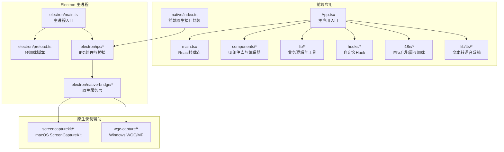
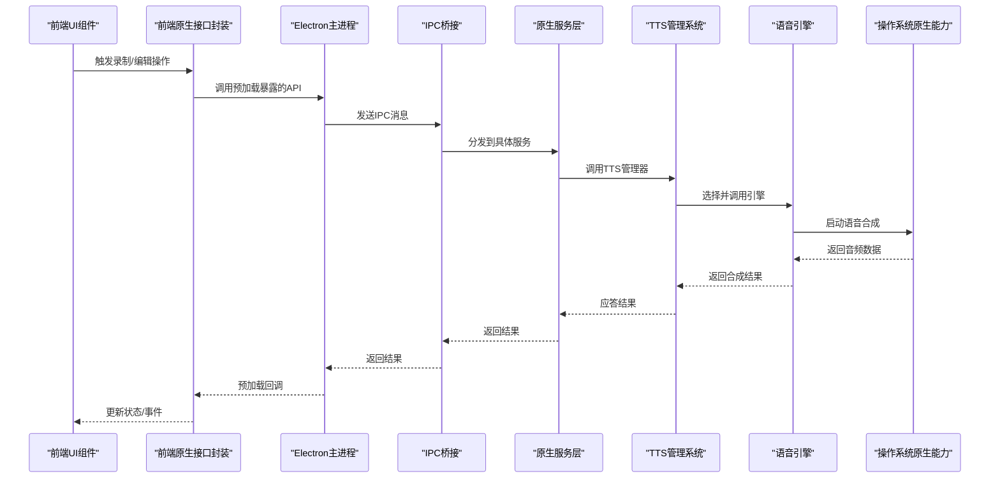
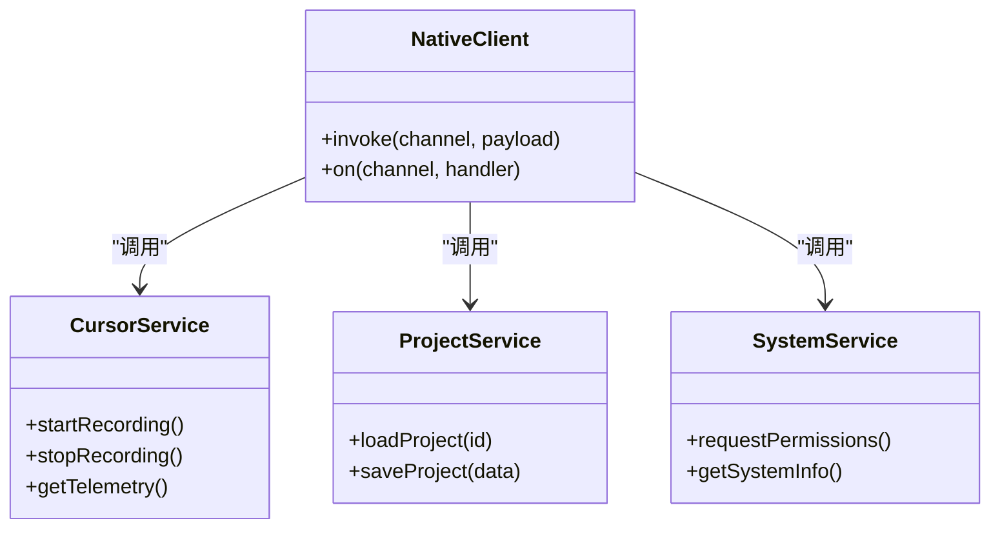
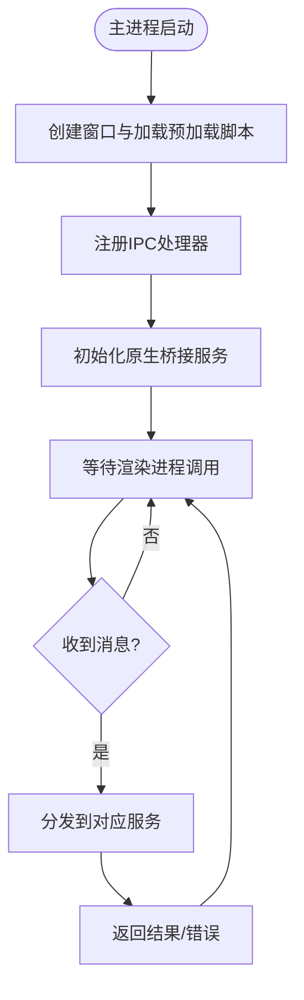
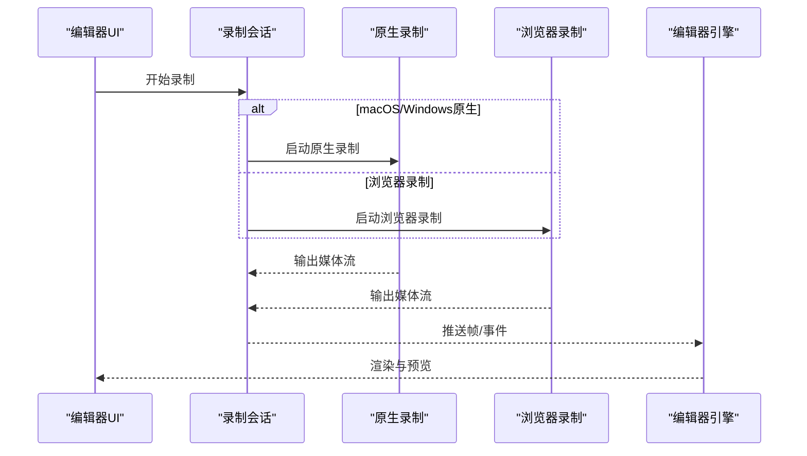
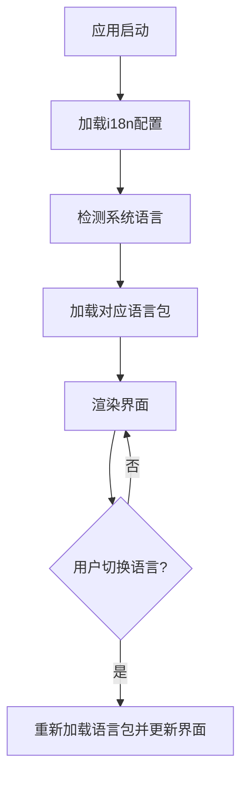
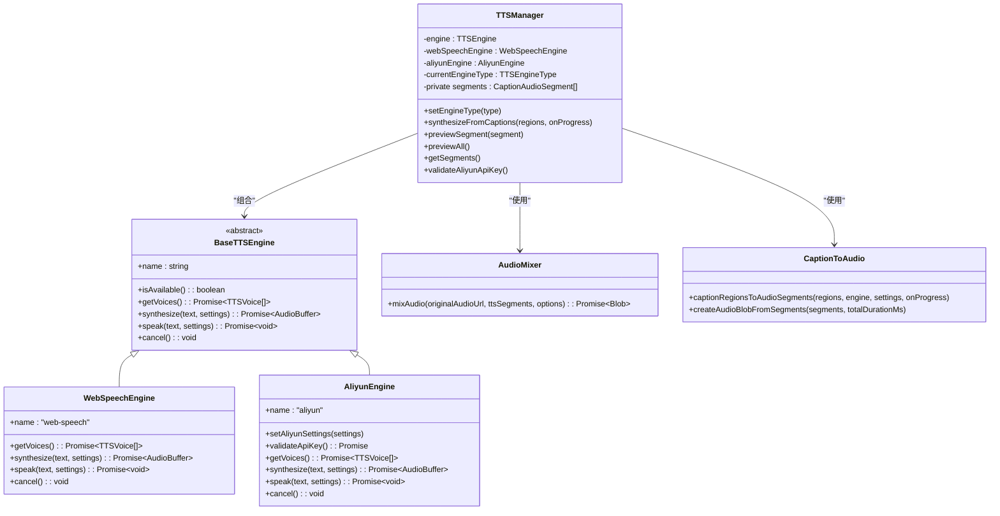
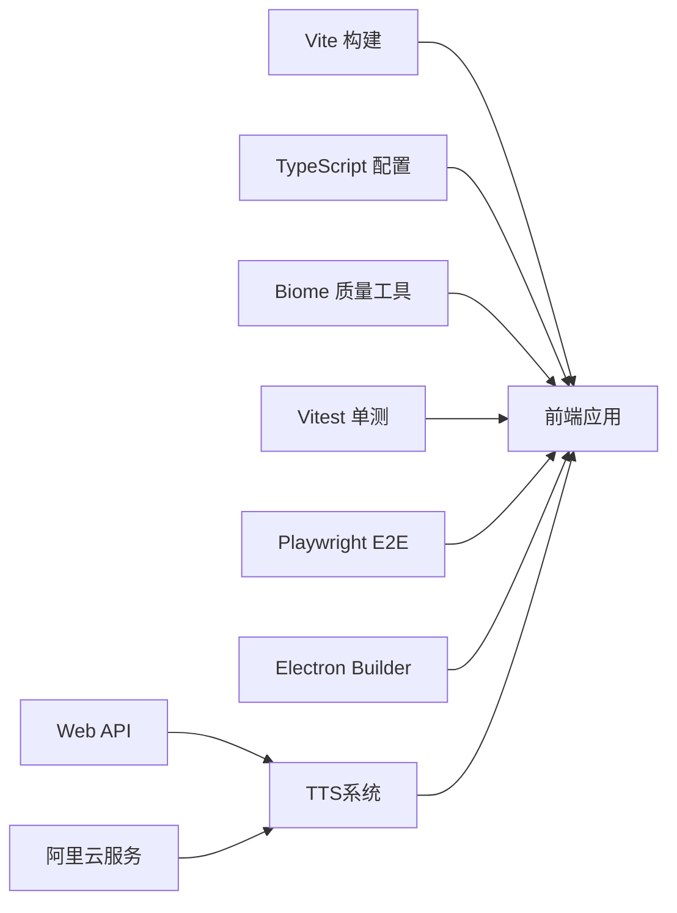

# 开发者指南

<cite>
**本文引用的文件**
- [README.md](file://README.md)
- [CONTRIBUTING.md](file://CONTRIBUTING.md)
- [AGENTS.md](file://AGENTS.md)
- [.editorconfig](file://.editorconfig)
- [biome.json](file://biome.json)
- [package.json](file://package.json)
- [tsconfig.json](file://tsconfig.json)
- [tsconfig.node.json](file://tsconfig.node.json)
- [vite.config.ts](file://vite.config.ts)
- [vitest.config.ts](file://vitest.config.ts)
- [playwright.config.ts](file://playwright.config.ts)
- [electron-builder.json5](file://electron-builder.json5)
- [electron/main.ts](file://electron/main.ts)
- [electron/preload.ts](file://electron/preload.ts)
- [electron/ipc/nativeBridge.ts](file://electron/ipc/nativeBridge.ts)
- [electron/ipc/handlers.ts](file://electron/ipc/handlers.ts)
- [electron/native-bridge/store.ts](file://electron/native-bridge/store.ts)
- [electron/native-bridge/services/cursorService.ts](file://electron/native-bridge/services/cursorService.ts)
- [electron/native-bridge/services/projectService.ts](file://electron/native-bridge/services/projectService.ts)
- [electron/native-bridge/services/systemService.ts](file://electron/native-bridge/services/systemService.ts)
- [src/App.tsx](file://src/App.tsx)
- [src/main.tsx](file://src/main.tsx)
- [src/native/index.ts](file://src/native/index.ts)
- [src/native/client.ts](file://src/native/client.ts)
- [src/native/contracts.ts](file://src/native/contracts.ts)
- [src/lib/recordingSession.ts](file://src/lib/recordingSession.ts)
- [src/lib/nativeMacRecording.ts](file://src/lib/nativeMacRecording.ts)
- [src/lib/nativeWindowsRecording.ts](file://src/lib/nativeWindowsRecording.ts)
- [src/hooks/useScreenRecorder.ts](file://src/hooks/useScreenRecorder.ts)
- [src/components/video-editor/VideoEditor.tsx](file://src/components/video-editor/VideoEditor.tsx)
- [src/components/video-editor/VideoPlayback.tsx](file://src/components/video-editor/VideoPlayback.tsx)
- [src/i18n/config.ts](file://src/i18n/config.ts)
- [src/i18n/loader.ts](file://src/i18n/loader.ts)
- [src/lib/tts/index.ts](file://src/lib/tts/index.ts)
- [src/lib/tts/engine.ts](file://src/lib/tts/engine.ts)
- [src/lib/tts/types.ts](file://src/lib/tts/types.ts)
- [src/lib/tts/webSpeechEngine.ts](file://src/lib/tts/webSpeechEngine.ts)
- [src/lib/tts/aliyunEngine.ts](file://src/lib/tts/aliyunEngine.ts)
- [src/lib/tts/ttsManager.ts](file://src/lib/tts/ttsManager.ts)
- [src/lib/tts/audioMixer.ts](file://src/lib/tts/audioMixer.ts)
- [src/lib/tts/captionToAudio.ts](file://src/lib/tts/captionToAudio.ts)
- [scripts/build-macos-screencapturekit-helper.mjs](file://scripts/build-macos-screencapturekit-helper.mjs)
- [scripts/build-windows-wgc-helper.mjs](file://scripts/build-windows-wgc-helper.mjs)
- [scripts/test-windows-native-cursor.mjs](file://scripts/test-windows-native-cursor.mjs)
- [scripts/test-windows-wgc-helper.mjs](file://scripts/test-windows-wgc-helper.mjs)
- [scripts/i18n-check.mjs](file://scripts/i18n-check.mjs)
- [docs/01-overview.md](file://docs/01-overview.md)
- [docs/01-getting-started/01-getting-started.md](file://docs/01-getting-started/01-getting-started.md)
- [docs/01-getting-started/02-installation-and-setup.md](file://docs/01-getting-started/02-installation-and-setup.md)
- [docs/01-getting-started/03-development-environment.md](file://docs/01-getting-started/03-development-environment.md)
- [docs/02-architecture/01-ipc-communication-system.md](file://docs/02-architecture/01-ipc-communication-system.md)
- [docs/02-architecture/02-window-management-and-routing.md](file://docs/02-architecture/02-window-management-and-routing.md)
- [docs/03-recording/01-screen-recording-system.md](file://docs/03-recording/01-screen-recording-system.md)
- [docs/03-recording/02-recording-workflow-and-controls.md](file://docs/03-recording/02-recording-workflow-and-controls.md)
- [docs/03-recording/03-cursor-telemetry-system.md](file://docs/03-recording/03-cursor-telemetry-system.md)
- [docs/04-video-editor/01-video-editor-component-and-state-management.md](file://docs/04-video-editor/01-video-editor-component-and-state-management.md)
- [docs/04-video-editor/02-settings-panel-and-configuration-ui.md](file://docs/04-video-editor/02-settings-panel-and-configuration-ui.md)
- [docs/04-video-editor/03-video-playback-system.md](file://docs/04-video-editor/03-video-playback-system.md)
- [docs/05-export/01-export-pipeline-architecture.md](file://docs/05-export/01-export-pipeline-architecture.md)
- [docs/06-build/README.md](file://docs/06-build/README.md)
- [docs/testing/writing-tests.md](file://docs/testing/writing-tests.md)
- [tests/e2e/gif-export.spec.ts](file://tests/e2e/gif-export.spec.ts)
- [tests/e2e/windows-native-checklist.spec.ts](file://tests/e2e/windows-native-checklist.spec.ts)
- [.github/pull_request_template.md](file://.github/pull_request_template.md)
- [.github/workflows](file://.github/workflows)
</cite>

## 更新摘要
**所做更改**
- 新增TTS系统开发文档章节，详细介绍文本转语音功能的架构设计与实现
- 更新AGENTS.md文档，提供Qoder团队的开发指导和最佳实践
- 增强TTS引擎抽象层设计说明，包括Web Speech API和阿里云TTS引擎
- 补充音频混合器和字幕转音频的实现细节
- 更新项目结构图，反映TTS系统的集成位置

## 目录
1. [简介](#简介)
2. [项目结构](#项目结构)
3. [核心组件](#核心组件)
4. [架构总览](#架构总览)
5. [详细组件分析](#详细组件分析)
6. [TTS系统开发指南](#tts系统开发指南)
7. [依赖关系分析](#依赖关系分析)
8. [性能考虑](#性能考虑)
9. [故障排查指南](#故障排查指南)
10. [结论](#结论)
11. [附录](#附录)

## 简介
本指南面向OpenScreen项目的贡献者与维护者，目标是帮助你快速理解并高效参与开发。内容覆盖代码规范与最佳实践（TypeScript编码标准、Biome/Lint配置、代码审查流程）、开发工作流（分支策略、提交信息规范、PR流程）、调试与开发工具（Electron DevTools、React Developer Tools、性能分析）、项目结构与模块组织（文件命名约定、目录结构、依赖管理）、测试与质量保障（覆盖率、质量检查、基准测试）、TTS系统开发指导、贡献指南与问题模板、新贡献者入门与常见问题解答。

## 项目结构
OpenScreen采用前后端分离与原生桥接相结合的架构：前端基于Vite + React + TypeScript；后端基于Electron；通过IPC与原生模块交互；同时包含多平台原生录制辅助组件（macOS ScreenCaptureKit、Windows Media Foundation/WGC）。新增的TTS系统为视频编辑功能提供智能语音合成能力。



**图表来源**
- [src/App.tsx](file://src/App.tsx)
- [src/main.tsx](file://src/main.tsx)
- [src/native/index.ts](file://src/native/index.ts)
- [src/lib/tts/index.ts](file://src/lib/tts/index.ts)
- [electron/main.ts](file://electron/main.ts)
- [electron/preload.ts](file://electron/preload.ts)
- [electron/ipc/nativeBridge.ts](file://electron/ipc/nativeBridge.ts)
- [electron/native-bridge/store.ts](file://electron/native-bridge/store.ts)

**章节来源**
- [README.md](file://README.md)
- [docs/01-overview.md](file://docs/01-overview.md)
- [docs/01-getting-started/01-getting-started.md](file://docs/01-getting-started/01-getting-started.md)

## 核心组件
- 前端应用与路由：主应用入口负责初始化与路由，React组件库提供UI基础能力，视频编辑器组件承载剪辑、播放、导出等核心功能。
- Electron主进程：负责窗口生命周期、菜单、快捷键、系统级权限与原生桥接。
- IPC与原生桥接：在渲染进程与主进程之间建立类型安全的通信通道，封装原生录制、项目与系统服务。
- 录制与编辑管线：包含WebRTC/浏览器录制、原生录制（macOS/Windows）、光标遥测、视频编辑与导出。
- 国际化：集中式语言包与动态加载机制，支持多语言切换与校验脚本。
- **TTS系统**：提供文本转语音功能，支持Web Speech API和阿里云TTS引擎，包含音频混合、字幕处理和语音合成管理。

**章节来源**
- [src/App.tsx](file://src/App.tsx)
- [src/main.tsx](file://src/main.tsx)
- [electron/main.ts](file://electron/main.ts)
- [electron/ipc/nativeBridge.ts](file://electron/ipc/nativeBridge.ts)
- [electron/native-bridge/services/cursorService.ts](file://electron/native-bridge/services/cursorService.ts)
- [src/i18n/config.ts](file://src/i18n/config.ts)

## 架构总览
OpenScreen采用"前端React + Electron主进程 + 原生桥接"的分层架构。前端通过原生接口与主进程通信，主进程通过IPC调用原生桥接服务，实现跨平台屏幕录制与编辑能力。TTS系统作为编辑器功能的一部分，通过统一的管理器协调不同引擎的语音合成。



**图表来源**
- [src/native/index.ts](file://src/native/index.ts)
- [src/native/client.ts](file://src/native/client.ts)
- [electron/main.ts](file://electron/main.ts)
- [electron/ipc/nativeBridge.ts](file://electron/ipc/nativeBridge.ts)
- [electron/native-bridge/services/projectService.ts](file://electron/native-bridge/services/projectService.ts)
- [src/lib/tts/ttsManager.ts](file://src/lib/tts/ttsManager.ts)

## 详细组件分析

### 前端应用与原生接口
- 原生接口封装：统一暴露方法给渲染进程，隐藏IPC细节，提供类型安全的调用方式。
- 组件职责：UI组件按功能域拆分，编辑器组件包含时间轴、播放器、设置面板等子模块。
- 国际化：集中配置语言包路径与加载策略，提供运行时切换与校验脚本。



**图表来源**
- [src/native/client.ts](file://src/native/client.ts)
- [src/native/contracts.ts](file://src/native/contracts.ts)
- [electron/native-bridge/services/cursorService.ts](file://electron/native-bridge/services/cursorService.ts)
- [electron/native-bridge/services/projectService.ts](file://electron/native-bridge/services/projectService.ts)
- [electron/native-bridge/services/systemService.ts](file://electron/native-bridge/services/systemService.ts)

**章节来源**
- [src/native/index.ts](file://src/native/index.ts)
- [src/native/client.ts](file://src/native/client.ts)
- [src/native/contracts.ts](file://src/native/contracts.ts)
- [src/components/video-editor/VideoEditor.tsx](file://src/components/video-editor/VideoEditor.tsx)
- [src/components/video-editor/VideoPlayback.tsx](file://src/components/video-editor/VideoPlayback.tsx)
- [src/i18n/config.ts](file://src/i18n/config.ts)

### Electron主进程与IPC
- 主进程入口：初始化窗口、菜单、全局快捷键、国际化与原生桥接。
- 预加载脚本：向渲染进程暴露受控API，隔离Node能力，确保安全。
- IPC桥接：集中处理消息分发与错误处理，提供统一的服务访问入口。



**图表来源**
- [electron/main.ts](file://electron/main.ts)
- [electron/preload.ts](file://electron/preload.ts)
- [electron/ipc/nativeBridge.ts](file://electron/ipc/nativeBridge.ts)
- [electron/ipc/handlers.ts](file://electron/ipc/handlers.ts)

**章节来源**
- [electron/main.ts](file://electron/main.ts)
- [electron/preload.ts](file://electron/preload.ts)
- [electron/ipc/nativeBridge.ts](file://electron/ipc/nativeBridge.ts)
- [electron/ipc/handlers.ts](file://electron/ipc/handlers.ts)

### 录制与编辑管线
- 录制会话：抽象统一的录制会话接口，分别对接浏览器录制与原生录制（macOS/Windows）。
- 编辑器：时间轴、播放控制、标注、模糊、字幕、导出等功能模块化组织。
- 光标遥测：采集光标轨迹与事件，用于回放与分析。



**图表来源**
- [src/lib/recordingSession.ts](file://src/lib/recordingSession.ts)
- [src/lib/nativeMacRecording.ts](file://src/lib/nativeMacRecording.ts)
- [src/lib/nativeWindowsRecording.ts](file://src/lib/nativeWindowsRecording.ts)
- [src/hooks/useScreenRecorder.ts](file://src/hooks/useScreenRecorder.ts)
- [src/components/video-editor/VideoEditor.tsx](file://src/components/video-editor/VideoEditor.tsx)

**章节来源**
- [src/lib/recordingSession.ts](file://src/lib/recordingSession.ts)
- [src/lib/nativeMacRecording.ts](file://src/lib/nativeMacRecording.ts)
- [src/lib/nativeWindowsRecording.ts](file://src/lib/nativeWindowsRecording.ts)
- [src/hooks/useScreenRecorder.ts](file://src/hooks/useScreenRecorder.ts)
- [docs/03-recording/01-screen-recording-system.md](file://docs/03-recording/01-screen-recording-system.md)
- [docs/04-video-editor/01-video-editor-component-and-state-management.md](file://docs/04-video-editor/01-video-editor-component-and-state-management.md)

### 国际化与本地化
- 配置：集中定义语言包路径与默认语言。
- 加载：按需加载语言包，支持运行时切换。
- 校验：提供脚本检查缺失翻译键，确保多语言一致性。



**图表来源**
- [src/i18n/config.ts](file://src/i18n/config.ts)
- [src/i18n/loader.ts](file://src/i18n/loader.ts)
- [scripts/i18n-check.mjs](file://scripts/i18n-check.mjs)

**章节来源**
- [src/i18n/config.ts](file://src/i18n/config.ts)
- [src/i18n/loader.ts](file://src/i18n/loader.ts)
- [scripts/i18n-check.mjs](file://scripts/i18n-check.mjs)

## TTS系统开发指南

### TTS系统架构概述
OpenScreen的TTS系统是一个高度模块化的文本转语音解决方案，支持多种语音引擎和音频处理功能。系统采用抽象工厂模式，通过统一的管理器协调不同引擎的语音合成。



**图表来源**
- [src/lib/tts/ttsManager.ts](file://src/lib/tts/ttsManager.ts)
- [src/lib/tts/engine.ts](file://src/lib/tts/engine.ts)
- [src/lib/tts/webSpeechEngine.ts](file://src/lib/tts/webSpeechEngine.ts)
- [src/lib/tts/aliyunEngine.ts](file://src/lib/tts/aliyunEngine.ts)
- [src/lib/tts/audioMixer.ts](file://src/lib/tts/audioMixer.ts)
- [src/lib/tts/captionToAudio.ts](file://src/lib/tts/captionToAudio.ts)

### 引擎抽象层设计
TTS系统的核心是抽象的引擎接口，所有具体的语音引擎都必须实现相同的接口，确保统一的使用体验。

#### 基础引擎接口
抽象基类`BaseTTSEngine`定义了所有TTS引擎的标准接口：
- `isAvailable()`：检查引擎是否可用
- `getVoices()`：获取可用的语音列表
- `synthesize()`：同步合成音频（返回AudioBuffer）
- `speak()`：异步播放语音
- `cancel()`：取消当前操作

#### Web Speech API引擎
Web Speech Engine基于浏览器内置的SpeechSynthesis API，无需外部配置即可使用：
- 支持系统预装的语音
- 实时语音合成，无需网络请求
- 适合快速原型开发和基本功能演示

#### 阿里云TTS引擎
AliyunEngine提供高质量的云端语音合成服务：
- 支持多种AI模型（CosyVoice、Qwen-TTS等）
- 丰富的音色选择（数百种音色）
- 可配置的语音参数（语速、音调、音量）
- 支持中文、英文等多种语言

**章节来源**
- [src/lib/tts/engine.ts](file://src/lib/tts/engine.ts)
- [src/lib/tts/webSpeechEngine.ts](file://src/lib/tts/webSpeechEngine.ts)
- [src/lib/tts/aliyunEngine.ts](file://src/lib/tts/aliyunEngine.ts)

### 音频处理管道
TTS系统包含完整的音频处理管道，从字幕提取到最终音频输出。

```mermaid
flowchart TD
Input["字幕区域数据"] --> Filter["过滤自动字幕"]
Filter --> Synthesize["引擎合成音频"]
Synthesize --> Adjust["调整音频时长"]
Adjust --> Mix["音频混合"]
Mix --> Output["WAV格式输出"]
Subgraph "引擎合成阶段"
Text["原始文本"] --> Sanitize["文本清理"]
Sanitize --> EngineSelect["选择引擎"]
EngineSelect --> Synthesize
end
Subgraph "音频处理阶段"
AudioBuffer["AudioBuffer"] --> Resample["重采样"]
Resample --> Normalize["归一化"]
Normalize --> Mix
end
```

**图表来源**
- [src/lib/tts/captionToAudio.ts](file://src/lib/tts/captionToAudio.ts)
- [src/lib/tts/audioMixer.ts](file://src/lib/tts/audioMixer.ts)

### 阿里云TTS集成
阿里云TTS引擎支持多种不同的模型和接口：

#### 模型类型支持
- **CosyVoice系列**：支持多种音色，适合中文场景
- **Qwen-TTS系列**：通义千问语音模型，支持中英双语
- **MiniMax系列**：支持多种方言和音色

#### 音色配置
每个模型都有对应的音色列表，包含详细的音色信息：
- 音色名称（中英文）
- 语言支持
- 默认音色标记
- 音色标识符

#### API集成
阿里云TTS通过HTTP API进行集成，支持两种响应格式：
- **二进制音频流**：直接返回音频数据
- **JSON响应**：包含音频URL或Base64数据

**章节来源**
- [src/lib/tts/aliyunEngine.ts](file://src/lib/tts/aliyunEngine.ts)

### 音频混合器
AudioMixer负责将TTS生成的音频与原始视频音频进行混合，确保最终输出的音频质量。

#### 混合算法
- **采样率转换**：确保所有音频具有相同的采样率
- **音量平衡**：可配置TTS和原始音频的相对音量
- **时间对齐**：精确的时间戳对齐，避免音频偏移
- **格式统一**：输出标准化的WAV格式

#### 音频处理流程
1. 加载原始音频和TTS片段
2. 重采样到目标采样率
3. 应用音量增益
4. 时间对齐和混合
5. 导出最终音频

**章节来源**
- [src/lib/tts/audioMixer.ts](file://src/lib/tts/audioMixer.ts)

### 字幕到音频转换
CaptionToAudio模块负责将视频编辑器中的字幕区域转换为可播放的音频片段。

#### 转换流程
1. 过滤自动字幕区域
2. 调用TTS引擎合成音频
3. 调整音频时长以匹配字幕显示时间
4. 生成音频片段数组

#### 音频时长调整
系统支持精确的音频时长调整，确保语音与字幕显示完美同步：
- 计算目标时长与实际时长的差异
- 使用离线音频上下文调整播放速度
- 限制播放速度范围（0.5x-2x）

**章节来源**
- [src/lib/tts/captionToAudio.ts](file://src/lib/tts/captionToAudio.ts)

## 依赖关系分析
- 构建与打包：Vite作为构建工具，Electron Builder负责应用打包与分发。
- 类型系统：TypeScript配置区分应用与Node环境，确保类型安全。
- 质量工具：Biome作为格式化与静态检查工具，配合Git Hooks在提交前强制执行。
- 测试：Vitest用于单元测试，Playwright用于端到端测试。
- **TTS系统依赖**：AudioContext API、Web Speech API、Fetch API。



**图表来源**
- [vite.config.ts](file://vite.config.ts)
- [tsconfig.json](file://tsconfig.json)
- [tsconfig.node.json](file://tsconfig.node.json)
- [biome.json](file://biome.json)
- [vitest.config.ts](file://vitest.config.ts)
- [playwright.config.ts](file://playwright.config.ts)
- [electron-builder.json5](file://electron-builder.json5)

**章节来源**
- [package.json](file://package.json)
- [vite.config.ts](file://vite.config.ts)
- [tsconfig.json](file://tsconfig.json)
- [tsconfig.node.json](file://tsconfig.node.json)
- [biome.json](file://biome.json)
- [vitest.config.ts](file://vitest.config.ts)
- [playwright.config.ts](file://playwright.config.ts)
- [electron-builder.json5](file://electron-builder.json5)

## 性能考虑
- 渲染性能：避免在渲染进程中执行重计算，将CPU密集任务下沉至主进程或Web Worker。
- IPC开销：合并频繁消息，批量处理数据，减少往返次数。
- 媒体处理：合理设置录制参数（分辨率、帧率、码率），避免过高的资源占用。
- 内存管理：及时释放媒体流与事件监听器，防止内存泄漏。
- 打包体积：按需引入第三方库，利用动态导入与懒加载减少首屏负担。
- **TTS性能优化**：
  - 异步音频合成，避免阻塞主线程
  - 音频缓冲区管理，防止内存泄漏
  - 智能取消机制，及时停止不需要的合成任务
  - 音频重采样优化，减少CPU消耗

## 故障排查指南
- Electron DevTools：在开发模式下启用主进程与渲染进程调试，定位IPC与UI问题。
- React Developer Tools：检查组件树、Props/State与渲染次数，识别不必要的重渲染。
- 性能分析：使用Chrome/Edge性能面板记录CPU与GPU使用情况，定位瓶颈。
- 原生录制问题：确认系统权限（麦克风、屏幕、摄像头）已授予；检查平台特定的构建产物与依赖。
- 国际化问题：使用校验脚本检查缺失翻译键，确保所有语言包一致。
- **TTS系统问题**：
  - 引擎不可用：检查API密钥配置和网络连接
  - 音频合成失败：验证文本内容和语音参数
  - 音频播放异常：检查AudioContext状态和浏览器兼容性
  - 阿里云API错误：查看错误响应和配额限制

**章节来源**
- [docs/01-getting-started/03-development-environment.md](file://docs/01-getting-started/03-development-environment.md)
- [scripts/i18n-check.mjs](file://scripts/i18n-check.mjs)

## 结论
本指南从架构、组件、流程与工具四个维度梳理了OpenScreen的开发要点。新增的TTS系统展示了现代桌面应用中多媒体功能的复杂性和模块化设计的重要性。建议在日常开发中严格遵循代码规范与质量工具，保持模块化与可测试性，持续优化性能与用户体验。

## 附录

### 代码规范与最佳实践
- TypeScript编码标准
  - 使用严格的类型声明，避免any泛滥；为公共API提供清晰的接口契约。
  - 命名采用语义化，组件以大驼峰，变量与函数以小驼峰；常量全大写并以下划线分隔。
  - 文件命名：组件以.tsx结尾，工具函数以.ts结尾，配置以.json/.ts结尾。
- Biome/Lint配置
  - 使用Biome进行格式化与静态检查，提交前自动执行；禁止提交不合规代码。
  - 在CI中强制执行质量门禁，未通过则阻断合并。
- 代码审查流程
  - PR必须包含变更说明、测试用例与性能影响评估。
  - 至少一名维护者审查通过后方可合并；紧急修复可例外但需事后补审。

**章节来源**
- [.editorconfig](file://.editorconfig)
- [biome.json](file://biome.json)
- [CONTRIBUTING.md](file://CONTRIBUTING.md)

### 开发工作流程
- 分支管理
  - 主分支保护，仅允许通过PR合并；特性分支以feature/前缀，修复分支以fix/前缀，发布分支以release/前缀。
- 提交信息规范
  - 格式：type(scope): subject；type包括feat、fix、docs、style、refactor、perf、test、chore；subject简洁描述变更。
- Pull Request流程
  - PR模板包含变更摘要、影响范围、测试步骤与风险说明；关联Issue编号；通过CI与审查后合并。

**章节来源**
- [.github/pull_request_template.md](file://.github/pull_request_template.md)
- [.github/workflows](file://.github/workflows)
- [CONTRIBUTING.md](file://CONTRIBUTING.md)

### 调试技巧与开发工具
- Electron DevTools：启用主进程与渲染进程调试，结合日志定位问题。
- React Developer Tools：检查组件树与状态变化，识别重渲染热点。
- 性能分析：使用浏览器性能面板记录CPU/GPU使用，定位耗时操作。
- 平台原生辅助：根据平台使用对应的构建脚本与测试脚本验证录制与光标遥测。
- **TTS调试**：
  - 使用浏览器开发者工具监控音频上下文状态
  - 检查网络请求和API响应
  - 验证音频缓冲区和播放状态

**章节来源**
- [docs/01-getting-started/03-development-environment.md](file://docs/01-getting-started/03-development-environment.md)
- [scripts/build-macos-screencapturekit-helper.mjs](file://scripts/build-macos-screencapturekit-helper.mjs)
- [scripts/build-windows-wgc-helper.mjs](file://scripts/build-windows-wgc-helper.mjs)
- [scripts/test-windows-native-cursor.mjs](file://scripts/test-windows-native-cursor.mjs)
- [scripts/test-windows-wgc-helper.mjs](file://scripts/test-windows-wgc-helper.mjs)

### 项目结构与模块组织
- 目录结构原则
  - 按功能域划分：src/components（UI）、src/hooks（Hook）、src/lib（业务逻辑）、src/native（原生接口）、src/i18n（国际化）、**src/lib/tts（TTS系统）**。
  - Electron相关：electron/（主进程、IPC、原生桥接）、electron/native（原生录制辅助）。
  - 文档：docs/（架构、功能、测试指南）。
- 文件命名约定
  - 组件：PascalCase.tsx；工具：camelCase.ts；配置：kebab-case.json/ts；测试：*.test.ts。
- 模块依赖管理
  - 明确分层边界：UI层不直接依赖原生；原生接口统一封装；服务层通过IPC暴露。
  - **TTS模块**：独立的引擎抽象层，支持插件式扩展。

**章节来源**
- [docs/02-architecture/01-ipc-communication-system.md](file://docs/02-architecture/01-ipc-communication-system.md)
- [docs/02-architecture/02-window-management-and-routing.md](file://docs/02-architecture/02-window-management-and-routing.md)

### 测试要求与质量保证
- 测试覆盖率
  - 单元测试：核心逻辑与工具函数覆盖率不低于80%；UI组件交互测试覆盖关键流程。
  - 端到端测试：关键场景（如导出、录制流程）通过Playwright验证。
  - **TTS测试**：引擎可用性测试、音频合成测试、错误处理测试。
- 代码质量检查
  - Biome格式化与静态检查；TS类型检查；无告警提交。
- 性能基准测试
  - 对录制/导出关键路径进行基准测试，记录CPU/GPU与内存指标，避免回归。
  - **TTS性能测试**：音频合成延迟、内存使用、并发处理能力。

**章节来源**
- [docs/testing/writing-tests.md](file://docs/testing/writing-tests.md)
- [tests/e2e/gif-export.spec.ts](file://tests/e2e/gif-export.spec.ts)
- [tests/e2e/windows-native-checklist.spec.ts](file://tests/e2e/windows-native-checklist.spec.ts)
- [vitest.config.ts](file://vitest.config.ts)
- [playwright.config.ts](file://playwright.config.ts)

### AGENTS开发指导
**Qoder团队专用开发指南**

OpenScreen为Qoder团队提供了专门的开发指导文档，涵盖了构建命令、架构概览、开发约定等关键信息。

#### 构建与开发命令
- 开发服务器：`npm run dev` - 启动Vite开发服务器和Electron开发模式
- 生产构建：`npm run build` - 类型检查、Vite构建、Electron打包
- 平台特定构建：支持macOS、Windows、Linux多平台打包
- 测试命令：单元测试、端到端测试、浏览器测试

#### 架构概览
- **多窗口架构**：使用4个Electron窗口共享单个入口点
- **IPC通信**：支持直接IPC通道和新的原生桥接模式
- **渲染架构**：React + TypeScript + Vite，使用PixiJS进行视频渲染
- **录制管道**：WebRTC录制和原生录制（macOS/Windows）

#### 关键开发约定
- **严格类型**：启用noUnusedLocals、noUnusedParameters、strict模式
- **测试组织**：测试文件与源文件同目录，使用.test.ts后缀
- **国际化**：英文为基准语言，使用i18n校验脚本
- **PR要求**：UI变更必须包含截图或短视频

**章节来源**
- [AGENTS.md](file://AGENTS.md)

### 贡献指南、问题报告与功能请求
- 贡献指南
  - 遵循提交规范与PR模板；提供充分测试与文档更新；尊重审查意见。
- 问题报告模板
  - 包含环境信息、复现步骤、期望行为与实际行为、日志与截图。
- 功能请求流程
  - 提交Feature Request Issue，明确动机、方案与验收标准；经讨论后进入开发计划。

**章节来源**
- [CONTRIBUTING.md](file://CONTRIBUTING.md)
- [AGENTS.md](file://AGENTS.md)

### 新贡献者入门与常见问题
- 新贡献者入门
  - 阅读概览与安装设置文档，搭建开发环境，运行示例，熟悉项目结构与关键文档。
- 常见问题
  - 权限不足：检查系统权限与平台构建产物；参考平台原生录制文档与脚本。
  - 国际化缺失：使用校验脚本检查并补齐翻译键。
  - CI失败：根据提示修正格式、类型或测试问题。
  - **TTS相关问题**：
    - 引擎配置错误：检查API密钥和模型设置
    - 音频合成失败：验证文本内容和网络连接
    - 音频播放异常：检查浏览器兼容性和AudioContext状态

**章节来源**
- [docs/01-overview.md](file://docs/01-overview.md)
- [docs/01-getting-started/02-installation-and-setup.md](file://docs/01-getting-started/02-installation-and-setup.md)
- [docs/01-getting-started/03-development-environment.md](file://docs/01-getting-started/03-development-environment.md)