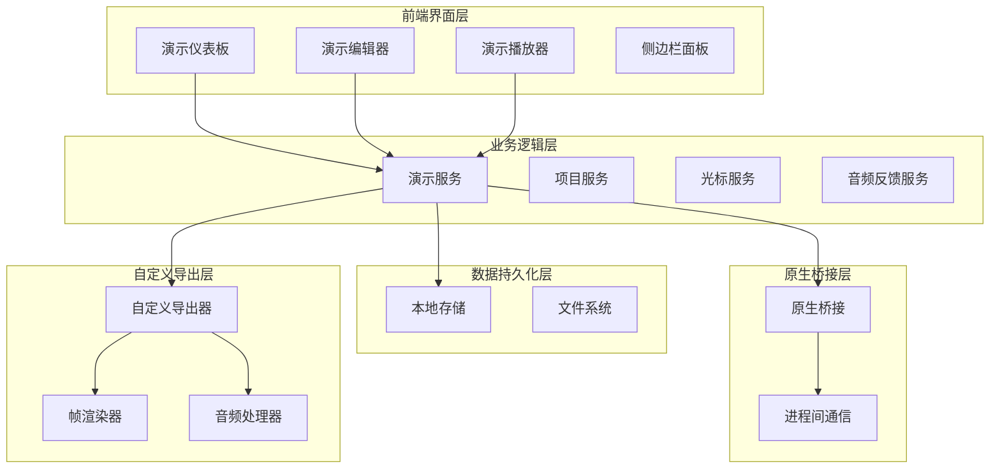
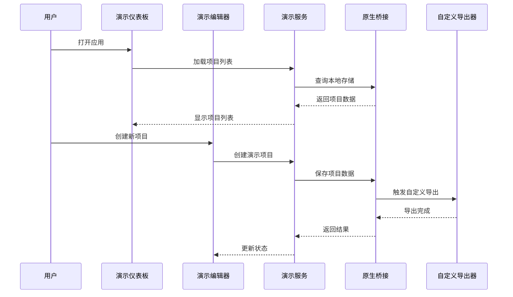
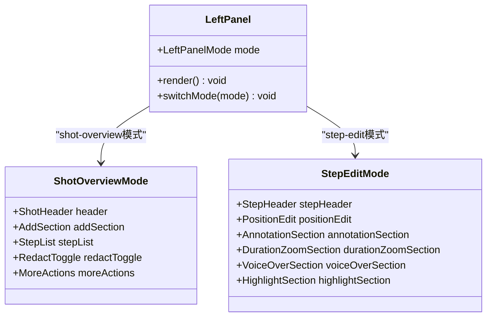
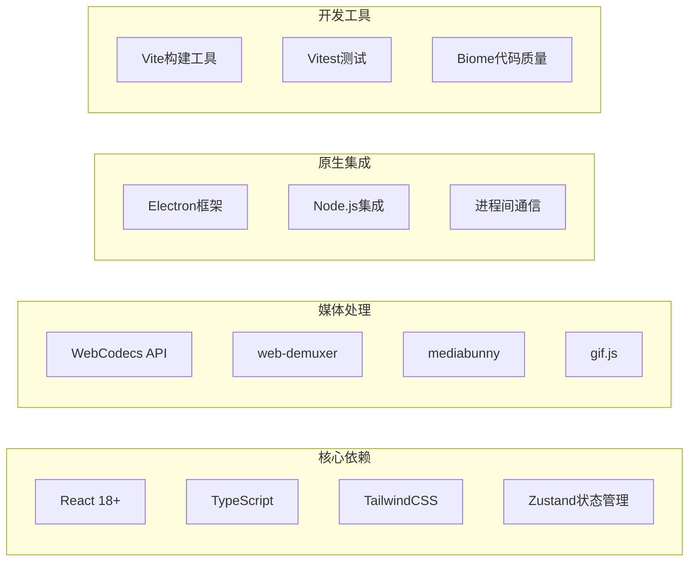
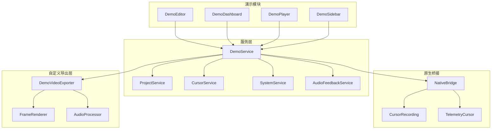

# DemoBuilder产品需求文档

<cite>
**本文档引用的文件**
- [DemoEditor.tsx](file://src/components/demo-builder/DemoEditor.tsx)
- [DemoDashboard.tsx](file://src/components/demo-builder/DemoDashboard.tsx)
- [DemoComposition.tsx](file://src/components/demo-builder/remotion/DemoComposition.tsx)
- [demo-builder-enhancement-plan.md](file://docs/dev/shouce/demo-builder-enhancement-plan.md)
- [demoService.ts](file://electron/native-bridge/services/demoService.ts)
- [store.ts](file://electron/native-bridge/store.ts)
- [client.ts](file://src/native/client.ts)
- [contracts.ts](file://src/native/contracts.ts)
- [remotion-renderer.ts](file://electron/ipc/renderers/remotion-renderer.ts)
- [package.json](file://package.json)
- [05-export-pipeline-architecture.md](file://docs/05-export/01-export-pipeline-architecture.md)
- [demoVideoExporter.ts](file://src/lib/demobuilder/demoVideoExporter.ts)
- [cursorRenderer.ts](file://src/components/video-editor/videoPlayback/cursorRenderer.ts)
- [SettingsPanel.tsx](file://src/components/video-editor/SettingsPanel.tsx)
</cite>

## 更新摘要
**所做变更**
- 更新了视频导出系统架构部分，反映从Remotion迁移到自定义实现
- 新增了光标样式和音频反馈功能的相关内容
- 更新了导出管道架构的技术细节
- 增强了光标渲染系统的技术规格说明

## 目录
1. [项目概述](#项目概述)
2. [项目结构](#项目结构)
3. [核心组件](#核心组件)
4. [架构概览](#架构概览)
5. [详细组件分析](#详细组件分析)
6. [依赖关系分析](#依赖关系分析)
7. [性能考虑](#性能考虑)
8. [故障排除指南](#故障排除指南)
9. [结论](#结论)

## 项目概述

DemoBuilder是OpenScreen项目中的一个演示视频制作工具，允许用户创建屏幕录制演示、添加标注和批注，并导出高质量的演示视频。该系统集成了屏幕录制、视频编辑和渲染功能，为用户提供完整的演示制作解决方案。

**更新** 系统现已完全移除对Remotion框架的依赖，采用自定义的视频导出架构，同时增强了光标样式和音频反馈功能。

## 项目结构

DemoBuilder模块采用分层架构设计，主要包含以下层次：



**图表来源**
- [DemoEditor.tsx:1-268](file://src/components/demo-builder/DemoEditor.tsx#L1-L268)
- [DemoDashboard.tsx:1-37](file://src/components/demo-builder/DemoDashboard.tsx#L1-L37)
- [demoVideoExporter.ts:56-74](file://src/lib/demobuilder/demoVideoExporter.ts#L56-L74)

**章节来源**
- [DemoEditor.tsx:1-268](file://src/components/demo-builder/DemoEditor.tsx#L1-L268)
- [DemoDashboard.tsx:1-37](file://src/components/demo-builder/DemoDashboard.tsx#L1-L37)

## 核心组件

### 演示仪表板 (DemoDashboard)
演示仪表板是用户进入DemoBuilder系统的入口点，提供项目管理和创建功能。

**主要功能：**
- 项目列表展示和管理
- 新建演示项目
- 项目打开和编辑
- 加载状态管理

### 演示编辑器 (DemoEditor)
演示编辑器是核心的编辑界面，提供完整的演示制作功能。

**关键特性：**
- 项目状态管理
- 实时保存机制
- 播放控制
- 导出对话框
- 注释模式切换

### 自定义视频导出系统
**更新** 系统已完全迁移至自定义导出架构，替代原有的Remotion实现。

#### 导出管道架构
导出系统采用多阶段处理架构，确保非阻塞操作和进度报告：

| 阶段 | 责任 | 技术实现 |
|---|---|---|
| 1. 解复用 | 从源WebM提取视频帧 | web-demuxer |
| 2. 帧渲染 | 应用所有编辑效果到画布 | OffscreenCanvas/Pixi.js |
| 3. 编码 | 将帧编码为H.264或GIF | WebCodecs VideoEncoder |
| 4. 复用 | 将编码后的视频打包到最终容器 | mediabunny |

#### 核心导出器类
```typescript
class DemoVideoExporter {
  private config: DemoVideoExporterConfig;
  private renderer: DemoFrameRenderer | null = null;
  private encoder: VideoEncoder | null = null;
  private muxer: VideoMuxer | null = null;
  private audioProcessor: AudioProcessor | null = null;
  
  constructor(config: DemoVideoExporterConfig) {
    this.config = config;
  }
  
  async export(): Promise<ExportResult> {
    // 执行完整导出流程
  }
  
  cancel(): void {
    // 取消正在进行的导出
  }
}
```

**章节来源**
- [DemoDashboard.tsx:1-37](file://src/components/demo-builder/DemoDashboard.tsx#L1-L37)
- [DemoEditor.tsx:230-268](file://src/components/demo-builder/DemoEditor.tsx#L230-L268)
- [05-export-pipeline-architecture.md:1-120](file://docs/05-export/01-export-pipeline-architecture.md#L1-L120)
- [demoVideoExporter.ts:56-97](file://src/lib/demobuilder/demoVideoExporter.ts#L56-L97)

## 架构概览

DemoBuilder采用客户端-服务器架构，结合原生应用和Web技术栈。**更新** 架构已完全移除Remotion依赖，采用自定义导出系统：



**图表来源**
- [DemoDashboard.tsx:16-25](file://src/components/demo-builder/DemoDashboard.tsx#L16-L25)
- [DemoEditor.tsx:247-258](file://src/components/demo-builder/DemoEditor.tsx#L247-L258)
- [demoVideoExporter.ts:77-97](file://src/lib/demobuilder/demoVideoExporter.ts#L77-L97)

## 详细组件分析

### 左侧面板重构方案

根据增强计划文档，DemoBuilder将实施双态左侧面板重构：



**图表来源**
- [demo-builder-enhancement-plan.md:314-348](file://docs/dev/shouce/demo-builder-enhancement-plan.md#L314-L348)

### 光标样式系统

**新增** 系统现在支持丰富的光标样式和自定义配置：

#### 光标渲染配置
```typescript
export interface CursorRenderConfig {
  /** 基础光标高度（参考分辨率为1920px） */
  dotRadius: number;
  /** 光标填充颜色（PixiJS十六进制数） */
  dotColor: number;
  /** 光标不透明度（0-1） */
  dotAlpha: number;
  /** 光标平滑因子（0-1，数值越低=越平滑/越慢） */
  smoothingFactor: number;
  /** 方向性光标运动模糊量 */
  motionBlur: number;
  /** 点击弹跳倍数 */
  clickBounce: number;
}

export const DEFAULT_CURSOR_CONFIG: CursorRenderConfig = {
  dotRadius: 28,
  dotColor: 0xffffff,
  dotAlpha: 0.95,
  smoothingFactor: 0.18,
  motionBlur: 0,
  clickBounce: 1,
};
```

#### 支持的系统光标类型
- arrow（箭头）
- text（文本选择）
- pointer（手型指针）
- crosshair（十字准星）
- open-hand（张开的手）
- closed-hand（握拳）
- resize-ew（东西方向调整）
- resize-ns（南北方向调整）
- not-allowed（禁止）

#### 光标资产管理系统
系统支持动态加载自定义光标图像，包括：
- SVG格式的矢量光标
- PNG格式的位图光标
- 系统原生光标（macOS）
- 用户上传的自定义光标

**章节来源**
- [demo-builder-enhancement-plan.md:294-351](file://docs/dev/shouce/demo-builder-enhancement-plan.md#L294-L351)
- [DemoEditor.tsx:230-268](file://src/components/demo-builder/DemoEditor.tsx#L230-L268)
- [cursorRenderer.ts:41-66](file://src/components/video-editor/videoPlayback/cursorRenderer.ts#L41-L66)
- [cursorRenderer.ts:84-94](file://src/components/video-editor/videoPlayback/cursorRenderer.ts#L84-L94)

## 依赖关系分析

### 外部依赖

**更新** 移除了Remotion依赖，新增了自定义导出相关的技术栈：



**图表来源**
- [package.json](file://package.json)

### 内部模块依赖



**图表来源**
- [demoService.ts](file://electron/native-bridge/services/demoService.ts)
- [store.ts](file://electron/native-bridge/store.ts)
- [demoVideoExporter.ts](file://src/lib/demobuilder/demoVideoExporter.ts)

**章节来源**
- [package.json](file://package.json)

## 性能考虑

### 渲染优化策略

**更新** 自定义导出系统采用了多项性能优化策略：

1. **硬件加速优先**：优先使用WebCodecs进行视频编码，支持多种硬件加速选项
2. **智能队列管理**：导出过程中限制并发编码任务数量（最大120个）
3. **渐进式渲染**：帧渲染与UI渲染分离，避免相互干扰
4. **内存优化**：使用OffscreenCanvas减少主线程压力
5. **错误恢复**：支持多种编码器偏好设置的自动切换

### 内存管理

- 实现智能的资源释放机制
- 使用WeakMap避免内存泄漏
- 优化大文件处理流程
- 导出过程中的垃圾回收优化

### 音频处理优化

**新增** 音频反馈系统包含以下优化：
- 实时音频峰值检测
- 多格式音频支持（WAV、MP3、OGG）
- 音频延迟补偿
- 动态音量调节

## 故障排除指南

### 常见问题及解决方案

**项目加载失败**
- 检查本地存储权限
- 验证项目文件完整性
- 查看控制台错误日志

**导出性能问题**
- **更新** 检查硬件编码器可用性
- 减少同时渲染的元素数量
- 优化视频编码参数
- 检查硬件加速设置
- 监控导出队列长度

**光标样式问题**
- 验证光标资产文件完整性
- 检查光标尺寸和比例设置
- 确认光标主题配置正确
- 验证系统光标支持情况

**音频反馈异常**
- 检查音频设备权限
- 验证音频格式兼容性
- 确认音频采样率设置
- 检查音频缓冲区配置

**跨平台兼容性**
- 验证操作系统版本要求
- 检查必要的系统组件
- 测试不同分辨率下的表现
- **更新** 验证WebCodecs支持情况

**章节来源**
- [DemoDashboard.tsx:16-25](file://src/components/demo-builder/DemoDashboard.tsx#L16-L25)
- [DemoEditor.tsx:260-268](file://src/components/demo-builder/DemoEditor.tsx#L260-L268)
- [demoVideoExporter.ts:108-115](file://src/lib/demobuilder/demoVideoExporter.ts#L108-L115)

## 结论

DemoBuilder作为OpenScreen生态系统中的重要组成部分，经过重大架构升级后，提供了更加高效和灵活的演示视频制作解决方案。**更新** 通过完全移除Remotion依赖并采用自定义导出系统，系统获得了更好的性能控制和扩展性。新增的光标样式系统和音频反馈功能进一步提升了用户体验。

未来的发展方向包括：
- 进一步优化自定义导出系统的性能
- 增强跨平台兼容性和硬件加速支持
- 扩展更多创意光标样式和主题
- 集成AI驱动的音频反馈和音效生成
- 支持更多视频格式和编码选项

这些改进使DemoBuilder能够更好地满足从简单演示到复杂视频制作的各种需求，为用户提供了更加专业和高效的演示制作体验。