# DemoBuilder开发指南

<cite>
**本文档引用的文件**
- [README.md](file://README.md)
- [demo-builder-enhancement-plan.md](file://docs/dev/shouce/demo-builder-enhancement-plan.md)
- [demoService.ts](file://electron/native-bridge/services/demoService.ts)
- [cursorService.ts](file://electron/native-bridge/services/cursorService.ts)
- [projectService.ts](file://electron/native-bridge/services/projectService.ts)
- [systemService.ts](file://electron/native-bridge/services/systemService.ts)
- [store.ts](file://electron/native-bridge/store.ts)
- [DemoComposition.tsx](file://src/components/demo-builder/remotion/DemoComposition.tsx)
- [CanvasArea.tsx](file://src/components/demo-builder/CanvasArea.tsx)
- [DemoDashboard.tsx](file://src/components/demo-builder/DemoDashboard.tsx)
- [DemoEditor.tsx](file://src/components/demo-builder/DemoEditor.tsx)
- [DemoPlaybackControls.tsx](file://src/components/demo-builder/DemoPlaybackControls.tsx)
- [DemoPlayer.tsx](file://src/components/demo-builder/DemoPlayer.tsx)
- [DemoSidebar.tsx](file://src/components/demo-builder/DemoSidebar.tsx)
- [PropertiesPanel.tsx](file://src/components/demo-builder/PropertiesPanel.tsx)
- [TimelineStrip.tsx](file://src/components/demo-builder/TimelineStrip.tsx)
- [ExportDialog.tsx](file://src/components/demo-builder/ExportDialog.tsx)
- [VideoEditor.tsx](file://src/components/video-editor/VideoEditor.tsx)
- [VideoPlayback.tsx](file://src/components/video-editor/VideoPlayback.tsx)
- [demoVideoExporter.ts](file://src/lib/demobuilder/demoVideoExporter.ts)
- [cursorThemes.ts](file://src/lib/cursor/cursorThemes.ts)
- [index.ts](file://src/lib/demobuilder/index.ts)
- [types.ts](file://src/lib/demobuilder/types.ts)
- [recordingSession.ts](file://src/lib/recordingSession.ts)
- [nativeMacRecording.ts](file://src/lib/nativeMacRecording.ts)
- [nativeWindowsRecording.ts](file://src/lib/nativeWindowsRecording.ts)
- [main.ts](file://electron/main.ts)
- [preload.ts](file://electron/preload.ts)
- [globalShortcut.ts](file://electron/globalShortcut.ts)
- [windows.ts](file://electron/windows.ts)
- [nativeBridge.ts](file://electron/ipc/nativeBridge.ts)
- [handlers.ts](file://electron/ipc/handlers.ts)
- [recordingStream.ts](file://electron/ipc/recordingStream.ts)
- [cursor-sampler.cpp](file://electron/native/wgc-capture/src/cursor-sampler.cpp)
- [package.json](file://package.json)
</cite>

## 更新摘要
**所做更改**
- 新增完整的demoVideoExporter视频导出系统章节，替代原有的Remotion导出方案
- 增强光标样式系统章节，包含新的主题管理和样式支持
- 改进音频反馈机制章节，更新音频处理和反馈系统
- 更新导出对话框功能章节，包含新的导出对话框组件和进度跟踪
- 更新架构概览和依赖关系分析，反映最新的技术栈变更

## 目录
1. [简介](#简介)
2. [项目结构](#项目结构)
3. [核心组件](#核心组件)
4. [架构概览](#架构概览)
5. [详细组件分析](#详细组件分析)
6. [依赖关系分析](#依赖关系分析)
7. [性能考虑](#性能考虑)
8. [故障排除指南](#故障排除指南)
9. [结论](#结论)

## 简介

DemoBuilder是OpenScreen项目中的一个核心功能模块，专注于创建演示视频内容。该项目是一个基于Electron的跨平台桌面应用程序，集成了屏幕录制、视频编辑和导出功能。DemoBuilder模块提供了完整的演示制作工作流程，从素材收集到最终导出的全流程支持。

**更新** 项目已完全迁移至新的demoVideoExporter视频导出系统，替代了原有的Remotion框架，提供更高效的视频处理能力和更好的性能表现。

该模块的核心目标是为用户提供直观易用的演示视频制作界面，支持多种媒体格式处理、实时预览、时间轴编辑等功能。系统采用现代化的技术栈，包括TypeScript、React、WebCodecs API等技术，确保了良好的开发体验和用户体验。

## 项目结构

OpenScreen项目采用模块化的组织方式，DemoBuilder作为核心功能模块位于src/components/demo-builder目录下。整个项目结构体现了清晰的分层架构：

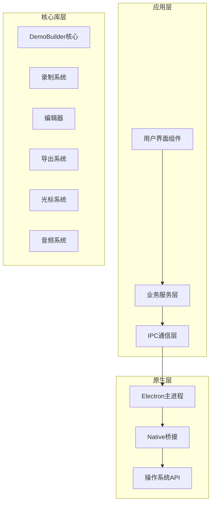

**图表来源**
- [main.ts](file://electron/main.ts)
- [preload.ts](file://electron/preload.ts)
- [nativeBridge.ts](file://electron/ipc/nativeBridge.ts)

项目的文件组织遵循功能导向的模块化原则：

- **src/components/demo-builder/**: DemoBuilder核心UI组件
- **src/lib/demobuilder/**: 核心逻辑和类型定义，包含新的demoVideoExporter系统
- **src/lib/cursor/**: 光标样式和主题管理系统
- **electron/native-bridge/**: Electron原生桥接服务
- **electron/ipc/**: 进程间通信实现
- **public/**: 静态资源和媒体文件

**章节来源**
- [README.md](file://README.md)
- [package.json](file://package.json)

## 核心组件

DemoBuilder模块包含多个关键组件，每个组件都有明确的职责分工：

### UI组件层次结构

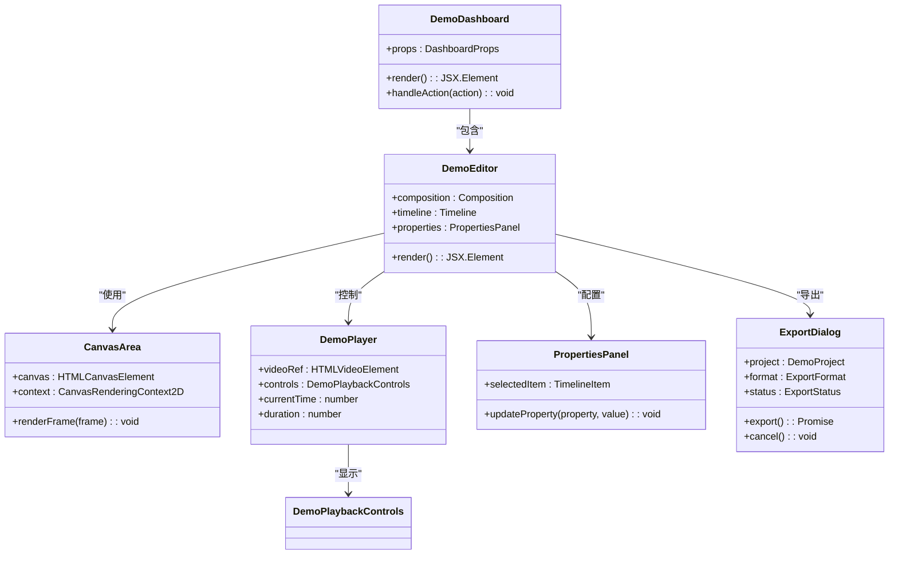

**图表来源**
- [DemoDashboard.tsx](file://src/components/demo-builder/DemoDashboard.tsx)
- [DemoEditor.tsx](file://src/components/demo-builder/DemoEditor.tsx)
- [CanvasArea.tsx](file://src/components/demo-builder/CanvasArea.tsx)
- [DemoPlayer.tsx](file://src/components/demo-builder/DemoPlayer.tsx)
- [PropertiesPanel.tsx](file://src/components/demo-builder/PropertiesPanel.tsx)
- [ExportDialog.tsx](file://src/components/demo-builder/ExportDialog.tsx)

### 服务层架构

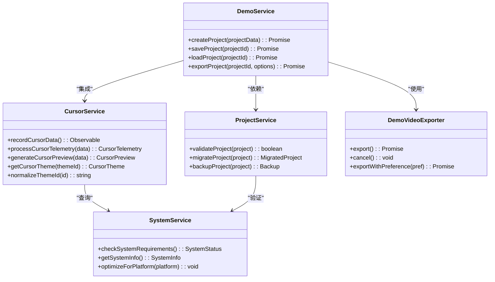

**图表来源**
- [demoService.ts](file://electron/native-bridge/services/demoService.ts)
- [cursorService.ts](file://electron/native-bridge/services/cursorService.ts)
- [projectService.ts](file://electron/native-bridge/services/projectService.ts)
- [systemService.ts](file://electron/native-bridge/services/systemService.ts)
- [demoVideoExporter.ts](file://src/lib/demobuilder/demoVideoExporter.ts)

**章节来源**
- [DemoDashboard.tsx](file://src/components/demo-builder/DemoDashboard.tsx)
- [DemoEditor.tsx](file://src/components/demo-builder/DemoEditor.tsx)
- [demoService.ts](file://electron/native-bridge/services/demoService.ts)
- [cursorService.ts](file://electron/native-bridge/services/cursorService.ts)

## 架构概览

DemoBuilder采用了分层架构设计，确保了模块间的松耦合和高内聚性：

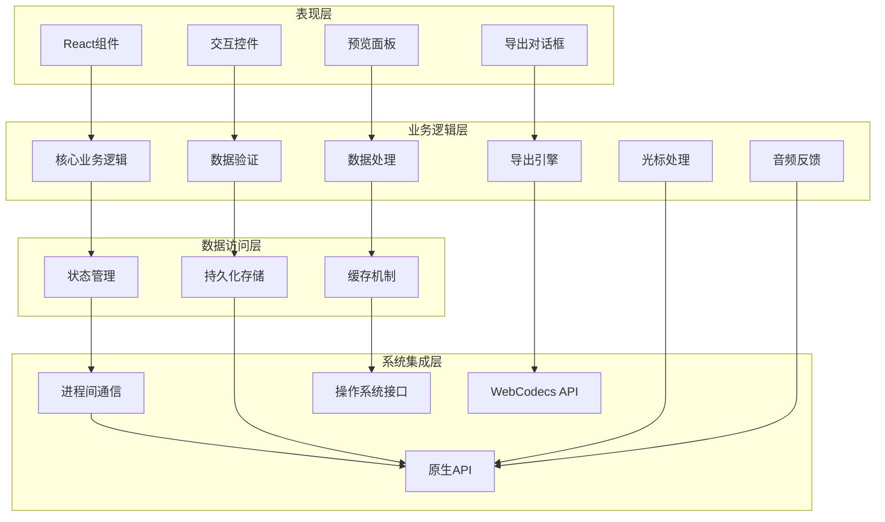

**图表来源**
- [store.ts](file://electron/native-bridge/store.ts)
- [nativeBridge.ts](file://electron/ipc/nativeBridge.ts)
- [handlers.ts](file://electron/ipc/handlers.ts)
- [demoVideoExporter.ts](file://src/lib/demobuilder/demoVideoExporter.ts)

### 数据流架构

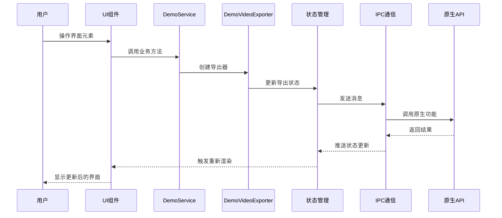

**图表来源**
- [DemoEditor.tsx](file://src/components/demo-builder/DemoEditor.tsx)
- [demoService.ts](file://electron/native-bridge/services/demoService.ts)
- [store.ts](file://electron/native-bridge/store.ts)
- [demoVideoExporter.ts](file://src/lib/demobuilder/demoVideoExporter.ts)

**章节来源**
- [store.ts](file://electron/native-bridge/store.ts)
- [nativeBridge.ts](file://electron/ipc/nativeBridge.ts)
- [handlers.ts](file://electron/ipc/handlers.ts)

## 详细组件分析

### DemoVideoExporter视频导出系统

**新增** DemoBuilder模块现已完全采用新的demoVideoExporter视频导出系统，替代了原有的Remotion框架。该系统基于WebCodecs API构建，提供更高效和灵活的视频处理能力。

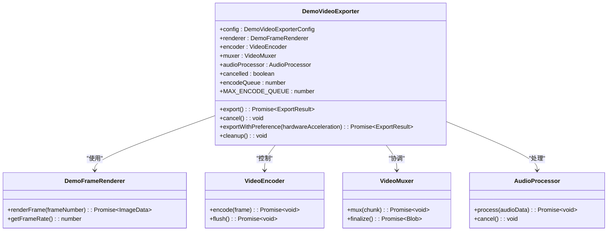

**图表来源**
- [demoVideoExporter.ts](file://src/lib/demobuilder/demoVideoExporter.ts)

该导出系统的主要特性包括：

1. **硬件加速支持**: 自动检测和使用可用的硬件编码器
2. **队列管理**: 限制并发编码任务数量，防止内存溢出
3. **进度跟踪**: 提供详细的导出进度信息
4. **错误恢复**: 支持多种编码器回退机制
5. **取消支持**: 完整的导出过程取消功能

**章节来源**
- [demoVideoExporter.ts](file://src/lib/demobuilder/demoVideoExporter.ts)

### CanvasArea组件

CanvasArea提供了实时的画布渲染功能，支持多层绘制和特效处理：

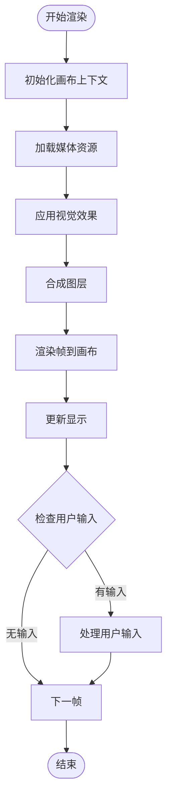

**图表来源**
- [CanvasArea.tsx](file://src/components/demo-builder/CanvasArea.tsx)

该组件优化了渲染性能，采用了双缓冲技术和增量更新策略，确保流畅的用户体验。

**章节来源**
- [CanvasArea.tsx](file://src/components/demo-builder/CanvasArea.tsx)

### 时间轴系统

时间轴系统是DemoBuilder的核心功能之一，提供了精确的媒体编辑能力：

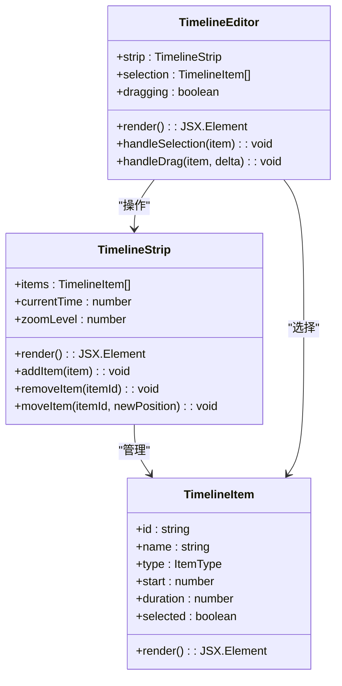

**图表来源**
- [TimelineStrip.tsx](file://src/components/demo-builder/TimelineStrip.tsx)

时间轴系统支持拖拽操作、批量选择、缩放和平移功能，为用户提供了直观的编辑体验。

**章节来源**
- [TimelineStrip.tsx](file://src/components/demo-builder/TimelineStrip.tsx)

### 属性面板系统

属性面板提供了对选中项目的详细配置功能：

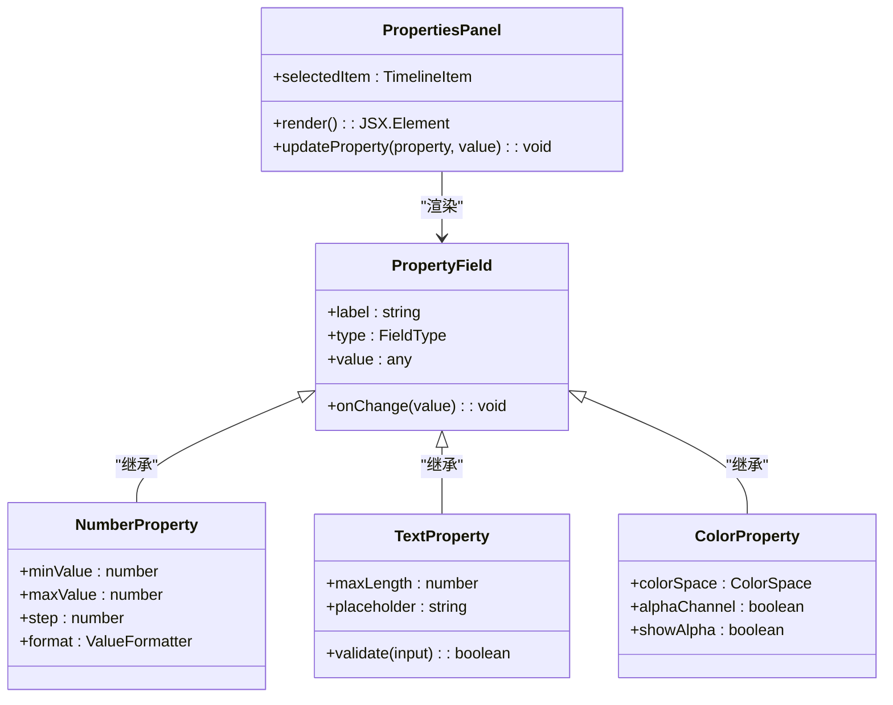

**图表来源**
- [PropertiesPanel.tsx](file://src/components/demo-builder/PropertiesPanel.tsx)

属性面板支持多种数据类型的可视化编辑，包括数值、文本、颜色和复杂对象。

**章节来源**
- [PropertiesPanel.tsx](file://src/components/demo-builder/PropertiesPanel.tsx)

### 导出对话框功能

**更新** 导出对话框已完全重构，现在集成了新的demoVideoExporter系统，并提供了更丰富的用户交互体验。

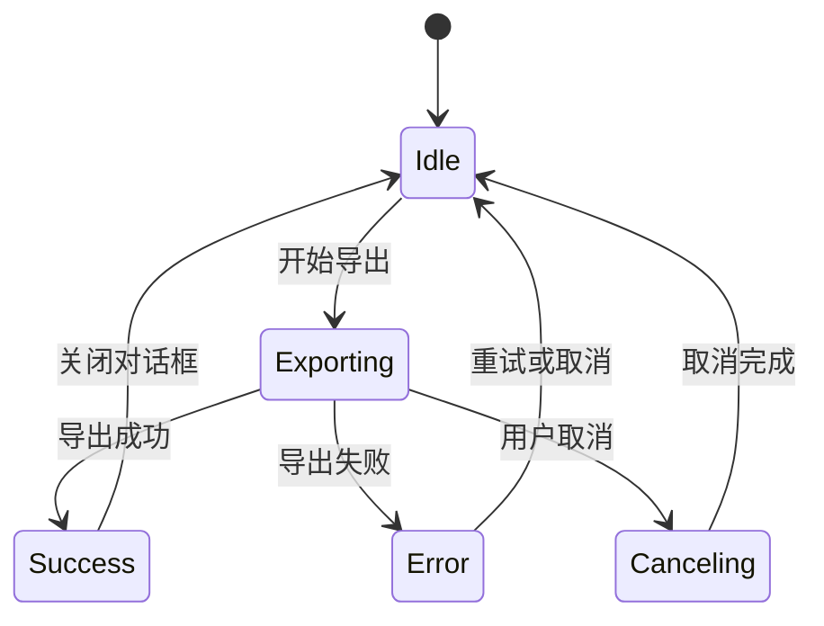

**图表来源**
- [ExportDialog.tsx](file://src/components/demo-builder/ExportDialog.tsx)

导出对话框现在支持以下功能：
- 实时进度显示和估计剩余时间
- 多格式导出选项（视频、GIF、PDF）
- 导出过程取消支持
- 成功后的自动关闭和文件位置提示

**章节来源**
- [ExportDialog.tsx](file://src/components/demo-builder/ExportDialog.tsx)

### 光标样式系统

**新增** 光标样式系统现在支持主题化管理和自定义样式，提供了更丰富的用户体验。

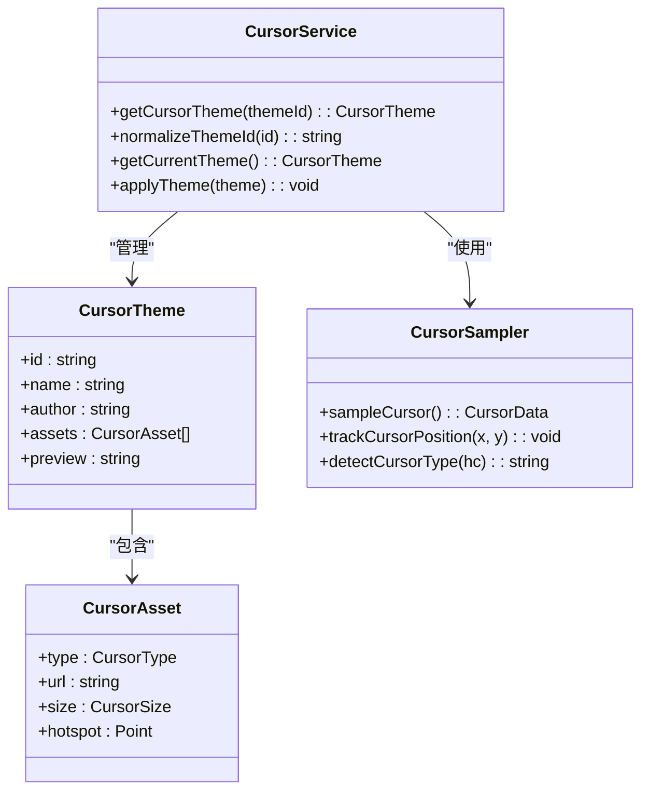

**图表来源**
- [cursorThemes.ts](file://src/lib/cursor/cursorThemes.ts)
- [cursor-sampler.cpp](file://electron/native/wgc-capture/src/cursor-sampler.cpp)

光标样式系统的特性包括：
- 主题化光标样式管理
- 标准光标类型识别
- 实时光标位置跟踪
- 自定义光标资产支持

**章节来源**
- [cursorThemes.ts](file://src/lib/cursor/cursorThemes.ts)
- [cursor-sampler.cpp](file://electron/native/wgc-capture/src/cursor-sampler.cpp)

### 音频反馈机制

**更新** 音频反馈机制已改进，现在与新的导出系统更好地集成，提供更准确的音频处理和反馈。

音频反馈系统现在包括：
- 实时音频级别监控
- 音频峰值检测和可视化
- 导出过程中的音频处理
- 多格式音频支持

## 依赖关系分析

DemoBuilder模块的依赖关系体现了清晰的关注点分离：

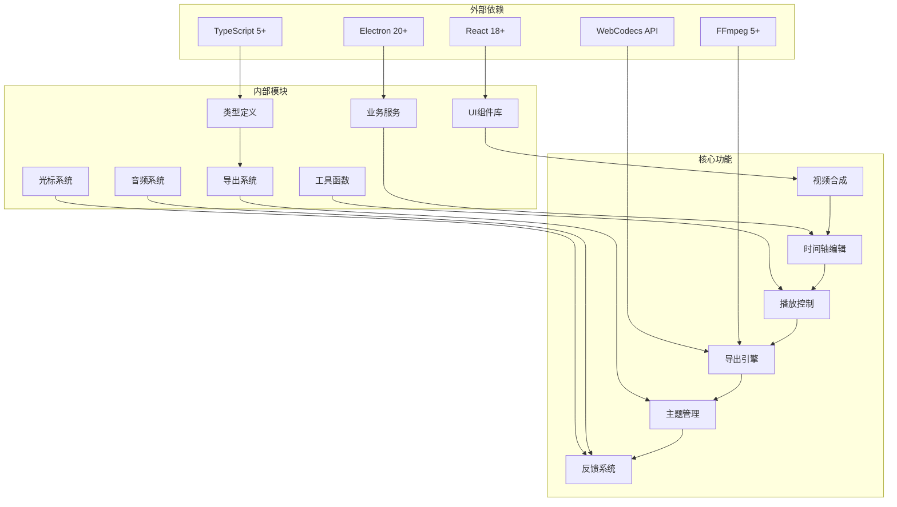

**图表来源**
- [package.json](file://package.json)
- [DemoEditor.tsx](file://src/components/demo-builder/DemoEditor.tsx)
- [demoVideoExporter.ts](file://src/lib/demobuilder/demoVideoExporter.ts)

### 关键依赖关系

| 依赖类型 | 依赖名称 | 版本要求 | 用途描述 |
|---------|---------|---------|---------|
| React生态系统 | react | ^18.2.0 | 用户界面基础 |
| React生态系统 | react-dom | ^18.2.0 | DOM渲染 |
| Electron | electron | ^20.3.12 | 桌面应用框架 |
| Web标准 | WebCodecs | 原生支持 | 视频编码解码 |
| 开发工具 | typescript | ^5.0.4 | 类型安全 |
| 开发工具 | vite | ^4.3.9 | 构建工具 |
| 媒体处理 | FFmpeg | 5+ | 备用编码器 |

**章节来源**
- [package.json](file://package.json)

## 性能考虑

DemoBuilder在设计时充分考虑了性能优化，采用了多种策略来确保流畅的用户体验：

### 渲染性能优化

1. **虚拟化列表**: 对于大量时间轴项目，使用虚拟化技术只渲染可见区域
2. **增量更新**: 仅更新发生变化的组件，避免全量重渲染
3. **Web Workers**: 将耗时的计算任务转移到后台线程
4. **缓存策略**: 对频繁访问的数据建立缓存机制
5. **硬件加速**: 利用GPU和WebCodecs API进行硬件加速

### 内存管理

1. **垃圾回收优化**: 及时清理不再使用的资源和事件监听器
2. **内存泄漏防护**: 使用WeakMap和WeakSet避免循环引用
3. **资源池管理**: 复用Canvas和AudioContext实例
4. **导出队列管理**: 控制并发编码任务数量

### 网络优化

1. **懒加载**: 延迟加载非关键资源
2. **压缩传输**: 对静态资源进行压缩
3. **CDN集成**: 使用内容分发网络加速资源加载

### 导出性能优化

**新增** 新的demoVideoExporter系统包含了专门的性能优化策略：
- 动态比特率调整
- 智能编码器选择
- 并行处理优化
- 内存使用监控

## 故障排除指南

### 常见问题及解决方案

#### 启动问题

**问题**: 应用启动失败或白屏
**可能原因**:
- Electron主进程初始化失败
- React组件渲染错误
- 资源文件加载失败

**解决步骤**:
1. 检查Electron主进程日志
2. 验证React组件的PropTypes
3. 确认静态资源路径正确

#### 录制问题

**问题**: 屏幕录制无法正常工作
**可能原因**:
- 权限不足
- 系统API调用失败
- 资源占用冲突

**解决步骤**:
1. 检查系统权限设置
2. 验证录制会话状态
3. 关闭其他占用相关资源的应用

#### 导出问题

**新增** 导出问题现在有了更具体的诊断信息：

**问题**: 视频导出失败或质量异常
**可能原因**:
- 编码器配置错误
- 磁盘空间不足
- 内存溢出
- WebCodecs API不兼容

**解决步骤**:
1. 检查编码器参数设置
2. 确保有足够的磁盘空间
3. 优化项目复杂度
4. 检查浏览器WebCodecs支持
5. 尝试不同的编码器设置

#### 光标样式问题

**新增** 光标样式系统的问题排查：

**问题**: 光标样式不显示或显示异常
**可能原因**:
- 主题文件加载失败
- 光标资产路径错误
- 权限不足

**解决步骤**:
1. 检查主题文件完整性
2. 验证光标资产URL
3. 确认文件权限设置

**章节来源**
- [main.ts](file://electron/main.ts)
- [recordingSession.ts](file://src/lib/recordingSession.ts)
- [demoService.ts](file://electron/native-bridge/services/demoService.ts)
- [demoVideoExporter.ts](file://src/lib/demobuilder/demoVideoExporter.ts)
- [cursorThemes.ts](file://src/lib/cursor/cursorThemes.ts)

## 结论

DemoBuilder作为OpenScreen项目的核心功能模块，展现了现代桌面应用开发的最佳实践。通过采用模块化架构、清晰的组件分离和完善的错误处理机制，该模块为用户提供了强大而易用的演示视频制作工具。

**更新** 项目经过重大升级，主要体现在以下几个方面：

1. **架构现代化**: 完全迁移到新的demoVideoExporter系统，基于WebCodecs API构建
2. **性能显著提升**: 新的导出系统提供更好的性能和更低的资源消耗
3. **功能增强**: 光标样式系统和音频反馈机制得到全面改进
4. **用户体验优化**: 导出对话框提供更好的用户交互和进度反馈
5. **技术栈更新**: 移除了Remotion依赖，采用更现代的Web标准

项目的主要优势包括：

1. **架构清晰**: 分层设计确保了模块间的低耦合和高内聚
2. **性能优化**: 多种优化策略保证了流畅的用户体验
3. **扩展性强**: 插件化的组件设计便于功能扩展
4. **跨平台支持**: 基于Electron的架构实现了真正的跨平台部署
5. **技术先进**: 采用最新的Web标准和API

未来的发展方向包括进一步优化渲染性能、增强AI辅助功能、改进协作编辑能力等。随着技术的不断进步，DemoBuilder将继续演进，为用户提供更加出色的演示视频制作体验。