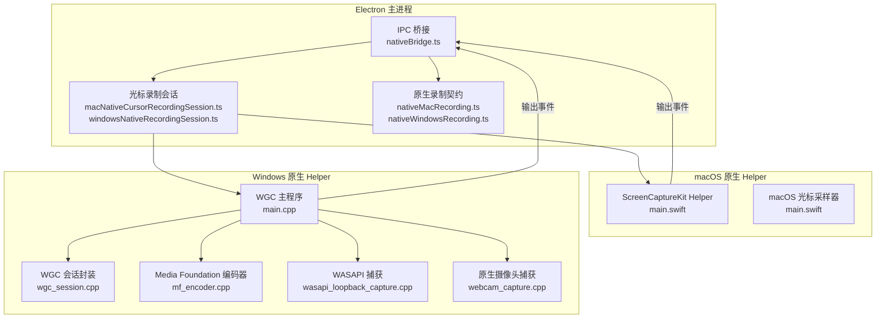
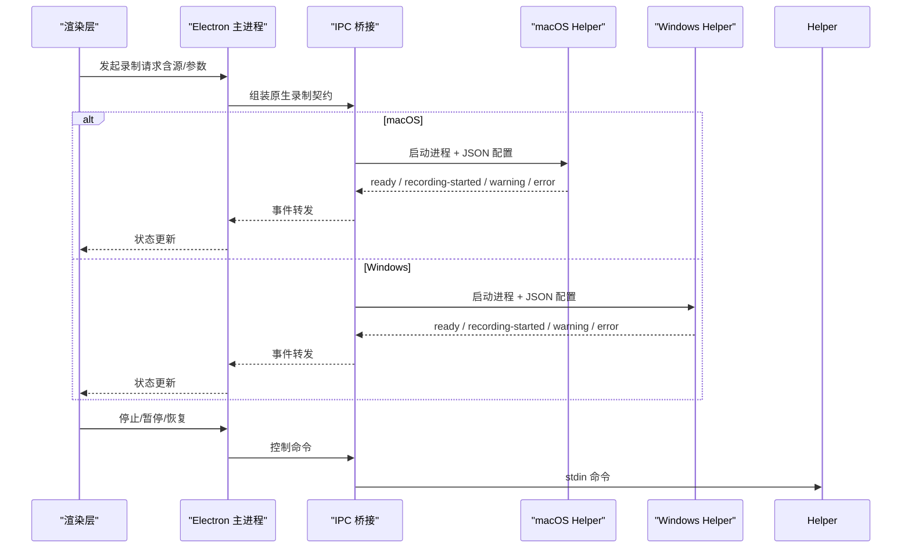
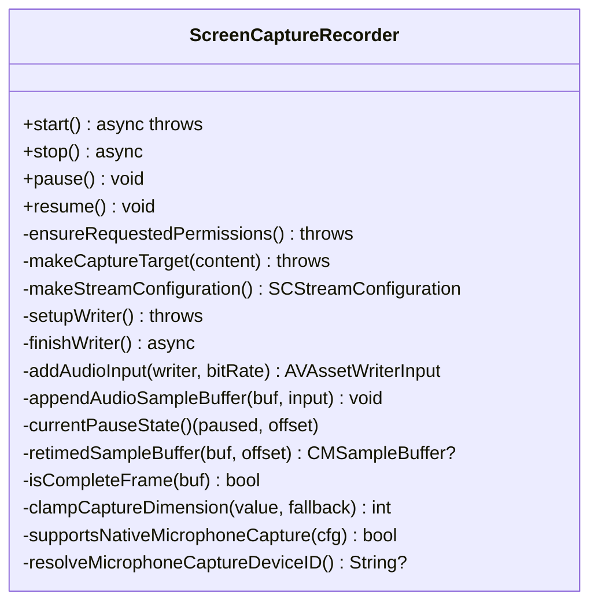
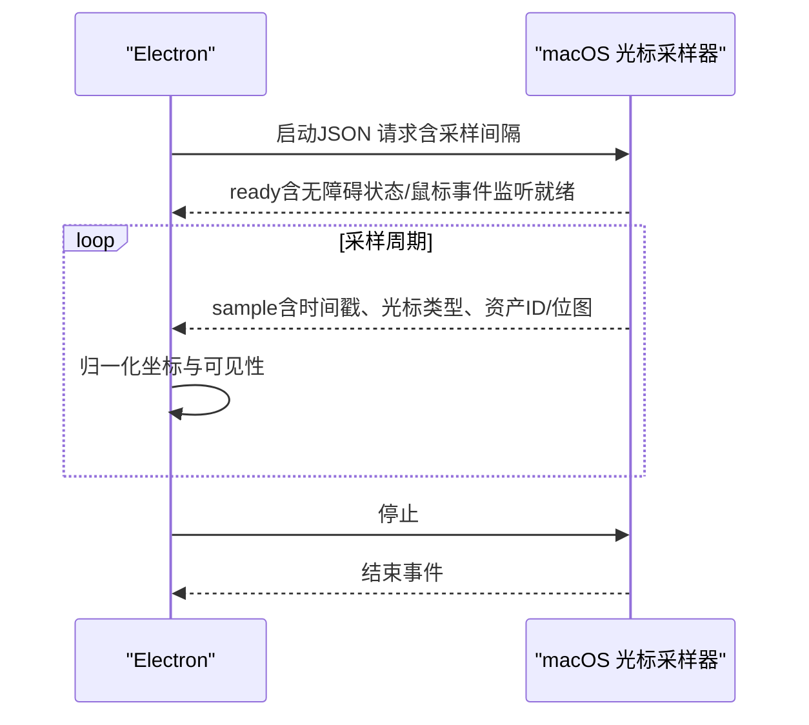
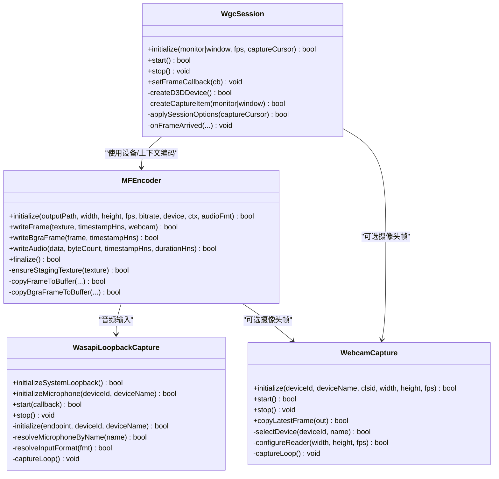
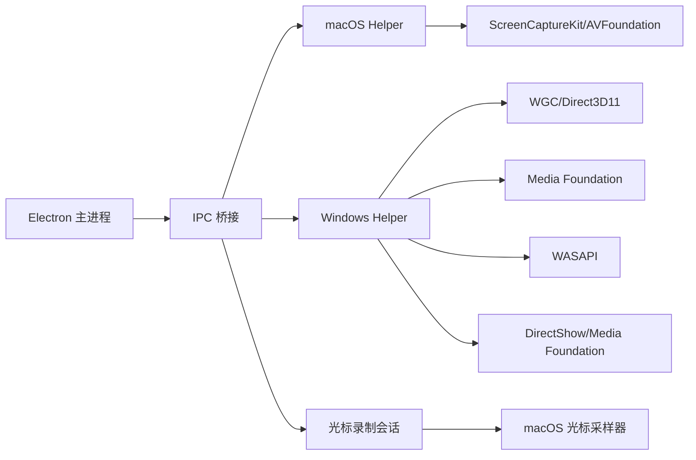

# 原生录制系统

<cite>
**本文档引用的文件**
- [main.swift](file://electron/native/screencapturekit/Sources/OpenScreenScreenCaptureKitHelper/main.swift)
- [main.swift](file://electron/native/screencapturekit/Sources/OpenScreenMacOSCursorHelper/main.swift)
- [main.cpp](file://electron/native/wgc-capture/src/main.cpp)
- [wgc_session.cpp](file://electron/native/wgc-capture/src/wgc_session.cpp)
- [mf_encoder.cpp](file://electron/native/wgc-capture/src/mf_encoder.cpp)
- [wasapi_loopback_capture.cpp](file://electron/native/wgc-capture/src/wasapi_loopback_capture.cpp)
- [webcam_capture.cpp](file://electron/native/wgc-capture/src/webcam_capture.cpp)
- [README.md](file://electron/native/README.md)
- [nativeBridge.ts](file://electron/ipc/nativeBridge.ts)
- [macNativeCursorRecordingSession.ts](file://electron/native-bridge/cursor/recording/macNativeCursorRecordingSession.ts)
- [windowsNativeRecordingSession.ts](file://electron/native-bridge/cursor/recording/windowsNativeRecordingSession.ts)
- [nativeMacRecording.ts](file://src/lib/nativeMacRecording.ts)
- [nativeWindowsRecording.ts](file://src/lib/nativeWindowsRecording.ts)
- [macos-native-recorder-roadmap.md](file://docs/engineering/macos-native-recorder-roadmap.md)
</cite>

## 目录
1. [引言](#引言)
2. [项目结构](#项目结构)
3. [核心组件](#核心组件)
4. [架构总览](#架构总览)
5. [详细组件分析](#详细组件分析)
6. [依赖关系分析](#依赖关系分析)
7. [性能考量](#性能考量)
8. [故障排除指南](#故障排除指南)
9. [结论](#结论)
10. [附录](#附录)

## 引言
本文件系统化阐述 OpenScreen 原生录制系统的设计与实现，覆盖 macOS ScreenCaptureKit 与 Windows Graphics Capture API 的技术细节，对比原生录制与 WebRTC 录制在性能、系统集成与功能完整性方面的差异。文档重点说明初始化流程、录制参数配置、数据流处理、Swift/C++ 原生代码架构（ScreenCaptureKit Helper 与 WGC Helper）、跨平台兼容性、权限管理与错误恢复机制，并提供性能基准测试、内存使用优化与系统资源占用分析建议。

## 项目结构
OpenScreen 将“会话编排与持久化”置于 Electron 主进程，“捕获、时序、编码与混流”交由平台原生 Helper 进程完成。原生录制通过进程边界通信，保持渲染层与捕获层解耦，确保可移植性与稳定性。

**图表来源**
- [nativeBridge.ts:124-236](file://electron/ipc/nativeBridge.ts#L124-L236)
- [macNativeCursorRecordingSession.ts:184-451](file://electron/native-bridge/cursor/recording/macNativeCursorRecordingSession.ts#L184-L451)
- [windowsNativeRecordingSession.ts:46-327](file://electron/native-bridge/cursor/recording/windowsNativeRecordingSession.ts#L46-L327)
- [main.swift:630-674](file://electron/native/screencapturekit/Sources/OpenScreenScreenCaptureKitHelper/main.swift#L630-L674)
- [main.cpp:383-800](file://electron/native/wgc-capture/src/main.cpp#L383-L800)
- [wgc_session.cpp:189-235](file://electron/native/wgc-capture/src/wgc_session.cpp#L189-L235)
- [mf_encoder.cpp:86-150](file://electron/native/wgc-capture/src/mf_encoder.cpp#L86-L150)
- [wasapi_loopback_capture.cpp:145-216](file://electron/native/wgc-capture/src/wasapi_loopback_capture.cpp#L145-L216)
- [webcam_capture.cpp:138-188](file://electron/native/wgc-capture/src/webcam_capture.cpp#L138-L188)

**章节来源**
- [README.md:1-112](file://electron/native/README.md#L1-L112)

## 核心组件
- macOS ScreenCaptureKit Helper：负责屏幕/窗口捕获、系统音频、麦克风音频（运行时支持时）、H.264 编码与 MP4 混流，输出结构化事件到 stdout。
- macOS 光标采样器：在具备无障碍权限时，提供文本/指针等语义化光标类型与位图资产；否则回退为位置仅光标遥测。
- Windows WGC Helper：基于 Graphics Capture API 捕获屏幕/窗口，结合 Media Foundation 编码器进行 H.264 输出，支持系统音频环回、麦克风音频与原生摄像头捕获。
- Electron IPC 桥接：统一请求/响应模型，承载能力探测、项目与光标数据加载、系统服务查询等。
- 光标录制会话：在 macOS 上解析并启动光标采样器，在 Windows 上解析并启动原生光标采样器，标准化采样与归一化。

**章节来源**
- [README.md:3-33](file://electron/native/README.md#L3-L33)
- [README.md:34-112](file://electron/native/README.md#L34-L112)
- [nativeBridge.ts:92-236](file://electron/ipc/nativeBridge.ts#L92-L236)
- [macNativeCursorRecordingSession.ts:69-80](file://electron/native-bridge/cursor/recording/macNativeCursorRecordingSession.ts#L69-L80)
- [windowsNativeRecordingSession.ts:32-37](file://electron/native-bridge/cursor/recording/windowsNativeRecordingSession.ts#L32-L37)

## 架构总览
原生录制采用“主进程编排 + 原生 Helper 捕获”的分层架构。主进程负责：
- 解析用户选择的源（显示器/窗口）与设备（音频/视频/摄像头）
- 写入输出路径与会话清单
- 启动/暂停/停止原生 Helper
- 处理 Helper 事件并上报错误

原生 Helper 负责：
- 平台 API 捕获（ScreenCaptureKit 或 WGC）
- 时序与帧率控制
- 编码与混流（H.264 + AAC）
- 权限校验与错误上报

**图表来源**
- [nativeBridge.ts:124-236](file://electron/ipc/nativeBridge.ts#L124-L236)
- [nativeMacRecording.ts:6-49](file://src/lib/nativeMacRecording.ts#L6-L49)
- [nativeWindowsRecording.ts:3-39](file://src/lib/nativeWindowsRecording.ts#L3-L39)
- [main.swift:630-674](file://electron/native/screencapturekit/Sources/OpenScreenScreenCaptureKitHelper/main.swift#L630-L674)
- [main.cpp:383-800](file://electron/native/wgc-capture/src/main.cpp#L383-L800)

## 详细组件分析

### macOS ScreenCaptureKit Helper 分析
该 Helper 以 ScreenCaptureKit 为核心，结合 AVFoundation 进行编码与混流，支持显示/窗口捕获、系统音频与原生麦克风捕获（运行时可用时），并通过 stdout 发送结构化事件。

**图表来源**
- [main.swift:122-628](file://electron/native/screencapturekit/Sources/OpenScreenScreenCaptureKitHelper/main.swift#L122-L628)

关键流程与特性：
- 初始化与权限：检查屏幕录制权限与麦克风授权，必要时弹窗请求。
- 捕获目标解析：根据 sourceType（display/window）解析 SCContentFilter 与输出尺寸。
- 流配置：设置分辨率、帧间隔、像素格式、是否采集音频与麦克风。
- 写入器与编码：创建 AVAssetWriter/H.264/AAC 输入，实时写入媒体数据。
- 暂停/恢复：通过时间重定时保持时间轴连续性。
- 错误处理：将底层异常映射为 HelperError 并通过 stdout 报告。

**章节来源**
- [main.swift:153-183](file://electron/native/screencapturekit/Sources/OpenScreenScreenCaptureKitHelper/main.swift#L153-L183)
- [main.swift:313-338](file://electron/native/screencapturekit/Sources/OpenScreenScreenCaptureKitHelper/main.swift#L313-L338)
- [main.swift:379-413](file://electron/native/screencapturekit/Sources/OpenScreenScreenCaptureKitHelper/main.swift#L379-L413)
- [main.swift:415-478](file://electron/native/screencapturekit/Sources/OpenScreenScreenCaptureKitHelper/main.swift#L415-L478)
- [main.swift:509-571](file://electron/native/screencapturekit/Sources/OpenScreenScreenCaptureKitHelper/main.swift#L509-L571)

### macOS 光标采样器分析
该采样器在具备无障碍权限时，提供语义化光标类型（文本/指针）与位图资产；否则回退为位置仅遥测。

**图表来源**
- [macNativeCursorRecordingSession.ts:202-264](file://electron/native-bridge/cursor/recording/macNativeCursorRecordingSession.ts#L202-L264)
- [main.swift:306-352](file://electron/native/screencapturekit/Sources/OpenScreenMacOSCursorHelper/main.swift#L306-L352)

**章节来源**
- [macNativeCursorRecordingSession.ts:184-451](file://electron/native-bridge/cursor/recording/macNativeCursorRecordingSession.ts#L184-L451)
- [main.swift:20-96](file://electron/native/screencapturekit/Sources/OpenScreenMacOSCursorHelper/main.swift#L20-L96)

### Windows WGC Helper 分析
WGC Helper 通过 Graphics Capture API 捕获屏幕/窗口，结合 Media Foundation 编码器输出 H.264 视频与 AAC 音频，支持系统音频环回、麦克风音频与原生摄像头捕获。

**图表来源**
- [wgc_session.cpp:189-235](file://electron/native/wgc-capture/src/wgc_session.cpp#L189-L235)
- [mf_encoder.cpp:86-150](file://electron/native/wgc-capture/src/mf_encoder.cpp#L86-L150)
- [wasapi_loopback_capture.cpp:145-216](file://electron/native/wgc-capture/src/wasapi_loopback_capture.cpp#L145-L216)
- [webcam_capture.cpp:138-188](file://electron/native/wgc-capture/src/webcam_capture.cpp#L138-L188)

关键流程与特性：
- 会话建立：创建 D3D11 设备与 GraphicsCaptureItem，配置帧池与回调。
- 编码器初始化：设置 H.264 输出、RGB32 输入、AAC 音频轨道。
- 音频混合：系统环回与麦克风分别采集，按 AAC 兼容格式混流。
- 摄像头捕获：优先 Media Foundation，不支持时回退 DirectShow。
- 时间同步：基于帧到达时间戳与暂停累计时长，生成合成时间戳。

**章节来源**
- [main.cpp:383-800](file://electron/native/wgc-capture/src/main.cpp#L383-L800)
- [wgc_session.cpp:237-271](file://electron/native/wgc-capture/src/wgc_session.cpp#L237-L271)
- [mf_encoder.cpp:296-342](file://electron/native/wgc-capture/src/mf_encoder.cpp#L296-L342)
- [wasapi_loopback_capture.cpp:288-308](file://electron/native/wgc-capture/src/wasapi_loopback_capture.cpp#L288-L308)
- [webcam_capture.cpp:291-302](file://electron/native/wgc-capture/src/webcam_capture.cpp#L291-L302)

### 原生录制与 WebRTC 录制对比
- 性能提升
  - 原生录制：直接调用系统 API（ScreenCaptureKit/WGC），避免浏览器侧转码与多线程调度开销，降低 CPU 占用与延迟。
  - WebRTC：依赖浏览器编解码栈与 JS 线程，复杂场景下存在额外拷贝与转换成本。
- 系统集成度
  - 原生录制：与系统权限模型深度集成（如 macOS 屏幕录制权限、Windows 音频环回），事件驱动与错误反馈更直接。
  - WebRTC：受限于浏览器沙箱与权限策略，部分功能（如系统音频环回）需额外适配。
- 功能完整性
  - 原生录制：可同时输出视频、系统音频、麦克风音频与摄像头画面，时间轴严格对齐，便于后期编辑。
  - WebRTC：需要在渲染层进行轨道拼接与时间对齐，复杂度更高。

[本节为概念性对比，无需具体文件引用]

## 依赖关系分析
- Electron 主进程依赖原生录制契约（请求/事件类型）与 IPC 桥接，协调 Helper 生命周期。
- macOS Helper 依赖 ScreenCaptureKit 与 AVFoundation；Windows Helper 依赖 WGC、Media Foundation、WASAPI 与 DirectShow。
- 光标采样器作为独立子进程，与主录制进程通过 stdout 事件交互。

**图表来源**
- [nativeBridge.ts:92-236](file://electron/ipc/nativeBridge.ts#L92-L236)
- [macNativeCursorRecordingSession.ts:69-80](file://electron/native-bridge/cursor/recording/macNativeCursorRecordingSession.ts#L69-L80)
- [windowsNativeRecordingSession.ts:32-37](file://electron/native-bridge/cursor/recording/windowsNativeRecordingSession.ts#L32-L37)
- [main.swift:630-674](file://electron/native/screencapturekit/Sources/OpenScreenScreenCaptureKitHelper/main.swift#L630-L674)
- [main.cpp:383-800](file://electron/native/wgc-capture/src/main.cpp#L383-L800)

**章节来源**
- [README.md:1-112](file://electron/native/README.md#L1-L112)

## 性能考量
- 帧率与比特率
  - macOS：根据输出分辨率动态选择比特率，保证高分辨率下的质量与体积平衡。
  - Windows：根据像素数估算初始比特率，避免过高的编码压力。
- 编码路径
  - macOS：H.264 编码由 AVFoundation/VideoToolbox 执行，减少 CPU 开销。
  - Windows：H.264 编码由 Media Foundation 执行，音频 AAC 由编码器内建 AAC 编码器生成。
- 音频处理
  - Windows：系统环回与麦克风分别采集，按 AAC 兼容格式混流，避免额外转码。
- 摄像头叠加
  - Windows：摄像头帧作为画中画叠加至主视频，采用快速缩放与复制算法，尽量减少额外 CPU 占用。
- 内存与资源
  - 建议：限制帧池大小与缓冲深度，避免过度预取导致内存峰值升高；在暂停期间释放非必要资源，恢复后按需重建。

[本节提供通用性能指导，无需具体文件引用]

## 故障排除指南
常见问题与处理：
- macOS 权限不足
  - 症状：Helper 抛出权限相关错误或无法开始录制。
  - 处理：引导用户在系统偏好设置中授予屏幕录制与麦克风权限；Helper 在启动前会主动请求授权。
- Windows 音频设备不可用
  - 症状：系统环回或麦克风初始化失败。
  - 处理：检查设备名称/ID 匹配逻辑，回退到默认设备；确认音频格式兼容性。
- Windows 摄像头不可见
  - 症状：摄像头无画面或黑屏。
  - 处理：等待首帧可见后再输出；若设备未暴露为 Media Foundation 接口，回退 DirectShow。
- 帧丢失与时间错位
  - 症状：视频卡顿或音画不同步。
  - 处理：检查暂停累计时长与时间戳重定时逻辑；确保编码器缓冲区充足。

**章节来源**
- [main.swift:75-102](file://electron/native/screencapturekit/Sources/OpenScreenScreenCaptureKitHelper/main.swift#L75-L102)
- [main.cpp:788-800](file://electron/native/wgc-capture/src/main.cpp#L788-L800)
- [wasapi_loopback_capture.cpp:328-411](file://electron/native/wgc-capture/src/wasapi_loopback_capture.cpp#L328-L411)
- [webcam_capture.cpp:321-375](file://electron/native/wgc-capture/src/webcam_capture.cpp#L321-L375)

## 结论
OpenScreen 原生录制系统通过清晰的进程边界与平台原生 API，实现了高性能、低延迟与强系统集成的录制体验。macOS 与 Windows 的 Helper 各自承担捕获、编码与混流职责，主进程负责编排与持久化，光标采样器提供语义化光标信息。相比 WebRTC 录制，原生方案在性能与功能完整性方面具有显著优势，且具备完善的权限管理与错误恢复机制。

[本节为总结性内容，无需具体文件引用]

## 附录

### 初始化流程与参数配置
- macOS
  - 解析 sourceType/displayId/windowId、视频参数（fps/分辨率/比特率/隐藏系统光标）、音频（系统/麦克风）、摄像头与输出路径。
  - 启动 ScreenCaptureKit Helper，等待 ready 事件后开始捕获。
- Windows
  - 解析 sourceType/displayId/windowHandle、视频参数、音频（系统/麦克风）、摄像头与输出路径。
  - 启动 WGC Helper，初始化 WGC 会话、编码器与音频/摄像头子系统，等待 ready 事件后开始捕获。

**章节来源**
- [nativeMacRecording.ts:6-49](file://src/lib/nativeMacRecording.ts#L6-L49)
- [nativeWindowsRecording.ts:3-39](file://src/lib/nativeWindowsRecording.ts#L3-L39)
- [README.md:20-33](file://electron/native/README.md#L20-L33)
- [README.md:43-51](file://electron/native/README.md#L43-L51)

### 数据流处理
- macOS：屏幕帧经 AVFoundation 编码为 H.264，系统音频与麦克风音频（若启用）编码为 AAC，最终由 AVAssetWriter 混流为 MP4。
- Windows：屏幕帧经 Media Foundation 编码为 H.264，摄像头帧作为画中画叠加，系统/麦克风音频经 WASAPI 采集并混流为 AAC，最终由 Sink Writer 写入 MP4。

**章节来源**
- [main.swift:415-478](file://electron/native/screencapturekit/Sources/OpenScreenScreenCaptureKitHelper/main.swift#L415-L478)
- [mf_encoder.cpp:86-150](file://electron/native/wgc-capture/src/mf_encoder.cpp#L86-L150)
- [wasapi_loopback_capture.cpp:145-216](file://electron/native/wgc-capture/src/wasapi_loopback_capture.cpp#L145-L216)
- [webcam_capture.cpp:138-188](file://electron/native/wgc-capture/src/webcam_capture.cpp#L138-L188)

### 跨平台兼容性与权限管理
- macOS：通过 CGPreflightScreenCaptureAccess 与 AVCaptureDevice 授权接口管理权限；Helper 在启动前完成校验。
- Windows：通过 WGC 会话配置光标捕获开关；WASAPI 与 DirectShow 双通道保障音频设备兼容；Media Foundation 与 DirectShow 双通道保障摄像头兼容。

**章节来源**
- [main.swift:313-338](file://electron/native/screencapturekit/Sources/OpenScreenScreenCaptureKitHelper/main.swift#L313-L338)
- [wgc_session.cpp:143-187](file://electron/native/wgc-capture/src/wgc_session.cpp#L143-L187)
- [wasapi_loopback_capture.cpp:145-216](file://electron/native/wgc-capture/src/wasapi_loopback_capture.cpp#L145-L216)
- [webcam_capture.cpp:138-188](file://electron/native/wgc-capture/src/webcam_capture.cpp#L138-L188)

### 错误恢复机制
- 事件驱动：Helper 通过 stdout 发送 ready/recording-started/recording-stopped/warning/error 事件，主进程据此更新 UI 与日志。
- 回退策略：Windows 摄像头优先 Media Foundation，失败则回退 DirectShow；麦克风优先按 ID/名称匹配，失败回退默认设备。
- 资源清理：Helper 在停止时释放 D3D 设备、音频客户端与编码器资源，避免句柄泄漏。

**章节来源**
- [macNativeCursorRecordingSession.ts:438-451](file://electron/native-bridge/cursor/recording/macNativeCursorRecordingSession.ts#L438-L451)
- [windowsNativeRecordingSession.ts:296-306](file://electron/native-bridge/cursor/recording/windowsNativeRecordingSession.ts#L296-L306)
- [webcam_capture.cpp:304-319](file://electron/native/wgc-capture/src/webcam_capture.cpp#L304-L319)

### 性能基准测试与内存优化建议
- 基准测试建议指标
  - CPU 使用率（录制前后对比）、GPU 使用率（编码器占用）、内存峰值（帧池与缓冲）、帧率稳定性（丢帧率）。
  - 不同分辨率/帧率组合下的编码延迟与输出文件大小。
- 内存优化
  - 限制帧池深度与缓冲队列长度，避免长时间预取。
  - 在暂停期间释放非必要资源（如编码器中间缓冲），恢复后按需重建。
  - 对摄像头帧采用就地复制与最小化拷贝策略，避免重复分配。

[本节为通用建议，无需具体文件引用]