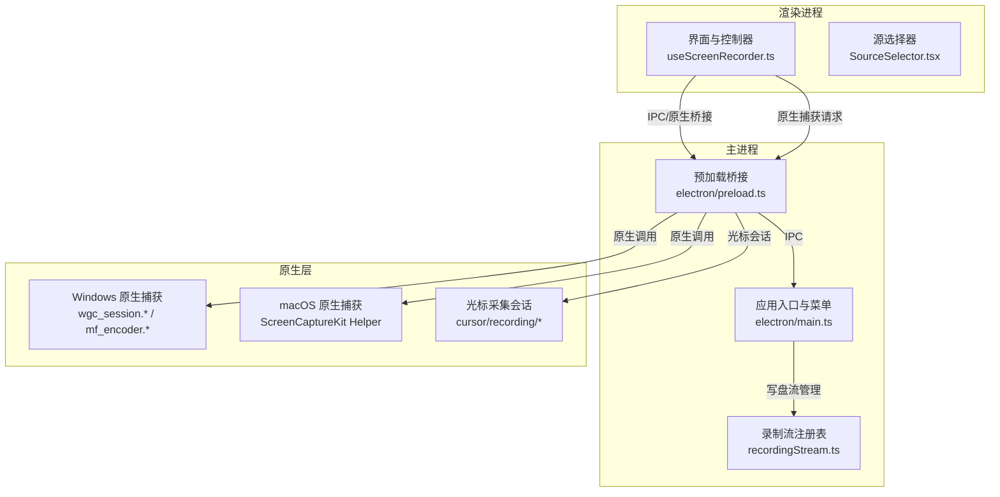
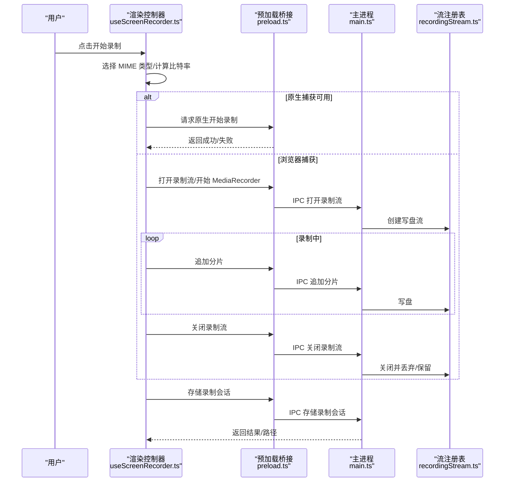
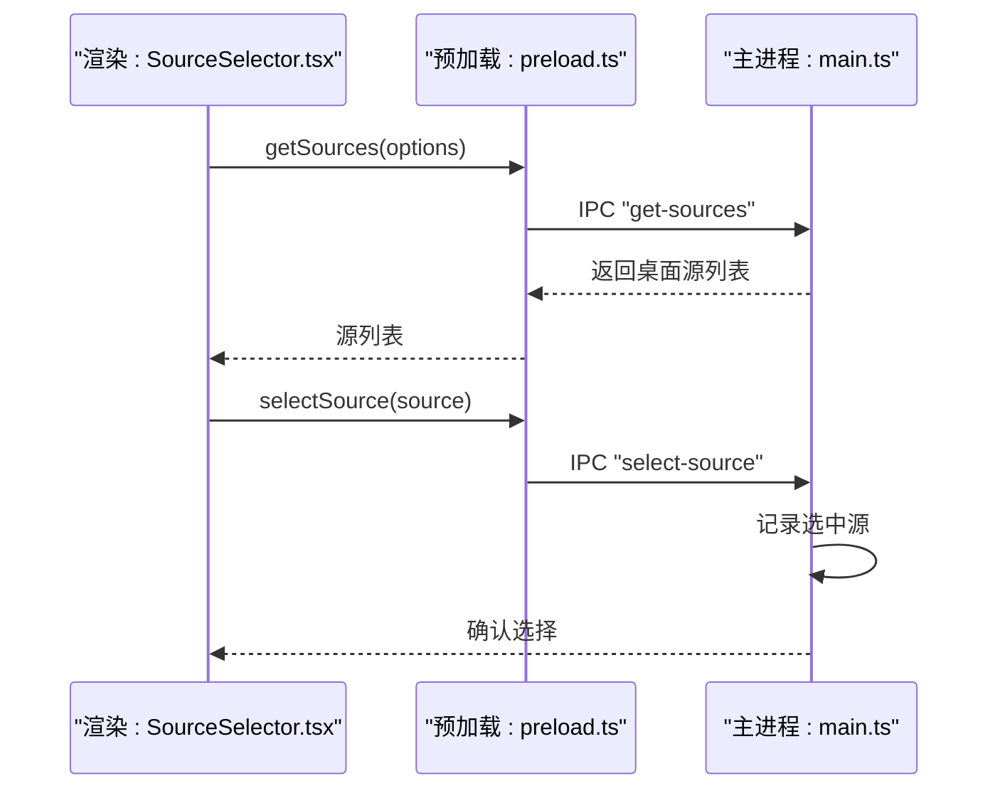
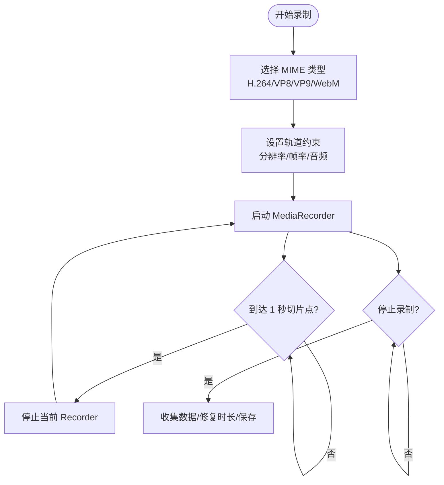
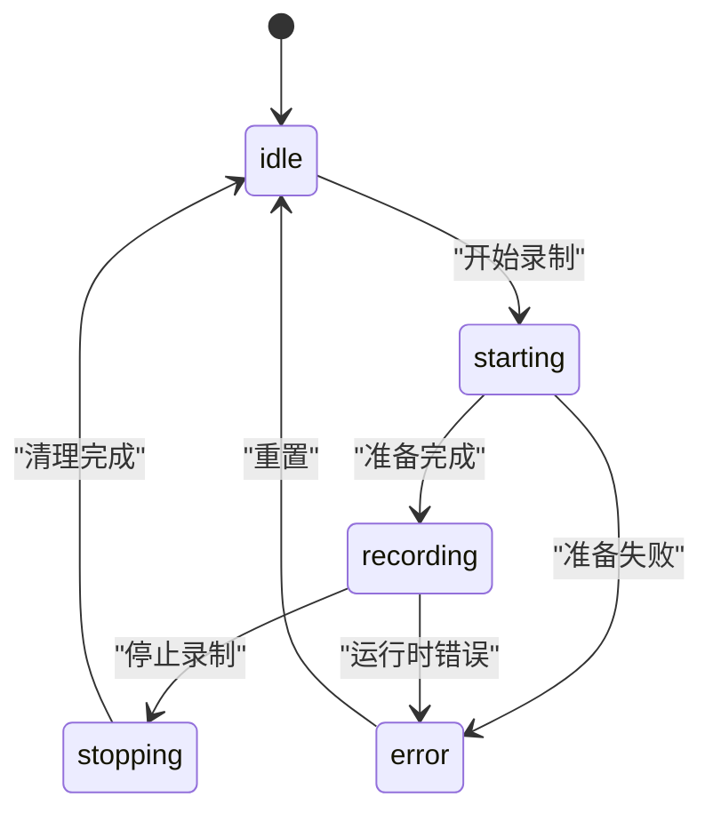
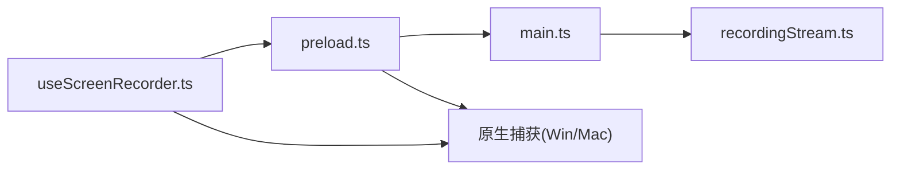

# 屏幕录制系统

<cite>
**本文引用的文件**
- [electron/main.ts](file://electron/main.ts)
- [electron/preload.ts](file://electron/preload.ts)
- [src/hooks/useScreenRecorder.ts](file://src/hooks/useScreenRecorder.ts)
- [src/lib/recordingSession.ts](file://src/lib/recordingSession.ts)
- [electron/ipc/recordingStream.ts](file://electron/ipc/recordingStream.ts)
- [electron/native-bridge/cursor/recording/session.ts](file://electron/native-bridge/cursor/recording/session.ts)
- [electron/native-bridge/cursor/recording/factory.ts](file://electron/native-bridge/cursor/recording/factory.ts)
- [electron/native-bridge/services/systemService.ts](file://electron/native-bridge/services/systemService.ts)
- [electron/native-bridge/services/projectService.ts](file://electron/native-bridge/services/projectService.ts)
- [src/components/launch/SourceSelector.tsx](file://src/components/launch/SourceSelector.tsx)
- [src/components/launch/openSourceSelectorFlow.ts](file://src/components/launch/openSourceSelectorFlow.ts)
- [src/native/client.ts](file://src/native/client.ts)
- [src/native/contracts.ts](file://src/native/contracts.ts)
- [src/utils/platformUtils.ts](file://src/utils/platformUtils.ts)
- [src/utils/timeUtils.ts](file://src/utils/timeUtils.ts)
- [electron/windows.ts](file://electron/windows.ts)
- [electron/globalShortcut.ts](file://electron/globalShortcut.ts)
- [electron/i18n.ts](file://electron/i18n.ts)
- [electron/native/screencapturekit/Sources/OpenScreenScreenCaptureKitHelper/main.swift](file://electron/native/screencapturekit/Sources/OpenScreenScreenCaptureKitHelper/main.swift)
- [electron/native/wgc-capture/src/wgc_session.h](file://electron/native/wgc-capture/src/wgc_session.h)
- [electron/native/wgc-capture/src/wgc_session.cpp](file://electron/native/wgc-capture/src/wgc_session.cpp)
- [electron/native/wgc-capture/src/mf_encoder.h](file://electron/native/wgc-capture/src/mf_encoder.h)
- [electron/native/wgc-capture/src/mf_encoder.cpp](file://electron/native/wgc-capture/src/mf_encoder.cpp)
- [electron/native/wgc-capture/src/cursor-sampler.cpp](file://electron/native/wgc-capture/src/cursor-sampler.cpp)
</cite>

## 目录
1. [引言](#引言)
2. [项目结构](#项目结构)
3. [核心组件](#核心组件)
4. [架构总览](#架构总览)
5. [详细组件分析](#详细组件分析)
6. [依赖关系分析](#依赖关系分析)
7. [性能考量](#性能考量)
8. [故障排查指南](#故障排查指南)
9. [结论](#结论)
10. [附录](#附录)

## 引言
本文件为 OpenScreen 屏幕录制系统的深度技术文档，聚焦于基于 WebRTC 的屏幕录制实现与录制生命周期管理。内容覆盖 desktopCapturer 与 MediaRecorder 的使用、VP8/VP9 编码器选择策略、录制源枚举流程（从 Electron 主进程到渲染器）、录制状态机、分辨率自适应比特率与 1 秒切片优化、WebM 时长修复机制、录制数据收集与持久化、权限与错误处理以及性能优化建议。

## 项目结构
OpenScreen 采用 Electron + React/Vite 的混合架构：主进程负责窗口、权限、原生桥接与录制流写盘；渲染进程负责 UI、录制控制与 WebRTC 录制；通过 IPC 和原生桥接通道进行交互；在 Windows/macOS 上分别提供原生捕获路径以提升性能与兼容性。

图表来源
- [electron/main.ts:1-574](file://electron/main.ts#L1-L574)
- [electron/preload.ts:1-281](file://electron/preload.ts#L1-L281)
- [electron/ipc/recordingStream.ts:1-148](file://electron/ipc/recordingStream.ts#L1-L148)
- [electron/native/wgc-capture/src/wgc_session.cpp](file://electron/native/wgc-capture/src/wgc_session.cpp)
- [electron/native/wgc-capture/src/mf_encoder.cpp](file://electron/native/wgc-capture/src/mf_encoder.cpp)
- [electron/native/screencapturekit/Sources/OpenScreenScreenCaptureKitHelper/main.swift](file://electron/native/screencapturekit/Sources/OpenScreenScreenCaptureKitHelper/main.swift)

章节来源
- [electron/main.ts:1-574](file://electron/main.ts#L1-L574)
- [electron/preload.ts:1-281](file://electron/preload.ts#L1-L281)
- [electron/ipc/recordingStream.ts:1-148](file://electron/ipc/recordingStream.ts#L1-L148)

## 核心组件
- 渲染侧录制控制器：负责状态机、比特率计算、WebM 时长修复、录制数据收集与保存、原生捕获切换。
- 主进程权限与系统集成：设置权限检查/请求、显示媒体选择器、托盘菜单与全局快捷键。
- 预加载桥接：暴露安全的 API 给渲染进程，封装 IPC 调用与原生桥接。
- 录制流注册表：维护按文件名索引的磁盘写入流，支持追加、关闭与丢弃。
- 原生捕获：Windows 使用 WGC/MF 编码器，macOS 使用 ScreenCaptureKit 辅助工具。

章节来源
- [src/hooks/useScreenRecorder.ts:1-800](file://src/hooks/useScreenRecorder.ts#L1-L800)
- [electron/main.ts:460-574](file://electron/main.ts#L460-L574)
- [electron/preload.ts:15-281](file://electron/preload.ts#L15-L281)
- [electron/ipc/recordingStream.ts:15-96](file://electron/ipc/recordingStream.ts#L15-L96)

## 架构总览
下图展示从用户触发录制到最终保存的端到端流程，包括 WebRTC 录制与原生捕获两条路径，以及流式写盘与内存回退策略。

图表来源
- [src/hooks/useScreenRecorder.ts:137-167](file://src/hooks/useScreenRecorder.ts#L137-L167)
- [electron/preload.ts:68-76](file://electron/preload.ts#L68-L76)
- [electron/ipc/recordingStream.ts:103-147](file://electron/ipc/recordingStream.ts#L103-L147)
- [electron/main.ts:495-509](file://electron/main.ts#L495-L509)

## 详细组件分析

### 录制源枚举与选择流程
- 渲染侧通过预加载桥接发起“获取桌面源”请求。
- 主进程根据平台与权限策略返回可用源；Windows 可选系统环回音频；macOS 懒请求麦克风权限。
- 渲染侧 SourceSelector 展示可选源，用户确认后将源传递给主进程，用于后续显示媒体请求。

图表来源
- [electron/preload.ts:32-52](file://electron/preload.ts#L32-L52)
- [electron/main.ts:495-509](file://electron/main.ts#L495-L509)
- [src/components/launch/SourceSelector.tsx](file://src/components/launch/SourceSelector.tsx)
- [src/components/launch/openSourceSelectorFlow.ts](file://src/components/launch/openSourceSelectorFlow.ts)

章节来源
- [electron/preload.ts:32-52](file://electron/preload.ts#L32-L52)
- [electron/main.ts:495-509](file://electron/main.ts#L495-L509)

### WebRTC 录制与 MediaRecorder 配置
- 渲染侧根据屏幕分辨率与目标帧率选择最佳 MIME 类型（优先 H.264，其次 VP8/VP9），并在不支持时回退至 WebM。
- 录制参数包含视频轨道约束（分辨率对齐到偶数、帧率）与音频轨道（麦克风或系统音频）。
- 采用 1 秒切片策略：每段录制结束后立即停止当前 MediaRecorder 并开启新实例，避免长时间缓冲导致内存压力。

图表来源
- [src/hooks/useScreenRecorder.ts:137-167](file://src/hooks/useScreenRecorder.ts#L137-L167)
- [src/hooks/useScreenRecorder.ts:169-188](file://src/hooks/useScreenRecorder.ts#L169-L188)
- [src/hooks/useScreenRecorder.ts:303-421](file://src/hooks/useScreenRecorder.ts#L303-L421)

章节来源
- [src/hooks/useScreenRecorder.ts:137-167](file://src/hooks/useScreenRecorder.ts#L137-L167)
- [src/hooks/useScreenRecorder.ts:169-188](file://src/hooks/useScreenRecorder.ts#L169-L188)
- [src/hooks/useScreenRecorder.ts:303-421](file://src/hooks/useScreenRecorder.ts#L303-L421)

### 录制生命周期状态机
状态包括 idle、starting、recording、stopping、error。状态转换由渲染侧控制器驱动，结合原生捕获与浏览器捕获路径的差异进行处理。

图表来源
- [src/hooks/useScreenRecorder.ts:90-130](file://src/hooks/useScreenRecorder.ts#L90-L130)
- [src/hooks/useScreenRecorder.ts:623-671](file://src/hooks/useScreenRecorder.ts#L623-L671)

章节来源
- [src/hooks/useScreenRecorder.ts:90-130](file://src/hooks/useScreenRecorder.ts#L90-L130)
- [src/hooks/useScreenRecorder.ts:623-671](file://src/hooks/useScreenRecorder.ts#L623-L671)

### 分辨率自适应比特率与 1 秒切片机制
- 比特率策略：依据像素数（4K/QHD/基础）与高帧率阈值进行倍增，确保 60fps 下的清晰度与稳定性。
- 1 秒切片：降低内存峰值与延迟，提升长时间录制的可靠性；切片边界通过 MediaRecorder 的停止/重启实现。

章节来源
- [src/hooks/useScreenRecorder.ts:153-167](file://src/hooks/useScreenRecorder.ts#L153-L167)
- [src/hooks/useScreenRecorder.ts:131-135](file://src/hooks/useScreenRecorder.ts#L131-L135)

### WebM 文件时长修复机制
- 浏览器 MediaRecorder 写出的 WebM 默认无时长，渲染侧在非流式模式下使用修复库修正时长；流式模式下由主进程根据持续时间修补头部，保证编辑器时间轴正确。

章节来源
- [src/hooks/useScreenRecorder.ts:350-356](file://src/hooks/useScreenRecorder.ts#L350-L356)
- [src/lib/recordingSession.ts:24-31](file://src/lib/recordingSession.ts#L24-L31)

### 录制数据收集与保存流程
- 收集屏幕与可选摄像头数据，生成屏幕与摄像头文件名，必要时进行 WebM 时长修复。
- 通过预加载桥接调用主进程存储接口，返回会话或路径；随后切换到编辑器窗口。

章节来源
- [src/hooks/useScreenRecorder.ts:347-382](file://src/hooks/useScreenRecorder.ts#L347-L382)
- [src/hooks/useScreenRecorder.ts:391-397](file://src/hooks/useScreenRecorder.ts#L391-L397)

### 权限管理与错误处理
- 权限：主进程允许媒体/屏幕/音频权限检查与请求；Windows 显示媒体请求返回选中源及系统环回音频；macOS 懒请求麦克风权限。
- 错误：渲染侧对摄像头断连、权限被拒等场景进行提示与状态恢复；主进程流注册表对写盘错误进行日志记录与降级处理。

章节来源
- [electron/main.ts:469-493](file://electron/main.ts#L469-L493)
- [electron/main.ts:495-509](file://electron/main.ts#L495-L509)
- [src/hooks/useScreenRecorder.ts:270-284](file://src/hooks/useScreenRecorder.ts#L270-L284)
- [electron/ipc/recordingStream.ts:39-41](file://electron/ipc/recordingStream.ts#L39-L41)

### 原生捕获路径（Windows/macOS）
- Windows：通过 WGC 会话与 MF 编码器进行原生捕获，支持暂停/恢复/停止；可选叠加摄像头。
- macOS：通过 ScreenCaptureKit 辅助工具进行捕获，支持光标采集与摄像头附加。
- 光标会话：统一的会话工厂与基类抽象，便于扩展不同平台的光标采集策略。

章节来源
- [electron/native/wgc-capture/src/wgc_session.cpp](file://electron/native/wgc-capture/src/wgc_session.cpp)
- [electron/native/wgc-capture/src/mf_encoder.cpp](file://electron/native/wgc-capture/src/mf_encoder.cpp)
- [electron/native/screencapturekit/Sources/OpenScreenScreenCaptureKitHelper/main.swift](file://electron/native/screencapturekit/Sources/OpenScreenScreenCaptureKitHelper/main.swift)
- [electron/native-bridge/cursor/recording/session.ts](file://electron/native-bridge/cursor/recording/session.ts)
- [electron/native-bridge/cursor/recording/factory.ts](file://electron/native-bridge/cursor/recording/factory.ts)

## 依赖关系分析
- 渲染侧依赖预加载桥接提供的 IPC 接口与原生桥接能力。
- 预加载桥接依赖主进程的 IPC 处理器与流注册表。
- 主进程依赖系统权限策略与显示媒体请求处理器。
- 原生捕获模块独立于 Electron，通过预加载桥接调用。

图表来源
- [src/hooks/useScreenRecorder.ts:1-800](file://src/hooks/useScreenRecorder.ts#L1-L800)
- [electron/preload.ts:15-281](file://electron/preload.ts#L15-L281)
- [electron/main.ts:460-574](file://electron/main.ts#L460-L574)
- [electron/ipc/recordingStream.ts:15-96](file://electron/ipc/recordingStream.ts#L15-L96)

章节来源
- [src/hooks/useScreenRecorder.ts:1-800](file://src/hooks/useScreenRecorder.ts#L1-L800)
- [electron/preload.ts:15-281](file://electron/preload.ts#L15-L281)
- [electron/main.ts:460-574](file://electron/main.ts#L460-L574)
- [electron/ipc/recordingStream.ts:15-96](file://electron/ipc/recordingStream.ts#L15-L96)

## 性能考量
- 编码器选择：优先硬件加速的 H.264；在需要更高质量时选择 VP9；避免 AV1 在实时路径上的高 CPU 开销。
- 分辨率与帧率：按目标分辨率分档设定比特率，60fps 时进行额外增益补偿。
- 内存与延迟：1 秒切片显著降低峰值内存占用；流式写盘避免长时间缓冲。
- I/O 优化：写盘流仅在失败时回退到内存；错误事件统一监听，避免崩溃。
- 原生捕获：Windows/macOS 原生路径减少浏览器解码压力，提高稳定性。

## 故障排查指南
- 录制无声音：检查系统音频请求与 Windows 环回音频返回；确认麦克风权限。
- 录制卡顿或模糊：确认编码器选择与比特率配置；降低分辨率或帧率。
- WebM 时间轴异常：确认是否使用了流式写盘并由主进程修补时长；否则在渲染侧进行时长修复。
- 摄像头断连：渲染侧会自动停止摄像头并提示；检查设备权限与连接状态。
- 写盘失败：主进程流注册表会记录错误并回退；检查磁盘空间与权限。

章节来源
- [electron/main.ts:495-509](file://electron/main.ts#L495-L509)
- [src/hooks/useScreenRecorder.ts:270-284](file://src/hooks/useScreenRecorder.ts#L270-L284)
- [electron/ipc/recordingStream.ts:39-41](file://electron/ipc/recordingStream.ts#L39-L41)

## 结论
OpenScreen 的录制系统通过 WebRTC 与原生捕获双轨并行，在保证跨平台兼容的同时最大化性能与稳定性。其核心在于：清晰的状态机、自适应比特率、1 秒切片与流式写盘、严格的权限与错误处理，以及完善的 WebM 时长修复机制。这些设计共同确保了长时间高质量录制的可行性与用户体验。

## 附录
- 平台与窗口：主进程初始化 Wayland 支持、托盘图标与全局快捷键。
- 国际化与菜单：动态构建应用菜单与托盘上下文。
- 工具与实用函数：平台判断、时间工具等辅助模块。

章节来源
- [electron/main.ts:31-48](file://electron/main.ts#L31-L48)
- [electron/main.ts:136-285](file://electron/main.ts#L136-L285)
- [src/utils/platformUtils.ts](file://src/utils/platformUtils.ts)
- [src/utils/timeUtils.ts](file://src/utils/timeUtils.ts)