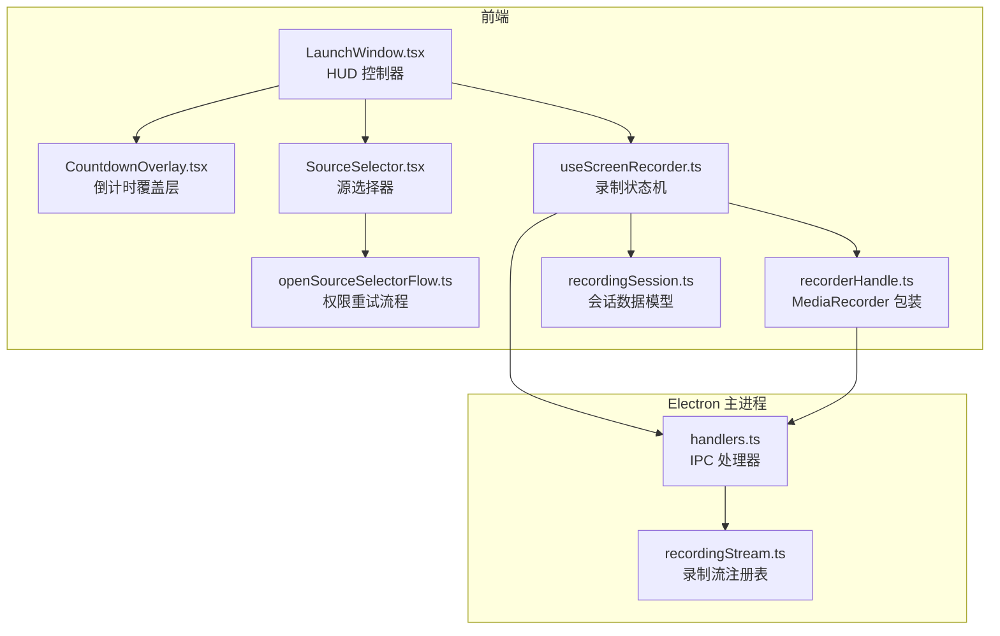
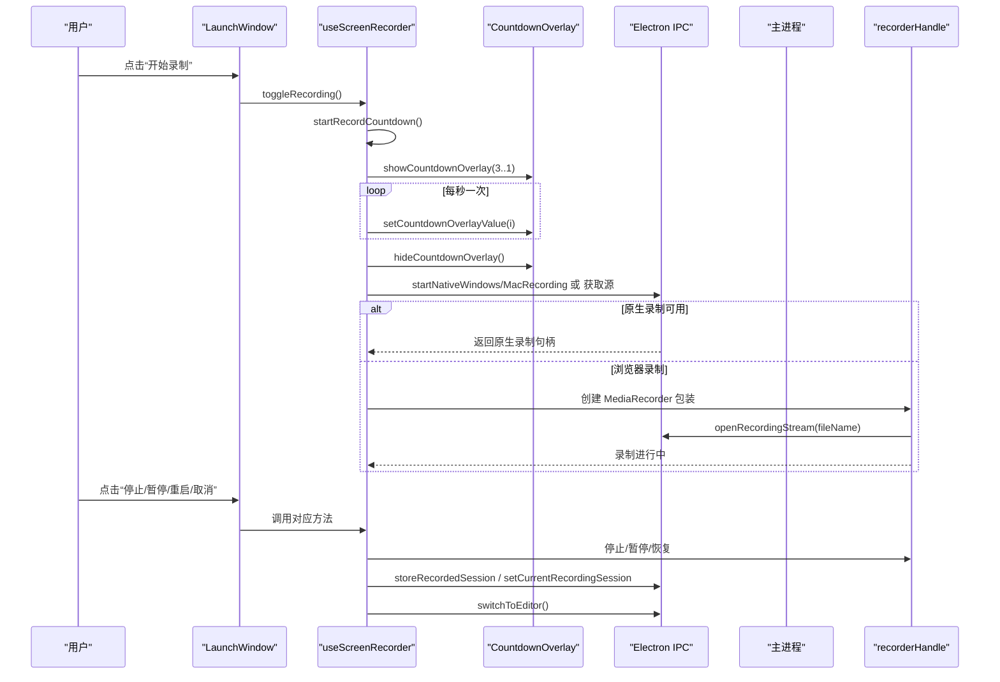
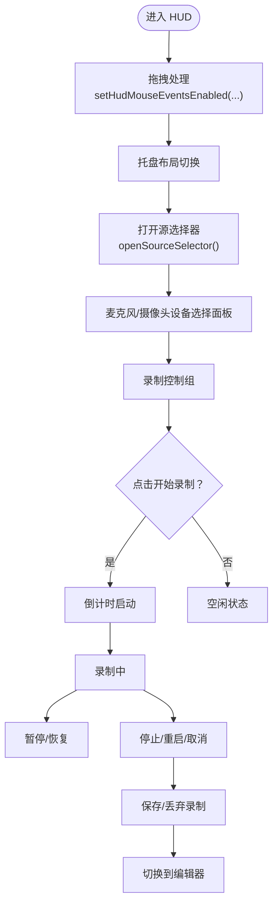
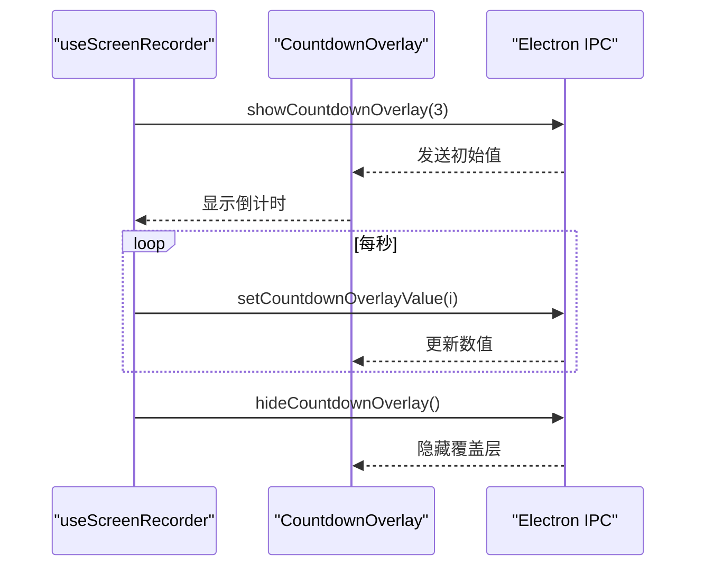
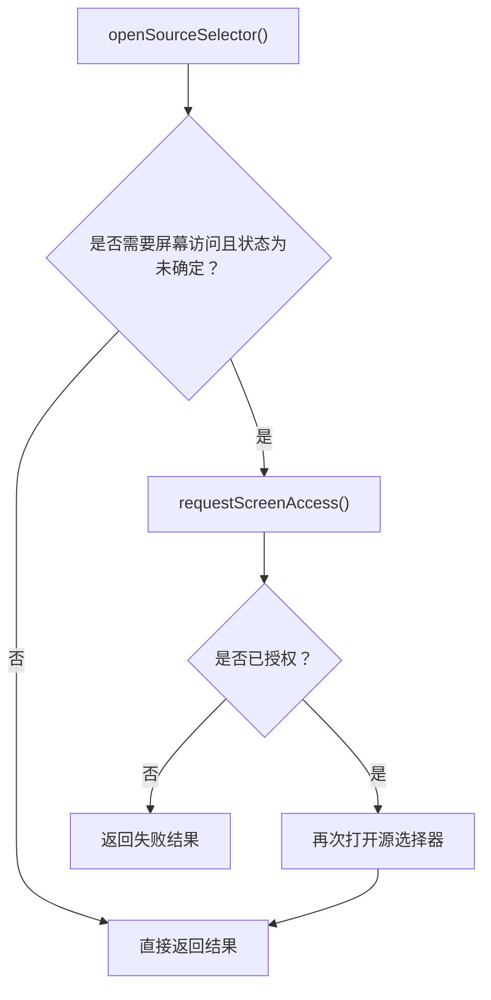
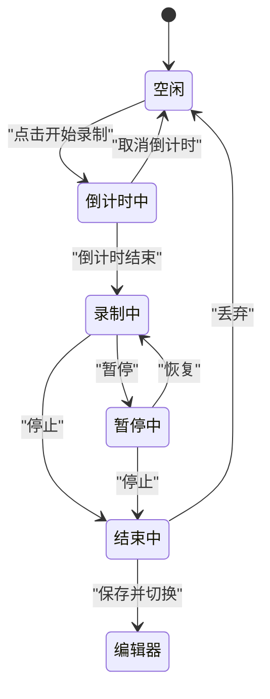
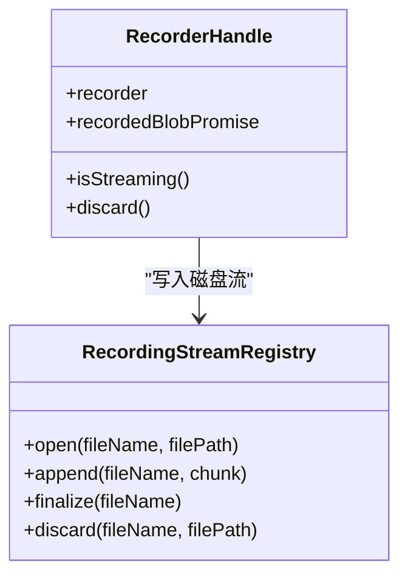
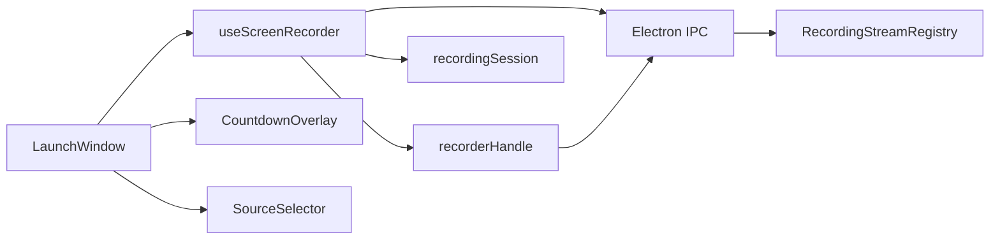

# 录制工作流程与控制

<cite>
**本文引用的文件**
- [LaunchWindow.tsx](file://src/components/launch/LaunchWindow.tsx)
- [CountdownOverlay.tsx](file://src/components/launch/CountdownOverlay.tsx)
- [SourceSelector.tsx](file://src/components/launch/SourceSelector.tsx)
- [openSourceSelectorFlow.ts](file://src/components/launch/openSourceSelectorFlow.ts)
- [useScreenRecorder.ts](file://src/hooks/useScreenRecorder.ts)
- [recorderHandle.ts](file://src/hooks/recorderHandle.ts)
- [recordingSession.ts](file://src/lib/recordingSession.ts)
- [recordingStream.ts](file://electron/ipc/recordingStream.ts)
- [launch.json](file://src/i18n/locales/en/launch.json)
- [02-recording-workflow-and-controls.md](file://docs/03-recording/02-recording-workflow-and-controls.md)
</cite>

## 目录
1. [简介](#简介)
2. [项目结构](#项目结构)
3. [核心组件](#核心组件)
4. [架构总览](#架构总览)
5. [详细组件分析](#详细组件分析)
6. [依赖关系分析](#依赖关系分析)
7. [性能考量](#性能考量)
8. [故障排查指南](#故障排查指南)
9. [结论](#结论)
10. [附录](#附录)

## 简介
本文件系统性梳理 OpenScreen 的录制工作流程与用户控制界面，重点覆盖以下方面：
- 录制启动的完整工作流：倒计时启动机制、源选择流程、录制控制按钮交互
- LaunchWindow 组件的设计与实现：录制 HUD 界面、状态显示与用户反馈
- 倒计时覆盖层的实现原理与用户体验设计
- 录制控制状态管理：开始、暂停/恢复、停止、重启、取消
- 录制状态同步机制、进度显示与错误状态处理
- 用户引导、界面响应性与无障碍设计建议

## 项目结构
OpenScreen 的录制子系统由前端 React 组件与 Electron 主进程 IPC 协同构成。前端通过自定义 Hook 管理录制状态机，调用 Electron 提供的原生能力（如屏幕/窗口源选择、原生录制、倒计时覆盖层、录制流写入等），并在渲染器中通过 MediaRecorder 进行浏览器侧录制。

**图表来源**
- [LaunchWindow.tsx](file://src/components/launch/LaunchWindow.tsx)
- [CountdownOverlay.tsx](file://src/components/launch/CountdownOverlay.tsx)
- [SourceSelector.tsx](file://src/components/launch/SourceSelector.tsx)
- [openSourceSelectorFlow.ts](file://src/components/launch/openSourceSelectorFlow.ts)
- [useScreenRecorder.ts](file://src/hooks/useScreenRecorder.ts)
- [recorderHandle.ts](file://src/hooks/recorderHandle.ts)
- [recordingSession.ts](file://src/lib/recordingSession.ts)
- [recordingStream.ts](file://electron/ipc/recordingStream.ts)

**章节来源**
- [LaunchWindow.tsx](file://src/components/launch/LaunchWindow.tsx)
- [useScreenRecorder.ts](file://src/hooks/useScreenRecorder.ts)
- [recordingStream.ts](file://electron/ipc/recordingStream.ts)

## 核心组件
- LaunchWindow：浮动 HUD 控件，提供源选择、音频/摄像头/光标模式切换、录制控制（开始/暂停/停止/重启/取消）、托盘布局切换、语言菜单等。
- CountdownOverlay：全屏倒计时覆盖层，用于在录制前进行 3→2→1 的倒计时提示。
- SourceSelector：屏幕/窗口源选择器，支持分页浏览、缩略图展示、图标与名称标注、分享确认。
- useScreenRecorder：录制状态机与生命周期管理，封装倒计时、原生录制、浏览器录制、媒体流清理、保存与丢弃等。
- recorderHandle：对 MediaRecorder 的轻量包装，支持内存缓冲与磁盘流式写入，保证长录制不溢出。
- recordingSession：录制会话的数据模型与归一化工具，确保跨进程数据一致性。
- recordingStream：主进程侧录制流注册表，负责打开/追加/关闭/丢弃磁盘流，保障顺序与可靠性。

**章节来源**
- [LaunchWindow.tsx](file://src/components/launch/LaunchWindow.tsx)
- [CountdownOverlay.tsx](file://src/components/launch/CountdownOverlay.tsx)
- [SourceSelector.tsx](file://src/components/launch/SourceSelector.tsx)
- [useScreenRecorder.ts](file://src/hooks/useScreenRecorder.ts)
- [recorderHandle.ts](file://src/hooks/recorderHandle.ts)
- [recordingSession.ts](file://src/lib/recordingSession.ts)
- [recordingStream.ts](file://electron/ipc/recordingStream.ts)

## 架构总览
下图展示了从用户点击“开始录制”到最终进入编辑器的端到端流程，以及倒计时覆盖层与录制流写入的关键节点。

**图表来源**
- [useScreenRecorder.ts](file://src/hooks/useScreenRecorder.ts)
- [CountdownOverlay.tsx](file://src/components/launch/CountdownOverlay.tsx)
- [recorderHandle.ts](file://src/hooks/recorderHandle.ts)
- [recordingStream.ts](file://electron/ipc/recordingStream.ts)

## 详细组件分析

### LaunchWindow：录制 HUD 设计与交互
- 视窗拖拽与鼠标事件穿透控制：通过 Electron API 在拖拽时允许捕获指针，在非交互区域自动释放，避免误触。
- 托盘布局切换：支持水平/垂直布局，状态持久化至用户偏好。
- 源选择器：调用 Electron API 打开源选择器，支持权限重试流程；显示当前选中源名称。
- 音频/摄像头/光标控制：在录制未进行时可启用/禁用麦克风、系统音频、摄像头；光标模式在 Windows/macOS 上按平台能力显示。
- 录制控制按钮：根据状态动态显示“开始/停止”、“暂停/恢复”、“重启/取消”，并显示已用时长。
- 语言菜单：系统语言建议弹窗，支持接受或保持默认。

**图表来源**
- [LaunchWindow.tsx](file://src/components/launch/LaunchWindow.tsx)
- [openSourceSelectorFlow.ts](file://src/components/launch/openSourceSelectorFlow.ts)

**章节来源**
- [LaunchWindow.tsx](file://src/components/launch/LaunchWindow.tsx)
- [openSourceSelectorFlow.ts](file://src/components/launch/openSourceSelectorFlow.ts)

### 倒计时覆盖层：实现原理与体验设计
- 渲染层：订阅 Electron IPC 事件，接收倒计时数值并居中显示，采用半透明背景与大号数字提升可读性。
- 控制层：useScreenRecorder 在启动录制前显示覆盖层，依次发送 3→2→1 的值，最后隐藏；若中途取消，立即隐藏并清理状态。
- 体验设计：覆盖层全屏、不可交互，避免打断用户操作；等待首帧绘制后再显示，避免黑屏闪烁。

**图表来源**
- [CountdownOverlay.tsx](file://src/components/launch/CountdownOverlay.tsx)
- [useScreenRecorder.ts](file://src/hooks/useScreenRecorder.ts)

**章节来源**
- [CountdownOverlay.tsx](file://src/components/launch/CountdownOverlay.tsx)
- [useScreenRecorder.ts](file://src/hooks/useScreenRecorder.ts)

### 源选择流程：权限重试与错误处理
- 打开源选择器：调用 Electron API 打开源选择器；若返回需要屏幕访问且状态为“未确定”，则触发权限请求重试。
- 权限重试策略：最多尝试若干次，每次等待固定时间；若用户授予权限，则再次打开源选择器；否则返回失败结果。
- 源加载与展示：支持屏幕与窗口两类源，带缩略图、应用图标与名称；加载失败时提供重新加载入口。

**图表来源**
- [openSourceSelectorFlow.ts](file://src/components/launch/openSourceSelectorFlow.ts)
- [SourceSelector.tsx](file://src/components/launch/SourceSelector.tsx)

**章节来源**
- [openSourceSelectorFlow.ts](file://src/components/launch/openSourceSelectorFlow.ts)
- [SourceSelector.tsx](file://src/components/launch/SourceSelector.tsx)

### 录制控制状态机：开始/暂停/停止/重启/取消
- 开始录制：若无倒计时运行则启动倒计时；倒计时结束后进入录制阶段。
- 暂停/恢复：仅当处于录制且未处于最终化阶段时可用；更新累计时长与内部计时段。
- 停止录制：优先走原生录制路径（Windows/macOS）或浏览器录制路径；完成后统一进入保存流程。
- 重启录制：在录制中时丢弃当前录制并重新开始；若在倒计时中则取消倒计时。
- 取消录制：在倒计时中取消倒计时并隐藏覆盖层；在录制中则丢弃并停止。

**图表来源**
- [useScreenRecorder.ts](file://src/hooks/useScreenRecorder.ts)

**章节来源**
- [useScreenRecorder.ts](file://src/hooks/useScreenRecorder.ts)

### 录制状态同步、进度显示与错误处理
- 状态同步：useScreenRecorder 内部维护 recording/paused/elapsedSeconds 等状态，并通过 MediaRecorder 事件与 Electron IPC 推送状态变化。
- 进度显示：倒计时覆盖层实时更新数值；录制中按钮显示已用时长；暂停时以不同颜色标识。
- 错误处理：摄像头接入失败、设备不存在/不可读、磁盘流写入失败等均有明确提示与回退（内存缓冲）；最终保存失败时丢弃未保存的数据。

**章节来源**
- [useScreenRecorder.ts](file://src/hooks/useScreenRecorder.ts)
- [CountdownOverlay.tsx](file://src/components/launch/CountdownOverlay.tsx)
- [launch.json](file://src/i18n/locales/en/launch.json)

### 录制流写入与数据持久化
- 浏览器录制：通过 MediaRecorder 生成视频块，优先尝试打开磁盘流；若成功则顺序写入，失败则回退到内存缓冲。
- 主进程写入：主进程维护 RecordingStreamRegistry，负责打开/追加/关闭/丢弃磁盘流，确保写入顺序与完整性。
- 保存与切换：录制完成后调用 IPC 将会话保存到磁盘并设置当前会话，随后切换到编辑器窗口。

**图表来源**
- [recorderHandle.ts](file://src/hooks/recorderHandle.ts)
- [recordingStream.ts](file://electron/ipc/recordingStream.ts)

**章节来源**
- [recorderHandle.ts](file://src/hooks/recorderHandle.ts)
- [recordingStream.ts](file://electron/ipc/recordingStream.ts)

## 依赖关系分析
- 组件耦合：LaunchWindow 通过 useScreenRecorder 暴露的方法与状态驱动 UI；CountdownOverlay 与 useScreenRecorder 通过 IPC 事件解耦。
- 数据模型：recordingSession 定义了录制会话的结构，确保前后端一致。
- 外部依赖：Electron IPC 提供源选择、原生录制、倒计时覆盖层、录制流写入、切换编辑器等能力。

**图表来源**
- [LaunchWindow.tsx](file://src/components/launch/LaunchWindow.tsx)
- [useScreenRecorder.ts](file://src/hooks/useScreenRecorder.ts)
- [recorderHandle.ts](file://src/hooks/recorderHandle.ts)
- [recordingSession.ts](file://src/lib/recordingSession.ts)
- [recordingStream.ts](file://electron/ipc/recordingStream.ts)

**章节来源**
- [LaunchWindow.tsx](file://src/components/launch/LaunchWindow.tsx)
- [useScreenRecorder.ts](file://src/hooks/useScreenRecorder.ts)
- [recordingSession.ts](file://src/lib/recordingSession.ts)
- [recordingStream.ts](file://electron/ipc/recordingStream.ts)

## 性能考量
- 帧率与分辨率：优先使用硬件加速编码（H.264），在高分辨率/高帧率场景下自动调整码率，兼顾质量与性能。
- 流式写入：长录制通过磁盘流写入避免内存占用过高；失败时回退到内存缓冲，确保稳定性。
- 媒体轨道约束：在可行范围内尽量锁定目标分辨率与帧率，减少编码压力与画面模糊风险。

[本节为通用指导，无需特定文件引用]

## 故障排查指南
- 无法加载源列表：检查屏幕录制权限与系统版本；必要时重新加载源选择器。
- 倒计时覆盖层不显示：确认 IPC 句柄存在且窗口已就绪；检查主进程日志。
- 录制后时长异常：确认渲染器通过 MediaRecorder 事件正确收集块并由主进程补全时长。
- 摄像头接入失败：检查设备是否存在、权限是否被拒绝；必要时重新授权。
- 保存失败或丢失片段：查看磁盘流写入错误日志；确认主进程已正确关闭/丢弃流。

**章节来源**
- [useScreenRecorder.ts](file://src/hooks/useScreenRecorder.ts)
- [recordingStream.ts](file://electron/ipc/recordingStream.ts)
- [launch.json](file://src/i18n/locales/en/launch.json)

## 结论
OpenScreen 的录制工作流通过前端 Hook 管理状态机、倒计时覆盖层与源选择器协同，结合 Electron 主进程的原生录制与磁盘流写入能力，实现了稳定、可扩展且用户体验友好的录制流程。通过清晰的状态划分与错误处理策略，系统能够在复杂环境下保持一致性与可靠性。

[本节为总结性内容，无需特定文件引用]

## 附录
- 相关文档：参考录制工作流与控制说明文档，了解状态机与事件处理器的职责边界。
  
**章节来源**
- [02-recording-workflow-and-controls.md](file://docs/03-recording/02-recording-workflow-and-controls.md)