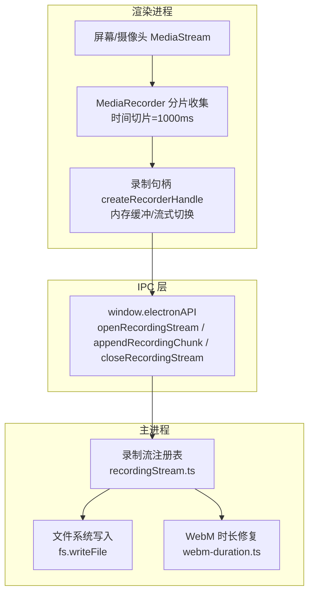
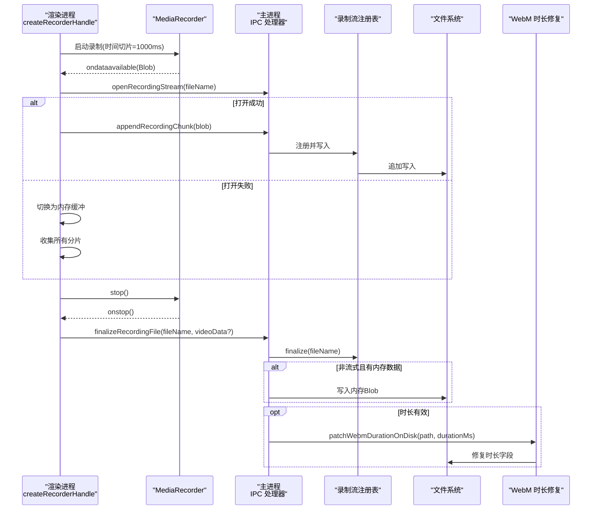
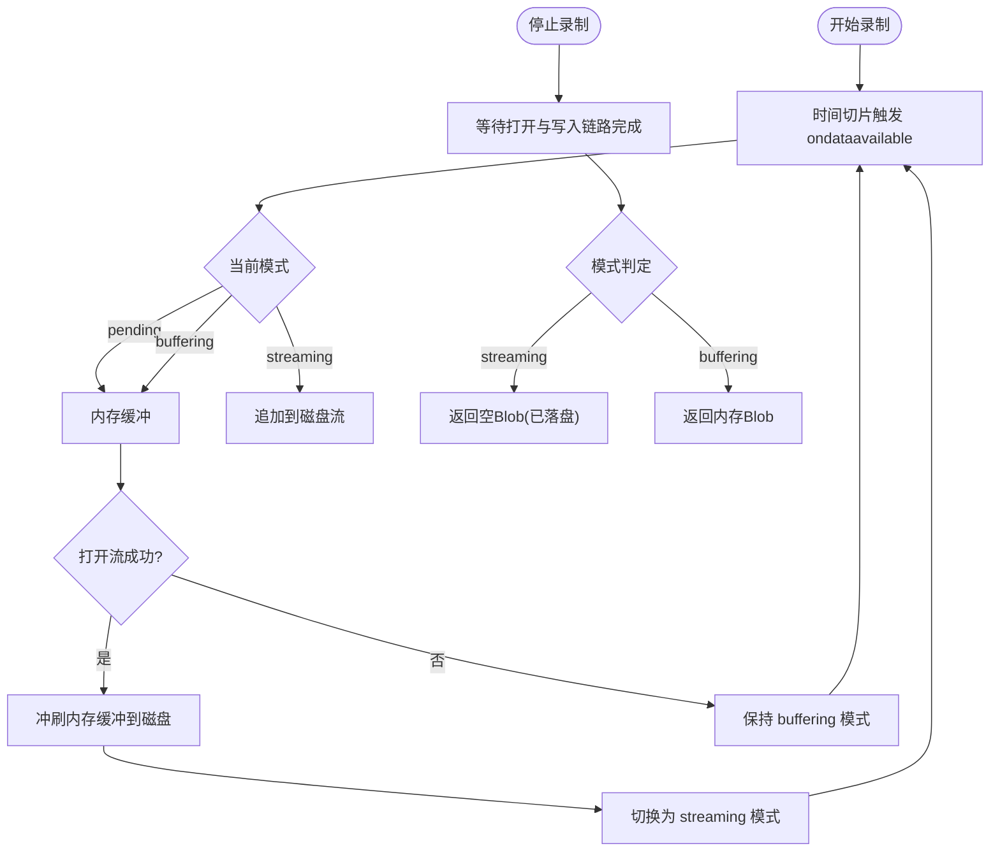
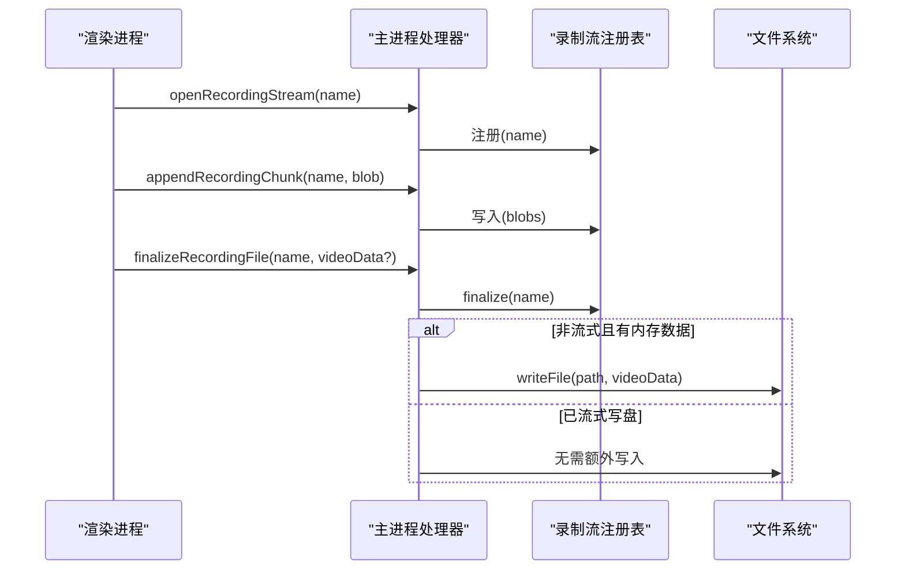
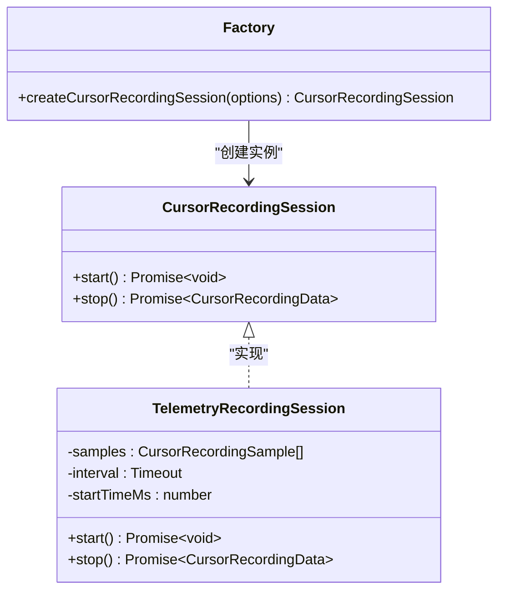
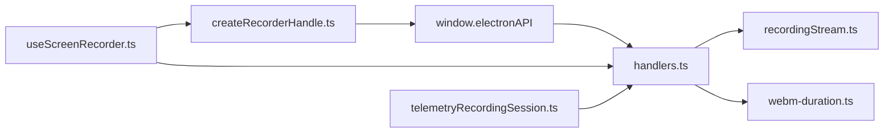

# 录制数据流处理

<cite>
**本文引用的文件**
- [recorderHandle.ts](file://src/hooks/recorderHandle.ts)
- [recorderHandle.test.ts](file://src/hooks/recorderHandle.test.ts)
- [recordingStream.ts](file://electron/ipc/recordingStream.ts)
- [handlers.ts](file://electron/ipc/handlers.ts)
- [webm-duration.ts](file://electron/recording/webm-duration.ts)
- [useScreenRecorder.ts](file://src/hooks/useScreenRecorder.ts)
- [recordingSession.ts](file://src/lib/recordingSession.ts)
- [01-ipc-communication-system.md](file://docs/02-architecture/01-ipc-communication-system.md)
- [recordingStream.test.ts](file://electron/ipc/recordingStream.test.ts)
- [telemetryRecordingSession.ts](file://electron/native-bridge/cursor/recording/telemetryRecordingSession.ts)
- [factory.ts](file://electron/native-bridge/cursor/recording/factory.ts)
- [session.ts](file://electron/native-bridge/cursor/recording/session.ts)
- [telemetryCursorAdapter.ts](file://electron/native-bridge/cursor/telemetryCursorAdapter.ts)
</cite>

## 目录
1. [引言](#引言)
2. [项目结构](#项目结构)
3. [核心组件](#核心组件)
4. [架构总览](#架构总览)
5. [详细组件分析](#详细组件分析)
6. [依赖关系分析](#依赖关系分析)
7. [性能考量](#性能考量)
8. [故障排查指南](#故障排查指南)
9. [结论](#结论)
10. [附录](#附录)

## 引言
本文件面向OpenScreen的录制数据流处理，系统性阐述从媒体捕获到最终存储的完整数据通路：包括MediaRecorder数据块收集、Blob组装与WebM文件修复；实时处理中的数据缓冲、内存管理与流式传输优化；录制会话状态管理、数据同步与错误恢复策略；元数据处理（时长修复、文件大小计算、质量评估）；以及跨进程IPC传输、数据共享与性能监控。文档同时提供调试工具、性能分析与故障诊断方法，帮助开发者快速定位问题并优化体验。

## 项目结构
OpenScreen采用Electron主进程+渲染进程的双端架构，录制数据流的关键路径如下：
- 渲染进程负责屏幕/摄像头等MediaStream的采集与MediaRecorder分片写入，支持“流式写盘”或“内存回退”两种模式。
- 主进程通过IPC提供“打开录制流”“追加分片”“关闭流”“最终落盘”等能力，并在必要时进行WebM时长修复。
- 元数据（如光标轨迹）独立采集并以JSON文件形式与视频文件关联保存。

图表来源
- [recorderHandle.ts:38-160](file://src/hooks/recorderHandle.ts#L38-L160)
- [recordingStream.ts](file://electron/ipc/recordingStream.ts)
- [handlers.ts:291-302](file://electron/ipc/handlers.ts#L291-L302)
- [webm-duration.ts](file://electron/recording/webm-duration.ts)

章节来源
- [recorderHandle.ts:1-160](file://src/hooks/recorderHandle.ts#L1-L160)
- [recordingStream.ts](file://electron/ipc/recordingStream.ts)
- [handlers.ts:291-302](file://electron/ipc/handlers.ts#L291-L302)
- [webm-duration.ts](file://electron/recording/webm-duration.ts)

## 核心组件
- 录制句柄（createRecorderHandle）
  - 负责包装MediaRecorder，按需开启“流式写盘”或“内存缓冲”，并在停止时统一产出Blob或空Blob（表示已落盘）。
  - 关键行为：时间切片启动、分片到达回调、失败回退、最终化逻辑、丢弃清理。
- 录制流注册表（recordingStream.ts）
  - 维护每个录制会话的打开/写入/关闭状态，确保分片按序到达与落盘一致性。
- 主进程IPC处理器（handlers.ts）
  - 提供打开/追加/关闭录制流接口，以及最终落盘与WebM时长修复。
- WebM时长修复（webm-duration.ts）
  - 在主进程对已流式写盘的WebM文件进行时长字段修复，保证编辑器seek与时间轴可用。
- 光标轨迹采集（telemetryRecordingSession.ts 等）
  - 独立采集光标位置与事件，生成JSON文件并与视频同名关联。

章节来源
- [recorderHandle.ts:38-160](file://src/hooks/recorderHandle.ts#L38-L160)
- [recordingStream.ts](file://electron/ipc/recordingStream.ts)
- [handlers.ts:291-302](file://electron/ipc/handlers.ts#L291-L302)
- [webm-duration.ts](file://electron/recording/webm-duration.ts)
- [telemetryRecordingSession.ts:16-44](file://electron/native-bridge/cursor/recording/telemetryRecordingSession.ts#L16-L44)

## 架构总览
下图展示一次典型录制会话的端到端流程：渲染进程通过MediaRecorder持续产生分片，根据是否能打开流决定写盘或内存缓冲；停止后由主进程统一落盘并修复WebM时长；光标轨迹作为独立文件保存。

图表来源
- [recorderHandle.ts:38-160](file://src/hooks/recorderHandle.ts#L38-L160)
- [handlers.ts:291-302](file://electron/ipc/handlers.ts#L291-L302)
- [handlers.ts:2202-2240](file://electron/ipc/handlers.ts#L2202-L2240)
- [webm-duration.ts](file://electron/recording/webm-duration.ts)

## 详细组件分析

### 组件A：录制句柄（createRecorderHandle）
- 数据缓冲与流式切换
  - 在流未打开前，所有分片先缓存在内存数组中；一旦打开成功，内存缓冲一次性冲刷至磁盘并清空，后续分片直接写盘。
  - 若打开失败或IPC通道异常，则保持内存缓冲模式，最终以完整Blob返回。
- 停止与最终化
  - 停止时等待打开Promise与写入链路完成，再根据模式返回空Blob（已落盘）或内存Blob。
- 丢弃与清理
  - 若已打开流且需要丢弃，调用关闭IPC接口删除临时文件，避免残留。
- 时间切片与实时性
  - 使用固定时间切片触发分片输出，降低延迟并提升可预测性。

图表来源
- [recorderHandle.ts:38-160](file://src/hooks/recorderHandle.ts#L38-L160)

章节来源
- [recorderHandle.ts:1-160](file://src/hooks/recorderHandle.ts#L1-L160)
- [recorderHandle.test.ts:48-114](file://src/hooks/recorderHandle.test.ts#L48-L114)
- [recorderHandle.test.ts:236-264](file://src/hooks/recorderHandle.test.ts#L236-L264)

### 组件B：录制流注册表与IPC处理（recordingStream.ts、handlers.ts）
- 流注册与并发控制
  - 每个录制会话对应一个注册条目，负责接收分片、顺序写入、关闭与清理。
- 最终落盘与回退
  - 若非流式且存在内存数据，则直接写入文件；否则由流注册表完成收尾。
- WebM时长修复
  - 对于流式写盘产生的文件，若提供时长信息则异步修复时长字段，确保编辑器可用。

图表来源
- [recordingStream.ts](file://electron/ipc/recordingStream.ts)
- [handlers.ts:291-302](file://electron/ipc/handlers.ts#L291-L302)
- [handlers.ts:2202-2240](file://electron/ipc/handlers.ts#L2202-L2240)

章节来源
- [recordingStream.ts](file://electron/ipc/recordingStream.ts)
- [handlers.ts:291-302](file://electron/ipc/handlers.ts#L291-L302)
- [handlers.ts:2202-2240](file://electron/ipc/handlers.ts#L2202-L2240)

### 组件C：WebM时长修复（webm-duration.ts）
- 修复时机
  - 仅对流式写盘产生的文件进行修复；当渲染侧无法持有完整Blob时，主进程负责修复。
- 并发与独立性
  - 对多个文件的修复为最佳努力且相互独立，使用并发方式提升整体效率。
- 输入校验
  - 仅对合法的正数时长进行修复，避免无效数据污染。

章节来源
- [webm-duration.ts](file://electron/recording/webm-duration.ts)
- [handlers.ts:2231-2240](file://electron/ipc/handlers.ts#L2231-L2240)

### 组件D：光标轨迹采集与同步（telemetryRecordingSession.ts、factory.ts、session.ts、telemetryCursorAdapter.ts）
- 采集策略
  - 不同平台采用不同实现：Windows/Mac使用原生会话，Linux通过Electron屏幕API定时采样。
- 会话生命周期
  - start()/stop()提供统一接口，stop()返回包含样本与资产的结构化数据。
- 时间同步
  - 通过偏移量与暂停区间压缩，保证光标轨迹与视频帧严格对齐。
- 数据格式
  - 输出JSON文件，与视频文件同名并以扩展区分。

图表来源
- [session.ts:3-6](file://electron/native-bridge/cursor/recording/session.ts#L3-L6)
- [telemetryRecordingSession.ts:16-44](file://electron/native-bridge/cursor/recording/telemetryRecordingSession.ts#L16-L44)
- [factory.ts:16-46](file://electron/native-bridge/cursor/recording/factory.ts#L16-L46)

章节来源
- [telemetryRecordingSession.ts:16-44](file://electron/native-bridge/cursor/recording/telemetryRecordingSession.ts#L16-L44)
- [factory.ts:16-46](file://electron/native-bridge/cursor/recording/factory.ts#L16-L46)
- [session.ts:3-6](file://electron/native-bridge/cursor/recording/session.ts#L3-L6)
- [telemetryCursorAdapter.ts](file://electron/native-bridge/cursor/telemetryCursorAdapter.ts)

### 组件E：录制会话状态管理与最终化（useScreenRecorder.ts、recordingSession.ts）
- 状态机与幂等
  - 通过唯一ID与防重机制避免重复终止；停止后清理媒体资源、重置计时与状态。
- 多路录制协同
  - 同时处理屏幕与摄像头录制句柄，分别等待其最终化结果，再进入保存阶段。
- 保存与丢弃
  - 成功保存时由主进程统一落盘并修复时长；若中途丢弃则清理所有未保存资源。

章节来源
- [useScreenRecorder.ts:303-345](file://src/hooks/useScreenRecorder.ts#L303-L345)
- [recordingSession.ts](file://src/lib/recordingSession.ts)

## 依赖关系分析
- 渲染进程依赖
  - MediaRecorder API用于分片输出；window.electronAPI用于IPC通信。
- 主进程依赖
  - 文件系统写入；WebM修复工具；录制流注册表协调多路写入。
- IPC契约
  - 方法定义与类型约束见IPC文档，确保跨进程调用的稳定性与可测试性。

图表来源
- [recorderHandle.ts:38-160](file://src/hooks/recorderHandle.ts#L38-L160)
- [handlers.ts:291-302](file://electron/ipc/handlers.ts#L291-L302)
- [webm-duration.ts](file://electron/recording/webm-duration.ts)
- [useScreenRecorder.ts:303-345](file://src/hooks/useScreenRecorder.ts#L303-L345)
- [telemetryRecordingSession.ts:16-44](file://electron/native-bridge/cursor/recording/telemetryRecordingSession.ts#L16-L44)

章节来源
- [01-ipc-communication-system.md:28-220](file://docs/02-architecture/01-ipc-communication-system.md#L28-L220)

## 性能考量
- 实时性
  - 使用固定时间切片触发分片输出，降低首包延迟并提升可预测性。
- 内存占用
  - 优先采用流式写盘，避免长时间录制导致的内存峰值；失败时才启用内存回退。
- I/O吞吐
  - 分片顺序写入，减少随机I/O；并发修复WebM时长，缩短总耗时。
- CPU与编码
  - 录制参数（如MIME类型、编码配置）直接影响CPU与带宽占用，应在UI层提供合理默认值与可选范围。
- 调试与观测
  - 建议在渲染与主进程分别记录分片到达、写入确认、最终化耗时等指标，便于定位瓶颈。

## 故障排查指南
- 常见问题与定位
  - 打开流失败：检查文件名合法性与权限；查看IPC打开调用返回值；确认主进程目录存在。
  - 写入中断：验证写入链路是否完成；确认最终化前无未完成的写入任务。
  - 时长不正确：确认是否为流式写盘且提供了有效时长；检查修复调用是否执行。
  - 光标轨迹错位：核对时间偏移与暂停区间压缩逻辑；确保与视频起始时间一致。
- 可用工具
  - 单元测试覆盖了流式写盘、回退、丢弃等关键分支，可作为回归参考。
  - IPC方法清单与类型定义可用于核对调用签名与参数。

章节来源
- [recorderHandle.test.ts:48-114](file://src/hooks/recorderHandle.test.ts#L48-L114)
- [recorderHandle.test.ts:236-264](file://src/hooks/recorderHandle.test.ts#L236-L264)
- [recordingStream.test.ts](file://electron/ipc/recordingStream.test.ts)
- [01-ipc-communication-system.md:28-220](file://docs/02-architecture/01-ipc-communication-system.md#L28-L220)

## 结论
OpenScreen的录制数据流通过“渲染进程分片+主进程流式写盘”的组合，在保证低延迟的同时兼顾可靠性与可维护性。关键在于：
- 明确的模式切换（流式/内存）与最终化策略；
- 严格的IPC契约与注册表协调；
- WebM时长修复与光标轨迹同步；
- 完备的错误恢复与丢弃清理。
建议在生产环境中结合日志与指标持续优化参数与路径选择，以获得更佳的用户体验。

## 附录
- IPC方法速查（节选）
  - openRecordingStream、appendRecordingChunk、closeRecordingStream、finalizeRecordingFile、patchWebmDurationOnDisk
- 相关文件路径
  - 录制句柄：src/hooks/recorderHandle.ts
  - 录制流注册表：electron/ipc/recordingStream.ts
  - 主进程处理器：electron/ipc/handlers.ts
  - WebM时长修复：electron/recording/webm-duration.ts
  - 光标轨迹采集：electron/native-bridge/cursor/recording/*
  - 录制会话：src/hooks/useScreenRecorder.ts、src/lib/recordingSession.ts