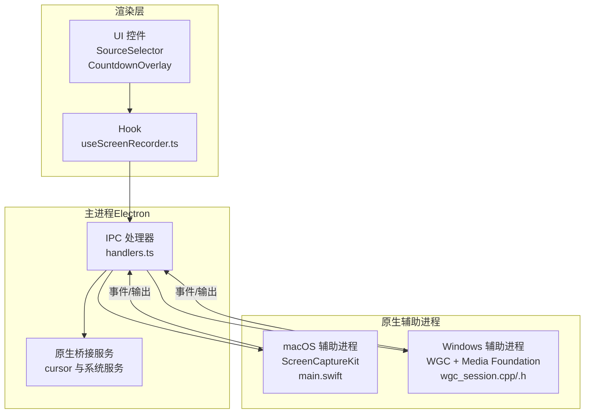
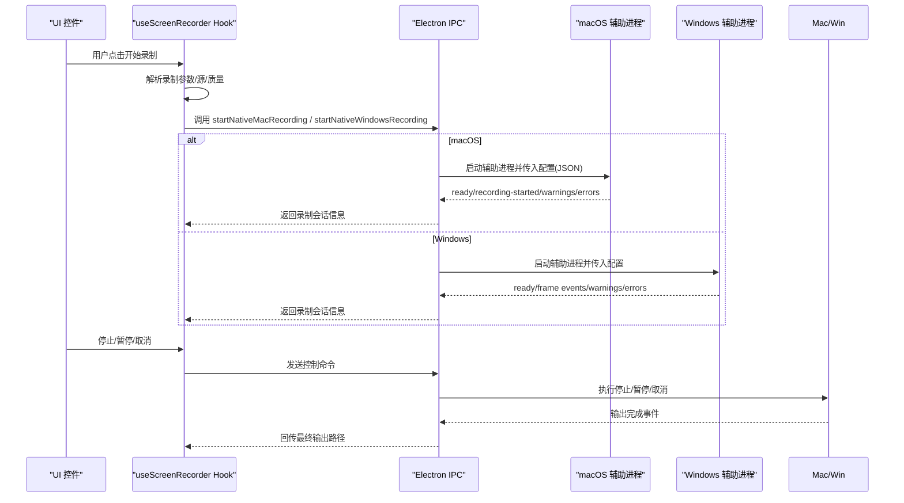
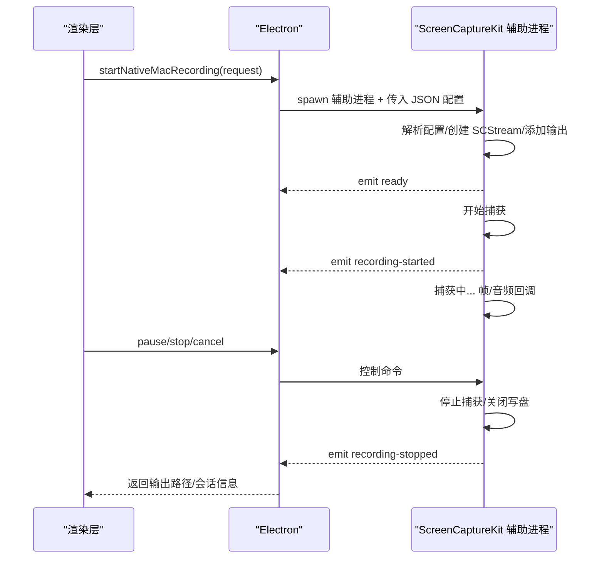
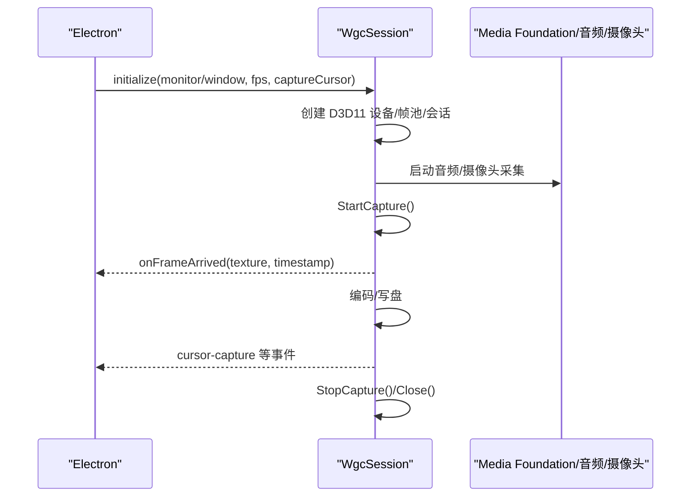
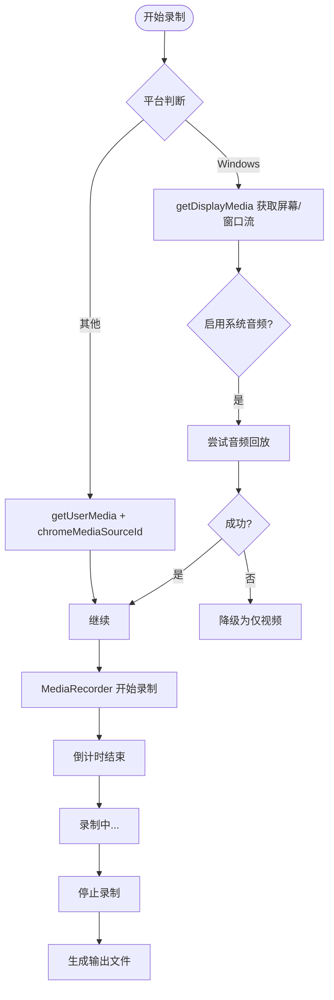
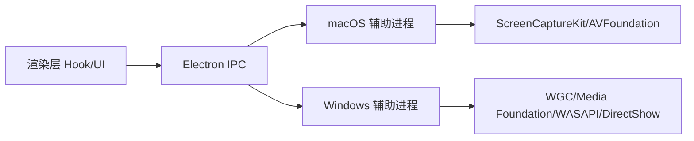

# 录制系统

<cite>
**本文引用的文件**
- [electron\native\screencapturekit\Sources\OpenScreenScreenCaptureKitHelper\main.swift](file://electron\native\screencapturekit\Sources\OpenScreenScreenCaptureKitHelper\main.swift)
- [electron\native\wgc-capture\src\wgc_session.cpp](file://electron\native\wgc-capture\src\wgc_session.cpp)
- [electron\native\wgc-capture\src\wgc_session.h](file://electron\native\wgc-capture\src\wgc_session.h)
- [electron\native\README.md](file://electron\native\README.md)
- [electron\ipc\handlers.ts](file://electron\ipc\handlers.ts)
- [src\hooks\useScreenRecorder.ts](file://src\hooks\useScreenRecorder.ts)
- [src\lib\nativeMacRecording.ts](file://src\lib\nativeMacRecording.ts)
- [docs\engineering\macos-native-recorder-roadmap.md](file://docs\engineering\macos-native-recorder-roadmap.md)
</cite>

## 目录
1. [简介](#简介)
2. [项目结构](#项目结构)
3. [核心组件](#核心组件)
4. [架构总览](#架构总览)
5. [详细组件分析](#详细组件分析)
6. [依赖关系分析](#依赖关系分析)
7. [性能考虑](#性能考虑)
8. [故障排除指南](#故障排除指南)
9. [结论](#结论)
10. [附录](#附录)

## 简介
本文件为 OpenScreen 录制系统的综合技术文档，覆盖从屏幕捕获到视频流处理的完整流程。文档重点解释三种录制方式的技术实现与适用场景：
- WebRTC 录制（浏览器侧通过getDisplayMedia或getUserMedia采集）
- 原生 macOS ScreenCaptureKit 录制（Electron 调用 Swift 辅助进程）
- Windows Graphics Capture API（WGC）录制（Electron 调用 C++ 辅助进程）

文档还涵盖录制源选择、录制参数配置、实时预览与录制流管理；详细说明录制工作流程（倒计时启动、录制控制按钮与状态管理）；以及从原始帧捕获到编码压缩的处理管道；最后提供录制质量控制、性能优化与内存管理策略，并给出故障排除与最佳实践建议。

## 项目结构
OpenScreen 的录制系统由三部分组成：
- 渲染层：负责用户交互、倒计时、录制参数与状态管理（React Hook 与 UI 组件）
- 主进程（Electron IPC）：负责跨平台录制流程编排、输出路径与会话管理
- 原生辅助进程（Swift/WinRT C++）：负责系统级媒体捕获与编码输出

图表来源
- [electron\ipc\handlers.ts](file://electron\ipc\handlers.ts)
- [src\hooks\useScreenRecorder.ts](file://src\hooks\useScreenRecorder.ts)
- [electron\native\screencapturekit\Sources\OpenScreenScreenCaptureKitHelper\main.swift](file://electron\native\screencapturekit\Sources\OpenScreenScreenCaptureKitHelper\main.swift)
- [electron\native\wgc-capture\src\wgc_session.cpp](file://electron\native\wgc-capture\src\wgc_session.cpp)
- [electron\native\wgc-capture\src\wgc_session.h](file://electron\native\wgc-capture\src\wgc_session.h)

章节来源
- [electron\ipc\handlers.ts](file://electron\ipc\handlers.ts)
- [src\hooks\useScreenRecorder.ts](file://src\hooks\useScreenRecorder.ts)
- [electron\native\screencapturekit\Sources\OpenScreenScreenCaptureKitHelper\main.swift](file://electron\native\screencapturekit\Sources\OpenScreenScreenCaptureKitHelper\main.swift)
- [electron\native\wgc-capture\src\wgc_session.cpp](file://electron\native\wgc-capture\src\wgc_session.cpp)
- [electron\native\wgc-capture\src\wgc_session.h](file://electron\native\wgc-capture\src\wgc_session.h)

## 核心组件
- 渲染层 Hook：封装录制参数构建、倒计时与录制控制调用，按平台选择不同采集路径
- Electron IPC：统一处理录制请求、输出路径生成、会话状态与错误上报
- macOS 辅助进程（ScreenCaptureKit）：负责显示/窗口捕获、系统音频、麦克风与摄像头的原生采集与编码
- Windows 辅助进程（WGC）：负责显示器/窗口捕获、系统音频回放、麦克风与摄像头采集与编码

章节来源
- [src\hooks\useScreenRecorder.ts](file://src\hooks\useScreenRecorder.ts)
- [electron\ipc\handlers.ts](file://electron\ipc\handlers.ts)
- [electron\native\screencapturekit\Sources\OpenScreenScreenCaptureKitHelper\main.swift](file://electron\native\screencapturekit\Sources\OpenScreenScreenCaptureKitHelper\main.swift)
- [electron\native\wgc-capture\src\wgc_session.cpp](file://electron\native\wgc-capture\src\wgc_session.cpp)

## 架构总览
OpenScreen 的录制架构遵循“渲染层参数 + 主进程编排 + 原生辅助进程采集”的分层设计。渲染层负责用户交互与参数输入；主进程负责跨平台流程编排与输出路径管理；原生辅助进程负责系统级媒体采集与编码输出，二者通过 IPC 事件进行通信。

图表来源
- [src\hooks\useScreenRecorder.ts](file://src\hooks\useScreenRecorder.ts)
- [electron\ipc\handlers.ts](file://electron\ipc\handlers.ts)
- [electron\native\screencapturekit\Sources\OpenScreenScreenCaptureKitHelper\main.swift](file://electron\native\screencapturekit\Sources\OpenScreenScreenCaptureKitHelper\main.swift)
- [electron\native\wgc-capture\src\wgc_session.cpp](file://electron\native\wgc-capture\src\wgc_session.cpp)

## 详细组件分析

### macOS ScreenCaptureKit 录制
- 录制源与参数
  - 支持“显示器”和“窗口”两种源类型，可选 displayId 或 windowId
  - 视频参数包含分辨率、帧率、比特率与是否隐藏系统光标
  - 音频支持系统音频与麦克风，麦克风设备可通过名称或 ID 指定
  - 可选摄像头（AVFoundation），作为画中画叠加到主视频
- 工作流程
  - 渲染层构建 NativeMacRecordingRequest 并调用 IPC
  - 主进程启动 macOS 辅助进程，传递 JSON 配置
  - 辅助进程解析配置，建立 SCStream，注册屏幕/音频/麦克风输出
  - 初始化 AVAssetWriter 进行编码与写盘，发出 ready 事件后开始捕获
  - 支持暂停/恢复/停止，停止后完成写盘并发出停止事件
- 事件与错误
  - 事件类型包括 ready、recording-started、recording-stopped、warning、error
  - 错误类型覆盖参数无效、系统版本不支持、权限不足、写盘失败等

图表来源
- [src\hooks\useScreenRecorder.ts](file://src\hooks\useScreenRecorder.ts)
- [src\lib\nativeMacRecording.ts](file://src\lib\nativeMacRecording.ts)
- [electron\ipc\handlers.ts](file://electron\ipc\handlers.ts)
- [electron\native\screencapturekit\Sources\OpenScreenScreenCaptureKitHelper\main.swift](file://electron\native\screencapturekit\Sources\OpenScreenScreenCaptureKitHelper\main.swift)

章节来源
- [electron\native\screencapturekit\Sources\OpenScreenScreenCaptureKitHelper\main.swift](file://electron\native\screencapturekit\Sources\OpenScreenScreenCaptureKitHelper\main.swift)
- [src\lib\nativeMacRecording.ts](file://src\lib\nativeMacRecording.ts)
- [src\hooks\useScreenRecorder.ts](file://src\hooks\useScreenRecorder.ts)
- [docs\engineering\macos-native-recorder-roadmap.md](file://docs\engineering\macos-native-recorder-roadmap.md)

### Windows Graphics Capture API 录制
- 录制源与参数
  - 支持显示器与窗口两种源，内部通过 WinRT IGraphicsCaptureSession 创建捕获项
  - 支持帧率与是否捕获系统光标
  - 音频回放与麦克风通过 WASAPI/MF 捕获，摄像头通过 Media Foundation/DirectShow
- 工作流程
  - 主进程根据请求初始化 WgcSession，创建 D3D11 设备与帧池
  - 启动捕获会话，帧到达回调中提取 ID3D11Texture2D 并交由编码管线
  - 编码完成后写入 MP4 输出，期间通过事件上报状态与警告
- 事件与错误
  - 事件包括 cursor-capture 等状态反馈
  - 失败时输出错误日志并返回失败状态

图表来源
- [electron\native\wgc-capture\src\wgc_session.cpp](file://electron\native\wgc-capture\src\wgc_session.cpp)
- [electron\native\wgc-capture\src\wgc_session.h](file://electron\native\wgc-capture\src\wgc_session.h)
- [electron\native\README.md](file://electron\native\README.md)

章节来源
- [electron\native\wgc-capture\src\wgc_session.cpp](file://electron\native\wgc-capture\src\wgc_session.cpp)
- [electron\native\wgc-capture\src\wgc_session.h](file://electron\native\wgc-capture\src\wgc_session.h)
- [electron\native\README.md](file://electron\native\README.md)

### WebRTC 录制（浏览器侧）
- 录制源与参数
  - Windows：通过 getDisplayMedia 获取屏幕/窗口流，可控制光标策略
  - 其他平台：通过 getUserMedia + chromeMediaSourceId 指定源
  - 支持系统音频回放失败时降级为仅视频
- 工作流程
  - 渲染层根据平台选择采集路径，构造 MediaStream
  - 使用 MediaRecorder 对流进行编码与写入 Blob
  - 倒计时结束后开始录制，停止时生成临时输出并交由主进程处理

图表来源
- [src\hooks\useScreenRecorder.ts](file://src\hooks\useScreenRecorder.ts)

章节来源
- [src\hooks\useScreenRecorder.ts](file://src\hooks\useScreenRecorder.ts)

### 录制工作流程与状态管理
- 倒计时启动：渲染层触发倒计时，倒计时结束后发送录制请求
- 录制控制：支持暂停/恢复/停止/取消，状态在主进程与辅助进程之间同步
- 状态事件：辅助进程通过事件通道上报 ready、recording-started、recording-stopped、warning、error
- 会话管理：主进程负责输出路径生成、Manifest 写入与会话元数据管理

章节来源
- [src\hooks\useScreenRecorder.ts](file://src\hooks\useScreenRecorder.ts)
- [electron\ipc\handlers.ts](file://electron\ipc\handlers.ts)
- [electron\native\screencapturekit\Sources\OpenScreenScreenCaptureKitHelper\main.swift](file://electron\native\screencapturekit\Sources\OpenScreenScreenCaptureKitHelper\main.swift)
- [electron\native\wgc-capture\src\wgc_session.cpp](file://electron\native\wgc-capture\src\wgc_session.cpp)

### 数据处理管道（从原始帧到编码压缩）
- macOS
  - 屏幕帧：SCStream 输出 CMSampleBuffer，经 AVAssetWriter 编码写盘
  - 音频：系统音频与麦克风混合，AAC 编码后与视频复用
  - 摄像头：AVCaptureDevice 捕获，合成到主视频
- Windows
  - 屏幕帧：WGC 帧池回调中提取 ID3D11Texture2D，进入编码管线
  - 音频：WASAPI/MF 捕获，AAC 编码后与视频复用
  - 摄像头：Media Foundation/DirectShow 捕获，合成到主视频

章节来源
- [electron\native\screencapturekit\Sources\OpenScreenScreenCaptureKitHelper\main.swift](file://electron\native\screencapturekit\Sources\OpenScreenScreenCaptureKitHelper\main.swift)
- [electron\native\wgc-capture\src\wgc_session.cpp](file://electron\native\wgc-capture\src\wgc_session.cpp)
- [electron\native\README.md](file://electron\native\README.md)

## 依赖关系分析
- 渲染层依赖 Electron API 与 Hook，负责参数与状态
- 主进程依赖原生辅助进程（macOS/Windows），负责系统级采集
- 原生辅助进程依赖系统 API（ScreenCaptureKit/WinRT、AVFoundation、Media Foundation、WASAPI、DirectShow）
- IPC 事件用于状态同步与错误上报

图表来源
- [src\hooks\useScreenRecorder.ts](file://src\hooks\useScreenRecorder.ts)
- [electron\ipc\handlers.ts](file://electron\ipc\handlers.ts)
- [electron\native\screencapturekit\Sources\OpenScreenScreenCaptureKitHelper\main.swift](file://electron\native\screencapturekit\Sources\OpenScreenScreenCaptureKitHelper\main.swift)
- [electron\native\wgc-capture\src\wgc_session.cpp](file://electron\native\wgc-capture\src\wgc_session.cpp)

章节来源
- [src\hooks\useScreenRecorder.ts](file://src\hooks\useScreenRecorder.ts)
- [electron\ipc\handlers.ts](file://electron\ipc\handlers.ts)
- [electron\native\screencapturekit\Sources\OpenScreenScreenCaptureKitHelper\main.swift](file://electron\native\screencapturekit\Sources\OpenScreenScreenCaptureKitHelper\main.swift)
- [electron\native\wgc-capture\src\wgc_session.cpp](file://electron\native\wgc-capture\src\wgc_session.cpp)

## 性能考虑
- 帧率与分辨率：根据目标分辨率与帧率计算比特率，避免过高的编码负载
- 比特率控制：动态调整比特率以平衡质量与体积
- 摄像头合成：摄像头帧在原生侧合成，减少浏览器端额外开销
- 事件驱动：原生辅助进程通过事件上报状态，降低轮询成本
- 内存管理：及时释放 D3D 设备、帧池与会话资源，避免泄漏

章节来源
- [src\hooks\useScreenRecorder.ts](file://src\hooks\useScreenRecorder.ts)
- [electron\native\wgc-capture\src\wgc_session.cpp](file://electron\native\wgc-capture\src\wgc_session.cpp)
- [electron\native\screencapturekit\Sources\OpenScreenScreenCaptureKitHelper\main.swift](file://electron\native\screencapturekit\Sources\OpenScreenScreenCaptureKitHelper\main.swift)

## 故障排除指南
- macOS
  - 参数无效：检查 NativeMacRecordingRequest 字段完整性
  - 系统版本不支持：ScreenCaptureKit 需要 macOS 13+
  - 权限不足：确保屏幕录制与麦克风权限已授予
  - 写盘失败：检查输出目录权限与磁盘空间
- Windows
  - WGC 光标设置未生效：检查运行时版本对 IsCursorCaptureEnabled 的支持
  - 设备匹配失败：麦克风优先匹配 WASAPI ID，其次按名称；摄像头优先 Media Foundation，再回退 DirectShow
  - 帧回调为空：确认 D3D 设备与帧池初始化成功
- 通用
  - 倒计时中断：确保倒计时令牌有效，避免中途取消导致流程提前终止
  - 会话残留：取消时确保清理临时输出文件

章节来源
- [electron\native\screencapturekit\Sources\OpenScreenScreenCaptureKitHelper\main.swift](file://electron\native\screencapturekit\Sources\OpenScreenScreenCaptureKitHelper\main.swift)
- [electron\native\wgc-capture\src\wgc_session.cpp](file://electron\native\wgc-capture\src\wgc_session.cpp)
- [electron\native\README.md](file://electron\native\README.md)
- [src\hooks\useScreenRecorder.ts](file://src\hooks\useScreenRecorder.ts)

## 结论
OpenScreen 的录制系统通过“渲染层参数 + 主进程编排 + 原生辅助进程采集”的架构，实现了跨平台、高质量、低延迟的屏幕录制能力。macOS 采用 ScreenCaptureKit 与 AVFoundation，Windows 采用 WGC 与 Media Foundation，两者均在原生侧完成编码与写盘，保证了稳定性与性能。配合完善的事件机制与状态管理，系统能够满足从演示到专业编辑的多种录制需求。

## 附录
- 最佳实践
  - 优先使用原生录制（macOS/Windows），以获得更稳定的性能与更低的 CPU 占用
  - 在浏览器侧仅保留必要的预览与参数配置，避免在渲染层做重编码
  - 合理设置帧率与分辨率，避免超配导致卡顿
  - 在需要编辑光标时启用可编辑光标模式，并在会话中记录偏移量以便后期对齐
- 参考文档
  - macOS 原生录制路线图与验收标准
  - 原生辅助进程使用说明与测试命令

章节来源
- [docs\engineering\macos-native-recorder-roadmap.md](file://docs\engineering\macos-native-recorder-roadmap.md)
- [electron\native\README.md](file://electron\native\README.md)