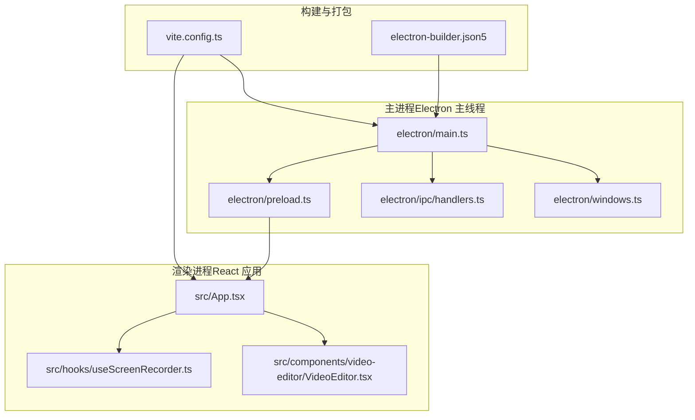
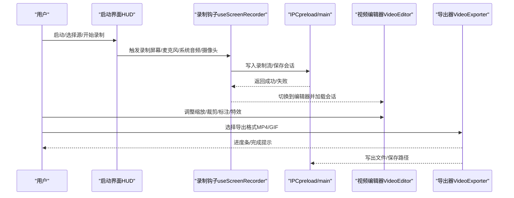
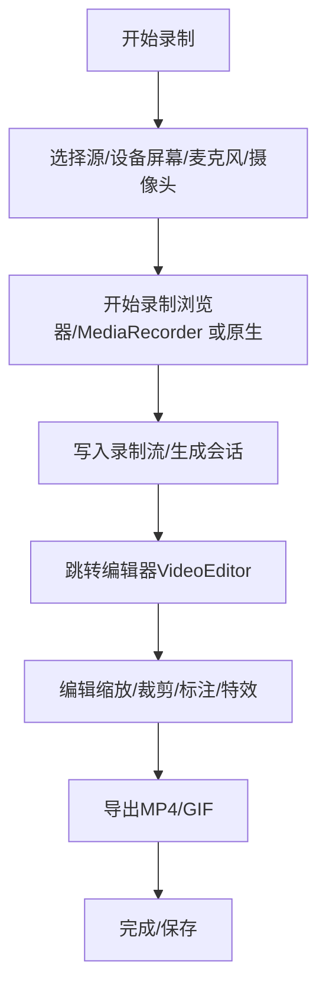
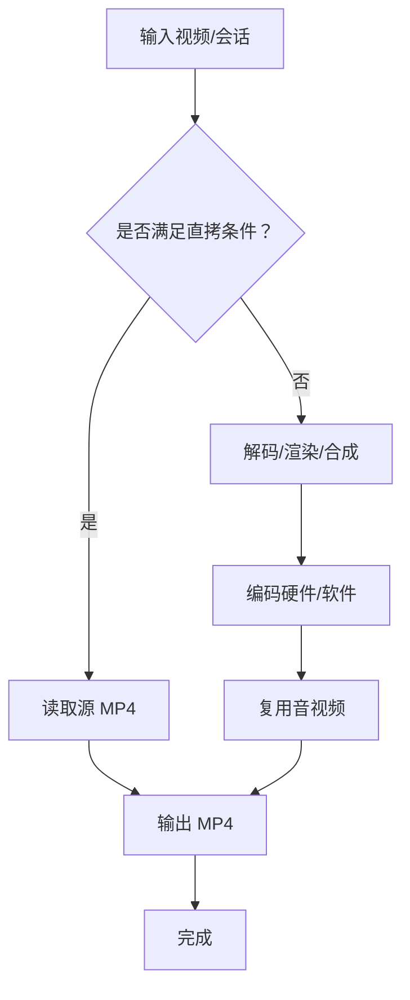
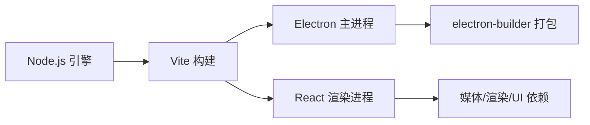

# 快速开始

<cite>
**本文档引用的文件**
- [README.md](file://README.md)
- [package.json](file://package.json)
- [docs/01-getting-started/01-getting-started.md](file://docs/01-getting-started/01-getting-started.md)
- [docs/01-getting-started/02-installation-and-setup.md](file://docs/01-getting-started/02-installation-and-setup.md)
- [docs/01-getting-started/03-development-environment.md](file://docs/01-getting-started/03-development-environment.md)
- [electron/main.ts](file://electron/main.ts)
- [electron/preload.ts](file://electron/preload.ts)
- [vite.config.ts](file://vite.config.ts)
- [electron-builder.json5](file://electron-builder.json5)
- [nix/module.nix](file://nix/module.nix)
- [src/hooks/useScreenRecorder.ts](file://src/hooks/useScreenRecorder.ts)
- [src/components/video-editor/VideoEditor.tsx](file://src/components/video-editor/VideoEditor.tsx)
- [src/lib/exporter/videoExporter.ts](file://src/lib/exporter/videoExporter.ts)
- [src/components/video-editor/ExportDialog.tsx](file://src/components/video-editor/ExportDialog.tsx)
</cite>

## 目录
1. [简介](#简介)
2. [项目结构](#项目结构)
3. [核心组件](#核心组件)
4. [架构总览](#架构总览)
5. [详细组件分析](#详细组件分析)
6. [依赖关系分析](#依赖关系分析)
7. [性能考虑](#性能考虑)
8. [故障排除指南](#故障排除指南)
9. [结论](#结论)
10. [附录](#附录)

## 简介
OpenScreen 是一款基于 Electron 的开源屏幕录制与视频编辑应用，支持在 macOS、Windows、Linux 上进行屏幕录制、麦克风/系统音频采集、摄像头叠加、缩放/裁剪/变速、光标高亮与标注，并可导出为 MP4 或 GIF。本“快速开始”指南面向两类用户：终端用户与开发者，覆盖安装方式、首次运行权限、开发环境搭建、基础使用流程与常见问题排查。

## 项目结构
仓库采用“主进程 + 渲染进程”的 Electron 架构，前端使用 React + TypeScript，构建工具为 Vite。主要目录与职责如下：
- electron/：主进程（Node.js）、预加载脚本、窗口管理、IPC 处理
- src/：渲染进程（React 组件、编辑器、导出管线等）
- public/：打包资源（壁纸等）
- vite.config.ts：开发与生产构建配置
- electron-builder.json5：跨平台打包配置
- nix/：NixOS/Home Manager 配置模块

图表来源
- [electron/main.ts:1-120](file://electron/main.ts#L1-L120)
- [electron/preload.ts:1-60](file://electron/preload.ts#L1-L60)
- [vite.config.ts:1-40](file://vite.config.ts#L1-L40)
- [electron-builder.json5:1-40](file://electron-builder.json5#L1-L40)

章节来源
- [docs/01-getting-started/01-getting-started.md:37-67](file://docs/01-getting-started/01-getting-started.md#L37-L67)

## 核心组件
- 录制与回放：通过浏览器 MediaRecorder API 与原生平台能力（Windows/macOS）实现屏幕/摄像头/音频采集；录制结束后写入磁盘或内存，进入编辑器。
- 视频编辑器：时间轴、缩放/裁剪/变速、标注、模糊遮罩、背景墙纸、摄像头布局等。
- 导出管线：基于 WebCodecs 的硬件/软件编码器，MP4/GIF 导出，音视频复用与进度反馈。
- IPC 与预加载桥：通过 preload 暴露受控 API 到渲染进程，保证安全与类型安全。

章节来源
- [src/hooks/useScreenRecorder.ts:90-120](file://src/hooks/useScreenRecorder.ts#L90-L120)
- [src/components/video-editor/VideoEditor.tsx:179-220](file://src/components/video-editor/VideoEditor.tsx#L179-L220)
- [src/lib/exporter/videoExporter.ts:137-195](file://src/lib/exporter/videoExporter.ts#L137-L195)

## 架构总览
下图展示了从用户操作到最终导出的端到端流程，涵盖录制、编辑与导出阶段。

图表来源
- [src/hooks/useScreenRecorder.ts:623-740](file://src/hooks/useScreenRecorder.ts#L623-L740)
- [electron/preload.ts:15-120](file://electron/preload.ts#L15-L120)
- [src/components/video-editor/VideoEditor.tsx:772-800](file://src/components/video-editor/VideoEditor.tsx#L772-L800)
- [src/lib/exporter/videoExporter.ts:160-195](file://src/lib/exporter/videoExporter.ts#L160-L195)

## 详细组件分析

### 安装与首次运行（用户）
- 平台安装
  - macOS：可通过 Homebrew 安装；或直接下载 DMG，若被 Gatekeeper 阻止，按说明移除隔离属性后授权权限。
  - Windows：winget 安装或下载 NSIS 安装器。
  - Linux：提供 AppImage、deb、pacman 三种包；AppImage 可能需要 --no-sandbox；部分桌面环境需额外权限。
  - Nix/NixOS：支持 nix run、nix profile 安装，以及 flake 模块集成。
- 首次运行权限
  - macOS：需要“屏幕录制”和“辅助功能”权限；系统会弹窗提示。
  - Windows/Linux：根据桌面环境可能需要“屏幕捕获”或 xdg-desktop-portal 权限。
- 常见问题
  - “应用已损坏”：macOS 需要先移除隔离属性并授权权限。
  - SmartScreen 阻止：Windows 允许“仍要运行”。
  - 黑屏/无画面：检查权限、启用硬件加速、更换录制源。

章节来源
- [README.md:50-147](file://README.md#L50-L147)
- [docs/01-getting-started/02-installation-and-setup.md:34-171](file://docs/01-getting-started/02-installation-and-setup.md#L34-L171)

### 开发环境搭建（开发者）
- 环境要求
  - Node.js 版本与 engines 字段一致；npm 用于执行脚本。
  - Electron 与 Vite 需要较新的 Node.js（建议 22.x）。
- 安装与启动
  - 克隆仓库后执行依赖安装；运行开发服务器即可热更新。
  - Vite 集成 vite-plugin-electron，主进程与渲染进程分别编译与监听。
- 调试与热重载
  - 渲染进程：HMR；主进程/预加载：全量重启。
  - 可附加调试器到主进程（Chrome DevTools）。
- 打包与发布
  - electron-builder 配置多平台产物；asar、资源打包、图标与安装器参数均在配置中定义。

章节来源
- [docs/01-getting-started/03-development-environment.md:1-212](file://docs/01-getting-started/03-development-environment.md#L1-L212)
- [package.json:7-10](file://package.json#L7-L10)
- [vite.config.ts:1-40](file://vite.config.ts#L1-L40)
- [electron-builder.json5:1-40](file://electron-builder.json5#L1-L40)

### 录制工作流（从开始到结束）
- 录制入口与控制
  - 启动界面提供系统音频、麦克风、摄像头开关与录制控制。
  - 录制参数（帧率、分辨率、比特率）由录制钩子自动计算。
- 录制数据落盘与会话
  - 录制完成后，屏幕与摄像头数据写入磁盘或内存，生成录制会话；随后切换到编辑器。
- 原生录制（Windows/macOS）
  - 若可用，优先使用平台原生捕获以提升质量与稳定性；否则回退到浏览器 MediaRecorder。

图表来源
- [src/hooks/useScreenRecorder.ts:1182-1213](file://src/hooks/useScreenRecorder.ts#L1182-L1213)
- [src/components/video-editor/VideoEditor.tsx:772-800](file://src/components/video-editor/VideoEditor.tsx#L772-L800)

章节来源
- [src/hooks/useScreenRecorder.ts:90-120](file://src/hooks/useScreenRecorder.ts#L90-L120)
- [src/hooks/useScreenRecorder.ts:303-421](file://src/hooks/useScreenRecorder.ts#L303-L421)

### 导出管线与进度反馈
- 编码器选择
  - 自动尝试硬件编码（优先），失败则回退软件编码；Windows 更倾向软件编码。
- 快速直拷（优化）
  - 当输出尺寸与源一致且无特效时，可直拷 MP4，避免重编码。
- 进度与错误
  - 导出对话框实时显示百分比、帧数、阶段（渲染/编译/最终化）；错误时给出提示与重试建议。

图表来源
- [src/lib/exporter/videoExporter.ts:658-740](file://src/lib/exporter/videoExporter.ts#L658-L740)
- [src/components/video-editor/ExportDialog.tsx:68-90](file://src/components/video-editor/ExportDialog.tsx#L68-L90)

章节来源
- [src/lib/exporter/videoExporter.ts:137-195](file://src/lib/exporter/videoExporter.ts#L137-L195)
- [src/components/video-editor/ExportDialog.tsx:19-60](file://src/components/video-editor/ExportDialog.tsx#L19-L60)

### IPC 与预加载桥接
- 预加载脚本通过 contextBridge 暴露有限的 IPC 方法给渲染进程，包括：
  - 录制控制、会话管理、文件读写、导出路径选择、菜单事件转发等。
- 主进程负责权限请求、托盘菜单、全局快捷键注册、窗口生命周期与菜单国际化。

章节来源
- [electron/preload.ts:15-120](file://electron/preload.ts#L15-L120)
- [electron/main.ts:460-574](file://electron/main.ts#L460-L574)

## 依赖关系分析
- Node/构建链路
  - Node.js 版本由 engines 指定；Vite 负责开发服务器与打包；electron-builder 负责跨平台安装包。
- 运行时依赖
  - 媒体处理：web-demuxer、mp4box、mediabunny、fix-webm-duration、gif.js。
  - 渲染与动画：pixi.js、gsap、motion、dnd-timeline。
  - UI：Radix UI、TailwindCSS 生态。
- 开发工具
  - Biome（lint/format）、Vitest（单元测试）、Playwright（端到端测试）。

图表来源
- [package.json:47-90](file://package.json#L47-L90)
- [vite.config.ts:1-40](file://vite.config.ts#L1-L40)
- [electron-builder.json5:1-40](file://electron-builder.json5#L1-L40)

章节来源
- [package.json:47-120](file://package.json#L47-L120)

## 性能考虑
- 录制
  - 自动选择合适 MIME 类型与比特率，依据分辨率与帧率动态调整。
  - 支持暂停/恢复与分段时长统计，降低内存峰值。
- 导出
  - 自动尝试硬件编码；Windows 优先软件编码以稳定输出。
  - 输出尺寸与源一致时启用直拷，显著减少处理时间。
- 渲染
  - 分块编码队列限制，避免内存暴涨；Linux 强制 CPU 回读以规避共享图像路径问题。

章节来源
- [src/hooks/useScreenRecorder.ts:153-167](file://src/hooks/useScreenRecorder.ts#L153-L167)
- [src/lib/exporter/videoExporter.ts:290-320](file://src/lib/exporter/videoExporter.ts#L290-L320)
- [src/lib/exporter/videoExporter.ts:651-656](file://src/lib/exporter/videoExporter.ts#L651-L656)

## 故障排除指南
- macOS
  - “应用已损坏”：先移除隔离属性，再授权“屏幕录制”和“辅助功能”。
  - 系统音频不可用：macOS 13+ 才支持系统音频捕获；旧系统仅支持麦克风。
- Windows
  - SmartScreen 阻止：允许“仍要运行”；若仍失败，检查安全策略。
  - 黑屏：确认已授予屏幕捕获权限；必要时关闭全屏优化。
- Linux
  - AppImage 报错沙箱：使用 --no-sandbox；确保 FUSE 可用。
  - Wayland：安装 xdg-desktop-portal 及对应桌面后端。
- 通用
  - 黑屏/无画面：检查权限、启用硬件加速、更换录制源。
  - 录制卡顿：降低分辨率/帧率或关闭摄像头/系统音频。

章节来源
- [README.md:149-156](file://README.md#L149-L156)
- [docs/01-getting-started/02-installation-and-setup.md:134-171](file://docs/01-getting-started/02-installation-and-setup.md#L134-L171)

## 结论
通过本指南，你可以：
- 在任意主流平台上安装并首次运行 OpenScreen；
- 搭建开发环境并理解主/渲染进程分工与构建流程；
- 使用录制、编辑与导出功能完成一次完整的创作流程；
- 在遇到常见问题时快速定位与解决。

## 附录

### 基本使用示例（步骤说明）
- 屏幕录制
  - 打开应用 → 选择录制源（全屏/窗口/区域）→ 打开系统音频/麦克风/摄像头 → 点击录制 → 结束后自动跳转编辑器。
- 编辑视频
  - 在时间轴添加缩放/裁剪/变速片段；叠加标注与模糊；设置背景墙纸/渐变/纯色。
- 导出作品
  - 选择导出格式（MP4/GIF）→ 设置分辨率/帧率/质量 → 查看进度 → 保存至目标位置。

章节来源
- [src/hooks/useScreenRecorder.ts:1182-1213](file://src/hooks/useScreenRecorder.ts#L1182-L1213)
- [src/components/video-editor/VideoEditor.tsx:772-800](file://src/components/video-editor/VideoEditor.tsx#L772-L800)
- [src/lib/exporter/videoExporter.ts:160-195](file://src/lib/exporter/videoExporter.ts#L160-L195)