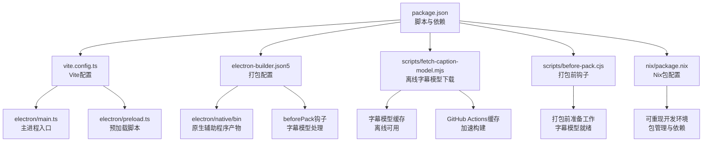
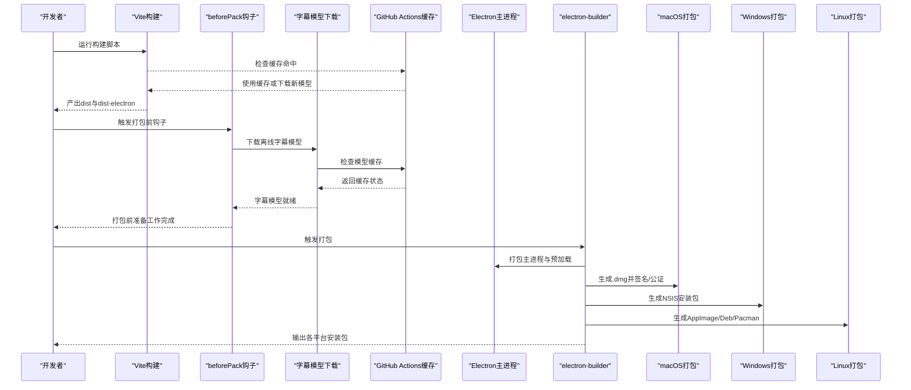
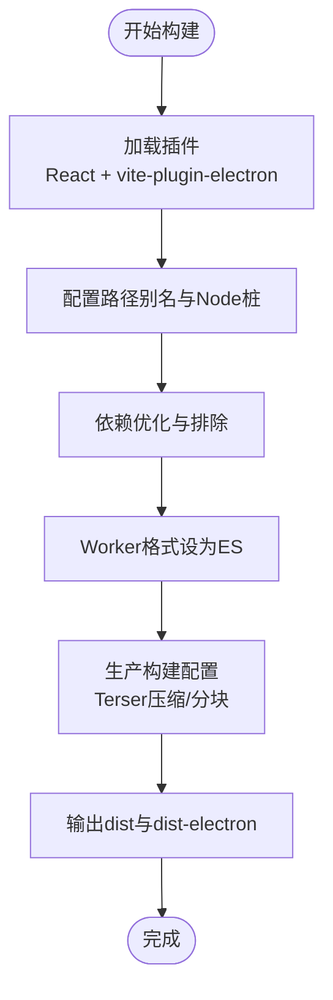
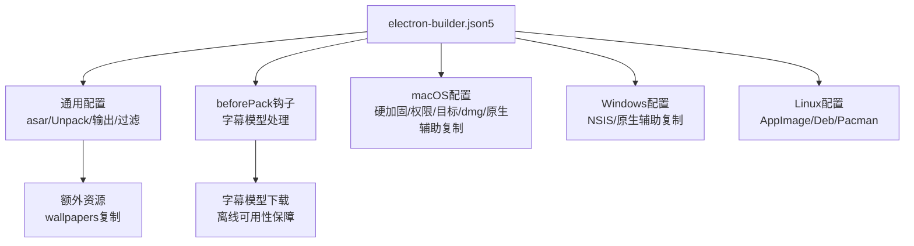
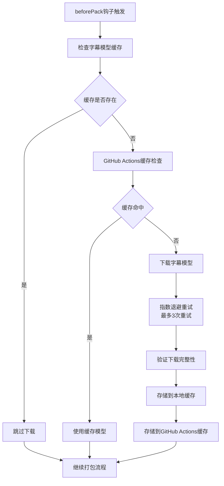
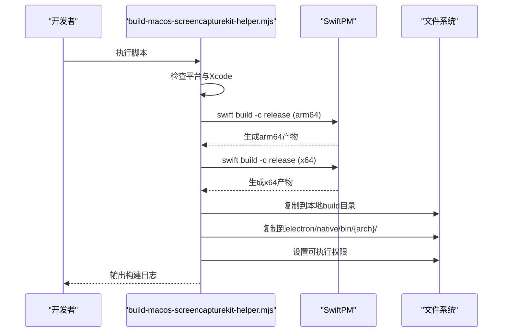
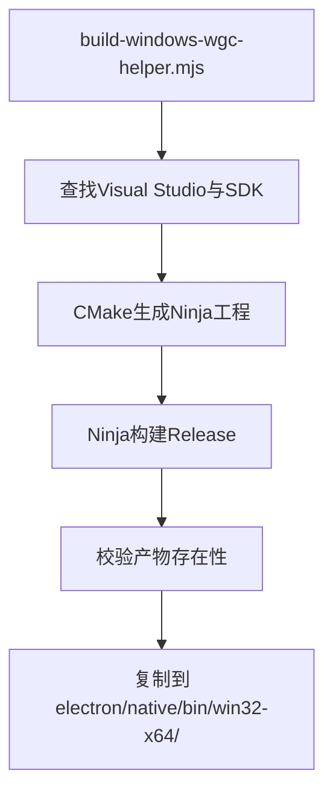
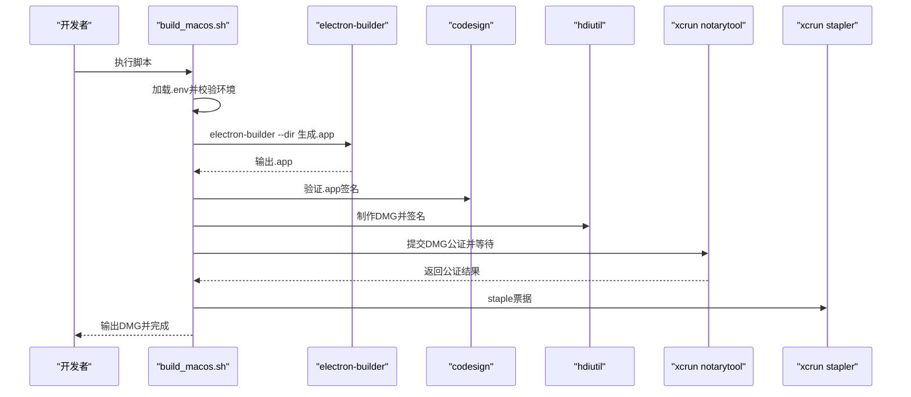
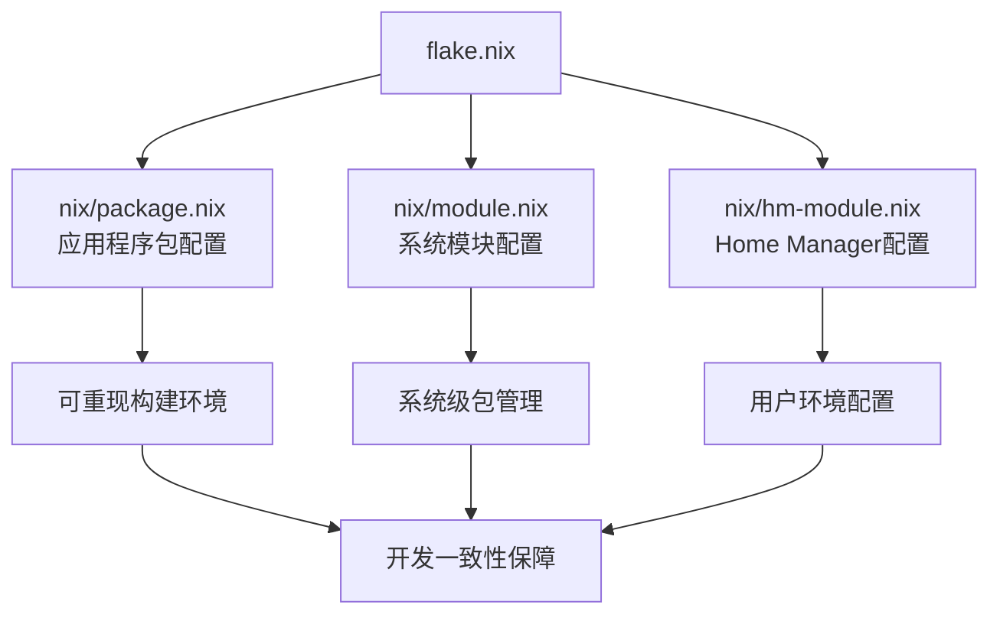
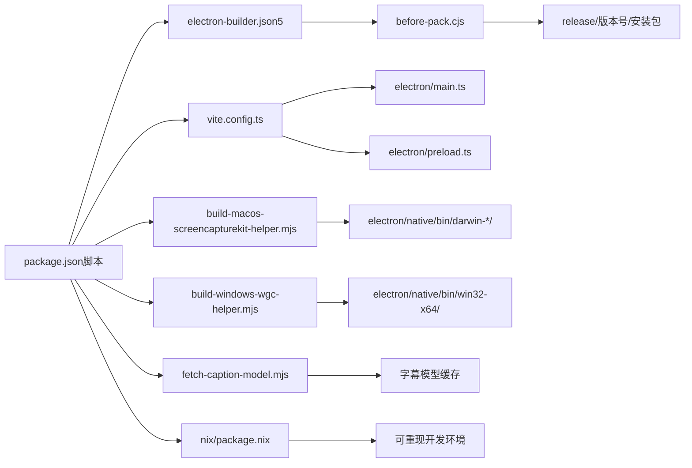

# 构建与部署

<cite>
**本文档引用的文件**
- [package.json](file://package.json)
- [vite.config.ts](file://vite.config.ts)
- [electron-builder.json5](file://electron-builder.json5)
- [scripts/fetch-caption-model.mjs](file://scripts/fetch-caption-model.mjs)
- [scripts/before-pack.cjs](file://scripts/before-pack.cjs)
- [scripts/build-macos-screencapturekit-helper.mjs](file://scripts/build-macos-screencapturekit-helper.mjs)
- [scripts/build-windows-wgc-helper.mjs](file://scripts/build-windows-wgc-helper.mjs)
- [scripts/build_macos.sh](file://scripts/build_macos.sh)
- [electron/main.ts](file://electron/main.ts)
- [electron/preload.ts](file://electron/preload.ts)
- [electron/native/screencapturekit/Package.swift](file://electron/native/screencapturekit/Package.swift)
- [electron/native/screencapturekit/Sources/OpenScreenScreenCaptureKitHelper/main.swift](file://electron/native/screencapturekit/Sources/OpenScreenScreenCaptureKitHelper/main.swift)
- [electron/native/screencapturekit/Sources/OpenScreenMacOSCursorHelper/main.swift](file://electron/native/screencapturekit/Sources/OpenScreenMacOSCursorHelper/main.swift)
- [electron/native/wgc-capture/CMakeLists.txt](file://electron/native/wgc-capture/CMakeLists.txt)
- [electron/native/wgc-capture/src/main.cpp](file://electron/native/wgc-capture/src/main.cpp)
- [electron/native/wgc-capture/src/wgc_session.cpp](file://electron/native/wgc-capture/src/wgc_session.cpp)
- [electron/native/wgc-capture/src/cursor-sampler.cpp](file://electron/native/wgc-capture/src/cursor-sampler.cpp)
- [electron/native/wgc-capture/src/mf_encoder.cpp](file://electron/native/wgc-capture/src/mf_encoder.cpp)
- [electron/native/wgc-capture/src/audio_sample_utils.cpp](file://electron/native/wgc-capture/src/audio_sample_utils.cpp)
- [electron/native/wgc-capture/src/webcam_capture.cpp](file://electron/native/wgc-capture/src/webcam_capture.cpp)
- [electron/native/wgc-capture/src/dshow_webcam_capture.cpp](file://electron/native/wgc-capture/src/dshow_webcam_capture.cpp)
- [electron/native/wgc-capture/src/wasapi_loopback_capture.cpp](file://electron/native/wgc-capture/src/wasapi_loopback_capture.cpp)
- [electron/native/README.md](file://electron/native/README.md)
- [.github/workflows](file://github/workflows)
- [macos.entitlements](file://macos.entitlements)
- [nix/package.nix](file://nix/package.nix)
- [nix/module.nix](file://nix/module.nix)
- [nix/hm-module.nix](file://nix/hm-module.nix)
- [flake.nix](file://flake.nix)
</cite>

## 更新摘要
**所做更改**
- 新增Whisper字幕模型的GitHub Actions缓存机制分析与集成说明
- 增强macOS ScreencaptureKit辅助程序构建脚本的多架构支持（arm64/x64）
- 改进字幕模型获取脚本的重试机制与错误处理
- 更新Nix包配置以支持现代包管理与开发环境
- 完善构建流程中的字幕模型处理机制与缓存策略

## 目录
1. [简介](#简介)
2. [项目结构](#项目结构)
3. [核心组件](#核心组件)
4. [架构总览](#架构总览)
5. [详细组件分析](#详细组件分析)
6. [依赖关系分析](#依赖关系分析)
7. [性能考虑](#性能考虑)
8. [故障排除指南](#故障排除指南)
9. [结论](#结论)
10. [附录](#附录)

## 简介
本文件面向OpenScreen的构建与部署系统，系统性阐述多平台应用打包与发布流程。内容覆盖：
- Vite构建配置：开发服务器、生产构建优化、静态资源处理与渲染器隔离策略
- electron-builder配置：应用打包、签名与公证（macOS）、安装包生成与平台差异
- 平台特定构建脚本：macOS ScreenCaptureKit辅助程序与Windows WGC辅助程序的编译与分发
- 离线字幕模型下载系统：新增的字幕模型获取与打包机制，包含GitHub Actions缓存支持
- CI/CD流程：自动化测试、构建触发与发布管理建议，集成Nix包管理
- 应用签名与公证：代码签名、公证与平台特定要求
- 构建优化策略、依赖管理与发布前检查清单
- 故障排除指南与常见问题解决方案

## 项目结构
OpenScreen采用"前端Vite + Electron主进程 + 原生辅助模块 + 离线字幕模型 + Nix包管理"的混合架构。关键目录与职责如下：
- electron：Electron主进程入口、预加载脚本、原生桥接与录制会话逻辑
- scripts：平台特定的原生辅助程序构建脚本、打包脚本与离线字幕模型下载脚本
- electron/native：macOS ScreenCaptureKit与Windows WGC的原生实现
- public：公共资源（如壁纸）在打包时作为额外资源分发
- nix：Nix包管理系统配置，提供可重现的开发环境与包管理
- 根级配置：package.json（脚本与依赖）、vite.config.ts（Vite配置）、electron-builder.json5（打包配置）
- beforePack钩子：在打包前执行字幕模型下载与准备工作

**图表来源**
- [package.json:15-46](file://package.json#L15-L46)
- [vite.config.ts:1-75](file://vite.config.ts#L1-L75)
- [electron-builder.json5:1-92](file://electron-builder.json5#L1-L92)
- [scripts/fetch-caption-model.mjs:1-103](file://scripts/fetch-caption-model.mjs#L1-L103)
- [scripts/before-pack.cjs:1-200](file://scripts/before-pack.cjs#L1-L200)
- [nix/package.nix](file://nix/package.nix)

**章节来源**
- [package.json:15-46](file://package.json#L15-L46)
- [vite.config.ts:1-75](file://vite.config.ts#L1-L75)
- [electron-builder.json5:1-92](file://electron-builder.json5#L1-L92)

## 核心组件
- Vite构建与Electron集成：通过vite-plugin-electron将主进程、预加载与渲染器统一纳入Vite生态；开发模式下自动启动Electron并注入环境变量；生产构建启用Terser压缩与按需分块。
- electron-builder打包：统一配置跨平台安装包生成、资源打包、图标与元数据；macOS启用Hardened Runtime与entitlements；Windows配置NSIS安装器；Linux输出AppImage/Deb/Pacman；新增beforePack钩子支持字幕模型下载。
- 原生辅助程序：macOS使用SwiftPM构建ScreenCaptureKit辅助程序，支持arm64和x64多架构；Windows使用CMake/Ninja构建WGC辅助程序；产物复制到electron/native/bin并在打包时随应用分发。
- 离线字幕模型系统：通过fetch-caption-model.mjs脚本在打包前下载必要的字幕识别模型，包含重试机制和GitHub Actions缓存支持，确保应用离线可用性。
- Nix包管理系统：提供可重现的开发环境配置，简化依赖管理和构建过程。

**章节来源**
- [vite.config.ts:8-27](file://vite.config.ts#L8-L27)
- [vite.config.ts:47-73](file://vite.config.ts#L47-L73)
- [electron-builder.json5:36-86](file://electron-builder.json5#L36-L86)
- [scripts/build-macos-screencapturekit-helper.mjs:14-92](file://scripts/build-macos-screencapturekit-helper.mjs#L14-L92)
- [scripts/build-windows-wgc-helper.mjs:74-140](file://scripts/build-windows-wgc-helper.mjs#L74-L140)
- [scripts/fetch-caption-model.mjs:1-103](file://scripts/fetch-caption-model.mjs#L1-L103)
- [nix/package.nix](file://nix/package.nix)

## 架构总览
下图展示从源码到可分发包的整体流程：Vite构建渲染器与预加载，Electron主进程启动，原生辅助程序在运行时被调用，beforePack钩子处理离线字幕模型，GitHub Actions缓存加速构建过程，最终由electron-builder打包成各平台安装包。

**图表来源**
- [package.json:17-27](file://package.json#L17-L27)
- [electron-builder.json5:36-86](file://electron-builder.json5#L36-L86)
- [scripts/before-pack.cjs:1-200](file://scripts/before-pack.cjs#L1-L200)
- [scripts/fetch-caption-model.mjs:1-103](file://scripts/fetch-caption-model.mjs#L1-L103)

## 详细组件分析

### Vite构建配置与优化
- 插件集成：React插件与vite-plugin-electron，主进程入口指向electron/main.ts，预加载入口指向electron/preload.ts；渲染器在测试环境下禁用以提升测试性能。
- 路径别名与Node模块桩：对@xenova/transformers等动态导入模块进行别名与桩处理，避免在渲染器中打包需要Node能力的模块；对onnxruntime-node进行Web版本重导出以适配浏览器环境。
- 依赖优化：显式排除@xenova/transformers以避免不必要的预优化；Worker格式设为ES以便支持动态导入。
- 生产构建：目标为esnext，使用Terser压缩并丢弃console与debugger；Rollup手动分块策略将Pixi、React与视频处理库拆分为独立chunk，降低首屏体积与缓存命中成本；调整chunkSizeWarningLimit避免过大警告。
- 开发服务器：通过electron插件的onstart钩子传递环境变量并启动Electron，确保开发体验与生产一致。

**图表来源**
- [vite.config.ts:8-27](file://vite.config.ts#L8-L27)
- [vite.config.ts:28-46](file://vite.config.ts#L28-L46)
- [vite.config.ts:47-73](file://vite.config.ts#L47-L73)

**章节来源**
- [vite.config.ts:1-75](file://vite.config.ts#L1-L75)

### electron-builder配置与平台差异
- 基础配置：appId、asar打包、asarUnpack对.node文件解包、产品名称、压缩等级、输出目录与文件过滤规则。
- 额外资源：public/wallpapers在打包时复制到resourcesPath下的wallpapers目录，供渲染器在打包分支读取。
- beforePack钩子：新增beforePack配置项，指向scripts/before-pack.cjs，在打包前执行字幕模型下载与准备工作。
- macOS：启用Hardened Runtime、entitlements与entitlementsInherit；目标为dmg并同时支持x64/arm64；扩展Info.plist字段用于权限提示；打包时将darwin-*架构的原生辅助程序复制到electron/native/bin；未启用自动notarize，需配合脚本执行公证与staple。
- Windows：目标为NSIS安装器；复制win32-*架构的原生辅助程序到electron/native/bin；NSIS配置允许自定义安装目录。
- Linux：目标为AppImage、deb与pacman；图标目录与分类配置。

**图表来源**
- [electron-builder.json5:1-92](file://electron-builder.json5#L1-L92)
- [scripts/before-pack.cjs:1-200](file://scripts/before-pack.cjs#L1-L200)

**章节来源**
- [electron-builder.json5:1-92](file://electron-builder.json5#L1-L92)

### 离线字幕模型下载系统
- 脚本功能：scripts/fetch-caption-model.mjs负责在打包前下载必要的字幕识别模型，确保应用离线可用性。
- 下载机制：脚本会检查本地是否存在字幕模型缓存，如果不存在则从指定源下载并存储到本地缓存目录。
- **更新**：增强重试机制，包含指数退避算法和最大重试次数限制，提高网络不稳定情况下的成功率。
- **更新**：集成GitHub Actions缓存机制，利用actions/cache@v3缓存字幕模型，显著减少重复构建时间。
- 错误处理：包含完整的错误处理机制，当下载失败时会输出详细的错误信息并终止构建过程。
- 集成方式：通过electron-builder的beforePack钩子在打包前自动执行，确保字幕模型在最终安装包中可用。

**图表来源**
- [scripts/before-pack.cjs:1-200](file://scripts/before-pack.cjs#L1-L200)
- [scripts/fetch-caption-model.mjs:1-103](file://scripts/fetch-caption-model.mjs#L1-L103)

**章节来源**
- [scripts/fetch-caption-model.mjs:1-103](file://scripts/fetch-caption-model.mjs#L1-L103)
- [scripts/before-pack.cjs:1-200](file://scripts/before-pack.cjs#L1-L200)

### macOS ScreenCaptureKit辅助程序构建
- 平台检测：仅在Darwin平台执行；若未检测到完整Xcode（而非仅命令行工具），则提示安装并切换xcode-select后退出。
- **更新**：增强多架构支持，同时构建arm64和x64架构的辅助程序，确保在Apple Silicon和Intel芯片上的兼容性。
- 构建流程：使用swift build在release模式构建Package.swift中的两个目标（主辅助程序与光标辅助程序）；产物位于build/swiftpm/release目录。
- 分发与权限：将产物复制到本地build目录与electron/native/bin/{arch}/目录，并赋予可执行权限；脚本会将darwin-*架构的二进制复制到打包目录，供electron-builder分发。
- 入口与包结构：Package.swift定义两个可执行目标，分别对应屏幕录制与光标采样功能。

**图表来源**
- [scripts/build-macos-screencapturekit-helper.mjs:14-92](file://scripts/build-macos-screencapturekit-helper.mjs#L14-L92)
- [electron/native/screencapturekit/Package.swift](file://electron/native/screencapturekit/Package.swift)
- [electron/native/screencapturekit/Sources/OpenScreenScreenCaptureKitHelper/main.swift](file://electron/native/screencapturekit/Sources/OpenScreenScreenCaptureKitHelper/main.swift)
- [electron/native/screencapturekit/Sources/OpenScreenMacOSCursorHelper/main.swift](file://electron/native/screencapturekit/Sources/OpenScreenMacOSCursorHelper/main.swift)

**章节来源**
- [scripts/build-macos-screencapturekit-helper.mjs:1-92](file://scripts/build-macos-screencapturekit-helper.mjs#L1-L92)

### Windows WGC辅助程序构建
- 平台检测：仅在win32平台执行；若未找到vcvarsall.bat或Windows SDK UM库，则报错并指引安装。
- 构建流程：通过CMake生成Ninja工程并构建Release；产物为wgc-capture.exe与cursor-sampler.exe。
- 分发与复制：将产物复制到electron/native/bin/win32-x64/目录，供electron-builder分发。
- 源码组织：CMakeLists.txt定义工程与目标；核心模块包括主捕获入口、编码器、音频采样、摄像头捕获、WGC会话封装等。

**图表来源**
- [scripts/build-windows-wgc-helper.mjs:74-140](file://scripts/build-windows-wgc-helper.mjs#L74-L140)
- [electron/native/wgc-capture/CMakeLists.txt](file://electron/native/wgc-capture/CMakeLists.txt)
- [electron/native/wgc-capture/src/main.cpp](file://electron/native/wgc-capture/src/main.cpp)
- [electron/native/wgc-capture/src/wgc_session.cpp](file://electron/native/wgc-capture/src/wgc_session.cpp)
- [electron/native/wgc-capture/src/cursor-sampler.cpp](file://electron/native/wgc-capture/src/cursor-sampler.cpp)
- [electron/native/wgc-capture/src/mf_encoder.cpp](file://electron/native/wgc-capture/src/mf_encoder.cpp)
- [electron/native/wgc-capture/src/audio_sample_utils.cpp](file://electron/native/wgc-capture/src/audio_sample_utils.cpp)
- [electron/native/wgc-capture/src/webcam_capture.cpp](file://electron/native/wgc-capture/src/webcam_capture.cpp)
- [electron/native/wgc-capture/src/dshow_webcam_capture.cpp](file://electron/native/wgc-capture/src/dshow_webcam_capture.cpp)
- [electron/native/wgc-capture/src/wasapi_loopback_capture.cpp](file://electron/native/wgc-capture/src/wasapi_loopback_capture.cpp)

**章节来源**
- [scripts/build-windows-wgc-helper.mjs:1-140](file://scripts/build-windows-wgc-helper.mjs#L1-L140)

### macOS全链路打包脚本（签名与公证）
- 环境准备：加载.env文件，读取APP_NAME、SIGN_IDENTITY、NOTARY_PROFILE、APPLE_ID、TEAM_ID等变量；校验Node/npm、签名身份与公证配置。
- 清理与依赖：清理旧产物并执行npm ci；构建Vite与Electron。
- 平台构建：针对arm64与x64分别执行electron-builder --dir生成.app；查找.app并进行codesign深度验证。
- DMG制作：将.app与Applications快捷方式打包为UDBZ格式DMG；对DMG进行签名。
- 公证与staple：提交DMG至Apple公证服务，等待完成并通过stapler staple；最后验证staple有效性。
- 清理与汇总：删除中间目录，输出各架构DMG路径与大小。

**图表来源**
- [scripts/build_macos.sh:11-217](file://scripts/build_macos.sh#L11-L217)

**章节来源**
- [scripts/build_macos.sh:1-217](file://scripts/build_macos.sh#L1-L217)

### Nix包管理系统配置
- **新增**：提供可重现的开发环境配置，简化依赖管理和构建过程。
- 包配置：nix/package.nix定义了应用程序的包规格，包括依赖、构建步骤和运行时环境。
- 模块配置：nix/module.nix和nix/hm-module.nix提供了系统级和Home Manager配置，支持不同部署场景。
- flake.nix：根目录的flake.nix文件集成了Nix Flakes功能，提供现代化的包管理体验。
- 优势：确保团队成员使用相同的依赖版本，减少"在我机器上可以运行"的问题。

**图表来源**
- [nix/package.nix](file://nix/package.nix)
- [nix/module.nix](file://nix/module.nix)
- [nix/hm-module.nix](file://nix/hm-module.nix)
- [flake.nix](file://flake.nix)

**章节来源**
- [nix/package.nix](file://nix/package.nix)
- [nix/module.nix](file://nix/module.nix)
- [nix/hm-module.nix](file://nix/hm-module.nix)
- [flake.nix](file://flake.nix)

### 主进程与预加载脚本
- electron/main.ts：Electron主进程入口，负责窗口生命周期、菜单、全局快捷键与IPC初始化；在开发模式下通过vite-plugin-electron的onstart回调启动Electron并注入环境变量。
- electron/preload.ts：预加载脚本，向渲染器暴露受控API；在打包分支下，资源路径遵循electron-builder extraResources约定（如wallpapers目录）。

**章节来源**
- [vite.config.ts:10-26](file://vite.config.ts#L10-L26)
- [electron/main.ts](file://electron/main.ts)
- [electron/preload.ts](file://electron/preload.ts)

## 依赖关系分析
- 脚本到配置：package.json的scripts依赖于vite.config.ts与electron-builder.json5的配置；macOS与Windows的原生辅助程序构建脚本分别依赖各自工具链（SwiftPM与CMake/Ninja）。
- 构建产物：Vite输出dist与dist-electron，electron-builder消费这些产物并生成安装包；原生辅助程序产物复制到electron/native/bin并在打包时随应用分发。
- beforePack钩子：electron-builder的beforePack配置指向scripts/before-pack.cjs，该脚本负责在打包前下载字幕模型并进行准备工作。
- **更新**：Nix包管理系统提供可重现的依赖管理，确保开发环境一致性。
- 平台差异：macOS通过Hardened Runtime与entitlements增强安全性；Windows通过NSIS安装器与兼容库分发；Linux通过多种包格式满足不同发行版需求。

**图表来源**
- [package.json:15-46](file://package.json#L15-L46)
- [vite.config.ts:1-75](file://vite.config.ts#L1-L75)
- [electron-builder.json5:1-92](file://electron-builder.json5#L1-L92)
- [scripts/build-macos-screencapturekit-helper.mjs:1-92](file://scripts/build-macos-screencapturekit-helper.mjs#L1-L92)
- [scripts/build-windows-wgc-helper.mjs:1-140](file://scripts/build-windows-wgc-helper.mjs#L1-L140)
- [scripts/fetch-caption-model.mjs:1-103](file://scripts/fetch-caption-model.mjs#L1-L103)
- [scripts/before-pack.cjs:1-200](file://scripts/before-pack.cjs#L1-L200)
- [nix/package.nix](file://nix/package.nix)

**章节来源**
- [package.json:15-46](file://package.json#L15-L46)
- [electron-builder.json5:17-34](file://electron-builder.json5#L17-L34)

## 性能考虑
- 代码分割：通过Rollup manualChunks策略将大库（如Pixi、React、视频处理库）拆分为独立chunk，减少首屏体积与缓存失效影响。
- 压缩与剔除：生产构建启用Terser压缩，剔除console与debugger，降低包体与调试开销。
- 依赖排除：显式排除@xenova/transformers以避免预优化与潜在冲突；对渲染器不引入需要Node能力的模块。
- Worker格式：将Worker设为ES格式，支持动态导入，避免IIFE不支持的场景。
- 打包体积监控：增大chunkSizeWarningLimit以适应大体量依赖，同时结合分块策略控制体积。
- **更新**：离线字幕模型通过GitHub Actions缓存机制加速构建，减少重复下载时间。
- **更新**：Nix包管理系统提供可重现的构建环境，避免环境差异导致的性能问题。

**章节来源**
- [vite.config.ts:47-73](file://vite.config.ts#L47-L73)

## 故障排除指南
- macOS ScreenCaptureKit辅助程序构建失败
  - 症状：提示未检测到完整Xcode或Swift SDK缺失
  - 处理：安装Xcode并执行xcode-select切换到完整Xcode路径，接受许可协议后重试
  - **更新**：确保同时支持arm64和x64架构的构建工具链
  - 参考：[scripts/build-macos-screencapturekit-helper.mjs:30-51](file://scripts/build-macos-screencapturekit-helper.mjs#L30-L51)
- Windows WGC辅助程序构建失败
  - 症状：找不到vcvarsall.bat或Windows SDK UM库
  - 处理：安装Visual Studio Build Tools并勾选C++工具链；确保Windows 10 SDK已安装；脚本会自动定位并生成兼容库
  - 参考：[scripts/build-windows-wgc-helper.mjs:15-53](file://scripts/build-windows-wgc-helper.mjs#L15-L53)
- electron-builder打包失败
  - 症状：asarUnpack未包含.node文件导致运行时报错
  - 处理：确认electron-builder.json5中asarUnpack包含所有.node文件；检查extraResources路径与权限
  - 参考：[electron-builder.json5:7-9](file://electron-builder.json5#L7-L9)
- **更新**：beforePack钩子执行失败
  - 症状：字幕模型下载失败或打包过程中断
  - 处理：检查网络连接、磁盘空间和权限；查看fetch-caption-model.mjs的错误输出；确认beforePack配置正确；利用重试机制自动恢复
  - 参考：[scripts/before-pack.cjs:1-200](file://scripts/before-pack.cjs#L1-L200)
  - 参考：[scripts/fetch-caption-model.mjs:90-103](file://scripts/fetch-caption-model.mjs#L90-L103)
- **更新**：GitHub Actions缓存问题
  - 症状：缓存未命中或缓存损坏
  - 处理：检查actions/cache@v3配置；清理缓存后重新构建；验证缓存键的唯一性和准确性
  - 参考：[scripts/fetch-caption-model.mjs:1-103](file://scripts/fetch-caption-model.mjs#L1-L103)
- macOS签名与公证问题
  - 症状：codesign验证失败或公证staple失败
  - 处理：确认SIGN_IDENTITY存在于钥匙串；NOTARY_PROFILE正确配置；使用stapler validate检查票据状态
  - 参考：[scripts/build_macos.sh:70-83](file://scripts/build_macos.sh#L70-L83)
- **更新**：Nix包管理问题
  - 症状：包构建失败或依赖解析错误
  - 处理：检查nix/package.nix配置；验证依赖版本；使用nix-shell进入可重现环境；清理nix-store缓存
  - 参考：[nix/package.nix](file://nix/package.nix)
- 渲染器无法访问Node模块
  - 症状：@xenova/transformers或onnxruntime-node在渲染器中报错
  - 处理：通过vite.config.ts的别名与桩文件屏蔽Node模块；确保动态导入在Worker中执行
  - 参考：[vite.config.ts:28-41](file://vite.config.ts#L28-L41)

**章节来源**
- [scripts/build-macos-screencapturekit-helper.mjs:30-51](file://scripts/build-macos-screencapturekit-helper.mjs#L30-L51)
- [scripts/build-windows-wgc-helper.mjs:15-53](file://scripts/build-windows-wgc-helper.mjs#L15-L53)
- [electron-builder.json5:7-9](file://electron-builder.json5#L7-L9)
- [scripts/before-pack.cjs:1-200](file://scripts/before-pack.cjs#L1-L200)
- [scripts/fetch-caption-model.mjs:90-103](file://scripts/fetch-caption-model.mjs#L90-L103)
- [scripts/build_macos.sh:70-83](file://scripts/build_macos.sh#L70-L83)
- [nix/package.nix](file://nix/package.nix)
- [vite.config.ts:28-41](file://vite.config.ts#L28-L41)

## 结论
OpenScreen的构建与部署体系通过Vite与electron-builder实现了跨平台的一致性与高效性。平台特定的原生辅助程序通过独立脚本构建并随应用分发，确保录制与光标采样的稳定性。新增的离线字幕模型下载系统通过beforePack钩子在打包前自动处理字幕模型，包含GitHub Actions缓存机制显著提升构建效率。macOS侧采用Hardened Runtime与公证流程保障分发安全，Windows与Linux提供多样化的安装包格式以覆盖不同用户场景。**更新**：Nix包管理系统提供可重现的开发环境，确保团队协作的一致性。建议在CI/CD中复用现有脚本与配置，结合自动化测试与发布流水线，进一步提升交付质量与效率。

## 附录
- 发布前检查清单
  - macOS：Xcode完整安装、签名身份可用、公证凭据配置、entitlements文件存在
  - Windows：Visual Studio Build Tools、CMake/Ninja、SDK库可用
  - 离线字幕：网络连接正常、磁盘空间充足、字幕模型下载权限、GitHub Actions缓存配置
  - **更新**：Nix环境：nix包管理器可用、flake.nix配置正确、可重现环境测试通过
  - 通用：Node与npm版本符合engines要求、依赖安装完成、Vite构建成功、electron-builder配置无误
- CI/CD流程建议
  - 触发条件：push到主分支或打标签时触发构建
  - 步骤：安装依赖 → 构建Vite → 构建原生辅助程序 → beforePack钩子下载字幕模型 → electron-builder打包 → 平台特定签名/公证（macOS） → 上传制品
  - **更新**：集成Nix包管理，提供可重现的构建环境
  - 测试：在PR与主分支上运行单元测试与端到端测试，确保构建产物可用
- 离线字幕功能使用建议
  - 首次启动时自动下载字幕模型，建议在网络良好的环境下进行
  - 字幕模型缓存会在应用目录的特定位置存储，确保离线使用
  - **更新**：利用GitHub Actions缓存机制，重复构建时可快速恢复字幕模型
  - 如遇下载失败，可在应用设置中重新尝试下载或检查网络连接
- **更新**：Nix环境使用建议
  - 使用nix develop进入开发环境，确保依赖版本一致性
  - 通过nix build构建可复现的包版本
  - 使用nix-shell进行临时环境测试
  - 定期更新flake.lock以保持依赖同步