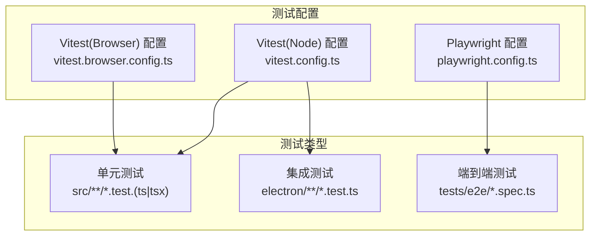
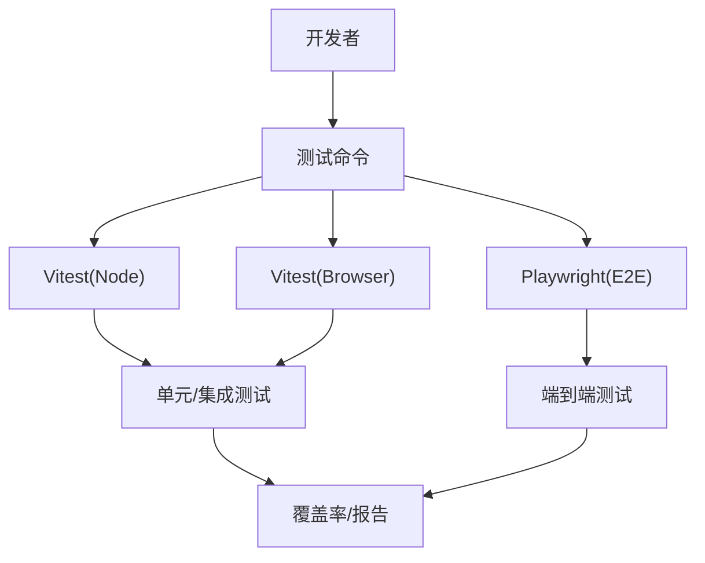
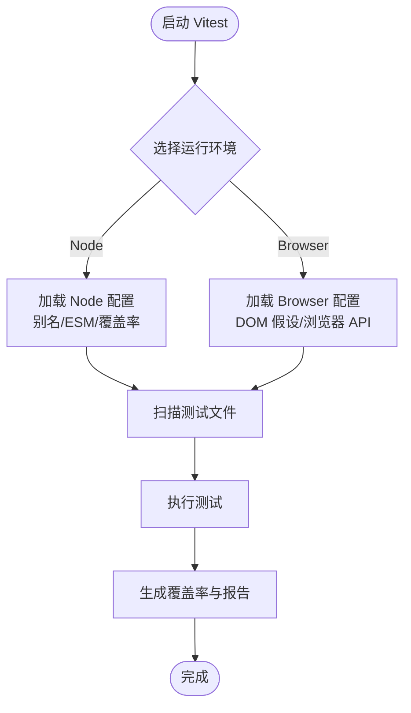
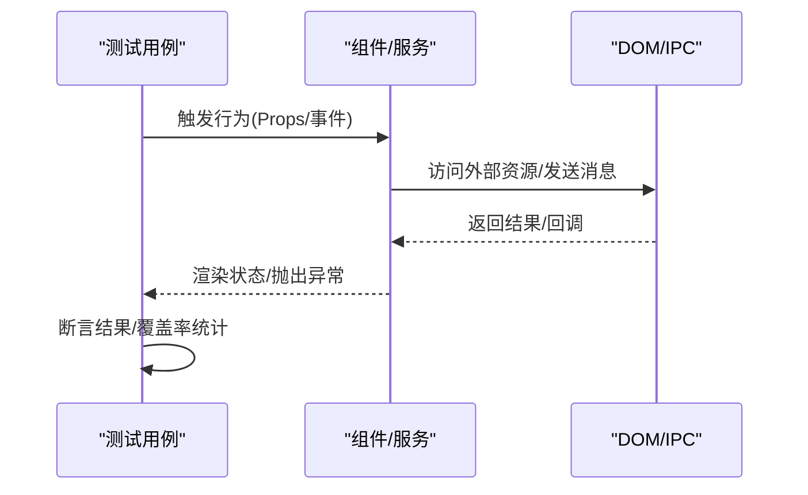
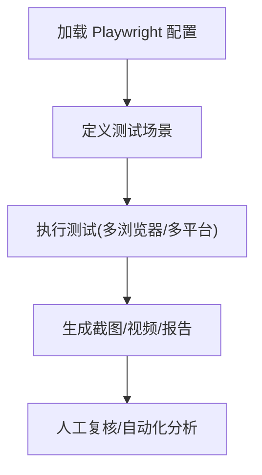
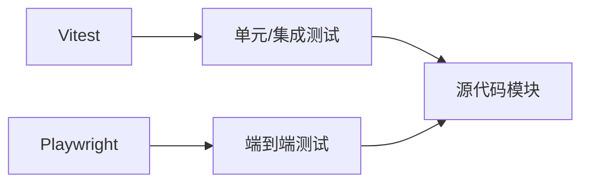

# 测试策略

<cite>
**本文引用的文件**
- [vitest.config.ts](file://vitest.config.ts)
- [vitest.browser.config.ts](file://vitest.browser.config.ts)
- [playwright.config.ts](file://playwright.config.ts)
- [package.json](file://package.json)
- [src/components/launch/SourceSelector.test.tsx](file://src/components/launch/SourceSelector.test.tsx)
- [src/components/video-editor/backgroundImageUpload.test.ts](file://src/components/video-editor/backgroundImageUpload.test.ts)
- [src/components/video-editor/customPlaybackSpeed.test.ts](file://src/components/video-editor/customPlaybackSpeed.test.ts)
- [src/components/video-editor/editorDefaults.test.ts](file://src/components/video-editor/editorDefaults.test.ts)
- [src/components/video-editor/projectPersistence.test.ts](file://src/components/video-editor/projectPersistence.test.ts)
- [src/hooks/recorderHandle.test.ts](file://src/hooks/recorderHandle.test.ts)
- [src/hooks/useCameraDevices.test.ts](file://src/hooks/useCameraDevices.test.ts)
- [src/lib/captioning/annotationTextAnimation.test.ts](file://src/lib/captioning/annotationTextAnimation.test.ts)
- [src/lib/blurEffects.test.ts](file://src/lib/blurEffects.test.ts)
- [src/lib/compositeLayout.test.ts](file://src/lib/compositeLayout.test.ts)
- [src/lib/cursorTelemetryBuffer.test.ts](file://src/lib/cursorTelemetryBuffer.test.ts)
- [src/lib/nativeMacRecording.test.ts](file://src/lib/nativeMacRecording.test.ts)
- [src/lib/userPreferences.test.ts](file://src/lib/userPreferences.test.ts)
- [src/lib/wallpaper.test.ts](file://src/lib/wallpaper.test.ts)
- [src/utils/aspectRatioUtils.test.ts](file://src/utils/aspectRatioUtils.test.ts)
- [electron/ipc/recordingStream.test.ts](file://electron/ipc/recordingStream.test.ts)
- [tests/e2e/gif-export.spec.ts](file://tests/e2e/gif-export.spec.ts)
- [tests/e2e/windows-native-checklist.spec.ts](file://tests/e2e/windows-native-checklist.spec.ts)
- [src/i18n/__tests__/tutorialHelpTranslations.test.ts](file://src/i18n/__tests__/tutorialHelpTranslations.test.ts)
- [src/lib/__tests__/index.test.ts](file://src/lib/__tests__/index.test.ts)
- [README.md](file://README.md)
- [CONTRIBUTING.md](file://CONTRIBUTING.md)
- [docs/testing/macos-native-cursor.md](file://docs/testing/macos-native-cursor.md)
- [docs/testing/windows-native-cursor.md](file://docs/testing/windows-native-cursor.md)
- [docs/tests/writing-tests.md](file://docs/tests/writing-tests.md)
</cite>

## 目录
1. [引言](#引言)
2. [项目结构](#项目结构)
3. [核心组件](#核心组件)
4. [架构总览](#架构总览)
5. [详细组件分析](#详细组件分析)
6. [依赖分析](#依赖分析)
7. [性能考虑](#性能考虑)
8. [故障排查指南](#故障排查指南)
9. [结论](#结论)
10. [附录](#附录)

## 引言
本文件系统性阐述 OpenScreen 的测试策略与实施方法，覆盖单元测试、集成测试与端到端测试（E2E）。文档基于仓库中现有的 Vitest 与 Playwright 配置及测试文件进行归纳总结，重点说明：
- Vitest 测试框架的配置与使用：包括 Node 环境与浏览器环境的配置差异、覆盖率生成、测试环境变量与别名映射等。
- 单元测试编写指南：测试用例设计原则、模拟对象（Mock）使用、异步测试处理与断言策略。
- 集成测试实践：组件测试、服务测试与 API 测试的方法论与最佳实践。
- 端到端测试策略：Playwright 配置、测试场景设计与跨平台执行要点。
- 测试数据管理、测试环境隔离与持续集成（CI）配置建议。
- 覆盖率要求、性能测试与回归测试的实施建议。

## 项目结构
OpenScreen 的测试体系由以下部分组成：
- 单元测试与集成测试：基于 Vitest，分别在 Node 环境与浏览器环境中运行，覆盖业务逻辑、组件与工具函数。
- 端到端测试：基于 Playwright，提供跨平台自动化测试能力。
- 文档与指南：位于 docs/tests 与 docs/testing 目录，提供测试编写规范与平台专项测试说明。

**图表来源**
- [vitest.config.ts](file://vitest.config.ts)
- [vitest.browser.config.ts](file://vitest.browser.config.ts)
- [playwright.config.ts](file://playwright.config.ts)

**章节来源**
- [vitest.config.ts](file://vitest.config.ts)
- [vitest.browser.config.ts](file://vitest.browser.config.ts)
- [playwright.config.ts](file://playwright.config.ts)

## 核心组件
- Vitest 配置与运行环境
  - Node 环境：用于纯逻辑与 Electron IPC 层测试，支持 ES 模块解析、路径别名与覆盖率统计。
  - 浏览器环境：用于前端组件与交互逻辑测试，支持 DOM 假设与浏览器 API。
- Playwright 配置与跨平台执行
  - 提供浏览器实例生命周期管理、截图/视频录制、并行执行与报告输出。
- 测试文件组织
  - 单元测试以 .test.ts/.test.tsx 结尾，按功能模块分布于 src、electron、i18n 等目录。
  - E2E 测试集中于 tests/e2e，按功能域划分场景。

**章节来源**
- [vitest.config.ts](file://vitest.config.ts)
- [vitest.browser.config.ts](file://vitest.browser.config.ts)
- [playwright.config.ts](file://playwright.config.ts)

## 架构总览
下图展示了测试体系在项目中的角色与交互关系：

**图表来源**
- [vitest.config.ts](file://vitest.config.ts)
- [vitest.browser.config.ts](file://vitest.browser.config.ts)
- [playwright.config.ts](file://playwright.config.ts)

## 详细组件分析

### Vitest 配置与使用
- Node 环境配置要点
  - 路径别名与模块解析：通过配置项映射 @/* 到 src 目录，确保测试文件可正确导入源码。
  - ES 模块支持：启用 ES 模块解析，便于与现代构建链路一致。
  - 覆盖率统计：开启覆盖率收集，支持语句、分支、函数与行的阈值控制。
  - 测试文件匹配：默认扫描 src/**/*.{test,spec}.{ts,tsx} 与 electron/**/*.{test,spec}.ts。
- 浏览器环境配置要点
  - 启用浏览器运行时，支持 DOM 假设与常见浏览器 API。
  - 适用于组件交互、事件处理与 UI 行为的测试。
- 测试环境变量
  - 可通过环境变量控制测试行为（如禁用真实设备访问、切换日志级别等），并在 CI 中统一注入。

**图表来源**
- [vitest.config.ts](file://vitest.config.ts)
- [vitest.browser.config.ts](file://vitest.browser.config.ts)

**章节来源**
- [vitest.config.ts](file://vitest.config.ts)
- [vitest.browser.config.ts](file://vitest.browser.config.ts)

### 单元测试编写指南
- 测试用例设计
  - 使用 describe/test 组织用例，围绕被测函数或组件的行为边界进行分组。
  - 针对正常路径、异常路径与边界条件分别编写用例，确保高覆盖率。
- 模拟对象（Mock）
  - 对外部依赖（如网络请求、系统 API、全局对象）进行 Mock，避免副作用。
  - 使用 Vitest 提供的 mock 函数与模块替换能力，隔离被测代码。
- 异步测试处理
  - 使用 async/await 或 Promise 断言，确保异步操作完成后再断言结果。
  - 对定时器、微任务与宏任务进行控制，必要时使用 advanceTimers 或 setSystemTime。
- 断言与可读性
  - 使用明确的断言消息，便于定位失败原因。
  - 对复杂返回值使用结构化断言，避免脆弱断言。

示例参考文件（不展示具体代码，仅提供路径）：
- [src/components/launch/SourceSelector.test.tsx](file://src/components/launch/SourceSelector.test.tsx)
- [src/components/video-editor/backgroundImageUpload.test.ts](file://src/components/video-editor/backgroundImageUpload.test.ts)
- [src/components/video-editor/customPlaybackSpeed.test.ts](file://src/components/video-editor/customPlaybackSpeed.test.ts)
- [src/components/video-editor/editorDefaults.test.ts](file://src/components/video-editor/editorDefaults.test.ts)
- [src/components/video-editor/projectPersistence.test.ts](file://src/components/video-editor/projectPersistence.test.ts)
- [src/hooks/recorderHandle.test.ts](file://src/hooks/recorderHandle.test.ts)
- [src/hooks/useCameraDevices.test.ts](file://src/hooks/useCameraDevices.test.ts)
- [src/lib/captioning/annotationTextAnimation.test.ts](file://src/lib/captioning/annotationTextAnimation.test.ts)
- [src/lib/blurEffects.test.ts](file://src/lib/blurEffects.test.ts)
- [src/lib/compositeLayout.test.ts](file://src/lib/compositeLayout.test.ts)
- [src/lib/cursorTelemetryBuffer.test.ts](file://src/lib/cursorTelemetryBuffer.test.ts)
- [src/lib/nativeMacRecording.test.ts](file://src/lib/nativeMacRecording.test.ts)
- [src/lib/userPreferences.test.ts](file://src/lib/userPreferences.test.ts)
- [src/lib/wallpaper.test.ts](file://src/lib/wallpaper.test.ts)
- [src/utils/aspectRatioUtils.test.ts](file://src/utils/aspectRatioUtils.test.ts)
- [electron/ipc/recordingStream.test.ts](file://electron/ipc/recordingStream.test.ts)
- [src/i18n/__tests__/tutorialHelpTranslations.test.ts](file://src/i18n/__tests__/tutorialHelpTranslations.test.ts)

**章节来源**
- [src/components/launch/SourceSelector.test.tsx](file://src/components/launch/SourceSelector.test.tsx)
- [src/components/video-editor/backgroundImageUpload.test.ts](file://src/components/video-editor/backgroundImageUpload.test.ts)
- [src/components/video-editor/customPlaybackSpeed.test.ts](file://src/components/video-editor/customPlaybackSpeed.test.ts)
- [src/components/video-editor/editorDefaults.test.ts](file://src/components/video-editor/editorDefaults.test.ts)
- [src/components/video-editor/projectPersistence.test.ts](file://src/components/video-editor/projectPersistence.test.ts)
- [src/hooks/recorderHandle.test.ts](file://src/hooks/recorderHandle.test.ts)
- [src/hooks/useCameraDevices.test.ts](file://src/hooks/useCameraDevices.test.ts)
- [src/lib/captioning/annotationTextAnimation.test.ts](file://src/lib/captioning/annotationTextAnimation.test.ts)
- [src/lib/blurEffects.test.ts](file://src/lib/blurEffects.test.ts)
- [src/lib/compositeLayout.test.ts](file://src/lib/compositeLayout.test.ts)
- [src/lib/cursorTelemetryBuffer.test.ts](file://src/lib/cursorTelemetryBuffer.test.ts)
- [src/lib/nativeMacRecording.test.ts](file://src/lib/nativeMacRecording.test.ts)
- [src/lib/userPreferences.test.ts](file://src/lib/userPreferences.test.ts)
- [src/lib/wallpaper.test.ts](file://src/lib/wallpaper.test.ts)
- [src/utils/aspectRatioUtils.test.ts](file://src/utils/aspectRatioUtils.test.ts)
- [electron/ipc/recordingStream.test.ts](file://electron/ipc/recordingStream.test.ts)
- [src/i18n/__tests__/tutorialHelpTranslations.test.ts](file://src/i18n/__tests__/tutorialHelpTranslations.test.ts)

### 集成测试实践
- 组件测试
  - 在浏览器环境下对组件渲染、事件处理与状态变更进行验证。
  - 使用 React Testing Library 或类似库进行 DOM 查询与用户交互模拟。
- 服务测试
  - 针对 Electron IPC 服务与本地桥接服务进行集成验证，确保消息传递与数据一致性。
  - 示例参考：[electron/ipc/recordingStream.test.ts](file://electron/ipc/recordingStream.test.ts)
- API 测试
  - 对后端接口或本地服务暴露的 API 进行契约测试，验证输入输出与错误处理。
  - 建议结合 Mock 服务器或内存数据库，保证测试稳定性与可重复性。

**图表来源**
- [electron/ipc/recordingStream.test.ts](file://electron/ipc/recordingStream.test.ts)

**章节来源**
- [electron/ipc/recordingStream.test.ts](file://electron/ipc/recordingStream.test.ts)

### 端到端测试策略
- Playwright 配置
  - 浏览器实例管理、超时与重试策略、并行度与并发限制。
  - 截图与视频录制：自动捕获失败场景，辅助问题复现。
- 测试场景设计
  - 功能流程：从启动到导出的完整工作流，覆盖多平台差异。
  - 平台专项：macOS 与 Windows 原生录制与光标跟踪的专项检查清单。
- 跨平台执行
  - 在 CI 中分别运行 macOS 与 Windows Runner，针对平台特性调整测试策略与断言。

**图表来源**
- [playwright.config.ts](file://playwright.config.ts)
- [tests/e2e/gif-export.spec.ts](file://tests/e2e/gif-export.spec.ts)
- [tests/e2e/windows-native-checklist.spec.ts](file://tests/e2e/windows-native-checklist.spec.ts)

**章节来源**
- [playwright.config.ts](file://playwright.config.ts)
- [tests/e2e/gif-export.spec.ts](file://tests/e2e/gif-export.spec.ts)
- [tests/e2e/windows-native-checklist.spec.ts](file://tests/e2e/windows-native-checklist.spec.ts)
- [docs/testing/macos-native-cursor.md](file://docs/testing/macos-native-cursor.md)
- [docs/testing/windows-native-cursor.md](file://docs/testing/windows-native-cursor.md)

### 测试数据管理与环境隔离
- 测试数据
  - 使用轻量级占位数据或 Mock 数据，避免依赖真实资源。
  - 对需要真实数据的场景，采用只读快照或受控的临时数据源。
- 环境隔离
  - 通过环境变量区分开发、测试与 CI 环境，确保测试不污染生产数据。
  - 对外部系统（如摄像头、麦克风）进行权限模拟或禁用真实访问。
- 持续集成配置
  - 在 GitHub Actions 中分别配置 macOS 与 Windows Runner，按需启用 Playwright 浏览器缓存与依赖预装。
  - 将覆盖率与测试报告上传至 CI 平台，作为质量门禁的一部分。

**章节来源**
- [README.md](file://README.md)
- [CONTRIBUTING.md](file://CONTRIBUTING.md)

## 依赖分析
- 测试工具链
  - Vitest：提供快速的单元与集成测试能力，支持 Node 与 Browser 两种运行时。
  - Playwright：提供跨浏览器与跨平台的 E2E 测试能力。
- 项目依赖与测试耦合
  - 组件与工具函数的测试应尽量解耦外部依赖，通过 Mock 与工厂函数降低耦合度。
  - Electron IPC 测试依赖于进程间通信的稳定性和消息契约的一致性。

**图表来源**
- [vitest.config.ts](file://vitest.config.ts)
- [playwright.config.ts](file://playwright.config.ts)

**章节来源**
- [vitest.config.ts](file://vitest.config.ts)
- [playwright.config.ts](file://playwright.config.ts)

## 性能考虑
- 测试执行速度
  - 合理拆分测试套件，避免单个文件过大；使用并行执行与缓存机制提升效率。
- 覆盖率与性能权衡
  - 在保证关键路径覆盖率的前提下，优先关注热点模块与高频调用路径。
- E2E 性能
  - 控制浏览器实例数量与并发度，合理设置超时与重试策略，减少不稳定因素导致的重跑成本。

## 故障排查指南
- 常见问题
  - 路径别名解析失败：确认 Vitest 配置中的 alias 与 tsconfig 保持一致。
  - 浏览器 API 未定义：在浏览器配置中启用 DOM 假设或引入必要的 polyfill。
  - 异步测试不稳定：使用可控的时序控制（如 fake timers）替代真实等待。
- 定位手段
  - 查看测试报告与覆盖率统计，定位低覆盖区域。
  - 对失败用例启用详细日志与断点调试，结合截图/视频进行复盘。

**章节来源**
- [vitest.config.ts](file://vitest.config.ts)
- [vitest.browser.config.ts](file://vitest.browser.config.ts)
- [playwright.config.ts](file://playwright.config.ts)

## 结论
OpenScreen 的测试体系以 Vitest 为核心，覆盖单元与集成测试，辅以 Playwright 实现跨平台端到端验证。通过合理的配置与组织方式，既能保障功能正确性，也能在 CI 中稳定运行。建议后续进一步完善覆盖率阈值、性能测试与回归测试策略，以持续提升软件质量与交付效率。

## 附录
- 测试编写指南与最佳实践
  - 参考文档：[docs/tests/writing-tests.md](file://docs/tests/writing-tests.md)
- 平台专项测试说明
  - macOS 原生光标测试：[docs/testing/macos-native-cursor.md](file://docs/testing/macos-native-cursor.md)
  - Windows 原生光标测试：[docs/testing/windows-native-cursor.md](file://docs/testing/windows-native-cursor.md)
- 项目与贡献说明
  - [README.md](file://README.md)
  - [CONTRIBUTING.md](file://CONTRIBUTING.md)