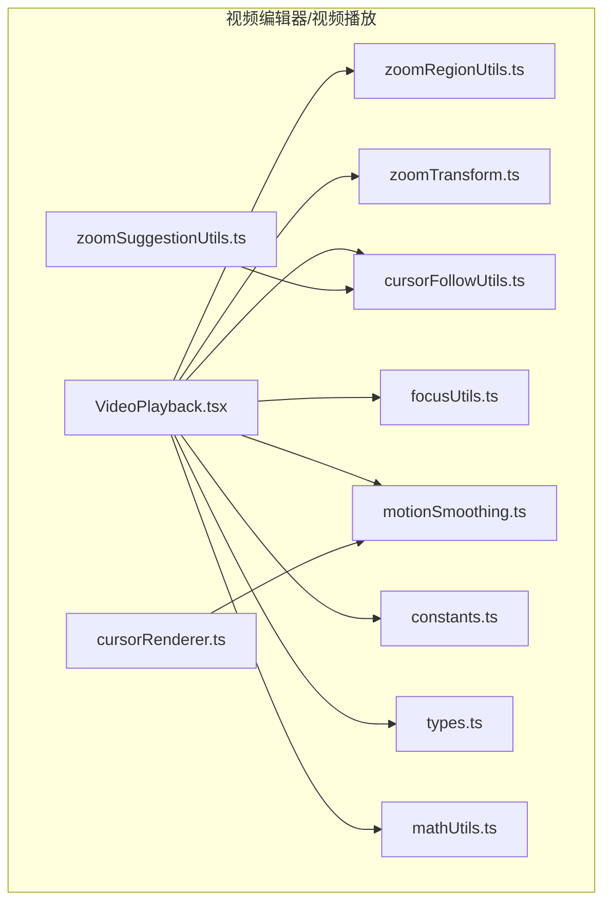
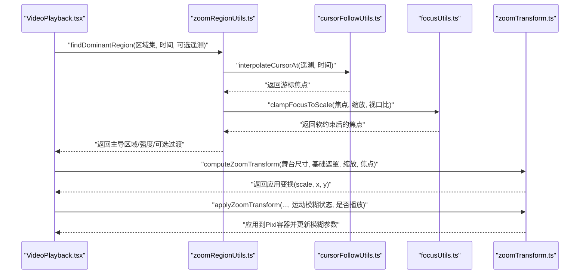
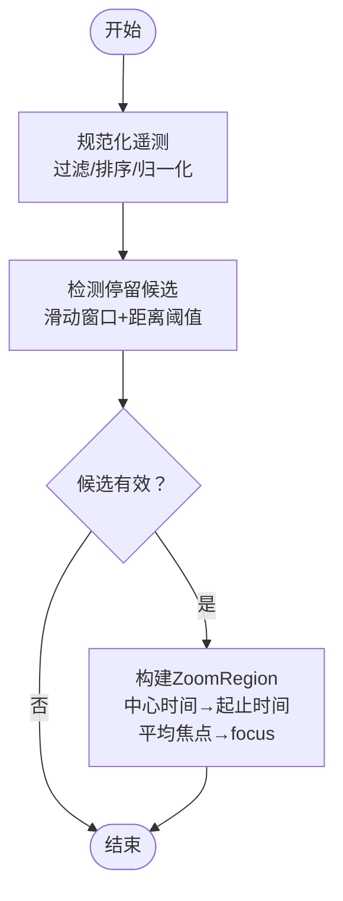
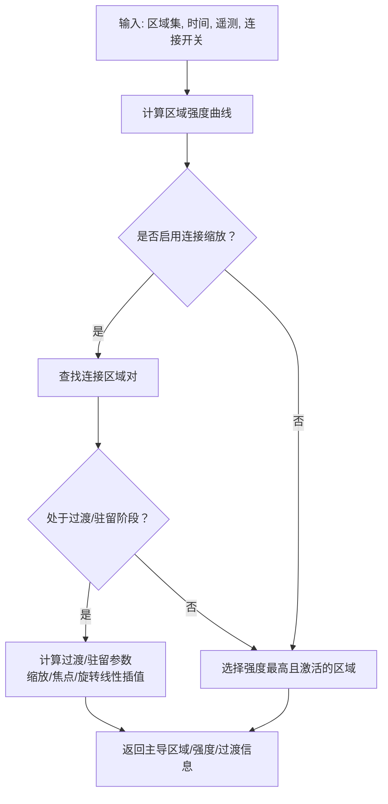
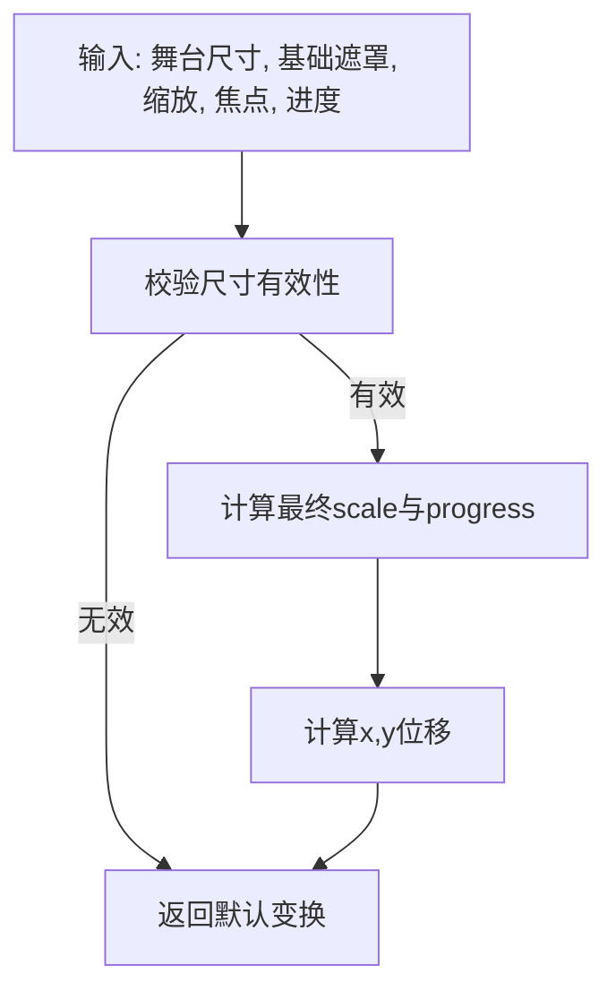
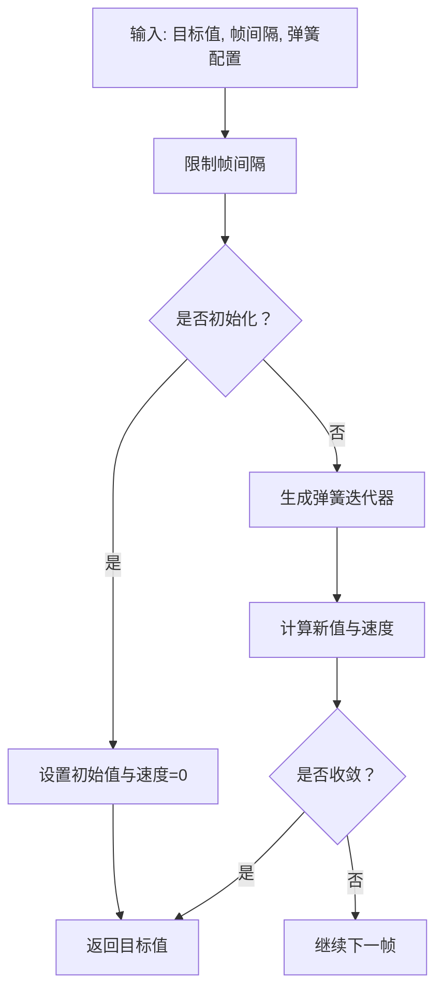
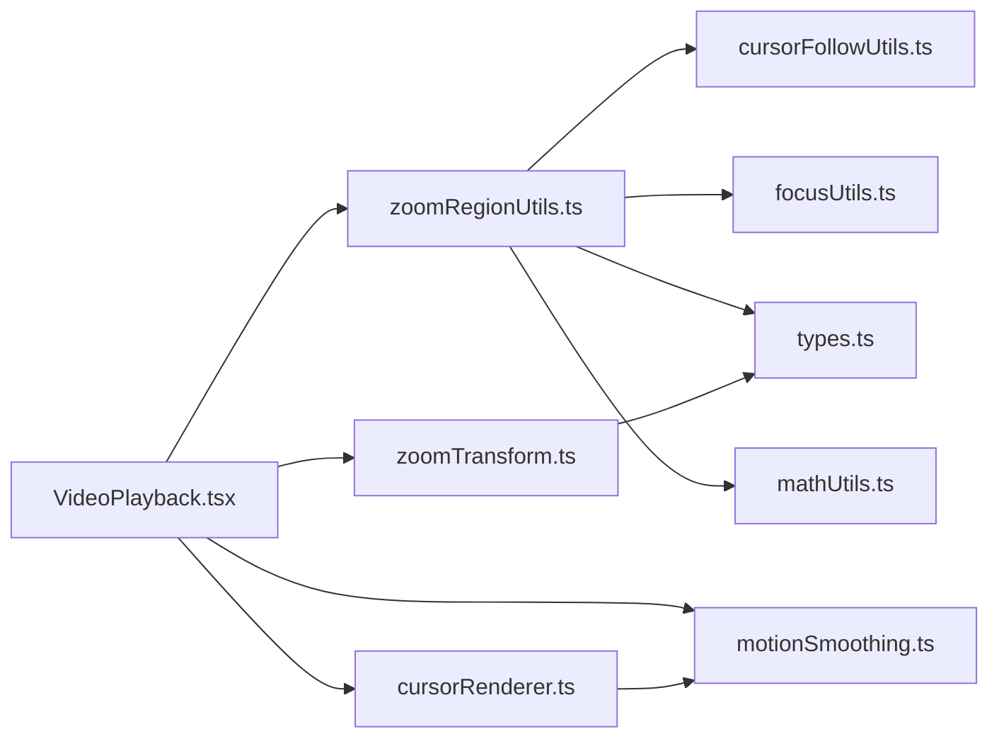

# 智能缩放算法

<cite>
**本文引用的文件**
- [zoomRegionUtils.ts](file://src/components/video-editor/videoPlayback/zoomRegionUtils.ts)
- [zoomTransform.ts](file://src/components/video-editor/videoPlayback/zoomTransform.ts)
- [motionSmoothing.ts](file://src/components/video-editor/videoPlayback/motionSmoothing.ts)
- [cursorFollowUtils.ts](file://src/components/video-editor/videoPlayback/cursorFollowUtils.ts)
- [focusUtils.ts](file://src/components/video-editor/videoPlayback/focusUtils.ts)
- [constants.ts](file://src/components/video-editor/videoPlayback/constants.ts)
- [types.ts](file://src/components/video-editor/types.ts)
- [mathUtils.ts](file://src/components/video-editor/videoPlayback/mathUtils.ts)
- [zoomSuggestionUtils.ts](file://src/components/video-editor/timeline/zoomSuggestionUtils.ts)
- [VideoPlayback.tsx](file://src/components/video-editor/VideoPlayback.tsx)
- [cursorRenderer.ts](file://src/components/video-editor/videoPlayback/cursorRenderer.ts)
</cite>

## 目录
1. [引言](#引言)
2. [项目结构](#项目结构)
3. [核心组件](#核心组件)
4. [架构总览](#架构总览)
5. [详细组件分析](#详细组件分析)
6. [依赖关系分析](#依赖关系分析)
7. [性能考量](#性能考量)
8. [故障排查指南](#故障排查指南)
9. [结论](#结论)
10. [附录](#附录)

## 引言
本技术文档围绕“智能缩放算法”展开，系统性阐述基于游标移动模式的自动缩放区域推荐与动态缩放实现。内容覆盖以下方面：
- 基于游标轨迹的热点区域识别与缩放区域建议
- 缩放区域计算与强度评分、连接过渡与边界约束
- 缩放变换矩阵与游标坐标到视频画面的映射
- 运动平滑（弹簧模型）与自适应平滑参数
- 触发条件、阈值与用户手动干预优先级
- 性能优化策略与用户体验设计要点

## 项目结构
与智能缩放直接相关的模块主要位于 video-editor 的 videoPlayback 子目录，并在 VideoPlayback 组件中被消费与驱动：
- 缩放区域与强度计算：zoomRegionUtils.ts
- 缩放变换与焦点映射：zoomTransform.ts
- 游标跟随与插值：cursorFollowUtils.ts
- 焦点边界与软约束：focusUtils.ts
- 常量与阈值：constants.ts
- 类型定义与缩放深度/比例：types.ts
- 数学工具与缓动函数：mathUtils.ts
- 时间线上的缩放候选项检测：zoomSuggestionUtils.ts
- 主播放器集成与调用：VideoPlayback.tsx
- 光标渲染与平滑：cursorRenderer.ts

**图表来源**
- [VideoPlayback.tsx:1317-1344](file://src/components/video-editor/VideoPlayback.tsx#L1317-L1344)
- [zoomRegionUtils.ts:285-353](file://src/components/video-editor/videoPlayback/zoomRegionUtils.ts#L285-L353)
- [zoomTransform.ts:75-108](file://src/components/video-editor/videoPlayback/zoomTransform.ts#L75-L108)
- [cursorFollowUtils.ts:7-43](file://src/components/video-editor/videoPlayback/cursorFollowUtils.ts#L7-L43)
- [focusUtils.ts:75-90](file://src/components/video-editor/videoPlayback/focusUtils.ts#L75-L90)
- [motionSmoothing.ts:46-90](file://src/components/video-editor/videoPlayback/motionSmoothing.ts#L46-L90)
- [constants.ts:1-14](file://src/components/video-editor/videoPlayback/constants.ts#L1-L14)
- [types.ts:62-72](file://src/components/video-editor/types.ts#L62-L72)
- [mathUtils.ts:61-63](file://src/components/video-editor/videoPlayback/mathUtils.ts#L61-L63)
- [zoomSuggestionUtils.ts:37-81](file://src/components/video-editor/timeline/zoomSuggestionUtils.ts#L37-L81)
- [cursorRenderer.ts:436-468](file://src/components/video-editor/videoPlayback/cursorRenderer.ts#L436-L468)

**章节来源**
- [VideoPlayback.tsx:1317-1344](file://src/components/video-editor/VideoPlayback.tsx#L1317-L1344)
- [zoomRegionUtils.ts:285-353](file://src/components/video-editor/videoPlayback/zoomRegionUtils.ts#L285-L353)
- [zoomTransform.ts:75-108](file://src/components/video-editor/videoPlayback/zoomTransform.ts#L75-L108)
- [cursorFollowUtils.ts:7-43](file://src/components/video-editor/videoPlayback/cursorFollowUtils.ts#L7-L43)
- [focusUtils.ts:75-90](file://src/components/video-editor/videoPlayback/focusUtils.ts#L75-L90)
- [motionSmoothing.ts:46-90](file://src/components/video-editor/videoPlayback/motionSmoothing.ts#L46-L90)
- [constants.ts:1-14](file://src/components/video-editor/videoPlayback/constants.ts#L1-L14)
- [types.ts:62-72](file://src/components/video-editor/types.ts#L62-L72)
- [mathUtils.ts:61-63](file://src/components/video-editor/videoPlayback/mathUtils.ts#L61-L63)
- [zoomSuggestionUtils.ts:37-81](file://src/components/video-editor/timeline/zoomSuggestionUtils.ts#L37-L81)
- [cursorRenderer.ts:436-468](file://src/components/video-editor/videoPlayback/cursorRenderer.ts#L436-L468)

## 核心组件
- 缩放区域推荐与强度评分：findDominantRegion 负责在给定时间戳下选择当前主导缩放区域，并计算强度、可选的连接过渡与旋转。
- 缩放变换矩阵：computeZoomTransform 将缩放比例与焦点映射为相机位移与缩放，applyZoomTransform 应用到 Pixi 容器并结合运动模糊。
- 游标轨迹插值与跟随：interpolateCursorAt 在游标遥测数据上进行二分查找与线性插值；smoothCursorFocus 与 adaptiveSmoothFactor 提供指数与自适应平滑。
- 焦点边界与软约束：clampFocusToScale/softenFocusToScale 保证焦点在缩放尺度下的安全边界内。
- 时间线热点检测：detectZoomDwellCandidates 从游标遥测中识别“停留”热点，作为自动缩放区域的候选。

**章节来源**
- [zoomRegionUtils.ts:285-353](file://src/components/video-editor/videoPlayback/zoomRegionUtils.ts#L285-L353)
- [zoomTransform.ts:75-108](file://src/components/video-editor/videoPlayback/zoomTransform.ts#L75-L108)
- [cursorFollowUtils.ts:7-43](file://src/components/video-editor/videoPlayback/cursorFollowUtils.ts#L7-L43)
- [focusUtils.ts:75-90](file://src/components/video-editor/videoPlayback/focusUtils.ts#L75-L90)
- [zoomSuggestionUtils.ts:37-81](file://src/components/video-editor/timeline/zoomSuggestionUtils.ts#L37-L81)

## 架构总览
智能缩放的端到端流程如下：
- 输入：游标遥测（按时间排序）、缩放区域集合（含起止时间、深度/自定义缩放、焦点、旋转预设）、播放时间戳。
- 处理：
  - 使用 findDominantRegion 计算当前主导区域与强度，必要时进行区域连接过渡。
  - 若焦点模式为 auto，则通过 interpolateCursorAt 获取游标位置并软约束至当前缩放尺度。
  - 通过 computeZoomTransform 计算相机的缩放与位移，applyZoomTransform 应用到渲染容器并更新运动模糊。
- 输出：当前帧的缩放比例、焦点、旋转与相机位姿。

**图表来源**
- [VideoPlayback.tsx:1317-1344](file://src/components/video-editor/VideoPlayback.tsx#L1317-L1344)
- [zoomRegionUtils.ts:285-353](file://src/components/video-editor/videoPlayback/zoomRegionUtils.ts#L285-L353)
- [cursorFollowUtils.ts:7-43](file://src/components/video-editor/videoPlayback/cursorFollowUtils.ts#L7-L43)
- [focusUtils.ts:75-90](file://src/components/video-editor/videoPlayback/focusUtils.ts#L75-L90)
- [zoomTransform.ts:75-108](file://src/components/video-editor/videoPlayback/zoomTransform.ts#L75-L108)

## 详细组件分析

### 基于游标移动模式的自动缩放区域推荐
- 热点区域识别：通过 detectZoomDwellCandidates 识别长时间、低移动幅度的游标运行片段，输出中心时间、平均焦点与持续时长作为候选。
- 缩放区域建议：将候选热点映射为 ZoomRegion（起止时间、焦点、深度或自定义缩放），用于后续自动跟随与强度评分。
- 自动焦点模式：当区域焦点模式为 auto 时，使用 interpolateCursorAt 在当前时间戳处线性插值游标位置，避免离散采样带来的抖动。

**图表来源**
- [zoomSuggestionUtils.ts:24-81](file://src/components/video-editor/timeline/zoomSuggestionUtils.ts#L24-L81)
- [cursorFollowUtils.ts:7-43](file://src/components/video-editor/videoPlayback/cursorFollowUtils.ts#L7-L43)

**章节来源**
- [zoomSuggestionUtils.ts:37-81](file://src/components/video-editor/timeline/zoomSuggestionUtils.ts#L37-L81)
- [cursorFollowUtils.ts:7-43](file://src/components/video-editor/videoPlayback/cursorFollowUtils.ts#L7-L43)

### 缩放区域计算与强度评分（zoomRegionUtils）
- 区域强度计算：对每个区域计算随时间变化的强度曲线，包含进入渐入、峰值与淡出阶段，使用缓动函数控制平滑。
- 主导区域选择：按强度降序与起始时间次序选择当前主导区域；若启用连接缩放，优先处理相邻区域的过渡与驻留阶段。
- 自动焦点解析：当焦点模式为 auto 且提供遥测时，使用插值结果覆盖焦点，并通过 clampFocusToScale 进行边界软约束。
- 连接过渡：对相邻区域在时间窗内进行线性插值，混合缩放、焦点与旋转，形成平滑的跨区域过渡。

**图表来源**
- [zoomRegionUtils.ts:41-61](file://src/components/video-editor/videoPlayback/zoomRegionUtils.ts#L41-L61)
- [zoomRegionUtils.ts:123-169](file://src/components/video-editor/videoPlayback/zoomRegionUtils.ts#L123-L169)
- [zoomRegionUtils.ts:201-263](file://src/components/video-editor/videoPlayback/zoomRegionUtils.ts#L201-L263)

**章节来源**
- [zoomRegionUtils.ts:41-61](file://src/components/video-editor/videoPlayback/zoomRegionUtils.ts#L41-L61)
- [zoomRegionUtils.ts:123-169](file://src/components/video-editor/videoPlayback/zoomRegionUtils.ts#L123-L169)
- [zoomRegionUtils.ts:201-263](file://src/components/video-editor/videoPlayback/zoomRegionUtils.ts#L201-L263)

### 缩放变换矩阵与坐标映射（zoomTransform）
- 变换计算：将缩放比例与焦点映射为相机的 scale 与 position，焦点以舞台像素坐标直接映射，确保缩放围绕指定焦点进行。
- 反向映射：computeFocusFromTransform 支持从已应用的相机位姿反推焦点，便于交互编辑。
- 运动模糊：applyZoomTransform 基于帧间位移与缩放变化速率计算运动模糊强度与方向，动态调整模糊滤镜参数，播放状态下启用，否则重置。

**图表来源**
- [zoomTransform.ts:75-108](file://src/components/video-editor/videoPlayback/zoomTransform.ts#L75-L108)
- [zoomTransform.ts:110-136](file://src/components/video-editor/videoPlayback/zoomTransform.ts#L110-L136)

**章节来源**
- [zoomTransform.ts:75-108](file://src/components/video-editor/videoPlayback/zoomTransform.ts#L75-L108)
- [zoomTransform.ts:110-136](file://src/components/video-editor/videoPlayback/zoomTransform.ts#L110-L136)
- [zoomTransform.ts:138-251](file://src/components/video-editor/videoPlayback/zoomTransform.ts#L138-L251)

### 焦点边界与软约束（focusUtils）
- 边界计算：根据缩放比例与视口比例计算安全边界，避免焦点越界。
- 软约束：softenFocusToScale 对接近边界的焦点进行软钳制，提供自然的减速感，提升视觉舒适度。
- 阶段到视频空间映射：stageFocusToVideoSpace 支持将舞台焦点映射到视频空间，便于与裁剪/偏移等布局参数协同。

**章节来源**
- [focusUtils.ts:47-59](file://src/components/video-editor/videoPlayback/focusUtils.ts#L47-L59)
- [focusUtils.ts:75-90](file://src/components/video-editor/videoPlayback/focusUtils.ts#L75-L90)
- [focusUtils.ts:92-111](file://src/components/video-editor/videoPlayback/focusUtils.ts#L92-L111)
- [focusUtils.ts:113-140](file://src/components/video-editor/videoPlayback/focusUtils.ts#L113-L140)

### 运动平滑算法（motionSmoothing）
- 弹簧模型：stepSpringValue 使用外部 spring 库，支持刚度、阻尼、质量与静止阈值配置，按帧步进求解目标值与速度。
- 自适应平滑：getCursorSpringConfig 将用户平滑因子映射为弹簧参数，提供从“快速响应”到“柔和跟随”的连续调节。
- 帧间隔安全：clampDeltaMs 限制帧间隔，避免异常时间步导致数值不稳定。

**图表来源**
- [motionSmoothing.ts:46-90](file://src/components/video-editor/videoPlayback/motionSmoothing.ts#L46-L90)
- [motionSmoothing.ts:92-139](file://src/components/video-editor/videoPlayback/motionSmoothing.ts#L92-L139)

**章节来源**
- [motionSmoothing.ts:46-90](file://src/components/video-editor/videoPlayback/motionSmoothing.ts#L46-L90)
- [motionSmoothing.ts:92-139](file://src/components/video-editor/videoPlayback/motionSmoothing.ts#L92-L139)

### 游标轨迹插值与速度计算
- 插值：interpolateCursorAt 对有序遥测数组使用二分查找定位时间戳区间，再进行线性插值，得到精确的游标位置。
- 平滑：smoothCursorFocus 提供指数平滑；adaptiveSmoothFactor 基于与前一时刻的距离自适应调整平滑系数，形成自然减速。
- 速度：在运动模糊中，dx/dt、dy/dt 与 dScale/dt 被组合为综合速度，用于动态计算模糊强度与方向。

**章节来源**
- [cursorFollowUtils.ts:7-43](file://src/components/video-editor/videoPlayback/cursorFollowUtils.ts#L7-L43)
- [cursorFollowUtils.ts:49-73](file://src/components/video-editor/videoPlayback/cursorFollowUtils.ts#L49-L73)
- [zoomTransform.ts:194-213](file://src/components/video-editor/videoPlayback/zoomTransform.ts#L194-L213)

### 缩放强度与缓动函数
- 强度曲线：在进入渐入、峰值与淡出阶段分别采用不同缓动函数，确保缩放切换的自然过渡。
- 缓动：easeOutScreenStudio 与 easeOutCubic 等提供不同的缓动特性，适配进入与退出场景。

**章节来源**
- [zoomRegionUtils.ts:41-61](file://src/components/video-editor/videoPlayback/zoomRegionUtils.ts#L41-L61)
- [mathUtils.ts:61-63](file://src/components/video-editor/videoPlayback/mathUtils.ts#L61-L63)
- [mathUtils.ts:83-86](file://src/components/video-editor/videoPlayback/mathUtils.ts#L83-L86)

## 依赖关系分析
- VideoPlayback.tsx 是主控者，负责：
  - 调用 findDominantRegion 获取主导区域与强度
  - 计算目标缩放与焦点，调用 computeZoomTransform/applyZoomTransform 应用
  - 结合 cursorRenderer 的平滑与自适应参数，驱动光标跟随
- zoomRegionUtils 依赖 cursorFollowUtils、focusUtils、types 与 mathUtils
- zoomTransform 依赖 types 与数学常量
- motionSmoothing 由 cursorRenderer 与 VideoPlayback 使用

**图表来源**
- [VideoPlayback.tsx:1317-1344](file://src/components/video-editor/VideoPlayback.tsx#L1317-L1344)
- [zoomRegionUtils.ts:285-353](file://src/components/video-editor/videoPlayback/zoomRegionUtils.ts#L285-L353)
- [zoomTransform.ts:75-108](file://src/components/video-editor/videoPlayback/zoomTransform.ts#L75-L108)
- [motionSmoothing.ts:46-90](file://src/components/video-editor/videoPlayback/motionSmoothing.ts#L46-L90)
- [cursorRenderer.ts:436-468](file://src/components/video-editor/videoPlayback/cursorRenderer.ts#L436-L468)

**章节来源**
- [VideoPlayback.tsx:1317-1344](file://src/components/video-editor/VideoPlayback.tsx#L1317-L1344)
- [zoomRegionUtils.ts:285-353](file://src/components/video-editor/videoPlayback/zoomRegionUtils.ts#L285-L353)
- [zoomTransform.ts:75-108](file://src/components/video-editor/videoPlayback/zoomTransform.ts#L75-L108)
- [motionSmoothing.ts:46-90](file://src/components/video-editor/videoPlayback/motionSmoothing.ts#L46-L90)
- [cursorRenderer.ts:436-468](file://src/components/video-editor/videoPlayback/cursorRenderer.ts#L436-L468)

## 性能考量
- 单帧缓存：findDominantRegion 内部维护单键缓存，避免在时间戳相近时重复扫描与分配，显著降低 O(N) 开销。
- 帧间隔裁剪：clampDeltaMs 限制帧间隔，防止极端 dt 导致的数值不稳定与抖动。
- 运动模糊开销控制：仅在播放状态启用，且根据速度阈值与归一化速度动态调整模糊核大小与方向，避免不必要的高成本滤波。
- 二分插值：interpolateCursorAt 使用二分查找，时间复杂度 O(log N)，适合高频调用。
- 视口比与边界软约束：通过 viewportRatio 与软钳制减少边界抖动，改善视觉体验。

**章节来源**
- [zoomRegionUtils.ts:273-283](file://src/components/video-editor/videoPlayback/zoomRegionUtils.ts#L273-L283)
- [motionSmoothing.ts:38-44](file://src/components/video-editor/videoPlayback/motionSmoothing.ts#L38-L44)
- [zoomTransform.ts:180-244](file://src/components/video-editor/videoPlayback/zoomTransform.ts#L180-L244)
- [cursorFollowUtils.ts:7-43](file://src/components/video-editor/videoPlayback/cursorFollowUtils.ts#L7-L43)
- [focusUtils.ts:92-111](file://src/components/video-editor/videoPlayback/focusUtils.ts#L92-L111)

## 故障排查指南
- 缩放无效果或跳变
  - 检查 computeZoomTransform 的输入尺寸与基础遮罩是否有效
  - 确认 applyZoomTransform 的 isPlaying 与 motionBlurAmount 设置
  - 排查 findDominantRegion 返回的强度是否为 0
- 焦点越界或闪烁
  - 使用 clampFocusToScale/softenFocusToScale 确保焦点在缩放尺度下安全
  - 调整 viewportRatio 以匹配实际视口比例
- 运动模糊不生效
  - 确认 motionBlurState 初始化与帧时间更新
  - 检查速度阈值与峰值速度，确认 targetBlur 计算路径
- 游标跟随抖动
  - 调整 getCursorSpringConfig 的平滑因子
  - 使用 adaptiveSmoothFactor 替代硬死区，获得更自然的减速

**章节来源**
- [zoomTransform.ts:155-251](file://src/components/video-editor/videoPlayback/zoomTransform.ts#L155-L251)
- [zoomRegionUtils.ts:123-169](file://src/components/video-editor/videoPlayback/zoomRegionUtils.ts#L123-L169)
- [focusUtils.ts:75-90](file://src/components/video-editor/videoPlayback/focusUtils.ts#L75-L90)
- [motionSmoothing.ts:92-139](file://src/components/video-editor/videoPlayback/motionSmoothing.ts#L92-L139)
- [cursorFollowUtils.ts:61-73](file://src/components/video-editor/videoPlayback/cursorFollowUtils.ts#L61-L73)

## 结论
该智能缩放系统通过“热点检测—区域强度评分—焦点软约束—变换应用—运动模糊”的完整链路，实现了基于游标移动模式的自动化缩放推荐与高质量渲染。其关键优势在于：
- 基于游标遥测的停留检测与线性插值，确保跟随的准确性与时序连续性
- 区域连接过渡与软边界约束，带来自然的跨区域体验
- 弹簧模型与自适应平滑参数，兼顾响应速度与视觉稳定性
- 性能层面的缓存与阈值控制，保障实时播放的流畅性

## 附录
- 触发条件与阈值
  - 停留检测：最小/最大停留时长、移动阈值
  - 缩放强度：渐入/渐出窗口、缓动函数
  - 运动模糊：速度阈值、峰值速度、模糊上限
- 用户手动干预优先级
  - 手动选择的缩放区域优先于自动区域，强度为 0 时不参与主导区域选择
  - 自动焦点模式下，手动焦点会被插值结果覆盖，但可通过软约束保持稳定

**章节来源**
- [zoomSuggestionUtils.ts:3-13](file://src/components/video-editor/timeline/zoomSuggestionUtils.ts#L3-L13)
- [constants.ts:1-14](file://src/components/video-editor/videoPlayback/constants.ts#L1-L14)
- [zoomRegionUtils.ts:41-61](file://src/components/video-editor/videoPlayback/zoomRegionUtils.ts#L41-L61)
- [zoomTransform.ts:180-244](file://src/components/video-editor/videoPlayback/zoomTransform.ts#L180-L244)
- [VideoPlayback.tsx:1332-1344](file://src/components/video-editor/VideoPlayback.tsx#L1332-L1344)