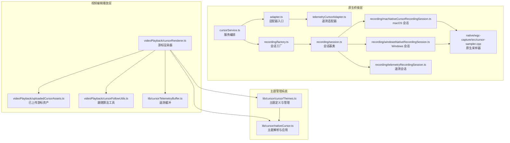
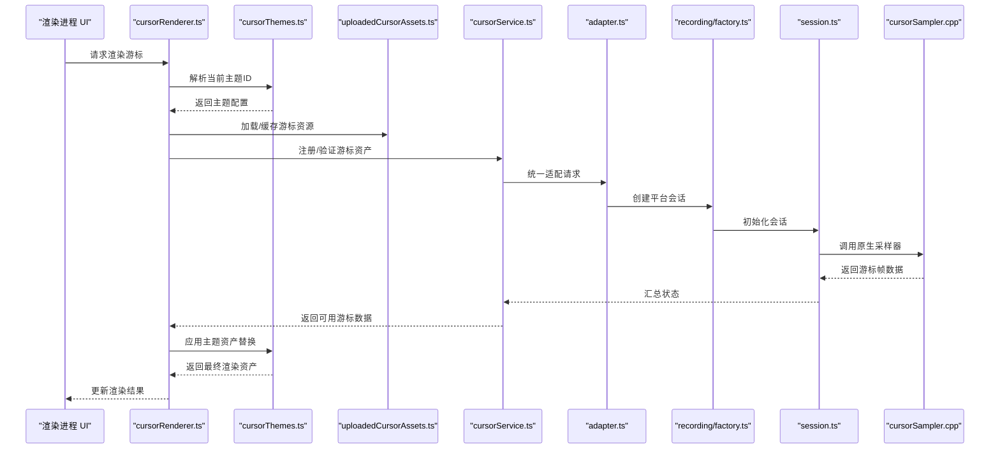
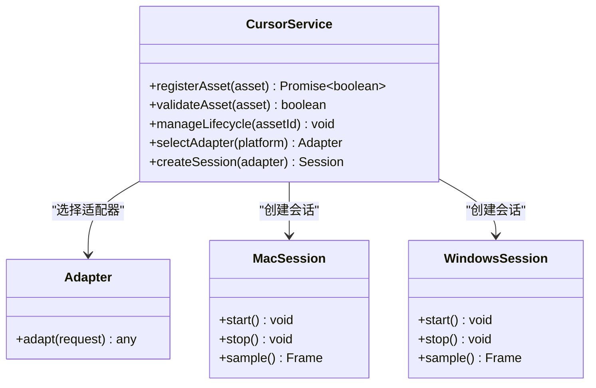
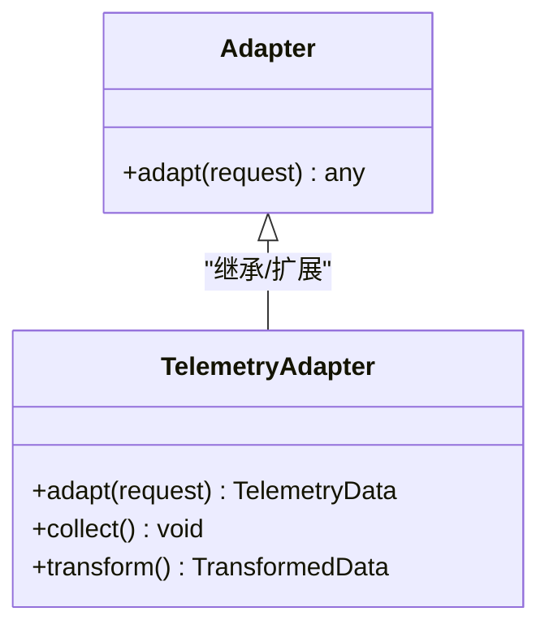
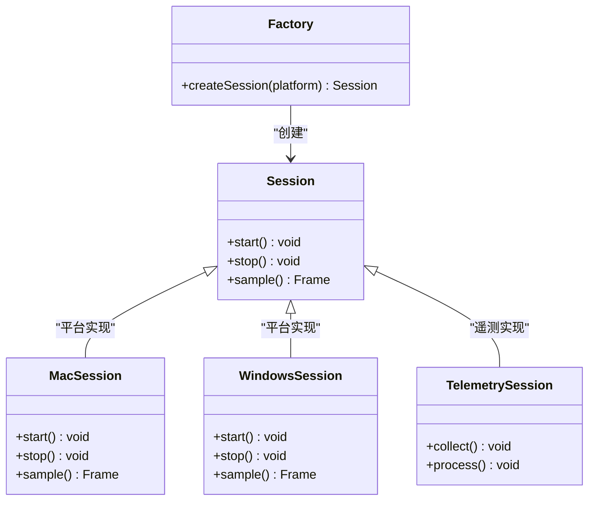
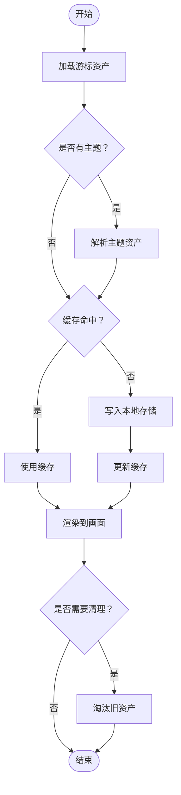
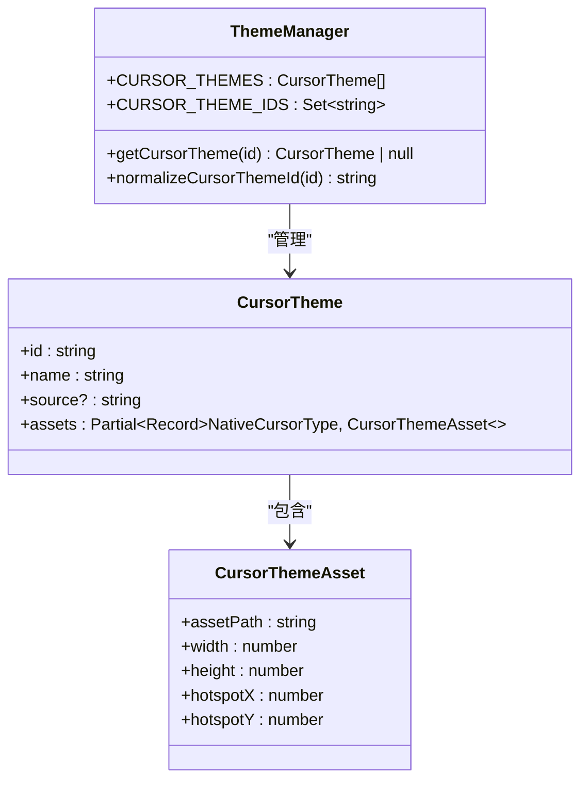
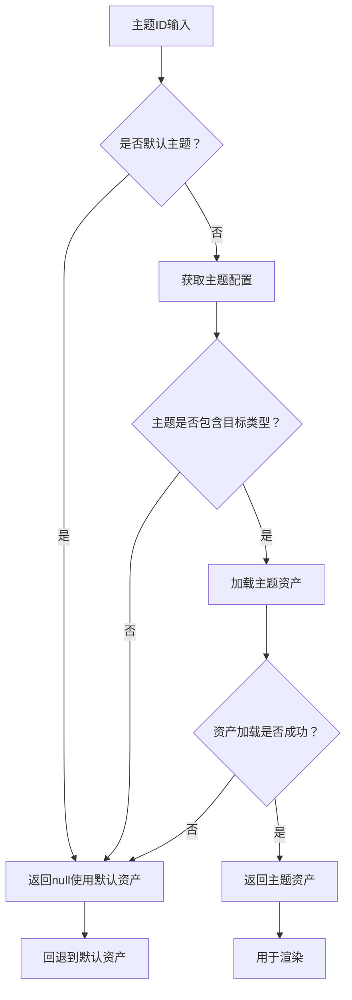
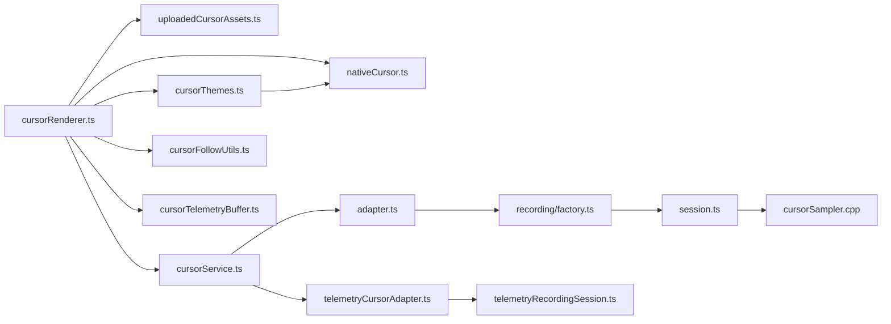

# 游标资产管理系统

<cite>
**本文引用的文件**
- [adapter.ts](file://electron/native-bridge/cursor/adapter.ts)
- [telemetryCursorAdapter.ts](file://electron/native-bridge/cursor/telemetryCursorAdapter.ts)
- [cursorService.ts](file://electron/native-bridge/services/cursorService.ts)
- [factory.ts](file://electron/native-bridge/cursor/recording/factory.ts)
- [session.ts](file://electron/native-bridge/cursor/recording/session.ts)
- [macNativeCursorRecordingSession.ts](file://electron/native-bridge/cursor/recording/macNativeCursorRecordingSession.ts)
- [windowsNativeRecordingSession.ts](file://electron/native-bridge/cursor/recording/windowsNativeRecordingSession.ts)
- [windowsNativeRecordingSession.types.ts](file://electron/native-bridge/cursor/recording/windowsNativeRecordingSession.types.ts)
- [telemetryRecordingSession.ts](file://electron/native-bridge/cursor/recording/telemetryRecordingSession.ts)
- [cursorRenderer.ts](file://src/components/video-editor/videoPlayback/cursorRenderer.ts)
- [uploadedCursorAssets.ts](file://src/components/video-editor/videoPlayback/uploadedCursorAssets.ts)
- [cursorFollowUtils.ts](file://src/components/video-editor/videoPlayback/cursorFollowUtils.ts)
- [cursorSampler.cpp](file://electron/native/wgc-capture/src/cursor-sampler.cpp)
- [cursorTelemetryBuffer.ts](file://src/lib/cursorTelemetryBuffer.ts)
- [cursorThemes.ts](file://src/lib/cursor/cursorThemes.ts)
- [nativeCursor.ts](file://src/lib/cursor/nativeCursor.ts)
- [cursorTelemetrySystem.md](file://docs/03-recording/03-cursor-telemetry-system.md)
- [macos-native-cursor.md](file://docs/testing/macos-native-cursor.md)
- [windows-native-cursor.md](file://docs/testing/windows-native-cursor.md)
</cite>

## 更新摘要
**所做更改**
- 新增游标主题系统章节，详细介绍17种内置游标主题的实现机制
- 更新游标资产加载流程，增加主题资产解析和优先级处理
- 扩展游标渲染器功能，支持主题资产的动态切换和回退机制
- 新增游标主题的配置管理、版本控制和向后兼容性处理
- 更新游标资产存储策略，支持主题资产的本地化和缓存管理

## 目录
1. [简介](#简介)
2. [项目结构](#项目结构)
3. [核心组件](#核心组件)
4. [架构总览](#架构总览)
5. [详细组件分析](#详细组件分析)
6. [游标主题系统](#游标主题系统)
7. [依赖关系分析](#依赖关系分析)
8. [性能考虑](#性能考虑)
9. [故障排除指南](#故障排除指南)
10. [结论](#结论)
11. [附录](#附录)

## 简介
本文件面向"游标资产管理系统"的设计与实现，聚焦以下目标：
- 自定义游标资产的上传、存储与管理机制（格式、尺寸、分辨率适配）
- 游标主题系统的引入，支持17种不同的游标主题和自定义游标资产管理
- cursorService 的服务架构（注册、验证、生命周期管理）
- 适配器模式在多平台间的统一处理接口
- uploadedCursorAssets 的本地存储策略、缓存与清理规则
- 渲染优化（纹理管理、动画序列处理、性能监控）
- 版本管理与向后兼容性
- 开发最佳实践与常见问题解决方案

## 项目结构
该系统围绕 Electron 主进程与渲染进程协作展开，核心由"原生桥接层"、"视频编辑播放层"和"主题管理系统"组成：
- 原生桥接层：负责跨平台游标采样、会话管理与服务编排
- 视频编辑播放层：负责游标资产的上传、缓存、渲染与跟随逻辑
- 主题管理系统：负责游标主题的定义、加载、切换和回退机制

**图表来源**
- [cursorService.ts](file://electron/native-bridge/services/cursorService.ts)
- [adapter.ts](file://electron/native-bridge/cursor/adapter.ts)
- [telemetryCursorAdapter.ts](file://electron/native-bridge/cursor/telemetryCursorAdapter.ts)
- [factory.ts](file://electron/native-bridge/cursor/recording/factory.ts)
- [session.ts](file://electron/native-bridge/cursor/recording/session.ts)
- [macNativeCursorRecordingSession.ts](file://electron/native-bridge/cursor/recording/macNativeCursorRecordingSession.ts)
- [windowsNativeRecordingSession.ts](file://electron/native-bridge/cursor/recording/windowsNativeRecordingSession.ts)
- [telemetryRecordingSession.ts](file://electron/native-bridge/cursor/recording/telemetryRecordingSession.ts)
- [cursorSampler.cpp](file://electron/native/wgc-capture/src/cursor-sampler.cpp)
- [cursorRenderer.ts](file://src/components/video-editor/videoPlayback/cursorRenderer.ts)
- [uploadedCursorAssets.ts](file://src/components/video-editor/videoPlayback/uploadedCursorAssets.ts)
- [cursorFollowUtils.ts](file://src/components/video-editor/videoPlayback/cursorFollowUtils.ts)
- [cursorTelemetryBuffer.ts](file://src/lib/cursorTelemetryBuffer.ts)
- [cursorThemes.ts](file://src/lib/cursor/cursorThemes.ts)
- [nativeCursor.ts](file://src/lib/cursor/nativeCursor.ts)

**章节来源**
- [cursorService.ts](file://electron/native-bridge/services/cursorService.ts)
- [adapter.ts](file://electron/native-bridge/cursor/adapter.ts)
- [telemetryCursorAdapter.ts](file://electron/native-bridge/cursor/telemetryCursorAdapter.ts)
- [factory.ts](file://electron/native-bridge/cursor/recording/factory.ts)
- [session.ts](file://electron/native-bridge/cursor/recording/session.ts)
- [macNativeCursorRecordingSession.ts](file://electron/native-bridge/cursor/recording/macNativeCursorRecordingSession.ts)
- [windowsNativeRecordingSession.ts](file://electron/native-bridge/cursor/recording/windowsNativeRecordingSession.ts)
- [telemetryRecordingSession.ts](file://electron/native-bridge/cursor/recording/telemetryRecordingSession.ts)
- [cursorRenderer.ts](file://src/components/video-editor/videoPlayback/cursorRenderer.ts)
- [uploadedCursorAssets.ts](file://src/components/video-editor/videoPlayback/uploadedCursorAssets.ts)
- [cursorFollowUtils.ts](file://src/components/video-editor/videoPlayback/cursorFollowUtils.ts)
- [cursorSampler.cpp](file://electron/native/wgc-capture/src/cursor-sampler.cpp)
- [cursorTelemetryBuffer.ts](file://src/lib/cursorTelemetryBuffer.ts)
- [cursorThemes.ts](file://src/lib/cursor/cursorThemes.ts)
- [nativeCursor.ts](file://src/lib/cursor/nativeCursor.ts)

## 核心组件
- 服务编排：cursorService 负责游标资产的注册、验证与生命周期管理，协调不同平台的会话与适配器。
- 适配器模式：adapter.ts 作为统一入口，telemetryCursorAdapter.ts 针对遥测场景进行特定适配。
- 会话工厂与会话：factory.ts 创建具体平台会话；session.ts 定义通用会话行为；macNativeCursorRecordingSession.ts 与 windowsNativeRecordingSession.ts 分别封装 macOS/Windows 原生能力；telemetryRecordingSession.ts 处理遥测数据流。
- 渲染与资产：cursorRenderer.ts 负责渲染；uploadedCursorAssets.ts 负责本地存储、缓存与清理；cursorFollowUtils.ts 提供跟随算法；cursorTelemetryBuffer.ts 提供遥测缓冲。
- 主题管理：cursorThemes.ts 定义游标主题结构和内置主题列表；nativeCursor.ts 负责主题解析和资产替换。

**章节来源**
- [cursorService.ts](file://electron/native-bridge/services/cursorService.ts)
- [adapter.ts](file://electron/native-bridge/cursor/adapter.ts)
- [telemetryCursorAdapter.ts](file://electron/native-bridge/cursor/telemetryCursorAdapter.ts)
- [factory.ts](file://electron/native-bridge/cursor/recording/factory.ts)
- [session.ts](file://electron/native-bridge/cursor/recording/session.ts)
- [macNativeCursorRecordingSession.ts](file://electron/native-bridge/cursor/recording/macNativeCursorRecordingSession.ts)
- [windowsNativeRecordingSession.ts](file://electron/native-bridge/cursor/recording/windowsNativeRecordingSession.ts)
- [telemetryRecordingSession.ts](file://electron/native-bridge/cursor/recording/telemetryRecordingSession.ts)
- [cursorRenderer.ts](file://src/components/video-editor/videoPlayback/cursorRenderer.ts)
- [uploadedCursorAssets.ts](file://src/components/video-editor/videoPlayback/uploadedCursorAssets.ts)
- [cursorFollowUtils.ts](file://src/components/video-editor/videoPlayback/cursorFollowUtils.ts)
- [cursorTelemetryBuffer.ts](file://src/lib/cursorTelemetryBuffer.ts)
- [cursorThemes.ts](file://src/lib/cursor/cursorThemes.ts)
- [nativeCursor.ts](file://src/lib/cursor/nativeCursor.ts)

## 架构总览
系统采用"服务编排 + 适配器 + 会话工厂 + 主题管理"的分层架构，通过统一接口在 macOS 与 Windows 平台间复用逻辑，并为遥测场景提供专用适配器。新增的游标主题系统通过主题解析器动态替换游标资产，实现丰富的视觉效果。

**图表来源**
- [cursorRenderer.ts](file://src/components/video-editor/videoPlayback/cursorRenderer.ts)
- [cursorThemes.ts](file://src/lib/cursor/cursorThemes.ts)
- [uploadedCursorAssets.ts](file://src/components/video-editor/videoPlayback/uploadedCursorAssets.ts)
- [cursorService.ts](file://electron/native-bridge/services/cursorService.ts)
- [adapter.ts](file://electron/native-bridge/cursor/adapter.ts)
- [factory.ts](file://electron/native-bridge/cursor/recording/factory.ts)
- [session.ts](file://electron/native-bridge/cursor/recording/session.ts)
- [cursorSampler.cpp](file://electron/native/wgc-capture/src/cursor-sampler.cpp)

## 详细组件分析

### 服务编排：cursorService
职责
- 资产注册：接收来自渲染层的游标资产元数据与二进制内容，进行校验与入库。
- 资产验证：检查格式、尺寸、分辨率等约束，拒绝不合规资产。
- 生命周期管理：跟踪资产状态（待上传、已上传、使用中、废弃），触发清理与回收。
- 会话协调：根据平台选择合适的适配器与会话，驱动原生采样流程。

**图表来源**
- [cursorService.ts](file://electron/native-bridge/services/cursorService.ts)
- [adapter.ts](file://electron/native-bridge/cursor/adapter.ts)
- [macNativeCursorRecordingSession.ts](file://electron/native-bridge/cursor/recording/macNativeCursorRecordingSession.ts)
- [windowsNativeRecordingSession.ts](file://electron/native-bridge/cursor/recording/windowsNativeRecordingSession.ts)

**章节来源**
- [cursorService.ts](file://electron/native-bridge/services/cursorService.ts)

### 适配器模式：adapter 与 telemetryCursorAdapter
- adapter.ts：统一对外接口，屏蔽平台差异，将上层请求转换为平台特定实现。
- telemetryCursorAdapter.ts：针对遥测场景的适配器，负责遥测数据的采集、转换与传递。

**图表来源**
- [adapter.ts](file://electron/native-bridge/cursor/adapter.ts)
- [telemetryCursorAdapter.ts](file://electron/native-bridge/cursor/telemetryCursorAdapter.ts)

**章节来源**
- [adapter.ts](file://electron/native-bridge/cursor/adapter.ts)
- [telemetryCursorAdapter.ts](file://electron/native-bridge/cursor/telemetryCursorAdapter.ts)

### 会话工厂与会话：factory 与 session
- factory.ts：依据平台返回对应的会话实例，确保平台一致性。
- session.ts：定义会话生命周期（启动、停止、采样）与通用行为。
- macNativeCursorRecordingSession.ts / windowsNativeRecordingSession.ts：封装平台原生能力。
- telemetryRecordingSession.ts：处理遥测数据流。

**图表来源**
- [factory.ts](file://electron/native-bridge/cursor/recording/factory.ts)
- [session.ts](file://electron/native-bridge/cursor/recording/session.ts)
- [macNativeCursorRecordingSession.ts](file://electron/native-bridge/cursor/recording/macNativeCursorRecordingSession.ts)
- [windowsNativeRecordingSession.ts](file://electron/native-bridge/cursor/recording/windowsNativeRecordingSession.ts)
- [telemetryRecordingSession.ts](file://electron/native-bridge/cursor/recording/telemetryRecordingSession.ts)

**章节来源**
- [factory.ts](file://electron/native-bridge/cursor/recording/factory.ts)
- [session.ts](file://electron/native-bridge/cursor/recording/session.ts)
- [macNativeCursorRecordingSession.ts](file://electron/native-bridge/cursor/recording/macNativeCursorRecordingSession.ts)
- [windowsNativeRecordingSession.ts](file://electron/native-bridge/cursor/recording/windowsNativeRecordingSession.ts)
- [telemetryRecordingSession.ts](file://electron/native-bridge/cursor/recording/telemetryRecordingSession.ts)

### 原生采样器：cursorSampler.cpp
- 作用：在 Windows 平台调用底层 API 获取游标帧数据，供会话使用。
- 关键点：与 Windows 原生捕获栈协同，保证低延迟与高精度。

**章节来源**
- [cursorSampler.cpp](file://electron/native/wgc-capture/src/cursor-sampler.cpp)

### 渲染与资产：cursorRenderer 与 uploadedCursorAssets
- cursorRenderer.ts：负责将游标资产渲染到视频画面上，结合跟随算法与缓冲策略提升体验。
- uploadedCursorAssets.ts：负责本地存储、缓存与清理规则，确保资源可用性与磁盘空间控制。

**图表来源**
- [uploadedCursorAssets.ts](file://src/components/video-editor/videoPlayback/uploadedCursorAssets.ts)
- [cursorRenderer.ts](file://src/components/video-editor/videoPlayback/cursorRenderer.ts)
- [cursorThemes.ts](file://src/lib/cursor/cursorThemes.ts)

**章节来源**
- [cursorRenderer.ts](file://src/components/video-editor/videoPlayback/cursorRenderer.ts)
- [uploadedCursorAssets.ts](file://src/components/video-editor/videoPlayback/uploadedCursorAssets.ts)

### 跟随算法与遥测：cursorFollowUtils 与 cursorTelemetryBuffer
- cursorFollowUtils.ts：提供游标位置预测、平滑跟随与边界处理等算法，改善观看体验。
- cursorTelemetryBuffer.ts：提供遥测数据的缓冲与聚合，支撑性能监控与质量评估。

**章节来源**
- [cursorFollowUtils.ts](file://src/components/video-editor/videoPlayback/cursorFollowUtils.ts)
- [cursorTelemetryBuffer.ts](file://src/lib/cursorTelemetryBuffer.ts)

## 游标主题系统

### 主题定义与结构
游标主题系统通过 cursorThemes.ts 定义了完整的主题架构，支持17种内置主题和自定义主题管理：

**图表来源**
- [cursorThemes.ts](file://src/lib/cursor/cursorThemes.ts)

### 内置主题列表
系统包含17种精心设计的内置游标主题，涵盖多种风格和用途：

| 主题ID | 显示名称 | 艺术来源 | 支持类型 |
|--------|----------|----------|----------|
| hello-kitty-watermelon | Hello Kitty & Watermelon | sweezy-cursors.com | arrow, pointer |
| among-us-sus-knife-and-red-animated | Among Us Sus Knife & Red Animated | sweezy-cursors.com | arrow, pointer |
| black-and-rainbow-stroke-gradient-animated | Black & Rainbow Stroke Gradient Animated | sweezy-cursors.com | arrow, pointer |
| black-pixel | Black Pixel | 自定义 | arrow, pointer, text |
| christmas-miles-morales | Christmas Miles Morales | 自定义 | arrow, pointer |
| hollow-knight-and-game-arrow | Hollow Knight And Game Arrow | 自定义 | arrow, pointer |
| hollow-knight-nail-sword-and-mask | Hollow Knight Nail Sword And Mask | 自定义 | arrow, pointer |
| mickey-mouse-black-hand-inflated-glove | Mickey Mouse Black Hand Inflated Glove | 自定义 | arrow, pointer |
| naruto-akatsuki-cloud-arrow | Naruto Akatsuki Cloud Arrow | 自定义 | arrow, pointer |
| old-roblox | Old Roblox | 自定义 | arrow, pointer |
| pink-glossy-arrow-and-hand-3d | Pink Glossy Arrow And Hand 3D | 自定义 | arrow, pointer |
| pinky-pixel | Pinky Pixel | 自定义 | arrow, pointer |
| pokemon-neon-gengar | Pokemon Neon Gengar | 自定义 | arrow, pointer |
| sanrio-gudetama-and-arrow-kawaii | Sanrio Gudetama And Arrow Kawaii | 自定义 | arrow, pointer |
| sanrio-kuromi-skull-arrow | Sanrio Kuromi Skull Arrow | 自定义 | arrow, pointer |
| solo-leveling-sung-jinwoo-dark-flames | Solo Leveling Sung Jinwoo Dark Flames | 自定义 | arrow, pointer |
| spring-gradient | Spring Gradient | 自定义 | arrow, pointer |

### 主题资产解析与应用
nativeCursor.ts 实现了主题资产的动态解析和应用机制：

**图表来源**
- [nativeCursor.ts](file://src/lib/cursor/nativeCursor.ts)
- [cursorThemes.ts](file://src/lib/cursor/cursorThemes.ts)

### 主题配置规范
每个游标主题资产遵循统一的配置规范：

- **资产路径**：相对公共资源根目录的路径，如 "cursors/hello-kitty-watermelon/arrow.png"
- **尺寸规格**：以32逻辑像素为参考标准，确保在不同分辨率下保持一致的视觉大小
- **热点坐标**：归一化到32逻辑像素参考系，支持更高的源PNG分辨率（如128x128）
- **绘制优化**：源PNG可更高分辨率，在绘制时按需缩小以获得更清晰的Retina输出

### 主题管理功能
- **主题ID标准化**：normalizeCursorThemeId函数确保传入的主题ID有效性
- **主题查询**：getCursorTheme函数提供主题配置的快速访问
- **主题集合**：CURSOR_THEME_IDS维护所有可选主题ID的集合
- **默认主题支持**："default"主题ID表示不使用任何主题覆盖

**章节来源**
- [cursorThemes.ts](file://src/lib/cursor/cursorThemes.ts)
- [nativeCursor.ts](file://src/lib/cursor/nativeCursor.ts)

## 依赖关系分析
- 上层渲染层依赖 cursorService、uploadedCursorAssets 和 cursorThemes 提供的资源与服务。
- cursorService 依赖 adapter 与会话工厂，以平台无关的方式调度平台实现。
- 会话层依赖原生采样器完成底层数据采集。
- 遥测链路通过 telemetryCursorAdapter 与 telemetryRecordingSession 协同工作。
- 主题系统通过 nativeCursor.ts 与 cursorThemes.ts 实现主题资产的动态解析和应用。

**图表来源**
- [cursorRenderer.ts](file://src/components/video-editor/videoPlayback/cursorRenderer.ts)
- [uploadedCursorAssets.ts](file://src/components/video-editor/videoPlayback/uploadedCursorAssets.ts)
- [cursorService.ts](file://electron/native-bridge/services/cursorService.ts)
- [adapter.ts](file://electron/native-bridge/cursor/adapter.ts)
- [factory.ts](file://electron/native-bridge/cursor/recording/factory.ts)
- [session.ts](file://electron/native-bridge/cursor/recording/session.ts)
- [cursorSampler.cpp](file://electron/native/wgc-capture/src/cursor-sampler.cpp)
- [telemetryCursorAdapter.ts](file://electron/native-bridge/cursor/telemetryCursorAdapter.ts)
- [telemetryRecordingSession.ts](file://electron/native-bridge/cursor/recording/telemetryRecordingSession.ts)
- [cursorFollowUtils.ts](file://src/components/video-editor/videoPlayback/cursorFollowUtils.ts)
- [cursorTelemetryBuffer.ts](file://src/lib/cursorTelemetryBuffer.ts)
- [cursorThemes.ts](file://src/lib/cursor/cursorThemes.ts)
- [nativeCursor.ts](file://src/lib/cursor/nativeCursor.ts)

**章节来源**
- [cursorRenderer.ts](file://src/components/video-editor/videoPlayback/cursorRenderer.ts)
- [uploadedCursorAssets.ts](file://src/components/video-editor/videoPlayback/uploadedCursorAssets.ts)
- [cursorService.ts](file://electron/native-bridge/services/cursorService.ts)
- [adapter.ts](file://electron/native-bridge/cursor/adapter.ts)
- [factory.ts](file://electron/native-bridge/cursor/recording/factory.ts)
- [session.ts](file://electron/native-bridge/cursor/recording/session.ts)
- [cursorSampler.cpp](file://electron/native/wgc-capture/src/cursor-sampler.cpp)
- [telemetryCursorAdapter.ts](file://electron/native-bridge/cursor/telemetryCursorAdapter.ts)
- [telemetryRecordingSession.ts](file://electron/native-bridge/cursor/recording/telemetryRecordingSession.ts)
- [cursorFollowUtils.ts](file://src/components/video-editor/videoPlayback/cursorFollowUtils.ts)
- [cursorTelemetryBuffer.ts](file://src/lib/cursorTelemetryBuffer.ts)
- [cursorThemes.ts](file://src/lib/cursor/cursorThemes.ts)
- [nativeCursor.ts](file://src/lib/cursor/nativeCursor.ts)

## 性能考虑
- 渲染优化
  - 纹理管理：优先使用 GPU 纹理缓存，减少 CPU-GPU 数据拷贝。
  - 动画序列处理：按帧率裁剪与压缩，避免超分辨率渲染。
  - 性能监控：结合遥测缓冲统计帧时间、丢帧率与内存占用。
  - 主题资产优化：主题资产按需加载，支持缓存复用，避免重复解码。
- 存储与缓存
  - 本地存储策略：按资产 ID 命名，启用只读快照与增量更新。
  - 缓存机制：LRU 或基于时间的淘汰策略，限制最大缓存大小。
  - 文件清理：定期扫描过期或重复资产，释放磁盘空间。
  - 主题资产缓存：主题配置和解析结果进行内存缓存，提升切换性能。
- 平台适配
  - macOS：利用系统游标 API，降低 CPU 占用。
  - Windows：通过原生采样器直连底层，减少中间层开销。
- 主题系统优化
  - 主题ID标准化：避免无效主题ID导致的性能损耗。
  - 资产回退机制：主题资产加载失败时快速回退到默认资产。
  - 异步加载：主题资产异步加载，不影响主渲染流程。

## 故障排除指南
- 游标不显示
  - 检查 cursorService 是否成功注册与验证资产。
  - 确认 uploadedCursorAssets 已正确加载并缓存。
  - 排查 cursorRenderer 是否收到有效帧数据。
  - 验证主题ID是否有效且主题资产可加载。
- 渲染卡顿
  - 查看 cursorTelemetryBuffer 中的帧时间统计。
  - 检查缓存命中率与磁盘 IO。
  - 降低游标分辨率或关闭多余动画。
  - 检查主题资产加载是否造成额外开销。
- 平台差异问题
  - macOS：确认权限与沙盒配置。
  - Windows：确认原生采样器是否正常初始化。
- 主题相关问题
  - 主题切换无效：检查主题ID标准化函数是否正确处理。
  - 主题资产缺失：确认 public/cursors 目录下是否存在对应主题资产。
  - 主题回退异常：验证默认主题配置和回退逻辑。

**章节来源**
- [cursorService.ts](file://electron/native-bridge/services/cursorService.ts)
- [uploadedCursorAssets.ts](file://src/components/video-editor/videoPlayback/uploadedCursorAssets.ts)
- [cursorRenderer.ts](file://src/components/video-editor/videoPlayback/cursorRenderer.ts)
- [cursorTelemetryBuffer.ts](file://src/lib/cursorTelemetryBuffer.ts)
- [cursorSampler.cpp](file://electron/native/wgc-capture/src/cursor-sampler.cpp)
- [cursorThemes.ts](file://src/lib/cursor/cursorThemes.ts)
- [nativeCursor.ts](file://src/lib/cursor/nativeCursor.ts)

## 结论
本系统通过服务编排、适配器与会话工厂实现了跨平台游标资产的统一处理；通过 uploadedCursorAssets 的本地存储与缓存策略保障资源可用性；通过 cursorRenderer 与跟随算法优化渲染体验；通过遥测缓冲与原生采样器实现性能监控与低延迟采集。新增的游标主题系统进一步增强了视觉表现力，支持17种内置主题和自定义主题管理，通过智能的资产解析和回退机制确保系统的稳定性和兼容性。建议在实际部署中完善版本管理与兼容性策略，持续优化缓存与清理规则，并加强平台差异的自动化测试覆盖。

## 附录
- 支持的文件格式与尺寸要求
  - 格式：PNG、GIF、SVG（矢量优先）、APNG（动画 PNG）
  - 尺寸：建议不超过 256x256 像素，动画帧数不超过 60 帧
  - 分辨率适配：按设备像素比缩放，避免超采样
  - 主题资产规范：32逻辑像素参考系，支持更高分辨率源文件
- 版本管理与向后兼容
  - 资产元数据包含版本号与兼容范围
  - 旧版本资产在新版本中自动迁移或降级
  - 主题ID标准化确保向后兼容
  - 默认主题回退机制保证系统稳定性
- 最佳实践
  - 优先使用矢量格式，减少位图体积
  - 合理设置缓存上限与淘汰策略
  - 在渲染前进行格式与尺寸验证
  - 使用遥测数据持续优化性能
  - 主题资产应包含完整的箭头和指针类型
  - 主题热点坐标应按32逻辑像素参考系标准化