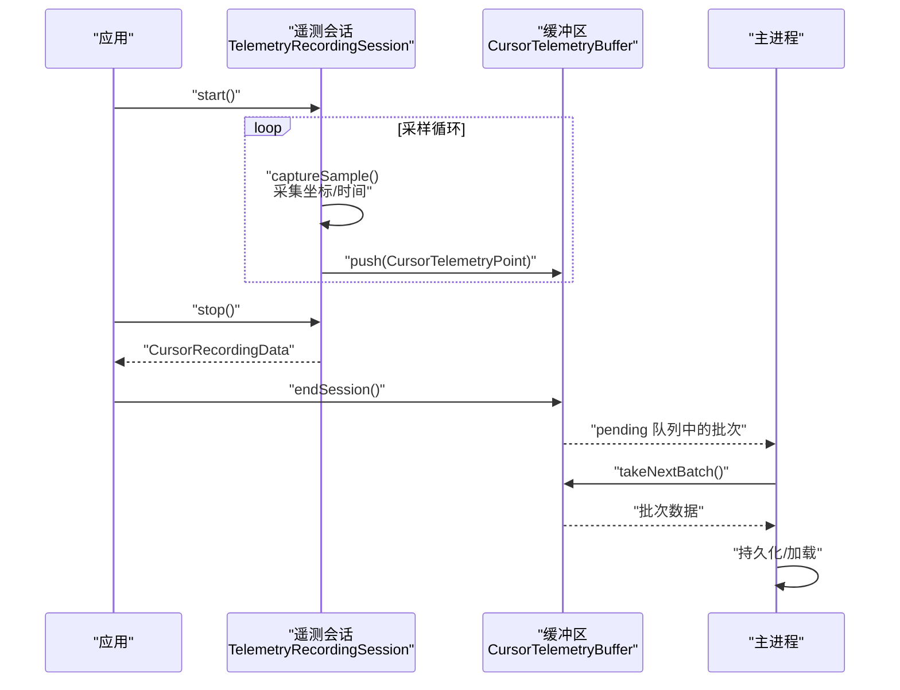
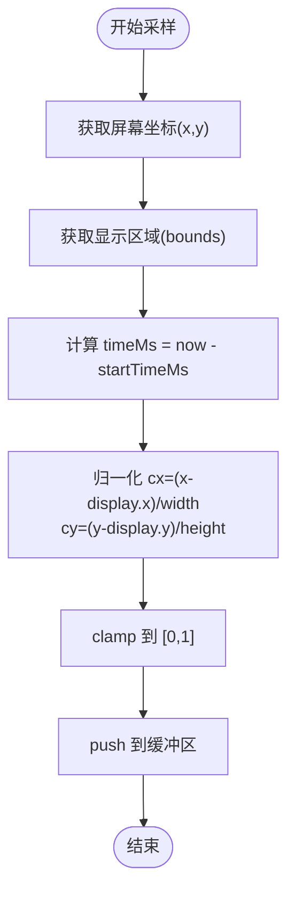
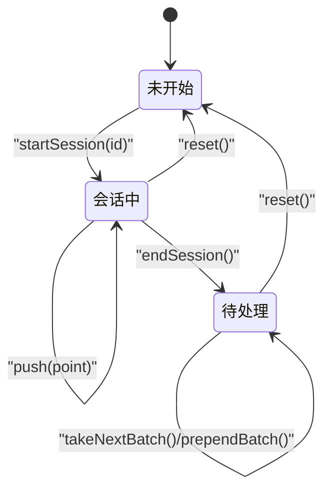
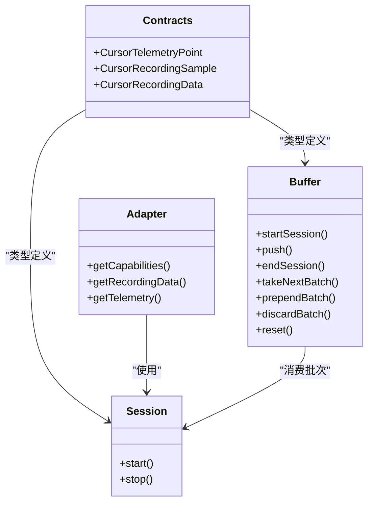

# 游标遥测数据采集

<cite>
**本文引用的文件**
- [cursorTelemetryBuffer.ts](file://src/lib/cursorTelemetryBuffer.ts)
- [cursorTelemetryBuffer.test.ts](file://src/lib/cursorTelemetryBuffer.test.ts)
- [telemetryRecordingSession.ts](file://electron/native-bridge/cursor/recording/telemetryRecordingSession.ts)
- [telemetryCursorAdapter.ts](file://electron/native-bridge/cursor/telemetryCursorAdapter.ts)
- [contracts.ts](file://src/native/contracts.ts)
- [03-cursor-telemetry-system.md](file://docs/03-recording/03-cursor-telemetry-system.md)
- [session.ts](file://electron/native-bridge/cursor/recording/session.ts)
</cite>

## 目录
1. [简介](#简介)
2. [项目结构](#项目结构)
3. [核心组件](#核心组件)
4. [架构总览](#架构总览)
5. [详细组件分析](#详细组件分析)
6. [依赖关系分析](#依赖关系分析)
7. [性能考量](#性能考量)
8. [故障排查指南](#故障排查指南)
9. [结论](#结论)
10. [附录](#附录)

## 简介
本文件面向“游标遥测数据采集系统”，系统目标是在录制过程中实时采集鼠标光标的屏幕坐标与时间戳，形成时序数据，用于自动缩放建议、光标高亮与视频编辑等场景。本文重点覆盖以下方面：
- 实时采样：采样频率控制、坐标归一化（0-1）、时间戳同步（相对录制开始）。
- 数据模型：CursorTelemetryPoint 接口字段与语义。
- 生命周期：从 startSession 到 endSession 的完整流程。
- 缓冲区实现：环形缓冲区的内存管理、最大样本数限制、批次队列的 FIFO 处理。
- 数据推送与批量获取：push 与 takeNextBatch 的实现细节及内存边界下的丢弃策略。
- 性能优化与内存监控。

## 项目结构
围绕游标遥测的关键代码分布在三处：
- 前端/通用层：提供 CursorTelemetryPoint/CursorRecordingSample 类型定义与缓冲区实现。
- 原生桥接层：封装原生平台的遥测会话与适配器，负责采样与数据组织。
- 文档与测试：说明采样频率、坐标归一化、时间戳计算方式，并通过单元测试验证缓冲区行为。

```mermaid
graph TB
subgraph "前端/通用层"
A["类型定义<br/>contracts.ts"]
B["缓冲区实现<br/>cursorTelemetryBuffer.ts"]
T["缓冲区测试<br/>cursorTelemetryBuffer.test.ts"]
end
subgraph "原生桥接层"
C["遥测会话接口<br/>session.ts"]
D["遥测会话实现<br/>telemetryRecordingSession.ts"]
E["遥测适配器<br/>telemetryCursorAdapter.ts"]
end
subgraph "文档与测试"
F["遥测系统文档<br/>03-cursor-telemetry-system.md"]
end
A --> B
B <- --> T
C --> D
E --> D
F --> D
F --> B
```

图表来源
- [contracts.ts:24-54](file://src/native/contracts.ts#L24-L54)
- [cursorTelemetryBuffer.ts:9-113](file://src/lib/cursorTelemetryBuffer.ts#L9-L113)
- [cursorTelemetryBuffer.test.ts:1-272](file://src/lib/cursorTelemetryBuffer.test.ts#L1-L272)
- [session.ts:3-6](file://electron/native-bridge/cursor/recording/session.ts#L3-L6)
- [telemetryRecordingSession.ts:16-63](file://electron/native-bridge/cursor/recording/telemetryRecordingSession.ts#L16-L63)
- [telemetryCursorAdapter.ts:10-49](file://electron/native-bridge/cursor/telemetryCursorAdapter.ts#L10-L49)
- [03-cursor-telemetry-system.md:1-165](file://docs/03-recording/03-cursor-telemetry-system.md#L1-L165)

章节来源
- [contracts.ts:24-54](file://src/native/contracts.ts#L24-L54)
- [cursorTelemetryBuffer.ts:9-113](file://src/lib/cursorTelemetryBuffer.ts#L9-L113)
- [telemetryRecordingSession.ts:16-63](file://electron/native-bridge/cursor/recording/telemetryRecordingSession.ts#L16-L63)
- [telemetryCursorAdapter.ts:10-49](file://electron/native-bridge/cursor/telemetryCursorAdapter.ts#L10-L49)
- [03-cursor-telemetry-system.md:1-165](file://docs/03-recording/03-cursor-telemetry-system.md#L1-L165)

## 核心组件
- 数据模型
  - CursorTelemetryPoint：包含 timeMs（毫秒，相对录制开始）、cx/cy（归一化坐标，0~1）。
  - CursorRecordingSample：在 CursorTelemetryPoint 基础上扩展了可见性、交互类型、光标类型等字段。
- 缓冲区接口 CursorTelemetryBuffer
  - startSession：开启一次录制会话，清空当前活动样本并记录 recordingId。
  - push：向当前活动样本追加一条遥测点；超过 maxActiveSamples 后按环形缓冲区策略丢弃最旧样本。
  - endSession：将活动样本打包为一个带 recordingId 的批次，入队 pending；若 pending 超过 maxPendingBatches，则丢弃最老批次并警告。
  - takeNextBatch：按 FIFO 取出最早批次；若无则返回 null。
  - prependBatch：将指定批次插入队首，用于重试路径；若超出上限则从尾部裁剪并警告。
  - discardBatch：根据 recordingId 删除对应批次，避免“快速停止→录制→丢弃”序列导致误删。
  - reset：清空活动与待处理状态。
  - activeCount/pendingCount：只读属性，便于监控内存占用。

章节来源
- [contracts.ts:24-35](file://src/native/contracts.ts#L24-L35)
- [cursorTelemetryBuffer.ts:9-113](file://src/lib/cursorTelemetryBuffer.ts#L9-L113)
- [cursorTelemetryBuffer.ts:139-213](file://src/lib/cursorTelemetryBuffer.ts#L139-L213)

## 架构总览
遥测系统由“采样—缓冲—持久化”三层构成：
- 采样层：原生会话在固定间隔采集屏幕坐标，进行显示区域归一化与时间戳计算。
- 缓冲层：在内存中维护活动样本与待处理批次，保证 FIFO 顺序与内存上限。
- 持久化层：主进程消费待处理批次，写入磁盘或供编辑器加载。



图表来源
- [telemetryRecordingSession.ts:23-44](file://electron/native-bridge/cursor/recording/telemetryRecordingSession.ts#L23-L44)
- [cursorTelemetryBuffer.ts:154-177](file://src/lib/cursorTelemetryBuffer.ts#L154-L177)
- [telemetryCursorAdapter.ts:23-48](file://electron/native-bridge/cursor/telemetryCursorAdapter.ts#L23-L48)

## 详细组件分析

### 数据模型与坐标归一化
- CursorTelemetryPoint 字段
  - timeMs：自录制开始以来的毫秒数，单调递增，用于时间对齐。
  - cx/cy：以显示区域为基准的归一化坐标，范围为 [0, 1]。
- 归一化策略
  - 以当前显示区域左上角为原点，宽度/高度为单位长度，将绝对坐标映射到 [0, 1]。
  - 通过 clamp 保证结果落在 [0, 1]。
- 时间戳同步
  - 会话启动时记录 startTimeMs；每条样本的时间戳为 now - startTimeMs，确保 t=0 对齐。



图表来源
- [telemetryRecordingSession.ts:46-62](file://electron/native-bridge/cursor/recording/telemetryRecordingSession.ts#L46-L62)

章节来源
- [telemetryRecordingSession.ts:46-62](file://electron/native-bridge/cursor/recording/telemetryRecordingSession.ts#L46-L62)
- [contracts.ts:24-35](file://src/native/contracts.ts#L24-L35)

### 生命周期管理：从 startSession 到 endSession
- startSession(recordingId)
  - 清空活动样本数组，保存 recordingId。
- push(point)
  - 追加样本；当超过 maxActiveSamples 时，丢弃最早样本（环形缓冲区）。
- endSession()
  - 若活动样本非空且 recordingId 存在，则打包为批次入队 pending。
  - 若 pending 超过 maxPendingBatches，从队首丢弃最老批次，返回丢弃数量并发出警告。
  - 清空活动样本与 recordingId。
- takeNextBatch()
  - 返回最早批次；若无则返回 null。
- prependBatch(batch)
  - 将批次插入队首；若超出上限，从队尾裁剪并警告。
- discardBatch(recordingId)
  - 根据 recordingId 定位并删除对应批次；若不存在或已取出则返回 false。
- reset()
  - 清空活动与待处理状态。



图表来源
- [cursorTelemetryBuffer.ts:149-213](file://src/lib/cursorTelemetryBuffer.ts#L149-L213)

章节来源
- [cursorTelemetryBuffer.ts:40-113](file://src/lib/cursorTelemetryBuffer.ts#L40-L113)
- [cursorTelemetryBuffer.ts:139-213](file://src/lib/cursorTelemetryBuffer.ts#L139-L213)

### 采样频率控制与时间戳
- 采样频率
  - 原生会话构造参数包含 sampleIntervalMs，用于控制采样周期。
  - 文档与测试脚本支持通过环境变量调整采样间隔（例如 16ms 对应约 60Hz）。
- 时间戳
  - 会话启动时记录 startTimeMs；每条样本的 timeMs = 当前时间 - startTimeMs，确保 t=0 对齐录制起点。
- 坐标归一化
  - 以显示区域为基准，cx/cy ∈ [0, 1]，避免跨分辨率/窗口大小变化带来的影响。

章节来源
- [telemetryRecordingSession.ts:5-10](file://electron/native-bridge/cursor/recording/telemetryRecordingSession.ts#L5-L10)
- [telemetryRecordingSession.ts:23-29](file://electron/native-bridge/cursor/recording/telemetryRecordingSession.ts#L23-L29)
- [telemetryRecordingSession.ts:52-57](file://electron/native-bridge/cursor/recording/telemetryRecordingSession.ts#L52-L57)
- [03-cursor-telemetry-system.md:26-28](file://docs/03-recording/03-cursor-telemetry-system.md#L26-L28)
- [03-cursor-telemetry-system.md:155-158](file://docs/03-recording/03-cursor-telemetry-system.md#L155-L158)

### 缓冲区实现要点
- 内存管理
  - 活动样本上限：maxActiveSamples，超过后按 FIFO 丢弃最旧样本。
  - 待处理批次上限：maxPendingBatches，超过后从队首丢弃最老批次。
- 批次队列
  - 使用数组模拟 FIFO；prependBatch 在队首插入，takeNextBatch 从队首取出。
- 异步与顺序保障
  - 通过 recordingId 关联批次，即使存在异步延迟，也能正确丢弃特定录制的批次。
- 边界条件
  - 空会话不入队；prependBatch 忽略空批次；非法选项被清洗为安全默认值。

章节来源
- [cursorTelemetryBuffer.ts:139-213](file://src/lib/cursorTelemetryBuffer.ts#L139-L213)
- [cursorTelemetryBuffer.test.ts:71-85](file://src/lib/cursorTelemetryBuffer.test.ts#L71-L85)
- [cursorTelemetryBuffer.test.ts:106-146](file://src/lib/cursorTelemetryBuffer.test.ts#L106-L146)
- [cursorTelemetryBuffer.test.ts:160-176](file://src/lib/cursorTelemetryBuffer.test.ts#L160-L176)
- [cursorTelemetryBuffer.test.ts:184-204](file://src/lib/cursorTelemetryBuffer.test.ts#L184-L204)
- [cursorTelemetryBuffer.test.ts:206-232](file://src/lib/cursorTelemetryBuffer.test.ts#L206-L232)
- [cursorTelemetryBuffer.test.ts:234-255](file://src/lib/cursorTelemetryBuffer.test.ts#L234-L255)

### 数据推送与批量获取
- push(point)
  - 追加样本；超限即丢弃最旧样本，保持活动样本数量 ≤ maxActiveSamples。
- takeNextBatch()
  - 返回最早批次；若无则返回 null。
- prependBatch(batch)
  - 插入队首；若超出上限，从队尾裁剪并警告，保证 FIFO 顺序在重试路径中仍可维持。
- discardBatch(recordingId)
  - 精确删除对应 recordingId 的批次，避免“录制 A 的丢弃请求在录制 B 已入队后到达”的误判。

章节来源
- [cursorTelemetryBuffer.ts:154-179](file://src/lib/cursorTelemetryBuffer.ts#L154-L179)
- [cursorTelemetryBuffer.ts:181-194](file://src/lib/cursorTelemetryBuffer.ts#L181-L194)
- [cursorTelemetryBuffer.ts:195-200](file://src/lib/cursorTelemetryBuffer.ts#L195-L200)

### 适配器与会话接口
- 会话接口 CursorRecordingSession
  - 提供 start/stop 两个方法，返回 CursorRecordingData（含 samples 与 assets）。
- 遥测会话 TelemetryRecordingSession
  - 维护会话内 samples 数组；在采样循环中调用 captureSample，将归一化后的样本 push 至内部数组；stop 时返回 CursorRecordingData。
- 遥测适配器 TelemetryCursorAdapter
  - 提供 getCapabilities/getRecordingData/getTelemetry 等能力查询与数据加载入口。

章节来源
- [session.ts:3-6](file://electron/native-bridge/cursor/recording/session.ts#L3-L6)
- [telemetryRecordingSession.ts:16-63](file://electron/native-bridge/cursor/recording/telemetryRecordingSession.ts#L16-L63)
- [telemetryCursorAdapter.ts:10-49](file://electron/native-bridge/cursor/telemetryCursorAdapter.ts#L10-L49)

## 依赖关系分析
- 类型依赖
  - contracts.ts 定义 CursorTelemetryPoint/CursorRecordingSample/CursorRecordingData 等核心类型，被缓冲区与会话共同使用。
- 缓冲区依赖
  - 仅依赖输入参数（maxActiveSamples/maxPendingBatches）与内部数组；对外暴露稳定接口。
- 会话依赖
  - 依赖 Electron screen API 获取光标位置与显示区域；依赖时间戳计算与归一化逻辑。
- 适配器依赖
  - 依赖外部数据加载函数（加载录制数据与遥测），并以 provider 标识“none”。



图表来源
- [contracts.ts:24-54](file://src/native/contracts.ts#L24-L54)
- [cursorTelemetryBuffer.ts:40-113](file://src/lib/cursorTelemetryBuffer.ts#L40-L113)
- [session.ts:3-6](file://electron/native-bridge/cursor/recording/session.ts#L3-L6)
- [telemetryCursorAdapter.ts:10-49](file://electron/native-bridge/cursor/telemetryCursorAdapter.ts#L10-L49)

章节来源
- [contracts.ts:24-54](file://src/native/contracts.ts#L24-L54)
- [cursorTelemetryBuffer.ts:40-113](file://src/lib/cursorTelemetryBuffer.ts#L40-L113)
- [session.ts:3-6](file://electron/native-bridge/cursor/recording/session.ts#L3-L6)
- [telemetryCursorAdapter.ts:10-49](file://electron/native-bridge/cursor/telemetryCursorAdapter.ts#L10-L49)

## 性能考量
- 采样频率
  - 建议根据设备性能与需求选择合适采样间隔；过低会导致轨迹稀疏，过高可能增加 CPU/内存压力。
- 内存上限
  - 通过 maxActiveSamples 控制单次录制的峰值内存；通过 maxPendingBatches 控制待处理批次上限，避免内存膨胀。
- I/O 与序列化
  - 批次在主进程统一持久化，避免频繁小文件写入；批次化存储有利于后续编辑器加载与分析。
- 监控建议
  - 使用 activeCount/pendingCount 观察缓冲区占用；当 pendingCount 接近 maxPendingBatches 时，应考虑降低采样频率或增大上限。
  - endSession 返回的丢弃数量可用于评估极端快速录制/丢弃场景的影响。

章节来源
- [cursorTelemetryBuffer.ts:120-128](file://src/lib/cursorTelemetryBuffer.ts#L120-L128)
- [cursorTelemetryBuffer.ts:160-177](file://src/lib/cursorTelemetryBuffer.ts#L160-L177)
- [cursorTelemetryBuffer.ts:181-194](file://src/lib/cursorTelemetryBuffer.ts#L181-L194)
- [03-cursor-telemetry-system.md:143-149](file://docs/03-recording/03-cursor-telemetry-system.md#L143-L149)

## 故障排查指南
- 采样异常
  - 检查 sampleIntervalMs 是否合理；确认 Electron screen API 可用。
- 归一化异常
  - 确认显示区域 bounds 正常；确保 width/height ≥ 1，避免除零。
- 内存溢出或批次丢失
  - 检查 maxActiveSamples 与 maxPendingBatches 设置是否过小；关注 endSession 的返回值与控制台警告。
- 重试路径问题
  - 使用 prependBatch 时注意上限裁剪；确认队列顺序未被破坏。
- 丢弃误判
  - 使用 discardBatch 时确保传入正确的 recordingId；避免因异步回调导致的错判。

章节来源
- [telemetryRecordingSession.ts:46-62](file://electron/native-bridge/cursor/recording/telemetryRecordingSession.ts#L46-L62)
- [cursorTelemetryBuffer.ts:160-177](file://src/lib/cursorTelemetryBuffer.ts#L160-L177)
- [cursorTelemetryBuffer.ts:181-194](file://src/lib/cursorTelemetryBuffer.ts#L181-L194)
- [cursorTelemetryBuffer.ts:195-200](file://src/lib/cursorTelemetryBuffer.ts#L195-L200)

## 结论
该系统通过原生会话进行低开销采样，结合内存受限的缓冲区与严格的 FIFO 批次管理，实现了稳定的游标遥测数据采集与消费链路。通过归一化坐标与相对时间戳，系统具备良好的跨分辨率与跨场景适应性；通过 recordingId 与预裁剪策略，有效避免了异步场景下的顺序与资源问题。建议在实际部署中根据设备性能与业务需求合理设置采样频率与内存上限，并持续监控 activeCount/pendingCount 与丢弃统计。

## 附录
- 数据模型字段说明
  - CursorTelemetryPoint.timeMs：相对录制开始的毫秒数，单调递增。
  - CursorTelemetryPoint.cx/cy：归一化坐标，范围 [0, 1]。
  - CursorRecordingSample.visible/interactionType/cursorType：扩展信息，便于渲染与分析。
- 关键流程参考
  - 采样与归一化：见遥测会话的 captureSample 实现。
  - 批次入队与裁剪：见 endSession 与 prependBatch 的实现。
  - 测试覆盖：见缓冲区测试文件，覆盖环形裁剪、FIFO、丢弃、重试等场景。

章节来源
- [contracts.ts:24-35](file://src/native/contracts.ts#L24-L35)
- [telemetryRecordingSession.ts:46-62](file://electron/native-bridge/cursor/recording/telemetryRecordingSession.ts#L46-L62)
- [cursorTelemetryBuffer.ts:139-213](file://src/lib/cursorTelemetryBuffer.ts#L139-L213)
- [cursorTelemetryBuffer.test.ts:1-272](file://src/lib/cursorTelemetryBuffer.test.ts#L1-L272)