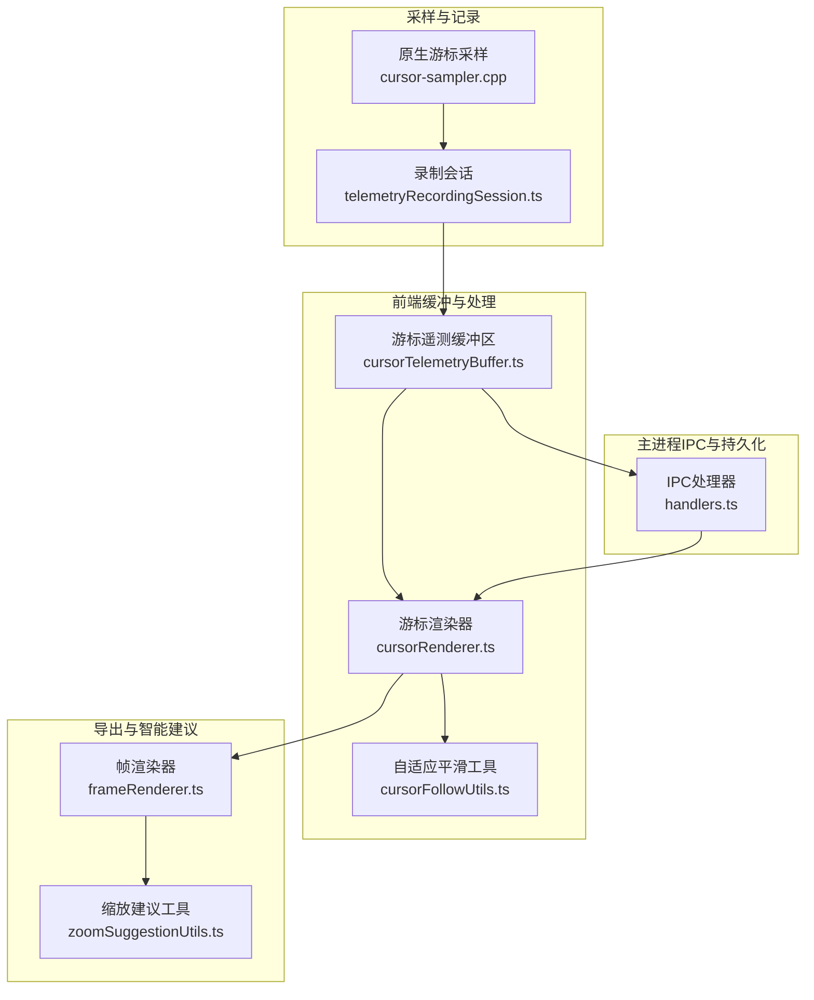
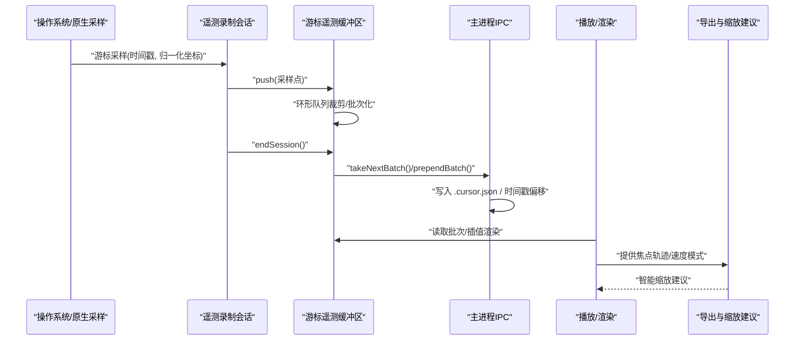
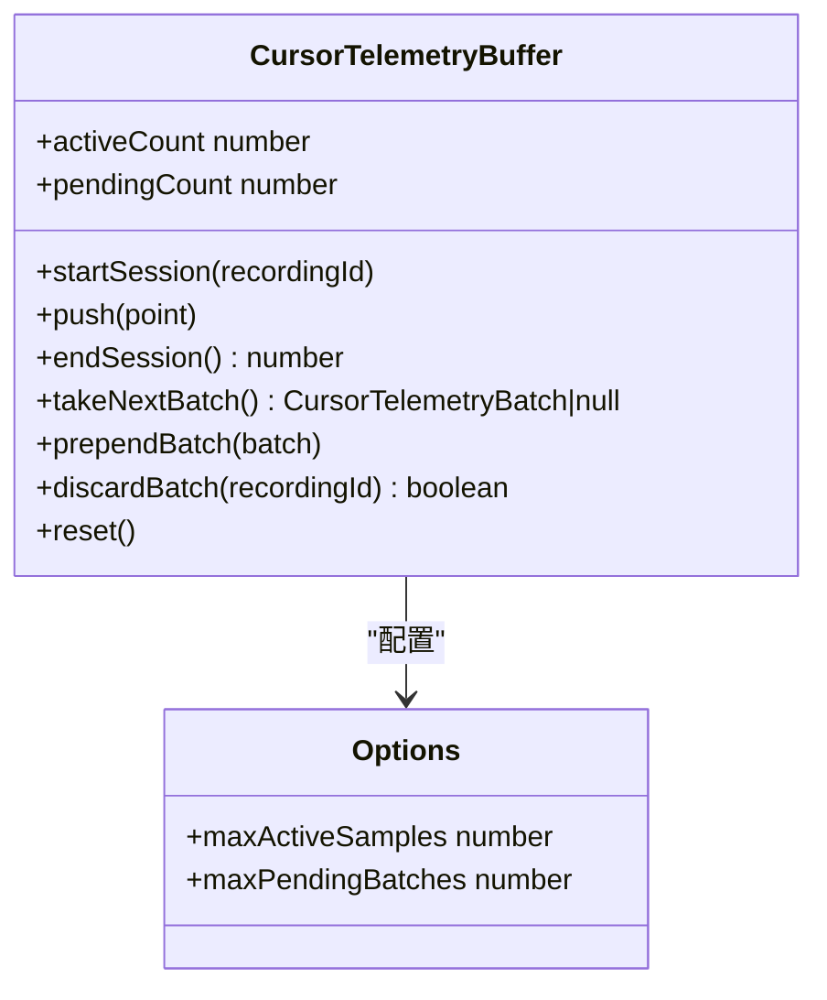
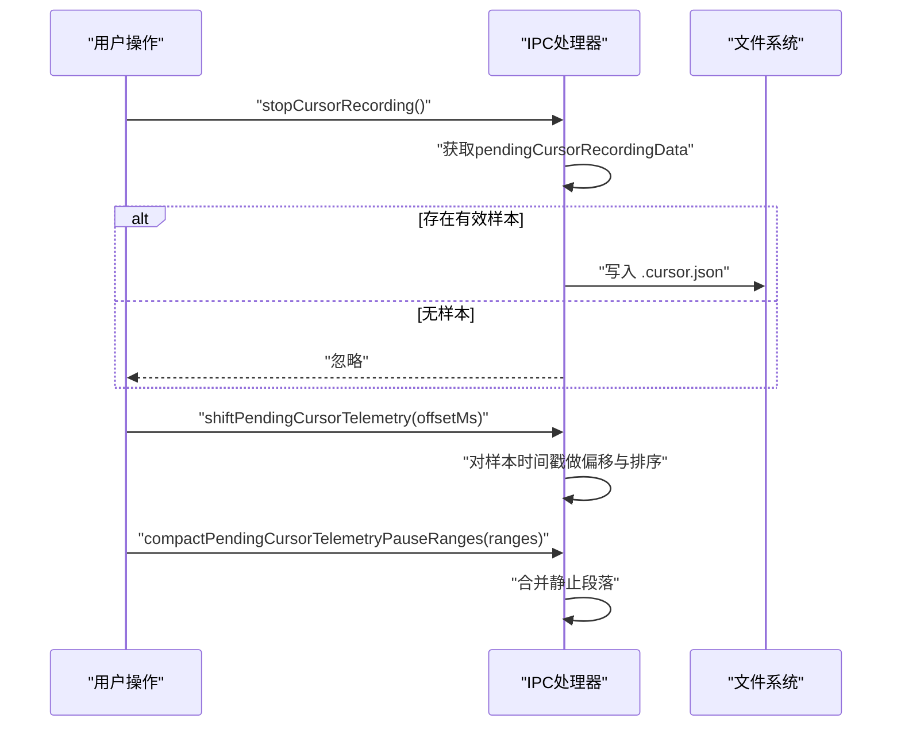
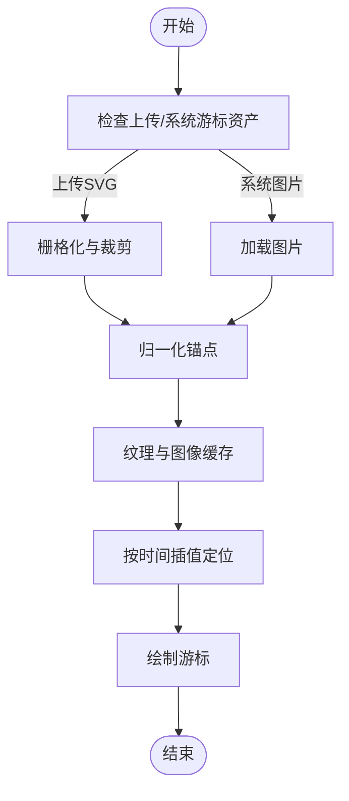
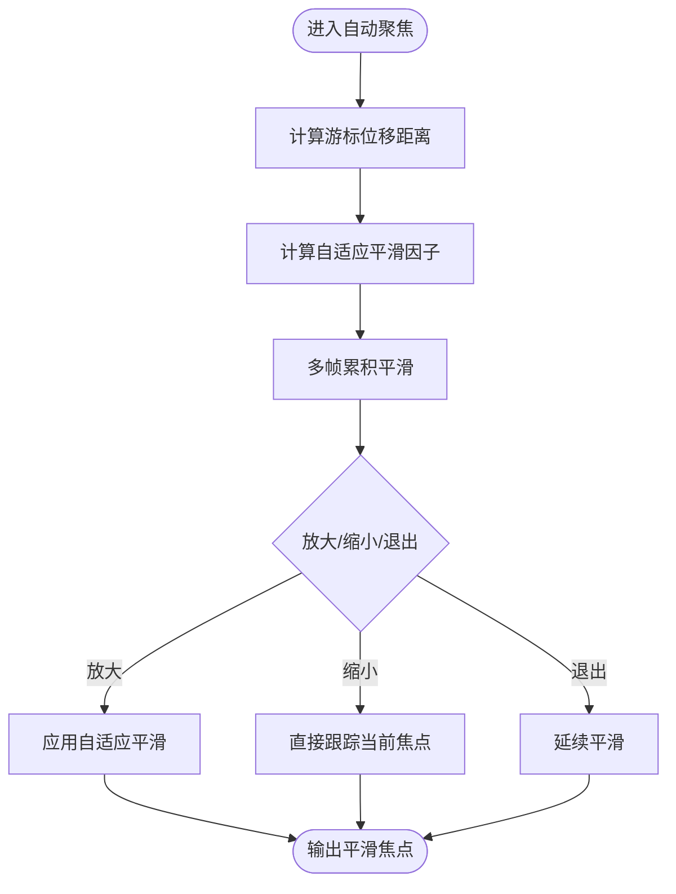
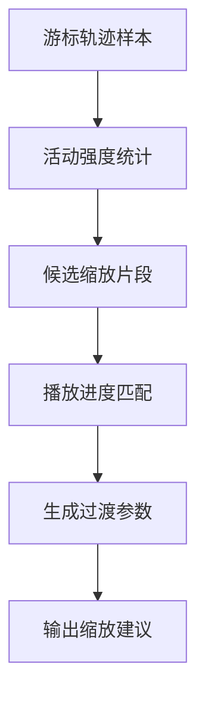
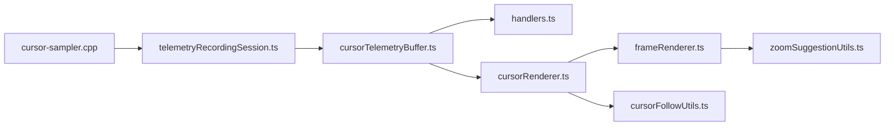

# 游标遥测系统

<cite>
**本文引用的文件**
- [cursorTelemetryBuffer.ts](file://src/lib/cursorTelemetryBuffer.ts)
- [cursorTelemetryBuffer.test.ts](file://src/lib/cursorTelemetryBuffer.test.ts)
- [handlers.ts](file://electron/ipc/handlers.ts)
- [cursorRenderer.ts](file://src/components/video-editor/videoPlayback/cursorRenderer.ts)
- [nativeCursor.ts](file://src/lib/cursor/nativeCursor.ts)
- [cursorFollowUtils.ts](file://src/components/video-editor/videoPlayback/cursorFollowUtils.ts)
- [frameRenderer.ts](file://src/lib/exporter/frameRenderer.ts)
- [VideoPlayback.tsx](file://src/components/video-editor/VideoPlayback.tsx)
- [zoomSuggestionUtils.ts](file://src/components/video-editor/timeline/zoomSuggestionUtils.ts)
</cite>

## 目录
1. [简介](#简介)
2. [项目结构](#项目结构)
3. [核心组件](#核心组件)
4. [架构总览](#架构总览)
5. [详细组件分析](#详细组件分析)
6. [依赖关系分析](#依赖关系分析)
7. [性能考量](#性能考量)
8. [故障排除指南](#故障排除指南)
9. [结论](#结论)
10. [附录](#附录)

## 简介
本文件系统性阐述 OpenScreen 的游标遥测系统：从游标位置采样、时间戳管理与坐标归一化，到缓冲区设计与内存控制，再到播放期插值渲染与导出期的智能缩放建议与自定义游标资产支持。文档同时提供性能调优建议与常见问题排查方法，帮助开发者与使用者高效理解与优化该系统。

## 项目结构
游标遥测系统横跨前端渲染层、编辑器播放层、导出层以及 Electron 主进程 IPC 层，形成“采样-缓冲-持久化-播放-导出”的完整链路。

图表来源
- [cursorTelemetryBuffer.ts:25-213](file://src/lib/cursorTelemetryBuffer.ts#L25-L213)
- [cursorRenderer.ts:197-289](file://src/components/video-editor/videoPlayback/cursorRenderer.ts#L197-L289)
- [handlers.ts:821-865](file://electron/ipc/handlers.ts#L821-L865)
- [frameRenderer.ts:799-829](file://src/lib/exporter/frameRenderer.ts#L799-L829)
- [zoomSuggestionUtils.ts](file://src/components/video-editor/timeline/zoomSuggestionUtils.ts)

章节来源
- [cursorTelemetryBuffer.ts:25-213](file://src/lib/cursorTelemetryBuffer.ts#L25-L213)
- [cursorRenderer.ts:197-289](file://src/components/video-editor/videoPlayback/cursorRenderer.ts#L197-L289)
- [handlers.ts:821-865](file://electron/ipc/handlers.ts#L821-L865)
- [frameRenderer.ts:799-829](file://src/lib/exporter/frameRenderer.ts#L799-L829)
- [zoomSuggestionUtils.ts](file://src/components/video-editor/timeline/zoomSuggestionUtils.ts)

## 核心组件
- 游标遥测缓冲区（CursorTelemetryBuffer）：负责在录制会话期间以环形队列方式存储采样点，限制活动样本数量与待处理批次数量，确保内存可控；提供批处理提取、重试前置、按录制 ID 弃用等能力。
- IPC 处理器：负责停止游标录制、写入游标遥测文件、对齐时间戳偏移、合并静止段落等。
- 游标渲染器：负责加载系统或上传的游标资产，进行 SVG 栅格化与裁剪、锚点归一化、纹理缓存与插值渲染。
- 自适应平滑工具：根据游标移动距离动态调整平滑因子，实现“远快近慢”的自然跟随曲线。
- 导出帧渲染器：在自动聚焦模式下应用自适应平滑，保证缩放过渡的顺滑与连贯。
- 缩放建议工具：为时间线提供智能缩放区域与过渡效果的建议。

章节来源
- [cursorTelemetryBuffer.ts:25-213](file://src/lib/cursorTelemetryBuffer.ts#L25-L213)
- [handlers.ts:821-865](file://electron/ipc/handlers.ts#L821-L865)
- [cursorRenderer.ts:197-289](file://src/components/video-editor/videoPlayback/cursorRenderer.ts#L197-L289)
- [cursorFollowUtils.ts:56-73](file://src/components/video-editor/videoPlayback/cursorFollowUtils.ts#L56-L73)
- [frameRenderer.ts:799-829](file://src/lib/exporter/frameRenderer.ts#L799-L829)
- [zoomSuggestionUtils.ts](file://src/components/video-editor/timeline/zoomSuggestionUtils.ts)

## 架构总览
游标遥测系统遵循“采样-缓冲-持久化-播放-导出”的分层架构。采样由原生模块完成，前端缓冲区负责限流与批处理，主进程负责持久化与时间戳校正，播放阶段进行插值与渲染，导出阶段结合智能算法生成缩放建议。

图表来源
- [cursorTelemetryBuffer.ts:139-213](file://src/lib/cursorTelemetryBuffer.ts#L139-L213)
- [handlers.ts:836-865](file://electron/ipc/handlers.ts#L836-L865)
- [cursorRenderer.ts:277-289](file://src/components/video-editor/videoPlayback/cursorRenderer.ts#L277-L289)
- [frameRenderer.ts:799-829](file://src/lib/exporter/frameRenderer.ts#L799-L829)

## 详细组件分析

### 组件A：游标遥测缓冲区（CursorTelemetryBuffer）
- 设计目标：在有限内存内可靠地保存一次录制会话的游标轨迹，支持快速丢弃与批处理消费，避免阻塞采样路径。
- 数据结构与策略：
  - 活动样本数组采用环形队列策略，超过上限时丢弃最旧样本。
  - 待处理批次队列采用 FIFO，超过上限时丢弃最老批次，并发出警告日志。
  - 支持按录制 ID 弃用特定批次，避免异步回调导致的错配。
- 关键接口契约：
  - startSession：开始新会话并清空当前活动样本。
  - push：追加样本，必要时执行环形裁剪。
  - endSession：将活动样本打包为批次并入队，必要时裁剪待处理队列。
  - takeNextBatch/prependBatch：顺序消费或重试前置。
  - discardBatch：按录制 ID 弃用对应批次。
  - reset：测试与收尾时清空状态。
- 复杂度与边界：
  - 单次 push/endSession 均摊 O(1)，批量消费 O(n)。
  - 内存上限由 maxActiveSamples 与 maxPendingBatches 双重约束。
- 测试覆盖要点：
  - 环形裁剪行为、批次容量裁剪、空会话不入队、按 ID 弃用正确性、重试前置的 FIFO 保持。

图表来源
- [cursorTelemetryBuffer.ts:40-118](file://src/lib/cursorTelemetryBuffer.ts#L40-L118)
- [cursorTelemetryBuffer.ts:139-213](file://src/lib/cursorTelemetryBuffer.ts#L139-L213)

章节来源
- [cursorTelemetryBuffer.ts:25-213](file://src/lib/cursorTelemetryBuffer.ts#L25-L213)
- [cursorTelemetryBuffer.test.ts:11-161](file://src/lib/cursorTelemetryBuffer.test.ts#L11-L161)

### 组件B：IPC 处理与游标遥测持久化
- 功能职责：
  - 停止游标录制会话并获取待处理数据。
  - 将游标遥测写入与视频文件同名的 .cursor.json 文件。
  - 对齐时间戳偏移，保证与视频起始时间一致。
  - 合并静止段落，减少冗余数据。
- 关键流程：
  - 停止录制后，若存在有效样本则序列化写入；随后清空待处理数据。
  - 时间戳偏移仅接受合法正值，且对每个样本进行下限钳制。
  - 静止段落合并用于去除无效区间，提升后续播放与导出效率。

图表来源
- [handlers.ts:821-865](file://electron/ipc/handlers.ts#L821-L865)

章节来源
- [handlers.ts:821-865](file://electron/ipc/handlers.ts#L821-L865)

### 组件C：游标渲染与自定义资产支持
- 资产来源与优先级：
  - 上传的 SVG 游标：先栅格化再裁剪，支持热区归一化与锚点修正。
  - 系统游标：直接加载图片，计算归一化锚点。
  - 降级回退：若关键资产缺失，抛出初始化失败错误。
- 渲染流程：
  - 并行加载多种游标类型，构建纹理与图像缓存。
  - 插值函数根据给定时间在两个最近样本间线性插值，得到平滑轨迹。
- 性能优化：
  - 使用 Assets.load 与纹理缓存避免重复加载。
  - 锚点归一化确保不同尺寸与 DPI 下的一致表现。

图表来源
- [cursorRenderer.ts:197-289](file://src/components/video-editor/videoPlayback/cursorRenderer.ts#L197-L289)

章节来源
- [cursorRenderer.ts:197-289](file://src/components/video-editor/videoPlayback/cursorRenderer.ts#L197-L289)

### 组件D：自适应平滑与自动聚焦
- 自适应平滑：
  - 根据游标当前位置与上一帧位置的距离，计算平滑因子，距离越远平滑越弱，越近越强。
  - 多帧累积平滑，避免单帧抖动。
- 自动聚焦模式：
  - 全程放大：应用自适应平滑，保证“远快近慢”的自然跟随。
  - 缩放中：保持连续性，避免突变；全放大瞬间同步当前焦点。
  - 缩放退出：延续平滑，避免开头跳变。

图表来源
- [cursorFollowUtils.ts:56-73](file://src/components/video-editor/videoPlayback/cursorFollowUtils.ts#L56-L73)
- [VideoPlayback.tsx:1346-1385](file://src/components/video-editor/VideoPlayback.tsx#L1346-L1385)
- [frameRenderer.ts:799-829](file://src/lib/exporter/frameRenderer.ts#L799-L829)

章节来源
- [cursorFollowUtils.ts:56-73](file://src/components/video-editor/videoPlayback/cursorFollowUtils.ts#L56-L73)
- [VideoPlayback.tsx:1346-1385](file://src/components/video-editor/VideoPlayback.tsx#L1346-L1385)
- [frameRenderer.ts:799-829](file://src/lib/exporter/frameRenderer.ts#L799-L829)

### 组件E：智能缩放建议算法
- 输入：游标轨迹样本（时间戳、归一化坐标）、播放进度与缩放状态。
- 输出：建议的缩放区域与过渡效果，使观看者聚焦于游标活动频繁的区域。
- 实现思路（概念性）：
  - 计算游标速度与加速度，识别高密度活动区间。
  - 基于时间窗口统计活动强度，生成候选缩放片段。
  - 结合播放器当前进度与缩放阈值，选择最优片段并生成过渡动画参数。
- 注意：具体实现位于时间线工具模块，本文提供概念性说明与调用关系。

图表来源
- [zoomSuggestionUtils.ts](file://src/components/video-editor/timeline/zoomSuggestionUtils.ts)

章节来源
- [zoomSuggestionUtils.ts](file://src/components/video-editor/timeline/zoomSuggestionUtils.ts)

## 依赖关系分析
- 采样层与缓冲层：原生采样通过遥测录制会话写入前端缓冲区，缓冲区决定样本保留策略与批次产出节奏。
- 缓冲层与 IPC 层：缓冲区的批次通过 IPC 写入磁盘，主进程负责持久化与时间戳校正。
- 渲染层与缓冲层：播放阶段从缓冲区读取批次并进行插值渲染，依赖归一化坐标与时间戳。
- 导出层与渲染层：导出阶段读取渲染焦点轨迹，结合智能算法生成缩放建议。
- 自适应平滑与渲染：平滑工具与播放组件协同，保证自动聚焦的顺滑体验。

图表来源
- [cursorTelemetryBuffer.ts:139-213](file://src/lib/cursorTelemetryBuffer.ts#L139-L213)
- [handlers.ts:836-865](file://electron/ipc/handlers.ts#L836-L865)
- [cursorRenderer.ts:277-289](file://src/components/video-editor/videoPlayback/cursorRenderer.ts#L277-L289)
- [frameRenderer.ts:799-829](file://src/lib/exporter/frameRenderer.ts#L799-L829)
- [cursorFollowUtils.ts:56-73](file://src/components/video-editor/videoPlayback/cursorFollowUtils.ts#L56-L73)
- [zoomSuggestionUtils.ts](file://src/components/video-editor/timeline/zoomSuggestionUtils.ts)

章节来源
- [cursorTelemetryBuffer.ts:139-213](file://src/lib/cursorTelemetryBuffer.ts#L139-L213)
- [handlers.ts:836-865](file://electron/ipc/handlers.ts#L836-L865)
- [cursorRenderer.ts:277-289](file://src/components/video-editor/videoPlayback/cursorRenderer.ts#L277-L289)
- [frameRenderer.ts:799-829](file://src/lib/exporter/frameRenderer.ts#L799-L829)
- [cursorFollowUtils.ts:56-73](file://src/components/video-editor/videoPlayback/cursorFollowUtils.ts#L56-L73)
- [zoomSuggestionUtils.ts](file://src/components/video-editor/timeline/zoomSuggestionUtils.ts)

## 性能考量
- 缓冲区参数调优：
  - maxActiveSamples：影响轨迹平滑度与内存占用，建议根据目标帧率与典型移动速度设定。
  - maxPendingBatches：影响后台积压容忍度，过大可能造成内存压力，过小可能导致丢批。
- 渲染优化：
  - 提前加载与缓存纹理，避免重复解码与上传。
  - SVG 上传游标应控制尺寸与裁剪范围，减少栅格化成本。
- 导出阶段：
  - 在自动聚焦模式下启用自适应平滑，减少抖动与突变带来的额外渲染负担。
  - 合理设置缩放阈值与过渡时长，平衡流畅度与视觉冲击。
- 时间戳与静止段落：
  - 使用时间戳偏移统一起点，避免播放器内部补偿开销。
  - 合并静止段落可显著降低样本数量，提升后续处理效率。

## 故障排除指南
- 样本为空或未入队：
  - 确认 endSession 是否被调用，空会话不会入队。
  - 检查 startSession 是否被多次调用导致活动样本被清空。
- 批次被丢弃：
  - 观察控制台警告，确认 maxPendingBatches 是否过小。
  - 调整写入频率或增加上限以缓解积压。
- 插值结果异常：
  - 检查时间戳是否单调递增，确保样本已排序。
  - 确认时间戳偏移逻辑未将样本置为负值。
- 渲染游标缺失：
  - 检查上传的 SVG 是否成功栅格化与裁剪。
  - 确认系统游标资源是否存在，必要时回退到箭头游标。
- 自动聚焦抖动：
  - 调整自适应平滑参数与 rampDistance，使曲线更平滑。
  - 在缩放切换瞬间同步焦点，避免突变。

章节来源
- [cursorTelemetryBuffer.ts:160-177](file://src/lib/cursorTelemetryBuffer.ts#L160-L177)
- [handlers.ts:844-858](file://electron/ipc/handlers.ts#L844-L858)
- [cursorRenderer.ts:277-289](file://src/components/video-editor/videoPlayback/cursorRenderer.ts#L277-L289)
- [cursorFollowUtils.ts:56-73](file://src/components/video-editor/videoPlayback/cursorFollowUtils.ts#L56-L73)

## 结论
OpenScreen 的游标遥测系统通过“原生采样-前端缓冲-主进程持久化-播放渲染-导出建议”的分层设计，在保证实时性与内存安全的同时，提供了高质量的游标轨迹可视化与智能缩放体验。合理配置缓冲区参数、优化渲染路径与启用自适应平滑，是获得稳定性能与良好观感的关键。

## 附录
- 数据模型与字段
  - 采样点：包含时间戳（毫秒）、归一化 X/Y 坐标。
  - 批次：包含录制 ID 与样本数组。
  - 渲染资产：包含纹理、图像、宽高与归一化锚点。
- 关键常量与阈值（示例性说明）
  - 自动跟随平滑因子范围与距离阈值，用于调节“远快近慢”曲线。
  - 缩放建议阈值与过渡时长，用于生成合适的缩放片段。