# 游标遥测系统

<cite>
**本文引用的文件**
- [cursorTelemetryBuffer.ts](file://src/lib/cursorTelemetryBuffer.ts)
- [cursorTelemetryBuffer.test.ts](file://src/lib/cursorTelemetryBuffer.test.ts)
- [handlers.ts](file://electron/ipc/handlers.ts)
- [cursorRenderer.ts](file://src/components/video-editor/videoPlayback/cursorRenderer.ts)
- [motionSmoothing.ts](file://src/components/video-editor/videoPlayback/motionSmoothing.ts)
- [cursorFollowUtils.ts](file://src/components/video-editor/videoPlayback/cursorFollowUtils.ts)
- [SettingsPanel.tsx](file://src/components/video-editor/SettingsPanel.tsx)
- [VideoEditor.tsx](file://src/components/video-editor/VideoEditor.tsx)
- [zoomSuggestionUtils.ts](file://src/components/video-editor/timeline/zoomSuggestionUtils.ts)
- [frameRenderer.ts](file://src/lib/exporter/frameRenderer.ts)
- [uploadedCursorAssets.ts](file://src/components/video-editor/videoPlayback/uploadedCursorAssets.ts)
- [types.ts](file://src/lib/demobuilder/types.ts)
- [DemoFrameView.tsx](file://src/components/demo-builder/DemoFrameView.tsx)
- [DemoSidebar.tsx](file://src/components/demo-builder/DemoSidebar.tsx)
</cite>

## 更新摘要
**所做更改**
- 新增自定义光标样式系统章节，详细介绍5种内置光标样式（default, hand, cross, text, open-hand）的支持
- 更新游标渲染器实现，支持系统游标与上传游标的统一管理
- 新增演示构建器中的光标样式选择界面
- 更新架构图，展示自定义光标样式的完整集成路径

## 目录
1. [简介](#简介)
2. [项目结构](#项目结构)
3. [核心组件](#核心组件)
4. [架构总览](#架构总览)
5. [详细组件分析](#详细组件分析)
6. [依赖关系分析](#依赖关系分析)
7. [性能考量](#性能考量)
8. [故障排除指南](#故障排除指南)
9. [结论](#结论)
10. [附录](#附录)

## 简介
本文件系统性阐述 OpenScreen 的游标遥测系统：从游标位置采样、时间戳管理与坐标归一化，到缓冲区设计与内存控制，再到播放期插值渲染、智能缩放建议与自定义游标资产支持。系统现已统一集成游标路径平滑系统、游标主题系统、自动缩放建议工具和自定义光标样式系统，提供完整的游标轨迹可视化解决方案。文档同时提供性能调优建议与常见问题排查方法，帮助开发者与使用者高效理解与优化该系统。

## 项目结构
游标遥测系统横跨前端渲染层、编辑器播放层、导出层、演示构建器以及 Electron 主进程 IPC 层，形成"采样-缓冲-持久化-播放-导出-演示"的完整链路。新增功能包括游标路径平滑、主题系统、自动缩放建议和自定义光标样式系统，所有功能现在统一集成到游标遥测系统中。

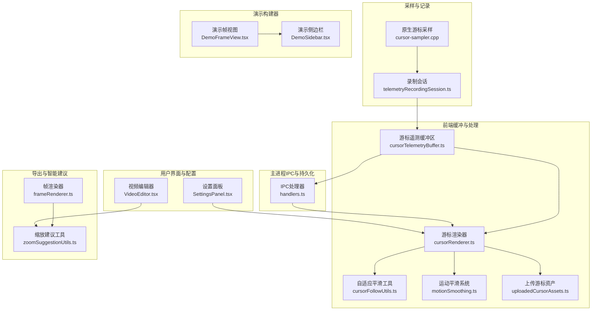

**图表来源**
- [cursorTelemetryBuffer.ts:25-213](file://src/lib/cursorTelemetryBuffer.ts#L25-L213)
- [cursorRenderer.ts:197-289](file://src/components/video-editor/videoPlayback/cursorRenderer.ts#L197-L289)
- [handlers.ts:821-865](file://electron/ipc/handlers.ts#L821-L865)
- [frameRenderer.ts:799-829](file://src/lib/exporter/frameRenderer.ts#L799-L829)
- [zoomSuggestionUtils.ts](file://src/components/video-editor/timeline/zoomSuggestionUtils.ts)
- [motionSmoothing.ts:123-149](file://src/components/video-editor/videoPlayback/motionSmoothing.ts#L123-L149)
- [cursorFollowUtils.ts:98-114](file://src/components/video-editor/videoPlayback/cursorFollowUtils.ts#L98-L114)
- [SettingsPanel.tsx:1595-1708](file://src/components/video-editor/SettingsPanel.tsx#L1595-L1708)
- [VideoEditor.tsx:1112-1186](file://src/components/video-editor/VideoEditor.tsx#L1112-L1186)
- [uploadedCursorAssets.ts:29-70](file://src/components/video-editor/videoPlayback/uploadedCursorAssets.ts#L29-L70)
- [DemoFrameView.tsx:35-44](file://src/components/demo-builder/DemoFrameView.tsx#L35-L44)
- [DemoSidebar.tsx:22-28](file://src/components/demo-builder/DemoSidebar.tsx#L22-L28)

**章节来源**
- [cursorTelemetryBuffer.ts:25-213](file://src/lib/cursorTelemetryBuffer.ts#L25-L213)
- [cursorRenderer.ts:197-289](file://src/components/video-editor/videoPlayback/cursorRenderer.ts#L197-L289)
- [handlers.ts:821-865](file://electron/ipc/handlers.ts#L821-L865)
- [frameRenderer.ts:799-829](file://src/lib/exporter/frameRenderer.ts#L799-L829)
- [zoomSuggestionUtils.ts](file://src/components/video-editor/timeline/zoomSuggestionUtils.ts)
- [motionSmoothing.ts:123-149](file://src/components/video-editor/videoPlayback/motionSmoothing.ts#L123-L149)
- [cursorFollowUtils.ts:98-114](file://src/components/video-editor/videoPlayback/cursorFollowUtils.ts#L98-L114)
- [SettingsPanel.tsx:1595-1708](file://src/components/video-editor/SettingsPanel.tsx#L1595-L1708)
- [VideoEditor.tsx:1112-1186](file://src/components/video-editor/VideoEditor.tsx#L1112-L1186)
- [uploadedCursorAssets.ts:29-70](file://src/components/video-editor/videoPlayback/uploadedCursorAssets.ts#L29-L70)
- [DemoFrameView.tsx:35-44](file://src/components/demo-builder/DemoFrameView.tsx#L35-L44)
- [DemoSidebar.tsx:22-28](file://src/components/demo-builder/DemoSidebar.tsx#L22-L28)

## 核心组件
- **游标遥测缓冲区（CursorTelemetryBuffer）**：负责在录制会话期间以环形队列方式存储采样点，限制活动样本数量与待处理批次数量，确保内存可控；提供批处理提取、重试前置、按录制 ID 弃用等能力。
- **IPC 处理器**：负责停止游标录制、写入游标遥测文件、对齐时间戳偏移、合并静止段落等。
- **游标渲染器**：负责加载系统或上传的游标资产，进行 SVG 栅格化与裁剪、锚点归一化、纹理缓存与插值渲染，支持运动模糊和点击弹跳效果。
- **上传游标资产管理**：管理5种内置光标样式的SVG资源，包括箭头、文本、手型、十字准星和张开的手型光标。
- **演示构建器光标系统**：提供演示模式下的光标样式选择界面，支持default、hand、cross、text、open-hand五种样式。
- **运动平滑系统**：基于弹簧物理的高级平滑算法，提供自适应阻尼和质量系统，实现更自然的游标跟随效果。
- **自适应平滑工具**：根据游标移动距离动态调整平滑因子，实现"远快近慢"的自然跟随曲线。
- **游标主题系统**：支持多种游标主题选择，包括系统默认主题和自定义主题配置。
- **自动缩放建议工具**：基于游标停留模式检测智能生成缩放区域建议。
- **导出帧渲染器**：在自动聚焦模式下应用自适应平滑，保证缩放过渡的顺滑与连贯。

**章节来源**
- [cursorTelemetryBuffer.ts:25-213](file://src/lib/cursorTelemetryBuffer.ts#L25-L213)
- [handlers.ts:821-865](file://electron/ipc/handlers.ts#L821-L865)
- [cursorRenderer.ts:197-289](file://src/components/video-editor/videoPlayback/cursorRenderer.ts#L197-L289)
- [uploadedCursorAssets.ts:29-70](file://src/components/video-editor/videoPlayback/uploadedCursorAssets.ts#L29-L70)
- [types.ts:87-95](file://src/lib/demobuilder/types.ts#L87-L95)
- [motionSmoothing.ts:123-149](file://src/components/video-editor/videoPlayback/motionSmoothing.ts#L123-L149)
- [cursorFollowUtils.ts:56-73](file://src/components/video-editor/videoPlayback/cursorFollowUtils.ts#L56-L73)
- [SettingsPanel.tsx:1595-1708](file://src/components/video-editor/SettingsPanel.tsx#L1595-L1708)
- [VideoEditor.tsx:1112-1186](file://src/components/video-editor/VideoEditor.tsx#L1112-L1186)
- [frameRenderer.ts:799-829](file://src/lib/exporter/frameRenderer.ts#L799-L829)
- [zoomSuggestionUtils.ts](file://src/components/video-editor/timeline/zoomSuggestionUtils.ts)

## 架构总览
游标遥测系统遵循"采样-缓冲-持久化-播放-导出-演示"的分层架构。采样由原生模块完成，前端缓冲区负责限流与批处理，主进程负责持久化与时间戳校正，播放阶段进行插值与渲染，导出阶段结合智能算法生成缩放建议，演示构建器提供独立的光标样式选择功能。所有功能现已统一集成到游标遥测系统中。

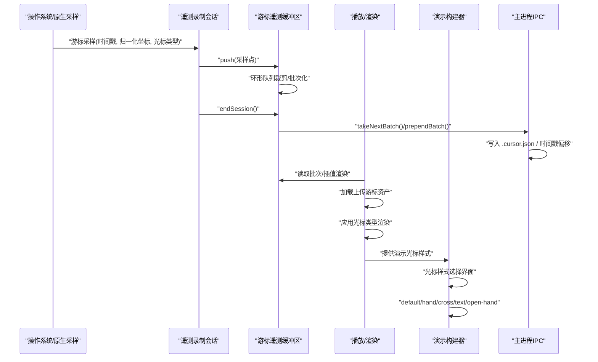

**图表来源**
- [cursorTelemetryBuffer.ts:139-213](file://src/lib/cursorTelemetryBuffer.ts#L139-L213)
- [cursorRenderer.ts:172-268](file://src/components/video-editor/videoPlayback/cursorRenderer.ts#L172-L268)
- [DemoFrameView.tsx:35-44](file://src/components/demo-builder/DemoFrameView.tsx#L35-L44)
- [DemoSidebar.tsx:22-28](file://src/components/demo-builder/DemoSidebar.tsx#L22-L28)
- [handlers.ts:836-865](file://electron/ipc/handlers.ts#L836-L865)

## 详细组件分析

### 组件A：游标遥测缓冲区（CursorTelemetryBuffer）
- **设计目标**：在有限内存内可靠地保存一次录制会话的游标轨迹，支持快速丢弃与批处理消费，避免阻塞采样路径。
- **数据结构与策略**：
  - 活动样本数组采用环形队列策略，超过上限时丢弃最旧样本。
  - 待处理批次队列采用 FIFO，超过上限时丢弃最老批次，并发出警告日志。
  - 支持按录制 ID 弃用特定批次，避免异步回调导致的错配。
- **关键接口契约**：
  - startSession：开始新会话并清空当前活动样本。
  - push：追加样本，必要时执行环形裁剪。
  - endSession：将活动样本打包为批次并入队，必要时裁剪待处理队列。
  - takeNextBatch/prependBatch：顺序消费或重试前置。
  - discardBatch：按录制 ID 弃用对应批次。
  - reset：测试与收尾时清空状态。
- **复杂度与边界**：
  - 单次 push/endSession 均摊 O(1)，批量消费 O(n)。
  - 内存上限由 maxActiveSamples 与 maxPendingBatches 双重约束。
- **测试覆盖要点**：
  - 环形裁剪行为、批次容量裁剪、空会话不入队、按 ID 弃用正确性、重试前置的 FIFO 保持。

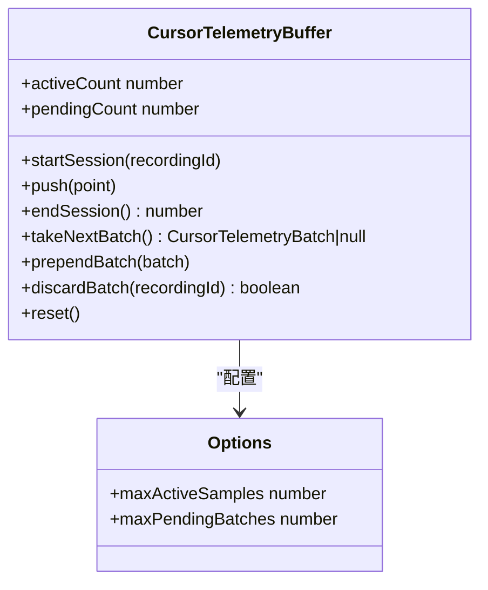

**图表来源**
- [cursorTelemetryBuffer.ts:40-118](file://src/lib/cursorTelemetryBuffer.ts#L40-L118)
- [cursorTelemetryBuffer.ts:139-213](file://src/lib/cursorTelemetryBuffer.ts#L139-L213)

**章节来源**
- [cursorTelemetryBuffer.ts:25-213](file://src/lib/cursorTelemetryBuffer.ts#L25-L213)
- [cursorTelemetryBuffer.test.ts:11-161](file://src/lib/cursorTelemetryBuffer.test.ts#L11-L161)

### 组件B：IPC 处理与游标遥测持久化
- **功能职责**：
  - 停止游标录制会话并获取待处理数据。
  - 将游标遥测写入与视频文件同名的 .cursor.json 文件。
  - 对齐时间戳偏移，保证与视频起始时间一致。
  - 合并静止段落，减少冗余数据。
- **关键流程**：
  - 停止录制后，若存在有效样本则序列化写入；随后清空待处理数据。
  - 时间戳偏移仅接受合法正值，且对每个样本进行下限钳制。
  - 静止段落合并用于去除无效区间，提升后续播放与导出效率。

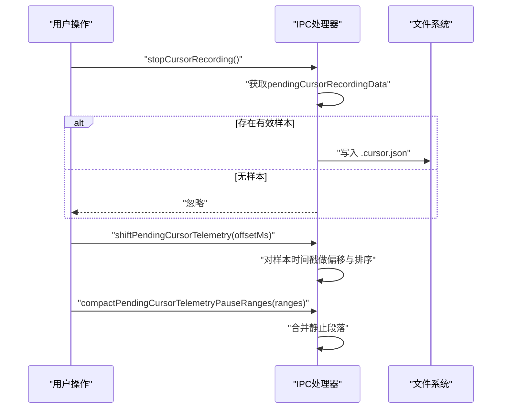

**图表来源**
- [handlers.ts:821-865](file://electron/ipc/handlers.ts#L821-L865)

**章节来源**
- [handlers.ts:821-865](file://electron/ipc/handlers.ts#L821-L865)

### 组件C：游标渲染与自定义资产支持
- **资产来源与优先级**：
  - 上传的 SVG 游标：先栅格化再裁剪，支持热区归一化与锚点修正。
  - 系统游标：直接加载图片，计算归一化锚点。
  - 降级回退：若关键资产缺失，抛出初始化失败错误。
- **渲染流程**：
  - 并行加载多种游标类型，构建纹理与图像缓存。
  - 插值函数根据给定时间在两个最近样本间线性插值，得到平滑轨迹。
  - 根据游标类型选择对应的渲染资产，支持default、hand、cross、text、open-hand等样式。
- **性能优化**：
  - 使用 Assets.load 与纹理缓存避免重复加载。
  - 锚点归一化确保不同尺寸与 DPI 下的一致表现。
- **新增功能**：
  - 运动模糊效果：基于方向的运动模糊滤镜，增强动态效果。
  - 点击弹跳动画：模拟鼠标点击时的弹性效果。
  - 阴影效果：为游标添加柔和阴影，提升视觉层次。

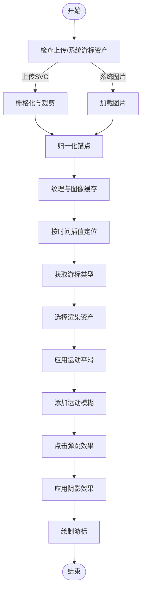

**图表来源**
- [cursorRenderer.ts:197-289](file://src/components/video-editor/videoPlayback/cursorRenderer.ts#L197-L289)
- [cursorRenderer.ts:348-386](file://src/components/video-editor/videoPlayback/cursorRenderer.ts#L348-L386)
- [motionSmoothing.ts:123-149](file://src/components/video-editor/videoPlayback/motionSmoothing.ts#L123-L149)

**章节来源**
- [cursorRenderer.ts:197-289](file://src/components/video-editor/videoPlayback/cursorRenderer.ts#L197-L289)
- [uploadedCursorAssets.ts:29-70](file://src/components/video-editor/videoPlayback/uploadedCursorAssets.ts#L29-L70)

### 组件D：上传游标资产管理系统
- **支持的光标样式**：
  - 箭头光标（arrow）：系统默认光标样式
  - 文本光标（text）：文本选择光标样式
  - 手型光标（pointer/hand）：点击悬停光标样式
  - 十字准星（crosshair）：精确选择光标样式
  - 张开的手型（open-hand）：抓取状态光标样式
  - 抓握的手型（closed-hand）：拖拽状态光标样式
  - 东西向调整（resize-ew）：水平调整光标样式
  - 南北向调整（resize-ns）：垂直调整光标样式
  - 禁止（not-allowed）：不可操作光标样式
- **资源配置**：
  - 每种光标样式包含SVG URL、裁剪区域和回退锚点
  - 支持1024×1024像素的高分辨率采样
  - 提供精确的热区坐标和归一化锚点
- **加载机制**：
  - 异步加载SVG资源并进行栅格化处理
  - 自动计算纹理尺寸和纵横比
  - 构建完整的游标资产缓存

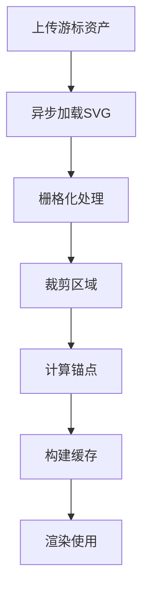

**图表来源**
- [uploadedCursorAssets.ts:29-70](file://src/components/video-editor/videoPlayback/uploadedCursorAssets.ts#L29-L70)
- [cursorRenderer.ts:172-268](file://src/components/video-editor/videoPlayback/cursorRenderer.ts#L172-L268)

**章节来源**
- [uploadedCursorAssets.ts:29-70](file://src/components/video-editor/videoPlayback/uploadedCursorAssets.ts#L29-L70)
- [cursorRenderer.ts:172-268](file://src/components/video-editor/videoPlayback/cursorRenderer.ts#L172-L268)

### 组件E：演示构建器光标样式系统
- **光标样式选择界面**：
  - 提供5种内置光标样式的图标选择
  - 支持default、hand、cross、text、open-hand样式
  - 实时预览光标样式在演示中的效果
- **样式映射机制**：
  - default：使用系统默认光标
  - hand：指向手型光标
  - cross：十字准星光标
  - text：文本选择光标
  - open-hand：张开的手型光标
- **演示渲染**：
  - 基于DemoFrameView组件渲染光标
  - 支持drop-shadow滤镜增强视觉效果
  - 动态切换光标样式不影响演示性能

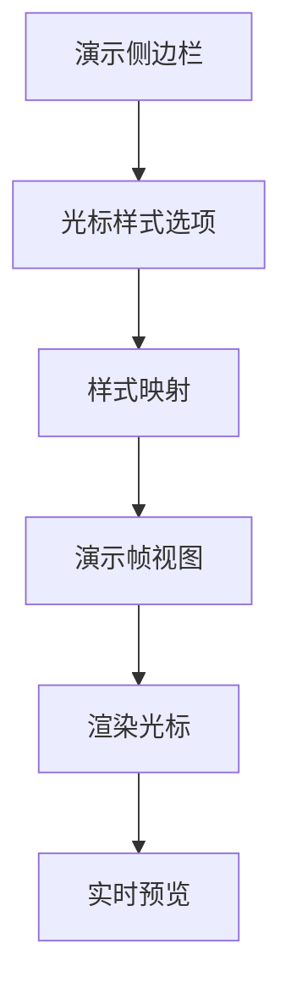

**图表来源**
- [DemoSidebar.tsx:22-28](file://src/components/demo-builder/DemoSidebar.tsx#L22-L28)
- [DemoFrameView.tsx:35-44](file://src/components/demo-builder/DemoFrameView.tsx#L35-L44)
- [types.ts:87-95](file://src/lib/demobuilder/types.ts#L87-L95)

**章节来源**
- [DemoSidebar.tsx:22-28](file://src/components/demo-builder/DemoSidebar.tsx#L22-L28)
- [DemoFrameView.tsx:35-44](file://src/components/demo-builder/DemoFrameView.tsx#L35-L44)
- [types.ts:87-95](file://src/lib/demobuilder/types.ts#L87-L95)

### 组件F：运动平滑系统
- **自适应平滑算法**：
  - 基于游标当前位置与上一帧位置的距离，计算平滑因子，距离越远平滑越弱，越近越强。
  - 使用弹簧物理系统，提供阻尼、刚度和质量的精确控制。
  - 支持多帧累积平滑，避免单帧抖动。
- **弹簧配置**：
  - 阻尼系数：58 到 80，平衡响应速度与稳定性。
  - 刚度系数：340 到 160，控制恢复力大小。
  - 质量参数：1.0 到 1.35，影响惯性效果。
- **缩放弹簧系统**：
  - 专门针对缩放操作的弹簧配置，提供更顺滑的缩放过渡。
  - 阻尼：40，刚度：320，质量：0.92。

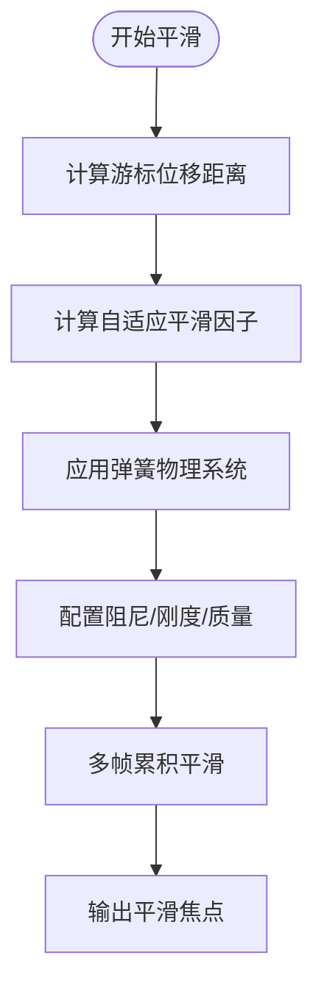

**图表来源**
- [cursorFollowUtils.ts:98-114](file://src/components/video-editor/videoPlayback/cursorFollowUtils.ts#L98-L114)
- [motionSmoothing.ts:123-149](file://src/components/video-editor/videoPlayback/motionSmoothing.ts#L123-L149)

**章节来源**
- [cursorFollowUtils.ts:56-73](file://src/components/video-editor/videoPlayback/cursorFollowUtils.ts#L56-L73)
- [motionSmoothing.ts:123-149](file://src/components/video-editor/videoPlayback/motionSmoothing.ts#L123-L149)

### 组件G：游标主题系统
- **主题配置**：
  - 支持多种游标主题选择，包括系统默认主题和自定义主题。
  - 每个主题包含颜色、透明度、半径等视觉属性配置。
  - 实时预览功能，允许用户在编辑器中即时查看主题效果。
- **用户界面**：
  - 设置面板提供直观的主题选择界面。
  - 支持滑块调节平滑度、运动模糊和点击弹跳强度。
  - 主题选项卡片显示预览效果和当前选中状态。
- **配置参数**：
  - 游标半径：0.5 到 10 倍参考尺寸。
  - 平滑度：0% 到 100%，控制跟随响应。
  - 运动模糊：0% 到 100%，增强动态效果。
  - 点击弹跳：0 到 5 倍强度，模拟真实点击反馈。

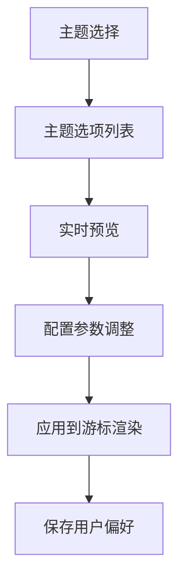

**图表来源**
- [SettingsPanel.tsx:1595-1708](file://src/components/video-editor/SettingsPanel.tsx#L1595-L1708)

**章节来源**
- [SettingsPanel.tsx:1595-1708](file://src/components/video-editor/SettingsPanel.tsx#L1595-L1708)

### 组件H：自动缩放建议工具
- **智能缩放检测**：
  - 基于游标停留模式检测高价值内容区域。
  - 分析游标移动速度和停留时间，识别重要交互时刻。
  - 使用时间窗口统计活动强度，生成候选缩放片段。
- **缩放建议算法**：
  - 最小停留时间：450ms 到 2600ms。
  - 移动阈值：0.02 归一化单位。
  - 建议间隔：1800ms，避免过度缩放。
  - 候选区域排序：按停留时长和活动强度综合评分。
- **集成应用**：
  - 视频编辑器自动建议缩放区域。
  - 支持魔法棒工具手动触发缩放建议。
  - 与现有缩放区域系统无缝集成。

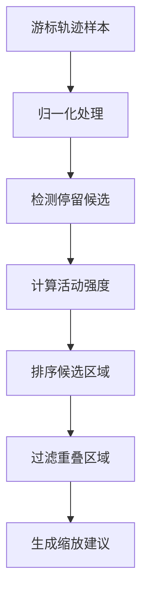

**图表来源**
- [zoomSuggestionUtils.ts:1-127](file://src/components/video-editor/timeline/zoomSuggestionUtils.ts#L1-L127)
- [VideoEditor.tsx:1112-1186](file://src/components/video-editor/VideoEditor.tsx#L1112-L1186)

**章节来源**
- [zoomSuggestionUtils.ts:1-127](file://src/components/video-editor/timeline/zoomSuggestionUtils.ts#L1-L127)
- [VideoEditor.tsx:1112-1186](file://src/components/video-editor/VideoEditor.tsx#L1112-L1186)

## 依赖关系分析
- **采样层与缓冲层**：原生采样通过遥测录制会话写入前端缓冲区，缓冲区决定样本保留策略与批次产出节奏。
- **缓冲层与 IPC 层**：缓冲区的批次通过 IPC 写入磁盘，主进程负责持久化与时间戳校正。
- **渲染层与缓冲层**：播放阶段从缓冲区读取批次并进行插值渲染，依赖归一化坐标与时间戳。
- **渲染层与资产层**：游标渲染器依赖上传游标资产管理系统提供的SVG资源。
- **演示层与渲染层**：演示构建器通过DemoFrameView组件使用相同的游标渲染逻辑。
- **运动平滑系统**：与渲染层深度集成，提供高级平滑算法支持。
- **主题系统**：通过设置面板与渲染器交互，实时应用主题配置。
- **自动缩放系统**：与导出层和编辑器集成，提供智能缩放建议。
- **导出层与渲染层**：导出阶段读取渲染焦点轨迹，结合智能算法生成缩放建议。

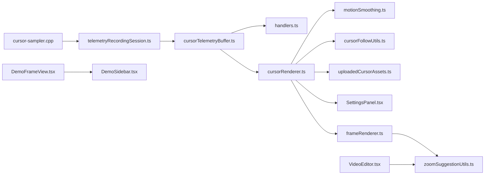

**图表来源**
- [cursorTelemetryBuffer.ts:139-213](file://src/lib/cursorTelemetryBuffer.ts#L139-L213)
- [cursorRenderer.ts:172-268](file://src/components/video-editor/videoPlayback/cursorRenderer.ts#L172-L268)
- [handlers.ts:836-865](file://electron/ipc/handlers.ts#L836-L865)
- [motionSmoothing.ts:123-149](file://src/components/video-editor/videoPlayback/motionSmoothing.ts#L123-L149)
- [cursorFollowUtils.ts:56-73](file://src/components/video-editor/videoPlayback/cursorFollowUtils.ts#L56-L73)
- [frameRenderer.ts:799-829](file://src/lib/exporter/frameRenderer.ts#L799-L829)
- [cursorFollowUtils.ts:56-73](file://src/components/video-editor/videoPlayback/cursorFollowUtils.ts#L56-L73)
- [zoomSuggestionUtils.ts](file://src/components/video-editor/timeline/zoomSuggestionUtils.ts)
- [SettingsPanel.tsx:1595-1708](file://src/components/video-editor/SettingsPanel.tsx#L1595-L1708)
- [VideoEditor.tsx:1112-1186](file://src/components/video-editor/VideoEditor.tsx#L1112-L1186)
- [uploadedCursorAssets.ts:29-70](file://src/components/video-editor/videoPlayback/uploadedCursorAssets.ts#L29-L70)
- [DemoFrameView.tsx:35-44](file://src/components/demo-builder/DemoFrameView.tsx#L35-L44)
- [DemoSidebar.tsx:22-28](file://src/components/demo-builder/DemoSidebar.tsx#L22-L28)

**章节来源**
- [cursorTelemetryBuffer.ts:139-213](file://src/lib/cursorTelemetryBuffer.ts#L139-L213)
- [cursorRenderer.ts:172-268](file://src/components/video-editor/videoPlayback/cursorRenderer.ts#L172-L268)
- [handlers.ts:836-865](file://electron/ipc/handlers.ts#L836-L865)
- [motionSmoothing.ts:123-149](file://src/components/video-editor/videoPlayback/motionSmoothing.ts#L123-L149)
- [cursorFollowUtils.ts:56-73](file://src/components/video-editor/videoPlayback/cursorFollowUtils.ts#L56-L73)
- [frameRenderer.ts:799-829](file://src/lib/exporter/frameRenderer.ts#L799-L829)
- [cursorFollowUtils.ts:56-73](file://src/components/video-editor/videoPlayback/cursorFollowUtils.ts#L56-L73)
- [zoomSuggestionUtils.ts](file://src/components/video-editor/timeline/zoomSuggestionUtils.ts)
- [SettingsPanel.tsx:1595-1708](file://src/components/video-editor/SettingsPanel.tsx#L1595-L1708)
- [VideoEditor.tsx:1112-1186](file://src/components/video-editor/VideoEditor.tsx#L1112-L1186)
- [uploadedCursorAssets.ts:29-70](file://src/components/video-editor/videoPlayback/uploadedCursorAssets.ts#L29-L70)
- [DemoFrameView.tsx:35-44](file://src/components/demo-builder/DemoFrameView.tsx#L35-L44)
- [DemoSidebar.tsx:22-28](file://src/components/demo-builder/DemoSidebar.tsx#L22-L28)

## 性能考量
- **缓冲区参数调优**：
  - maxActiveSamples：影响轨迹平滑度与内存占用，建议根据目标帧率与典型移动速度设定。
  - maxPendingBatches：影响后台积压容忍度，过大可能造成内存压力，过小可能导致丢批。
- **渲染优化**：
  - 提前加载与缓存纹理，避免重复解码与上传。
  - SVG 上传游标应控制尺寸与裁剪范围，减少栅格化成本。
  - 运动模糊和阴影效果需要平衡视觉效果与性能开销。
- **自定义光标样式优化**：
  - 上传游标资产采用1024×1024像素高分辨率采样，确保缩放清晰度。
  - 支持异步加载机制，避免阻塞主线程。
  - 提供回退锚点机制，确保光标热区准确性。
- **演示构建器优化**：
  - 光标样式切换采用CSS filter技术，性能开销最小化。
  - 实时预览功能使用高效的SVG渲染机制。
- **平滑系统优化**：
  - 自适应平滑算法可根据性能需求调整计算复杂度。
  - 弹簧参数需要在响应速度和稳定性之间找到最佳平衡点。
- **主题系统优化**：
  - 主题切换应避免频繁的资源重新加载。
  - 实时预览功能需要优化渲染频率，避免影响编辑器性能。
- **导出阶段**：
  - 在自动聚焦模式下启用自适应平滑，减少抖动与突变带来的额外渲染负担。
  - 合理设置缩放阈值与过渡时长，平衡流畅度与视觉冲击。
  - 缩放建议算法应考虑大数据集的性能影响，必要时进行采样优化。
- **时间戳与静止段落**：
  - 使用时间戳偏移统一起点，避免播放器内部补偿开销。
  - 合并静止段落可显著降低样本数量，提升后续处理效率。

## 故障排除指南
- **样本为空或未入队**：
  - 确认 endSession 是否被调用，空会话不会入队。
  - 检查 startSession 是否被多次调用导致活动样本被清空。
- **批次被丢弃**：
  - 观察控制台警告，确认 maxPendingBatches 是否过小。
  - 调整写入频率或增加上限以缓解积压。
- **插值结果异常**：
  - 检查时间戳是否单调递增，确保样本已排序。
  - 确认时间戳偏移逻辑未将样本置为负值。
- **渲染游标缺失**：
  - 检查上传的 SVG 是否成功栅格化与裁剪。
  - 确认系统游标资源是否存在，必要时回退到箭头游标。
- **自定义光标样式问题**：
  - 检查上传游标资产的SVG文件是否完整。
  - 确认裁剪区域坐标是否在有效范围内。
  - 验证回退锚点计算是否正确。
- **演示构建器光标样式异常**：
  - 检查光标样式映射表是否包含目标样式。
  - 确认SVG资源URL是否正确加载。
  - 验证drop-shadow滤镜是否正常应用。
- **平滑效果异常**：
  - 检查自适应平滑参数配置，确保距离阈值合理。
  - 验证弹簧物理系统参数，避免过度阻尼或刚度过大。
- **主题切换问题**：
  - 确认主题配置数据完整性。
  - 检查主题资源加载状态，避免部分资源缺失。
- **缩放建议不准确**：
  - 调整停留时间阈值和移动阈值参数。
  - 检查游标数据质量，确保采样频率足够。
- **性能问题**：
  - 监控内存使用情况，调整缓冲区大小。
  - 优化主题资源，减少不必要的重绘。
  - 考虑降低运动模糊强度或关闭某些特效。

**章节来源**
- [cursorTelemetryBuffer.ts:160-177](file://src/lib/cursorTelemetryBuffer.ts#L160-L177)
- [handlers.ts:844-858](file://electron/ipc/handlers.ts#L844-L858)
- [cursorRenderer.ts:277-289](file://src/components/video-editor/videoPlayback/cursorRenderer.ts#L277-L289)
- [cursorRenderer.ts:172-268](file://src/components/video-editor/videoPlayback/cursorRenderer.ts#L172-L268)
- [uploadedCursorAssets.ts:29-70](file://src/components/video-editor/videoPlayback/uploadedCursorAssets.ts#L29-L70)
- [cursorFollowUtils.ts:56-73](file://src/components/video-editor/videoPlayback/cursorFollowUtils.ts#L56-L73)
- [motionSmoothing.ts:123-149](file://src/components/video-editor/videoPlayback/motionSmoothing.ts#L123-L149)

## 结论
OpenScreen 的游标遥测系统通过"原生采样-前端缓冲-主进程持久化-播放渲染-导出建议-演示构建"的分层设计，在保证实时性与内存安全的同时，提供了高质量的游标轨迹可视化与智能缩放体验。新增的游标路径平滑系统、游标主题系统、自动缩放建议工具和自定义光标样式系统进一步增强了系统的智能化水平和用户体验。通过支持5种内置光标样式（default, hand, cross, text, open-hand）和完整的资产管理系统，系统能够满足不同场景下的光标显示需求。合理配置缓冲区参数、优化渲染路径、启用自适应平滑和主题系统，是获得稳定性能与良好观感的关键。

## 附录
- **数据模型与字段**
  - 采样点：包含时间戳（毫秒）、归一化 X/Y 坐标、游标类型。
  - 批次：包含录制 ID 与样本数组。
  - 渲染资产：包含纹理、图像、宽高与归一化锚点。
  - 平滑状态：包含位置、速度和时间戳的状态信息。
  - 光标样式：包含default、hand、cross、text、open-hand等枚举值。
- **关键常量与阈值（示例性说明）**
  - 自动跟随平滑因子范围与距离阈值，用于调节"远快近慢"曲线。
  - 弹簧物理参数：阻尼系数、刚度系数、质量参数的最佳实践值。
  - 缩放建议阈值与过渡时长，用于生成合适的缩放片段。
  - 主题配置参数：半径、颜色、透明度、模糊强度等视觉属性范围。
  - 上传游标资产：1024×1024像素采样分辨率，支持多种光标样式。
- **性能基准**
  - 标准配置下的内存使用量和 CPU 占用率。
  - 不同特效组合对性能的影响对比。
  - 大数据集处理的优化策略和限制条件。
  - 自定义光标样式的加载与渲染性能分析。