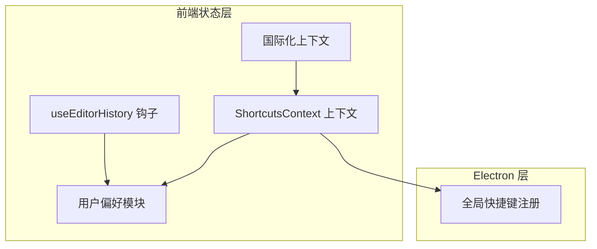
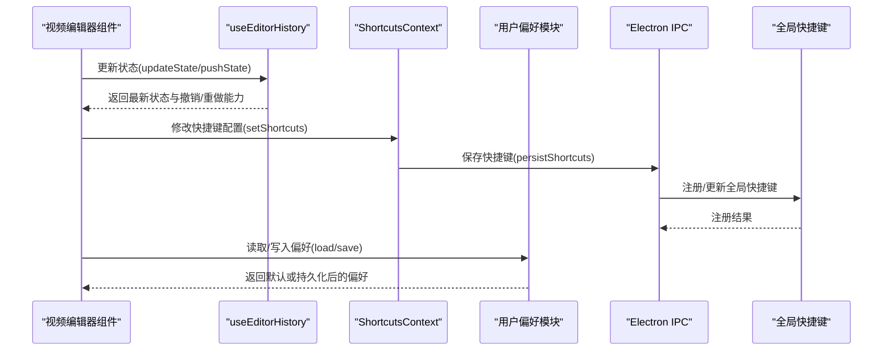
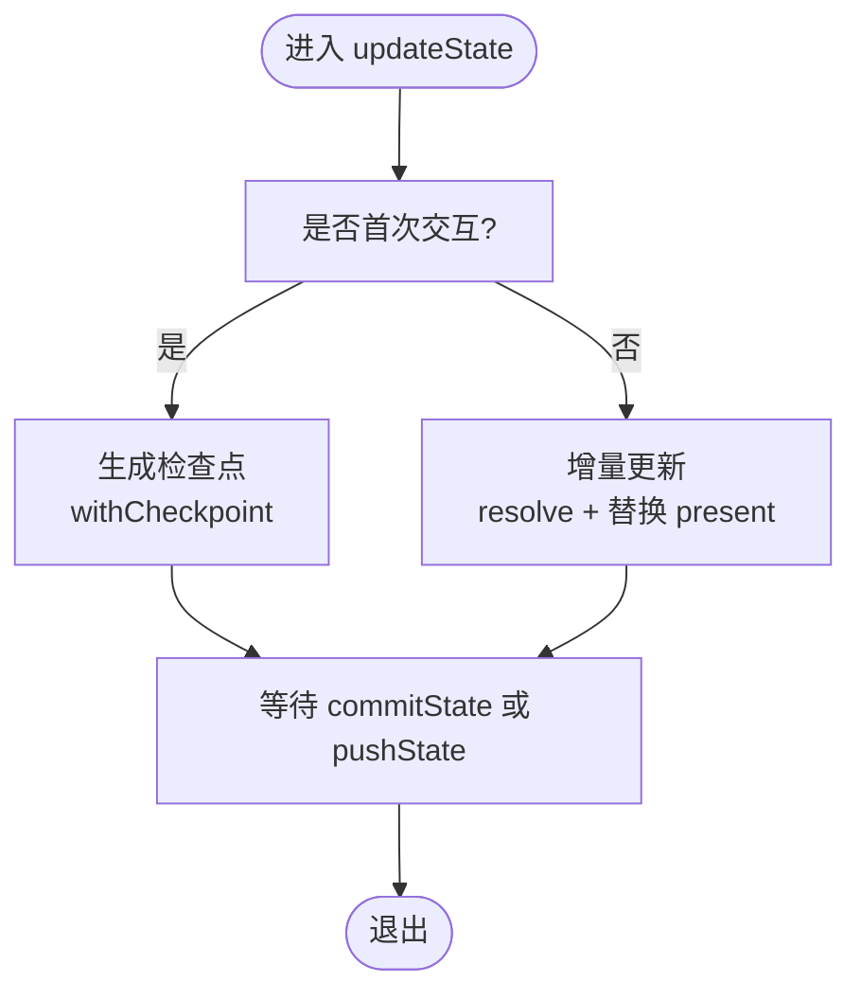
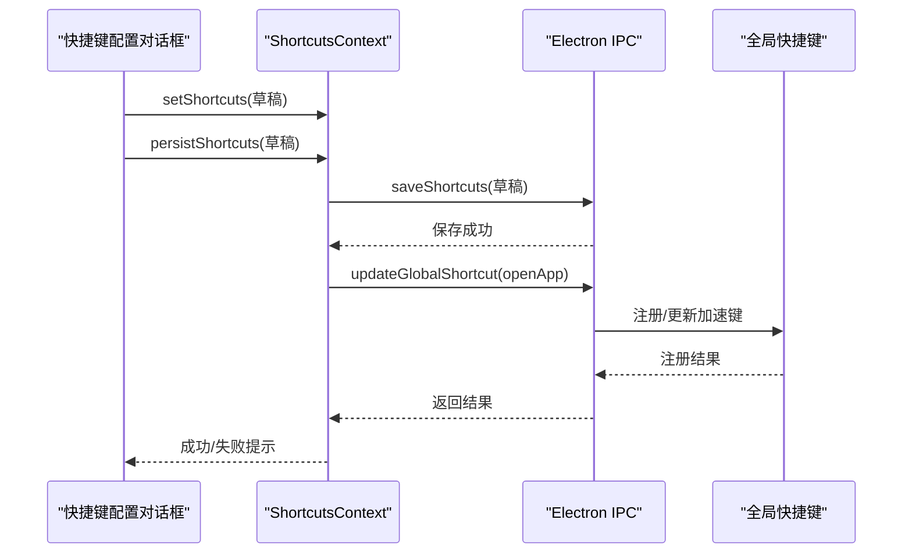
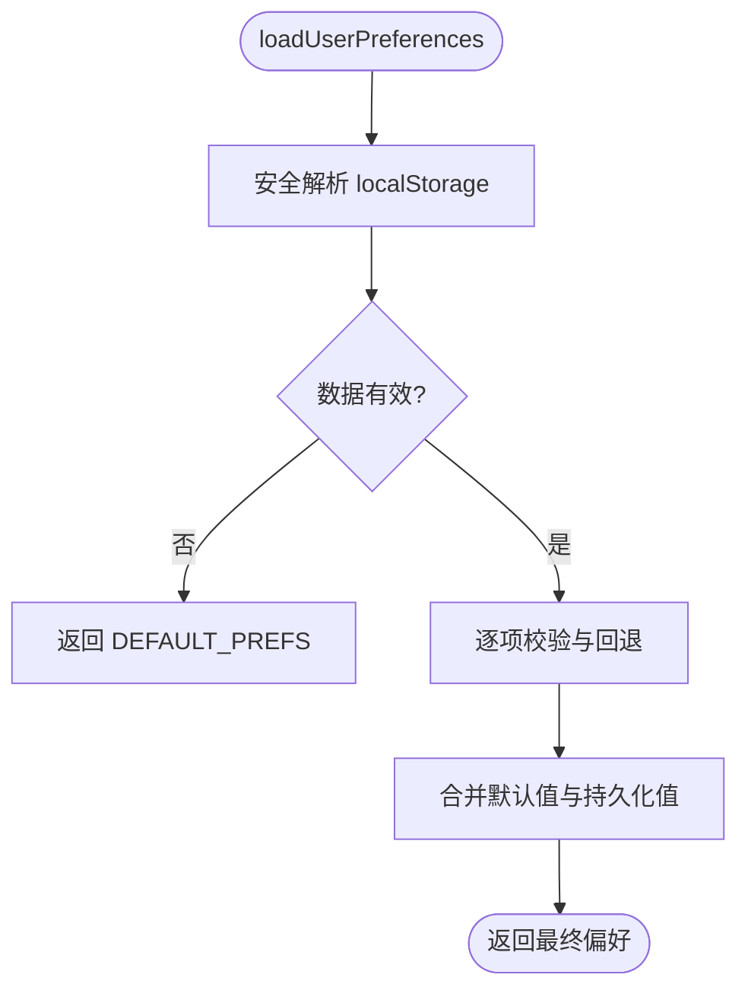
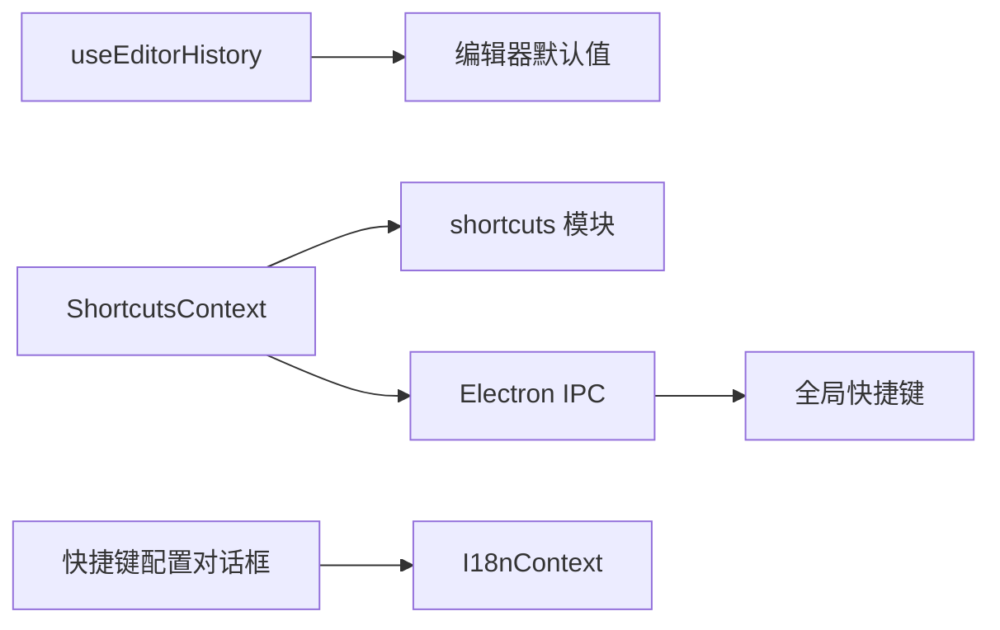

# 状态管理

<cite>
**本文引用的文件**
- [useEditorHistory.ts](file://src/hooks/useEditorHistory.ts)
- [ShortcutsContext.tsx](file://src/contexts/ShortcutsContext.tsx)
- [ShortcutsConfigDialog.tsx](file://src/components/video-editor/ShortcutsConfigDialog.tsx)
- [shortcuts.ts](file://src/lib/shortcuts.ts)
- [globalShortcut.ts](file://electron/globalShortcut.ts)
- [userPreferences.ts](file://src/lib/userPreferences.ts)
- [userPreferences.test.ts](file://src/lib/userPreferences.test.ts)
- [editorDefaults.test.ts](file://src/components/video-editor/editorDefaults.test.ts)
- [VideoEditor.tsx](file://src/components/video-editor/VideoEditor.tsx)
- [I18nContext.tsx](file://src/contexts/I18nContext.tsx)
</cite>

## 目录
1. [简介](#简介)
2. [项目结构](#项目结构)
3. [核心组件](#核心组件)
4. [架构总览](#架构总览)
5. [详细组件分析](#详细组件分析)
6. [依赖关系分析](#依赖关系分析)
7. [性能考量](#性能考量)
8. [故障排查指南](#故障排查指南)
9. [结论](#结论)
10. [附录](#附录)

## 简介
本文件系统性梳理 OpenScreen 的状态管理方案，重点覆盖以下方面：
- React Hooks 与上下文（Context）的实现策略
- useEditorHistory 编辑历史钩子：撤销/重做机制、状态快照管理、性能优化
- ShortcutsContext 快捷键上下文：快捷键绑定、冲突检测、动态更新与持久化
- 用户偏好设置：偏好项定义、localStorage 持久化与默认值处理
- 状态同步机制：跨组件共享、订阅与更新传播
- 最佳实践：状态结构设计、性能优化与内存泄漏防护
- 调试工具与常见问题解决方案

## 项目结构
围绕状态管理的关键目录与文件如下：
- 钩子与上下文：src/hooks、src/contexts
- 快捷键与全局快捷键：src/lib/shortcuts.ts、electron/globalShortcut.ts
- 用户偏好：src/lib/userPreferences.ts、src/lib/userPreferences.test.ts
- 视频编辑器状态与默认值：src/components/video-editor/editorDefaults.test.ts
- 视频编辑器主组件：src/components/video-editor/VideoEditor.tsx
- 国际化上下文：src/contexts/I18nContext.tsx

图表来源
- [useEditorHistory.ts:91-154](file://src/hooks/useEditorHistory.ts#L91-L154)
- [ShortcutsContext.tsx:31-83](file://src/contexts/ShortcutsContext.tsx#L31-L83)
- [shortcuts.ts:108-130](file://src/lib/shortcuts.ts#L108-L130)
- [globalShortcut.ts:41-47](file://electron/globalShortcut.ts#L41-L47)
- [userPreferences.ts:59-99](file://src/lib/userPreferences.ts#L59-L99)
- [I18nContext.tsx](file://src/contexts/I18nContext.tsx)

章节来源
- [useEditorHistory.ts:91-154](file://src/hooks/useEditorHistory.ts#L91-L154)
- [ShortcutsContext.tsx:31-83](file://src/contexts/ShortcutsContext.tsx#L31-L83)
- [shortcuts.ts:108-130](file://src/lib/shortcuts.ts#L108-L130)
- [globalShortcut.ts:41-47](file://electron/globalShortcut.ts#L41-L47)
- [userPreferences.ts:59-99](file://src/lib/userPreferences.ts#L59-L99)

## 核心组件
- useEditorHistory：提供编辑器状态的历史栈、撤销/重做、增量更新与提交控制
- ShortcutsContext：提供快捷键配置的全局状态、持久化与平台差异处理
- 用户偏好模块：封装偏好项、默认值与本地存储读写
- 全局快捷键注册：将前端快捷键配置映射到 Electron 的全局快捷键

章节来源
- [useEditorHistory.ts:91-154](file://src/hooks/useEditorHistory.ts#L91-L154)
- [ShortcutsContext.tsx:31-83](file://src/contexts/ShortcutsContext.tsx#L31-L83)
- [userPreferences.ts:59-99](file://src/lib/userPreferences.ts#L59-L99)
- [globalShortcut.ts:41-47](file://electron/globalShortcut.ts#L41-L47)

## 架构总览
OpenScreen 的状态管理采用“局部状态 + 上下文 + 本地存储”的分层策略：
- 局部状态：useEditorHistory 维护编辑器内部状态的历史栈
- 全局状态：ShortcutsContext 提供跨组件共享的快捷键配置
- 持久化：用户偏好通过 localStorage 存储；快捷键通过 Electron IPC 写入系统
- 同步：上下文提供 set/persist 方法，确保 UI 与系统级设置一致

图表来源
- [useEditorHistory.ts:98-110](file://src/hooks/useEditorHistory.ts#L98-L110)
- [ShortcutsContext.tsx:55-64](file://src/contexts/ShortcutsContext.tsx#L55-L64)
- [globalShortcut.ts:41-47](file://electron/globalShortcut.ts#L41-L47)
- [userPreferences.ts:59-99](file://src/lib/userPreferences.ts#L59-L99)

## 详细组件分析

### useEditorHistory 编辑历史钩子
- 设计目标
  - 提供撤销/重做能力，支持交互式实时更新（如拖拽滑块）
  - 控制“检查点”（checkpoint）以避免频繁快照导致的性能问题
- 关键机制
  - 历史栈结构：past/present/future 三段式，限制 past 长度防止无限增长
  - 实时更新策略：首次 updateState 生成检查点，后续增量更新不产生新快照
  - 提交机制：commitState 清除“交互中”标记，允许 pushState 生成新的检查点
  - 撤销/重做：基于 past/future 的弹出/拼接操作
- 性能优化
  - 使用 useCallback 包裹方法，减少子组件重渲染
  - 使用 useRef 标记交互状态，避免每次渲染生成新函数
  - 限制历史长度，避免内存膨胀
- 复杂度
  - 撤销/重做：O(1)（数组尾部操作）
  - 增量更新：O(1)（浅拷贝 + 单次解析）
  - 快照生成：O(n)（n 为状态树深度，受 resolve 函数影响）

图表来源
- [useEditorHistory.ts:98-110](file://src/hooks/useEditorHistory.ts#L98-L110)
- [useEditorHistory.ts:83-89](file://src/hooks/useEditorHistory.ts#L83-L89)

章节来源
- [useEditorHistory.ts:91-154](file://src/hooks/useEditorHistory.ts#L91-L154)

### ShortcutsContext 快捷键上下文
- 功能概述
  - 提供快捷键配置的全局状态与持久化接口
  - 支持平台差异（macOS 修饰键显示等）
  - 在应用启动时从 Electron 加载已保存的配置，并与默认值合并
- 冲突检测
  - 固定快捷键集合与可配置动作集合分别校验
  - 使用 bindingsEqual 比较键位组合（大小写不敏感、修饰键匹配）
- 动态更新与持久化
  - setShortcuts 更新内存状态
  - persistShortcuts 将配置写入 Electron 并尝试更新系统全局快捷键
- UI 集成
  - ShortcutsConfigDialog 提供可视化配置界面，支持捕获键盘事件、冲突提示与重置默认值

图表来源
- [ShortcutsContext.tsx:55-64](file://src/contexts/ShortcutsContext.tsx#L55-L64)
- [ShortcutsConfigDialog.tsx:104-113](file://src/components/video-editor/ShortcutsConfigDialog.tsx#L104-L113)
- [globalShortcut.ts:41-47](file://electron/globalShortcut.ts#L41-L47)

章节来源
- [ShortcutsContext.tsx:31-83](file://src/contexts/ShortcutsContext.tsx#L31-L83)
- [ShortcutsConfigDialog.tsx:28-139](file://src/components/video-editor/ShortcutsConfigDialog.tsx#L28-L139)
- [shortcuts.ts:81-106](file://src/lib/shortcuts.ts#L81-L106)

### 用户偏好设置管理
- 偏好项定义
  - 包括画布内边距、宽高比、导出质量/格式、最近一次导出目录、托盘布局等
- 默认值处理
  - DEFAULT_PREFS 提供强类型默认值
  - loadUserPreferences 对缺失或非法字段进行回退
- 持久化存储
  - 使用 localStorage 进行读写，键名固定
  - 安全解析：safeJsonParse 防止异常中断
- 一致性校验
  - 对枚举型字段（如导出格式、托盘布局）进行白名单校验
  - 数值型字段（如 padding）进行范围校验

图表来源
- [userPreferences.ts:59-99](file://src/lib/userPreferences.ts#L59-L99)

章节来源
- [userPreferences.ts:21-43](file://src/lib/userPreferences.ts#L21-L43)
- [userPreferences.ts:59-99](file://src/lib/userPreferences.ts#L59-L99)
- [userPreferences.test.ts:28-44](file://src/lib/userPreferences.test.ts#L28-L44)

### 状态同步机制
- 跨组件共享
  - ShortcutsContext 通过 Provider 暴露统一状态与方法
  - useShortcuts 钩子在各组件中消费状态，避免层层 props 下传
- 订阅与更新传播
  - 状态变更触发 React 重新渲染，子组件按需更新
  - 对于高频交互（如拖拽），使用 updateState 的增量更新策略降低开销
- 与系统级设置同步
  - 通过 persistShortcuts 与 Electron IPC 通信，确保系统全局快捷键与 UI 一致

章节来源
- [ShortcutsContext.tsx:31-83](file://src/contexts/ShortcutsContext.tsx#L31-L83)
- [useEditorHistory.ts:98-110](file://src/hooks/useEditorHistory.ts#L98-L110)

## 依赖关系分析
- useEditorHistory 依赖 INITIAL_EDITOR_STATE（由 editorDefaults 提供）
- ShortcutsContext 依赖 DEFAULT_SHORTCUTS 与 mergeWithDefaults（来自 shortcuts 模块）
- ShortcutsConfigDialog 依赖 I18nContext 获取多语言文案
- Electron globalShortcut 负责将前端绑定转换为系统加速键

图表来源
- [useEditorHistory.ts:91](file://src/hooks/useEditorHistory.ts#L91)
- [shortcuts.ts:108-130](file://src/lib/shortcuts.ts#L108-L130)
- [ShortcutsContext.tsx:55-64](file://src/contexts/ShortcutsContext.tsx#L55-L64)
- [globalShortcut.ts:41-47](file://electron/globalShortcut.ts#L41-L47)

章节来源
- [editorDefaults.test.ts:13-35](file://src/components/video-editor/editorDefaults.test.ts#L13-L35)
- [I18nContext.tsx](file://src/contexts/I18nContext.tsx)

## 性能考量
- 历史栈长度限制：past 切片仅保留有限数量的快照，避免内存占用持续增长
- 增量更新与检查点：交互过程中仅更新 present，首次交互生成检查点，减少不必要的快照
- useCallback 与 useMemo：对回调与派生值进行稳定化，降低子组件重渲染
- 引用标记：dirtyRef 用于区分交互中与提交后状态，避免重复快照
- 本地存储读写：JSON 解析与字段校验在加载时一次性完成，运行时保持轻量

章节来源
- [useEditorHistory.ts:83-89](file://src/hooks/useEditorHistory.ts#L83-L89)
- [useEditorHistory.ts:98-110](file://src/hooks/useEditorHistory.ts#L98-L110)
- [userPreferences.ts:46-53](file://src/lib/userPreferences.ts#L46-L53)

## 故障排查指南
- 快捷键冲突
  - 现象：保存配置时报冲突
  - 排查：确认是否命中 FIXED_SHORTCUTS 或与其他可配置动作绑定相同键位
  - 解决：更换键位或移除冲突绑定
- 全局快捷键未生效
  - 现象：修改后系统无响应
  - 排查：检查 persistShortcuts 返回值与 updateGlobalShortcut 结果
  - 解决：确保 Electron IPC 正常，必要时重启应用
- 偏好设置异常
  - 现象：偏好未生效或回退到默认值
  - 排查：检查 localStorage 中的 JSON 是否合法，字段类型与范围是否正确
  - 解决：清理无效条目或手动修复 JSON
- 撤销/重做失效
  - 现象：past/future 为空，无法撤销
  - 排查：确认是否频繁调用 pushState 导致 past 被截断
  - 解决：合理使用 updateState 与 commitState，避免过早 pushState

章节来源
- [shortcuts.ts:90-106](file://src/lib/shortcuts.ts#L90-L106)
- [ShortcutsContext.tsx:55-64](file://src/contexts/ShortcutsContext.tsx#L55-L64)
- [userPreferences.ts:59-99](file://src/lib/userPreferences.ts#L59-L99)
- [useEditorHistory.ts:116-136](file://src/hooks/useEditorHistory.ts#L116-L136)

## 结论
OpenScreen 的状态管理以清晰的职责分层与稳健的边界处理为核心：
- useEditorHistory 通过检查点与增量更新平衡了交互体验与性能
- ShortcutsContext 将 UI 状态与系统级设置解耦，提供完善的冲突检测与持久化
- 用户偏好模块以默认值与严格校验保障了可用性与一致性
- 建议在大型组件树中继续推广上下文与钩子的组合使用，配合 useMemo/useCallback 控制渲染成本

## 附录
- 状态调试建议
  - 使用 React DevTools Profiler 分析渲染热点
  - 在 Electron 主进程中记录全局快捷键注册日志
  - 在浏览器控制台观察 localStorage 变更与 JSON 解析错误
- 最佳实践清单
  - 优先使用不可变更新策略
  - 对高频状态使用 memo 化与稳定化回调
  - 将平台差异与系统集成逻辑收敛到上下文或服务层
  - 为关键状态提供默认值与降级路径